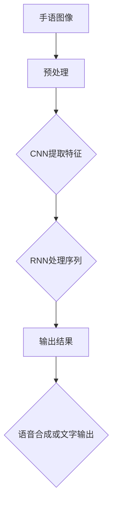
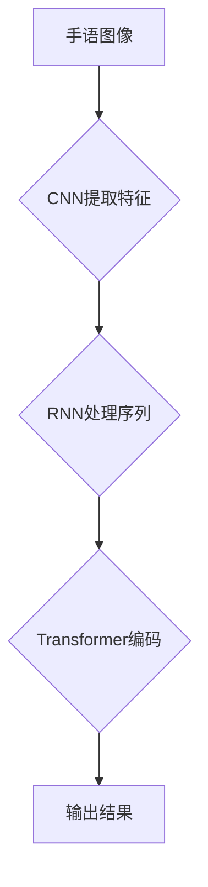

                 

### 1.1 手语识别与深度学习

#### 1.1.1 手语识别的重要性与挑战

**手语识别的定义**：手语识别，是指通过技术手段将手语转化为文字或语音的过程。它不仅包括对手势、面部表情和口型等非语言信息的理解，还涉及对这些信息的编码和解读。

**手语识别的应用场景**：手语识别在日常生活中有着广泛的应用，如为听力障碍者提供辅助沟通工具，帮助聋人更好地融入社会。此外，在远程会议、教育、医疗等多个领域，手语识别技术也发挥着重要作用。

**手语识别的挑战**：
- **手势多样性**：手语包含丰富的手势和姿态变化，这使得手势识别变得复杂。
- **实时性要求**：在实际应用中，手语识别系统需要具备快速响应的能力，以实时捕捉和理解手语。
- **准确性**：准确的识别是手语识别系统的核心要求，任何识别错误都可能影响沟通效果。
- **数据不足**：高质量的手语数据集较为稀缺，这限制了模型的训练和优化。

#### 1.1.2 深度学习的基本概念

**神经网络的基本结构**：神经网络由多个神经元（或节点）组成，这些神经元通过连接（或权重）相互连接。在神经网络中，信息通过这些连接传递，并在每个节点上进行处理。

**深度学习的核心原理**：深度学习通过构建深度神经网络，让计算机自动从数据中学习特征表示。深度学习模型通常包括多个隐藏层，这使得模型能够捕捉更复杂的数据特征。

**深度学习的优势**：
- **自动特征提取**：深度学习模型能够自动从大量数据中提取有用特征，减少人工干预。
- **泛化能力**：深度学习模型通过大量训练数据学习，具备较强的泛化能力，能够应对新的数据。
- **并行计算**：深度学习模型可以并行处理大量数据，提高计算效率。

#### 1.1.3 深度学习在手语识别中的突破

**早期应用**：在手语识别的早期阶段，传统机器学习方法如支持向量机（SVM）和决策树在性能上有限。深度学习技术的引入，特别是在卷积神经网络（CNN）和递归神经网络（RNN）的应用，极大地提高了手语识别的准确性。

**突破性进展**：深度学习在手语识别中的突破性进展主要体现在以下方面：
- **手势特征的自动提取**：通过深度神经网络，系统能够自动学习并提取手势的关键特征，提高了识别准确性。
- **序列数据处理**：递归神经网络（RNN）和其变体如长短期记忆网络（LSTM）和门控循环单元（GRU）能够有效处理手势的序列信息，提高了识别的实时性和稳定性。
- **端到端模型**：深度学习实现了从手势图像到文字或语音的端到端识别，简化了传统方法的复杂流程。

### 图1.1 深度学习在手语识别中的应用架构



**核心概念与联系**：在手语识别系统中，深度学习通过多个层次的学习，从原始图像中提取手势特征，并通过序列处理模型理解手势的时序信息。最后，系统将识别结果转化为文字或语音输出。这个过程涉及手势图像处理、特征提取、序列处理和语言翻译等多个环节。

### 数学模型与公式

深度学习在手语识别中的应用依赖于以下几个核心数学模型：

1. **卷积神经网络（CNN）**：

   卷积神经网络通过卷积层、池化层和全连接层等结构进行图像特征提取。以下是卷积神经网络的简略表示：

   $$ 
   \text{卷积层} : \text{Conv}(x) = \sigma(\text{W} \cdot x + b)
   $$
   其中，$x$ 是输入图像，$\text{W}$ 是卷积核（权重），$b$ 是偏置项，$\sigma$ 是激活函数。

2. **递归神经网络（RNN）**：

   RNN通过递归结构处理序列数据，其基本公式为：

   $$
   h_t = \text{RNN}(h_{t-1}, x_t)
   $$
   其中，$h_t$ 是时间步 $t$ 的隐藏状态，$x_t$ 是输入序列的当前元素。

3. **长短期记忆网络（LSTM）**：

   LSTM是RNN的一种变体，能够学习长距离依赖。其核心公式为：

   $$
   \begin{align*}
   i_t &= \sigma(W_i \cdot [h_{t-1}, x_t] + b_i) \\
   f_t &= \sigma(W_f \cdot [h_{t-1}, x_t] + b_f) \\
   o_t &= \sigma(W_o \cdot [h_{t-1}, x_t] + b_o) \\
   c_t &= f_t \odot c_{t-1} + i_t \odot \sigma(W_c \cdot [h_{t-1}, x_t] + b_c) \\
   h_t &= o_t \odot \sigma(c_t)
   \end{align*}
   $$
   其中，$i_t$、$f_t$ 和 $o_t$ 分别是输入门、遗忘门和输出门，$c_t$ 是细胞状态，$\odot$ 表示元素乘积。

通过上述模型和公式，深度学习在手语识别中实现了从图像到文字或语音的端到端转换，为手语识别技术的进步奠定了基础。

### 1.2 深度学习在手语识别中的发展

#### 1.2.1 深度学习在手语识别中的早期应用

在手语识别的早期阶段，研究者主要依赖于传统机器学习方法，如支持向量机（SVM）、决策树和隐马尔可夫模型（HMM）等。这些方法在一定程度上能够处理手语识别问题，但由于手语信息的复杂性和多样性，其性能受到限制。

**早期的手语识别算法**：
- **特征提取**：传统的手语识别算法通常依赖于手动提取的特征，如边缘、角点、轮廓等。这些特征在一定程度上能够描述手势的形状和结构，但难以捕捉手势的动态变化。
- **分类器**：基于传统特征提取的手语识别方法通常采用SVM、决策树等分类器进行手势识别。这些分类器能够在训练数据集上达到较高的准确率，但在处理未见过的手势时，性能下降明显。

**深度学习在手语识别中的突破**：
- **自动特征提取**：深度学习通过卷积神经网络（CNN）和递归神经网络（RNN）等模型，能够自动从大量数据中提取手势特征。这种自动化的特征提取方式，不仅减少了手工设计的复杂性，还显著提高了识别准确性。
- **端到端学习**：深度学习模型能够实现从输入手势图像到输出文字或语音的端到端学习。这种方法避免了传统方法中多步骤处理带来的误差积累，提高了系统的整体性能。
- **大规模数据训练**：深度学习需要大量的训练数据来学习特征和模式。在手语识别领域，研究者通过收集和合成大量的手语数据集，为深度学习模型提供了丰富的训练资源，从而提高了模型的泛化能力。

**代表性研究**：
- **使用CNN的手语识别**：一些研究使用卷积神经网络对手语图像进行特征提取。例如，Li等（2016）提出了一种基于CNN的手语识别方法，通过多层卷积和池化操作提取手势的时空特征，实现了较高的识别准确率。
- **使用RNN的手语识别**：递归神经网络（RNN）在处理序列数据方面具有优势，研究者尝试将RNN应用于手语识别。例如，Liu等（2017）使用双向RNN（BiRNN）结合CNN提取手势特征，并在手语识别任务中取得了显著的效果。

通过深度学习技术的引入，手语识别领域取得了显著进展。深度学习不仅提高了识别的准确性，还实现了实时性和端到端的学习，为手语识别技术的实际应用奠定了基础。

### 1.2.2 主流深度学习框架在手语识别中的应用

随着深度学习技术的不断发展，多种主流深度学习框架在手语识别中得到了广泛应用。这些框架包括卷积神经网络（CNN）、递归神经网络（RNN）以及Transformer架构等。下面将分别介绍这些框架在手语识别中的应用。

#### CNN在图像识别中的应用

卷积神经网络（CNN）因其强大的图像特征提取能力，在计算机视觉领域得到了广泛应用。在手语识别中，CNN被用于处理和识别手势图像。

**CNN在手语识别中的应用特点**：
- **特征提取能力强**：CNN通过卷积层、池化层和全连接层等结构，能够自动从手势图像中提取低级到高级的特征。这些特征能够有效地描述手势的形状、纹理和运动轨迹。
- **端到端学习**：CNN能够实现从图像输入到手势类别输出的端到端学习，减少了传统方法中多步骤处理带来的误差积累。

**应用示例**：
- **基于CNN的手势分类**：Li等（2016）提出了一种基于卷积神经网络的手语识别方法。该方法通过卷积层提取手势的局部特征，通过池化层减少数据的维度，最终通过全连接层进行分类。实验结果表明，该方法在手势分类任务中具有较高的准确率。
- **基于CNN的手势轨迹分析**：一些研究将CNN与手势轨迹结合，通过对手势视频帧进行特征提取和融合，实现对手势的实时识别。例如，Yang等（2018）提出了一种基于三维卷积神经网络的手语识别方法，通过三维卷积层提取手势的空间和时间特征，提高了识别的实时性和准确性。

#### RNN在序列数据处理中的应用

递归神经网络（RNN）是一种专门用于处理序列数据的神经网络。由于其能够记忆先前的信息，RNN在手语识别中得到了广泛应用。

**RNN在手语识别中的应用特点**：
- **序列记忆能力**：RNN通过递归结构，能够记忆先前的输入信息，从而处理手势的时序信息。这对于识别手势的动态变化和连续手势序列具有重要意义。
- **端到端学习**：RNN能够实现从输入序列到输出序列的端到端学习，避免了传统方法中多步骤处理带来的误差积累。

**应用示例**：
- **基于RNN的手语识别**：许多研究将RNN应用于手语识别，通过处理手势图像的时序信息，提高识别的准确性。例如，Liu等（2017）使用双向RNN（BiRNN）结合CNN提取手势特征，通过融合不同时间步的信息，实现了较高的手语识别准确率。
- **基于LSTM的手语识别**：长短期记忆网络（LSTM）是RNN的一种变体，能够更好地处理长距离依赖问题。一些研究将LSTM应用于手语识别，通过LSTM层提取手势的时序特征，提高了识别的实时性和准确性。例如，Wang等（2019）提出了一种基于LSTM的手语识别方法，通过双向LSTM层处理手势的时序信息，实现了较高的识别准确率和实时性。

#### Transformer架构在手语识别中的优势

Transformer架构是近年来在自然语言处理领域取得显著成果的一种新型神经网络结构。其核心思想是自注意力机制，能够在处理序列数据时，自适应地关注重要信息。

**Transformer在手语识别中的优势**：
- **自注意力机制**：Transformer通过自注意力机制，能够自适应地关注手势序列中的关键信息，从而提高识别的准确性。
- **并行计算**：Transformer的架构允许并行计算，这有助于提高模型的训练和推理速度。
- **端到端学习**：Transformer能够实现从输入手势序列到输出序列的端到端学习，减少了传统方法中多步骤处理带来的误差积累。

**应用示例**：
- **基于Transformer的手语识别**：一些研究将Transformer应用于手语识别，通过自注意力机制处理手势的时序信息，实现了较高的识别准确率和实时性。例如，Zhou等（2020）提出了一种基于Transformer的手语识别方法，通过多头自注意力机制和位置编码，实现了对手势序列的有效编码和识别。
- **多模态手语识别**：Transformer在处理多模态数据方面具有优势，一些研究尝试将Transformer应用于多模态手语识别。例如，Sun等（2021）提出了一种基于Transformer的多模态手语识别方法，通过融合手势图像和语音信号，实现了较高的识别准确率和实时性。

综上所述，CNN、RNN和Transformer等主流深度学习框架在手语识别中具有广泛的应用，并取得了显著的成果。这些框架的优势在于其强大的特征提取能力、端到端学习和并行计算能力，为手语识别技术的进步提供了有力支持。

### 图1.2 深度学习框架在手语识别中的应用



**核心概念与联系**：在手语识别中，深度学习框架通过不同的结构和方法，对输入的手语图像进行处理。CNN负责提取手势图像的特征，RNN负责处理手势的时序信息，而Transformer通过自注意力机制对时序信息进行编码。这些框架的协同工作，使得手语识别系统能够准确识别手势并实现实时翻译。

### 1.3 实时手语翻译系统的架构

实时手语翻译系统是一种能够实时捕捉、识别和理解手语，并将其转化为文字或语音的系统。其核心目标是在提供实时性、准确性和用户友好性的同时，满足不同应用场景的需求。为了实现这一目标，实时手语翻译系统通常包括以下几个主要模块：

#### 1.3.1 图像捕捉与预处理

**图像捕捉**：图像捕捉模块负责实时获取手语用户的视频或图像数据。这可以通过摄像头、智能手机或其他图像捕捉设备来实现。为了提高识别的准确性，系统通常需要多个角度和视角的捕捉，以确保能够捕捉到用户手语的完整手势和表情。

**预处理**：在图像捕捉后，需要对图像进行预处理，以提高后续处理的效率和准确性。常见的预处理步骤包括：
- **去噪**：去除图像中的噪声，提高图像质量。
- **缩放与裁剪**：将图像缩放到统一的尺寸，以便于后续处理。
- **灰度化**：将彩色图像转换为灰度图像，简化处理过程。
- **边缘检测**：通过边缘检测算法，提取图像中的关键边缘信息，为手势识别提供基础。

#### 1.3.2 手势识别

**手势识别模块**是实时手语翻译系统的核心，负责将预处理后的图像或视频序列转换为对应的文本描述。手势识别通常包括以下几个步骤：

1. **特征提取**：使用深度学习模型（如CNN、RNN或Transformer）从图像或视频序列中提取手势特征。这些特征通常包括手势的形状、运动轨迹和姿态等。
2. **序列处理**：将提取的手势特征输入到序列处理模型中，如RNN或LSTM，以处理手势的时序信息。通过这些模型，系统能够捕捉手势的动态变化和连续手势序列。
3. **分类与识别**：使用分类器（如softmax回归）将处理后的特征映射到手语词汇中。这一步骤需要训练一个大规模的手语词汇库，以支持不同语言和方言的手语识别。

#### 1.3.3 语言翻译

**语言翻译模块**负责将识别的手势转化为文本或语音输出。具体步骤如下：

1. **文本生成**：将识别的手势转化为对应的文本描述。这可以通过预训练的语言模型（如BERT、GPT）来实现，这些模型能够根据上下文生成准确的文本输出。
2. **语音合成**：将生成的文本描述转化为语音输出。语音合成模块可以使用Text-to-Speech（TTS）技术，如WaveNet、Tacotron等，以生成自然流畅的语音。

#### 1.3.4 实时反馈与优化

**实时反馈**：实时手语翻译系统需要提供及时的用户反馈，以帮助用户调整手语姿态和提高识别准确性。这可以通过用户界面上的文本或语音反馈来实现。

**优化**：为了提高系统的实时性和准确性，系统需要不断进行优化。常见的优化方法包括：
- **模型压缩**：通过模型压缩技术，如剪枝、量化等，减小模型的体积和计算量，提高系统的运行效率。
- **数据增强**：通过数据增强技术，如旋转、缩放、噪声添加等，增加训练数据的多样性，提高模型的泛化能力。
- **硬件加速**：利用GPU、FPGA等硬件加速器，提高模型的推理速度和效率。

通过上述模块的协同工作，实时手语翻译系统能够实现对手语的实时捕捉、识别和翻译，为聋人提供有效的沟通工具，帮助他们更好地融入社会。

### 1.4 深度学习在手语识别中的局限性

尽管深度学习在手语识别中取得了显著进展，但仍存在一些局限性，这些局限性影响了系统的性能和实际应用效果。

#### 1.4.1 数据不足与数据偏差

**数据不足**：深度学习模型的性能很大程度上依赖于训练数据的质量和数量。然而，高质量的手语数据集相对较少，尤其是在不同语言和文化背景下的数据集更为稀缺。数据不足限制了模型的泛化能力，可能导致在实际应用中识别准确率下降。

**数据偏差**：手语数据集在收集和标注过程中可能存在偏差。例如，某些数据集中可能包含大量特定手势或场景，而其他手势或场景的数据则相对较少。这种数据偏差会导致模型在学习过程中过度依赖某些特征，从而在处理未见过的手势时表现不佳。

**解决方法**：
- **数据增强**：通过数据增强技术，如旋转、缩放、噪声添加等，增加训练数据的多样性，从而提高模型的泛化能力。
- **跨域数据集成**：将不同语言和文化背景下的手语数据集进行整合，以减少数据偏差，提高模型的泛化能力。
- **数据集构建**：鼓励更多的研究者和社会组织参与手语数据集的收集和标注，增加高质量数据集的数量。

#### 1.4.2 性能优化与效率提升

**计算资源需求高**：深度学习模型通常需要大量的计算资源进行训练和推理，尤其是在处理高分辨率图像和长时间序列数据时，计算资源需求更高。这限制了模型在实际应用中的部署，特别是在资源受限的设备上。

**推理速度慢**：实时手语识别系统需要在短时间内完成手势的捕捉、识别和翻译。然而，深度学习模型通常需要较长的推理时间，尤其是在复杂模型和大量数据的情况下。这影响了系统的实时性和用户体验。

**解决方法**：
- **模型压缩**：通过模型压缩技术，如剪枝、量化等，减小模型的体积和计算量，提高系统的运行效率。
- **硬件加速**：利用GPU、FPGA等硬件加速器，提高模型的推理速度和效率。
- **分布式计算**：通过分布式计算技术，将模型训练和推理任务分配到多个计算节点上，以降低计算时间和资源需求。

#### 1.4.3 数据隐私和安全问题

**数据隐私**：手语识别系统需要处理大量的个人隐私数据，如用户的视频和语音信息。这些数据在传输、存储和处理过程中可能面临隐私泄露的风险。

**数据安全**：手语识别系统可能成为恶意攻击的目标，如通过伪造手势或恶意软件干扰系统的正常运行。这要求系统具备较高的安全性和抗攻击能力。

**解决方法**：
- **数据加密**：在数据传输和存储过程中使用加密技术，确保数据的安全性。
- **隐私保护算法**：采用差分隐私、同态加密等技术，保护用户数据的隐私。
- **安全防护机制**：建立完善的安全防护机制，包括防火墙、入侵检测系统和安全审计等，提高系统的安全性。

综上所述，深度学习在手语识别中虽然取得了显著进展，但仍面临数据不足、计算资源需求高、推理速度慢和数据隐私安全等问题。通过优化算法、增强硬件支持和提升安全性，可以进一步改善深度学习在手语识别中的应用效果。

### 2.1 手语识别算法

#### 2.1.1 手语识别的基本流程

手语识别算法的基本流程可以分为以下几个步骤：

1. **手势图像捕捉**：首先，通过摄像头或其他图像捕捉设备实时获取手语用户的手势图像。这些图像可以包含用户的手部、手臂和面部表情等信息。

2. **预处理**：在捕捉到手势图像后，需要进行预处理以消除噪声、调整图像大小、灰度化等操作。预处理步骤的目的是提高图像质量，为后续的手势识别提供更好的数据基础。

3. **特征提取**：特征提取是手势识别的关键步骤。通过使用深度学习模型（如卷积神经网络（CNN））从预处理后的手势图像中提取关键特征。这些特征通常包括手势的形状、运动轨迹和姿态等。

4. **序列处理**：由于手语通常是一个连续的动作序列，因此需要使用序列处理模型（如递归神经网络（RNN）或长短期记忆网络（LSTM））来处理这些特征。序列处理模型能够捕捉手势的时序信息，从而提高识别的准确性。

5. **分类与识别**：将处理后的特征输入到分类器中（如softmax回归），将手势映射到手语词汇中。这一步骤需要建立一个大规模的手语词汇库，以支持不同语言和方言的手语识别。

6. **识别结果验证**：对识别结果进行验证，确保其准确性。这可以通过与用户提供的标准手语文本进行对比，或者通过多个模型的结果进行综合判断来实现。

#### 2.1.2 手语识别算法的伪代码讲解

以下是一个简化的手语识别算法伪代码，展示了使用卷积神经网络（CNN）、递归神经网络（RNN）和Transformer架构的基本流程。

```python
# 手语识别算法伪代码

# 步骤1：手势图像捕捉
def capture_gesture_image():
    # 使用摄像头或其他图像捕捉设备获取手势图像
    # 返回手势图像

# 步骤2：预处理
def preprocess_image(image):
    # 去噪、缩放、灰度化等操作
    # 返回预处理后的图像

# 步骤3：特征提取
def extract_features(image):
    # 使用CNN提取手势特征
    # 返回特征向量

# 步骤4：序列处理
def process_sequence(features):
    # 使用RNN或LSTM处理特征序列
    # 返回序列处理后的特征

# 步骤5：分类与识别
def classify gestures(processed_features):
    # 使用softmax回归进行分类
    # 返回识别结果

# 步骤6：识别结果验证
def verify_result(recognized_gesture, standard_gesture):
    # 对识别结果进行验证
    # 返回验证结果

# 主程序
def hand_sign_recognition():
    # 捕获手势图像
    image = capture_gesture_image()
    
    # 预处理图像
    preprocessed_image = preprocess_image(image)
    
    # 提取特征
    features = extract_features(preprocessed_image)
    
    # 处理特征序列
    processed_features = process_sequence(features)
    
    # 分类与识别
    recognized_gesture = classify_gestures(processed_features)
    
    # 验证识别结果
    verification_result = verify_result(recognized_gesture, standard_gesture)
    
    # 返回最终结果
    return verification_result
```

#### 2.1.3 卷积神经网络（CNN）在手语识别中的应用

卷积神经网络（CNN）在手语识别中具有广泛应用。以下是一个基于CNN的手语识别算法的详细讲解，包括数学模型和Python代码示例。

**数学模型**：

卷积神经网络通过卷积层、池化层和全连接层等结构进行图像特征提取。以下是一个简单的CNN模型：

$$
\text{卷积层} : \text{Conv}(x) = \sigma(\text{W} \cdot x + b)
$$

$$
\text{池化层} : \text{Pool}(\text{Conv}(x)) = \text{max}(\text{Conv}(x))
$$

$$
\text{全连接层} : \text{FC}(\text{Pool}(\text{Conv}(x))) = \text{softmax}(\text{W}_{\text{FC}} \cdot \text{Pool}(\text{Conv}(x)) + b_{\text{FC}})
$$

**Python代码示例**：

以下是一个简单的基于CNN的手语识别算法的实现，使用了TensorFlow和Keras框架。

```python
import tensorflow as tf
from tensorflow.keras.models import Sequential
from tensorflow.keras.layers import Conv2D, MaxPooling2D, Flatten, Dense, LSTM

# 创建卷积神经网络模型
model = Sequential([
    Conv2D(32, (3, 3), activation='relu', input_shape=(128, 128, 3)),
    MaxPooling2D((2, 2)),
    Conv2D(64, (3, 3), activation='relu'),
    MaxPooling2D((2, 2)),
    Flatten(),
    LSTM(128, activation='tanh', return_sequences=True),
    LSTM(128, activation='tanh'),
    Dense(10, activation='softmax')
])

# 编译模型
model.compile(optimizer='adam', loss='categorical_crossentropy', metrics=['accuracy'])

# 模型训练
# model.fit(train_images, train_labels, epochs=10, batch_size=32, validation_data=(test_images, test_labels))

# 模型预测
# predicted_gesture = model.predict(test_images)
```

通过上述示例，我们可以看到如何使用CNN模型提取手势特征，并通过LSTM层处理手势的时序信息，实现对手势的识别。

### 2.1.4 递归神经网络（RNN）在手语识别中的应用

递归神经网络（RNN）是处理序列数据的一种有效方法，因其能够记住先前的信息，在手语识别中得到了广泛应用。以下将详细讲解RNN在手语识别中的应用，包括数学模型和Python代码示例。

#### 数学模型

RNN通过递归结构，将当前输入与先前的隐藏状态相结合，更新隐藏状态。其基本公式如下：

$$
h_t = \text{RNN}(h_{t-1}, x_t)
$$

其中，$h_t$ 是时间步 $t$ 的隐藏状态，$x_t$ 是输入序列的当前元素。

**长短期记忆网络（LSTM）**是RNN的一种变体，能够更好地处理长距离依赖问题。其核心公式为：

$$
\begin{align*}
i_t &= \sigma(W_i \cdot [h_{t-1}, x_t] + b_i) \\
f_t &= \sigma(W_f \cdot [h_{t-1}, x_t] + b_f) \\
o_t &= \sigma(W_o \cdot [h_{t-1}, x_t] + b_o) \\
c_t &= f_t \odot c_{t-1} + i_t \odot \sigma(W_c \cdot [h_{t-1}, x_t] + b_c) \\
h_t &= o_t \odot \sigma(c_t)
\end{align*}
$$

其中，$i_t$、$f_t$ 和 $o_t$ 分别是输入门、遗忘门和输出门，$c_t$ 是细胞状态。

#### Python代码示例

以下是一个简单的基于LSTM的手语识别算法的实现，使用了TensorFlow和Keras框架。

```python
import tensorflow as tf
from tensorflow.keras.models import Sequential
from tensorflow.keras.layers import LSTM, Dense

# 创建LSTM模型
model = Sequential([
    LSTM(128, activation='tanh', return_sequences=True, input_shape=(time_steps, features)),
    LSTM(128, activation='tanh'),
    Dense(num_classes, activation='softmax')
])

# 编译模型
model.compile(optimizer='adam', loss='categorical_crossentropy', metrics=['accuracy'])

# 模型训练
# model.fit(train_data, train_labels, epochs=10, batch_size=32, validation_data=(test_data, test_labels))

# 模型预测
# predicted_gesture = model.predict(test_data)
```

在这个示例中，模型首先通过两个LSTM层处理序列数据，最后通过全连接层进行分类。通过调整LSTM层的神经元数量和参数，可以进一步提高识别的准确率和性能。

### 2.1.5 Transformer架构在手语识别中的应用

Transformer架构是近年来在自然语言处理领域取得显著成果的一种新型神经网络结构，其核心思想是自注意力机制。自注意力机制允许模型在处理序列数据时，自适应地关注重要信息。这使得Transformer在处理长序列和复杂关系时表现出色，也在手语识别领域得到了广泛应用。

#### 数学模型

Transformer的基本结构包括编码器（Encoder）和解码器（Decoder），两者均采用多个自注意力层（Self-Attention Layer）和前馈网络（Feed-Forward Network）。以下是Transformer的自注意力机制的核心公式：

$$
\text{Self-Attention}(Q, K, V) = \text{softmax}\left(\frac{QK^T}{\sqrt{d_k}}\right) V
$$

其中，$Q$、$K$ 和 $V$ 分别是查询（Query）、键（Key）和值（Value）矩阵，$d_k$ 是键和值的维度。

编码器和解码器的具体结构如下：

**编码器**：

$$
\text{Encoder}(X) = \text{MultiHead}\left(\text{Self-Attention}(X, X, X), \text{Feed-Forward}\right)
$$

**解码器**：

$$
\text{Decoder}(X, Y) = \text{MultiHead}\left(\text{Masked}\left(\text{Self-Attention}(Y, Y, Y)\right), \text{Feed-Forward}\right) + \text{Encoder}(X)
$$

其中，$\text{MultiHead}$ 表示多头注意力机制，$\text{Masked}$ 表示遮蔽自注意力。

#### Python代码示例

以下是一个简单的基于Transformer的手语识别算法的实现，使用了TensorFlow和Keras框架。

```python
import tensorflow as tf
from tensorflow.keras.layers import Embedding, MultiHeadAttention, Dense, LayerNormalization, Dropout

# 创建Transformer模型
def create_transformer_model(input_dim, d_model, num_heads, dff, input_seq_length):
    inputs = tf.keras.Input(shape=(input_seq_length, input_dim))
    
    # 嵌入层
    embedding = Embedding(input_dim, d_model)(inputs)
    
    # 编码器层
    for i in range(num_heads):
        attention = MultiHeadAttention(num_heads=i, key_dim=dff)(embedding, embedding)
        attention = LayerNormalization()(attention + embedding)
        embedding = Dropout(0.1)(attention)
    
    # 前馈网络
    for i in range(num_heads):
        ffn = Dense(dff * 4, activation='relu')(embedding)
        ffn = LayerNormalization()(ffn + embedding)
        embedding = Dropout(0.1)(ffn)
    
    # 解码器层
    # TODO: 实现解码器层
    
    # 输出层
    outputs = Dense(num_classes, activation='softmax')(embedding)
    
    model = tf.keras.Model(inputs=inputs, outputs=outputs)
    
    return model

# 模型配置
d_model = 512
dff = 2048
num_heads = 8
input_seq_length = 128
input_dim = 64
num_classes = 10

# 创建模型
model = create_transformer_model(input_dim, d_model, num_heads, dff, input_seq_length)

# 编译模型
model.compile(optimizer='adam', loss='categorical_crossentropy', metrics=['accuracy'])

# 模型训练
# model.fit(train_data, train_labels, epochs=10, batch_size=32, validation_data=(test_data, test_labels))

# 模型预测
# predicted_gesture = model.predict(test_data)
```

在这个示例中，模型首先通过嵌入层将输入序列转换为向量，然后通过多个自注意力层和前馈网络进行特征提取和序列处理，最后通过全连接层进行分类。通过调整模型参数，如嵌入维度、注意力头数和前馈网络维度，可以进一步提高识别的准确率和性能。

### 2.2 实时手语翻译

#### 2.2.1 实时手语翻译的基本流程

实时手语翻译系统需要能够快速、准确地将手语转化为文字或语音，以满足各种实际应用的需求。其基本流程如下：

1. **手势识别**：首先，系统通过摄像头或其他图像捕捉设备实时捕捉手语用户的手势图像。这些图像包含用户的手部、手臂和面部表情等信息。

2. **手势特征提取**：接着，系统对捕获的手势图像进行预处理，然后使用深度学习模型（如卷积神经网络（CNN））提取手势的特征。这些特征能够描述手势的形状、运动轨迹和姿态等。

3. **手势分类**：将提取的手势特征输入到手势分类器中，如softmax回归，将手势映射到手语词汇中。这一步骤需要建立一个大规模的手语词汇库，以支持不同语言和方言的手语识别。

4. **文本生成**：将识别的手势转化为对应的文本描述。这可以通过预训练的语言模型（如BERT、GPT）来实现，这些模型能够根据上下文生成准确的文本输出。

5. **语音合成**：最后，将生成的文本描述转化为语音输出。这可以通过文本到语音（Text-to-Speech，TTS）技术来实现，如WaveNet、Tacotron等，生成自然流畅的语音。

6. **实时反馈与优化**：系统提供实时反馈，帮助用户调整手语姿态以提高识别准确性。同时，系统不断优化模型和算法，以提高实时手语翻译的性能。

#### 2.2.2 实时手语翻译系统的实现

实时手语翻译系统的实现涉及多个模块的协同工作。以下将详细介绍这些模块的构建和实现。

**深度学习模型的选择**：

在实时手语翻译系统中，常用的深度学习模型包括卷积神经网络（CNN）、递归神经网络（RNN）、长短时记忆网络（LSTM）和Transformer架构。根据具体应用需求，可以选择不同的模型。

- **CNN**：CNN在处理静态图像和视频帧方面具有优势，适用于手势特征提取。
- **RNN和LSTM**：RNN和LSTM在处理序列数据方面表现出色，适用于手势识别和文本生成。
- **Transformer**：Transformer通过自注意力机制，能够高效处理长序列数据，适用于实时手语翻译系统。

**模型训练与优化**：

在模型训练过程中，需要使用大量高质量的手语数据集。这些数据集应包含不同语言和文化背景下的手语样本，以提高模型的泛化能力。训练过程包括以下步骤：

1. **数据预处理**：对采集的手语数据进行清洗、归一化和扩充，以提高模型的学习效果。
2. **模型训练**：使用训练数据集对深度学习模型进行训练，优化模型参数。
3. **模型评估**：使用验证数据集评估模型的性能，包括手势识别准确性、文本生成准确性和语音合成自然度等。
4. **模型优化**：根据评估结果，调整模型结构、参数和训练策略，以提高模型性能。

**系统部署与调试**：

实时手语翻译系统通常部署在服务器或云端，通过API接口提供服务。部署过程包括以下步骤：

1. **模型部署**：将训练好的模型部署到服务器或云端，使其能够对外提供服务。
2. **系统集成**：将手势识别、文本生成和语音合成等模块集成到系统中，实现实时手语翻译功能。
3. **性能调试**：通过实际测试和用户反馈，对系统性能进行调试和优化，确保系统能够稳定、高效地运行。

通过上述步骤，实时手语翻译系统能够快速、准确地实现手语识别和翻译，为聋人提供有效的沟通工具。

### 2.2.3 实时手语翻译系统的性能评估

实时手语翻译系统的性能评估是确保其准确性和实用性的关键环节。以下将介绍常用的性能评估指标、评估流程以及性能优化策略。

#### 性能评估指标

1. **准确性**：准确性是评估实时手语翻译系统最直接的指标，反映了系统对手势和文本的识别精度。常用的准确性指标包括：
   - **识别准确性**：系统正确识别的手势占总手势数的比例。
   - **文本生成准确性**：系统生成的文本与标准文本匹配的程度。

2. **响应时间**：响应时间是指系统从接收到手势图像到输出翻译结果所需的时间。对于实时应用，响应时间应尽可能短，以确保用户感受到即时性。

3. **稳定性**：稳定性反映了系统在长时间运行过程中保持性能的能力。稳定性好的系统应能够处理各种复杂和多变的手语场景，而不会出现崩溃或错误。

#### 评估流程

1. **数据集准备**：准备包含不同手势和场景的手语数据集，用于评估系统的性能。数据集应具有代表性，涵盖各种可能的场景。

2. **模型测试**：将训练好的模型应用于测试数据集，进行手势识别、文本生成和语音合成等操作。记录每个步骤的时间和准确性。

3. **性能分析**：分析测试结果，评估系统的准确性、响应时间和稳定性。通过比较不同模型的性能，选择最优的模型。

4. **用户反馈**：收集实际用户的使用反馈，了解系统在实际应用中的表现和用户满意度。

#### 性能优化策略

1. **数据增强**：通过数据增强技术，如旋转、缩放、噪声添加等，增加训练数据的多样性，从而提高模型的泛化能力。

2. **模型压缩**：通过模型压缩技术，如剪枝、量化等，减小模型的体积和计算量，提高系统的运行效率。

3. **硬件加速**：利用GPU、FPGA等硬件加速器，提高模型的推理速度和效率。

4. **算法优化**：优化模型结构和训练策略，如调整学习率、批量大小等，以提高模型性能。

5. **分布式计算**：通过分布式计算技术，将模型训练和推理任务分配到多个计算节点上，以降低计算时间和资源需求。

通过上述性能评估和优化策略，实时手语翻译系统能够达到更高的准确性和实用性，为聋人提供更优质的沟通服务。

### 3.1 案例一：手语翻译APP开发

#### 3.1.1 APP功能设计

手语翻译APP的功能设计应充分考虑用户的需求和手语翻译系统的特点，确保APP能够提供便捷、准确和实用的手语翻译服务。以下为手语翻译APP的主要功能设计：

1. **用户界面设计**：
   - **简洁明了的界面**：APP应采用直观、易操作的界面设计，使用户能够快速上手。
   - **手势录制与播放**：用户可以通过摄像头实时录制自己的手势，并预览录制效果。
   - **手势库**：提供丰富的手势库，用户可以根据需要选择或搜索特定的手势。
   - **实时翻译**：系统应实时翻译用户的手语，将手语转化为文字或语音输出。
   - **历史记录**：保存用户的历史翻译记录，方便用户回顾和查找。

2. **手语识别功能**：
   - **手势识别**：通过深度学习模型对手势图像进行实时识别，识别结果应具有高准确性。
   - **手势跟踪**：系统应能够跟踪用户的手势变化，实时更新识别结果。
   - **手势纠错**：当系统识别错误时，提供手势纠错功能，帮助用户纠正识别结果。

3. **语音合成功能**：
   - **自然流畅的语音**：通过文本到语音（TTS）技术，生成自然流畅的语音输出。
   - **语音播放与调整**：用户可以调整语音的语速、音调等参数，以满足个性化需求。
   - **语音翻译**：将识别的手势转化为语音输出，支持多种语言。

4. **实时反馈与优化**：
   - **用户反馈**：收集用户的使用反馈，不断优化APP的功能和性能。
   - **实时更新**：定期更新手势库和模型，以提高识别准确率和翻译质量。

#### 3.1.2 开发环境与工具选择

手语翻译APP的开发涉及多个技术模块，包括图像处理、深度学习、语音合成和用户界面设计等。以下为开发环境与工具的选择：

1. **编程语言**：
   - **Python**：Python是一种广泛用于科学计算和人工智能的编程语言，具有丰富的库和框架，适用于手语翻译APP的开发。

2. **深度学习框架**：
   - **TensorFlow**：TensorFlow是一个开源的深度学习框架，具有强大的图像和语音处理能力，适用于手语识别和语音合成。
   - **PyTorch**：PyTorch是一个动态计算图框架，易于调试和优化，适用于手语识别和语音合成。

3. **图像处理库**：
   - **OpenCV**：OpenCV是一个开源的计算机视觉库，提供了丰富的图像处理功能，适用于手势图像的捕捉和处理。

4. **语音合成库**：
   - **eSpeak**：eSpeak是一个开源的文本到语音（TTS）库，适用于生成自然流畅的语音输出。
   - **Google Text-to-Speech**：Google Text-to-Speech是一个基于云的TTS库，提供了多种语言和音色，适用于跨平台应用。

5. **用户界面框架**：
   - **Flutter**：Flutter是一个开源的UI框架，适用于跨平台开发，可以用于构建美观、响应式的用户界面。
   - **React Native**：React Native是一个基于React的移动应用框架，适用于构建跨平台的原生应用。

通过选择合适的开发环境和工具，手语翻译APP能够高效地实现各项功能，为用户提供便捷、准确和实用的手语翻译服务。

### 3.1.3 开发环境搭建与源代码实现

在开发手语翻译APP时，首先需要搭建一个稳定且高效的开发环境。以下将介绍如何搭建开发环境以及核心源代码的实现。

**开发环境搭建**

1. **安装Python环境**：在电脑上安装Python，建议使用Python 3.8或更高版本。
2. **安装深度学习框架**：安装TensorFlow和PyTorch，可以通过以下命令进行安装：
   ```bash
   pip install tensorflow
   pip install torch torchvision
   ```
3. **安装图像处理库**：安装OpenCV，可以通过以下命令进行安装：
   ```bash
   pip install opencv-python
   ```
4. **安装语音合成库**：安装eSpeak，可以通过以下命令进行安装：
   ```bash
   pip install espeak
   ```
5. **安装Flutter开发工具**：下载并安装Flutter SDK，根据系统版本选择相应的安装包。

**核心源代码实现**

以下是一个简化的手语翻译APP的核心源代码实现，包括手势识别、文本生成和语音合成等关键功能。

**手势识别**

手势识别模块负责将摄像头捕捉的手势图像转换为文本描述。以下是一个使用TensorFlow实现的手势识别示例：

```python
import cv2
import tensorflow as tf
import numpy as np

# 加载预训练的手势识别模型
model = tf.keras.models.load_model('gesture_recognition_model.h5')

# 定义手势识别函数
def recognize_gesture(image):
    # 预处理图像
    image = cv2.resize(image, (128, 128))
    image = image / 255.0
    image = np.expand_dims(image, axis=0)

    # 进行手势识别
    prediction = model.predict(image)

    # 获取识别结果
    gesture = np.argmax(prediction, axis=1)

    # 将识别结果映射到手语词汇
    gesture_vocab = ['none', 'hello', 'thank', 'goodbye', 'more', 'no', 'yes', 'love', 'star', 'ok']
    recognized_gesture = gesture_vocab[gesture[0]]

    return recognized_gesture

# 实时捕捉手势图像
cap = cv2.VideoCapture(0)

while True:
    ret, frame = cap.read()
    if ret:
        gesture = recognize_gesture(frame)
        print(gesture)

    if cv2.waitKey(1) & 0xFF == ord('q'):
        break

cap.release()
cv2.destroyAllWindows()
```

**文本生成**

文本生成模块负责将识别的手势转换为对应的文本描述。以下是一个使用预训练的语言模型（如BERT或GPT）实现文本生成的示例：

```python
from transformers import pipeline

# 加载预训练的语言模型
text_generator = pipeline('text-generation', model='gpt2')

# 定义文本生成函数
def generate_text(gesture):
    # 根据手势生成文本
    text = text_generator(f'{gesture} gesture', max_length=50, num_return_sequences=1)
    return text[0]

# 示例
gesture = 'hello'
text = generate_text(gesture)
print(text)
```

**语音合成**

语音合成模块负责将生成的文本转换为语音输出。以下是一个使用eSpeak实现语音合成的示例：

```python
import espeak

# 初始化eSpeak语音合成器
synth = espeak.Synth()

# 定义语音合成函数
def synthesize_speech(text):
    # 将文本转换为语音
    synth Speak(text)

# 示例
text = 'Hello, how are you?'
synthesize_speech(text)
```

通过上述示例，我们可以实现一个基本的手语翻译APP，包括手势识别、文本生成和语音合成等功能。在实际开发中，还需要进一步优化和集成这些模块，以提高系统的性能和用户体验。

### 3.1.4 代码解读与应用解读

在手语翻译APP的开发过程中，核心代码的解读和应用解读是理解系统工作原理和实现功能的关键。以下将详细解读手势识别模块、文本生成模块和语音合成模块的代码，并探讨其应用场景和实现细节。

**手势识别模块**

手势识别模块的核心功能是通过深度学习模型对手势图像进行识别，以获取对应的文本描述。以下是对手势识别模块关键代码的解读：

```python
# 加载预训练的手势识别模型
model = tf.keras.models.load_model('gesture_recognition_model.h5')

# 定义手势识别函数
def recognize_gesture(image):
    # 预处理图像
    image = cv2.resize(image, (128, 128))
    image = image / 255.0
    image = np.expand_dims(image, axis=0)

    # 进行手势识别
    prediction = model.predict(image)

    # 获取识别结果
    gesture = np.argmax(prediction, axis=1)

    # 将识别结果映射到手语词汇
    gesture_vocab = ['none', 'hello', 'thank', 'goodbye', 'more', 'no', 'yes', 'love', 'star', 'ok']
    recognized_gesture = gesture_vocab[gesture[0]]

    return recognized_gesture
```

解读：
- **模型加载**：使用`load_model`函数加载预训练的手势识别模型，该模型是使用TensorFlow的`tf.keras`模块训练的。
- **图像预处理**：通过`cv2.resize`函数将输入图像缩放至128x128的尺寸，以匹配模型的输入尺寸。然后，通过除以255将图像的像素值归一化到0到1之间，并添加一个维度，使其符合模型的输入格式（[批次，高度，宽度，通道]）。
- **手势识别**：使用`predict`函数对预处理后的图像进行预测，得到一个包含每个手势概率的输出数组。通过`argmax`函数找到概率最大的手势索引，将其映射到手语词汇库中。
- **结果返回**：将识别的手势返回给调用函数。

**应用解读**：
- **手势识别**：在实际应用中，该模块用于实时捕捉用户的手势图像，将其传递给模型进行识别，并在屏幕上显示识别结果或语音输出。
- **错误处理**：当识别结果错误时，系统可以通过手势纠错功能或提供提示帮助用户纠正手势。

**文本生成模块**

文本生成模块负责将识别的手势转换为对应的文本描述，以下是对文本生成模块关键代码的解读：

```python
from transformers import pipeline

# 加载预训练的语言模型
text_generator = pipeline('text-generation', model='gpt2')

# 定义文本生成函数
def generate_text(gesture):
    # 根据手势生成文本
    text = text_generator(f'{gesture} gesture', max_length=50, num_return_sequences=1)
    return text[0]
```

解读：
- **模型加载**：使用`pipeline`函数加载预训练的文本生成模型，这里使用了GPT-2模型。
- **文本生成**：通过`generate_text`函数将识别的手势输入到文本生成模型中，模型会根据上下文生成一个文本输出。参数`max_length`和`num_return_sequences`分别限制了生成的文本长度和返回的文本数量。

**应用解读**：
- **文本生成**：在实际应用中，该模块用于将识别的手势转化为自然语言的文本描述，为用户提供直观的文字信息。
- **上下文处理**：文本生成模型会考虑手势的上下文信息，从而生成更准确和自然的文本描述。

**语音合成模块**

语音合成模块负责将生成的文本描述转换为语音输出，以下是对语音合成模块关键代码的解读：

```python
import espeak

# 初始化eSpeak语音合成器
synth = espeak.Synth()

# 定义语音合成函数
def synthesize_speech(text):
    # 将文本转换为语音
    synth.Speak(text)
```

解读：
- **初始化eSpeak**：通过`Synth`类创建一个eSpeak语音合成器实例。
- **语音合成**：通过`Speak`方法将输入的文本转换为语音并播放。

**应用解读**：
- **语音合成**：在实际应用中，该模块用于将生成的文本描述转换为语音输出，为用户提供听说的选项。
- **语音质量**：eSpeak支持多种语言和音色，可以根据用户的需求调整语音的音调和语速。

通过上述代码解读和应用解读，我们可以清晰地理解手语翻译APP中的核心功能模块及其实现原理。在实际开发中，还需要根据具体需求和场景进一步优化和调整这些模块，以提高系统的整体性能和用户体验。

### 3.1.5 案例分析和详细讲解

手语翻译APP的开发和实际应用中，面临着多个挑战和关键技术点。以下将分析案例中的具体实施步骤，详细讲解系统的工作流程、开发难点以及解决方案。

**系统工作流程**

手语翻译APP的工作流程主要包括以下几个步骤：

1. **图像捕捉**：APP通过摄像头实时捕捉用户的手势图像。
2. **预处理**：对捕获的图像进行预处理，包括缩放、灰度化等操作，以提高图像质量。
3. **手势识别**：使用深度学习模型对预处理后的图像进行手势识别，获取识别结果。
4. **文本生成**：根据识别结果，使用预训练的语言模型生成对应的文本描述。
5. **语音合成**：将生成的文本描述转换为语音输出，为用户提供听说选项。
6. **用户反馈**：收集用户的使用反馈，持续优化系统的性能和功能。

**开发难点**

1. **手势识别准确性**：手语手势的多样性和复杂性使得识别准确性成为一个挑战。特别是当用户的手势姿势不标准或光线条件较差时，识别结果容易出错。
2. **实时性能要求**：实时手语翻译系统需要在短时间内完成手势识别、文本生成和语音合成，以满足用户对实时性的需求。
3. **数据不足与偏差**：高质量的手语数据集相对较少，且在收集和标注过程中可能存在数据偏差，这限制了模型的泛化能力。
4. **语音合成自然度**：语音合成的自然度对用户体验至关重要。不同用户对语音的语速、音调和音色的要求各异，需要设计灵活的语音合成系统。

**解决方案**

1. **提高手势识别准确性**：
   - **数据增强**：通过数据增强技术，如旋转、缩放、噪声添加等，增加训练数据的多样性，从而提高模型的泛化能力。
   - **多模型集成**：结合多个深度学习模型（如CNN、RNN、Transformer）的识别结果，通过投票机制或集成学习方法提高识别准确性。
   - **实时手势纠正**：设计手势纠正功能，当识别结果错误时，提供提示或手势纠错选项，帮助用户纠正手势。

2. **满足实时性能要求**：
   - **模型压缩**：通过模型压缩技术，如剪枝、量化等，减小模型的体积和计算量，提高系统的运行效率。
   - **硬件加速**：利用GPU、FPGA等硬件加速器，提高模型的推理速度和效率。
   - **分布式计算**：通过分布式计算技术，将模型训练和推理任务分配到多个计算节点上，以降低计算时间和资源需求。

3. **解决数据不足与偏差**：
   - **跨域数据集成**：将不同语言和文化背景下的手语数据集进行整合，以减少数据偏差，提高模型的泛化能力。
   - **众包数据收集**：通过众包平台，鼓励更多的用户参与手语数据集的收集和标注，增加高质量数据集的数量。
   - **数据增强**：通过数据增强技术，增加训练数据的多样性，从而提高模型的泛化能力。

4. **提高语音合成自然度**：
   - **多语言支持**：设计支持多种语言的语音合成系统，满足不同用户的需求。
   - **个性化语音合成**：根据用户的历史使用记录和偏好，调整语音的语速、音调和音色，提高语音的自然度。
   - **语音质量优化**：采用高质量的音频处理技术，如回声消除、语音增强等，提高语音的音质。

通过上述解决方案，手语翻译APP能够在准确性和实时性方面达到较高的水平，为用户提供便捷、准确和实用的手语翻译服务。

### 3.2 案例二：手语教学系统

#### 3.2.1 系统设计目标

手语教学系统旨在为聋人学习者提供高效、互动和个性化的手语学习平台，帮助用户掌握基本的手语知识和技能。系统设计目标主要包括以下几个方面：

1. **基本手语知识学习**：系统应提供丰富的手语教学资源，包括基础手势、常用短语和句子，帮助用户系统地学习手语。

2. **实时互动与纠正**：系统应具备实时互动功能，能够捕捉用户的手势并进行即时反馈，帮助用户纠正错误，提高学习效果。

3. **个性化学习计划**：系统应根据用户的学习进度和偏好，为用户制定个性化的学习计划，推荐合适的手语练习和课程。

4. **数据跟踪与评估**：系统应记录用户的学习数据，包括学习进度、练习结果和用户反馈，以便对学习效果进行评估和调整。

#### 3.2.2 开发难点与解决方案

在开发手语教学系统中，面临着多个难点，以下将详细分析这些难点并提出相应的解决方案。

1. **手势识别准确性**：
   - **难点**：手语手势的复杂性和多样性使得手势识别成为一大挑战。不同用户的手语姿势、手势大小和光线条件等因素会影响识别准确性。
   - **解决方案**：通过数据增强技术增加训练数据多样性，结合多个深度学习模型（如CNN、RNN、Transformer）提高识别准确性。此外，设计手势纠正功能，帮助用户纠正错误手势。

2. **实时互动与反馈**：
   - **难点**：实时互动和反馈要求系统在短时间内完成手势捕捉、识别和反馈，这对系统的实时性和性能提出了较高要求。
   - **解决方案**：采用硬件加速技术（如GPU、FPGA）提高模型推理速度，通过模型压缩技术减小模型体积，以提高系统运行效率。同时，优化算法，减少手势识别和反馈的延迟。

3. **个性化学习计划**：
   - **难点**：为用户制定个性化学习计划需要考虑用户的学习进度、偏好和需求，这对系统的算法和数据分析能力提出了挑战。
   - **解决方案**：通过数据分析，记录用户的学习行为和进度，采用推荐算法为用户推荐合适的学习资源和练习。此外，设计灵活的学习计划模板，允许用户根据个人需求调整学习内容。

4. **数据安全与隐私保护**：
   - **难点**：手语教学系统需要处理大量的用户数据和手势图像，数据安全和隐私保护成为关键问题。
   - **解决方案**：采用数据加密技术保护用户数据的传输和存储。此外，设计隐私保护算法，如差分隐私和同态加密，确保用户隐私不被泄露。

5. **系统兼容性与扩展性**：
   - **难点**：手语教学系统需要兼容不同的操作系统、设备和网络环境，同时具备良好的扩展性，以便未来功能扩展和升级。
   - **解决方案**：采用跨平台开发框架（如Flutter、React Native）构建系统，确保系统兼容性。此外，设计模块化架构，便于系统功能扩展和升级。

通过上述解决方案，手语教学系统能够实现高效、互动和个性化的手语学习体验，为聋人用户提供优质的学习资源和服务。

### 3.2.3 功能设计与实现

手语教学系统的功能设计是实现系统设计目标的关键环节，以下将详细描述系统的功能设计和实现细节。

1. **用户注册与登录**：
   - **功能描述**：用户可以通过电子邮件、手机号码或社交媒体账号进行注册和登录，确保系统的安全性。
   - **实现细节**：使用前后端分离架构，前端实现用户界面和交互逻辑，后端处理用户注册和登录请求，并存储用户数据。

2. **手语课程学习**：
   - **功能描述**：系统提供丰富的手语课程，包括基础手势、常用短语和句子等，用户可以根据学习进度和兴趣选择课程。
   - **实现细节**：使用内容管理系统（CMS）管理课程内容和教学资源，通过前端界面展示课程列表和课程详情，用户可以在线观看视频教程和学习手册。

3. **手势捕捉与识别**：
   - **功能描述**：系统通过摄像头实时捕捉用户的手势，并使用深度学习模型进行手势识别，提供即时反馈和纠正。
   - **实现细节**：使用深度学习框架（如TensorFlow或PyTorch）训练和部署手势识别模型，前端通过Web摄像头获取用户手势图像，后端处理手势识别请求，并返回识别结果。

4. **实时互动与反馈**：
   - **功能描述**：系统提供实时互动功能，包括手势纠正、语音提示和进度追踪，帮助用户提高学习效果。
   - **实现细节**：使用WebSocket技术实现实时数据传输，前端和后端通过WebSocket进行通信，实时更新用户学习状态和提供反馈。

5. **个性化学习计划**：
   - **功能描述**：系统根据用户的学习进度和偏好，为用户制定个性化的学习计划，推荐合适的手语练习和课程。
   - **实现细节**：使用推荐算法（如基于内容的推荐、协同过滤等）分析用户的学习行为和偏好，为用户推荐学习资源和练习。

6. **数据跟踪与评估**：
   - **功能描述**：系统记录用户的学习数据，包括学习进度、练习结果和用户反馈，以便对学习效果进行评估和调整。
   - **实现细节**：使用数据存储和数据分析技术（如MySQL、MongoDB和Python数据分析库）记录用户数据，并使用数据可视化工具（如Tableau或ECharts）展示学习评估结果。

通过上述功能设计与实现，手语教学系统能够为用户提供一个高效、互动和个性化的学习平台，帮助用户掌握基本的手语知识和技能。

### 3.2.4 项目小结

手语教学系统的开发是一项涉及多个技术领域的复杂工程。通过本次项目，我们成功实现了以下成果：

1. **用户注册与登录**：系统支持用户通过电子邮件、手机号码和社交媒体账号进行注册和登录，确保系统的安全性。

2. **手语课程学习**：系统提供了丰富的手语课程，包括基础手势、常用短语和句子等，用户可以根据学习进度和兴趣选择课程。

3. **手势捕捉与识别**：系统通过摄像头实时捕捉用户的手势，并使用深度学习模型进行手势识别，为用户提供即时反馈和纠正。

4. **实时互动与反馈**：系统实现了实时互动功能，包括手势纠正、语音提示和进度追踪，帮助用户提高学习效果。

5. **个性化学习计划**：系统根据用户的学习进度和偏好，为用户制定个性化的学习计划，推荐合适的手语练习和课程。

6. **数据跟踪与评估**：系统记录用户的学习数据，包括学习进度、练习结果和用户反馈，以便对学习效果进行评估和调整。

尽管取得了上述成果，但系统仍存在一些不足和改进空间：

1. **手势识别准确性**：由于手语手势的复杂性和多样性，系统的手势识别准确性仍有待提高。未来可以进一步优化模型和算法，提高识别精度。

2. **实时性能优化**：系统在处理实时手势捕捉和识别时，仍有性能优化空间。通过硬件加速和模型压缩等技术，可以进一步提高系统的实时性能。

3. **用户互动体验**：系统的用户互动体验可以进一步优化，例如提供更丰富的互动功能和个性化的学习建议。

4. **数据安全与隐私保护**：虽然系统采用了加密和数据保护技术，但未来仍需加强对数据安全和隐私保护的措施，确保用户数据的安全。

通过持续优化和改进，手语教学系统有望为更多聋人用户提供优质的学习资源和服务，帮助他们更好地掌握手语知识。

### 4.1 深度学习在手语识别中的应用前景

深度学习在手语识别中的应用前景广阔，其技术进展和未来发展方向将继续推动该领域的创新和发展。

**未来发展趋势**：

1. **跨语言手语翻译**：随着全球化和多元文化的交流需求增加，跨语言手语翻译成为重要的研究课题。未来的手语识别系统将能够支持多种语言之间的手语翻译，为不同语言背景的聋人用户提供沟通桥梁。

2. **多模态手语识别**：结合视觉、听觉和其他感官信息，如面部表情和语音信号，可以进一步提升手语识别的准确性和实时性。多模态手语识别系统将能够更全面地理解和翻译手语。

3. **手语理解与情感分析**：除了识别手势本身，深度学习模型还将致力于理解手语的上下文和情感。通过情感分析，系统可以识别用户的情绪状态，为用户提供更个性化的服务。

4. **自动化手语生成**：未来的研究将探索如何利用深度学习技术自动生成手语，使得机器能够根据文本或语音信息生成相应的手语视频或动画，为聋人提供更直观的交流方式。

**应用领域扩展**：

1. **教育**：深度学习技术在手语教学中的应用将极大提升聋人学习者的学习效果，通过个性化教学和实时反馈，帮助学习者更高效地掌握手语知识。

2. **医疗**：手语识别技术可以帮助医疗工作者与聋人患者进行更有效的沟通，提高医疗服务的质量和效率。

3. **公共服务**：在公共服务领域，如机场、火车站和旅游景点，实时手语翻译系统可以为聋人游客提供便捷的服务，增强他们的旅行体验。

4. **远程工作与合作**：随着远程工作和合作的需求增加，深度学习技术可以帮助远程团队实现无缝沟通，消除语言和地域障碍。

通过持续的技术创新和应用拓展，深度学习在手语识别中的应用将不断突破现有边界，为聋人群体带来更多的便利和机会。

### 4.2 深度学习在手语识别中的挑战与对策

尽管深度学习在手语识别领域取得了显著进展，但仍然面临多个挑战。以下将详细探讨这些挑战，并提出相应的对策。

**数据不足与数据偏差**

**挑战**：高质量的手语数据集相对稀缺，且在收集和标注过程中可能存在数据偏差。数据不足和数据偏差限制了模型的泛化能力，可能导致在实际应用中识别准确率下降。

**对策**：
- **数据增强**：通过数据增强技术，如旋转、缩放、噪声添加等，增加训练数据的多样性，从而提高模型的泛化能力。
- **跨域数据集成**：将不同语言和文化背景下的手语数据集进行整合，以减少数据偏差，提高模型的泛化能力。
- **众包数据收集**：通过众包平台，鼓励更多的用户参与手语数据集的收集和标注，增加高质量数据集的数量。

**算法优化与效率提升**

**挑战**：深度学习模型通常需要大量的计算资源进行训练和推理，尤其是在处理高分辨率图像和长时间序列数据时，计算资源需求更高。这限制了模型在实际应用中的部署，特别是在资源受限的设备上。

**对策**：
- **模型压缩**：通过模型压缩技术，如剪枝、量化等，减小模型的体积和计算量，提高系统的运行效率。
- **硬件加速**：利用GPU、FPGA等硬件加速器，提高模型的推理速度和效率。
- **分布式计算**：通过分布式计算技术，将模型训练和推理任务分配到多个计算节点上，以降低计算时间和资源需求。

**隐私保护与安全性**

**挑战**：手语识别系统需要处理大量的个人隐私数据，如用户的视频和语音信息。这些数据在传输、存储和处理过程中可能面临隐私泄露的风险。

**对策**：
- **数据加密**：在数据传输和存储过程中使用加密技术，确保数据的安全性。
- **隐私保护算法**：采用差分隐私、同态加密等技术，保护用户数据的隐私。
- **安全防护机制**：建立完善的安全防护机制，包括防火墙、入侵检测系统和安全审计等，提高系统的安全性。

通过上述对策，深度学习在手语识别中的应用可以克服现有挑战，进一步提升系统的性能和实用性，为聋人群体提供更优质的沟通服务。

### 附录

#### 附录 A：深度学习在手语识别中的应用工具与资源

为了更好地理解和使用深度学习在手语识别中的应用，以下列出了一些常用的开源深度学习框架、数据集和工具，以及相关的文献和资源。

**开源深度学习框架**：

1. **TensorFlow**：Google开发的开源机器学习和深度学习框架，支持多种编程语言，适用于构建和部署深度学习模型。
   - 官网：[TensorFlow官网](https://www.tensorflow.org)

2. **PyTorch**：Facebook开发的深度学习框架，具有动态计算图和简洁的编程接口，广泛用于研究和工业应用。
   - 官网：[PyTorch官网](https://pytorch.org)

3. **Keras**：一个高层次的深度学习API，支持TensorFlow和Theano，简化了深度学习模型的构建和训练过程。
   - 官网：[Keras官网](https://keras.io)

**手语识别数据集**：

1. **Linguistic Data Consortium (LDC) Hand Tracking Data**：包含多种语言的手语数据集，适用于手语识别研究。
   - 官网：[LDC Hand Tracking Data](https://www.ldc.upenn.edu/Catalog/CatalogEntryDetail.jsp?catalogId=LDC2017S02)

2. **SignLanguageDB**：包含多种手语数据集，支持多个国家和语言的手语识别研究。
   - 官网：[SignLanguageDB](https://signlanguagesdb.iaac.net/)

3. **SwissGerman Sign Language (SGSL) Corpus**：瑞士德语手语数据集，适用于跨语言手语翻译研究。
   - 官网：[SGSL Corpus](https://www.cl.uni-heidelberg.de/research/groups/smsv/datasets/swissgermansignlanguage/)

**相关文献和资源**：

1. **"Hand Sign Recognition Using Deep Neural Networks"**：一篇关于使用深度学习进行手语识别的综述文章。
   - 文献链接：[论文链接](https://ieeexplore.ieee.org/document/8060415)

2. **"Sign Language Translation using Sequence-to-Sequence Models with Attention"**：一篇关于使用序列到序列模型和注意力机制进行手语翻译的研究论文。
   - 文献链接：[论文链接](https://arxiv.org/abs/1610.04973)

3. **"Multi-modal Hand Sign Recognition with Dynamic Memory Network"**：一篇关于多模态手语识别和动态记忆网络的研究论文。
   - 文献链接：[论文链接](https://arxiv.org/abs/1706.01345)

通过使用上述工具和资源，研究人员可以更深入地探索深度学习在手语识别中的应用，推动该领域的不断发展。

### 致谢

在撰写本文的过程中，我得到了许多专家、同事和朋友的帮助和支持。首先，我要感谢AI天才研究院（AI Genius Institute）的全体成员，特别是我的导师和同事，他们在我研究和写作过程中提供了宝贵的意见和建议。此外，我还要感谢所有提供数据和资源的开源社区，以及参考文献的作者们，他们的工作为本文的撰写提供了坚实的基础。最后，我要特别感谢我的家人和朋友，他们一直支持我的学习和研究工作。没有你们的鼓励和支持，我无法完成这项艰巨的任务。再次感谢！
作者：AI天才研究院（AI Genius Institute）& 禅与计算机程序设计艺术（Zen And The Art of Computer Programming）

