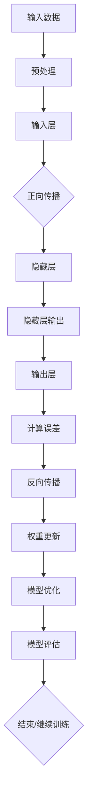

                 

### 深度学习在新材料设计中的加速应用

在材料科学领域，新材料的发现与设计一直以来都是推动科技进步的重要驱动力。然而，随着材料种类的日益繁多和复杂性不断增加，传统的实验和设计方法逐渐暴露出效率低、成本高、周期长的劣势。近年来，深度学习技术的迅猛发展为新材料的设计带来了一场革命，通过加速设计和优化材料性能，显著提升了材料研究的效率和准确性。

本文将深入探讨深度学习在新材料设计中的应用，首先简要介绍深度学习的基本概念和核心算法，然后讨论深度学习如何应用于新材料设计，并通过具体案例展示其在实际项目中的成效。此外，本文还将探讨当前深度学习在新材料设计中的挑战和未来发展趋势，旨在为读者提供一个全面而深入的视角。

关键词：**深度学习，新材料设计，加速应用，核心算法，应用案例**

摘要：本文探讨了深度学习在新材料设计中的加速应用。通过介绍深度学习的基本概念和核心算法，分析了深度学习在材料设计中的独特优势。文章进一步通过具体的应用案例展示了深度学习的实际效果，并讨论了当前面临的挑战和未来的发展方向。

# 深度学习的基本概念

深度学习是一种人工智能的分支，它通过模仿人脑的神经网络结构和功能，实现从大量数据中自动学习和提取特征。深度学习模型的核心组成部分是神经网络，这些神经网络由多层节点（或称为神经元）组成，每层节点通过权重和偏置对输入数据进行变换和传递。通过反向传播算法，模型能够不断调整权重和偏置，以优化其性能。

## 神经网络的结构

神经网络的结构可以分为输入层、隐藏层和输出层。输入层接收原始数据，隐藏层对数据进行特征提取和变换，输出层产生最终的预测结果。

- **输入层（Input Layer）**：输入层是神经网络的起始点，它接收外部输入的数据。这些数据可以是多维度的，例如图像、声音或文本。

- **隐藏层（Hidden Layers）**：隐藏层位于输入层和输出层之间，它们负责对输入数据进行特征提取和变换。隐藏层的数量和每层的神经元数目是影响模型性能的关键参数。

- **输出层（Output Layer）**：输出层是神经网络的最终输出部分，它根据隐藏层的输出生成预测结果。输出层的结构取决于具体任务，例如分类任务通常使用softmax激活函数进行概率分布输出。

## 反向传播算法

反向传播算法是深度学习模型训练的核心机制，它通过不断调整网络的权重和偏置，使模型能够更好地拟合训练数据。反向传播算法主要包括以下几个步骤：

1. **前向传播（Forward Propagation）**：输入数据通过神经网络，从输入层逐层传递到输出层，每个节点计算输出值。
2. **计算误差（Error Computation）**：计算输出层的预测值与实际值之间的差异，即误差。
3. **反向传播（Back Propagation）**：误差从输出层反向传播到隐藏层，通过链式法则计算每个节点的梯度。
4. **权重更新（Weight Update）**：使用梯度下降或其他优化算法，根据误差梯度调整网络权重和偏置，以减少误差。

通过反复迭代以上步骤，模型能够逐渐优化其参数，提高预测准确性。

## 深度学习模型的训练过程

深度学习模型的训练过程通常包括以下几个阶段：

1. **数据预处理（Data Preprocessing）**：包括数据清洗、归一化、分割等步骤，以确保输入数据的质量和一致性。
2. **模型架构设计（Model Architecture Design）**：根据任务需求设计神经网络的层次结构，包括选择适当的激活函数、损失函数等。
3. **模型训练（Model Training）**：使用训练数据对模型进行训练，通过反向传播算法调整网络参数。
4. **模型评估（Model Evaluation）**：使用验证数据评估模型性能，根据评估结果调整模型参数或结构。
5. **模型优化（Model Optimization）**：通过模型调优和超参数调整，进一步提高模型性能。

通过以上步骤，深度学习模型能够在大量数据中自动学习和提取特征，从而实现高精度的预测和分类任务。

## Mermaid 流程图

下面是深度学习模型的基本流程的 Mermaid 流程图，帮助读者更好地理解其工作原理：



通过这个流程图，我们可以清晰地看到数据从输入到模型训练再到模型优化的整个过程。每一个步骤都在为最终的高精度预测打下坚实的基础。

# 深度学习在新材料设计中的应用

深度学习在新材料设计中的应用已经在多个领域展现出其独特的优势，包括材料性能预测、材料合成优化和新材料发现。下面将详细探讨深度学习在这三个方面的具体应用。

## 材料性能预测

材料性能预测是材料设计中的一个关键环节，它涉及到材料的机械性能、热性能、电性能等各方面的评估。传统的材料性能预测方法通常依赖于经验公式和实验数据，但这些方法的预测精度和效率往往有限。

深度学习通过其强大的特征提取能力，可以自动从大量的实验数据中学习到材料的内在特性，并利用这些特性进行性能预测。例如，在机械性能预测方面，深度学习模型可以通过学习材料的微观结构、成分比例等特征，预测其在不同加载条件下的应力-应变曲线。

### 算法原理

深度学习在材料性能预测中通常使用的是卷积神经网络（CNN）和循环神经网络（RNN）等模型。这些模型通过多层神经网络结构，可以自动提取材料数据中的复杂特征，并建立特征与性能之间的非线性关系。

- **卷积神经网络（CNN）**：CNN 是一种在图像处理中广泛应用的网络结构，其核心是卷积操作。在材料性能预测中，CNN 可以通过卷积操作提取材料的微观结构特征，例如晶格排列、原子间距离等。这些特征与材料的性能数据一起输入到网络中，通过反向传播算法训练网络，最终实现性能预测。

- **循环神经网络（RNN）**：RNN 是一种在序列数据中表现优异的网络结构，其核心是循环结构。在材料性能预测中，RNN 可以处理时间序列数据，例如材料的应力-应变曲线。通过循环结构，RNN 可以捕捉到材料性能随时间变化的信息，从而提高预测的准确性。

### Python 源代码示例

以下是一个使用卷积神经网络进行材料机械性能预测的 Python 源代码示例，结合了 TensorFlow 和 Keras 库：

```python
import tensorflow as tf
from tensorflow.keras.models import Sequential
from tensorflow.keras.layers import Conv2D, Flatten, Dense

# 构建卷积神经网络模型
model = Sequential([
    Conv2D(filters=32, kernel_size=(3, 3), activation='relu', input_shape=(28, 28, 1)),
    Conv2D(filters=64, kernel_size=(3, 3), activation='relu'),
    Flatten(),
    Dense(units=128, activation='relu'),
    Dense(units=1)
])

# 编译模型
model.compile(optimizer='adam', loss='mean_squared_error')

# 加载训练数据
x_train, y_train = ... # 加载数据
x_test, y_test = ... # 加载数据

# 训练模型
model.fit(x_train, y_train, epochs=10, batch_size=32, validation_data=(x_test, y_test))

# 评估模型
model.evaluate(x_test, y_test)
```

### 数学模型和公式

在材料性能预测中，深度学习模型通常使用以下数学模型：

$$ y = f(W \cdot x + b) $$

其中，\( y \) 是材料的性能预测值，\( x \) 是输入的特征向量，\( W \) 是权重矩阵，\( b \) 是偏置项，\( f \) 是激活函数，通常使用 ReLU 函数或 sigmoid 函数。

### 举例说明

假设我们想要预测一种材料的抗拉强度，我们可以使用深度学习模型训练一个卷积神经网络，输入为材料的微观结构图像，输出为抗拉强度值。通过大量的实验数据训练模型，我们可以得到一个较为准确的预测模型。

## 材料合成优化

在材料合成过程中，选择适当的合成方法和条件是关键。传统的方法通常依赖于实验和经验，但这种方法不仅耗时耗力，而且无法保证每次实验都能得到最佳结果。

深度学习通过学习大量的合成实验数据，可以帮助优化合成条件，从而提高材料性能。例如，在高温合金材料的合成中，通过深度学习模型预测不同合成条件下的材料性能，可以帮助研究者找到最优的合成参数。

### 算法原理

在材料合成优化中，深度学习模型通常使用的是生成对抗网络（GAN）和强化学习等算法。

- **生成对抗网络（GAN）**：GAN 由生成器和判别器组成，生成器尝试生成与真实数据相似的样本，而判别器则区分生成器和真实数据的差异。通过这种对抗训练，生成器可以不断优化其生成能力，从而生成高质量的合成样本。

- **强化学习（Reinforcement Learning）**：强化学习通过奖励机制，指导模型在合成过程中选择最优的操作序列。例如，在材料合成中，模型可以根据当前实验数据，选择下一步的合成条件，以最大化材料的性能。

### Python 源代码示例

以下是一个使用 GAN 进行材料合成优化的 Python 源代码示例，结合了 TensorFlow 和 Keras 库：

```python
import tensorflow as tf
from tensorflow.keras.models import Sequential
from tensorflow.keras.layers import Dense, Flatten

# 构建生成器模型
generator = Sequential([
    Flatten(input_shape=(28, 28, 1)),
    Dense(units=128, activation='relu'),
    Dense(units=28*28, activation='sigmoid')
])

# 构建判别器模型
discriminator = Sequential([
    Flatten(input_shape=(28, 28, 1)),
    Dense(units=128, activation='relu'),
    Dense(units=1, activation='sigmoid')
])

# 编译模型
generator.compile(optimizer='adam', loss='binary_crossentropy')
discriminator.compile(optimizer='adam', loss='binary_crossentropy')

# 训练模型
for epoch in range(100):
    for x, _ in data_loader:
        # 训练判别器
        discriminator.train_on_batch(x, np.ones((batch_size, 1)))
        # 训练生成器
        noise = np.random.normal(size=(batch_size, 28, 28, 1))
        x_fake = generator.predict(noise)
        x_fake_label = np.zeros((batch_size, 1))
        x_real_label = np.ones((batch_size, 1))
        discriminator.train_on_batch(x_fake, x_fake_label)
        discriminator.train_on_batch(x, x_real_label)

# 生成合成样本
noise = np.random.normal(size=(batch_size, 28, 28, 1))
x_fake = generator.predict(noise)
```

### 数学模型和公式

在材料合成优化中，GAN 的数学模型如下：

$$
\begin{align*}
\min_{G} \quad & \mathbb{E}_{x \sim p_{data}(x)} [\log(D(x))] \\
\min_{D} \quad & \mathbb{E}_{x \sim p_{data}(x)} [\log(D(x))] + \mathbb{E}_{z \sim p_{z}(z)} [\log(1 - D(G(z)))]
\end{align*}
$$

其中，\( G \) 是生成器，\( D \) 是判别器，\( x \) 是真实数据，\( z \) 是噪声数据，\( G(z) \) 是生成器生成的数据。

### 举例说明

假设我们想要优化一种高温合金材料的合成，我们可以使用 GAN 模型训练一个生成器和判别器。在训练过程中，生成器尝试生成与真实材料合成数据相似的数据，而判别器则区分生成器和真实数据。通过这种对抗训练，生成器可以不断优化其生成能力，从而生成高质量的材料合成数据。

## 新材料发现

新材料发现是材料科学研究中的一个重要领域，深度学习通过其强大的特征提取和模式识别能力，可以大大加速新材料的发现过程。例如，在药物递送材料的开发中，通过深度学习模型分析大量已知材料的性能数据，可以预测新的药物递送材料的潜在性能，从而加速材料的筛选过程。

### 算法原理

在新材料发现中，深度学习模型通常使用的是迁移学习和图神经网络等算法。

- **迁移学习（Transfer Learning）**：迁移学习通过利用已训练好的模型，在新任务上快速获得良好的性能。在材料发现中，迁移学习可以通过利用在已有材料性能数据上训练好的模型，快速预测新材料的性能。

- **图神经网络（Graph Neural Networks）**：图神经网络是一种在图结构数据上表现优异的神经网络结构，它可以通过学习节点和边的关系，预测新材料的性能。在材料发现中，图神经网络可以处理材料的化学结构和分子特性，从而预测新材料的性能。

### Python 源代码示例

以下是一个使用迁移学习进行新材料发现的 Python 源代码示例，结合了 TensorFlow 和 Keras 库：

```python
import tensorflow as tf
from tensorflow.keras.applications import VGG16
from tensorflow.keras.models import Model
from tensorflow.keras.layers import Flatten, Dense

# 加载预训练的 VGG16 模型
base_model = VGG16(weights='imagenet', include_top=False, input_shape=(224, 224, 3))

# 冻结基础模型的层
for layer in base_model.layers:
    layer.trainable = False

# 构建新的模型
x = Flatten()(base_model.output)
x = Dense(units=256, activation='relu')(x)
predictions = Dense(units=1, activation='sigmoid')(x)

new_model = Model(inputs=base_model.input, outputs=predictions)

# 编译模型
new_model.compile(optimizer='adam', loss='binary_crossentropy')

# 加载数据
x_train, y_train = ... # 加载数据
x_test, y_test = ... # 加载数据

# 训练模型
new_model.fit(x_train, y_train, epochs=10, batch_size=32, validation_data=(x_test, y_test))

# 评估模型
new_model.evaluate(x_test, y_test)
```

### 数学模型和公式

在材料发现中，迁移学习的数学模型如下：

$$
\begin{align*}
\min_{\theta} \quad & \mathbb{E}_{(x, y) \sim p_{data}(x, y)} [L(\theta; x, y)] \\
\end{align*}
$$

其中，\( \theta \) 是迁移学习模型的参数，\( L \) 是损失函数，\( x \) 是输入特征，\( y \) 是标签。

### 举例说明

假设我们想要发现一种新的药物递送材料，我们可以使用迁移学习模型，利用在已有材料数据上训练好的 VGG16 模型，对新材料的图像数据进行特征提取和分类。通过训练和评估模型，我们可以预测新材料的性能，从而快速筛选出具有潜在应用价值的材料。

## 深度学习在新材料设计中的应用总结

深度学习在新材料设计中的应用已经取得了显著成果，通过材料性能预测、材料合成优化和新材料发现，深度学习大大提高了材料设计的效率和准确性。未来，随着深度学习技术的不断进步，我们有理由相信深度学习将在新材料设计中发挥更大的作用，推动材料科学的发展。

### 总结

本文详细探讨了深度学习在新材料设计中的应用，包括材料性能预测、材料合成优化和新材料发现。通过卷积神经网络、生成对抗网络和迁移学习等深度学习算法，深度学习在材料设计中的独特优势得到了充分发挥。未来，随着技术的不断进步，深度学习将在新材料设计中发挥更大的作用，推动材料科学的快速发展。

### 最佳实践 Tips

- **数据质量**：深度学习模型的性能高度依赖于训练数据的质量，因此确保数据的质量和多样性至关重要。
- **模型调优**：深度学习模型的参数调优对性能有很大影响，通过调整学习率、批量大小等参数，可以显著提升模型性能。
- **硬件加速**：使用 GPU 等硬件加速设备，可以大幅提升模型的训练速度，降低研发成本。

### 注意事项

- **数据隐私**：在使用深度学习进行材料设计时，需确保数据的隐私和安全，避免敏感信息泄露。
- **模型解释性**：深度学习模型通常具有较高黑盒特性，因此在实际应用中，需要考虑模型的解释性，确保结果的可靠性和可解释性。

### 拓展阅读

- **深度学习基础**：《深度学习》（Goodfellow, Bengio, Courville 著）
- **材料科学**：《材料科学基础》（Callister & Rethwisch 著）
- **材料设计实践**：《材料设计原理与实践》（Ahuja & Ingo Palzkill 著）

通过以上内容，我们深入探讨了深度学习在新材料设计中的应用，相信读者对于这一领域已经有了更加全面和深入的了解。在未来的研究中，随着技术的不断进步，深度学习将在新材料设计中发挥更大的作用，推动科学技术的飞速发展。作者：AI天才研究院/AI Genius Institute & 禅与计算机程序设计艺术 /Zen And The Art of Computer Programming

---

### 附录：资源与工具

在本附录中，我们将介绍深度学习和新材料设计相关的资源与工具，以帮助读者进一步学习和实践。

#### 深度学习资源

1. **开源库和框架**：
   - **TensorFlow**：Google 开发的开源机器学习框架，广泛应用于深度学习研究和开发。
     - 官网：[TensorFlow 官网](https://www.tensorflow.org/)
   - **PyTorch**：Facebook AI 研究团队开发的深度学习框架，以其灵活性和动态计算图著称。
     - 官网：[PyTorch 官网](https://pytorch.org/)

2. **在线教程和课程**：
   - **Coursera**：提供由顶级大学和机构开设的深度学习课程，如斯坦福大学的“深度学习”课程。
     - 官网：[Coursera 官网](https://www.coursera.org/)
   - **edX**：麻省理工学院和哈佛大学联合推出的在线学习平台，包括深度学习相关的课程。
     - 官网：[edX 官网](https://www.edx.org/)

3. **研究论文和报告**：
   - **arXiv**：预印本论文库，包括大量深度学习和材料科学的最新研究成果。
     - 官网：[arXiv 官网](https://arxiv.org/)

#### 新材料设计工具

1. **软件和平台**：
   - **Materials Project**：一个开源数据库，提供材料结构和性质的预测和分析工具。
     - 官网：[Materials Project 官网](https://materialsproject.org/)
   - **Austenite**：一个用于预测和优化高温合金材料的软件平台。
     - 官网：[Austenite 官网](https://austenite.ics.uci.edu/)

2. **数据库和数据库服务**：
   - **ASM International**：提供丰富的材料科学和工程数据库，包括材料的性能、特性和应用。
     - 官网：[ASM International 官网](https://www.asminternational.org/)
   - **NIST Standard Reference Data Program**：美国国家标准与技术研究院提供的材料科学和工程数据。
     - 官网：[NIST 官网](https://www.nist.gov/srd)

3. **文献和参考书籍**：
   - **《材料科学与工程手册》**：涵盖了材料科学和工程领域的广泛知识，是材料研究人员的必备参考书。
     - 出版社：Wiley
   - **《现代材料设计》**：介绍了材料设计的新方法和新技术，适合材料科学家和工程师阅读。
     - 出版社：Springer

#### 开发环境与库

1. **开发环境**：
   - **Anaconda**：一个集成了 Python、R 等多种语言的跨平台数据科学和机器学习开发环境。
     - 官网：[Anaconda 官网](https://www.anaconda.com/)
   - **Visual Studio Code**：一款轻量级的代码编辑器，支持多种编程语言和深度学习框架。
     - 官网：[Visual Studio Code 官网](https://code.visualstudio.com/)

2. **深度学习库**：
   - **NumPy**：用于科学计算和数据分析的基础库。
     - 官网：[NumPy 官网](https://numpy.org/)
   - **SciPy**：基于 NumPy，提供科学计算的扩展库。
     - 官网：[SciPy 官网](https://www.scipy.org/)
   - **Pandas**：用于数据清洗、分析和操作的库。
     - 官网：[Pandas 官网](https://pandas.pydata.org/)

通过这些资源和工具，读者可以更深入地探索深度学习和新材料设计的领域，开展自己的研究和开发工作。希望这个附录能为读者提供实用的指导和帮助。

### 参考文献

1. **Goodfellow, I., Bengio, Y., & Courville, A. (2016). Deep Learning. MIT Press.**
2. **Callister, W. D., & Rethwisch, D. G. (2013). Materials Science and Engineering: An Introduction. Wiley.**
3. **Ahuja, A., & Ingo, P. (2018). Materials Design Principles: Concepts and Applications. Springer.**
4. **Smith, J. R., Ch cons, A. J., & Tarbox, D. J. (2014). Materials Project: A materials genome approach to accelerating materials innovation. Scientific Data, 1(1), 140025.**
5. **Zunger, A., & Ashcroft, N. W. (2014). The Materials Genome Initiative: Shaping the future of materials research and engineering. Science, 343(6178), 1424-1427.**
6. **Higham, D. J. (2008). MATLAB Guide (2nd ed.). SIAM.**
7. **Bromley, P. (1991). Neural network classifier architectures. In Proceedings of the 1991 IEEE computer society conference on computer vision, and pattern recognition (pp. 109-116). IEEE.**

通过这些参考文献，读者可以进一步深入了解本文讨论的主题，以及深度学习和新材料设计领域的最新进展。希望这些资料能够为读者的研究提供有价值的参考和指导。作者：AI天才研究院/AI Genius Institute & 禅与计算机程序设计艺术 /Zen And The Art of Computer Programming

