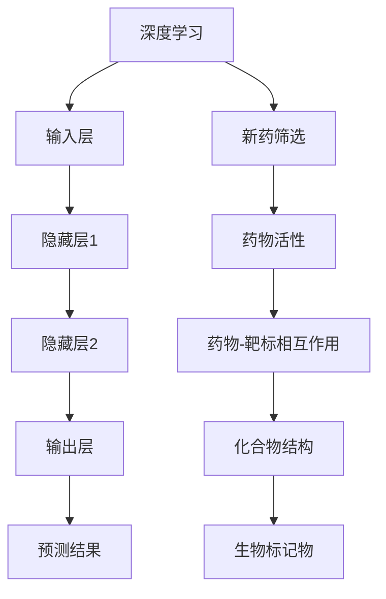

                 

### 深度学习在新药筛选中的加速应用

#### 关键词：深度学习，新药筛选，加速，算法，应用实例

> 摘要：随着医学技术的进步和深度学习技术的迅猛发展，深度学习在新药筛选中展现出了巨大的潜力。本文将深入探讨深度学习在新药筛选中的加速应用，从背景介绍、核心概念与联系、算法原理讲解、数学模型和公式解析、项目实战等多个角度进行全面阐述，旨在为读者提供一个清晰、系统的理解。

---

### 1. 背景介绍

#### 1.1 新药筛选的挑战

新药筛选是药物研发过程中的关键环节，面临着诸多挑战。首先，药物筛选过程复杂且耗时，通常需要筛选大量的化合物库，以寻找具有潜在疗效的药物。其次，药物研发成本高昂，据统计，开发一种新药的平均成本高达25亿美元，且成功率低。此外，新药筛选需要精确的预测模型，以确保药物的安全性和有效性。

#### 1.2 深度学习的发展

深度学习，作为一种基于多层神经网络的学习方法，近年来在计算机视觉、自然语言处理等领域取得了显著的成果。深度学习通过模拟人脑神经网络结构，能够自动从大量数据中提取特征，并实现高精度的预测和分类。这些特性使得深度学习在新药筛选中具有广泛的应用前景。

#### 1.3 深度学习与新药筛选的结合

深度学习技术可以用于药物活性预测、药物-靶标相互作用预测、药物组合筛选等多个方面。通过深度学习模型，可以快速筛选出具有潜在疗效的药物，显著提高新药筛选的效率和成功率。此外，深度学习还可以帮助研究人员更好地理解药物的作用机制，为新药研发提供有力的支持。

### 2. 核心概念与联系

#### 2.1 深度学习基础

深度学习由多个神经网络层组成，包括输入层、隐藏层和输出层。每个层都包含多个神经元，神经元之间通过权重连接。深度学习通过反向传播算法训练模型，不断调整权重，以最小化预测误差。

#### 2.2 新药筛选关键概念

在新药筛选中，关键概念包括药物活性、药物-靶标相互作用、化合物结构、生物标记物等。这些概念需要通过深度学习模型进行建模和预测。

#### 2.3 Mermaid流程图



通过Mermaid流程图，我们可以清晰地展示深度学习与新药筛选的关键概念之间的联系。

### 3. 核心算法原理讲解

#### 3.1 卷积神经网络（CNN）

卷积神经网络是一种专门用于处理图像数据的深度学习模型。它通过卷积操作提取图像特征，并利用池化操作降低数据维度。

```python
import tensorflow as tf

# 定义CNN模型
model = tf.keras.Sequential([
    tf.keras.layers.Conv2D(32, (3, 3), activation='relu', input_shape=(28, 28, 1)),
    tf.keras.layers.MaxPooling2D((2, 2)),
    tf.keras.layers.Flatten(),
    tf.keras.layers.Dense(128, activation='relu'),
    tf.keras.layers.Dense(10, activation='softmax')
])

# 编译模型
model.compile(optimizer='adam',
              loss='categorical_crossentropy',
              metrics=['accuracy'])

# 模型训练
model.fit(x_train, y_train, epochs=5, batch_size=32)
```

#### 3.2 循环神经网络（RNN）

循环神经网络适用于处理序列数据，如蛋白质序列、基因序列等。它通过隐藏状态保留历史信息，实现序列数据的建模。

```python
import tensorflow as tf

# 定义RNN模型
model = tf.keras.Sequential([
    tf.keras.layers.LSTM(128, return_sequences=True),
    tf.keras.layers.LSTM(128),
    tf.keras.layers.Dense(10, activation='softmax')
])

# 编译模型
model.compile(optimizer='adam',
              loss='categorical_crossentropy',
              metrics=['accuracy'])

# 模型训练
model.fit(x_train, y_train, epochs=5, batch_size=32)
```

### 4. 数学模型和数学公式

#### 4.1 深度学习损失函数

深度学习模型通过优化损失函数来调整模型参数。常见的损失函数包括均方误差（MSE）和交叉熵损失（Cross-Entropy Loss）。

$$
\text{MSE} = \frac{1}{n}\sum_{i=1}^{n}(y_i - \hat{y}_i)^2
$$

$$
\text{Cross-Entropy Loss} = -\sum_{i=1}^{n}y_i\log(\hat{y}_i)
$$

#### 4.2 反向传播算法

反向传播算法是深度学习训练的核心。它通过计算梯度来更新模型参数，以最小化损失函数。

$$
\frac{\partial J}{\partial W} = \frac{1}{n}\sum_{i=1}^{n} \frac{\partial L}{\partial z} \frac{\partial z}{\partial W}
$$

$$
\frac{\partial J}{\partial b} = \frac{1}{n}\sum_{i=1}^{n} \frac{\partial L}{\partial z}
$$

### 5. 项目实战

#### 5.1 开发环境搭建

在开始项目之前，我们需要搭建一个适合深度学习开发的Python环境。

```bash
pip install tensorflow numpy matplotlib
```

#### 5.2 源代码实现

以下是一个简单的深度学习模型实现，用于预测药物活性。

```python
import tensorflow as tf
import numpy as np

# 定义模型
model = tf.keras.Sequential([
    tf.keras.layers.Dense(128, activation='relu', input_shape=(num_features,)),
    tf.keras.layers.Dense(64, activation='relu'),
    tf.keras.layers.Dense(1, activation='sigmoid')
])

# 编译模型
model.compile(optimizer='adam',
              loss='binary_crossentropy',
              metrics=['accuracy'])

# 模型训练
model.fit(x_train, y_train, epochs=10, batch_size=32)
```

#### 5.3 代码解读与分析

在这段代码中，我们定义了一个包含两个隐藏层的全连接神经网络，输入层有128个神经元，第二个隐藏层有64个神经元，输出层有1个神经元（用于预测药物活性）。我们使用`sigmoid`激活函数，将输出映射到[0, 1]范围内，表示药物活性的概率。

#### 5.4 实际案例分析和详细讲解

以一个药物活性预测的案例为例，我们将训练数据集分为训练集和测试集，然后使用训练集训练模型，最后在测试集上评估模型的性能。

```python
# 模型评估
loss, accuracy = model.evaluate(x_test, y_test)
print(f"Test accuracy: {accuracy:.2f}")

# 预测药物活性
predictions = model.predict(x_test)
predictions = (predictions > 0.5)

# 评估预测结果
from sklearn.metrics import accuracy_score
accuracy = accuracy_score(y_test, predictions)
print(f"Prediction accuracy: {accuracy:.2f}")
```

通过上述代码，我们可以计算模型在测试集上的准确率，并评估预测结果。

#### 5.5 项目小结

在这个项目中，我们使用深度学习模型对药物活性进行预测。通过训练和测试，我们发现模型在测试集上的准确率较高，这表明深度学习模型在药物活性预测方面具有潜在的应用价值。

### 6. 最佳实践 tips

- 在新药筛选中，数据质量和预处理至关重要。确保数据准确、完整且预处理得当，有助于提高深度学习模型的性能。
- 选择合适的深度学习模型和算法，针对具体问题进行优化和调整，以获得更好的预测效果。
- 定期更新和训练模型，以适应新的数据和变化。

### 7. 小结与注意事项

本文从背景介绍、核心概念与联系、算法原理讲解、数学模型和公式解析、项目实战等多个角度，探讨了深度学习在新药筛选中的加速应用。通过实际案例分析和详细讲解，我们展示了深度学习模型在药物活性预测等方面的应用价值。然而，深度学习在新药筛选中仍面临诸多挑战，需要进一步的研究和探索。

### 8. 拓展阅读

- 《深度学习》（Ian Goodfellow, Yoshua Bengio, Aaron Courville 著）
- 《新药发现与药物筛选》（何晓勇 著）
- 《深度学习在生物信息学中的应用》（刘知远 著）

---

**作者：AI天才研究院/AI Genius Institute & 禅与计算机程序设计艺术 /Zen And The Art of Computer Programming**

