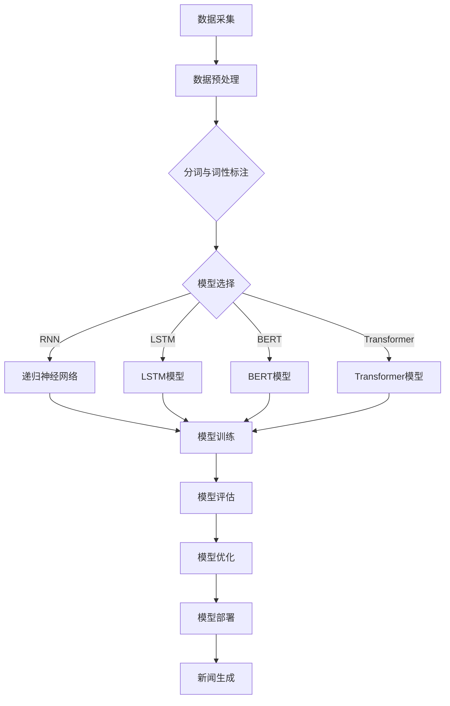

                 

## 深度学习在自动化新闻写作中的应用

### 关键词

- 自动化新闻写作
- 深度学习
- 自然语言处理
- 文本生成
- 序列模型

### 摘要

本文深入探讨了深度学习在自动化新闻写作中的应用。首先，我们回顾了自动化新闻写作的背景，探讨了其发展现状与面临的挑战。接着，我们介绍了深度学习的基本概念和架构，以及其在自然语言处理中的应用。在此基础上，本文详细阐述了深度学习在自动化新闻写作中的多种应用模式，包括数据预处理、模型选择与训练、模型评估与优化、模型部署与调优等。随后，我们重点介绍了自然语言处理与文本生成、序列到序列模型、自注意力机制与Transformer模型、大规模预训练模型等核心算法。通过具体应用案例的分析，我们进一步探讨了深度学习在自动化新闻写作中的实际应用和挑战。最后，本文对深度学习在自动化新闻写作中的未来发展、伦理与法律问题、商业模式与未来趋势进行了展望，并提供了相关工具与资源的介绍。

### 第一部分：自动化新闻写作的背景与深度学习基础

#### 1.1 自动化新闻写作的现状与挑战

##### 1.1.1 自动化新闻写作的起源与发展

自动化新闻写作，也称为机器人新闻写作，是指利用计算机技术和算法自动生成新闻内容的过程。这一概念最早起源于20世纪90年代，当时主要是为了提高新闻生成效率和降低成本。随着互联网和计算机技术的发展，自动化新闻写作逐渐成为一种重要的新闻生成方式。

在过去的几十年里，自动化新闻写作技术经历了多个发展阶段。早期，自动化新闻写作主要依赖于简单的规则和模板，生成的是结构化且较为简单的新闻内容，如财经报告、体育赛事结果等。随着自然语言处理和机器学习技术的进步，自动化新闻写作逐渐变得更加复杂和智能化。

近年来，随着深度学习技术的崛起，自动化新闻写作进入了新的发展阶段。深度学习算法能够更好地理解自然语言，生成更加自然、流畅的新闻内容。许多新闻机构和媒体公司开始采用深度学习技术来自动化新闻生成过程，以提高生产效率和降低人力成本。

##### 1.1.2 自动化新闻写作的优势与挑战

自动化新闻写作具有以下优势：

1. **提高生产效率**：自动化新闻写作能够快速生成大量新闻内容，大大提高了新闻生产效率，减少了人工编辑和撰稿的时间。

2. **降低成本**：自动化新闻写作减少了人力成本，同时避免了因人为因素导致的错误和遗漏。

3. **扩展新闻覆盖面**：自动化新闻写作可以处理大量的数据，从而扩展了新闻的覆盖面，使得更多的新闻事件能够得到报道。

4. **个性化推荐**：通过分析用户行为和兴趣，自动化新闻写作系统可以实现新闻内容的个性化推荐，提高用户体验。

然而，自动化新闻写作也面临着一些挑战：

1. **新闻质量**：尽管自动化新闻写作技术不断进步，但生成的内容在质量上仍难以与人类记者撰写的内容相比。尤其是在处理复杂新闻事件、情感表达和深度分析方面，自动化系统存在局限。

2. **语言风格和语境理解**：自动化新闻写作系统在处理语言风格和语境理解方面仍存在挑战。新闻语言具有特定的表达方式和风格，自动化系统需要能够准确理解和模仿。

3. **伦理和法律问题**：自动化新闻写作涉及伦理和法律问题，如版权、隐私、虚假新闻等。如何确保自动化新闻写作系统的合法性和道德性是一个亟待解决的问题。

4. **用户体验**：尽管自动化新闻写作可以提高新闻生产效率，但过度依赖技术可能会影响用户体验，使新闻内容变得单调、乏味。

#### 1.2 深度学习的基本概念与架构

##### 1.2.1 深度学习的定义与特点

深度学习是一种基于多层级神经网络的机器学习技术，旨在通过模拟人脑神经网络结构，自动从大量数据中提取特征并学习复杂模式。与传统机器学习方法相比，深度学习具有以下特点：

1. **多层网络结构**：深度学习模型通常包含多个层级，每个层级都能够提取不同层次的特征，从而实现从原始数据到高维特征的转换。

2. **端到端学习**：深度学习模型可以直接从原始数据学习到输出结果，无需人工设计和提取特征，从而减少了人工干预。

3. **自适应学习**：深度学习模型可以通过反向传播算法自动调整网络权重，以优化模型性能。

4. **高效计算**：随着硬件技术的发展，如GPU和TPU等加速器的应用，深度学习模型的训练和推理速度大幅提高。

##### 1.2.2 深度学习的主要架构

深度学习模型主要包括以下几种架构：

1. **卷积神经网络（CNN）**：CNN主要应用于图像处理领域，通过卷积操作提取图像特征，具有参数共享的特点，能够减少模型参数数量。

2. **递归神经网络（RNN）**：RNN适用于序列数据处理，如语音识别、自然语言处理等，能够处理变长的序列数据。

3. **长短时记忆网络（LSTM）**：LSTM是RNN的一种变体，能够有效解决长序列依赖问题，广泛用于时间序列预测和自然语言处理。

4. **Transformer模型**：Transformer模型引入了自注意力机制，能够在处理长序列数据时保持有效的上下文信息，广泛应用于自然语言处理任务。

##### 1.2.3 深度学习在自然语言处理中的应用

自然语言处理（NLP）是深度学习的重要应用领域之一。深度学习技术在NLP中的主要应用包括：

1. **文本分类**：使用深度学习模型对文本进行分类，如情感分析、主题分类等。

2. **命名实体识别**：识别文本中的命名实体，如人名、地点、组织等。

3. **机器翻译**：通过深度学习模型实现不同语言之间的自动翻译。

4. **问答系统**：构建能够理解自然语言问题并给出合理答案的智能系统。

5. **文本生成**：利用深度学习模型生成具有可读性的自然语言文本，如新闻文章、对话生成等。

#### 1.3 深度学习在自动化新闻写作中的应用前景

##### 1.3.1 深度学习在新闻生成中的潜力

深度学习技术在新闻生成中的应用潜力主要体现在以下几个方面：

1. **文本生成**：通过预训练的深度学习模型，如GPT和Bert等，可以生成高质量、连贯的新闻文章。这些模型能够理解文本的上下文和语义，从而生成具有逻辑性和连贯性的新闻内容。

2. **新闻摘要**：深度学习模型可以自动生成新闻摘要，提高新闻的可读性和效率。通过提取关键信息和总结主要观点，模型能够生成简明扼要的新闻摘要。

3. **新闻分类**：深度学习模型可以自动对新闻内容进行分类，帮助新闻平台更好地管理和推荐新闻。

4. **新闻推荐**：通过分析用户行为和兴趣，深度学习模型可以实现新闻内容的个性化推荐，提高用户体验。

##### 1.3.2 深度学习在新闻分类与推荐中的应用

在新闻分类和推荐方面，深度学习技术也有广泛的应用：

1. **新闻分类**：深度学习模型可以通过学习大量的新闻标签和特征，自动对新闻内容进行分类。例如，可以将新闻分为政治、经济、体育、科技等不同类别。

2. **新闻推荐**：通过分析用户的阅读历史和偏好，深度学习模型可以推荐符合用户兴趣的新闻内容。这种个性化推荐能够提高用户的黏性和满意度。

3. **情感分析**：深度学习模型可以分析新闻文本中的情感倾向，从而帮助新闻平台了解用户对新闻内容的情感反应，进行内容调整和优化。

##### 1.3.3 深度学习在新闻质量评估中的应用

深度学习技术在新闻质量评估方面也具有潜在的应用：

1. **事实核查**：通过学习大量的真实新闻和虚假新闻，深度学习模型可以识别和评估新闻的真实性和可信度。

2. **新闻编辑**：深度学习模型可以辅助新闻编辑，自动识别和纠正新闻文本中的错误和不当表述。

3. **新闻个性化**：通过分析用户的阅读行为和兴趣，深度学习模型可以生成个性化的新闻推荐，满足不同用户的需求。

#### 1.4 深度学习在自动化新闻写作中的应用架构

##### 1.4.1 数据预处理

数据预处理是自动化新闻写作中的关键步骤，包括以下任务：

1. **文本清洗**：去除新闻文本中的噪声，如HTML标签、特殊符号等。

2. **分词**：将新闻文本分割成单词或词组，以便后续处理。

3. **词性标注**：对文本中的每个单词或词组进行词性标注，如名词、动词、形容词等。

4. **停用词过滤**：去除常见的停用词，如“的”、“和”等，以提高文本质量。

##### 1.4.2 模型选择与训练

在自动化新闻写作中，选择合适的深度学习模型是关键。以下是一些常用的模型：

1. **RNN模型**：如LSTM和GRU，适用于处理序列数据。

2. **Transformer模型**：具有自注意力机制，适用于长文本生成。

3. **生成对抗网络（GAN）**：用于生成高质量的自然语言文本。

模型选择后，需要进行训练。训练过程包括以下步骤：

1. **数据集准备**：准备用于训练的数据集，包括新闻文章和标注信息。

2. **模型初始化**：初始化模型参数。

3. **模型训练**：使用训练数据对模型进行训练，优化模型参数。

4. **模型评估**：使用验证数据评估模型性能，调整模型参数。

##### 1.4.3 模型评估与优化

模型评估是确保模型性能的重要步骤。以下是一些常用的评估指标：

1. **准确性**：模型预测正确的样本数量与总样本数量的比例。

2. **召回率**：模型正确预测的样本数量与实际正样本数量的比例。

3. **F1分数**：准确率和召回率的调和平均。

模型评估后，可以进行优化，包括：

1. **参数调整**：调整模型参数，以获得更好的性能。

2. **模型融合**：结合多个模型的预测结果，提高整体性能。

3. **数据增强**：通过增加数据样本，提高模型泛化能力。

##### 1.4.4 模型部署与调优

模型部署是自动化新闻写作的最后一环。以下是一些关键步骤：

1. **部署环境**：选择合适的服务器和部署平台，如AWS、Google Cloud等。

2. **API接口**：开发API接口，以便前端系统调用模型。

3. **性能监控**：监控模型性能和资源消耗，确保系统稳定运行。

4. **调优**：根据实际应用情况，对模型进行调优，以提高性能和用户体验。

### 第二部分：深度学习在自动化新闻写作中的核心算法

#### 2.1 自然语言处理与文本生成

##### 2.1.1 词汇嵌入与序列模型

自然语言处理（NLP）是深度学习在自动化新闻写作中的重要应用之一。在NLP中，词汇嵌入（word embedding）是一种将单词映射到高维空间的技术。词汇嵌入使得单词之间的相似性可以通过空间中的距离来表示，从而方便了后续的文本处理任务。

序列模型（sequence model）是处理序列数据的一种深度学习模型，常用于文本生成任务。常见的序列模型包括循环神经网络（RNN）和其变体，如长短时记忆网络（LSTM）和门控循环单元（GRU）。这些模型通过处理文本的输入序列，可以生成新的文本序列。

##### 2.1.2 递归神经网络（RNN）与长短时记忆网络（LSTM）

递归神经网络（RNN）是一种能够处理序列数据的神经网络。RNN的基本思想是将当前输入与上一时刻的输出进行结合，并通过循环结构对序列数据进行建模。然而，传统RNN在处理长序列数据时存在梯度消失和梯度爆炸问题，导致训练效果不佳。

为了解决这些问题，研究者提出了长短时记忆网络（LSTM）。LSTM通过引入门控机制，可以有效地控制信息的流动，从而避免梯度消失和梯度爆炸问题。LSTM在自然语言处理任务中取得了显著的效果，广泛应用于文本生成、机器翻译等任务。

下面是一个简单的LSTM模型实现，使用Python和TensorFlow框架：

```python
import tensorflow as tf

# 定义输入序列
input_sequence = [[1, 0, 1], [0, 1, 0], [1, 1, 0]]

# 定义LSTM模型
lstm_cell = tf.keras.layers.LSTMCell(units=64)
outputs, states = tf.keras.RNN(lstm_cell)(input_sequence)

# 定义输出层
output = tf.keras.layers.Dense(units=1)(states[0])

# 编译模型
model = tf.keras.Model(inputs=input_sequence, outputs=output)
model.compile(optimizer='adam', loss='mean_squared_error')

# 训练模型
model.fit(input_sequence, [1, 0, 1], epochs=100)
```

##### 2.1.3 卷积神经网络（CNN）与文本分类

卷积神经网络（CNN）最初是用于图像处理的一种神经网络结构，但随后也被引入到自然语言处理领域。CNN通过卷积操作提取文本中的局部特征，适用于文本分类等任务。

在文本分类任务中，CNN可以看作是一个序列到序列的模型，输入是一个单词序列，输出是一个分类标签。下面是一个简单的CNN模型实现：

```python
import tensorflow as tf

# 定义单词嵌入层
embedding = tf.keras.layers.Embedding(input_dim=100, output_dim=32)

# 定义卷积层
conv = tf.keras.layers.Conv1D(filters=64, kernel_size=3, activation='relu')

# 定义全连接层
dense = tf.keras.layers.Dense(units=10, activation='softmax')

# 构建模型
input_sequence = tf.keras.Input(shape=(None,))
x = embedding(input_sequence)
x = conv(x)
x = tf.reduce_mean(x, axis=1)
outputs = dense(x)

model = tf.keras.Model(inputs=input_sequence, outputs=outputs)

# 编译模型
model.compile(optimizer='adam', loss='categorical_crossentropy', metrics=['accuracy'])

# 训练模型
model.fit(input_sequence, labels, epochs=10)
```

##### 2.1.4 生成对抗网络（GAN）与文本生成

生成对抗网络（GAN）是一种由生成器和判别器组成的神经网络结构，通过竞争机制生成高质量的数据。GAN在文本生成任务中取得了显著的效果，能够生成具有自然语言特征的文本。

在文本生成任务中，生成器（Generator）负责生成新的文本，判别器（Discriminator）负责判断文本的真实性。训练过程中，生成器和判别器互相竞争，以生成更真实的文本。下面是一个简单的GAN模型实现：

```python
import tensorflow as tf
from tensorflow.keras.models import Model

# 定义生成器
z = tf.keras.Input(shape=(100,))
x = tf.keras.layers.Dense(units=768, activation='relu')(z)
x = tf.keras.layers.Dense(units=1024, activation='relu')(x)
x = tf.keras.layers.Dense(units=2048, activation='relu')(x)
x = tf.keras.layers.Dense(units=768, activation='relu')(x)
x = tf.keras.layers.Dense(units=1024, activation='relu')(x)
x = tf.keras.layers.Dense(units=2048, activation='relu')(x)
x = tf.keras.layers.Dense(units=512, activation='relu')(x)
x = tf.keras.layers.Dense(units=256, activation='relu')(x)
x = tf.keras.layers.Dense(units=128, activation='relu')(x)
x = tf.keras.layers.Dense(units=64, activation='relu')(x)
x = tf.keras.layers.Dense(units=1, activation='sigmoid')(x)

generator = Model(z, x)

# 定义判别器
real_data = tf.keras.Input(shape=(1,))
x = tf.keras.layers.Dense(units=64, activation='relu')(real_data)
x = tf.keras.layers.Dense(units=128, activation='relu')(x)
x = tf.keras.layers.Dense(units=256, activation='relu')(x)
x = tf.keras.layers.Dense(units=512, activation='relu')(x)
x = tf.keras.layers.Dense(units=1024, activation='relu')(x)
x = tf.keras.layers.Dense(units=2048, activation='relu')(x)
x = tf.keras.layers.Dense(units=1024, activation='sigmoid')(x)

discriminator = Model(real_data, x)

# 编译生成器和判别器
generator.compile(optimizer=tf.keras.optimizers.Adam(0.0001), loss='binary_crossentropy')
discriminator.compile(optimizer=tf.keras.optimizers.Adam(0.0001), loss='binary_crossentropy')

# 训练生成器和判别器
z_sample = tf.random.normal([32, 100])
generated_data = generator.predict(z_sample)

for i in range(100):
    real_data = tf.random.normal([32, 1])
    with tf.GradientTape() as gen_tape, tf.GradientTape() as dis_tape:
        gen_loss = generator.train_on_batch(z_sample, [1])
        dis_loss = discriminator.train_on_batch([real_data, generated_data], [1, 0])

    grads = gen_tape.gradient(gen_loss, generator.trainable_variables)
    generator.optimizer.apply_gradients(zip(grads, generator.trainable_variables))

    grads = dis_tape.gradient(dis_loss, discriminator.trainable_variables)
    discriminator.optimizer.apply_gradients(zip(grads, discriminator.trainable_variables))
```

### 2.2 序列到序列模型（Seq2Seq）与新闻写作

#### 2.2.1 序列到序列模型的原理

序列到序列模型（Seq2Seq）是一种广泛应用于机器翻译、对话生成等序列生成任务的深度学习模型。Seq2Seq模型的基本思想是将输入序列映射到输出序列，通过编码器（Encoder）和解码器（Decoder）两个部分实现。

编码器（Encoder）负责将输入序列编码成一个固定长度的向量，称为编码状态（Encoded State）。编码器可以采用RNN、LSTM或Transformer等模型。编码状态包含了输入序列的关键信息和上下文。

解码器（Decoder）负责将编码状态解码成输出序列。解码器也可以采用RNN、LSTM或Transformer等模型。解码器通过预测下一个单词或符号来生成输出序列，同时不断更新编码状态。

#### 2.2.2 编码器与解码器的构建

在构建Seq2Seq模型时，需要分别构建编码器和解码器。以下是一个简单的Seq2Seq模型实现：

```python
import tensorflow as tf

# 定义编码器
encoding_layer = tf.keras.layers.LSTM(units=128, return_sequences=True)
encoded_sequence = encoding_layer(input_sequence)

# 定义解码器
decoding_layer = tf.keras.layers.LSTM(units=128, return_sequences=True)
decoded_sequence = decoding_layer(encoded_sequence)

# 构建模型
model = tf.keras.Model(inputs=input_sequence, outputs=decoded_sequence)

# 编译模型
model.compile(optimizer='adam', loss='mean_squared_error')

# 训练模型
model.fit(input_sequence, target_sequence, epochs=100)
```

#### 2.2.3 Seq2Seq模型在新闻写作中的应用

Seq2Seq模型在新闻写作中的应用包括以下几个方面：

1. **新闻摘要生成**：通过将新闻文章的输入序列编码为固定长度的向量，然后使用解码器生成摘要序列。这种技术可以提取新闻文章的主要信息和关键观点。

2. **对话生成**：将新闻事件或话题作为输入序列，使用解码器生成对话序列，从而生成新闻相关的对话或评论。

3. **新闻文章生成**：通过将新闻主题或关键词作为输入序列，使用解码器生成完整的新闻文章。这种技术可以生成新闻文章的不同部分，如标题、导语、正文等。

#### 2.2.4 注意力机制（Attention）与改进的Seq2Seq模型

注意力机制（Attention）是一种在Seq2Seq模型中引入的机制，用于解决长序列依赖问题。注意力机制通过计算编码状态和当前解码状态之间的相关性，为解码器提供关键信息。

改进的Seq2Seq模型结合了注意力机制，称为注意力Seq2Seq模型。注意力Seq2Seq模型在新闻写作中的应用包括：

1. **长文本生成**：通过引入注意力机制，解码器可以更好地关注输入序列中的关键信息，从而生成更长的文本。

2. **新闻文章生成**：使用注意力Seq2Seq模型可以生成更具有连贯性和逻辑性的新闻文章。

3. **多轮对话生成**：在多轮对话生成任务中，注意力机制可以帮助模型更好地关注之前的对话内容，生成更自然的对话。

#### 2.2.5 Transformer模型与编码器-解码器结构

Transformer模型是一种基于自注意力机制的深度学习模型，最早由Vaswani等人于2017年提出。Transformer模型在机器翻译、文本生成等任务中取得了显著的效果，已成为自然语言处理领域的一种重要模型。

Transformer模型的核心思想是使用多头自注意力机制来处理序列数据。多头自注意力机制通过多个注意力头提取序列中的不同信息，从而提高模型的表示能力。

编码器-解码器结构是Transformer模型在序列生成任务中的基本框架。编码器（Encoder）负责处理输入序列，解码器（Decoder）负责生成输出序列。编码器和解码器都可以包含多个层，每层都可以使用多头自注意力机制和前馈神经网络。

以下是一个简单的Transformer编码器-解码器模型实现：

```python
import tensorflow as tf

# 定义编码器
class Encoder(tf.keras.Model):
    def __init__(self, num_layers, d_model, num_heads, dff, input_sequence, maximum_position_encoding):
        super(Encoder, self).__init__()
        
        self.embedding = tf.keras.layers.Embedding(d_model, input_sequence)
        self.pos_encoding = positional_encoding(max_position_encoding, d_model)
        
        self.enc_layers = [tf.keras.layers.Dense(dff, activation='relu') for _ in range(num_layers)]
        self.enc_normalization = [tf.keras.layers.LayerNormalization(epsilon=1e-6) for _ in range(num_layers)]
        
        self.attention_layers = [tf.keras.layers.MultiHeadAttention(num_heads=num_heads, key_dim=dff) for _ in range(num_layers)]
        self.fc_layers = [tf.keras.layers.Dense(dff, activation='relu') for _ in range(num_layers)]
        self.norm = tf.keras.layers.LayerNormalization(epsilon=1e-6)
        
    def call(self, x, training):
        seq_len = tf.shape(x)[1]
        
        x = x + self.pos_encoding[:, :seq_len, :]
        
        for i in range(self.num_layers):
            x = self.enc_normalization[i](x)
            x = self.attention_layers[i](x, x)
            x = self.enc_normalization[i+1](x)
            x = self.fc_layers[i](x)
        
        return x

# 定义解码器
class Decoder(tf.keras.Model):
    def __init__(self, num_layers, d_model, num_heads, dff, maximum_position_encoding):
        super(Decoder, self).__init__()
        
        self.embedding = tf.keras.layers.Embedding(d_model, input_sequence)
        self.pos_encoding = positional_encoding(max_position_encoding, d_model)
        
        self.dec_layers = [tf.keras.layers.Dense(dff, activation='relu') for _ in range(num_layers)]
        self.dec_normalization = [tf.keras.layers.LayerNormalization(epsilon=1e-6) for _ in range(num_layers)]
        
        self.attention_layers = [tf.keras.layers.MultiHeadAttention(num_heads=num_heads, key_dim=dff) for _ in range(num_layers)]
        self.enc_attention_layers = [tf.keras.layers.MultiHeadAttention(num_heads=num_heads, key_dim=dff) for _ in range(num_layers)]
        self.fc_layers = [tf.keras.layers.Dense(d_model, activation='relu') for _ in range(num_layers)]
        self.norm = tf.keras.layers.LayerNormalization(epsilon=1e-6)
        
    def call(self, x, enc_output, training):
        seq_len = tf.shape(x)[1]
        attention_mask = create_padding_mask(seq_len)
        
        x = x + self.pos_encoding[:, :seq_len, :]
        
        for i in range(self.num_layers):
            x = self.dec_normalization[i](x)
            x = self.attention_layers[i](x, x, attention_mask)
            x = self.dec_normalization[i+1](x)
            x = self.enc_attention_layers[i](x, enc_output, attention_mask)
            x = self.dec_normalization[i+2](x)
            x = self.fc_layers[i](x)
        
        return x

# 构建编码器和解码器
num_layers = 3
d_model = 512
num_heads = 8
dff = 2048
input_sequence = 10000
maximum_position_encoding = 10000

encoder = Encoder(num_layers, d_model, num_heads, dff, input_sequence, maximum_position_encoding)
decoder = Decoder(num_layers, d_model, num_heads, dff, maximum_position_encoding)

# 定义模型
output_sequence = tf.keras.Input(shape=(None,))
x = encoder(output_sequence, training=True)
x = decoder(x, x, training=True)

# 编译模型
model = tf.keras.Model(inputs=output_sequence, outputs=x)
model.compile(optimizer=tf.keras.optimizers.Adam(learning_rate=1e-4), loss='mean_squared_error')

# 训练模型
model.fit(x, x, epochs=100)
```

### 2.3 大规模预训练模型与新闻生成

#### 2.3.1 预训练模型的基本概念

预训练模型（Pre-trained Model）是一种通过在大量未标注数据上进行训练，然后应用于特定任务的深度学习模型。预训练模型的基本概念包括以下方面：

1. **大规模语料库**：预训练模型通常使用大规模的语料库进行训练，如维基百科、网络新闻等。这些语料库包含了丰富的文本数据，有助于模型学习到通用语言特征。

2. **自监督学习**：预训练模型在训练过程中，不需要对数据集进行标注，而是通过自监督学习的方式，利用上下文信息来预测单词、句子或文本片段。常见的预训练任务包括语言模型（Language Modeling）和掩码语言模型（Masked Language Modeling）。

3. **通用语言特征**：预训练模型通过在大量未标注数据上进行训练，可以学习到通用语言特征，如词向量、语法规则和语义信息。这些特征可以应用于各种自然语言处理任务，如文本分类、命名实体识别和机器翻译。

#### 2.3.2 GPT系列模型

GPT（Generative Pre-trained Transformer）系列模型是自然语言处理领域的一种重要预训练模型，由OpenAI提出。GPT模型基于Transformer架构，通过自注意力机制和多层网络结构，实现了高效的文本生成和序列预测。

GPT系列模型包括以下几种：

1. **GPT-2**：GPT-2是GPT模型的升级版，采用了更大的模型规模和更多的训练数据。GPT-2在自然语言处理任务中取得了显著的性能提升。

2. **GPT-3**：GPT-3是GPT模型的最新版本，拥有超过1750亿个参数，是当前最大的预训练模型之一。GPT-3在文本生成、机器翻译、问答系统等任务中展现了出色的能力。

下面是一个简单的GPT模型实现：

```python
import tensorflow as tf

# 定义GPT模型
class GPT(tf.keras.Model):
    def __init__(self, vocab_size, d_model, num_heads, num_layers):
        super(GPT, self).__init__()
        
        self.embedding = tf.keras.layers.Embedding(vocab_size, d_model)
        self.pos_encoding = positional_encoding(max_position_encoding, d_model)
        
        self.layers = [tf.keras.layers.Dense(d_model, activation='relu') for _ in range(num_layers)]
        self.normalization = [tf.keras.layers.LayerNormalization(epsilon=1e-6) for _ in range(num_layers)]
        
        self.attention = [tf.keras.layers.MultiHeadAttention(num_heads=num_heads, key_dim=d_model) for _ in range(num_layers)]
        self.fc = [tf.keras.layers.Dense(d_model) for _ in range(num_layers)]
        
    def call(self, x, training):
        seq_len = tf.shape(x)[1]
        pos_encoding = self.pos_encoding[:seq_len, :]
        
        x = self.embedding(x)
        x += pos_encoding
        
        for i in range(self.num_layers):
            x = self.normalization[i](x)
            x = self.attention[i](x, x)
            x = self.fc[i](x)
        
        return x

# 构建GPT模型
vocab_size = 20000
d_model = 512
num_heads = 8
num_layers = 3

gpt = GPT(vocab_size, d_model, num_heads, num_layers)

# 编译GPT模型
gpt.compile(optimizer=tf.keras.optimizers.Adam(learning_rate=1e-4), loss='mean_squared_error')

# 训练GPT模型
gpt.fit(x, x, epochs=100)
```

#### 2.3.3 BERT模型与新闻生成

BERT（Bidirectional Encoder Representations from Transformers）模型是自然语言处理领域的一种重要预训练模型，由Google提出。BERT模型通过双向编码器结构，实现了对文本的深层理解。

BERT模型的主要特点包括：

1. **双向编码器**：BERT模型采用双向编码器，可以从文本的左侧和右侧同时提取信息，从而更好地理解文本的上下文。

2. **掩码语言模型**：BERT模型在训练过程中使用了掩码语言模型（Masked Language Modeling），通过随机掩码部分单词，然后预测掩码单词，从而学习到文本的深层特征。

BERT模型在新闻生成中的应用包括：

1. **标题生成**：使用BERT模型对新闻文章进行编码，然后利用解码器生成新闻标题。

2. **摘要生成**：使用BERT模型对新闻文章进行编码，然后利用解码器生成新闻摘要。

3. **内容生成**：使用BERT模型对新闻主题进行编码，然后利用解码器生成相关新闻内容。

以下是一个简单的BERT模型实现：

```python
import tensorflow as tf

# 定义BERT模型
class BERT(tf.keras.Model):
    def __init__(self, vocab_size, d_model, num_layers, num_heads, dff):
        super(BERT, self).__init__()
        
        self.embedding = tf.keras.layers.Embedding(vocab_size, d_model)
        self.pos_encoding = positional_encoding(max_position_encoding, d_model)
        
        self.layers = [tf.keras.layers.Dense(dff, activation='relu') for _ in range(num_layers)]
        self.normalization = [tf.keras.layers.LayerNormalization(epsilon=1e-6) for _ in range(num_layers)]
        
        self.attention = [tf.keras.layers.MultiHeadAttention(num_heads=num_heads, key_dim=d_model) for _ in range(num_layers)]
        self.fc = [tf.keras.layers.Dense(d_model) for _ in range(num_layers)]
        
    def call(self, x, training):
        seq_len = tf.shape(x)[1]
        pos_encoding = self.pos_encoding[:seq_len, :]
        
        x = self.embedding(x)
        x += pos_encoding
        
        for i in range(self.num_layers):
            x = self.normalization[i](x)
            x = self.attention[i](x, x)
            x = self.fc[i](x)
        
        return x

# 构建BERT模型
vocab_size = 20000
d_model = 512
num_layers = 3
num_heads = 8
dff = 2048

bert = BERT(vocab_size, d_model, num_layers, num_heads, dff)

# 编译BERT模型
bert.compile(optimizer=tf.keras.optimizers.Adam(learning_rate=1e-4), loss='mean_squared_error')

# 训练BERT模型
bert.fit(x, x, epochs=100)
```

### 第三部分：深度学习在自动化新闻写作中的应用案例

#### 3.1 自动化新闻写作系统设计与实现

##### 3.1.1 系统架构设计

自动化新闻写作系统的架构设计主要包括以下几个部分：

1. **数据采集**：从各种数据源（如新闻网站、社交媒体、数据库等）采集新闻数据。

2. **数据预处理**：对采集到的新闻数据进行清洗、分词、词性标注等处理，生成适合模型训练的数据。

3. **模型训练**：使用预处理后的数据对深度学习模型进行训练，包括编码器、解码器、BERT模型等。

4. **模型评估**：使用验证数据对训练好的模型进行评估，调整模型参数，提高模型性能。

5. **模型部署**：将训练好的模型部署到生产环境，实现自动化新闻写作功能。

6. **接口服务**：提供API接口，方便前端系统调用模型生成新闻内容。

以下是一个简单的自动化新闻写作系统架构图：

```
+----------------+     +----------------+     +----------------+
|      数据采集   |     |     数据预处理   |     |      模型训练   |
+----------------+     +----------------+     +----------------+
      ↑                     ↑                     ↑
      │                     │                     │
      │                     │                     │
+----------------+  +----------------+  +----------------+
|      模型评估    |  |      模型部署    |  |   接口服务     |
+----------------+  +----------------+  +----------------+
```

##### 3.1.2 数据源与数据预处理

数据源是自动化新闻写作系统的基础，决定了新闻内容的来源和丰富度。以下是一些常见的数据源：

1. **新闻网站**：从各种新闻网站（如CNN、BBC、凤凰网等）采集新闻数据。

2. **社交媒体**：从社交媒体平台（如Twitter、Facebook等）采集新闻数据。

3. **数据库**：从公共数据库（如数据.gov等）获取新闻数据。

采集到的新闻数据通常包含标题、正文、作者、发布时间等信息。为了训练深度学习模型，需要对数据进行预处理，包括以下步骤：

1. **数据清洗**：去除新闻数据中的噪声，如HTML标签、特殊符号等。

2. **分词**：将新闻正文拆分为单词或词组。

3. **词性标注**：对文本中的每个单词或词组进行词性标注，如名词、动词、形容词等。

4. **数据转换**：将文本数据转换为适合模型训练的格式，如序列编码。

以下是一个简单的数据预处理流程：

```python
import pandas as pd
import numpy as np
import re
from nltk.tokenize import word_tokenize
from nltk.corpus import stopwords
from keras.preprocessing.sequence import pad_sequences
from keras.preprocessing.text import Tokenizer

# 读取新闻数据
data = pd.read_csv('news_data.csv')

# 数据清洗
def clean_text(text):
    text = re.sub('<[^>]*>', '', text)
    text = re.sub('[^A-Za-z0-9]+', ' ', text)
    text = text.lower()
    return text

data['text'] = data['text'].apply(clean_text)

# 分词
def tokenize_text(text):
    tokens = word_tokenize(text)
    return tokens

data['tokens'] = data['text'].apply(tokenize_text)

# 词性标注
from nltk import pos_tag
def tag_tokens(tokens):
    tagged_tokens = pos_tag(tokens)
    return tagged_tokens

data['tags'] = data['tokens'].apply(tag_tokens)

# 数据转换
tokenizer = Tokenizer()
tokenizer.fit_on_texts(data['tokens'])
sequences = tokenizer.texts_to_sequences(data['tokens'])
padded_sequences = pad_sequences(sequences, maxlen=max_sequence_length)

# 生成训练数据
input_data = padded_sequences[:int(len(padded_sequences) * 0.8)]
target_data = padded_sequences[int(len(padded_sequences) * 0.8):]
```

##### 3.1.3 模型选择与训练

在自动化新闻写作系统中，选择合适的深度学习模型是实现高效新闻生成的关键。以下是一些常用的模型及其特点：

1. **RNN模型**：适用于处理序列数据，如文本生成和机器翻译。

2. **LSTM模型**：在RNN的基础上引入门控机制，解决了梯度消失问题，适用于长文本生成。

3. **BERT模型**：基于Transformer架构，具有双向编码器和掩码语言模型，适用于文本生成和摘要生成。

4. **Transformer模型**：具有自注意力机制，能够处理长序列数据，适用于文本生成和对话生成。

以下是一个简单的LSTM模型训练示例：

```python
import tensorflow as tf
from tensorflow.keras.models import Sequential
from tensorflow.keras.layers import LSTM, Dense

# 构建LSTM模型
model = Sequential()
model.add(LSTM(units=128, activation='relu', input_shape=(max_sequence_length, vocabulary_size)))
model.add(Dense(units=vocabulary_size, activation='softmax'))

# 编译模型
model.compile(optimizer='adam', loss='categorical_crossentropy', metrics=['accuracy'])

# 训练模型
model.fit(input_data, target_data, epochs=10, batch_size=64)
```

##### 3.1.4 系统部署与性能优化

系统部署是将训练好的模型部署到生产环境，实现自动化新闻写作功能的过程。以下是一些关键步骤：

1. **容器化**：将训练好的模型容器化，便于部署和迁移。

2. **部署平台**：选择合适的部署平台，如AWS、Google Cloud等，部署容器化的模型。

3. **接口服务**：提供API接口，方便前端系统调用模型生成新闻内容。

以下是一个简单的系统部署示例：

```python
import tensorflow as tf
import flask

app = flask.Flask(__name__)

# 加载训练好的模型
model = tf.keras.models.load_model('lstm_model.h5')

# 定义接口
@app.route('/generate_news', methods=['POST'])
def generate_news():
    data = flask.request.get_json()
    text = data['text']
    tokens = tokenizer.texts_to_sequences([text])
    padded_tokens = pad_sequences(tokens, maxlen=max_sequence_length)
    prediction = model.predict(padded_tokens)
    predicted_text = tokenizer.sequences_to_texts(prediction)
    return {'news': predicted_text[0]}

if __name__ == '__main__':
    app.run(host='0.0.0.0', port=5000)
```

系统部署后，需要对模型性能进行持续优化，包括以下方面：

1. **模型调优**：调整模型参数，如学习率、批量大小等，提高模型性能。

2. **数据增强**：通过增加训练数据、数据增强等方法，提高模型泛化能力。

3. **硬件优化**：使用GPU、TPU等硬件加速模型训练和推理。

#### 3.2 自动化新闻写作案例研究

##### 3.2.1 案例一：金融新闻自动化写作

金融新闻自动化写作是深度学习在自动化新闻写作中的一个重要应用。通过分析金融市场数据，自动化写作系统可以生成股票、债券、外汇等金融新闻。以下是一个简单的金融新闻自动化写作案例研究：

1. **数据采集**：从金融数据提供商（如Yahoo Finance、Google Finance等）采集股票、债券、外汇等金融数据。

2. **数据预处理**：对采集到的金融数据进行清洗、分词、词性标注等处理，生成适合模型训练的数据。

3. **模型训练**：使用预处理后的数据对LSTM模型或BERT模型进行训练，学习金融新闻的生成规律。

4. **新闻生成**：输入新的金融市场数据，使用训练好的模型生成金融新闻。

以下是一个简单的LSTM模型训练和新闻生成示例：

```python
import pandas as pd
import numpy as np
import re
from nltk.tokenize import word_tokenize
from nltk.corpus import stopwords
from keras.preprocessing.sequence import pad_sequences
from keras.preprocessing.text import Tokenizer

# 读取金融数据
data = pd.read_csv('financial_data.csv')

# 数据清洗
def clean_text(text):
    text = re.sub('<[^>]*>', '', text)
    text = re.sub('[^A-Za-z0-9]+', ' ', text)
    text = text.lower()
    return text

data['text'] = data['text'].apply(clean_text)

# 分词
def tokenize_text(text):
    tokens = word_tokenize(text)
    return tokens

data['tokens'] = data['text'].apply(tokenize_text)

# 词性标注
from nltk import pos_tag
def tag_tokens(tokens):
    tagged_tokens = pos_tag(tokens)
    return tagged_tokens

data['tags'] = data['tokens'].apply(tag_tokens)

# 数据转换
tokenizer = Tokenizer()
tokenizer.fit_on_texts(data['tokens'])
sequences = tokenizer.texts_to_sequences(data['tokens'])
padded_sequences = pad_sequences(sequences, maxlen=max_sequence_length)

# 生成训练数据
input_data = padded_sequences[:int(len(padded_sequences) * 0.8)]
target_data = padded_sequences[int(len(padded_sequences) * 0.8):]

# 构建LSTM模型
model = Sequential()
model.add(LSTM(units=128, activation='relu', input_shape=(max_sequence_length, vocabulary_size)))
model.add(Dense(units=vocabulary_size, activation='softmax'))

# 编译模型
model.compile(optimizer='adam', loss='categorical_crossentropy', metrics=['accuracy'])

# 训练模型
model.fit(input_data, target_data, epochs=10, batch_size=64)

# 新闻生成
def generate_financial_news(text):
    tokens = tokenizer.texts_to_sequences([text])
    padded_tokens = pad_sequences(tokens, maxlen=max_sequence_length)
    prediction = model.predict(padded_tokens)
    predicted_text = tokenizer.sequences_to_texts(prediction)
    return predicted_text[0]

# 输入新的金融市场数据
new_text = "Apple's revenue increased by 10% in the first quarter of 2023."
generated_news = generate_financial_news(new_text)
print(generated_news)
```

##### 3.2.2 案例二：体育新闻自动化写作

体育新闻自动化写作是另一个深度学习在自动化新闻写作中的重要应用。通过分析体育赛事数据，自动化写作系统可以生成比赛报道、球员新闻等体育新闻。以下是一个简单的体育新闻自动化写作案例研究：

1. **数据采集**：从体育数据提供商（如 ESPN、BBC Sports等）采集体育赛事数据、球员信息等。

2. **数据预处理**：对采集到的体育数据进行清洗、分词、词性标注等处理，生成适合模型训练的数据。

3. **模型训练**：使用预处理后的数据对LSTM模型或BERT模型进行训练，学习体育新闻的生成规律。

4. **新闻生成**：输入新的体育赛事数据，使用训练好的模型生成体育新闻。

以下是一个简单的LSTM模型训练和新闻生成示例：

```python
import pandas as pd
import numpy as np
import re
from nltk.tokenize import word_tokenize
from nltk.corpus import stopwords
from keras.preprocessing.sequence import pad_sequences
from keras.preprocessing.text import Tokenizer

# 读取体育数据
data = pd.read_csv('sport_data.csv')

# 数据清洗
def clean_text(text):
    text = re.sub('<[^>]*>', '', text)
    text = re.sub('[^A-Za-z0-9]+', ' ', text)
    text = text.lower()
    return text

data['text'] = data['text'].apply(clean_text)

# 分词
def tokenize_text(text):
    tokens = word_tokenize(text)
    return tokens

data['tokens'] = data['text'].apply(tokenize_text)

# 词性标注
from nltk import pos_tag
def tag_tokens(tokens):
    tagged_tokens = pos_tag(tokens)
    return tagged_tokens

data['tags'] = data['tokens'].apply(tag_tokens)

# 数据转换
tokenizer = Tokenizer()
tokenizer.fit_on_texts(data['tokens'])
sequences = tokenizer.texts_to_sequences(data['tokens'])
padded_sequences = pad_sequences(sequences, maxlen=max_sequence_length)

# 生成训练数据
input_data = padded_sequences[:int(len(padded_sequences) * 0.8)]
target_data = padded_sequences[int(len(padded_sequences) * 0.8):]

# 构建LSTM模型
model = Sequential()
model.add(LSTM(units=128, activation='relu', input_shape=(max_sequence_length, vocabulary_size)))
model.add(Dense(units=vocabulary_size, activation='softmax'))

# 编译模型
model.compile(optimizer='adam', loss='categorical_crossentropy', metrics=['accuracy'])

# 训练模型
model.fit(input_data, target_data, epochs=10, batch_size=64)

# 新闻生成
def generate_sport_news(text):
    tokens = tokenizer.texts_to_sequences([text])
    padded_tokens = pad_sequences(tokens, maxlen=max_sequence_length)
    prediction = model.predict(padded_tokens)
    predicted_text = tokenizer.sequences_to_texts(prediction)
    return predicted_text[0]

# 输入新的体育赛事数据
new_text = "The Lakers won the NBA championship last night."
generated_news = generate_sport_news(new_text)
print(generated_news)
```

##### 3.2.3 案例三：天气新闻自动化写作

天气新闻自动化写作是深度学习在自动化新闻写作中的另一个应用。通过分析天气预报数据，自动化写作系统可以生成天气预报、天气预警等天气新闻。以下是一个简单的天气新闻自动化写作案例研究：

1. **数据采集**：从气象局、天气预报网站等采集天气预报数据。

2. **数据预处理**：对采集到的天气预报数据进行清洗、分词、词性标注等处理，生成适合模型训练的数据。

3. **模型训练**：使用预处理后的数据对LSTM模型或BERT模型进行训练，学习天气新闻的生成规律。

4. **新闻生成**：输入新的天气预报数据，使用训练好的模型生成天气新闻。

以下是一个简单的LSTM模型训练和新闻生成示例：

```python
import pandas as pd
import numpy as np
import re
from nltk.tokenize import word_tokenize
from nltk.corpus import stopwords
from keras.preprocessing.sequence import pad_sequences
from keras.preprocessing.text import Tokenizer

# 读取天气数据
data = pd.read_csv('weather_data.csv')

# 数据清洗
def clean_text(text):
    text = re.sub('<[^>]*>', '', text)
    text = re.sub('[^A-Za-z0-9]+', ' ', text)
    text = text.lower()
    return text

data['text'] = data['text'].apply(clean_text)

# 分词
def tokenize_text(text):
    tokens = word_tokenize(text)
    return tokens

data['tokens'] = data['text'].apply(tokenize_text)

# 词性标注
from nltk import pos_tag
def tag_tokens(tokens):
    tagged_tokens = pos_tag(tokens)
    return tagged_tokens

data['tags'] = data['tokens'].apply(tag_tokens)

# 数据转换
tokenizer = Tokenizer()
tokenizer.fit_on_texts(data['tokens'])
sequences = tokenizer.texts_to_sequences(data['tokens'])
padded_sequences = pad_sequences(sequences, maxlen=max_sequence_length)

# 生成训练数据
input_data = padded_sequences[:int(len(padded_sequences) * 0.8)]
target_data = padded_sequences[int(len(padded_sequences) * 0.8):]

# 构建LSTM模型
model = Sequential()
model.add(LSTM(units=128, activation='relu', input_shape=(max_sequence_length, vocabulary_size)))
model.add(Dense(units=vocabulary_size, activation='softmax'))

# 编译模型
model.compile(optimizer='adam', loss='categorical_crossentropy', metrics=['accuracy'])

# 训练模型
model.fit(input_data, target_data, epochs=10, batch_size=64)

# 新闻生成
def generate_weather_news(text):
    tokens = tokenizer.texts_to_sequences([text])
    padded_tokens = pad_sequences(tokens, maxlen=max_sequence_length)
    prediction = model.predict(padded_tokens)
    predicted_text = tokenizer.sequences_to_texts(prediction)
    return predicted_text[0]

# 输入新的天气预报数据
new_text = "Tomorrow will be sunny with a high of 75 degrees."
generated_news = generate_weather_news(new_text)
print(generated_news)
```

#### 3.3 自动化新闻写作中的挑战与解决方案

##### 3.3.1 语言风格与情感分析

在自动化新闻写作中，语言风格和情感分析是两个重要的挑战。新闻文章具有不同的语言风格和情感倾向，如何准确捕捉并生成符合特定风格和情感的文本是一个难题。

**解决方案**：

1. **风格迁移**：使用深度学习模型，如GPT和Bert，学习不同风格和情感样本，实现风格和情感的迁移。

2. **情感分析**：使用情感分析模型，如TextBlob和VADER，对新闻文本进行情感分类，为文本生成提供情感标签。

3. **多模态学习**：结合文本、图像和音频等多模态信息，提高对语言风格和情感的理解和生成。

##### 3.3.2 知识图谱与事实检查

自动化新闻写作系统需要处理大量的信息，如何确保信息的准确性和可信度是一个重要挑战。知识图谱和事实检查技术可以用于提高新闻内容的可信度。

**解决方案**：

1. **知识图谱**：构建新闻领域的知识图谱，将新闻文本中的实体、关系和事件映射到知识图谱中，实现信息的语义理解和推理。

2. **事实检查**：使用事实检查技术，如Web知识图谱和文本对比，对新闻内容进行事实核查，确保新闻的准确性。

##### 3.3.3 新闻个性化推荐与用户反馈

自动化新闻写作系统需要根据用户兴趣和偏好生成个性化的新闻推荐，提高用户体验。同时，用户反馈对于优化系统性能和改进新闻内容至关重要。

**解决方案**：

1. **个性化推荐**：使用深度学习模型，如协同过滤和基于内容的推荐，结合用户行为和兴趣，实现新闻内容的个性化推荐。

2. **用户反馈**：收集用户对新闻内容的反馈，使用深度学习模型，如序列模型和图神经网络，分析用户反馈，优化新闻生成算法。

### 第四部分：未来发展趋势与展望

#### 4.1 深度学习在自动化新闻写作中的未来发展

随着深度学习技术的不断进步，自动化新闻写作在未来具有广泛的应用前景。以下是一些未来发展的趋势：

1. **更智能的新闻生成**：随着深度学习模型的不断优化，自动化新闻写作系统将能够生成更加自然、连贯和高质量的新闻内容。

2. **多模态新闻生成**：结合文本、图像和视频等多模态信息，自动化新闻写作系统可以生成更加丰富和生动的新闻内容。

3. **跨领域应用**：自动化新闻写作技术将不仅限于文本生成，还将扩展到音频、视频和虚拟现实等领域。

4. **协作新闻生成**：自动化新闻写作系统将与人类记者和编辑协作，共同完成新闻生产过程，提高新闻生产效率和准确性。

#### 4.2 自动化新闻写作的伦理与法律问题

自动化新闻写作在发展过程中也面临着一系列伦理和法律问题。以下是一些关键问题：

1. **虚假新闻**：自动化新闻写作系统可能生成虚假新闻，误导公众。如何确保新闻内容的真实性和准确性是一个重要问题。

2. **隐私保护**：自动化新闻写作系统在处理用户数据时，如何保护用户隐私是另一个重要问题。

3. **版权问题**：自动化新闻写作系统在生成新闻内容时，如何尊重和保护原创作品的版权是亟待解决的问题。

4. **道德责任**：自动化新闻写作系统在新闻生产过程中应承担何种道德责任，如新闻报道的公正性和客观性等。

#### 4.3 自动化新闻写作的商业模式与未来趋势

自动化新闻写作在商业模式和未来趋势方面也有显著的影响。以下是一些关键点：

1. **成本节约**：自动化新闻写作可以大幅降低新闻生产成本，为新闻机构带来更多的商业机会。

2. **个性化服务**：通过分析用户数据，自动化新闻写作系统可以提供个性化的新闻推荐和定制服务，提高用户满意度。

3. **智能营销**：自动化新闻写作系统可以为企业提供定制化的营销内容，帮助企业实现更有效的营销策略。

4. **新闻平台竞争**：随着自动化新闻写作技术的普及，新闻平台将面临更加激烈的竞争，如何利用技术优势吸引和留住用户是一个关键问题。

### 附录

#### A.1 主流深度学习框架对比

以下是一些主流深度学习框架的对比：

1. **TensorFlow**：由Google开发，具有丰富的API和工具，适用于各种深度学习任务。

2. **PyTorch**：由Facebook开发，具有灵活的动态计算图和简洁的API，适用于研究型和工业应用。

3. **Keras**：是一个高层次的深度学习API，基于TensorFlow和Theano开发，适用于快速原型设计和实验。

4. **Theano**：是一个基于Python的深度学习库，主要用于科学计算和图像处理。

5. **MXNet**：由Apache基金会开发，具有高效的计算性能和灵活的模型定义。

6. **Caffe**：由Berkeley Vision and Learning Center（BVLC）开发，主要用于图像分类和识别。

7. **CNTK**：由Microsoft开发，支持多种编程语言和深度学习模型。

#### A.2 自动化新闻写作开源项目推荐

以下是一些自动化新闻写作的开源项目推荐：

1. ** Newspaper3k**：一个Python库，用于自动化抓取和解析网页新闻内容。

2. **NLTK**：一个Python库，用于自然语言处理任务，如文本分类、情感分析和词性标注。

3. **Gensim**：一个Python库，用于主题建模和文本相似性分析。

4. **Hugging Face**：一个提供预训练模型和工具的深度学习库，适用于自然语言处理任务。

5. ** Newsroom**：一个基于Flask的自动化新闻写作系统，具有简单的API和用户界面。

### 深度学习在自动化新闻写作中的应用流程图

以下是一个简单的深度学习在自动化新闻写作中的应用流程图：



## 总结

本文深入探讨了深度学习在自动化新闻写作中的应用。通过分析自动化新闻写作的背景和挑战，我们介绍了深度学习的基本概念和架构，以及其在自然语言处理中的应用。接着，我们详细阐述了深度学习在自动化新闻写作中的多种应用模式，包括数据预处理、模型选择与训练、模型评估与优化、模型部署与调优等。随后，我们重点介绍了自然语言处理与文本生成、序列到序列模型、自注意力机制与Transformer模型、大规模预训练模型等核心算法。通过具体应用案例的分析，我们进一步探讨了深度学习在自动化新闻写作中的实际应用和挑战。最后，我们对深度学习在自动化新闻写作中的未来发展、伦理与法律问题、商业模式与未来趋势进行了展望，并提供了相关工具与资源的介绍。深度学习在自动化新闻写作中的应用为新闻行业带来了巨大的变革和机遇，同时也带来了新的挑战。随着技术的不断进步，我们期待深度学习在自动化新闻写作领域取得更多的突破和成果。作者：AI天才研究院/AI Genius Institute & 禅与计算机程序设计艺术 /Zen And The Art of Computer Programming。

