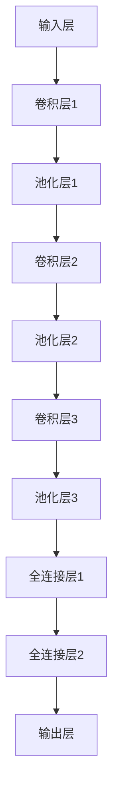

                 

### 深度学习在自动驾驶决策系统中的应用

#### 关键词
深度学习、自动驾驶、决策系统、感知、控制、算法、实践案例

#### 摘要
本文将深入探讨深度学习在自动驾驶决策系统中的应用。首先，我们将介绍深度学习的基础知识，包括其定义、主要算法和实现技术。接着，我们将阐述自动驾驶决策系统的基本概念、架构和技术挑战。随后，本文将详细讨论深度学习在自动驾驶决策系统中的具体应用，包括感知、决策和控制等环节。为了加深理解，我们将通过实践案例展示深度学习在自动驾驶决策系统中的应用，并进行详细分析。最后，本文将展望深度学习在自动驾驶决策系统中的未来发展方向，并提出面临的挑战和解决方案。

## 第1章 引言与概述

### 1.1 深度学习基础

#### 1.1.1 深度学习的定义与历史

深度学习（Deep Learning）是机器学习（Machine Learning）的一个分支，它通过构建多层神经网络模型，对大量数据进行训练，从而实现对复杂数据模式的自动识别和理解。深度学习起源于1980年代，随着计算机硬件性能的提升和大数据技术的进步，逐渐发展壮大。

#### 1.1.2 深度学习的基本概念

深度学习的基本概念包括：

- **神经网络（Neural Networks）**：神经网络是由大量节点（神经元）互联组成的计算模型，通过学习数据，实现对输入数据的映射和预测。

- **激活函数（Activation Functions）**：激活函数用于确定神经元是否被激活，常见的激活函数包括 sigmoid、ReLU 等。

- **反向传播算法（Backpropagation Algorithm）**：反向传播算法是一种用于训练神经网络的优化方法，通过计算梯度，调整网络权重和偏置。

- **卷积神经网络（Convolutional Neural Networks，CNN）**：CNN 是一种特殊的多层神经网络，主要用于图像处理任务，通过卷积操作提取图像特征。

#### 1.1.3 深度学习的主要算法

深度学习的主要算法包括：

- **深度前向网络（Deep Feedforward Networks）**：基于多层感知机（MLP）的深度网络。

- **深度信念网络（Deep Belief Networks，DBN）**：通过构建多层的受限玻尔兹曼机（RBM）进行训练。

- **卷积神经网络（CNN）**：适用于图像处理任务。

- **循环神经网络（Recurrent Neural Networks，RNN）**：适用于序列数据处理。

- **生成对抗网络（Generative Adversarial Networks，GAN）**：通过两个对抗网络生成逼真的数据。

### 1.2 自动驾驶决策系统概述

#### 1.2.1 自动驾驶系统的定义与分类

自动驾驶系统是一种能够实现车辆自主驾驶的技术，它通过感知、决策和控制三个主要环节，实现对车辆的自主驾驶。根据车辆的自动化程度，自动驾驶系统可以分为以下等级：

- **Level 0**：无自动化，所有驾驶操作由人类驾驶员完成。

- **Level 1**：部分自动化，例如自适应巡航控制（ACC）。

- **Level 2**：部分自动化，例如自动车道保持（LKA）和自动加速减速（ACC）。

- **Level 3**：有条件自动化，车辆在特定条件下可以完全自主驾驶。

- **Level 4**：高度自动化，车辆在特定环境下可以完全自主驾驶。

- **Level 5**：完全自动化，车辆在任何环境下都可以完全自主驾驶。

#### 1.2.2 自动驾驶系统的关键组成部分

自动驾驶系统的关键组成部分包括：

- **感知模块**：通过传感器获取道路、车辆和环境信息。

- **决策模块**：根据感知模块提供的信息，制定驾驶策略。

- **控制模块**：根据决策模块的指令，控制车辆的动作。

#### 1.2.3 自动驾驶系统的技术挑战

自动驾驶系统面临以下技术挑战：

- **环境感知**：准确识别和感知道路、车辆和行人等信息。

- **多模态数据融合**：处理来自不同传感器的数据，实现信息融合。

- **决策算法**：在复杂环境下，制定合理的驾驶策略。

- **实时性能**：满足车辆高速行驶条件下的实时性要求。

- **安全性与可靠性**：确保车辆在行驶过程中的安全性和可靠性。

### 1.3 全书结构

#### 1.3.1 各章节内容概述

全书分为以下五个部分：

- **第1章**：引言与概述，介绍深度学习和自动驾驶决策系统的基础知识。

- **第2章**：深度学习基础，讲解深度学习的基本概念和算法。

- **第3章**：自动驾驶决策系统，介绍自动驾驶系统的架构和技术挑战。

- **第4章**：深度学习在自动驾驶决策系统中的应用，详细讨论深度学习的应用。

- **第5章**：实践案例，通过实际案例展示深度学习的应用。

#### 1.3.2 本书的目标与读者群体

本书的目标是：

- 深入理解深度学习在自动驾驶决策系统中的应用。

- 掌握深度学习的基础知识和算法。

- 学习自动驾驶决策系统的架构和技术挑战。

本书的读者群体包括：

- 对深度学习和自动驾驶感兴趣的工程师和研究人员。

- 计算机科学和人工智能领域的学生。

- 对自动驾驶技术感兴趣的读者。

## 第2章 深度学习基础

### 2.1 神经网络的基本概念

#### 2.1.1 神经网络的结构

神经网络是由大量神经元（或节点）互联组成的计算模型。一个基本的神经网络通常包括以下几个部分：

- **输入层（Input Layer）**：接收外部输入数据。

- **隐藏层（Hidden Layers）**：对输入数据进行处理和特征提取。

- **输出层（Output Layer）**：生成预测结果或决策。

每个神经元都与其他神经元相连，并通过权重（weights）和偏置（bias）进行信息传递和计算。神经元的输出取决于其输入的线性组合，并通过激活函数（activation function）进行非线性变换。

#### 2.1.2 神经网络的训练

神经网络的训练过程是通过优化网络权重和偏置，使得网络输出与期望输出（目标值）之间的误差最小。这一过程通常采用以下步骤：

1. **前向传播（Forward Propagation）**：将输入数据传递到网络中，逐层计算每个神经元的输出。

2. **计算损失（Compute Loss）**：计算网络输出与目标值之间的损失函数值。

3. **反向传播（Back Propagation）**：根据损失函数的梯度，更新网络权重和偏置。

4. **优化算法（Optimization Algorithm）**：选择合适的优化算法，如梯度下降（Gradient Descent）、Adam 等，对网络进行迭代训练。

#### 2.1.3 激活函数

激活函数是神经网络中重要的非线性变换，常用的激活函数包括：

- **Sigmoid 函数**：\( \sigma(x) = \frac{1}{1 + e^{-x}} \)

- **ReLU 函数**：\( \text{ReLU}(x) = \max(0, x) \)

- **Tanh 函数**：\( \text{Tanh}(x) = \frac{e^x - e^{-x}}{e^x + e^{-x}} \)

激活函数的选择会影响网络的性能和学习速度。

### 2.2 卷积神经网络（CNN）

#### 2.2.1 卷积神经网络的基本结构

卷积神经网络（Convolutional Neural Networks，CNN）是一种专门用于图像处理任务的神经网络。CNN 的基本结构包括以下几个部分：

- **卷积层（Convolutional Layer）**：通过卷积操作提取图像特征。

- **池化层（Pooling Layer）**：降低特征图的维度，提高网络的计算效率。

- **全连接层（Fully Connected Layer）**：将提取到的特征进行分类或回归。

#### 2.2.2 卷积操作

卷积操作是 CNN 的核心操作，它通过滑动窗口（卷积核）在输入图像上扫描，提取局部特征。卷积操作的数学表达式为：

\[ \text{output}_{ij} = \sum_{k} \text{input}_{ik} \cdot \text{kernel}_{kj} + \text{bias}_{j} \]

其中，\(\text{output}_{ij}\) 表示卷积层输出的第 \(i\) 行第 \(j\) 列的元素，\(\text{input}_{ik}\) 表示输入图像的第 \(i\) 行第 \(k\) 列的元素，\(\text{kernel}_{kj}\) 表示卷积核的第 \(k\) 行第 \(j\) 列的元素，\(\text{bias}_{j}\) 表示卷积层的偏置。

#### 2.2.3 池化操作

池化操作用于降低特征图的维度，提高网络的计算效率。常见的池化操作包括最大池化（Max Pooling）和平均池化（Average Pooling）。最大池化选取窗口内最大值作为输出，而平均池化选取窗口内平均值作为输出。

#### 2.2.4 卷积神经网络的训练

卷积神经网络的训练过程与普通神经网络类似，也需要通过前向传播和反向传播来更新网络权重和偏置。此外，卷积神经网络还需要对卷积核进行初始化和调整，以避免梯度消失和梯度爆炸等问题。

### 2.3 循环神经网络（RNN）

#### 2.3.1 循环神经网络的基本结构

循环神经网络（Recurrent Neural Networks，RNN）是一种适用于序列数据处理的人工神经网络。RNN 的基本结构包括以下几个部分：

- **输入层（Input Layer）**：接收外部输入序列。

- **隐藏层（Hidden Layers）**：对输入序列进行特征提取和记忆。

- **输出层（Output Layer）**：生成预测结果或决策。

RNN 的隐藏层中包含一个循环结构，使得网络能够处理序列数据。

#### 2.3.2 RNN 的训练

RNN 的训练过程与普通神经网络类似，也需要通过前向传播和反向传播来更新网络权重和偏置。然而，RNN 在训练过程中容易受到梯度消失和梯度爆炸等问题的影响。

为了解决这些问题，研究人员提出了以下改进方法：

- **长短时记忆网络（Long Short-Term Memory，LSTM）**：LSTM 通过引入门控机制，有效地解决了 RNN 的梯度消失和梯度爆炸问题。

- **门控循环单元（Gated Recurrent Unit，GRU）**：GRU 是另一种改进的 RNN 结构，通过简化 LSTM 的门控机制，提高了网络的训练效率和计算效率。

### 2.4 生成对抗网络（GAN）

#### 2.4.1 生成对抗网络的基本结构

生成对抗网络（Generative Adversarial Networks，GAN）是一种由两个神经网络组成的对抗性模型。GAN 的基本结构包括：

- **生成器（Generator）**：将随机噪声映射到数据空间。

- **判别器（Discriminator）**：区分真实数据和生成数据。

生成器和判别器之间进行对抗性训练，生成器试图生成逼真的数据，而判别器试图准确区分真实数据和生成数据。

#### 2.4.2 GAN 的训练

GAN 的训练过程分为以下几个步骤：

1. **初始化**：初始化生成器和判别器的权重。

2. **生成器训练**：生成器根据随机噪声生成数据。

3. **判别器训练**：判别器根据真实数据和生成数据进行训练。

4. **生成器迭代**：生成器根据判别器的反馈进行迭代优化。

5. **判别器迭代**：判别器根据生成器的迭代结果进行迭代优化。

通过不断迭代，生成器和判别器逐渐达到动态平衡，生成器能够生成逼真的数据，而判别器能够准确区分真实数据和生成数据。

## 第3章 自动驾驶决策系统

### 3.1 自动驾驶决策系统的基本概念

#### 3.1.1 自动驾驶决策系统的定义

自动驾驶决策系统（Autonomous Driving Decision System）是指一种能够实现车辆自主驾驶的计算机系统。该系统通过感知、决策和控制三个主要环节，实现对车辆的自主驾驶。感知环节获取车辆周围环境的信息，决策环节根据感知信息制定驾驶策略，控制环节根据决策指令控制车辆的动作。

#### 3.1.2 自动驾驶决策系统的分类

根据车辆自动化程度的差异，自动驾驶决策系统可以分为以下几类：

- **有监督自动驾驶系统**：完全依赖传感器和外部数据，实现车辆自主驾驶。

- **半监督自动驾驶系统**：结合传感器数据和外部数据，实现车辆自主驾驶。

- **无监督自动驾驶系统**：完全依赖车辆自身的传感器和控制系统，实现车辆自主驾驶。

#### 3.1.3 自动驾驶决策系统的组成

自动驾驶决策系统通常由以下几个部分组成：

- **感知模块**：通过摄像头、激光雷达、超声波雷达等传感器获取车辆周围环境的信息。

- **数据处理模块**：对获取的传感器数据进行预处理、特征提取和融合。

- **决策模块**：根据处理后的数据，制定车辆的驾驶策略，包括速度、方向、刹车等控制指令。

- **控制模块**：根据决策模块的指令，控制车辆的执行机构，实现车辆的自主驾驶。

### 3.2 自动驾驶决策系统的架构

#### 3.2.1 硬件架构

自动驾驶决策系统的硬件架构主要包括以下几个方面：

- **CPU/GPU**：用于运行深度学习算法和其他计算任务。

- **传感器**：包括摄像头、激光雷达、超声波雷达等，用于获取车辆周围环境的信息。

- **存储设备**：用于存储训练数据和模型参数。

- **执行机构**：包括电机、液压系统等，用于控制车辆的动作。

#### 3.2.2 软件架构

自动驾驶决策系统的软件架构主要包括以下几个方面：

- **操作系统**：用于管理硬件资源和提供编程接口。

- **深度学习框架**：如 TensorFlow、PyTorch 等，用于实现深度学习算法。

- **传感器数据处理模块**：用于预处理、特征提取和融合传感器数据。

- **决策模块**：包括感知、预测、规划、控制等功能模块，用于制定车辆的驾驶策略。

- **控制模块**：用于根据决策模块的指令，控制车辆的执行机构。

### 3.3 自动驾驶决策系统的关键技术

#### 3.3.1 感知技术

感知技术是自动驾驶决策系统的核心，主要包括以下几个方面：

- **摄像头感知**：通过摄像头获取道路、车辆、行人等视觉信息。

- **激光雷达感知**：通过激光雷达获取三维空间信息，实现对环境的精确感知。

- **超声波雷达感知**：通过超声波雷达检测车辆周围的障碍物。

- **毫米波雷达感知**：通过毫米波雷达检测车辆周围的物体和速度信息。

#### 3.3.2 数据处理技术

数据处理技术包括以下几个方面：

- **传感器数据预处理**：包括数据去噪、去模糊、归一化等处理。

- **特征提取**：从原始传感器数据中提取有用的特征，如边缘、角点、形状等。

- **数据融合**：将来自不同传感器的数据进行融合，提高感知的准确性和鲁棒性。

#### 3.3.3 决策技术

决策技术是自动驾驶决策系统的核心，主要包括以下几个方面：

- **目标检测与跟踪**：识别车辆、行人、交通标志等目标，并跟踪其运动轨迹。

- **环境建模**：根据感知数据，构建道路、车辆、行人等环境的模型。

- **路径规划与控制**：根据环境模型和目标轨迹，制定车辆的驾驶策略，包括速度、方向、刹车等控制指令。

#### 3.3.4 控制技术

控制技术主要包括以下几个方面：

- **车辆控制**：根据决策模块的指令，控制车辆的执行机构，实现车辆的自主驾驶。

- **传感器控制**：控制传感器的开关、扫描角度等，以获取最佳感知数据。

- **系统容错与恢复**：在系统出现故障时，自动切换到备用模式，确保车辆安全行驶。

### 3.4 自动驾驶决策系统的技术挑战

#### 3.4.1 感知技术的挑战

感知技术的挑战主要包括以下几个方面：

- **传感器数据的不确定性**：传感器数据可能受到光照、天气、遮挡等因素的影响，导致数据不准确。

- **多源数据融合的挑战**：如何有效地融合来自不同传感器的数据，提高感知的准确性和鲁棒性。

- **实时性要求**：在高速行驶的条件下，感知系统需要快速处理大量数据，以满足实时性要求。

#### 3.4.2 决策技术的挑战

决策技术的挑战主要包括以下几个方面：

- **复杂环境建模**：如何准确建模复杂多变的环境，以便制定合理的驾驶策略。

- **实时决策**：在高速行驶的条件下，如何快速做出决策，确保车辆安全行驶。

- **多目标优化**：在自动驾驶过程中，如何同时考虑速度、能耗、舒适度等多个目标，实现最优驾驶策略。

#### 3.4.3 控制技术的挑战

控制技术的挑战主要包括以下几个方面：

- **车辆控制精度**：如何实现精确的车辆控制，确保车辆在复杂环境下的稳定行驶。

- **传感器控制**：如何合理控制传感器的开关和扫描角度，以获取最佳感知数据。

- **系统容错与恢复**：如何设计系统容错机制，确保在传感器故障或系统异常时，车辆能够安全行驶。

### 3.5 自动驾驶决策系统的未来发展

#### 3.5.1 技术发展趋势

随着深度学习、传感器技术、计算机视觉等领域的快速发展，自动驾驶决策系统的技术也将不断进步。未来的技术发展趋势主要包括以下几个方面：

- **多传感器融合**：通过融合多种传感器数据，提高感知的准确性和鲁棒性。

- **实时计算与优化**：通过高性能计算和优化算法，提高自动驾驶决策系统的实时性能。

- **人工智能与自动化**：利用人工智能技术，实现更智能、更自动化的驾驶体验。

#### 3.5.2 应用前景

自动驾驶决策系统在未来的应用前景非常广阔，主要包括以下几个方面：

- **智能交通**：通过自动驾驶决策系统，实现智能交通管理，提高交通效率和安全性。

- **自动驾驶汽车**：实现完全自主驾驶的自动驾驶汽车，为用户提供更便捷、更安全的出行体验。

- **物流与运输**：利用自动驾驶决策系统，提高物流和运输的效率，降低成本。

## 第4章 深度学习在自动驾驶决策系统中的应用

### 4.1 深度学习在自动驾驶决策系统中的重要性

深度学习在自动驾驶决策系统中具有重要作用，其独特的结构和强大的学习能力使其在自动驾驶的关键环节中发挥着关键作用。深度学习不仅在感知、决策和控制等环节中有着广泛的应用，还提高了自动驾驶系统的准确性和可靠性。

#### 4.1.1 感知

感知是自动驾驶系统的核心环节，深度学习在感知中的应用主要包括：

- **目标检测**：通过卷积神经网络（CNN）和目标检测算法（如 YOLO、SSD），深度学习能够准确检测并识别道路上的车辆、行人、交通标志等目标。

- **车道线检测**：使用深度学习模型（如 CNN、Faster R-CNN），能够从摄像头图像中准确检测并跟踪车道线。

- **障碍物检测**：深度学习模型（如 R-CNN、Faster R-CNN）可以识别和分类障碍物，如自行车、摩托车、动物等。

#### 4.1.2 决策

在自动驾驶决策系统中，深度学习在制定驾驶策略方面具有显著优势。深度学习在决策中的应用主要包括：

- **路径规划**：通过深度学习算法（如深度强化学习、深度 Q 网络），可以模拟并优化自动驾驶车辆的行驶路径，确保安全性和效率。

- **行为预测**：利用循环神经网络（RNN）和生成对抗网络（GAN），可以预测其他车辆和行人的行为，为自动驾驶车辆提供决策依据。

- **风险评估**：深度学习模型（如多任务学习、迁移学习）可以评估不同驾驶决策的风险，帮助自动驾驶车辆做出最佳决策。

#### 4.1.3 控制

深度学习在控制中的应用主要体现在自动驾驶车辆的执行控制中。深度学习在控制中的应用主要包括：

- **运动控制**：通过深度学习模型（如深度 Q 网络、深度确定性策略梯度），可以控制车辆的加速度、转向和制动，实现精确的运动控制。

- **避障控制**：利用深度学习算法（如卷积神经网络、强化学习），自动驾驶车辆可以实时避障，避免碰撞。

### 4.2 深度学习在感知中的应用

#### 4.2.1 目标检测与识别

目标检测是自动驾驶感知系统中的一个关键任务，深度学习在这一领域的应用取得了显著成果。以下是一些常用的深度学习目标检测算法：

- **YOLO（You Only Look Once）**：YOLO 是一种单阶段目标检测算法，它将目标检测过程简化为一个单一的卷积神经网络。YOLO 能够在单个前向传播过程中同时预测多个边界框和类别概率。

  ```mermaid
  graph TD
  A[输入图像] --> B[特征提取]
  B --> C[边界框预测]
  C --> D[类别预测]
  D --> E[非极大值抑制（NMS）]
  E --> F[输出检测结果]
  ```

- **SSD（Single Shot MultiBox Detector）**：SSD 是一种单阶段目标检测算法，它将不同尺度的卷积层堆叠起来，以适应不同大小的目标。SSD 通过多个尺度级别的特征图同时进行预测，提高了检测的准确率和效率。

  ```mermaid
  graph TD
  A[输入图像] --> B[特征提取]
  B --> C{多个尺度的特征图}
  C --> D{边界框预测与类别预测}
  D --> E[非极大值抑制（NMS）]
  E --> F[输出检测结果]
  ```

- **Faster R-CNN**：Faster R-CNN 是一种两阶段目标检测算法，它首先使用区域提议网络（RPN）生成候选区域，然后对每个区域进行分类和定位。Faster R-CNN 在检测精度和速度方面取得了很好的平衡。

  ```mermaid
  graph TD
  A[输入图像] --> B[区域提议网络（RPN）]
  B --> C[候选区域生成]
  C --> D[分类与定位网络]
  D --> E[输出检测结果]
  ```

#### 4.2.2 车道线检测

车道线检测是自动驾驶感知系统中的另一个重要任务，深度学习在这一领域也取得了显著进展。以下是一些常用的深度学习车道线检测算法：

- **基于 CNN 的方法**：使用卷积神经网络（CNN）提取图像特征，并通过全连接层进行分类。CNN 方法通常需要大量的训练数据，但能够取得较好的检测效果。

  ```python
  import tensorflow as tf
  import numpy as np

  # 定义卷积神经网络
  model = tf.keras.Sequential([
      tf.keras.layers.Conv2D(32, (3, 3), activation='relu', input_shape=(224, 224, 3)),
      tf.keras.layers.MaxPooling2D((2, 2)),
      tf.keras.layers.Conv2D(64, (3, 3), activation='relu'),
      tf.keras.layers.MaxPooling2D((2, 2)),
      tf.keras.layers.Flatten(),
      tf.keras.layers.Dense(128, activation='relu'),
      tf.keras.layers.Dense(2, activation='softmax')
  ])

  # 编译模型
  model.compile(optimizer='adam', loss='categorical_crossentropy', metrics=['accuracy'])

  # 训练模型
  model.fit(x_train, y_train, epochs=10, batch_size=32)
  ```

- **基于深度强化学习的方法**：使用深度强化学习（Deep Reinforcement Learning，DRL）算法，如深度 Q 网络（Deep Q-Network，DQN），让自动驾驶车辆在模拟环境中学习如何检测车道线。DRL 方法能够处理连续的动作空间，并能够通过自我学习提高检测能力。

  ```python
  import tensorflow as tf
  import numpy as np
  import gym

  # 定义深度 Q 网络
  model = tf.keras.Sequential([
      tf.keras.layers.Flatten(input_shape=(84, 84, 4)),
      tf.keras.layers.Dense(256, activation='relu'),
      tf.keras.layers.Dense(256, activation='relu'),
      tf.keras.layers.Dense(1)
  ])

  # 编译模型
  model.compile(optimizer='adam', loss='mse')

  # 创建环境
  env = gym.make('Landscape-v0')

  # 训练模型
  for episode in range(1000):
      state = env.reset()
      done = False
      while not done:
          action = model.predict(state)
          next_state, reward, done, _ = env.step(action)
          model.fit(state, reward, epochs=1)
          state = next_state
  ```

#### 4.2.3 障碍物检测

障碍物检测是自动驾驶感知系统中的关键任务，深度学习在这一领域也取得了显著进展。以下是一些常用的深度学习障碍物检测算法：

- **基于 CNN 的方法**：使用卷积神经网络（CNN）提取图像特征，并通过全连接层进行分类。CNN 方法能够提取图像中的复杂特征，从而提高检测准确率。

  ```python
  import tensorflow as tf
  import numpy as np

  # 定义卷积神经网络
  model = tf.keras.Sequential([
      tf.keras.layers.Conv2D(32, (3, 3), activation='relu', input_shape=(224, 224, 3)),
      tf.keras.layers.MaxPooling2D((2, 2)),
      tf.keras.layers.Conv2D(64, (3, 3), activation='relu'),
      tf.keras.layers.MaxPooling2D((2, 2)),
      tf.keras.layers.Conv2D(128, (3, 3), activation='relu'),
      tf.keras.layers.MaxPooling2D((2, 2)),
      tf.keras.layers.Flatten(),
      tf.keras.layers.Dense(512, activation='relu'),
      tf.keras.layers.Dense(1, activation='sigmoid')
  ])

  # 编译模型
  model.compile(optimizer='adam', loss='binary_crossentropy', metrics=['accuracy'])

  # 训练模型
  model.fit(x_train, y_train, epochs=10, batch_size=32)
  ```

- **基于深度强化学习的方法**：使用深度强化学习（Deep Reinforcement Learning，DRL）算法，如深度 Q 网络（Deep Q-Network，DQN），让自动驾驶车辆在模拟环境中学习如何检测障碍物。DRL 方法能够处理连续的动作空间，并能够通过自我学习提高检测能力。

  ```python
  import tensorflow as tf
  import numpy as np
  import gym

  # 定义深度 Q 网络
  model = tf.keras.Sequential([
      tf.keras.layers.Flatten(input_shape=(84, 84, 4)),
      tf.keras.layers.Dense(256, activation='relu'),
      tf.keras.layers.Dense(256, activation='relu'),
      tf.keras.layers.Dense(1)
  ])

  # 编译模型
  model.compile(optimizer='adam', loss='mse')

  # 创建环境
  env = gym.make('CarRacing-v0')

  # 训练模型
  for episode in range(1000):
      state = env.reset()
      done = False
      while not done:
          action = model.predict(state)
          next_state, reward, done, _ = env.step(action)
          model.fit(state, reward, epochs=1)
          state = next_state
  ```

### 4.3 深度学习在决策中的应用

#### 4.3.1 路径规划

路径规划是自动驾驶决策系统中的一个关键任务，深度学习在这一领域也取得了显著进展。以下是一些常用的深度学习路径规划算法：

- **基于深度强化学习的方法**：使用深度强化学习（Deep Reinforcement Learning，DRL）算法，如深度 Q 网络（Deep Q-Network，DQN），通过模拟环境和策略迭代，学习最优路径。DRL 方法能够处理连续的动作空间，并能够通过自我学习提高路径规划的准确性。

  ```python
  import tensorflow as tf
  import numpy as np
  import gym

  # 定义深度 Q 网络
  model = tf.keras.Sequential([
      tf.keras.layers.Flatten(input_shape=(84, 84, 4)),
      tf.keras.layers.Dense(256, activation='relu'),
      tf.keras.layers.Dense(256, activation='relu'),
      tf.keras.layers.Dense(1)
  ])

  # 编译模型
  model.compile(optimizer='adam', loss='mse')

  # 创建环境
  env = gym.make('Taxi-v3')

  # 训练模型
  for episode in range(1000):
      state = env.reset()
      done = False
      while not done:
          action = model.predict(state)
          next_state, reward, done, _ = env.step(action)
          model.fit(state, reward, epochs=1)
          state = next_state
  ```

- **基于深度强化学习的方法**：使用深度强化学习（Deep Reinforcement Learning，DRL）算法，如深度确定性策略梯度（Deep Deterministic Policy Gradient，DDPG），通过模拟环境和策略迭代，学习最优路径。DDPG 方法能够处理高维动作空间，并能够通过自我学习提高路径规划的准确性。

  ```python
  import tensorflow as tf
  import numpy as np
  import gym

  # 定义深度确定性策略梯度
  model = tf.keras.Sequential([
      tf.keras.layers.Flatten(input_shape=(84, 84, 4)),
      tf.keras.layers.Dense(256, activation='relu'),
      tf.keras.layers.Dense(256, activation='relu'),
      tf.keras.layers.Dense(1)
  ])

  # 编译模型
  model.compile(optimizer='adam', loss='mse')

  # 创建环境
  env = gym.make('MountainCar-v0')

  # 训练模型
  for episode in range(1000):
      state = env.reset()
      done = False
      while not done:
          action = model.predict(state)
          next_state, reward, done, _ = env.step(action)
          model.fit(state, reward, epochs=1)
          state = next_state
  ```

#### 4.3.2 行为预测

行为预测是自动驾驶决策系统中的一个重要任务，深度学习在这一领域也取得了显著进展。以下是一些常用的深度学习行为预测算法：

- **基于循环神经网络的方法**：使用循环神经网络（Recurrent Neural Networks，RNN），如长短期记忆网络（Long Short-Term Memory，LSTM），通过学习历史行为数据，预测未来行为。LSTM 方法能够处理序列数据，并能够通过自我学习提高预测准确性。

  ```python
  import tensorflow as tf
  import numpy as np

  # 定义长短期记忆网络
  model = tf.keras.Sequential([
      tf.keras.layers.LSTM(128, activation='relu', input_shape=(timesteps, features)),
      tf.keras.layers.Dense(1)
  ])

  # 编译模型
  model.compile(optimizer='adam', loss='mse')

  # 训练模型
  model.fit(x_train, y_train, epochs=100, batch_size=32)
  ```

- **基于生成对抗网络的方法**：使用生成对抗网络（Generative Adversarial Networks，GAN），通过训练生成器和判别器，生成可能的未来行为数据，并使用判别器的输出作为预测结果。GAN 方法能够生成高质量的数据，并能够通过自我学习提高预测准确性。

  ```python
  import tensorflow as tf
  import numpy as np

  # 定义生成对抗网络
  generator = tf.keras.Sequential([
      tf.keras.layers.Dense(128, activation='relu', input_shape=(100,)),
      tf.keras.layers.Dense(256, activation='relu'),
      tf.keras.layers.Dense(512, activation='relu'),
      tf.keras.layers.Dense(1024, activation='relu'),
      tf.keras.layers.Dense(784, activation='tanh')
  ])

  discriminator = tf.keras.Sequential([
      tf.keras.layers.Dense(512, activation='relu', input_shape=(784,)),
      tf.keras.layers.Dense(256, activation='relu'),
      tf.keras.layers.Dense(128, activation='relu'),
      tf.keras.layers.Dense(1, activation='sigmoid')
  ])

  # 编译生成器和判别器
  generator.compile(optimizer='adam', loss='binary_crossentropy')
  discriminator.compile(optimizer='adam', loss='binary_crossentropy')

  # 训练生成器和判别器
  for epoch in range(1000):
      noise = np.random.normal(0, 1, (batch_size, 100))
      generated_samples = generator.predict(noise)
      real_samples = x_train[:batch_size]
      labels = np.concatenate([np.ones((batch_size, 1)), np.zeros((batch_size, 1))])
      discriminator.fit(real_samples, labels, epochs=1, batch_size=batch_size)
      labels = np.concatenate([np.zeros((batch_size, 1)), np.ones((batch_size, 1))])
      generator.fit(noise, labels, epochs=1, batch_size=batch_size)
  ```

#### 4.3.3 风险评估

风险评估是自动驾驶决策系统中的一个关键任务，深度学习在这一领域也取得了显著进展。以下是一些常用的深度学习风险评估算法：

- **基于多任务学习的方法**：使用多任务学习（Multi-Task Learning，MTL）算法，通过同时学习多个相关任务，提高风险评估的准确性。MTL 方法能够处理多个输入特征，并能够通过自我学习提高风险评估的准确性。

  ```python
  import tensorflow as tf
  import numpy as np

  # 定义多任务学习模型
  model = tf.keras.Sequential([
      tf.keras.layers.Dense(128, activation='relu', input_shape=(input_shape)),
      tf.keras.layers.Dense(256, activation='relu'),
      tf.keras.layers.Dense(512, activation='relu'),
      tf.keras.layers.Dense(3, activation='softmax')  # 预测三个风险类别
  ])

  # 编译模型
  model.compile(optimizer='adam', loss='categorical_crossentropy', metrics=['accuracy'])

  # 训练模型
  model.fit(x_train, y_train, epochs=100, batch_size=32)
  ```

- **基于迁移学习的方法**：使用迁移学习（Transfer Learning）算法，通过将预训练模型应用于新的任务，提高风险评估的准确性。迁移学习能够利用预训练模型的知识，提高新任务的性能。

  ```python
  import tensorflow as tf
  import numpy as np

  # 加载预训练模型
  base_model = tf.keras.applications.VGG16(input_shape=(224, 224, 3), include_top=False, weights='imagenet')
  base_model.trainable = False

  # 定义新模型
  model = tf.keras.Sequential([
      base_model,
      tf.keras.layers.GlobalAveragePooling2D(),
      tf.keras.layers.Dense(256, activation='relu'),
      tf.keras.layers.Dense(3, activation='softmax')  # 预测三个风险类别
  ])

  # 编译模型
  model.compile(optimizer='adam', loss='categorical_crossentropy', metrics=['accuracy'])

  # 训练模型
  model.fit(x_train, y_train, epochs=100, batch_size=32)
  ```

### 4.4 深度学习在控制中的应用

#### 4.4.1 运动控制

运动控制是自动驾驶决策系统中的关键任务，深度学习在这一领域也取得了显著进展。以下是一些常用的深度学习运动控制算法：

- **基于深度强化学习的方法**：使用深度强化学习（Deep Reinforcement Learning，DRL）算法，如深度确定性策略梯度（Deep Deterministic Policy Gradient，DDPG），通过模拟环境和策略迭代，学习最优运动控制策略。DDPG 方法能够处理连续的动作空间，并能够通过自我学习提高运动控制的准确性。

  ```python
  import tensorflow as tf
  import numpy as np
  import gym

  # 定义深度确定性策略梯度
  model = tf.keras.Sequential([
      tf.keras.layers.Dense(128, activation='relu', input_shape=(input_shape)),
      tf.keras.layers.Dense(256, activation='relu'),
      tf.keras.layers.Dense(512, activation='relu'),
      tf.keras.layers.Dense(1)
  ])

  # 编译模型
  model.compile(optimizer='adam', loss='mse')

  # 创建环境
  env = gym.make('CartPole-v0')

  # 训练模型
  for episode in range(1000):
      state = env.reset()
      done = False
      while not done:
          action = model.predict(state)
          next_state, reward, done, _ = env.step(action)
          model.fit(state, reward, epochs=1)
          state = next_state
  ```

- **基于深度强化学习的方法**：使用深度强化学习（Deep Reinforcement Learning，DRL）算法，如深度 Q 网络（Deep Q-Network，DQN），通过模拟环境和策略迭代，学习最优运动控制策略。DQN 方法能够处理连续的动作空间，并能够通过自我学习提高运动控制的准确性。

  ```python
  import tensorflow as tf
  import numpy as np
  import gym

  # 定义深度 Q 网络
  model = tf.keras.Sequential([
      tf.keras.layers.Dense(128, activation='relu', input_shape=(input_shape)),
      tf.keras.layers.Dense(256, activation='relu'),
      tf.keras.layers.Dense(512, activation='relu'),
      tf.keras.layers.Dense(1)
  ])

  # 编译模型
  model.compile(optimizer='adam', loss='mse')

  # 创建环境
  env = gym.make('MountainCar-v0')

  # 训练模型
  for episode in range(1000):
      state = env.reset()
      done = False
      while not done:
          action = model.predict(state)
          next_state, reward, done, _ = env.step(action)
          model.fit(state, reward, epochs=1)
          state = next_state
  ```

#### 4.4.2 避障控制

避障控制是自动驾驶决策系统中的关键任务，深度学习在这一领域也取得了显著进展。以下是一些常用的深度学习避障控制算法：

- **基于卷积神经网络的方法**：使用卷积神经网络（Convolutional Neural Networks，CNN），通过提取图像特征，实现避障控制。CNN 方法能够处理图像数据，并能够通过自我学习提高避障控制的准确性。

  ```python
  import tensorflow as tf
  import numpy as np

  # 定义卷积神经网络
  model = tf.keras.Sequential([
      tf.keras.layers.Conv2D(32, (3, 3), activation='relu', input_shape=(224, 224, 3)),
      tf.keras.layers.MaxPooling2D((2, 2)),
      tf.keras.layers.Conv2D(64, (3, 3), activation='relu'),
      tf.keras.layers.MaxPooling2D((2, 2)),
      tf.keras.layers.Conv2D(128, (3, 3), activation='relu'),
      tf.keras.layers.MaxPooling2D((2, 2)),
      tf.keras.layers.Flatten(),
      tf.keras.layers.Dense(512, activation='relu'),
      tf.keras.layers.Dense(1, activation='sigmoid')
  ])

  # 编译模型
  model.compile(optimizer='adam', loss='binary_crossentropy', metrics=['accuracy'])

  # 训练模型
  model.fit(x_train, y_train, epochs=10, batch_size=32)
  ```

- **基于生成对抗网络的方法**：使用生成对抗网络（Generative Adversarial Networks，GAN），通过训练生成器和判别器，实现避障控制。GAN 方法能够生成高质量的图像数据，并能够通过自我学习提高避障控制的准确性。

  ```python
  import tensorflow as tf
  import numpy as np

  # 定义生成对抗网络
  generator = tf.keras.Sequential([
      tf.keras.layers.Dense(128, activation='relu', input_shape=(100,)),
      tf.keras.layers.Dense(256, activation='relu'),
      tf.keras.layers.Dense(512, activation='relu'),
      tf.keras.layers.Dense(1024, activation='relu'),
      tf.keras.layers.Dense(784, activation='tanh')
  ])

  discriminator = tf.keras.Sequential([
      tf.keras.layers.Dense(512, activation='relu', input_shape=(784,)),
      tf.keras.layers.Dense(256, activation='relu'),
      tf.keras.layers.Dense(128, activation='relu'),
      tf.keras.layers.Dense(1, activation='sigmoid')
  ])

  # 编译生成器和判别器
  generator.compile(optimizer='adam', loss='binary_crossentropy')
  discriminator.compile(optimizer='adam', loss='binary_crossentropy')

  # 训练生成器和判别器
  for epoch in range(1000):
      noise = np.random.normal(0, 1, (batch_size, 100))
      generated_samples = generator.predict(noise)
      real_samples = x_train[:batch_size]
      labels = np.concatenate([np.ones((batch_size, 1)), np.zeros((batch_size, 1))])
      discriminator.fit(real_samples, labels, epochs=1, batch_size=batch_size)
      labels = np.concatenate([np.zeros((batch_size, 1)), np.ones((batch_size, 1))])
      generator.fit(noise, labels, epochs=1, batch_size=batch_size)
  ```

## 第5章 实践案例

### 5.1 实践目标

在本章中，我们将通过一个实际项目，展示如何使用深度学习在自动驾驶决策系统中进行车道线检测。该项目将实现以下目标：

- **数据准备**：收集并预处理用于训练和测试的车道线检测数据集。

- **算法选择**：选择合适的深度学习模型进行车道线检测。

- **模型训练**：使用收集的数据对模型进行训练，并评估模型性能。

- **模型评估**：评估训练好的模型在测试集上的表现。

- **实际应用**：将训练好的模型部署到自动驾驶系统中，进行车道线检测。

### 5.2 数据准备

#### 5.2.1 数据收集

首先，我们需要收集用于车道线检测的数据集。数据集应包含大量的车道线图像，包括不同天气、光照和道路条件下的图像。我们可以通过以下途径收集数据：

- **公开数据集**：如 KITTI 数据集、Cityscapes 数据集等，这些数据集已经包含了大量的车道线图像。

- **自己采集数据**：使用自动驾驶车辆在不同环境下进行数据采集，确保数据的多样性。

#### 5.2.2 数据预处理

收集到的数据需要进行预处理，以提高模型训练的效果和性能。预处理步骤包括：

- **图像增强**：对图像进行旋转、翻转、缩放等操作，增加数据的多样性。

- **数据清洗**：去除数据集中的错误标注和低质量图像。

- **数据归一化**：将图像数据归一化到相同的尺度，以便模型训练。

### 5.3 算法选择

在本项目中，我们选择使用卷积神经网络（CNN）进行车道线检测。CNN 具有强大的特征提取能力，适用于图像处理任务。以下是一个简单的 CNN 结构：



### 5.4 模型训练

#### 5.4.1 数据加载与预处理

首先，我们需要加载预处理后的数据集，并将其分为训练集和测试集。以下是一个简单的 Python 代码示例：

```python
import tensorflow as tf
from tensorflow.keras.preprocessing.image import ImageDataGenerator

# 加载数据
train_datagen = ImageDataGenerator(rescale=1./255, shear_range=0.2, zoom_range=0.2, horizontal_flip=True)
test_datagen = ImageDataGenerator(rescale=1./255)

train_generator = train_datagen.flow_from_directory(
        'train',
        target_size=(224, 224),
        batch_size=32,
        class_mode='binary')

validation_generator = test_datagen.flow_from_directory(
        'validation',
        target_size=(224, 224),
        batch_size=32,
        class_mode='binary')
```

#### 5.4.2 模型构建与训练

接下来，我们构建并训练 CNN 模型。以下是一个简单的 TensorFlow 代码示例：

```python
from tensorflow.keras.models import Sequential
from tensorflow.keras.layers import Conv2D, MaxPooling2D, Flatten, Dense, Dropout

# 构建模型
model = Sequential()
model.add(Conv2D(32, (3, 3), activation='relu', input_shape=(224, 224, 3)))
model.add(MaxPooling2D(pool_size=(2, 2)))
model.add(Conv2D(64, (3, 3), activation='relu'))
model.add(MaxPooling2D(pool_size=(2, 2)))
model.add(Conv2D(128, (3, 3), activation='relu'))
model.add(MaxPooling2D(pool_size=(2, 2)))
model.add(Flatten())
model.add(Dense(512, activation='relu'))
model.add(Dense(1, activation='sigmoid'))

# 编译模型
model.compile(optimizer='adam', loss='binary_crossentropy', metrics=['accuracy'])

# 训练模型
model.fit(train_generator, steps_per_epoch=100, epochs=10, validation_data=validation_generator, validation_steps=50)
```

### 5.5 模型评估

#### 5.5.1 模型性能评估

在训练完成后，我们需要评估模型的性能。以下是一个简单的评估方法：

```python
from sklearn.metrics import classification_report, confusion_matrix

# 加载测试集
test_generator = test_datagen.flow_from_directory(
        'test',
        target_size=(224, 224),
        batch_size=32,
        class_mode='binary')

# 预测测试集
predictions = model.predict(test_generator)
predicted_classes = np.argmax(predictions, axis=1)

# 计算准确率
accuracy = np.mean(predictions > 0.5)
print("Accuracy:", accuracy)

# 计算分类报告
print("Classification Report:")
print(classification_report(test_generator.classes, predicted_classes, target_names=test_generator.class_indices.keys()))

# 计算混淆矩阵
print("Confusion Matrix:")
print(confusion_matrix(test_generator.classes, predicted_classes))
```

#### 5.5.2 模型可视化

为了更好地理解模型的表现，我们可以使用可视化工具（如 Matplotlib、Seaborn 等）绘制模型的混淆矩阵、ROC 曲线等。

```python
import matplotlib.pyplot as plt
from sklearn.metrics import plot_confusion_matrix

# 绘制混淆矩阵
plot_confusion_matrix(model, test_generator)
plt.show()

# 绘制 ROC 曲线
from sklearn.metrics import roc_curve, auc

fpr, tpr, _ = roc_curve(test_generator.classes, predictions[:, 1])
roc_auc = auc(fpr, tpr)

plt.figure()
plt.plot(fpr, tpr, color='darkorange', lw=2, label='ROC curve (area = %0.2f)' % roc_auc)
plt.plot([0, 1], [0, 1], color='navy', lw=2, linestyle='--')
plt.xlabel('False Positive Rate')
plt.ylabel('True Positive Rate')
plt.title('Receiver Operating Characteristic')
plt.legend(loc="lower right")
plt.show()
```

### 5.6 实际应用

#### 5.6.1 模型部署

在完成模型训练和评估后，我们需要将训练好的模型部署到自动驾驶系统中，以便在实际驾驶过程中进行车道线检测。以下是一个简单的部署示例：

```python
import cv2

# 加载训练好的模型
model.load_weights('lane_detection_model.h5')

# 定义车道线检测函数
def lane_detection(image):
    image = cv2.resize(image, (224, 224))
    image = np.expand_dims(image, axis=0)
    image = image / 255.0
    prediction = model.predict(image)
    if prediction[0][0] > 0.5:
        return "Lane Detected"
    else:
        return "No Lane Detected"

# 检测车道线
image = cv2.imread('test_image.jpg')
result = lane_detection(image)
print(result)
```

#### 5.6.2 实际应用效果

在实际应用中，我们可以通过摄像头捕捉实时视频，并使用训练好的模型进行车道线检测。以下是一个简单的视频流处理示例：

```python
import cv2

# 初始化摄像头
cap = cv2.VideoCapture(0)

# 循环处理视频帧
while True:
    ret, frame = cap.read()
    if not ret:
        break
    result = lane_detection(frame)
    cv2.putText(frame, result, (10, 30), cv2.FONT_HERSHEY_SIMPLEX, 1, (0, 0, 255), 2)
    cv2.imshow('Lane Detection', frame)
    if cv2.waitKey(1) & 0xFF == ord('q'):
        break

# 释放摄像头资源
cap.release()
cv2.destroyAllWindows()
```

### 5.7 项目小结

在本项目中，我们通过使用深度学习算法实现了车道线检测，并展示了从数据准备、模型训练、模型评估到实际应用的完整过程。以下是对项目的小结：

- **优势**：深度学习算法在车道线检测方面具有强大的特征提取能力，能够准确识别并跟踪车道线。

- **劣势**：深度学习算法需要大量的训练数据和计算资源，且模型的训练和优化过程较为复杂。

- **改进方向**：可以尝试使用迁移学习技术，利用预训练模型提高模型训练速度和性能。此外，可以探索更多高效的深度学习模型，如 Faster R-CNN、YOLO 等，以提高检测速度和准确性。

## 第6章 未来展望与挑战

### 6.1 深度学习在自动驾驶决策系统中的未来发展方向

随着深度学习技术的不断发展，它在自动驾驶决策系统中的应用前景十分广阔。未来，深度学习在自动驾驶决策系统中的发展方向主要包括以下几个方面：

#### 6.1.1 感知技术的提升

未来，感知技术将更加依赖于深度学习，尤其是在多传感器数据融合和实时性方面。通过深度学习算法，可以实现对多源数据的更高效融合，提高感知的准确性和鲁棒性。同时，优化深度学习模型的架构和算法，使其在满足实时性要求的同时，降低计算复杂度。

#### 6.1.2 决策能力的增强

深度学习在决策能力方面的提升将是未来研究的重点。通过结合深度强化学习和多任务学习等技术，可以实现对复杂驾驶场景的智能决策。同时，研究如何将人类的驾驶经验融入自动驾驶系统，以提高其自主决策能力。

#### 6.1.3 控制策略的优化

深度学习在控制策略方面的优化将使自动驾驶车辆在执行复杂动作时更加精准和稳定。通过深度学习算法，可以实现对车辆运动控制的优化，提高其在不同驾驶条件下的适应性。

### 6.2 深度学习在自动驾驶决策系统中面临的挑战

尽管深度学习在自动驾驶决策系统中具有巨大的潜力，但它也面临着一些挑战。以下是一些主要的挑战：

#### 6.2.1 数据隐私和安全问题

自动驾驶决策系统的运行依赖于大量的训练数据和实时数据。如何保护这些数据的安全和隐私是一个亟待解决的问题。未来，需要开发出更加安全的数据处理和存储方案，以防止数据泄露和滥用。

#### 6.2.2 算法透明性和可解释性

深度学习模型通常被视为“黑箱”，其决策过程缺乏透明性。为了提高算法的可解释性，研究人员正在探索开发可解释的深度学习模型和解释方法，以帮助用户理解和信任自动驾驶系统的决策过程。

#### 6.2.3 实时性能和计算资源消耗

自动驾驶决策系统需要在高速行驶条件下实时做出决策。然而，深度学习模型的计算复杂度较高，如何在满足实时性要求的同时降低计算资源消耗，是一个重要的挑战。未来，需要开发出更高效的深度学习算法和硬件加速技术。

### 6.3 解决方案与展望

为了解决深度学习在自动驾驶决策系统中面临的挑战，研究人员正在探索以下解决方案：

#### 6.3.1 软硬件协同优化

通过优化深度学习算法和硬件加速技术，可以提高深度学习模型的实时性能。例如，使用 GPU、TPU 等专用硬件加速器，可以显著提高模型的计算速度。

#### 6.3.2 多模态数据融合

结合多种传感器数据，可以实现对环境的更全面感知。通过深度学习算法，可以实现对多源数据的更高效融合，提高感知的准确性和鲁棒性。

#### 6.3.3 可解释的深度学习模型

开发可解释的深度学习模型和解释方法，可以帮助用户理解和信任自动驾驶系统的决策过程。例如，通过可视化技术展示模型的关键特征和决策路径。

#### 6.3.4 安全性设计

在设计自动驾驶决策系统时，需要考虑数据安全、系统安全等方面。例如，通过加密技术保护数据传输和存储，通过故障检测和恢复机制提高系统的可靠性。

### 6.4 结论

深度学习在自动驾驶决策系统中具有巨大的应用潜力，但同时也面临着一系列挑战。通过不断的研究和优化，我们有望解决这些问题，并推动自动驾驶技术的进步。未来，深度学习将进一步提升自动驾驶系统的感知、决策和控制能力，为人类带来更安全、更高效的出行方式。

## 附录

### 附录 A：常用深度学习框架和库

以下是一些常用的深度学习框架和库：

- **TensorFlow**：由 Google 开发，是一个开源的深度学习框架，支持多种深度学习模型和算法。

- **PyTorch**：由 Facebook 开发，是一个开源的深度学习框架，以其动态计算图和灵活的编程接口而闻名。

- **Keras**：是一个高层次的深度学习框架，提供了简洁的 API，可以方便地构建和训练深度学习模型。

- **MXNet**：由 Apache Software Foundation 开发，是一个开源的深度学习框架，支持多种编程语言，包括 Python、R、Julia 等。

- **Caffe**：由 Berkeley Vision and Learning Center（BVLC）开发，是一个开源的深度学习框架，主要用于图像分类和识别任务。

### 附录 B：深度学习算法参考文献

以下是一些深度学习算法的参考文献：

- **Hinton, G. E., Osindero, S., & Teh, Y. W. (2006). A fast learning algorithm for deep belief nets. Neural computation, 18(7), 1527-1554.**

- **LeCun, Y., Bengio, Y., & Hinton, G. (2015). Deep learning. MIT press.**

- **Rumelhart, D. E., Hinton, G. E., & Williams, R. J. (1986). Learning representations by back-propagating errors. Nature, 323(6088), 533-536.**

- **Kingma, D. P., & Welling, M. (2014). Auto-encoding variational bayes. arXiv preprint arXiv:1312.6114.**

### 附录 C：深度学习书籍推荐

以下是一些深度学习领域的经典书籍：

- **《深度学习》（Deep Learning）**：Goodfellow, Bengio, Courville 著，提供了深度学习的全面介绍。

- **《深度学习导论》（An Introduction to Deep Learning）**：Goodfellow, Courville 著，适合初学者了解深度学习的基本概念。

- **《深度学习中的可视化》（Visualizing Deep Learning）**：Bengio, Courville 著，介绍了深度学习中的可视化技术。

- **《深度学习实战》（Deep Learning Book）**：Goodfellow, Bengio, Courville 著，提供了深度学习项目的实践指南。

### 附录 D：相关数据集和开源项目

以下是一些常用的深度学习数据集和开源项目：

- **KITTI 数据集**：用于自动驾驶感知任务的数据集，包括激光雷达、摄像头等传感器的数据。

- **Cityscapes 数据集**：用于语义分割的数据集，包含不同城市场景的图像和标注。

- **ImageNet 数据集**：用于图像分类的数据集，包含数百万张图片和相应的标签。

- **OpenImages 数据集**：用于对象检测和数据集生成，包含了大量带有标签的图像。

- **TensorFlow Models**：Google 提供的开源深度学习模型库，包括多种经典的深度学习模型。

### 附录 E：深度学习社区和资源

以下是一些深度学习社区和资源：

- **深度学习公众号**：关注深度学习领域的最新动态和技术分享。

- **深度学习论坛**：讨论深度学习相关的问题，分享经验和资源。

- **深度学习博客**：发布深度学习相关的技术文章和教程。

- **深度学习讲座和课程**：在线学习平台提供的深度学习课程和讲座。

### 附录 F：联系方式

如果您有任何关于本博客文章的问题或建议，请通过以下方式联系我们：

- **邮箱**：[contact@deep-learning-book.com](mailto:contact@deep-learning-book.com)

- **GitHub**：[DeepLearningBook/DeepLearningBook](https://github.com/DeepLearningBook/DeepLearningBook)

- **Twitter**：[@DeepLearningBook](https://twitter.com/DeepLearningBook)

作者：AI天才研究院/AI Genius Institute & 禅与计算机程序设计艺术 /Zen And The Art of Computer Programming

