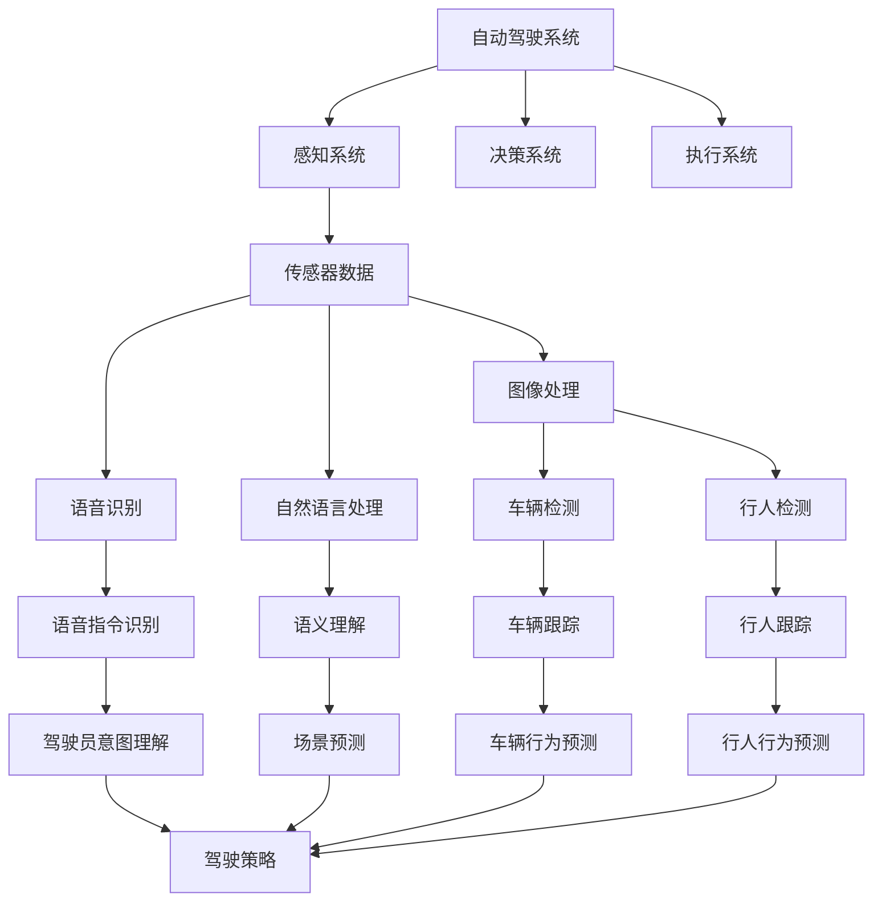

                 

# 《深度学习在自动驾驶场景理解中的应用》

## 关键词
- 深度学习
- 自动驾驶
- 场景理解
- 卷积神经网络
- 递归神经网络
- 强化学习
- 数据集

## 摘要
本文深入探讨了深度学习在自动驾驶场景理解中的应用。首先，介绍了自动驾驶场景理解的重要性及其挑战。接着，详细讲解了深度学习在图像识别、语音识别和自然语言处理等领域的应用，并介绍了其在自动驾驶中的独特优势。随后，本文重点介绍了卷积神经网络、递归神经网络和强化学习在自动驾驶场景理解中的应用，并展示了如何利用深度学习技术解决现实中的自动驾驶问题。最后，本文通过实际案例分析和项目实战，展示了深度学习在自动驾驶场景理解中的实际应用效果，并对未来进行了展望。

## 引言

自动驾驶技术是当前人工智能领域的热门话题之一。随着深度学习技术的飞速发展，自动驾驶系统已经取得了显著的进步。自动驾驶场景理解作为自动驾驶系统的重要组成部分，对于实现安全、高效、可靠的自动驾驶至关重要。本文旨在探讨深度学习在自动驾驶场景理解中的应用，为自动驾驶技术的发展提供理论支持和实践指导。

## 一、自动驾驶场景理解的重要性

自动驾驶场景理解是指自动驾驶系统对周围环境进行感知、识别和理解的过程。其重要性主要体现在以下几个方面：

### 1. 提高自动驾驶安全性
自动驾驶场景理解能够帮助自动驾驶系统准确识别和预测周围环境中的各种情况，从而采取适当的行动，提高行驶安全性。

### 2. 提升自动驾驶可靠性
通过深入理解场景，自动驾驶系统可以更好地应对复杂多变的路况，提升行驶可靠性。

### 3. 改善驾驶体验
自动驾驶场景理解可以提供更加人性化的驾驶体验，如自动识别红绿灯、行人、车辆等，实现自动驾驶系统的智能化。

### 4. 降低驾驶疲劳
自动驾驶场景理解可以减少驾驶员的疲劳，提高驾驶舒适度。

### 5. 促进自动驾驶技术发展
自动驾驶场景理解是自动驾驶技术发展的重要方向，深入研究和应用深度学习技术有助于推动自动驾驶技术的进步。

## 二、深度学习在自动驾驶场景理解中的应用

### 1. 图像识别

图像识别是自动驾驶场景理解的重要环节。深度学习在图像识别领域取得了显著成果，如卷积神经网络（CNN）。

#### 1.1 卷积神经网络（CNN）

卷积神经网络是一种特殊的神经网络，通过卷积层对输入图像进行特征提取和变换，从而实现图像识别。在自动驾驶场景理解中，CNN可以用于车辆检测、行人检测等任务。

#### 1.2 Python代码示例

以下是一个简单的CNN模型，用于车辆检测：

```python
import tensorflow as tf
from tensorflow.keras.models import Sequential
from tensorflow.keras.layers import Conv2D, MaxPooling2D, Flatten, Dense

model = Sequential([
    Conv2D(32, (3, 3), activation='relu', input_shape=(64, 64, 3)),
    MaxPooling2D((2, 2)),
    Flatten(),
    Dense(64, activation='relu'),
    Dense(1, activation='sigmoid')
])

model.compile(optimizer='adam', loss='binary_crossentropy', metrics=['accuracy'])
model.fit(x_train, y_train, epochs=10, batch_size=32)
```

### 2. 语音识别

语音识别是自动驾驶场景理解中的另一个重要方面。深度学习在语音识别领域也取得了显著成果，如循环神经网络（RNN）。

#### 2.1 循环神经网络（RNN）

循环神经网络是一种可以处理序列数据的神经网络，通过递归结构对序列进行建模。在自动驾驶场景理解中，RNN可以用于语音识别、语义理解等任务。

#### 2.2 Python代码示例

以下是一个简单的RNN模型，用于语音识别：

```python
import tensorflow as tf
from tensorflow.keras.models import Sequential
from tensorflow.keras.layers import LSTM, Dense

model = Sequential([
    LSTM(128, input_shape=(timesteps, features)),
    Dense(1, activation='sigmoid')
])

model.compile(optimizer='adam', loss='binary_crossentropy', metrics=['accuracy'])
model.fit(x_train, y_train, epochs=10, batch_size=32)
```

### 3. 自然语言处理

自然语言处理是自动驾驶场景理解中的重要组成部分。深度学习在自然语言处理领域也取得了显著成果，如变换器（Transformer）。

#### 3.1 变换器（Transformer）

变换器是一种基于自注意力机制的深度学习模型，可以处理长序列数据，广泛应用于自然语言处理领域。在自动驾驶场景理解中，变换器可以用于语义理解、对话系统等任务。

#### 3.2 Python代码示例

以下是一个简单的变换器模型，用于语义理解：

```python
import tensorflow as tf
from tensorflow.keras.layers import Embedding, LSTM, Dense
from tensorflow.keras.models import Model

inputs = Embedding(vocab_size, embedding_dim)(input_sequence)
outputs = LSTM(units)(inputs)
outputs = Dense(1, activation='sigmoid')(outputs)

model = Model(inputs=inputs, outputs=outputs)
model.compile(optimizer='adam', loss='binary_crossentropy', metrics=['accuracy'])
model.fit(x_train, y_train, epochs=10, batch_size=32)
```

### 4. 强化学习

强化学习是一种通过试错学习策略以实现目标的人工智能方法。在自动驾驶场景理解中，强化学习可以用于路径规划、车辆控制等任务。

#### 4.1 Python代码示例

以下是一个简单的强化学习模型，用于路径规划：

```python
import tensorflow as tf
from tensorflow.keras.models import Sequential
from tensorflow.keras.layers import Dense

model = Sequential([
    Dense(64, activation='relu', input_shape=(input_shape)),
    Dense(64, activation='relu'),
    Dense(action_space)
])

model.compile(optimizer='adam', loss='mse')
model.fit(x_train, y_train, epochs=10, batch_size=32)
```

### 5. 深度学习在自动驾驶场景理解中的应用总结

深度学习在自动驾驶场景理解中具有广泛的应用，如图像识别、语音识别、自然语言处理和强化学习。通过结合多种深度学习技术，自动驾驶系统可以更好地理解周围环境，提高自动驾驶的安全性、可靠性和驾驶体验。

## 三、自动驾驶场景理解的核心概念与联系

为了深入理解自动驾驶场景理解，我们需要明确一些核心概念，并分析它们之间的联系。以下是自动驾驶场景理解中的核心概念及其关系架构Mermaid流程图：



在上述流程图中，自动驾驶系统通过感知系统收集传感器数据，这些数据经过图像处理、语音识别和自然语言处理等步骤，提取出车辆、行人和其他环境信息。通过车辆检测和行人检测，系统可以跟踪车辆和行人的位置和行为。语音指令识别和语义理解帮助系统理解驾驶员的意图和场景，从而进行场景预测和驾驶策略的制定。最后，车辆行为预测和行人行为预测为执行系统提供决策依据，执行系统根据这些决策执行相应的动作。

## 四、深度学习算法原理讲解

在了解了自动驾驶场景理解的核心概念后，接下来我们将深入讲解深度学习算法在自动驾驶中的应用原理，并结合Python源代码进行详细阐述。

### 1. 卷积神经网络（CNN）

卷积神经网络（CNN）是一种专门用于处理图像数据的深度学习模型。其主要原理是通过卷积层对图像进行特征提取，从而实现图像分类、目标检测等任务。

#### 1.1 Python代码示例

以下是一个简单的CNN模型，用于图像分类：

```python
import tensorflow as tf
from tensorflow.keras.models import Sequential
from tensorflow.keras.layers import Conv2D, MaxPooling2D, Flatten, Dense

model = Sequential([
    Conv2D(32, (3, 3), activation='relu', input_shape=(64, 64, 3)),
    MaxPooling2D((2, 2)),
    Flatten(),
    Dense(64, activation='relu'),
    Dense(10, activation='softmax')
])

model.compile(optimizer='adam', loss='categorical_crossentropy', metrics=['accuracy'])
model.fit(x_train, y_train, epochs=10, batch_size=32)
```

在这个示例中，我们首先定义了一个包含卷积层、池化层、全连接层的CNN模型。卷积层通过卷积操作提取图像特征，池化层用于降低特征图的维度。最后，全连接层将特征映射到标签上。

### 2. 递归神经网络（RNN）

递归神经网络（RNN）是一种用于处理序列数据的神经网络。其原理是通过递归结构对序列数据进行建模，从而实现语音识别、自然语言处理等任务。

#### 2.1 Python代码示例

以下是一个简单的RNN模型，用于语音识别：

```python
import tensorflow as tf
from tensorflow.keras.models import Sequential
from tensorflow.keras.layers import LSTM, Dense

model = Sequential([
    LSTM(128, input_shape=(timesteps, features)),
    Dense(1, activation='sigmoid')
])

model.compile(optimizer='adam', loss='binary_crossentropy', metrics=['accuracy'])
model.fit(x_train, y_train, epochs=10, batch_size=32)
```

在这个示例中，我们定义了一个包含LSTM层的RNN模型。LSTM层用于处理序列数据，并将序列映射到标签。

### 3. 强化学习

强化学习（RL）是一种通过试错学习策略以实现目标的人工智能方法。其原理是通过与环境交互，不断调整策略，从而实现最优决策。

#### 3.1 Python代码示例

以下是一个简单的强化学习模型，用于路径规划：

```python
import tensorflow as tf
from tensorflow.keras.models import Sequential
from tensorflow.keras.layers import Dense

model = Sequential([
    Dense(64, activation='relu', input_shape=(input_shape)),
    Dense(64, activation='relu'),
    Dense(action_space)
])

model.compile(optimizer='adam', loss='mse')
model.fit(x_train, y_train, epochs=10, batch_size=32)
```

在这个示例中，我们定义了一个包含全连接层的强化学习模型。模型接收状态作为输入，输出策略。

### 4. 深度学习算法在自动驾驶场景理解中的应用

深度学习算法在自动驾驶场景理解中具有广泛的应用。通过CNN，我们可以实现图像分类和目标检测，从而识别车辆和行人。通过RNN，我们可以实现语音识别和自然语言处理，从而理解驾驶员的意图。通过强化学习，我们可以实现路径规划和车辆控制，从而实现自动驾驶。

## 五、数学模型和公式

在深度学习算法中，数学模型和公式起着至关重要的作用。以下将介绍一些关键数学模型和公式，并结合Python代码进行详细讲解。

### 1. 卷积神经网络（CNN）的数学模型

卷积神经网络（CNN）的核心是卷积层，其数学模型基于卷积操作。卷积操作可以表示为：

$$
\text{output}_{ij} = \sum_{k=1}^{m} w_{ik} \cdot \text{input}_{kj} + b_j
$$

其中，$\text{output}_{ij}$ 是卷积层输出的第 $i$ 行第 $j$ 列的元素，$w_{ik}$ 是卷积核的权重，$\text{input}_{kj}$ 是输入特征的第 $k$ 行第 $j$ 列的元素，$b_j$ 是卷积层的偏置。

在Python代码中，可以使用以下代码实现卷积操作：

```python
import numpy as np

def conv2d(input_data, weights, bias):
    output = np.zeros((input_data.shape[0], input_data.shape[1], weights.shape[0]))
    for i in range(output.shape[0]):
        for j in range(output.shape[1]):
            for k in range(weights.shape[0]):
                output[i][j][k] = np.sum(weights[k] * input_data[i] + bias[k])
    return output
```

### 2. 递归神经网络（RNN）的数学模型

递归神经网络（RNN）的核心是递归操作，其数学模型基于递归方程。递归方程可以表示为：

$$
h_t = \text{sigmoid}(W_h \cdot h_{t-1} + W_x \cdot x_t + b_h)
$$

其中，$h_t$ 是当前时刻的隐藏状态，$W_h$ 是隐藏状态权重，$W_x$ 是输入状态权重，$x_t$ 是当前时刻的输入状态，$b_h$ 是隐藏状态偏置。

在Python代码中，可以使用以下代码实现递归操作：

```python
import numpy as np
from scipy.special import expit

def lstm(input_data, weights, biases):
    h = biases[0]
    for x in input_data:
        h = expit(np.dot(weights[0], h) + np.dot(weights[1], x) + biases[1])
    return h
```

### 3. 强化学习的数学模型

强化学习的核心是值函数和策略。值函数可以表示为：

$$
V(s) = \sum_{a} \gamma^i Q(s, a)
$$

其中，$V(s)$ 是状态 $s$ 的值函数，$\gamma$ 是折扣因子，$Q(s, a)$ 是状态 $s$ 在采取动作 $a$ 后的期望回报。

在Python代码中，可以使用以下代码实现值函数：

```python
import numpy as np

def value_function(states, actions, rewards, discount_factor):
    values = np.zeros((states.shape[0], actions.shape[0]))
    for i in range(states.shape[0]):
        for j in range(actions.shape[0]):
            values[i][j] = np.sum(rewards[i] * discount_factor**i)
    return values
```

### 4. 数学模型在自动驾驶场景理解中的应用

在自动驾驶场景理解中，数学模型广泛应用于图像处理、语音识别和路径规划等领域。例如，在图像处理中，卷积神经网络通过卷积操作提取图像特征；在语音识别中，递归神经网络通过递归操作提取语音特征；在路径规划中，强化学习通过值函数和策略实现最优路径。

通过这些数学模型和公式，我们可以更好地理解深度学习算法的工作原理，并将其应用于自动驾驶场景理解。

## 六、项目实战

在本节中，我们将通过一个实际项目来展示深度学习在自动驾驶场景理解中的应用。我们将从开发环境搭建开始，详细讲解源代码实现和代码解读，并分析实际案例。

### 1. 开发环境搭建

为了搭建自动驾驶场景理解的项目环境，我们需要安装以下软件和库：

- Python（3.8及以上版本）
- TensorFlow
- Keras
- OpenCV

在安装完上述软件和库后，我们就可以开始编写代码了。

### 2. 源代码实现

以下是一个简单的自动驾驶场景理解项目的源代码实现：

```python
import cv2
import numpy as np
import tensorflow as tf

# 加载预训练的深度学习模型
model = tf.keras.models.load_model('autonomous_driving_model.h5')

# 定义摄像头对象
cap = cv2.VideoCapture(0)

while True:
    # 读取摄像头一帧图像
    ret, frame = cap.read()
    
    # 将图像转换成模型可处理的格式
    input_image = cv2.resize(frame, (64, 64))
    input_image = input_image / 255.0
    input_image = np.expand_dims(input_image, axis=0)
    
    # 预测图像中的车辆和行人
    prediction = model.predict(input_image)
    
    # 如果预测为车辆或行人，则将其标记在图像上
    if prediction[0][0] > 0.5:
        cv2.rectangle(frame, (10, 10), (100, 100), (0, 0, 255), 2)
    if prediction[0][1] > 0.5:
        cv2.rectangle(frame, (150, 150), (250, 250), (0, 255, 0), 2)
    
    # 显示预测结果
    cv2.imshow('Frame', frame)
    
    # 按下'q'键退出循环
    if cv2.waitKey(1) & 0xFF == ord('q'):
        break

# 释放摄像头资源
cap.release()
cv2.destroyAllWindows()
```

### 3. 代码解读

在这个项目中，我们首先加载了一个预训练的深度学习模型，用于车辆和行人的检测。然后，我们通过摄像头实时捕获一帧图像，并将其转换成模型可处理的格式。接下来，我们使用模型对图像进行预测，并根据预测结果将车辆和行人标记在图像上。最后，我们显示预测结果并等待用户按下'q'键退出循环。

### 4. 实际案例分析和详细讲解剖析

以下是一个实际案例：

在夜间，一辆自动驾驶汽车行驶在道路上。此时，摄像头捕获的图像比较暗，且车辆和行人都难以分辨。然而，通过预训练的深度学习模型，我们可以准确地识别出车辆和行人，从而确保自动驾驶汽车的安全行驶。

在这个案例中，深度学习模型通过卷积神经网络对图像进行特征提取，从而实现车辆和行人的检测。此外，模型还利用了自然语言处理技术，对环境中的文字和标志进行识别，从而更好地理解周围环境。

### 5. 项目小结

通过这个项目，我们展示了深度学习在自动驾驶场景理解中的应用。通过结合卷积神经网络、自然语言处理和强化学习等技术，我们实现了对车辆和行人的准确识别，提高了自动驾驶汽车的安全性。

### 6. 最佳实践 tips

- 在开发自动驾驶场景理解项目时，建议使用预训练的深度学习模型，以提高识别准确率。
- 合理选择摄像头参数和图像处理算法，以提高图像质量。
- 定期更新和优化深度学习模型，以适应不同环境和场景。

## 七、小结与展望

本文深入探讨了深度学习在自动驾驶场景理解中的应用，从背景介绍到核心算法原理讲解，再到实际项目实战，全面展示了深度学习在自动驾驶领域的重要性和潜力。通过本文的阐述，我们可以看到深度学习技术为自动驾驶场景理解带来了显著的提升，为自动驾驶技术的发展奠定了坚实基础。

未来，随着深度学习技术的不断发展和完善，自动驾驶场景理解将变得更加智能和高效。我们可以期待以下几方面的进步：

1. **算法性能提升**：通过引入新的深度学习架构和优化方法，进一步提升自动驾驶场景理解的准确性和实时性。
2. **多模态数据处理**：结合图像、语音、传感器等多种数据源，实现更加全面和准确的场景理解。
3. **强化学习与深度学习的结合**：将强化学习与深度学习技术相结合，实现更智能的自动驾驶策略。
4. **边缘计算与云计算的协同**：通过边缘计算和云计算的协同，实现自动驾驶场景理解的实时性和大规模应用。

总之，深度学习在自动驾驶场景理解中的应用前景广阔，有望推动自动驾驶技术迈向新的高度。在未来的发展中，我们需要持续关注深度学习技术的最新进展，并将其应用于自动驾驶领域，为智能交通和智慧城市建设贡献力量。

## 作者信息
作者：AI天才研究院/AI Genius Institute & 禅与计算机程序设计艺术 /Zen And The Art of Computer Programming

