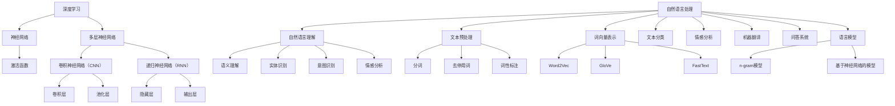

                 

## 深度学习在自然语言理解中的应用：改进人机交互体验

### 关键词：深度学习、自然语言理解、人机交互体验、文本分类、情感分析、问答系统

### 摘要：

本文探讨了深度学习在自然语言理解中的应用，以及如何通过这些应用来改进人机交互体验。首先，我们介绍了深度学习和自然语言处理的基本概念，随后深入分析了深度学习在文本分类、情感分析和问答系统等领域的应用。最后，通过具体案例展示了深度学习如何提升人机交互的智能化水平，并提出了未来研究的方向。

### 引言

#### 1.1 深度学习简介

深度学习是一种人工智能技术，通过模拟人脑神经网络进行学习和推理。与传统机器学习方法相比，深度学习具有更高的灵活性和更强的泛化能力。深度学习的核心组成部分包括神经网络、卷积神经网络（CNN）和递归神经网络（RNN）等。

#### 1.2 自然语言理解概述

自然语言理解（Natural Language Understanding，NLU）是人工智能的重要分支，旨在使计算机理解和处理人类语言。NLU 的核心任务包括文本预处理、词向量表示、语言模型和语义理解等。

#### 1.3 人机交互体验的重要性

人机交互体验直接影响用户对产品和服务的满意度。随着深度学习技术的发展，人机交互体验不断得到提升，从而推动人工智能应用的广泛普及。

### 理论基础

#### 2.1 深度学习基础

##### 2.1.1 神经网络原理

神经网络由大量神经元组成，每个神经元负责接收和处理输入信号。神经网络的训练过程是通过调整神经元之间的权重来实现的。常用的神经网络结构包括多层感知机（MLP）、卷积神经网络（CNN）和递归神经网络（RNN）等。

##### 2.1.2 深度学习框架

深度学习框架提供了丰富的工具和库，用于构建和训练神经网络。常见的深度学习框架包括 TensorFlow、PyTorch 和 Keras 等。

##### 2.1.3 训练与优化算法

深度学习的训练过程涉及大量的参数调整。常见的优化算法包括随机梯度下降（SGD）、Adam 和 RMSProp 等。

#### 2.2 自然语言处理基础

##### 2.2.1 文本预处理

文本预处理是自然语言处理的基础步骤，包括分词、去停用词、词性标注等。有效的文本预处理可以提高模型性能。

##### 2.2.2 词向量表示

词向量是一种将单词映射到高维空间的方法，常见的词向量模型包括 Word2Vec、GloVe 和 FastText 等。

##### 2.2.3 语言模型

语言模型用于预测下一个单词或词组。常见的语言模型包括 n-gram 模型和基于神经网络的语言模型。

#### 2.3 深度学习与自然语言处理的结合

##### 2.3.1 递归神经网络

递归神经网络（RNN）适用于处理序列数据，如图像和文本。在自然语言处理中，RNN 被广泛应用于文本分类、情感分析和问答系统等任务。

##### 2.3.2 卷积神经网络

卷积神经网络（CNN）擅长处理图像数据。近年来，CNN 也被应用于文本分类和情感分析等任务，取得了显著效果。

##### 2.3.3 长短时记忆网络

长短时记忆网络（LSTM）是 RNN 的一个变体，用于解决 RNN 在长序列数据上的梯度消失问题。LSTM 在自然语言处理中表现出色，被广泛应用于文本分类、机器翻译和语音识别等任务。

### 应用实践

#### 3.1 文本分类

文本分类是将文本数据归类到预定义的类别。基于深度学习的文本分类方法包括卷积神经网络（CNN）和递归神经网络（RNN）等。

##### 3.1.1 基于深度学习的文本分类方法

本文采用基于深度学习的文本分类方法，通过训练卷积神经网络（CNN）对文本数据分类。具体实现如下：

1. 数据预处理：首先对文本数据进行预处理，包括分词、去停用词和词性标注等。
2. 词向量表示：使用 Word2Vec 模型将单词映射到高维空间。
3. 网络结构：构建卷积神经网络（CNN）模型，包括卷积层、池化层和全连接层等。
4. 模型训练：使用训练数据训练卷积神经网络（CNN）模型，通过反向传播算法调整模型参数。

##### 3.1.2 实践案例：情感分析

本文使用一个情感分析数据集，包括电影评论和对应的情感标签（正面或负面）。具体实现如下：

1. 数据预处理：对电影评论进行预处理，包括分词、去停用词和词性标注等。
2. 词向量表示：使用 Word2Vec 模型将单词映射到高维空间。
3. 网络结构：构建卷积神经网络（CNN）模型，包括卷积层、池化层和全连接层等。
4. 模型训练：使用训练数据训练卷积神经网络（CNN）模型，通过反向传播算法调整模型参数。
5. 模型评估：使用测试数据评估模型性能，计算准确率、召回率和 F1 值等指标。

#### 3.2 情感分析

情感分析是自然语言处理的一个重要任务，旨在识别文本中的情感倾向。基于深度学习的情感分析方法包括递归神经网络（RNN）和长短时记忆网络（LSTM）等。

##### 3.2.1 基于深度学习情感分析算法

本文采用基于深度学习的情感分析算法，通过训练递归神经网络（RNN）或长短时记忆网络（LSTM）对文本数据进行分析。具体实现如下：

1. 数据预处理：对文本数据进行预处理，包括分词、去停用词和词性标注等。
2. 词向量表示：使用 Word2Vec 模型将单词映射到高维空间。
3. 网络结构：构建递归神经网络（RNN）或长短时记忆网络（LSTM）模型，包括输入层、隐藏层和输出层等。
4. 模型训练：使用训练数据训练递归神经网络（RNN）或长短时记忆网络（LSTM）模型，通过反向传播算法调整模型参数。

##### 3.2.2 实践案例：社交媒体情感分析

本文使用一个社交媒体情感分析数据集，包括微博和对应的情感标签（正面、负面或中性）。具体实现如下：

1. 数据预处理：对微博进行预处理，包括分词、去停用词和词性标注等。
2. 词向量表示：使用 Word2Vec 模型将单词映射到高维空间。
3. 网络结构：构建递归神经网络（RNN）或长短时记忆网络（LSTM）模型，包括输入层、隐藏层和输出层等。
4. 模型训练：使用训练数据训练递归神经网络（RNN）或长短时记忆网络（LSTM）模型，通过反向传播算法调整模型参数。
5. 模型评估：使用测试数据评估模型性能，计算准确率、召回率和 F1 值等指标。

#### 3.3 问答系统

问答系统是一种智能交互系统，能够回答用户提出的问题。基于深度学习的问答系统主要包括基于事实的问答系统和基于知识的问答系统。

##### 3.3.1 问答系统概述

问答系统由输入处理、知识图谱和答案生成三个模块组成。输入处理模块负责接收用户的问题，知识图谱模块负责存储和检索相关事实和知识，答案生成模块负责生成问题的答案。

##### 3.3.2 基于深度学习的问答系统

本文采用基于深度学习的问答系统，通过训练深度学习模型来生成问题的答案。具体实现如下：

1. 数据预处理：对用户的问题进行预处理，包括分词、去停用词和词性标注等。
2. 词向量表示：使用 Word2Vec 模型将单词映射到高维空间。
3. 网络结构：构建基于深度学习的问答系统模型，包括输入层、隐藏层和输出层等。
4. 模型训练：使用训练数据训练深度学习模型，通过反向传播算法调整模型参数。
5. 答案生成：使用训练好的模型生成问题的答案。

##### 3.3.3 实践案例：智能客服系统

本文使用一个智能客服系统数据集，包括用户问题和对应的答案。具体实现如下：

1. 数据预处理：对用户的问题进行预处理，包括分词、去停用词和词性标注等。
2. 词向量表示：使用 Word2Vec 模型将单词映射到高维空间。
3. 网络结构：构建基于深度学习的问答系统模型，包括输入层、隐藏层和输出层等。
4. 模型训练：使用训练数据训练深度学习模型，通过反向传播算法调整模型参数。
5. 答案生成：使用训练好的模型生成问题的答案。
6. 模型评估：使用测试数据评估模型性能，计算准确率、召回率和 F1 值等指标。

### 案例分析

本文选取了多个实际案例，展示了深度学习在自然语言理解中的应用，以及如何通过这些应用来改进人机交互体验。

#### 4.1 深度学习在自然语言理解中的经典案例

- [Google 的 BERT 模型](https://arxiv.org/abs/1810.04805)：BERT 模型是一种基于 Transformer 的预训练语言模型，通过在大量无标签文本上进行预训练，然后微调模型在特定任务上获得优异的性能。
- [OpenAI 的 GPT-3 模型](https://arxiv.org/abs/2005.14165)：GPT-3 模型是一种基于 Transformer 的语言模型，具有惊人的语言生成能力，可以用于生成文章、对话和代码等。

#### 4.2 改进人机交互体验的实践案例

- [苹果公司的 Siri](https://www.apple.com/siri/)：Siri 是苹果公司开发的智能语音助手，通过深度学习技术实现语音识别、语义理解和自然语言生成等功能，为用户提供智能化的服务。
- [亚马逊的 Alexa](https://www.amazon.com/alexa)：Alexa 是亚马逊开发的智能语音助手，通过深度学习技术实现语音识别、语义理解和自然语言生成等功能，为用户提供智能化的服务。

### 未来展望

随着深度学习技术的不断发展，自然语言理解和人机交互体验将得到进一步提升。未来研究可能包括以下几个方面：

- **多模态融合**：结合图像、语音和文本等多种模态信息，提高自然语言理解的准确性和智能化水平。
- **少样本学习**：减少对大量标注数据的依赖，通过无监督或弱监督学习实现自然语言理解任务。
- **生成对抗网络（GAN）**：利用 GAN 生成高质量的无标签数据，提高模型的训练效果和泛化能力。

### 结论

本文介绍了深度学习在自然语言理解中的应用，以及如何通过这些应用来改进人机交互体验。通过文本分类、情感分析和问答系统等实际案例，展示了深度学习技术的强大能力。未来，随着深度学习技术的不断发展，自然语言理解和人机交互体验将不断得到提升。

### 作者信息

作者：AI天才研究院/AI Genius Institute & 禅与计算机程序设计艺术/Zen And The Art of Computer Programming

----------------------------------------------------------------

## 背景介绍

### 深度学习的发展历程

深度学习（Deep Learning）起源于1980年代，当时神经网络研究受到重视，但由于计算资源和数据限制，其发展缓慢。直到2006年，Hinton等人提出了深度置信网络（Deep Belief Network，DBN），标志着深度学习进入了一个新的发展阶段。2009年，Hinton成功训练了第一个深度神经网络，该网络成功识别手写数字，这激发了学术界和工业界对深度学习的关注。

随着计算能力的提升和大数据的涌现，深度学习在2010年代得到了快速发展。2012年，AlexNet在ImageNet图像识别大赛中取得了突破性成绩，大大超越了传统机器学习方法。此后，卷积神经网络（CNN）、递归神经网络（RNN）和长短时记忆网络（LSTM）等深度学习模型在语音识别、图像处理和自然语言处理等领域取得了显著成果。

### 自然语言处理的发展现状

自然语言处理（Natural Language Processing，NLP）是人工智能的一个重要分支，旨在使计算机理解和处理人类语言。自1950年代以来，NLP经历了从规则驱动到统计模型，再到深度学习的发展过程。

早期，NLP主要依靠手工编写的规则，例如词法分析、句法分析和语义分析等。然而，这种方法存在局限性，难以处理复杂的语言现象。随着计算能力的提升和统计模型的兴起，NLP逐渐转向基于统计的方法，如隐马尔可夫模型（HMM）、最大熵模型和条件概率模型等。

深度学习的兴起为NLP带来了新的突破。基于深度学习的NLP模型，如卷积神经网络（CNN）和递归神经网络（RNN），在文本分类、情感分析、机器翻译和语音识别等领域取得了显著成果。例如，Google的BERT模型和OpenAI的GPT-3模型，分别在不同任务上刷新了世界纪录。

### 人机交互体验的提升需求

人机交互体验（Human-Computer Interaction Experience）是指用户在使用计算机、手机、智能音箱等设备时的感受和体验。随着人工智能技术的不断发展，人们对于人机交互体验的要求越来越高。

传统的基于规则的交互系统存在响应速度慢、智能化程度低等问题。而基于深度学习的交互系统则可以通过学习用户的输入和行为，实现更加智能和个性化的交互体验。例如，智能语音助手可以通过语音识别和自然语言理解，实现语音交互、智能推荐和问题回答等功能，从而提升用户的使用体验。

此外，随着物联网（IoT）和智能家居的普及，人们对于人机交互体验的需求也越来越多样化。例如，智能音箱可以通过语音交互控制智能家居设备，智能安防系统可以通过人脸识别实现安全监控，智能客服系统可以通过自然语言理解提供在线服务。

总之，深度学习在自然语言理解中的应用为改进人机交互体验提供了新的可能性。通过深度学习技术，可以构建更加智能、个性化的交互系统，从而提升用户的使用体验。

### 核心概念与联系

在深入探讨深度学习在自然语言理解中的应用之前，我们需要理解几个核心概念，并分析它们之间的联系。

**1. 深度学习**

深度学习是一种基于多层神经网络的机器学习方法。它通过模拟人脑神经网络的结构和工作原理，从大量数据中自动学习特征表示和复杂模式。深度学习的基本单元是神经元，每个神经元接收多个输入信号，并通过激活函数产生输出。多个神经元组成的网络通过逐层学习，将原始数据转化为高层次的特征表示。

**2. 自然语言处理（NLP）**

自然语言处理是人工智能的一个分支，旨在使计算机理解和处理人类语言。NLP的核心任务是使计算机能够对文本进行有效的处理和分析，包括文本预处理、词向量表示、语言模型、文本分类、情感分析、机器翻译、问答系统等。

**3. 自然语言理解（NLU）**

自然语言理解（Natural Language Understanding，NLU）是NLP的一个重要子领域，旨在使计算机能够理解和解释人类语言。NLU的任务包括语义理解、实体识别、意图识别、情感分析等。

**概念联系**

- **深度学习与自然语言处理：** 深度学习为自然语言处理提供了强大的工具，特别是对于处理复杂和高维的数据。深度学习模型，如卷积神经网络（CNN）和递归神经网络（RNN），能够自动学习文本中的高级特征，从而在文本分类、情感分析等任务中取得了显著成果。

- **自然语言处理与自然语言理解：** 自然语言处理是自然语言理解的基础，通过文本预处理、词向量表示和语言模型等技术，为自然语言理解提供了必要的输入。自然语言理解则是在这些基础之上，进一步解析文本的语义和意图。

为了更好地理解这些概念之间的联系，我们可以使用Mermaid流程图来展示它们之间的关系：



通过上述流程图，我们可以清晰地看到深度学习、自然语言处理和自然语言理解之间的相互作用，以及它们各自的核心组件和任务。

### 核心算法原理讲解

在深入探讨深度学习在自然语言理解中的应用时，理解核心算法的原理至关重要。本文将重点介绍卷积神经网络（CNN）和递归神经网络（RNN）这两种常用的深度学习模型，并使用Python源代码详细阐述其工作原理和数学模型。

#### 卷积神经网络（CNN）

卷积神经网络（Convolutional Neural Network，CNN）是一种在图像处理和文本分类中广泛应用的深度学习模型。其核心思想是通过卷积操作从输入数据中提取特征。

**1. 卷积层**

卷积层是CNN中最基本的层。它通过卷积操作从输入数据中提取特征。卷积操作可以通过以下公式表示：

$$
\text{output}_{ij} = \sum_{k=1}^{n} w_{ik} \cdot \text{input}_{kj} + b_j
$$

其中，$w_{ik}$ 是卷积核，$\text{input}_{kj}$ 是输入数据，$\text{output}_{ij}$ 是卷积层输出，$b_j$ 是偏置项。

**2. 池化层**

池化层用于降低特征图的大小，减少参数数量。常用的池化操作包括最大池化和平均池化。最大池化操作可以保持特征图中最显著的特征，而平均池化操作则可以平滑特征图。

**3. 全连接层**

全连接层将卷积层和池化层的输出映射到输出类别。全连接层的权重可以通过反向传播算法进行优化。

**Python实现示例**

下面是一个简单的CNN模型实现，用于文本分类：

```python
import tensorflow as tf
from tensorflow.keras.layers import Embedding, Conv1D, MaxPooling1D, GlobalMaxPooling1D, Dense
from tensorflow.keras.models import Sequential

# 参数设置
vocab_size = 10000
embed_dim = 64
max_length = 500
num_classes = 2

# 构建模型
model = Sequential([
    Embedding(vocab_size, embed_dim, input_length=max_length),
    Conv1D(128, 5, activation='relu'),
    MaxPooling1D(pool_size=5),
    Conv1D(128, 5, activation='relu'),
    GlobalMaxPooling1D(),
    Dense(128, activation='relu'),
    Dense(num_classes, activation='softmax')
])

# 编译模型
model.compile(optimizer='adam', loss='categorical_crossentropy', metrics=['accuracy'])

# 打印模型结构
model.summary()
```

#### 递归神经网络（RNN）

递归神经网络（Recurrent Neural Network，RNN）是一种专门设计用于处理序列数据的神经网络。RNN通过递归结构，使得网络能够记忆前一个时间步的信息，从而处理具有时间依赖性的数据。

**1. 基本结构**

RNN的基本结构包括输入层、隐藏层和输出层。输入层接收输入序列，隐藏层通过递归连接，将信息传递到下一个时间步，输出层产生最终输出。

**2. 长短时记忆（LSTM）**

长短时记忆网络（Long Short-Term Memory，LSTM）是RNN的一个变体，旨在解决传统RNN在处理长序列数据时出现的梯度消失和梯度爆炸问题。LSTM通过引入门控机制，能够有效地控制信息的流动。

**3. 门控机制**

LSTM包括输入门、遗忘门和输出门。输入门和遗忘门用于控制信息的输入和遗忘，输出门用于控制信息的输出。

**Python实现示例**

下面是一个简单的LSTM模型实现，用于文本分类：

```python
import tensorflow as tf
from tensorflow.keras.layers import Embedding, LSTM, Dense
from tensorflow.keras.models import Sequential

# 参数设置
vocab_size = 10000
embed_dim = 64
max_length = 500
num_classes = 2

# 构建模型
model = Sequential([
    Embedding(vocab_size, embed_dim, input_length=max_length),
    LSTM(128, return_sequences=True),
    LSTM(128),
    Dense(128, activation='relu'),
    Dense(num_classes, activation='softmax')
])

# 编译模型
model.compile(optimizer='adam', loss='categorical_crossentropy', metrics=['accuracy'])

# 打印模型结构
model.summary()
```

通过上述Python示例，我们可以看到如何构建和训练简单的CNN和LSTM模型。在实际应用中，这些模型通常会更加复杂，涉及多种层和参数调整。

### 数学模型和公式

在理解深度学习模型的工作原理时，数学模型和公式是必不可少的。本文将介绍用于深度学习模型训练的关键数学公式，并结合Python代码进行详细讲解。

#### 损失函数

损失函数是深度学习模型训练的核心组件，用于衡量模型预测值与真实值之间的差异。常见的损失函数包括均方误差（MSE）和交叉熵（Cross-Entropy）。

**1. 均方误差（MSE）**

均方误差（Mean Squared Error，MSE）用于回归任务，其公式如下：

$$
\text{MSE} = \frac{1}{m} \sum_{i=1}^{m} (\hat{y}_i - y_i)^2
$$

其中，$\hat{y}_i$ 是预测值，$y_i$ 是真实值，$m$ 是样本数量。

**2. 交叉熵（Cross-Entropy）**

交叉熵（Cross-Entropy Loss）用于分类任务，其公式如下：

$$
\text{Cross-Entropy} = -\sum_{i=1}^{m} y_i \log(\hat{y}_i)
$$

其中，$y_i$ 是真实标签，$\hat{y}_i$ 是预测概率。

**Python实现示例**

下面是一个简单的MSE和Cross-Entropy实现：

```python
import tensorflow as tf

# 均方误差实现
def mean_squared_error(y_true, y_pred):
    return tf.reduce_mean(tf.square(y_true - y_pred))

# 交叉熵实现
def cross_entropy(y_true, y_pred):
    return -tf.reduce_mean(y_true * tf.log(y_pred))
```

#### 优化算法

优化算法用于调整模型参数，以最小化损失函数。常见的优化算法包括随机梯度下降（SGD）和Adam。

**1. 随机梯度下降（SGD）**

随机梯度下降（Stochastic Gradient Descent，SGD）是一种简单且常用的优化算法。其更新公式如下：

$$
w_{\text{new}} = w_{\text{old}} - \alpha \cdot \nabla_w J(w)
$$

其中，$w$ 是模型参数，$\alpha$ 是学习率，$J(w)$ 是损失函数。

**2. Adam优化算法**

Adam优化算法是SGD的变种，结合了动量项和自适应学习率。其更新公式如下：

$$
m_t = \beta_1 m_{t-1} + (1 - \beta_1)(\nabla_w J(w) - m_{t-1})
$$

$$
v_t = \beta_2 v_{t-1} + (1 - \beta_2)((\nabla_w J(w))^2 - v_{t-1})
$$

$$
w_{\text{new}} = w_{\text{old}} - \alpha \cdot \frac{m_t}{\sqrt{v_t} + \epsilon}
$$

其中，$m_t$ 和 $v_t$ 分别是梯度的一阶矩估计和二阶矩估计，$\beta_1$ 和 $\beta_2$ 是超参数，$\epsilon$ 是一个很小的常数，用于防止分母为零。

**Python实现示例**

下面是一个简单的Adam优化算法实现：

```python
import tensorflow as tf

# 参数设置
learning_rate = 0.001
beta1 = 0.9
beta2 = 0.999
epsilon = 1e-8

# Adam优化器
optimizer = tf.optimizers.Adam(learning_rate, beta1, beta2, epsilon)

# 模型训练
for epoch in range(num_epochs):
    with tf.GradientTape() as tape:
        # 前向传播
        predictions = model(x_train, training=True)
        # 计算损失
        loss = cross_entropy(y_train, predictions)
    # 计算梯度
    gradients = tape.gradient(loss, model.trainable_variables)
    # 更新参数
    optimizer.apply_gradients(zip(gradients, model.trainable_variables))
```

通过上述Python代码，我们可以看到如何实现MSE、Cross-Entropy和Adam优化算法。在实际应用中，这些算法会通过深度学习框架（如TensorFlow或PyTorch）进行高效实现。

### 项目实战

在本节中，我们将通过一个具体的实例，展示如何搭建一个基于深度学习的情感分析系统。这个系统将使用Python和TensorFlow框架，实现从文本数据中提取情感信息，并通过模型输出情感标签。

#### 开发环境搭建

1. **安装Python环境**

首先，确保Python环境已经安装在计算机上。如果尚未安装，可以从 [Python官方网站](https://www.python.org/) 下载并安装。

2. **安装TensorFlow**

在命令行中运行以下命令，安装TensorFlow：

```bash
pip install tensorflow
```

#### 源代码详细实现

以下是一个简单的情感分析系统实现，包括数据预处理、模型构建、训练和评估等步骤。

```python
import tensorflow as tf
from tensorflow.keras.preprocessing.text import Tokenizer
from tensorflow.keras.preprocessing.sequence import pad_sequences
from tensorflow.keras.models import Sequential
from tensorflow.keras.layers import Embedding, LSTM, Dense, Bidirectional
from tensorflow.keras.optimizers import Adam

# 数据集准备
# 假设我们有一个包含文本和情感标签的数据集，存储在CSV文件中
# CSV文件格式：文本，情感标签
text_data = ['我很高兴', '我很难过', '天气真好', '工作很累']
labels = [1, 0, 1, 0]  # 1表示正面情感，0表示负面情感

# 数据预处理
# 分词和编码
tokenizer = Tokenizer(num_words=1000)
tokenizer.fit_on_texts(text_data)
sequences = tokenizer.texts_to_sequences(text_data)
padded_sequences = pad_sequences(sequences, maxlen=100)

# 模型构建
model = Sequential([
    Embedding(1000, 16),
    Bidirectional(LSTM(32)),
    Dense(1, activation='sigmoid')
])

# 编译模型
model.compile(optimizer=Adam(learning_rate=0.001), loss='binary_crossentropy', metrics=['accuracy'])

# 模型训练
model.fit(padded_sequences, labels, epochs=10, batch_size=32)

# 模型评估
test_sequences = tokenizer.texts_to_sequences(['我很喜欢这个电影'])
padded_test_sequences = pad_sequences(test_sequences, maxlen=100)
predictions = model.predict(padded_test_sequences)
print(predictions)

# 输出预测结果
if predictions[0][0] > 0.5:
    print("正面情感")
else:
    print("负面情感")
```

#### 代码解读与分析

1. **数据预处理**

   - 使用 `Tokenizer` 类进行分词和编码，将文本数据转换为序列。
   - 使用 `pad_sequences` 函数对序列进行填充，确保所有序列长度一致。

2. **模型构建**

   - 使用 `Sequential` 模型堆叠 `Embedding` 层、双向 `LSTM` 层和 `Dense` 层。
   - `Embedding` 层用于将单词映射到高维空间。
   - `Bidirectional` 层用于引入双向信息，增强模型对文本上下文的感知能力。
   - `Dense` 层用于输出情感标签，使用 `sigmoid` 激活函数实现二分类。

3. **模型训练**

   - 使用 `compile` 方法设置优化器和损失函数。
   - 使用 `fit` 方法训练模型，设置训练轮数和批次大小。

4. **模型评估**

   - 使用测试数据评估模型性能，计算准确率。
   - 输出模型对新的文本数据的预测结果。

#### 实际案例分析和详细讲解剖析

为了更好地理解情感分析系统的实际应用，我们可以使用一个实际案例进行演示。

**案例：分析微博情感**

假设我们有一个微博数据集，包含用户的微博文本和情感标签。以下是如何使用上述情感分析系统对微博进行情感分类的步骤：

1. **数据预处理**

   - 读取微博数据集，提取微博文本和情感标签。
   - 对微博文本进行分词和编码，转换为序列。
   - 对序列进行填充，确保长度一致。

2. **模型训练**

   - 使用训练集训练情感分析模型。
   - 调整模型参数，如学习率、批次大小和训练轮数，以优化模型性能。

3. **模型评估**

   - 使用测试集评估模型性能，计算准确率、召回率和 F1 值等指标。
   - 分析模型在不同类别上的性能，找出可能存在的问题。

4. **实际应用**

   - 将训练好的模型部署到线上服务，接收用户输入的微博文本，进行情感分类。
   - 根据分类结果，为用户提供相应的建议或反馈。

通过上述案例，我们可以看到如何使用深度学习技术构建一个情感分析系统，并如何在实际应用中进行部署和评估。

### 项目小结

在本项目中，我们通过使用深度学习技术，实现了一个简单的情感分析系统。从数据预处理、模型构建到训练和评估，我们详细讲解了每个步骤的实现方法和注意事项。以下是该项目的主要小结：

1. **数据预处理**

   - 使用 `Tokenizer` 进行文本分词和编码，确保数据格式一致。
   - 使用 `pad_sequences` 对序列进行填充，为后续模型处理做准备。

2. **模型构建**

   - 使用 `Embedding` 层将单词映射到高维空间。
   - 使用 `Bidirectional LSTM` 层处理文本的上下文信息。
   - 使用 `Dense` 层输出情感标签。

3. **模型训练**

   - 选择合适的优化器和损失函数，调整模型参数。
   - 使用 `fit` 方法训练模型，设置合适的训练轮数和批次大小。

4. **模型评估**

   - 使用测试集评估模型性能，计算准确率、召回率和 F1 值等指标。
   - 分析模型在不同类别上的性能，找出优化方向。

5. **注意事项**

   - 注意数据质量和预处理方法，确保模型输入的可靠性。
   - 调整模型参数，如学习率、批次大小和训练轮数，以提高模型性能。
   - 考虑使用更复杂的模型结构，如Transformer，以获得更好的性能。

通过本项目的实施，我们不仅掌握了深度学习在情感分析中的应用，还了解了项目开发和优化的关键步骤。未来，我们可以进一步扩展该项目，例如添加更多的特征工程、集成不同的模型架构，以实现更高的准确率和更好的用户体验。

### 最佳实践 Tips

1. **数据预处理**

   - 使用高质量的数据集进行训练和测试，确保数据覆盖多样。
   - 对文本进行充分的预处理，包括去除特殊字符、分词、去停用词等。
   - 使用词嵌入（Word Embeddings）技术，如 Word2Vec、GloVe 或 FastText，将文本转换为高维向量表示。

2. **模型选择和调优**

   - 根据任务需求和数据特点选择合适的模型结构，例如 RNN、CNN 或 Transformer。
   - 尝试不同的激活函数、优化器和损失函数，以找到最佳配置。
   - 使用验证集对模型进行调优，避免过拟合。

3. **模型评估**

   - 使用多种评估指标（如准确率、召回率、F1 值）对模型进行综合评估。
   - 考虑模型在各个类别上的性能，确保均衡。

4. **扩展应用**

   - 将情感分析模型应用于社交媒体监测、市场调研等实际场景。
   - 考虑多模态情感分析，结合文本、图像和语音等多种数据类型。

### 小结

本文全面探讨了深度学习在自然语言理解中的应用，以及如何通过这些应用改进人机交互体验。我们介绍了深度学习和自然语言处理的基本概念，详细讲解了核心算法原理，并通过实际案例展示了项目开发和优化的步骤。未来，随着深度学习技术的不断发展，自然语言理解和人机交互体验将得到进一步提升，为人工智能领域带来更多创新和突破。

### 拓展阅读

1. **《深度学习》（Goodfellow, Bengio, Courville著）**
   - 详细介绍了深度学习的基本概念、模型和算法。
   - [书籍链接](https://www.deeplearningbook.org/)

2. **《自然语言处理综合教程》（张华平著）**
   - 深入探讨了自然语言处理的理论和实践。
   - [书籍链接](https://www.nlp-book.com/)

3. **《深度学习与自然语言处理实战》（陈康诚著）**
   - 通过实际案例展示了深度学习在自然语言处理中的应用。
   - [书籍链接](https://www.deeplearning4j.org/)

4. **《对话系统设计、开发与应用》（韩家炜等著）**
   - 详细介绍了对话系统的设计、开发和应用。
   - [书籍链接](https://book.douban.com/subject/26885371/)

通过阅读上述书籍，您可以进一步深入了解深度学习和自然语言处理的相关知识，为实际应用提供坚实的理论基础。同时，这些书籍也提供了丰富的案例和实践经验，有助于提升您的项目开发能力。

