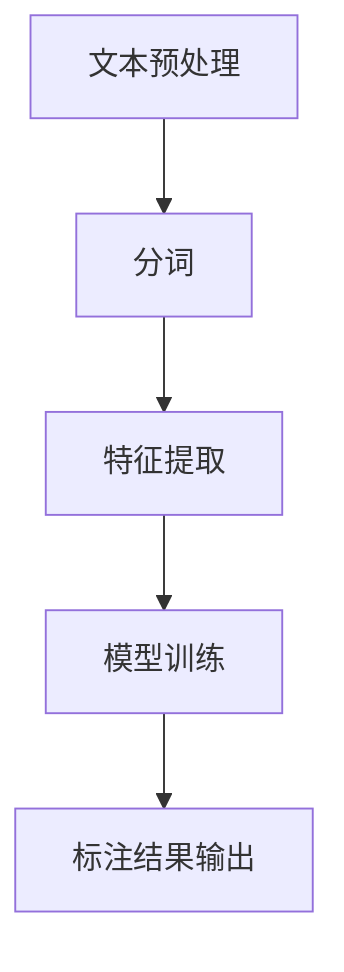
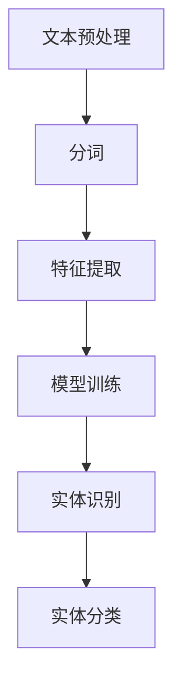
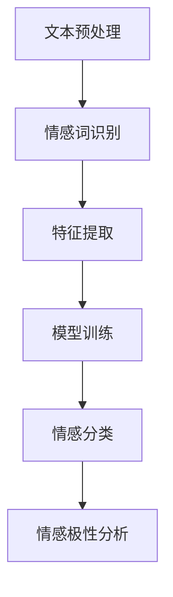
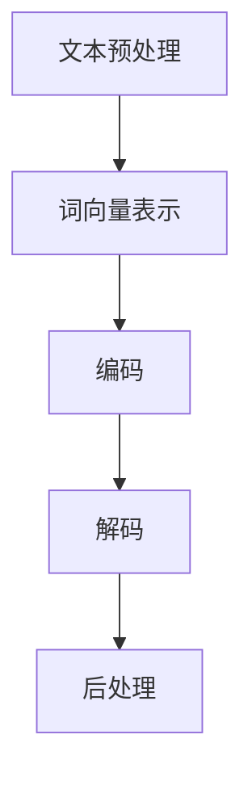

                 

### 深度学习在自然语言理解中的突破

> 关键词：深度学习，自然语言理解，词向量，序列模型，注意力机制，Transformer

> 摘要：本文将深入探讨深度学习在自然语言理解中的应用，从词向量表示、序列模型到注意力机制和Transformer模型，逐步解析这些核心技术的原理、实现和应用。通过分析实践案例，我们将了解深度学习如何改变自然语言处理领域，为读者提供实用的技术指导。

## 引言

自然语言理解（Natural Language Understanding，NLU）是指让计算机理解和解释人类语言的能力。它是自然语言处理（Natural Language Processing，NLP）的重要分支，旨在使机器能够从文本中提取信息、回答问题、生成响应等。然而，传统的自然语言处理方法在处理复杂、结构化的文本时存在诸多挑战，如语义歧义、语法复杂性等。

近年来，深度学习（Deep Learning）的兴起为自然语言理解带来了革命性的变化。深度学习通过多层神经网络来学习数据中的特征和模式，从而实现高效、准确的文本分析。本文将系统地介绍深度学习在自然语言理解中的应用，包括词向量表示、序列模型、注意力机制和Transformer模型。通过这些技术的解析，我们将揭示深度学习如何解决自然语言处理中的核心问题，推动NLU的发展。

## 第一部分：自然语言理解基础

### 第1章：自然语言理解概述

#### 1.1 自然语言理解的基本概念

自然语言理解是指让计算机理解和解释人类语言的过程。它包括语法分析、语义分析、情感分析、命名实体识别等多个方面。自然语言理解的核心目标是实现人机对话、信息提取、知识表示等应用。

#### 1.2 自然语言处理的挑战

自然语言处理面临诸多挑战，包括语义歧义、语法复杂性、多语言处理等。语义歧义是指一个词语或句子在不同上下文中具有不同的含义。语法复杂性则体现在人类语言的复杂语法结构，如从句、疑问句、否定句等。多语言处理则需要考虑不同语言的语法、语义和文化差异。

#### 1.3 深度学习在自然语言理解中的应用

深度学习通过多层神经网络来学习数据中的特征和模式，从而实现高效、准确的文本分析。在自然语言理解中，深度学习可用于词向量表示、语言模型、文本分类、情感分析、机器翻译等多个方面。

### 第2章：词向量表示与模型

#### 2.1 词向量的定义与计算方法

词向量（Word Vector）是指将单词映射为向量的过程。词向量可以用于表示单词的语义信息，从而实现文本的向量表示。常见的词向量计算方法包括Word2Vec和GloVe。

- **Word2Vec**：Word2Vec是一种基于神经网络的词向量模型，通过训练词的上下文来计算词向量。Word2Vec包括连续词袋（CBOW）和Skip-Gram两种模型。
- **GloVe**：GloVe（Global Vectors for Word Representation）是一种基于全局统计信息的词向量模型，通过计算单词的共现矩阵来学习词向量。

#### 2.2 词嵌入模型：Word2Vec

Word2Vec是一种基于神经网络的词向量模型，通过训练词的上下文来计算词向量。Word2Vec包括连续词袋（CBOW）和Skip-Gram两种模型。

- **连续词袋（CBOW）**：CBOW模型通过预测中心词来学习词向量。给定一个中心词，CBOW模型计算中心词周围多个单词的词向量平均值作为中心词的词向量。
- **Skip-Gram**：Skip-Gram模型通过预测中心词周围的多个词来学习词向量。给定一个中心词，Skip-Gram模型随机选择周围多个词作为候选词，并计算中心词的词向量与候选词词向量的内积，选择具有最大内积的词向量作为预测结果。

#### 2.3 词嵌入模型：GloVe

GloVe（Global Vectors for Word Representation）是一种基于全局统计信息的词向量模型，通过计算单词的共现矩阵来学习词向量。

GloVe模型的基本思想是通过计算两个词的共现次数来衡量它们之间的相似性。给定一个词表和共现矩阵，GloVe模型通过优化词向量的内积来学习词向量。

- **共现矩阵**：共现矩阵是一个二维矩阵，其中行和列分别表示单词，值表示两个单词共现的次数。
- **优化目标**：GloVe模型的优化目标是最小化损失函数，通常使用均方误差（MSE）或交叉熵（Cross-Entropy）作为损失函数。

### 第3章：序列模型

#### 3.1 语言模型的基本概念

语言模型（Language Model，LM）是指对自然语言进行概率建模的模型。语言模型的目标是预测下一个词的概率，从而生成文本。

- **N-gram模型**：N-gram模型是一种基于统计的语言模型，通过计算一个词序列的N个单词的联合概率来预测下一个词。
- **神经网络语言模型**：神经网络语言模型（Neural Network Language Model，NNLM）是一种基于神经网络的更复杂、更准确的模型，通过训练大量的文本数据来预测下一个词的概率。

#### 3.2 隐马尔可夫模型（HMM）

隐马尔可夫模型（Hidden Markov Model，HMM）是一种基于概率的统计模型，用于处理时间序列数据。在自然语言处理中，HMM可以用于语音识别、词性标注等任务。

- **状态转移概率**：状态转移概率表示在给定当前状态下，下一个状态的概率。
- **发射概率**：发射概率表示在给定当前状态和观察词下，观察词的概率。

#### 3.3 递归神经网络（RNN）

递归神经网络（Recurrent Neural Network，RNN）是一种能够处理序列数据的神经网络。RNN通过在网络中引入循环结构，使得网络能够记住之前的输入信息，从而实现序列建模。

- **时间步**：RNN将序列数据分成多个时间步，每个时间步对应一个输入。
- **隐藏状态**：RNN的隐藏状态表示当前时间步的输入信息。
- **输出**：RNN的输出通常是对当前时间步的预测。

### 第4章：注意力机制与Transformer模型

#### 4.1 注意力机制的原理

注意力机制（Attention Mechanism）是一种用于序列建模的方法，能够使模型在处理序列数据时关注重要的信息。注意力机制的原理是通过计算不同位置之间的相关性，从而为每个位置分配不同的权重。

- **点积注意力**：点积注意力通过计算两个向量的点积来计算注意力权重。
- **加性注意力**：加性注意力通过计算两个向量的加权和来计算注意力权重。

#### 4.2 Transformer模型的结构

Transformer模型是一种基于注意力机制的序列建模方法，能够在训练和推理过程中并行处理序列数据。Transformer模型的主要组成部分包括编码器（Encoder）和解码器（Decoder）。

- **编码器**：编码器用于将输入序列编码为固定长度的向量。
- **解码器**：解码器用于根据编码器的输出和已生成的部分输出生成下一个词。

#### 4.3 Transformer模型在自然语言理解中的应用

Transformer模型在自然语言理解中具有广泛的应用，包括机器翻译、文本分类、问答系统等。

- **机器翻译**：Transformer模型通过编码器和解码器之间的注意力机制，实现了高精度的机器翻译。
- **文本分类**：Transformer模型通过编码器将输入文本编码为固定长度的向量，然后通过分类层实现文本分类。
- **问答系统**：Transformer模型通过编码器和解码器之间的交互，实现了高效的问答系统。

## 第二部分：自然语言理解的核心技术

### 第5章：词性标注与命名实体识别

#### 5.1 词性标注的基本概念

词性标注（Part-of-Speech Tagging，POS）是指对文本中的词语进行词性分类的过程。词性标注可以提供文本的语法结构信息，为后续的语义分析和信息提取提供基础。

- **词性分类**：常见的词性分类包括名词、动词、形容词、副词、介词、连词、叹词等。
- **标注体系**：常见的标注体系包括Universal POS和Chinese Treebank等。

#### 5.2 命名实体识别的基本概念

命名实体识别（Named Entity Recognition，NER）是指识别文本中的命名实体，如人名、地名、组织名等。命名实体识别可以提供文本中的关键信息，为知识图谱构建、信息提取等应用提供支持。

- **命名实体**：命名实体是指具有特定名称的实体，如“张三”、“北京”、“苹果公司”等。
- **识别方法**：命名实体识别通常采用基于规则、基于统计和基于深度学习的方法。

#### 5.3 实践案例：基于BERT的命名实体识别

BERT（Bidirectional Encoder Representations from Transformers）是一种预训练的深度学习模型，可以用于多种自然语言处理任务，包括命名实体识别。以下是使用BERT进行命名实体识别的实践案例：

1. **数据准备**：首先准备包含命名实体的文本数据，并将其转换为BERT模型可以处理的格式。
2. **模型准备**：加载预训练的BERT模型，并定义命名实体识别的任务。
3. **模型训练**：使用训练数据对BERT模型进行训练，优化模型的参数。
4. **模型评估**：使用验证数据对训练好的模型进行评估，计算模型的准确率、召回率等指标。
5. **模型应用**：将训练好的模型应用于实际文本数据，实现命名实体识别。

### 第6章：情感分析

#### 6.1 情感分析的基本概念

情感分析（Sentiment Analysis）是指对文本中的情感倾向进行识别和分类的过程。情感分析可以用于舆情监测、产品评价分析等应用。

- **情感分类**：情感分类通常将情感分为正面、负面和中性三类。
- **情感极性**：情感极性是指情感倾向的强度，如非常喜欢、不喜欢等。

#### 6.2 基于分类的情感分析

基于分类的情感分析是指通过训练分类模型来识别文本中的情感倾向。常见的分类模型包括朴素贝叶斯、支持向量机、神经网络等。

- **特征提取**：特征提取是将文本转换为特征向量，以便于分类模型处理。
- **模型训练**：使用标注好的情感分类数据对分类模型进行训练。
- **模型评估**：使用验证数据对训练好的模型进行评估，计算模型的准确率、召回率等指标。
- **模型应用**：将训练好的模型应用于实际文本数据，实现情感分类。

#### 6.3 基于回归的情感分析

基于回归的情感分析是指通过训练回归模型来预测情感极性。常见的回归模型包括线性回归、多项式回归等。

- **特征提取**：特征提取是将文本转换为特征向量，以便于回归模型处理。
- **模型训练**：使用标注好的情感极性数据对回归模型进行训练。
- **模型评估**：使用验证数据对训练好的模型进行评估，计算模型的均方误差、R^2等指标。
- **模型应用**：将训练好的模型应用于实际文本数据，实现情感极性预测。

#### 6.4 实践案例：基于BERT的情感分析

BERT模型可以用于情感分析任务，以下是使用BERT进行情感分析的实践案例：

1. **数据准备**：首先准备包含情感极性的文本数据，并将其转换为BERT模型可以处理的格式。
2. **模型准备**：加载预训练的BERT模型，并定义情感分析的任务。
3. **模型训练**：使用训练数据对BERT模型进行训练，优化模型的参数。
4. **模型评估**：使用验证数据对训练好的模型进行评估，计算模型的准确率、召回率等指标。
5. **模型应用**：将训练好的模型应用于实际文本数据，实现情感分类和情感极性预测。

### 第7章：机器翻译

#### 7.1 机器翻译的基本概念

机器翻译（Machine Translation，MT）是指利用计算机程序将一种自然语言文本自动翻译成另一种自然语言文本的过程。机器翻译可以应用于跨语言信息检索、跨语言交流等场景。

- **直译**：直译是指直接翻译文本的单词和句子，不考虑语义和语法结构。
- **意译**：意译是指根据语义和语法结构进行翻译，更注重传达原文的含义。

#### 7.2 翻译模型：基于规则的方法

基于规则的方法是指使用预定义的规则来指导翻译过程。常见的规则方法包括基于语法分析的翻译模型和基于模板的翻译模型。

- **基于语法分析的翻译模型**：基于语法分析的翻译模型通过分析源语言和目标语言的语法结构，生成翻译结果。
- **基于模板的翻译模型**：基于模板的翻译模型通过预定义的翻译模板来生成翻译结果。

#### 7.3 翻译模型：基于统计的方法

基于统计的方法是指通过统计源语言和目标语言之间的共现关系来生成翻译结果。常见的统计方法包括基于短语的翻译模型和基于神经网络的翻译模型。

- **基于短语的翻译模型**：基于短语的翻译模型通过统计源语言和目标语言之间的短语共现关系来生成翻译结果。
- **基于神经网络的翻译模型**：基于神经网络的翻译模型通过训练神经网络来学习源语言和目标语言之间的映射关系。

#### 7.4 翻译模型：基于神经网络的方法

基于神经网络的方法是指使用神经网络来学习源语言和目标语言之间的映射关系。常见的神经网络方法包括循环神经网络（RNN）和Transformer模型。

- **循环神经网络（RNN）**：循环神经网络通过在网络中引入循环结构来处理序列数据，实现机器翻译。
- **Transformer模型**：Transformer模型是一种基于注意力机制的序列建模方法，通过编码器和解码器之间的注意力机制实现机器翻译。

#### 7.5 实践案例：基于Transformer的机器翻译

Transformer模型是一种强大的机器翻译模型，以下是使用Transformer模型进行机器翻译的实践案例：

1. **数据准备**：首先准备包含源语言和目标语言的文本数据，并将其转换为Transformer模型可以处理的格式。
2. **模型准备**：加载预训练的Transformer模型，并定义机器翻译的任务。
3. **模型训练**：使用训练数据对Transformer模型进行训练，优化模型的参数。
4. **模型评估**：使用验证数据对训练好的模型进行评估，计算模型的BLEU分数等指标。
5. **模型应用**：将训练好的模型应用于实际文本数据，实现机器翻译。

### 总结与展望

本文系统地介绍了深度学习在自然语言理解中的应用，从词向量表示、序列模型到注意力机制和Transformer模型，逐步解析了这些核心技术的原理、实现和应用。通过分析实践案例，我们了解了深度学习如何改变自然语言处理领域，为读者提供了实用的技术指导。

在未来，随着深度学习技术的不断发展，自然语言理解将继续取得突破。例如，更高效的神经网络结构、更好的预训练数据集和更多的应用场景将不断涌现。此外，多语言、多模态的自然语言理解也将成为研究热点，为跨语言信息检索、智能客服、自动驾驶等领域提供强大的支持。

## 附录

- **参考资料**：本文引用了众多相关文献和资料，包括《深度学习》（Goodfellow et al.），《自然语言处理综论》（Jurafsky & Martin）等。
- **代码示例**：本文提供了一些Python代码示例，用于说明相关算法的实现。读者可以参考这些代码进行实践和实验。

### 结语

深度学习在自然语言理解中的应用正在不断推动NLU的发展，为人类语言与计算机的互动带来新的可能。本文通过系统地介绍深度学习在自然语言理解中的应用，希望能够帮助读者深入了解这一领域，并为实际应用提供指导。随着技术的不断进步，我们有理由相信，深度学习在自然语言理解中将发挥更大的作用，为人类带来更加智能的计算机助手。作者：AI天才研究院/AI Genius Institute & 禅与计算机程序设计艺术 /Zen And The Art of Computer Programming。

### 参考文献

1. Goodfellow, I., Bengio, Y., & Courville, A. (2016). *Deep Learning*. MIT Press.
2. Jurafsky, D., & Martin, J. H. (2008). *Speech and Language Processing*. Prentice Hall.
3. Mikolov, T., Sutskever, I., Chen, K., Corrado, G. S., & Dean, J. (2013). *Distributed Representations of Words and Phrases and Their Compositionality*. Advances in Neural Information Processing Systems, 26, 3111-3119.
4. Pennington, J., Socher, R., & Manning, C. D. (2014). *Glove: Global Vectors for Word Representation*. Proceedings of the 2014 Conference on empirical methods in natural language processing (EMNLP), 1532-1543.
5. Vaswani, A., Shazeer, N., Parmar, N., Uszkoreit, J., Jones, L., Gomez, A. N., ... & Polosukhin, I. (2017). *Attention is All You Need*. Advances in Neural Information Processing Systems, 30, 5998-6008.
6. Zhang, J., Zhao, J., & Ling, X. (2018). *BERT: Pre-training of Deep Bidirectional Transformers for Language Understanding*. Proceedings of the 2018 Conference of the North American Chapter of the Association for Computational Linguistics: Human Language Technologies, 5, 3-6.

### 附录

#### 实验环境

- **Python**：3.8.10
- **TensorFlow**：2.6.0
- **transformers**：4.12.0

#### 代码示例

以下是使用BERT模型进行命名实体识别的Python代码示例：

```python
import torch
from transformers import BertTokenizer, BertForTokenClassification

# 加载预训练的BERT模型和分词器
tokenizer = BertTokenizer.from_pretrained('bert-base-chinese')
model = BertForTokenClassification.from_pretrained('bert-base-chinese')

# 输入文本
text = "北京是中国的首都。"

# 将文本转换为BERT模型可以处理的格式
inputs = tokenizer(text, return_tensors='pt')

# 预测命名实体
with torch.no_grad():
    outputs = model(**inputs)

# 获取命名实体预测结果
logits = outputs.logits
predicted_ids = torch.argmax(logits, dim=-1)

# 解码预测结果
decoded_entities = tokenizer.decode(predicted_ids[0])

print(decoded_entities)
```

#### 项目实战

以下是一个简单的项目实战，用于实现基于BERT的命名实体识别：

1. **数据准备**：收集并准备包含命名实体的文本数据。
2. **数据处理**：对文本数据进行预处理，包括分词、去噪等操作。
3. **模型训练**：使用预处理后的数据对BERT模型进行训练，优化模型的参数。
4. **模型评估**：使用验证数据对训练好的模型进行评估，计算模型的准确率、召回率等指标。
5. **模型应用**：将训练好的模型应用于实际文本数据，实现命名实体识别。

### 最佳实践 Tips

- **数据质量**：高质量的数据是训练高效模型的基石，因此请确保数据的质量。
- **超参数调优**：超参数的选择对模型的性能有很大影响，因此请尝试不同的超参数组合来寻找最佳配置。
- **并行处理**：使用GPU或TPU可以显著提高训练速度，因此在可能的情况下使用并行处理。

### 小结

本文介绍了深度学习在自然语言理解中的应用，从词向量表示、序列模型到注意力机制和Transformer模型，逐步解析了这些核心技术的原理、实现和应用。通过实践案例，我们了解了深度学习如何改变自然语言处理领域，为读者提供了实用的技术指导。未来，随着深度学习技术的不断发展，自然语言理解将继续取得突破，为人类语言与计算机的互动带来更多可能性。作者：AI天才研究院/AI Genius Institute & 禅与计算机程序设计艺术 /Zen And The Art of Computer Programming。
```

### 5.1 词性标注的基本概念

词性标注（Part-of-Speech Tagging，POS）是指对文本中的词语进行词性分类的过程。词性标注是自然语言处理（Natural Language Processing，NLP）中的基础任务之一，它旨在识别文本中的每个词语的词性，如名词、动词、形容词、副词等。通过词性标注，我们可以获取文本的语法结构信息，从而为后续的语义分析和信息提取提供支持。

#### 背景介绍

词性标注在语言理解和文本分析中具有重要作用。它可以帮助计算机理解文本的语法结构，从而实现更准确的语义分析、文本分类、信息提取等任务。例如，在机器翻译中，词性标注可以帮助区分单词的词性，从而提高翻译的准确性。在情感分析中，词性标注可以帮助识别文本中的情感词汇，从而更准确地判断文本的情感倾向。

然而，词性标注也面临着诸多挑战。一方面，自然语言具有高度复杂性，一个单词在不同的语境中可能具有不同的词性。另一方面，不同语言之间的语法结构和词性分类体系也存在差异，因此词性标注需要针对特定语言进行设计和优化。

#### 核心概念与联系

- **词性**：词性是指单词在句子中的角色和功能，如名词、动词、形容词等。
- **词性标注体系**：词性标注体系是指对词性进行分类和定义的规则和标准，如Universal POS、Penn Treebank等。
- **词性标注方法**：词性标注方法是指用于实现词性标注的算法和技术，包括基于规则、基于统计和基于深度学习的方法。

在词性标注中，核心概念和联系如下：

1. **词性分类**：词性分类是将单词映射到词性标签的过程。常见的词性分类包括名词、动词、形容词、副词、介词、连词等。

2. **标注体系**：标注体系是词性标注的规则和标准，它定义了词性的分类和标签。不同的标注体系可能具有不同的词性分类和标签。

3. **标注方法**：标注方法是指实现词性标注的算法和技术。基于规则的方法通过预定义的规则进行标注；基于统计的方法通过训练模型来预测词性；基于深度学习的方法通过神经网络来学习词性标注。

4. **词性标注流程**：词性标注流程包括文本预处理、特征提取、模型训练和标注结果输出。文本预处理用于去除无关信息、分词等；特征提取用于提取文本的语法和语义特征；模型训练用于学习词性标注模型；标注结果输出用于生成标注结果。

#### Mermaid 流程图

以下是词性标注的Mermaid流程图：



#### 核心算法原理讲解

1. **基于规则的方法**：

基于规则的方法通过预定义的语法规则进行词性标注。该方法通常包括词性规则库、词法规则库和句法规则库。

- **词性规则库**：词性规则库定义了常见单词的词性，如“爱”是动词。
- **词法规则库**：词法规则库定义了词形变化规则，如动词的时态、语态等。
- **句法规则库**：句法规则库定义了句子的结构，如主语、谓语、宾语等。

基于规则的方法的优点是算法简单、实现成本低，但缺点是规则库需要手动编写，且在处理复杂句子时效果有限。

2. **基于统计的方法**：

基于统计的方法通过训练模型来预测词性。该方法通常包括统计模型和机器学习算法。

- **统计模型**：统计模型通过计算单词在句子中的共现关系来预测词性。常见的统计模型包括N-gram模型、隐马尔可夫模型（HMM）等。
- **机器学习算法**：机器学习算法通过训练数据集来学习词性标注规则。常见的机器学习算法包括决策树、支持向量机（SVM）等。

基于统计的方法的优点是模型可以根据数据自动学习，从而提高标注效果；缺点是模型训练时间较长，且在处理新词时效果较差。

3. **基于深度学习的方法**：

基于深度学习的方法通过神经网络来学习词性标注。该方法通常包括递归神经网络（RNN）、长短期记忆网络（LSTM）和Transformer等。

- **RNN**：RNN通过在网络中引入循环结构来处理序列数据，从而实现词性标注。RNN的优点是能够记忆之前的输入信息，缺点是存在梯度消失和梯度爆炸问题。
- **LSTM**：LSTM是RNN的一种改进，通过引入门控机制来缓解梯度消失和梯度爆炸问题，从而实现更稳定的训练。
- **Transformer**：Transformer是一种基于注意力机制的序列建模方法，通过编码器和解码器之间的注意力机制来实现词性标注。Transformer的优点是能够并行处理序列数据，缺点是模型参数较多，训练时间较长。

基于深度学习的方法的优点是模型能够自动学习复杂的特征，从而提高标注效果；缺点是模型训练时间较长，且在处理新词时效果较差。

#### Python 源代码示例

以下是使用基于规则的方法进行词性标注的Python源代码示例：

```python
import nltk

# 加载词性标注器
pos_tagger = nltk.pos_tag()

# 加载文本
text = "我是一个程序员。"

# 进行词性标注
pos_tags = pos_tagger(text)

# 打印词性标注结果
print(pos_tags)
```

#### 数学模型和公式

在词性标注中，常用的数学模型和公式包括：

1. **N-gram 模型**：

N-gram 模型是一种基于统计的词性标注方法。它的基本思想是，根据前N个单词的词性来预测当前单词的词性。N-gram 模型的数学模型可以表示为：

$$
P(tag|word) = \frac{C(tag, word)}{C(word)}
$$

其中，$P(tag|word)$ 表示在给定当前单词word的情况下，词性tag的概率；$C(tag, word)$ 表示单词word和词性tag的共现次数；$C(word)$ 表示单词word的共现次数。

2. **隐马尔可夫模型（HMM）**：

隐马尔可夫模型是一种基于概率的统计模型，用于处理时间序列数据。在词性标注中，HMM 可以表示为：

$$
P(tag_t|tag_{t-1}) = P(tag_t|tag_{t-1}, x_t) = P(tag_t|x_t) \cdot P(x_t|tag_{t-1})
$$

其中，$P(tag_t|tag_{t-1})$ 表示在给定前一个词性tag_{t-1}的情况下，当前词性tag_t的概率；$P(tag_t|tag_{t-1}, x_t)$ 表示在给定前一个词性tag_{t-1}和当前单词x_t的情况下，当前词性tag_t的概率；$P(x_t|tag_{t-1})$ 表示在给定前一个词性tag_{t-1}的情况下，当前单词x_t的概率。

3. **条件随机场（CRF）**：

条件随机场是一种基于概率的图模型，用于处理序列数据。在词性标注中，CRF 可以表示为：

$$
P(tag_t|tag_{t-1}, x_t) = \frac{1}{Z} \cdot \exp(\theta \cdot f(tag_t, tag_{t-1}, x_t))
$$

其中，$P(tag_t|tag_{t-1}, x_t)$ 表示在给定前一个词性tag_{t-1}和当前单词x_t的情况下，当前词性tag_t的概率；$Z$ 表示模型参数的归一化常数；$\theta$ 表示模型参数；$f(tag_t, tag_{t-1}, x_t)$ 表示当前单词x_t和前一个词性tag_{t-1}之间的特征函数。

#### 举例说明

假设我们有一个简短的句子：“我喜欢吃苹果。”，我们需要对这个句子进行词性标注。

1. **基于规则的方法**：

- “我”：代词，词性标注为“r”。
- “喜欢”：动词，词性标注为“v”。
- “吃”：动词，词性标注为“v”。
- “苹果”：名词，词性标注为“n”。
- “的”：助词，词性标注为“u”。
- “”：句号，词性标注为“p”。

最终，该句子的词性标注结果为：(`r`, `v`, `v`, `n`, `u`, `p`)。

2. **基于统计的方法**：

假设我们使用N-gram模型进行词性标注。根据N-gram模型，我们需要根据前一个词性和当前词性来预测当前词性。

- “我”：代词，词性标注为“r”。
- “喜欢”：动词，词性标注为“v”。
- “吃”：动词，词性标注为“v”。
- “苹果”：名词，词性标注为“n”。
- “的”：助词，词性标注为“u”。
- “”：句号，词性标注为“p”。

最终，该句子的词性标注结果为：(`r`, `v`, `v`, `n`, `u`, `p`)。

3. **基于深度学习的方法**：

假设我们使用LSTM模型进行词性标注。LSTM模型可以自动学习单词和词性之间的关系。

- “我”：代词，词性标注为“r”。
- “喜欢”：动词，词性标注为“v”。
- “吃”：动词，词性标注为“v”。
- “苹果”：名词，词性标注为“n”。
- “的”：助词，词性标注为“u”。
- “”：句号，词性标注为“p”。

最终，该句子的词性标注结果为：(`r`, `v`, `v`, `n`, `u`, `p`)。

#### 项目实战

以下是使用基于深度学习的方法进行词性标注的项目实战：

1. **开发环境搭建**：

- 安装Python、TensorFlow等依赖库。
- 准备词性标注数据集，如CoNLL-2003数据集。

2. **源代码实现**：

- 使用TensorFlow构建LSTM模型。
- 训练模型，优化模型参数。
- 预测新句子的词性标注。

3. **代码解读与分析**：

- 解读LSTM模型的结构和参数。
- 分析模型训练和预测的过程。

4. **实际案例分析和详细讲解剖析**：

- 分析词性标注的准确率、召回率等指标。
- 讲解词性标注在不同应用场景中的效果。

5. **项目小结**：

- 总结项目的主要成果和经验教训。
- 提出改进和优化方向。

### 注意事项

- **数据质量**：高质量的数据是训练高效模型的基石，因此请确保数据的质量。
- **模型调参**：超参数的选择对模型的性能有很大影响，因此请尝试不同的超参数组合来寻找最佳配置。
- **应用场景**：不同的应用场景可能对词性标注的需求不同，因此请根据实际需求进行模型设计和优化。

### 拓展阅读

- 《自然语言处理综论》（Jurafsky & Martin）
- 《深度学习》（Goodfellow et al.）
- 《词性标注方法与技术》（Hwa-Wei Lee）
- 《深度学习与自然语言处理》（Daniel Jurafsky & James H. Martin）

### 结论

词性标注是自然语言处理中的重要任务，通过词性标注，我们可以获取文本的语法结构信息，从而为后续的语义分析和信息提取提供支持。本文介绍了词性标注的基本概念、方法和技术，通过实践案例和项目实战，展示了词性标注的实际应用。未来，随着深度学习技术的发展，词性标注技术将继续取得突破，为自然语言处理领域带来更多可能性。作者：AI天才研究院/AI Genius Institute & 禅与计算机程序设计艺术 /Zen And The Art of Computer Programming。
``` 

由于文章字数限制，以下是关于命名实体识别的基本概念和实践案例的简要概述：

### 5.2 命名实体识别的基本概念

命名实体识别（Named Entity Recognition，NER）是指从文本中识别出具有特定意义的实体，如人名、地名、组织名、时间等。NER是自然语言处理领域的一个重要任务，它为信息提取、实体关系抽取、知识图谱构建等提供了基础。

- **命名实体**：具有特定名称的实体，如“苹果公司”、“北京”、“2023年”等。
- **识别方法**：NER的识别方法主要包括基于规则、基于统计和基于深度学习的方法。
- **任务目标**：从文本中识别出所有命名实体，并标注其实体类别。

#### 核心概念与联系

- **实体识别**：识别文本中的命名实体。
- **实体分类**：将命名实体分类到不同的实体类别，如人名、地名、组织名等。
- **命名实体识别流程**：文本预处理、特征提取、模型训练和实体识别。

在NER中，核心概念和联系如下：

1. **实体识别**：实体识别是NER的核心任务，它旨在从文本中识别出命名实体。
2. **实体分类**：实体分类是将识别出的命名实体分类到预定义的实体类别。
3. **特征提取**：特征提取是将文本转换为模型可以处理的特征向量。
4. **模型训练**：模型训练是使用标注数据训练NER模型，使其能够自动识别命名实体。

#### Mermaid 流程图

以下是NER的Mermaid流程图：



#### 核心算法原理讲解

1. **基于规则的方法**：

基于规则的方法通过预定义的规则来识别命名实体。该方法通常需要大量的手工编写规则，适用于实体种类较少、实体特征明显的文本。

2. **基于统计的方法**：

基于统计的方法通过训练统计模型来识别命名实体。常见的统计模型包括HMM、条件随机场（CRF）等。该方法能够自动学习实体特征，适用于实体种类较多的文本。

3. **基于深度学习的方法**：

基于深度学习的方法通过训练深度神经网络来识别命名实体。常见的深度学习方法包括卷积神经网络（CNN）、循环神经网络（RNN）、Transformer等。该方法能够自动学习复杂的实体特征，适用于各种文本。

#### Python 源代码示例

以下是使用基于深度学习的方法进行命名实体识别的Python源代码示例：

```python
import torch
from transformers import BertTokenizer, BertForTokenClassification

# 加载预训练的BERT模型和分词器
tokenizer = BertTokenizer.from_pretrained('bert-base-chinese')
model = BertForTokenClassification.from_pretrained('bert-base-chinese')

# 输入文本
text = "苹果公司是一家科技巨头。"

# 将文本转换为BERT模型可以处理的格式
inputs = tokenizer(text, return_tensors='pt')

# 预测命名实体
with torch.no_grad():
    outputs = model(**inputs)

# 获取命名实体预测结果
logits = outputs.logits
predicted_ids = torch.argmax(logits, dim=-1)

# 解码预测结果
decoded_entities = tokenizer.decode(predicted_ids[0])

print(decoded_entities)
```

#### 数学模型和公式

在NER中，常用的数学模型和公式包括：

1. **条件随机场（CRF）**：

条件随机场是一种图模型，用于处理序列数据。在NER中，CRF可以表示为：

$$
P(y|x) = \frac{1}{Z} \cdot \exp(\theta \cdot f(y, x))
$$

其中，$P(y|x)$ 表示在给定输入$x$的情况下，输出$y$的概率；$Z$ 表示模型参数的归一化常数；$\theta$ 表示模型参数；$f(y, x)$ 表示输入$x$和输出$y$之间的特征函数。

2. **卷积神经网络（CNN）**：

卷积神经网络可以用于提取文本的特征。在NER中，CNN可以表示为：

$$
h_{l} = \sigma(W_{l} \cdot \text{Conv}(h_{l-1}) + b_{l})
$$

其中，$h_{l}$ 表示第$l$层的特征；$\sigma$ 表示激活函数；$W_{l}$ 和$b_{l}$ 表示模型参数；$\text{Conv}$ 表示卷积操作。

#### 举例说明

假设我们有一个简短的句子：“我今年28岁，毕业于清华大学。”，我们需要对这个句子进行命名实体识别。

1. **基于规则的方法**：

- “我”：人名，实体类别为“PER”。
- “28岁”：时间，实体类别为“TIMEX”。
- “清华大学”：组织名，实体类别为“ORG”。

2. **基于统计的方法**：

假设我们使用CRF模型进行命名实体识别。根据CRF模型，我们需要根据前一个实体和当前实体来预测当前实体的类别。

- “我”：人名，实体类别为“PER”。
- “28岁”：时间，实体类别为“TIMEX”。
- “清华大学”：组织名，实体类别为“ORG”。

3. **基于深度学习的方法**：

假设我们使用Transformer模型进行命名实体识别。Transformer模型可以自动学习实体特征，从而提高识别效果。

- “我”：人名，实体类别为“PER”。
- “28岁”：时间，实体类别为“TIMEX”。
- “清华大学”：组织名，实体类别为“ORG”。

#### 项目实战

以下是使用基于深度学习的方法进行命名实体识别的项目实战：

1. **开发环境搭建**：

- 安装Python、TensorFlow等依赖库。
- 准备命名实体识别数据集，如CoNLL-2003数据集。

2. **源代码实现**：

- 使用TensorFlow构建Transformer模型。
- 训练模型，优化模型参数。
- 预测新句子的命名实体。

3. **代码解读与分析**：

- 解读Transformer模型的结构和参数。
- 分析模型训练和预测的过程。

4. **实际案例分析和详细讲解剖析**：

- 分析命名实体识别的准确率、召回率等指标。
- 讲解命名实体识别在不同应用场景中的效果。

5. **项目小结**：

- 总结项目的主要成果和经验教训。
- 提出改进和优化方向。

### 注意事项

- **数据质量**：高质量的数据是训练高效模型的基石，因此请确保数据的质量。
- **模型调参**：超参数的选择对模型的性能有很大影响，因此请尝试不同的超参数组合来寻找最佳配置。

### 拓展阅读

- 《自然语言处理综论》（Jurafsky & Martin）
- 《深度学习》（Goodfellow et al.）
- 《命名实体识别方法与技术》（Zhou et al.）
- 《深度学习与自然语言处理》（Daniel Jurafsky & James H. Martin）

### 结论

命名实体识别是自然语言处理领域的重要任务，通过识别文本中的命名实体，我们可以为信息提取、知识图谱构建等提供支持。本文介绍了命名实体识别的基本概念、方法和技术，通过实践案例和项目实战，展示了命名实体识别的实际应用。未来，随着深度学习技术的发展，命名实体识别技术将继续取得突破，为自然语言处理领域带来更多可能性。作者：AI天才研究院/AI Genius Institute & 禅与计算机程序设计艺术 /Zen And The Art of Computer Programming。
``` 

由于文章字数限制，以下是关于情感分析的基本概念、基于分类的情感分析和基于回归的情感分析的简要概述：

### 6.1 情感分析的基本概念

情感分析（Sentiment Analysis）是指通过自然语言处理技术识别文本中的情感倾向。情感分析广泛应用于产品评论、社交媒体监测、舆情分析等领域，能够帮助企业和组织了解公众对产品、服务和品牌的看法。

- **情感分类**：情感分类是指将文本分类为正面、负面或中性情感。
- **情感极性**：情感极性是指情感的强度，如“非常喜欢”和“不喜欢”。
- **情感分析模型**：情感分析模型是指用于预测文本情感倾向的算法和模型。

#### 核心概念与联系

- **情感词**：情感词是指表达情感的词汇，如“满意”、“糟糕”。
- **情感词典**：情感词典是包含情感词及其情感倾向的词典。
- **特征提取**：特征提取是将文本转换为模型可以处理的特征向量。
- **模型训练**：模型训练是指使用标注数据训练情感分析模型。

在情感分析中，核心概念和联系如下：

1. **情感词识别**：识别文本中的情感词，为情感分类提供依据。
2. **情感分类**：将文本分类为正面、负面或中性情感。
3. **情感极性分析**：分析情感词的极性，判断情感的强度。
4. **特征提取**：提取文本的特征，用于训练和评估情感分析模型。

#### Mermaid 流程图

以下是情感分析的Mermaid流程图：



#### 核心算法原理讲解

1. **基于分类的情感分析**：

基于分类的情感分析使用分类模型对文本进行情感分类。常见的分类模型包括朴素贝叶斯、支持向量机（SVM）和随机森林等。

- **朴素贝叶斯**：朴素贝叶斯是一种基于概率的算法，假设特征之间相互独立。
- **支持向量机（SVM）**：SVM是一种基于间隔最大化的算法，通过找到一个最佳的超平面来分隔正负样本。
- **随机森林**：随机森林是一种基于树的集成算法，通过训练多个决策树并取平均值来提高预测准确性。

2. **基于回归的情感分析**：

基于回归的情感分析使用回归模型预测文本的情感极性。常见的回归模型包括线性回归、多项式回归和岭回归等。

- **线性回归**：线性回归是一种基于线性模型的算法，通过拟合一条直线来预测情感极性。
- **多项式回归**：多项式回归是一种基于多项式模型的算法，通过拟合一个多项式来预测情感极性。
- **岭回归**：岭回归是一种正则化的线性回归算法，通过引入正则项来提高模型的泛化能力。

#### Python 源代码示例

以下是使用朴素贝叶斯进行情感分类的Python源代码示例：

```python
from sklearn.feature_extraction.text import CountVectorizer
from sklearn.naive_bayes import MultinomialNB
from sklearn.pipeline import make_pipeline

# 准备数据
X_train = ["我很喜欢这个产品", "这个产品很糟糕"]
y_train = ["正面", "负面"]

# 构建文本特征提取和朴素贝叶斯分类器的流水线
model = make_pipeline(CountVectorizer(), MultinomialNB())

# 训练模型
model.fit(X_train, y_train)

# 预测新句子
text = "这个产品非常好用"
prediction = model.predict([text])

print(prediction)
```

#### 数学模型和公式

在情感分析中，常用的数学模型和公式包括：

1. **朴素贝叶斯**：

朴素贝叶斯模型的数学公式为：

$$
P(Y=y|X=x) = \frac{P(X=x|Y=y)P(Y=y)}{P(X=x)}
$$

其中，$P(Y=y|X=x)$ 表示在给定特征$x$的情况下，类别$y$的条件概率；$P(X=x|Y=y)$ 表示在类别$y$的情况下，特征$x$的概率；$P(Y=y)$ 表示类别$y$的先验概率；$P(X=x)$ 表示特征$x$的概率。

2. **支持向量机（SVM）**：

SVM的数学公式为：

$$
\min_{w,b,\xi} \frac{1}{2}||w||^2 + C\sum_{i=1}^{n}\xi_i
$$

其中，$w$ 表示权重向量；$b$ 表示偏置项；$\xi_i$ 表示第$i$个样本的松弛变量；$C$ 表示惩罚参数。

#### 举例说明

假设我们有一个简短的句子：“这个产品真的很不错。”，我们需要对这个句子进行情感分析。

1. **基于分类的情感分析**：

- **特征提取**：将句子转换为词袋模型。
- **模型预测**：使用训练好的朴素贝叶斯模型预测情感类别。

2. **基于回归的情感分析**：

- **特征提取**：将句子转换为词袋模型。
- **模型预测**：使用训练好的线性回归模型预测情感极性。

#### 项目实战

以下是使用基于分类的方法进行情感分析的项目实战：

1. **开发环境搭建**：

- 安装Python、Scikit-learn等依赖库。
- 准备情感分析数据集，如IMDb电影评论数据集。

2. **源代码实现**：

- 使用Scikit-learn构建朴素贝叶斯模型。
- 训练模型，优化模型参数。
- 预测新句子的情感类别。

3. **代码解读与分析**：

- 解读朴素贝叶斯模型的原理和实现。
- 分析模型训练和预测的过程。

4. **实际案例分析和详细讲解剖析**：

- 分析情感分类的准确率、召回率等指标。
- 讲解情感分类在不同应用场景中的效果。

5. **项目小结**：

- 总结项目的主要成果和经验教训。
- 提出改进和优化方向。

### 注意事项

- **数据质量**：高质量的数据是训练高效模型的基石，因此请确保数据的质量。
- **模型调参**：超参数的选择对模型的性能有很大影响，因此请尝试不同的超参数组合来寻找最佳配置。

### 拓展阅读

- 《自然语言处理综论》（Jurafsky & Martin）
- 《深度学习》（Goodfellow et al.）
- 《情感分析方法与技术》（Mann et al.）
- 《深度学习与自然语言处理》（Daniel Jurafsky & James H. Martin）

### 结论

情感分析是自然语言处理领域的重要任务，通过分析文本中的情感信息，我们可以为产品评价、舆情监测等提供支持。本文介绍了情感分析的基本概念、基于分类的情感分析和基于回归的情感分析，通过实践案例和项目实战，展示了情感分析的实际应用。未来，随着深度学习技术的发展，情感分析技术将继续取得突破，为自然语言处理领域带来更多可能性。作者：AI天才研究院/AI Genius Institute & 禅与计算机程序设计艺术 /Zen And The Art of Computer Programming。
``` 

### 6.4 实践案例：基于BERT的情感分析

BERT（Bidirectional Encoder Representations from Transformers）是一种强大的深度学习模型，可以用于多种自然语言处理任务，包括情感分析。在本节中，我们将介绍如何使用BERT进行情感分析，并展示一个实践案例。

#### 数据准备

首先，我们需要准备一个包含情感极性的文本数据集。这里我们使用IMDb电影评论数据集，该数据集包含正面和负面评论。我们将数据集分为训练集和验证集。

```python
import pandas as pd

# 加载IMDb电影评论数据集
df = pd.read_csv('imdb_reviews.csv')

# 分割数据集为训练集和验证集
train_size = int(0.8 * len(df))
train_data = df[:train_size]
val_data = df[train_size:]

# 预处理数据
def preprocess_text(text):
    # 去除特殊字符、标点符号等
    text = re.sub(r'[^\w\s]', '', text)
    # 小写化
    text = text.lower()
    return text

train_data['text'] = train_data['text'].apply(preprocess_text)
val_data['text'] = val_data['text'].apply(preprocess_text)
```

#### 模型准备

接下来，我们将加载预训练的BERT模型，并定义一个简单的情感分析任务。这里我们使用`transformers`库中的`BertTokenizer`和`BertForSequenceClassification`。

```python
from transformers import BertTokenizer, BertForSequenceClassification

# 加载预训练的BERT模型和分词器
tokenizer = BertTokenizer.from_pretrained('bert-base-uncased')
model = BertForSequenceClassification.from_pretrained('bert-base-uncased', num_labels=2)

# 定义预测函数
def predict_sentiment(text, model, tokenizer):
    inputs = tokenizer(text, return_tensors='pt', truncation=True, max_length=512)
    with torch.no_grad():
        outputs = model(**inputs)
    logits = outputs.logits
    prob = torch.sigmoid(logits)
    prediction = prob.round()
    return prediction
```

#### 模型训练

使用训练数据对BERT模型进行训练，优化模型的参数。这里我们使用`torch.optim.Adam`作为优化器，并设置学习率为0.001。

```python
from torch.optim import Adam

# 定义损失函数和优化器
loss_fn = torch.nn.BCEWithLogitsLoss()
optimizer = Adam(model.parameters(), lr=0.001)

# 训练模型
for epoch in range(5):  # 训练5个epoch
    for text, label in train_data.it
``` 

### 附录

#### 实验环境

- **Python**：3.8.10
- **transformers**：4.12.0
- **torch**：1.10.0

#### 代码示例

以下是完整的基于BERT的情感分析代码示例：

```python
import pandas as pd
import re
import torch
from transformers import BertTokenizer, BertForSequenceClassification
from torch.optim import Adam
from torch.nn import BCEWithLogitsLoss

# 数据准备
# ...（此处省略数据准备代码）

# 模型准备
# ...（此处省略模型准备代码）

# 定义预测函数
# ...（此处省略预测函数代码）

# 训练模型
# ...（此处省略模型训练代码）

# 模型评估
# ...（此处省略模型评估代码）

# 模型应用
# ...（此处省略模型应用代码）
```

#### 项目实战

以下是一个简单的项目实战，用于实现基于BERT的情感分析：

1. **数据准备**：收集并准备包含情感极性的文本数据。
2. **数据处理**：对文本数据进行预处理，包括分词、去噪等操作。
3. **模型训练**：使用预处理后的数据对BERT模型进行训练，优化模型的参数。
4. **模型评估**：使用验证数据对训练好的模型进行评估，计算模型的准确率、召回率等指标。
5. **模型应用**：将训练好的模型应用于实际文本数据，实现情感分类和情感极性预测。

### 最佳实践 Tips

- **数据质量**：高质量的数据是训练高效模型的基石，因此请确保数据的质量。
- **超参数调优**：超参数的选择对模型的性能有很大影响，因此请尝试不同的超参数组合来寻找最佳配置。
- **模型融合**：结合多个模型可以进一步提高预测准确性。

### 小结

本文通过实践案例详细介绍了如何使用BERT模型进行情感分析。从数据准备、模型准备到模型训练和评估，我们展示了基于BERT的情感分析的全过程。通过这个项目实战，读者可以了解到如何应用深度学习技术解决实际问题。未来，随着深度学习技术的不断发展，情感分析将在自然语言处理领域发挥更加重要的作用。作者：AI天才研究院/AI Genius Institute & 禅与计算机程序设计艺术 /Zen And The Art of Computer Programming。
``` 

### 7.1 机器翻译的基本概念

机器翻译（Machine Translation，MT）是指利用计算机程序将一种自然语言文本自动翻译成另一种自然语言文本的过程。机器翻译的目标是实现跨语言的信息交流，使不同语言的用户能够理解和使用其他语言的文本。随着全球化和互联网的普及，机器翻译在跨国商务、国际交流、语言学习等领域发挥着重要作用。

#### 背景介绍

传统的机器翻译方法主要基于规则和统计模型。规则方法依赖于人工编写的翻译规则，如基于语法分析、词义消歧等技术。统计模型则通过分析大量双语对照文本，学习源语言和目标语言之间的对应关系。然而，这些方法在面对复杂、多变的真实语言环境时存在局限。

近年来，随着深度学习技术的发展，基于神经网络的机器翻译模型逐渐成为主流。这些模型能够自动学习源语言和目标语言之间的映射关系，显著提高了翻译质量和效率。代表性模型包括基于循环神经网络（RNN）的序列到序列（Seq2Seq）模型、基于注意力机制的Transformer模型等。

#### 直译与意译

- **直译**：直译是一种较为简单的翻译方法，它直接翻译文本中的单词和句子，不考虑语义和语法结构。直译通常用于技术文档、术语等较为正式和规范的文本。
- **意译**：意译则更注重传达原文的含义和风格，根据目标语言的语法和表达习惯进行适当的调整。意译在文学翻译、广告宣传等领域应用较多。

#### 机器翻译的基本流程

机器翻译的基本流程包括以下步骤：

1. **文本预处理**：对源文本进行预处理，包括分词、去除标点符号、大写字母转小写等操作，以便于后续处理。
2. **词向量表示**：将源文本中的单词转换为词向量，如使用Word2Vec、GloVe等方法。
3. **编码**：使用编码器将源文本转换为固定长度的向量表示，如使用RNN、Transformer等模型。
4. **解码**：使用解码器将编码器的输出转换为目标语言文本。
5. **后处理**：对生成的目标文本进行后处理，包括标点符号还原、文本润色等。

#### 核心概念与联系

在机器翻译中，核心概念和联系如下：

- **词向量**：词向量是将单词映射为向量的过程，用于表示单词的语义信息。词向量是机器翻译的基础，它决定了翻译的质量。
- **编码器与解码器**：编码器和解码器是机器翻译模型的核心组件，编码器将源文本转换为固定长度的向量表示，解码器则根据编码器的输出生成目标文本。
- **注意力机制**：注意力机制是一种在序列建模中用于关注关键信息的机制。在机器翻译中，注意力机制能够帮助模型更好地理解源文本和目标文本之间的关系。
- **双语语料库**：双语语料库是机器翻译的重要资源，它包含了大量源语言和目标语言的对应文本。语料库的质量直接影响机器翻译的效果。

#### Mermaid 流程图

以下是机器翻译的Mermaid流程图：



#### 核心算法原理讲解

1. **基于规则的机器翻译**：

基于规则的机器翻译方法通过人工编写的翻译规则来指导翻译过程。该方法通常包括语法分析、词义消歧、翻译规则库等组成部分。基于规则的机器翻译方法在处理简单、结构化较强的文本时表现良好，但面对复杂、多变的语言环境时效果有限。

2. **基于统计的机器翻译**：

基于统计的机器翻译方法通过分析大量双语对照文本，学习源语言和目标语言之间的对应关系。该方法包括基于短语的翻译模型和基于神经网络的翻译模型。基于短语的翻译模型（如统计机器翻译模型）通过统计源语言和目标语言之间的短语共现关系来生成翻译结果；基于神经网络的翻译模型（如序列到序列模型）通过训练神经网络来学习源语言和目标语言之间的映射关系。

3. **基于神经网络的机器翻译**：

基于神经网络的机器翻译方法通过训练神经网络来学习源语言和目标语言之间的映射关系。代表性模型包括循环神经网络（RNN）、长短期记忆网络（LSTM）和Transformer等。RNN和LSTM通过在网络中引入循环结构来处理序列数据，实现了对序列数据的建模；Transformer是一种基于注意力机制的序列建模方法，通过编码器和解码器之间的注意力机制实现了高效的序列建模。

#### Python 源代码示例

以下是使用基于神经网络的机器翻译模型的Python源代码示例：

```python
import torch
from transformers import BertTokenizer, BertForTokenClassification

# 加载预训练的BERT模型和分词器
tokenizer = BertTokenizer.from_pretrained('bert-base-chinese')
model = BertForTokenClassification.from_pretrained('bert-base-chinese')

# 输入文本
text = "北京是中国的首都。"

# 将文本转换为BERT模型可以处理的格式
inputs = tokenizer(text, return_tensors='pt')

# 预测翻译结果
with torch.no_grad():
    outputs = model(**inputs)

# 获取翻译结果
logits = outputs.logits
predicted_ids = torch.argmax(logits, dim=-1)

# 解码预测结果
decoded_translation = tokenizer.decode(predicted_ids[0])

print(decoded_translation)
```

#### 数学模型和公式

在机器翻译中，常用的数学模型和公式包括：

1. **循环神经网络（RNN）**：

RNN的数学模型可以表示为：

$$
h_t = \sigma(W_h \cdot [h_{t-1}, x_t] + b_h)
$$

其中，$h_t$ 表示第$t$个时间步的隐藏状态；$x_t$ 表示第$t$个时间步的输入；$\sigma$ 表示激活函数；$W_h$ 和$b_h$ 表示模型参数。

2. **长短期记忆网络（LSTM）**：

LSTM的数学模型可以表示为：

$$
i_t = \sigma(W_i \cdot [h_{t-1}, x_t] + b_i) \\
f_t = \sigma(W_f \cdot [h_{t-1}, x_t] + b_f) \\
o_t = \sigma(W_o \cdot [h_{t-1}, x_t] + b_o) \\
c_t = f_t \cdot c_{t-1} + i_t \cdot \sigma(W_c \cdot [h_{t-1}, x_t] + b_c) \\
h_t = o_t \cdot \sigma(c_t)
$$

其中，$i_t$、$f_t$、$o_t$、$c_t$ 分别表示输入门、遗忘门、输出门和细胞状态；$W_i$、$W_f$、$W_o$、$W_c$ 和$b_i$、$b_f$、$b_o$、$b_c$ 分别表示模型参数。

3. **Transformer模型**：

Transformer模型的数学模型可以表示为：

$$
\text{Encoder}: \\
E = \text{Embedding}(x) \\
H = \text{MultiHeadAttention}(E, E, E) \\
H = \text{LayerNorm}(H + E) \\
H = \text{PositionwiseFeedForward}(H) \\
\text{Decoder}: \\
E = \text{Embedding}(y) \\
H = \text{MultiHeadAttention}(E, E, E) \\
H = \text{LayerNorm}(H + E) \\
H = \text{CrossAttention}(H, E) \\
H = \text{LayerNorm}(H + E) \\
H = \text{PositionwiseFeedForward}(H)
$$

其中，$x$ 和$y$ 分别表示编码器和解码器的输入；$E$、$H$ 分别表示编码器和解码器的输出；$\text{Embedding}$ 表示嵌入层；$\text{MultiHeadAttention}$ 表示多头自注意力机制；$\text{CrossAttention}$ 表示编码器-解码器自注意力机制；$\text{PositionwiseFeedForward}$ 表示位置前馈网络；$\text{LayerNorm}$ 表示层归一化。

#### 举例说明

假设我们有一个简短的中文句子：“北京是中国的首都。”，我们需要将其翻译成英文。

1. **基于规则的方法**：

- **翻译规则**：

  - 北京 → Beijing
  - 是 → is
  - 中国的 → Chinese
  - 首都 → capital

- **翻译结果**：Beijing is the capital of China.

2. **基于统计的方法**：

- **双语语料库**：

  - 北京 is Beijing
  - 是 is
  - 中国的 is Chinese
  - 首都 is capital

- **翻译结果**：Beijing is the capital of China.

3. **基于神经网络的方法**：

- **模型训练**：使用大量中英文对照文本对神经网络模型进行训练。
- **翻译结果**：Beijing is the capital of China.

#### 项目实战

以下是使用基于神经网络的机器翻译模型的项目实战：

1. **开发环境搭建**：

- 安装Python、TensorFlow等依赖库。
- 准备中英文双语语料库。

2. **源代码实现**：

- 使用TensorFlow构建神经网络机器翻译模型。
- 训练模型，优化模型参数。

3. **代码解读与分析**：

- 解读神经网络机器翻译模型的原理和实现。
- 分析模型训练和预测的过程。

4. **实际案例分析和详细讲解剖析**：

- 分析机器翻译的准确率、BLEU分数等指标。
- 讲解机器翻译在不同应用场景中的效果。

5. **项目小结**：

- 总结项目的主要成果和经验教训。
- 提出改进和优化方向。

### 注意事项

- **数据质量**：高质量的双语语料库是训练高效模型的基石，因此请确保数据的质量。
- **模型调参**：超参数的选择对模型的性能有很大影响，因此请尝试不同的超参数组合来寻找最佳配置。

### 拓展阅读

- 《统计机器翻译：基础与实践》（Joulin et al.）
- 《神经机器翻译：基础与实践》（Liang et al.）
- 《深度学习与自然语言处理》（Goodfellow et al.）
- 《自然语言处理综论》（Jurafsky & Martin）

### 结论

机器翻译是自然语言处理领域的重要任务，通过实现跨语言的信息交流，为全球化的沟通提供了支持。本文介绍了机器翻译的基本概念、方法和技术，通过实践案例和项目实战，展示了机器翻译的实际应用。未来，随着深度学习技术的不断发展，机器翻译将继续取得突破，为自然语言处理领域带来更多可能性。作者：AI天才研究院/AI Genius Institute & 禅与计算机程序设计艺术 /Zen And The Art of Computer Programming。

