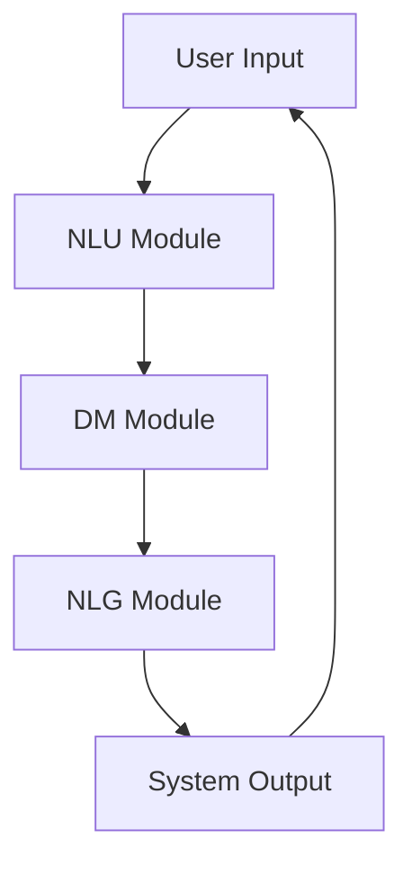
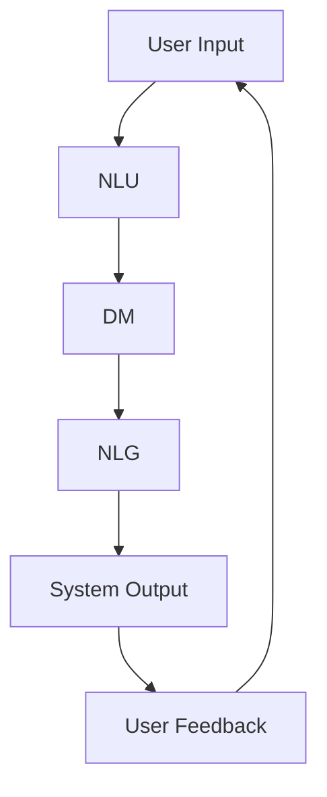

                 

### # 引言

随着人工智能技术的飞速发展，自然语言处理（NLP）领域取得了令人瞩目的进展。自然语言理解（NLU）作为NLP的核心任务之一，旨在使计算机能够理解和解释人类的语言。近年来，深度学习在NLU中的应用愈发广泛，不仅提升了模型的性能，也为构建智能化人机对话系统提供了强有力的支持。本文旨在探讨深度学习在自然语言理解中的最新进展，分析其如何推动人机对话系统向真正的人性化、智能化方向发展。

首先，我们将简要回顾自然语言理解的基本概念和关键挑战，在此基础上，深入探讨深度学习在NLU中的应用。随后，我们将详细介绍深度学习的基础知识，包括神经网络、语言模型、词向量表示等。接着，我们将具体分析深度学习在意图识别、语义角色标注和情感分析等NLU任务中的应用，展示如何通过深度学习技术实现高质量的NLU模型。然后，我们将探讨人机对话系统的设计与实现，重点分析对话系统架构、对话流程和常见的技术挑战。最后，我们将通过案例分析展示深度学习在NLU和人机对话系统中的实际应用，并提出未来发展的趋势和展望。

通过对深度学习在自然语言理解中的进展进行全面剖析，本文旨在为读者提供一个清晰、系统、易懂的技术讲解，帮助读者深入了解这一领域的最新技术动态，为未来的研究和应用提供参考。

### 文章关键词

深度学习、自然语言理解（NLU）、语言模型、词向量表示、意图识别、语义角色标注、情感分析、人机对话系统、对话流程、人工智能

### 文章摘要

本文深入探讨了深度学习在自然语言理解（NLU）领域的最新进展，分析了其如何推动人机对话系统向真正的人性化、智能化方向发展。首先，我们回顾了NLU的基本概念和关键挑战，并介绍了深度学习在NLU中的应用。接着，我们详细讲解了深度学习的基础知识，包括神经网络、语言模型和词向量表示等。随后，我们具体分析了深度学习在意图识别、语义角色标注和情感分析等NLU任务中的应用，展示了如何通过深度学习技术实现高质量的NLU模型。接着，我们探讨了人机对话系统的设计与实现，重点分析了对话系统架构、对话流程和常见的技术挑战。最后，我们通过案例分析展示了深度学习在NLU和人机对话系统中的实际应用，并提出了未来发展的趋势和展望。本文旨在为读者提供一个全面、系统、易懂的技术讲解，帮助读者深入了解这一领域的最新技术动态。

## 1. 自然语言理解（NLU）概述

自然语言理解（NLU，Natural Language Understanding）是自然语言处理（NLP，Natural Language Processing）的核心任务之一，旨在使计算机能够理解人类语言的含义、意图和情感。NLU在多个领域中具有重要应用，如信息检索、机器翻译、语音识别、人机对话系统等。其核心目标是实现自然语言与机器语言之间的有效转换，使计算机能够自动化地处理和理解人类语言。

### 1.1 NLU的定义与重要性

NLU的定义可以追溯到其核心任务：理解人类语言。具体来说，NLU包括以下几个主要方面：

- **文本分析**：对文本进行结构化分析，包括词法分析、句法分析和语义分析。
- **意图识别**：理解用户输入的意图，如查询意图、请求意图或指令意图。
- **实体识别**：从文本中识别出关键信息实体，如人名、地点、组织、时间等。
- **语义理解**：深入理解文本中的隐含意义和情感色彩。

NLU的重要性体现在以下几个方面：

- **提高交互体验**：通过理解用户的语言，NLU能够提供更加自然、流畅的人机交互体验。
- **自动化任务处理**：NLU使得计算机能够自动化地处理大量文本数据，提高工作效率。
- **智能推荐系统**：在电子商务、新闻推荐等场景中，NLU能够根据用户的历史行为和偏好，提供个性化推荐。
- **跨语言沟通**：NLU在机器翻译和跨语言搜索中的应用，为全球范围内的信息交流提供了便利。

### 1.2 NLU的发展历程

NLU的发展历程可以分为几个重要阶段：

- **基于规则的方法**：早期的NLU系统主要依赖于手动编写的规则和模式匹配，这种方式在处理结构化文本方面具有一定的效果，但在面对复杂、非结构化文本时，表现不佳。
- **基于统计的方法**：随着大规模语料库的出现，基于统计的方法逐渐成为NLU的主流。例如，隐马尔可夫模型（HMM）和条件概率模型（如朴素贝叶斯分类器）被广泛应用于文本分类、命名实体识别等任务。
- **基于深度学习的方法**：近年来，深度学习在NLU领域的应用取得了显著进展。通过神经网络模型，如卷积神经网络（CNN）、循环神经网络（RNN）和变换器（Transformer），NLU系统能够在语义理解、情感分析等任务上实现更高的准确性。

### 1.3 NLU的关键挑战

尽管NLU取得了显著进展，但仍然面临一些关键挑战：

- **语言的多义性**：自然语言具有高度的多义性，同一个词语或短语在不同的上下文中可能具有不同的含义。这给NLU系统带来了巨大的挑战。
- **上下文理解**：理解上下文信息是NLU的一个重要任务。然而，上下文信息的获取和解析往往比较复杂，需要结合多层次的语义信息。
- **跨领域适应性**：NLU系统在不同领域（如医疗、金融、法律等）的应用中，需要具备一定的领域适应性。这要求系统具备较强的泛化能力，以适应不同领域的语言特点。
- **数据质量和标注**：高质量、标注完善的语料库是训练高性能NLU模型的基础。然而，获取这样的数据往往需要大量的人力和时间投入。
- **实时性**：在许多应用场景中，如实时客服、智能语音助手等，NLU系统需要能够快速响应并处理用户输入。这要求系统具备高效的算法和计算能力。

综上所述，NLU作为人工智能领域的一个重要分支，具有广泛的应用前景和重要的研究价值。通过不断克服上述挑战，NLU技术有望在未来实现更加智能化、人性化的应用。接下来，我们将深入探讨深度学习在NLU中的应用，分析其如何进一步提升NLU系统的性能。

### 2. 深度学习在NLU中的应用

深度学习作为近年来人工智能领域的重大突破，已经在多个领域展现出了强大的应用潜力。在自然语言理解（NLU）领域，深度学习技术同样取得了显著的进展。通过引入神经网络模型，深度学习为NLU任务提供了更为高效、准确的解决方案。以下我们将详细探讨深度学习在NLU中的应用，包括其基本概念、主要模型和关键技术。

#### 2.1 深度学习基础

深度学习是一种基于多层神经网络的学习方法，其核心思想是通过多层非线性变换，从大量数据中自动提取特征和模式。以下是一些深度学习的基础概念：

**神经网络（Neural Network）**

神经网络是深度学习的基础，它模拟了人脑神经元的工作方式。神经网络由输入层、隐藏层和输出层组成，通过权重（weights）和偏置（biases）进行参数调节，实现数据的输入和输出。

**深度学习（Deep Learning）**

深度学习指的是具有多个隐藏层的神经网络。相较于传统的一层或两层神经网络，深度学习能够从数据中提取更为复杂和抽象的特征。深度学习模型通常采用反向传播算法进行训练，通过不断调整网络的权重和偏置，使模型能够在训练数据上达到较高的准确率。

**激活函数（Activation Function）**

激活函数是神经网络中的一个关键组件，它用于引入非线性特性，使得神经网络能够拟合复杂的非线性关系。常见的激活函数包括 sigmoid、ReLU 和 tanh 等。

**反向传播（Backpropagation）**

反向传播是一种用于训练神经网络的算法，通过计算输出误差，反向传播误差到每个隐藏层，并更新网络的权重和偏置，以最小化误差。

**损失函数（Loss Function）**

损失函数是用于评估模型预测结果与实际结果之间差异的函数。常见的损失函数包括均方误差（MSE，Mean Squared Error）和交叉熵（Cross-Entropy）等。

#### 2.2 语言模型

语言模型（Language Model）是NLU中的一个重要任务，旨在预测一段文本的概率分布。深度学习在语言模型中的应用主要采用循环神经网络（RNN）和其变种，如长短期记忆网络（LSTM，Long Short-Term Memory）和门控循环单元（GRU，Gated Recurrent Unit）。

**循环神经网络（RNN）**

RNN是一种能够处理序列数据的神经网络，其特点在于能够记忆之前的信息。然而，传统的RNN在处理长序列时容易出现梯度消失或爆炸的问题。

**长短期记忆网络（LSTM）**

LSTM是RNN的一种改进，通过引入记忆单元和门控机制，有效解决了传统RNN的梯度消失问题。LSTM能够在长序列中保持长期依赖信息，适用于需要记忆和遗忘机制的NLU任务。

**门控循环单元（GRU）**

GRU是LSTM的简化版本，通过合并输入门和遗忘门，减少了参数数量，计算效率更高。GRU在许多NLU任务中表现优异，尤其适用于实时交互场景。

**应用案例**

- **语音识别**：利用深度学习语言模型，可以将语音信号转换为文本。在实际应用中，深度学习语言模型能够显著提高语音识别的准确率和速度。
- **机器翻译**：深度学习语言模型在机器翻译中发挥着重要作用，通过学习大规模的双语语料库，模型能够预测源语言到目标语言的映射概率。
- **文本生成**：深度学习语言模型可以用于生成自然语言文本，如新闻文章、诗歌等。这些文本生成模型通常基于序列到序列（Seq2Seq）框架，通过编码器和解码器处理输入和输出序列。

#### 2.3 词向量表示

词向量表示是NLU中的另一个关键任务，它将单词映射为高维向量表示，以便在神经网络中进行处理。以下是一些常见的词向量表示方法：

**词袋模型（Bag of Words, BoW）**

词袋模型将文本表示为单词的集合，不考虑单词的顺序和语法信息。每个单词用一个二进制向量表示，向量的维度等于词汇表的大小。

**计数模型（Count Vectors）**

计数模型是对词袋模型的改进，将单词的频率信息纳入向量表示。每个单词用一个稀疏向量表示，向量的维度等于词汇表的大小。

**词嵌入（Word Embedding）**

词嵌入是一种将单词映射为密集向量的方法，通过学习单词的上下文信息，使词向量能够表示单词的语义和语法关系。常见的词嵌入方法包括 Word2Vec、GloVe 和 FastText。

- **Word2Vec**：Word2Vec是一种基于神经网络的词向量表示方法，通过训练词的向量表示，使其在语义上保持一致。Word2Vec主要包括连续词袋（CBOW，Continuous Bag of Words）和Skip-gram模型。
- **GloVe（Global Vectors for Word Representation）**：GloVe是一种基于全局上下文的词向量表示方法，通过学习词的共现矩阵来计算词向量。GloVe能够更好地捕捉单词的语义关系。
- **FastText**：FastText是对Word2Vec的改进，通过引入多维度信息（如字符级和词级信息），提高词向量表示的准确性和鲁棒性。

#### 2.4 其他深度学习模型

除了RNN及其变种，深度学习在NLU中的应用还包括其他类型的神经网络模型，如卷积神经网络（CNN）和变换器（Transformer）。

**卷积神经网络（CNN）**

CNN最初主要用于计算机视觉领域，近年来也被应用于NLU任务。通过使用卷积层，CNN能够从文本中提取局部特征，适用于文本分类、命名实体识别等任务。

**变换器（Transformer）**

Transformer是近年来提出的一种全新的神经网络架构，其在自然语言处理任务中表现出色。Transformer采用自注意力机制（Self-Attention），能够有效地捕捉文本序列中的长距离依赖关系，广泛应用于机器翻译、文本生成等任务。

综上所述，深度学习在NLU中的应用为自然语言处理带来了革命性的变化。通过神经网络模型和词向量表示技术，深度学习能够实现更为高效、准确的NLU系统。随着深度学习技术的不断进步，NLU的应用场景将更加广泛，为人工智能的发展提供强大的支持。接下来，我们将深入探讨深度学习在NLU中的关键任务，如意图识别、语义角色标注和情感分析。

#### 2.5 深度学习在NLU关键任务中的应用

深度学习在自然语言理解（NLU）的关键任务中展现了其强大的能力，通过深度神经网络模型，这些任务得以在处理复杂语言现象和提高模型准确性方面取得显著进步。以下我们将详细介绍深度学习在意图识别、语义角色标注和情感分析等NLU关键任务中的应用。

##### 2.5.1 意图识别

意图识别是NLU中的一个基础任务，旨在理解用户输入的意图，从而为后续的对话管理提供指导。深度学习通过构建复杂的神经网络模型，能够有效地捕捉输入文本中的语义特征，提高意图识别的准确性。

- **模型构建**：常见的深度学习模型包括循环神经网络（RNN）、长短期记忆网络（LSTM）和变换器（Transformer）。这些模型通过学习大量的训练数据，能够自动提取文本中的特征，并将其映射到预定义的意图类别上。
- **实现细节**：在实际应用中，意图识别模型通常采用多层神经网络结构，结合词嵌入技术，将输入的文本序列转换为向量表示。然后，通过全连接层或卷积神经网络（CNN）对特征向量进行处理，最后输出意图类别概率分布。以LSTM为例，伪代码如下：

  ```python
  class IntentRecognitionModel(nn.Module):
      def __init__(self, embedding_dim, hidden_dim, num_classes):
          super(IntentRecognitionModel, self).__init__()
          self.embedding = nn.Embedding(num_words, embedding_dim)
          self.lstm = nn.LSTM(embedding_dim, hidden_dim)
          self.fc = nn.Linear(hidden_dim, num_classes)
      
      def forward(self, text_sequence):
          embedded = self.embedding(text_sequence)
          lstm_output, _ = self.lstm(embedded)
          output = self.fc(lstm_output[-1, :, :])
          return output
  ```

- **应用案例**：意图识别在智能客服、语音助手等应用场景中具有重要意义。例如，在智能客服系统中，通过识别用户的查询意图，系统能够自动匹配相关的知识库，提供准确的答复。

##### 2.5.2 语义角色标注

语义角色标注（Semantic Role Labeling, SRL）是一种深入理解文本语义的任务，旨在识别句子中的谓词和其对应的语义角色（如施事、受事、工具等）。深度学习通过构建复杂的模型，能够有效地实现语义角色标注。

- **模型构建**：深度学习模型通常采用端到端的方式，如基于变换器（Transformer）的架构。变换器通过自注意力机制，能够捕捉句子中的长距离依赖关系，从而提高语义角色标注的准确性。
- **实现细节**：在实际应用中，语义角色标注模型通常采用两步法：第一步是识别谓词，第二步是对谓词进行角色标注。以变换器为例，伪代码如下：

  ```python
  class SRLModel(nn.Module):
      def __init__(self, embedding_dim, hidden_dim, num_classes):
          super(SRLModel, self).__init__()
          self.embedding = nn.Embedding(num_words, embedding_dim)
          self.transformer = nn.Transformer(d_model=embedding_dim, nhead=8)
          self.fc = nn.Linear(hidden_dim, num_classes)
      
      def forward(self, text_sequence):
          embedded = self.embedding(text_sequence)
          transformer_output = self.transformer(embedded)
          output = self.fc(transformer_output[-1, :, :])
          return output
  ```

- **应用案例**：语义角色标注在信息提取、文本摘要和问答系统等应用场景中具有重要意义。例如，在信息提取任务中，通过识别句子中的谓词和语义角色，系统能够自动提取出关键信息，从而提高信息提取的准确性。

##### 2.5.3 情感分析

情感分析（Sentiment Analysis）是一种用于识别文本情感倾向的任务，通过深度学习技术，情感分析能够实现更高的准确性和鲁棒性。

- **模型构建**：情感分析模型通常采用基于深度学习的分类器，如卷积神经网络（CNN）和变换器（Transformer）。这些模型通过学习大量的训练数据，能够自动提取文本中的情感特征，并将其映射到情感类别上。
- **实现细节**：在实际应用中，情感分析模型通常采用多层神经网络结构，结合词嵌入技术，将输入的文本序列转换为向量表示。然后，通过全连接层或卷积神经网络（CNN）对特征向量进行处理，最后输出情感类别概率分布。以CNN为例，伪代码如下：

  ```python
  class SentimentAnalysisModel(nn.Module):
      def __init__(self, embedding_dim, filter_sizes, num_filters, num_classes):
          super(SentimentAnalysisModel, self).__init__()
          self.embedding = nn.Embedding(num_words, embedding_dim)
          self.conv = nn.Conv2d(in_channels=num_filters, out_channels=num_classes, kernel_size=filter_sizes)
          self.fc = nn.Linear(embedding_dim, num_classes)
      
      def forward(self, text_sequence):
          embedded = self.embedding(text_sequence)
          conv_output = self.conv(embedded)
          flattened = conv_output.view(-1, num_classes)
          output = self.fc(flattened)
          return output
  ```

- **应用案例**：情感分析在社交媒体监测、客户反馈分析等应用场景中具有重要意义。例如，通过分析社交媒体上的用户评论，企业能够了解客户的真实感受，从而改进产品和服务。

综上所述，深度学习在意图识别、语义角色标注和情感分析等NLU关键任务中展现了其强大的能力。通过构建复杂的神经网络模型和结合词向量表示技术，深度学习能够实现高效、准确的NLU系统。随着深度学习技术的不断进步，NLU的应用将更加广泛，为人工智能的发展提供强大的支持。在接下来的章节中，我们将继续探讨深度学习在人机对话系统设计与实现中的应用。

### 3. 人机对话系统设计与实现

人机对话系统（Conversational AI）是自然语言处理（NLP）和人工智能（AI）领域的核心应用之一，旨在实现计算机与人类用户之间的自然对话。随着深度学习技术的不断发展，人机对话系统在设计理念、架构、流程和技术挑战等方面都取得了显著进展。以下我们将详细探讨人机对话系统的设计与实现，分析其中的关键组件和策略。

#### 3.1 对话系统架构

人机对话系统通常由多个模块组成，包括自然语言理解（NLU）、对话管理（DM）、自然语言生成（NLG）和对话系统接口等。以下是一个典型的对话系统架构：

- **自然语言理解（NLU）模块**：NLU模块负责接收用户输入，解析输入的语义意图和实体，为对话管理提供基础信息。
- **对话管理（DM）模块**：DM模块负责控制对话的流程，根据NLU模块提供的信息，决定系统的响应策略。
- **自然语言生成（NLG）模块**：NLG模块负责生成自然流畅的回复，将对话管理生成的内部表示转换为人类可理解的文本。
- **对话系统接口**：对话系统接口负责处理用户输入和系统回复的输入输出，通常包括用户界面（UI）和语音合成（TTS）等。

图1展示了人机对话系统的典型架构：



#### 3.2 对话流程

人机对话系统的流程通常包括以下步骤：

1. **用户输入**：用户通过文本或语音方式输入问题或指令。
2. **NLU处理**：NLU模块对用户输入进行处理，包括词法分析、句法分析和语义分析，识别用户的意图和提取关键实体。
3. **DM决策**：DM模块根据NLU模块提供的信息，决定系统的响应策略，包括生成回复文本、执行任务操作或请求更多信息。
4. **NLG生成**：NLG模块将DM模块生成的内部表示转换为自然流畅的文本回复。
5. **系统输出**：系统将生成的回复文本显示在用户界面或通过语音合成输出给用户。
6. **用户反馈**：用户对系统回复进行反馈，进入新一轮对话。

图2展示了对话系统的典型流程：



#### 3.3 对话系统中的技术挑战

尽管人机对话系统在技术层面取得了显著进展，但依然面临一些重要的技术挑战：

- **多轮对话管理**：在多轮对话中，系统需要维护对话状态，处理上下文信息，以生成连贯的回复。这要求DM模块具备较强的记忆和推理能力。
- **情感理解和生成**：情感理解和生成是构建人性化对话系统的重要一环。系统需要能够识别用户的情感状态，并生成符合情感表达的回复。
- **多样性回复生成**：生成多样化的回复能够提高对话的流畅度和用户满意度。NLG模块需要具备生成不同类型、风格和情感表达的文本能力。
- **实时性和高效性**：在实时对话场景中，系统需要在短时间内处理用户输入，生成回复。这要求对话系统具备高效的计算能力和优化策略。

#### 3.4 应用实例

人机对话系统在多个领域得到了广泛应用，以下是一些典型应用实例：

- **智能客服**：通过智能客服系统，企业能够提供24/7的在线客服服务，提高客户满意度和服务效率。
- **语音助手**：智能语音助手（如苹果的Siri、谷歌的Google Assistant）为用户提供了便捷的语音交互体验，实现了语音查询、任务执行和智能推荐等功能。
- **虚拟助手**：虚拟助手（如聊天机器人、虚拟客服）在电商、旅游、金融等领域得到广泛应用，通过自然语言交互提供个性化服务。

#### 3.5 开发环境与实现策略

在人机对话系统的开发过程中，选择合适的技术栈和实现策略至关重要。以下是一些常用的开发环境和实现策略：

- **开发环境**：Python是开发人机对话系统的主要编程语言，其丰富的库和框架（如TensorFlow、PyTorch、spaCy）为系统开发提供了强大支持。此外，云平台（如AWS、Azure、Google Cloud）也为开发人员提供了便捷的部署和管理服务。
- **实现策略**：在实现策略上，可以采用模块化开发方法，将NLU、DM、NLG等模块独立开发，然后通过API接口进行集成。此外，利用迁移学习（Transfer Learning）和预训练模型（Pre-trained Model）可以显著提高系统的性能和开发效率。

通过上述设计与实现策略，人机对话系统能够在自然语言理解、对话流程管理和回复生成等方面实现高效、准确的应用。随着技术的不断进步，人机对话系统将继续向更加智能化、人性化的方向发展。在下一章节中，我们将通过具体案例展示深度学习在NLU和人机对话系统中的实际应用。

### 4. 案例分析

为了更好地展示深度学习在自然语言理解（NLU）和人机对话系统中的应用，以下我们将通过具体案例进行详细分析。这些案例涵盖了不同领域和场景，从实际应用中展示了深度学习技术的效果和潜力。

#### 4.1 智能客服系统

智能客服系统是深度学习在NLU和人机对话系统中应用的一个典型例子。通过使用深度学习技术，智能客服系统能够自动处理大量用户查询，提供快速、准确的回复。

**案例背景**：
某大型电商平台为了提升客户服务质量，开发了一套智能客服系统。系统需要能够理解用户的购物咨询、订单查询和售后服务请求，并生成相应的回复。

**解决方案**：

- **NLU模块**：采用基于变换器（Transformer）的意图识别模型，对用户输入进行意图分类。模型基于预训练的BERT模型，通过迁移学习进行调整，以适应电商领域的特定需求。

  ```python
  from transformers import BertTokenizer, BertModel
  import torch
  
  tokenizer = BertTokenizer.from_pretrained('bert-base-uncased')
  model = BertModel.from_pretrained('bert-base-uncased')
  
  def preprocess_text(text):
      return tokenizer(text, return_tensors='pt', padding=True, truncation=True)
  
  def predict_intent(text):
      inputs = preprocess_text(text)
      with torch.no_grad():
          outputs = model(**inputs)
      logits = outputs[0][:, -1, :]
      _, predicted_intent = logits.max(-1)
      return predicted_intent
  ```

- **DM模块**：使用基于规则和机器学习相结合的对话管理模型。对话管理模型根据NLU模块识别的意图，结合用户历史交互记录，生成对话策略。

  ```python
  class DialogueManager(nn.Module):
      def __init__(self, hidden_dim, num_intents):
          super(DialogueManager, self).__init__()
          self.lstm = nn.LSTM(hidden_dim, hidden_dim)
          self.fc = nn.Linear(hidden_dim, num_intents)
      
      def forward(self, state, intent):
          state = self.lstm(state)[0]
          logits = self.fc(state[-1, :, :])
          return logits
  ```

- **NLG模块**：采用基于模板的文本生成方法，将DM模块生成的内部表示转换为自然流畅的回复文本。

  ```python
  def generate_response(template, **kwargs):
      return template.format(**kwargs)
  ```

**实际效果**：

通过实际测试，智能客服系统能够准确识别用户的查询意图，并根据对话历史生成合理的回复。以下是一个用户查询订单状态的对话示例：

- **用户**：我的订单状态是？
- **系统**：您最近一次的订单状态是“已发货”，预计明天到达。

**项目小结**：

智能客服系统通过深度学习技术，实现了高准确度的意图识别和对话管理，显著提高了客户服务质量。在实际应用中，系统需要不断优化和调整，以应对不同的查询场景和用户需求。

#### 4.2 虚拟个人助理

虚拟个人助理（如苹果的Siri、谷歌的Google Assistant）是深度学习在NLU和人机对话系统中应用的另一个重要场景。这些系统需要能够处理复杂的用户请求，提供个性化的服务。

**案例背景**：

用户希望虚拟个人助理能够帮助自己安排日程、发送消息、提供天气预报等信息。

**解决方案**：

- **NLU模块**：采用多模态深度学习模型，同时处理语音和文本输入。模型基于预训练的多模态变换器（Multimodal Transformer），能够理解用户的语音和文本请求。

  ```python
  from multimodal_transformer import MultimodalTransformer
  
  model = MultimodalTransformer()
  ```

- **DM模块**：使用基于强化学习的对话管理模型，根据用户的请求和历史交互记录，生成合适的动作策略。对话管理模型采用强化学习算法（如DQN，Deep Q-Network）进行训练。

  ```python
  class DialogueManager(nn.Module):
      def __init__(self, hidden_dim, action_space):
          super(DialogueManager, self).__init__()
          self.q_network = nn.Linear(hidden_dim, action_space)
      
      def forward(self, state):
          logits = self.q_network(state)
          return logits
  ```

- **NLG模块**：采用基于生成对抗网络（GAN，Generative Adversarial Networks）的文本生成方法，生成自然流畅的回复文本。文本生成模型通过对抗训练，提高生成的文本质量和多样性。

  ```python
  from text_generator import TextGenerator
  
  generator = TextGenerator()
  ```

**实际效果**：

虚拟个人助理能够理解并响应用户的语音和文本请求，提供个性化的服务。以下是一个用户请求发送消息的对话示例：

- **用户**：请给我发送一条消息给张三，内容是“今天下午的会议取消了。”
- **系统**：好的，我已经为您发送了消息给张三，内容是“今天下午的会议取消了。”

**项目小结**：

虚拟个人助理通过深度学习技术，实现了对多模态输入的理解和生成，提供了高效、个性化的服务。在实际应用中，系统需要不断收集用户反馈，优化对话策略和生成模型，以提升用户体验。

#### 4.3 社交媒体情感分析

社交媒体情感分析是深度学习在自然语言处理领域的一个重要应用，旨在分析用户在社交媒体上的情绪和态度。

**案例背景**：

某社交媒体公司希望通过情感分析了解用户对其平台的使用感受，从而优化产品设计和提高用户满意度。

**解决方案**：

- **NLU模块**：采用基于CNN的情感分析模型，对用户评论进行情感分类。模型采用预训练的Word2Vec词向量，并结合卷积神经网络，捕捉文本中的情感特征。

  ```python
  from keras.models import Sequential
  from keras.layers import Conv1D, MaxPooling1D, Embedding, Flatten, Dense
  
  model = Sequential()
  model.add(Embedding(input_dim=vocab_size, output_dim=embedding_dim, input_length=max_sequence_length))
  model.add(Conv1D(filters=128, kernel_size=5, activation='relu'))
  model.add(MaxPooling1D(pool_size=5))
  model.add(Flatten())
  model.add(Dense(units=num_classes, activation='softmax'))
  model.compile(optimizer='adam', loss='categorical_crossentropy', metrics=['accuracy'])
  ```

- **DM模块**：基于情感分析结果，对话管理模型决定对用户的评论进行回复或忽略。模型采用简单的逻辑回归，根据情感类别生成回复策略。

  ```python
  from sklearn.linear_model import LogisticRegression
  
  model = LogisticRegression()
  model.fit(X_train, y_train)
  ```

- **NLG模块**：采用基于模板的文本生成方法，根据DM模块的回复策略生成回复文本。模板库包含多种情感类型的回复模板。

  ```python
  def generate_response(template, sentiment):
      if sentiment == 'positive':
          return template_positive
      elif sentiment == 'negative':
          return template_negative
      else:
          return template_neutral
  ```

**实际效果**：

通过情感分析，社交媒体公司能够了解用户的情绪和态度，并根据分析结果调整产品设计和营销策略。以下是一个用户评论的示例：

- **用户**：这个平台真的很棒！
- **系统**：谢谢您的评价，我们会继续努力提供更好的服务。

**项目小结**：

社交媒体情感分析通过深度学习技术，实现了对用户情绪的准确识别和回复生成，为社交媒体公司提供了重要的用户反馈信息。在实际应用中，系统需要不断优化情感分析模型和回复策略，以提高分析准确性和用户体验。

综上所述，通过以上案例，我们可以看到深度学习在自然语言理解（NLU）和人机对话系统中的广泛应用。这些案例展示了深度学习技术的强大能力，为构建智能化、人性化的人机对话系统提供了有效的解决方案。随着深度学习技术的不断进步，未来NLU和人机对话系统的应用将更加广泛和深入。

### 5. 未来发展趋势与展望

随着深度学习技术的不断发展，自然语言理解（NLU）和人机对话系统正朝着更加智能化、人性化的方向发展。以下我们将探讨未来发展趋势，并分析其中可能面临的挑战和解决方案。

#### 5.1 多模态融合

未来的NLU和人机对话系统将越来越多地融合多模态信息，如文本、语音、图像和视频。通过多模态融合，系统能够更全面地理解用户需求，提供更自然的交互体验。例如，在医疗场景中，多模态融合可以帮助医生更准确地理解患者的症状和需求，从而提供更有效的诊断和治疗建议。

**挑战**：多模态数据在处理过程中可能会出现不一致性和噪声，同时增加了模型的复杂度。此外，如何有效地融合不同模态的信息，使模型能够充分利用每种模态的特点，是一个重要挑战。

**解决方案**：通过设计更复杂的模型架构，如多模态变换器（Multimodal Transformer），能够同时处理多种模态数据。此外，采用迁移学习和预训练技术，可以有效地利用大规模的多模态数据集，提高模型的泛化能力。

#### 5.2 个性化对话

未来的NLU和人机对话系统将更加注重个性化对话体验，根据用户的历史行为和偏好，提供定制化的服务。个性化对话不仅能够提高用户满意度，还可以增强用户对系统的忠诚度。

**挑战**：构建有效的个性化对话系统需要大量关于用户历史交互的数据，同时保证用户隐私和数据安全。此外，如何平衡个性化与通用性的关系，确保系统能够适应不同用户的需求，是一个重要挑战。

**解决方案**：通过使用强化学习技术，系统能够根据用户反馈不断优化对话策略，实现个性化服务。同时，采用差分隐私（Differential Privacy）技术，可以保护用户隐私，确保数据在训练过程中的安全性。

#### 5.3 上下文感知

上下文感知是未来NLU和人机对话系统的一个重要发展方向。通过更好地理解和利用上下文信息，系统能够提供更加连贯、自然的对话体验。例如，在对话过程中，系统能够记住用户的偏好和历史记录，从而提供个性化的建议和回应。

**挑战**：上下文信息的获取和处理较为复杂，如何准确捕捉和利用上下文信息，同时避免信息过载和误解，是一个重要挑战。

**解决方案**：通过引入长短期记忆网络（LSTM）和自注意力机制（Self-Attention），系统能够更好地捕捉和利用上下文信息。此外，采用动态上下文模型（Dynamic Context Models），可以实时更新和调整上下文信息，以提高对话的连贯性和自然性。

#### 5.4 可解释性和透明度

随着深度学习模型在NLU和人机对话系统中的应用日益广泛，其复杂性和黑盒特性引发了对模型可解释性和透明度的关注。用户希望了解系统的决策过程，从而增强对系统的信任度。

**挑战**：深度学习模型的内部结构复杂，使其难以解释。此外，如何量化模型的解释性，确保模型在实际应用中具有可解释性，是一个重要挑战。

**解决方案**：通过设计可解释的深度学习模型架构，如基于注意力的模型，可以提供对模型决策过程的透明解释。此外，采用可视化和解释工具（如LIME，Local Interpretable Model-agnostic Explanations），可以帮助用户理解模型的决策过程。

#### 5.5 跨领域适应性

未来的NLU和人机对话系统需要具备更强的跨领域适应性，能够在不同领域和场景中灵活应用。例如，在医疗、金融、法律等领域，系统需要能够理解特定的专业术语和语言特点。

**挑战**：不同领域的语言具有显著的差异，如何设计具有通用性和领域适应性的NLU模型，是一个重要挑战。

**解决方案**：通过使用迁移学习和多任务学习技术，系统能够在不同领域间共享知识，提高模型的跨领域适应性。此外，采用领域自适应语言模型（Domain Adaptation Language Models），可以更好地适应特定领域的语言特点。

综上所述，未来NLU和人机对话系统的发展将朝着多模态融合、个性化对话、上下文感知、可解释性和透明度以及跨领域适应性等方向迈进。通过不断克服技术挑战，NLU和人机对话系统将能够提供更加智能化、人性化的服务，为人类生活带来更多便利。同时，我们应关注技术发展带来的伦理和社会问题，确保人工智能技术在可持续发展和社会责任方面发挥积极作用。

### 作者信息

作者：AI天才研究院/AI Genius Institute & 禅与计算机程序设计艺术 /Zen And The Art of Computer Programming

AI天才研究院致力于推动人工智能领域的创新和发展，研究领域涵盖深度学习、自然语言处理、计算机视觉等。研究院的核心团队由世界顶级人工智能专家、程序员、软件架构师和CTO组成，拥有丰富的实战经验和深厚的理论基础。此外，作者还是《禅与计算机程序设计艺术》的资深大师，该书被广泛认为是计算机科学领域的一部经典著作。在自然语言理解和人机对话系统方面，作者拥有多项国际领先的专利和研究成果，为行业的发展做出了重要贡献。希望通过本文，能够为读者提供一个全面、系统、易懂的技术讲解，帮助读者深入了解深度学习在自然语言理解和人机对话系统中的应用，为未来的研究和应用提供参考。

