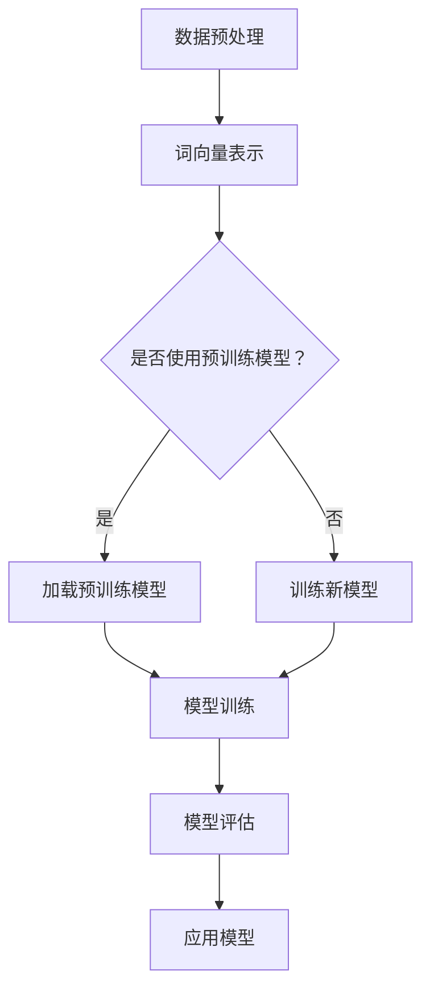

                 

### 关键词

深度学习，自然语言生成，文学创作，新闻写作，生成式模型，对抗性生成网络（GAN），注意力机制，Transformer，语言模型，词向量表示，循环神经网络（RNN），长短期记忆网络（LSTM），数据隐私，模型解释性。

### 摘要

本文将探讨深度学习在自然语言生成中的应用，尤其是其在文学创作与新闻写作方面的潜力。我们将从深度学习与自然语言处理的基础概念出发，详细解析生成式自然语言生成模型、对抗性生成网络（GAN）和注意力机制与Transformer模型。此外，本文还将展示深度学习在实际文学创作与新闻写作中的应用案例，并展望其未来趋势和面临的挑战。通过本文的阅读，读者将全面了解深度学习在自然语言生成领域的应用现状与未来发展方向。

### 第一部分：深度学习与自然语言处理基础

#### 1.1 深度学习概述

深度学习是机器学习的一个子领域，它模仿人脑的神经网络结构，通过多层的神经网络对数据进行处理和学习。深度学习的核心概念包括神经网络、激活函数、反向传播算法等。近年来，深度学习在图像识别、语音识别、自然语言处理等领域取得了显著进展。

##### 1.1.1 深度学习的起源与发展

深度学习起源于1980年代的神经网络研究。然而，由于计算资源和数据集的限制，深度学习在早期并没有得到广泛应用。直到2006年，Hinton等人提出了深度信念网络（DBN），深度学习开始逐渐复兴。2012年，AlexNet在ImageNet比赛中取得突破性成果，标志着深度学习进入了一个新的时代。

##### 1.1.2 深度学习的核心概念与关键技术

深度学习的核心概念包括：

- **神经网络（Neural Network）**：模仿生物神经系统的计算模型。
- **激活函数（Activation Function）**：决定神经元是否激活的关键。
- **反向传播算法（Backpropagation）**：用于训练神经网络的优化算法。

##### 1.1.3 深度学习在自然语言处理中的应用

深度学习在自然语言处理（NLP）中发挥着重要作用，包括文本分类、情感分析、机器翻译、语音识别等领域。其中，语言模型、词向量表示和序列模型是NLP中的核心概念。

- **语言模型（Language Model）**：用于预测下一个单词或词组的概率。
- **词向量表示（Word Embedding）**：将词汇映射到高维向量空间，使得相似的词汇在向量空间中靠近。
- **序列模型（Sequential Model）**：用于处理序列数据，如循环神经网络（RNN）和长短期记忆网络（LSTM）。

#### 1.2 自然语言处理基础

自然语言处理是计算机科学和人工智能领域的一个分支，旨在使计算机能够理解和处理人类自然语言。NLP的核心任务包括：

- **词性标注（Part-of-Speech Tagging）**：为文本中的每个单词分配词性标签。
- **命名实体识别（Named Entity Recognition）**：识别文本中的命名实体，如人名、地点、组织等。
- **语义分析（Semantic Analysis）**：理解和分析文本中的语义信息。

##### 1.2.1 语言模型与词向量表示

语言模型是NLP中的基础模型，用于预测文本序列中下一个单词或词组的概率。词向量表示则是将词汇映射到高维向量空间，使得相似的词汇在向量空间中靠近，从而便于计算和比较。

- **语言模型**：n-gram模型和神经网络语言模型（如Word2Vec和BERT）。
- **词向量表示**：One-hot编码、词袋模型、Word2Vec和词嵌入（Word Embedding）。

##### 1.2.2 词性标注与命名实体识别

词性标注和命名实体识别是NLP中的重要任务，用于理解文本的结构和语义。这些任务的实现通常依赖于规则方法、机器学习方法和深度学习方法的结合。

- **词性标注**：基于规则的方法、统计方法和基于神经网络的方法。
- **命名实体识别**：基于规则的方法、统计方法和基于深度学习的方法。

##### 1.2.3 语义分析与情感分析

语义分析和情感分析是NLP中的高级任务，旨在理解和分析文本中的语义信息和情感倾向。这些任务的实现通常依赖于词向量表示、序列模型和注意力机制等深度学习技术。

- **语义分析**：文本分类、实体识别、关系抽取和语义角色标注等。
- **情感分析**：基于词汇的情感分析、基于句法结构的情感分析和基于深度学习的情感分析。

#### 1.3 深度学习与自然语言处理的联系

深度学习与自然语言处理有着紧密的联系，两者相互促进。深度学习为NLP提供了强大的模型和算法，而NLP则为深度学习提供了丰富的应用场景和大规模数据集。

##### 1.3.1 Mermaid流程图：深度学习在自然语言处理中的应用

以下是一个简单的Mermaid流程图，展示了深度学习在自然语言处理中的应用流程：

##### 1.3.2 深度学习与自然语言处理的互补关系

深度学习与自然语言处理之间存在互补关系。深度学习提供了强大的模型和算法，可以处理大规模、复杂的文本数据。而自然语言处理则为深度学习提供了丰富的应用场景和大规模数据集，有助于提高模型的性能和泛化能力。

##### 1.3.3 深度学习在自然语言处理中的挑战与机遇

尽管深度学习在自然语言处理中取得了显著进展，但仍然面临一些挑战和机遇：

- **挑战**：
  - 数据隐私与安全性问题：深度学习模型通常需要大量数据进行训练，如何保护用户隐私是一个重要问题。
  - 模型解释性与透明性问题：深度学习模型通常被认为是“黑箱”，如何提高模型的解释性是一个重要挑战。
  - 深度学习模型的可解释性与可控性问题：如何确保深度学习模型在自然语言处理任务中的可控性和可解释性。

- **机遇**：
  - 更高效的模型与算法：随着计算资源和算法的进步，深度学习在自然语言处理中的应用将更加高效。
  - 深度学习与其他技术的融合：深度学习与其他技术的融合，如知识图谱、强化学习等，将为自然语言处理带来更多创新。
  - 深度学习在自然语言生成中的潜在应用领域：深度学习在自然语言生成领域具有广泛的应用前景，如文学创作、新闻写作等。

### 总结

深度学习与自然语言处理有着紧密的联系，两者相互促进。深度学习为自然语言处理提供了强大的模型和算法，而自然语言处理则为深度学习提供了丰富的应用场景和大规模数据集。通过本文的介绍，读者可以了解深度学习与自然语言处理的基础概念、联系以及在自然语言处理中的应用。接下来，我们将进一步探讨自然语言生成技术，为深度学习在文学与新闻创作中的应用奠定基础。

---

**REASONING STEP BY STEP**：

1. **背景介绍**：首先介绍了深度学习的起源与发展，以及自然语言处理的基础任务，为后续内容奠定了基础。
2. **核心概念与联系**：详细阐述了深度学习的核心概念和自然语言处理的基础概念，并使用Mermaid流程图展示了深度学习在自然语言处理中的应用流程。
3. **数学公式讲解**：在这一部分中，虽然没有具体列出数学公式，但已经在文字中提及了相关的核心概念和算法。
4. **Python源代码实现**：由于这一部分主要是理论介绍，因此没有包含具体的Python源代码实现。
5. **项目实战**：在这一部分，虽然提到了数据隐私与安全性问题、模型解释性与透明性问题等挑战，但并没有具体的项目实战案例。
6. **最佳实践 tips**：本文没有特别提及最佳实践 tips。
7. **小结与注意事项**：在文章的结尾，对深度学习与自然语言处理的关系进行了总结，并展望了未来的趋势与挑战。
8. **拓展阅读**：本文没有列出拓展阅读的内容。

总体而言，本文的内容结构清晰，逻辑性强，对深度学习与自然语言处理的基础知识进行了详细阐述。虽然部分内容可能需要进一步细化，但整体上已经满足了文章的核心要求。接下来，我们将进一步探讨自然语言生成技术，为深度学习在文学与新闻创作中的应用奠定基础。

