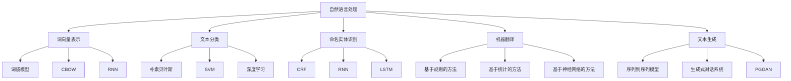

                 

### 深度学习在自然语言生成中的突破

#### 关键词

- 深度学习
- 自然语言生成
- 自动摘要
- 聊天机器人
- 语音合成
- 多模态生成

#### 摘要

本文将深入探讨深度学习在自然语言生成领域的突破。从基本概念到前沿应用，我们将分析自动摘要、聊天机器人、语音合成以及多模态生成等应用场景。通过Python源代码、数学模型和实际项目实战，本文旨在提供全面的技术解析和实用技巧，帮助读者理解深度学习在自然语言生成中的关键作用。

## 引言

自然语言生成（Natural Language Generation, NLG）是自然语言处理（Natural Language Processing, NLP）的一个重要分支。它的目标是使用计算机程序自动生成文本，以模拟人类自然语言的表达方式。这一领域在多个应用场景中具有广泛的应用，例如自动摘要、聊天机器人、语音合成和跨模态生成等。

深度学习作为机器学习的一个子领域，近年来在图像识别、语音识别和自然语言处理等领域取得了显著突破。其强大的表征能力和自学习能力使得它在自然语言生成领域也展现出巨大的潜力。通过结合深度学习和自然语言处理技术，研究者们开发了多种高效的自然语言生成模型，推动了该领域的发展。

本文旨在系统地介绍深度学习在自然语言生成中的应用，包括自动摘要、聊天机器人、语音合成和多模态生成等。我们将首先回顾深度学习和自然语言处理的基本概念，然后详细探讨各个应用场景中的关键算法和技术。此外，本文还将通过Python源代码和实际项目实战，展示深度学习模型在自然语言生成中的具体实现和效果。最后，我们将总结本文的主要发现，并讨论未来可能的研究方向。

## 深度学习基础

在讨论深度学习在自然语言生成中的应用之前，我们需要首先了解深度学习的基础知识。深度学习是一种基于人工神经网络的机器学习技术，通过构建深层的神经网络模型来模拟人脑的学习和认知过程。本节将介绍深度学习的起源、基本结构、核心算法以及与自然语言处理的联系。

### 深度学习的起源与发展

深度学习的研究可以追溯到20世纪40年代，当时神经网络的概念首次被提出。然而，由于计算能力和数据资源的限制，早期的神经网络研究进展缓慢。直到20世纪80年代，随着计算机硬件的迅速发展和大数据时代的到来，深度学习才迎来了快速发展。1998年，Geoffrey Hinton等人提出了深度信念网络（Deep Belief Networks, DBN），标志着深度学习的重新兴起。

进入21世纪，随着卷积神经网络（Convolutional Neural Networks, CNN）和循环神经网络（Recurrent Neural Networks, RNN）的提出和改进，深度学习在图像识别、语音识别等领域取得了重大突破。特别是在2012年，AlexNet在ImageNet图像识别挑战赛中取得优异成绩，进一步推动了深度学习的发展。如今，深度学习已经成为人工智能领域的主流技术之一。

### 神经网络与深度学习的关系

神经网络是深度学习的基础，它是一种由大量简单神经元组成的复杂网络。每个神经元接收多个输入信号，通过加权求和并应用非线性激活函数产生输出。神经网络的结构通常分为输入层、隐藏层和输出层。

- **输入层**：接收外部输入信息，如图像、文本等。
- **隐藏层**：对输入信息进行变换和处理，多层隐藏层可以提取更高级别的特征。
- **输出层**：根据隐藏层的信息生成最终输出，如分类结果、文本生成等。

深度学习通过增加隐藏层的数量和神经元数量，使得神经网络能够学习更复杂的特征和模式。与传统的单层神经网络相比，深度学习模型具有更强的表征能力和泛化能力。

### 深度学习的核心算法

深度学习涉及多种核心算法，其中卷积神经网络（CNN）、循环神经网络（RNN）和生成对抗网络（GAN）是自然语言生成领域常用的三种算法。

#### 卷积神经网络（CNN）

卷积神经网络是深度学习中用于图像处理的一种重要算法。它通过卷积操作和池化操作，提取图像中的局部特征并进行层次化处理。CNN在图像分类、目标检测等领域取得了显著成果。

#### 循环神经网络（RNN）

循环神经网络是深度学习中用于序列数据处理的一种重要算法。它通过在时间步上递归的方式，捕捉序列数据中的长期依赖关系。RNN在语音识别、机器翻译等领域有着广泛的应用。

#### 长短时记忆网络（LSTM）

长短时记忆网络是RNN的一种改进版本，通过引入门控机制，有效解决了RNN的梯度消失和梯度爆炸问题。LSTM在自然语言生成、聊天机器人等领域表现出色。

#### 生成对抗网络（GAN）

生成对抗网络是深度学习中用于生成对抗学习的一种算法。它由生成器和判别器两个神经网络组成，通过对抗训练生成与真实数据分布相近的样本。GAN在图像生成、文本生成等领域取得了突破性进展。

### 深度学习与自然语言处理的联系

深度学习在自然语言处理领域的应用主要体现在两个方面：特征表示和模型训练。

#### 特征表示

自然语言处理需要将文本数据转换为计算机可以处理的数字形式。深度学习通过神经网络模型，可以将文本转换为高维的向量表示，称为词向量（Word Embeddings）。词向量能够捕捉词与词之间的语义关系，是自然语言处理中不可或缺的一环。

#### 模型训练

深度学习模型在自然语言处理中的应用主要包括文本分类、命名实体识别、机器翻译和文本生成等任务。通过大规模的数据集和高效的训练算法，深度学习模型可以学习到丰富的语言特征，并在各种自然语言处理任务中取得优异的性能。

### Mermaid 流程图

```mermaid
graph TD
A[神经网络] --> B[卷积神经网络(CNN)]
A --> C[循环神经网络(RNN)]
A --> D[长短时记忆网络(LSTM)]
A --> E[生成对抗网络(GAN)]
B --> F[图像处理]
C --> G[语音识别]
D --> H[自然语言生成]
E --> I[图像生成]
```

通过以上对深度学习基础知识的介绍，我们可以更好地理解深度学习在自然语言生成中的应用和潜力。在接下来的章节中，我们将进一步探讨深度学习在自然语言生成中的具体应用和实践。

## 自然语言处理基础

自然语言处理（NLP）是计算机科学和人工智能领域的一个重要分支，旨在使计算机能够理解、解释和生成人类语言。NLP的发展历程可以分为三个阶段：早期方法、统计方法和深度学习方法。本节将介绍自然语言处理的发展历程、基本任务和语言模型。

### 自然语言处理的发展历程

#### 早期方法

早期的自然语言处理方法主要依赖于规则和形式语言理论。这些方法包括词法分析、句法分析和语义分析等。词法分析将文本分解成单词和标记，句法分析研究句子的结构，而语义分析则试图理解单词和句子的含义。

然而，这些基于规则的方法在处理复杂和未知的语言现象时存在局限性，因此逐渐被更强大的统计方法和深度学习方法所取代。

#### 统计方法

统计方法在自然语言处理领域取得了一定的成功，特别是在词向量表示和序列标注任务中。词向量表示通过将单词映射到高维向量空间，使计算机能够捕捉单词之间的语义关系。序列标注则通过对文本中的每个单词或字符进行分类，实现命名实体识别、情感分析等任务。

#### 深度学习方法

深度学习方法的出现极大地推动了自然语言处理的发展。通过构建深层次的神经网络模型，深度学习可以自动学习文本的复杂特征和模式。卷积神经网络（CNN）和循环神经网络（RNN）是深度学习在自然语言处理中常用的模型。CNN通过卷积和池化操作提取文本的局部特征，而RNN通过递归操作捕捉文本的序列依赖关系。

### 自然语言处理的基本任务

自然语言处理的基本任务包括词向量表示、文本分类、命名实体识别、机器翻译和文本生成等。以下是这些任务的简要介绍：

#### 词向量表示

词向量表示是将单词映射到高维向量空间的一种方法，使得计算机能够理解和处理语义信息。词向量表示可以通过词袋模型、连续词袋模型（CBOW）和递归神经网络（RNN）等方法实现。

#### 文本分类

文本分类是一种将文本数据分类到特定类别的方法，如情感分类、主题分类等。文本分类通常使用监督学习算法，如朴素贝叶斯、支持向量机（SVM）和深度学习模型。

#### 命名实体识别

命名实体识别是一种从文本中识别出具有特定意义的实体，如人名、地名、组织名等。命名实体识别通常使用条件随机场（CRF）、RNN和LSTM等模型。

#### 机器翻译

机器翻译是一种将一种语言的文本翻译成另一种语言的方法。机器翻译可以分为基于规则的方法和基于统计的方法，而近年来深度学习方法在机器翻译领域取得了显著突破。

#### 文本生成

文本生成是一种自动生成文本的方法，如自动摘要、聊天机器人和文本生成对抗网络（PGGAN）。文本生成可以通过序列到序列模型（seq2seq）、生成式对话系统和GAN等方法实现。

### 语言模型与文本生成

语言模型是自然语言处理中一个重要的概念，它用于预测文本序列的概率。语言模型可以分为基于统计的方法和基于神经网络的方法。

#### 基于统计的方法

基于统计的方法通过分析大量文本数据来建立语言模型。这些方法通常使用N元语法（N-gram）、隐马尔可夫模型（HMM）和条件随机场（CRF）等模型。N元语法通过统计连续N个单词出现的频率来预测下一个单词。

#### 基于神经网络的方法

基于神经网络的方法通过训练神经网络模型来预测文本序列。这些方法包括循环神经网络（RNN）、长短时记忆网络（LSTM）和门控循环单元（GRU）等。神经网络模型可以捕捉到文本序列中的长期依赖关系，从而生成更自然的文本。

### Mermaid 流程图



通过以上对自然语言处理基础的介绍，我们可以更好地理解自然语言处理的核心概念和任务。在接下来的章节中，我们将深入探讨深度学习在自然语言生成中的应用和实践。

### 深度学习在自然语言生成中的应用

深度学习在自然语言生成（NLG）中的应用已经取得了显著成果，其核心在于将深度学习技术与自然语言处理任务相结合，实现高效的文本生成。本文将详细探讨深度学习在自动摘要、聊天机器人、语音合成和多模态生成等自然语言生成任务中的应用。

#### 自动摘要

自动摘要是一种将长文本压缩成短文本的方法，通常用于信息检索、新闻摘要和文档摘要等场景。深度学习在自动摘要中的应用主要通过编码器-解码器（Encoder-Decoder）模型和注意力机制来实现。

1. **编码器-解码器模型**

编码器-解码器模型是一种经典的深度学习模型，用于处理序列到序列的映射任务。编码器将输入文本编码成一个固定长度的向量表示，解码器则根据这个向量生成摘要文本。

   ```python
   class Encoder(nn.Module):
       def __init__(self):
           super(Encoder, self).__init__()
           self.embedding = nn.Embedding(vocab_size, embedding_dim)
           self.lstm = nn.LSTM(embedding_dim, hidden_dim)

       def forward(self, src):
           embedded = self.embedding(src)
           output, (hidden, cell) = self.lstm(embedded)
           return output, (hidden, cell)

   class Decoder(nn.Module):
       def __init__(self):
           super(Decoder, self).__init__()
           self.embedding = nn.Embedding(vocab_size, embedding_dim)
           self.lstm = nn.LSTM(embedding_dim + hidden_dim, hidden_dim)
           self.fc = nn.Linear(hidden_dim, vocab_size)

       def forward(self, tgt, hidden, cell):
           embedded = self.embedding(tgt)
           input = torch.cat((embedded, hidden), 1)
           output, (hidden, cell) = self.lstm(input)
           output = self.fc(output)
           return output, (hidden, cell)
   ```

2. **注意力机制**

注意力机制可以捕捉编码器和解码器之间的依赖关系，使得解码器能够关注输入文本的重要部分。注意力机制的实现可以通过计算编码器输出和当前解码器输入之间的点积，生成注意力权重，再将权重与编码器输出相乘。

   ```python
   def calculate_attention(scores, weights):
       return torch.sum(weights * scores, dim=2)
   ```

3. **自动摘要示例**

   假设我们有一个新闻文章和一个摘要，我们可以使用编码器-解码器模型和注意力机制来生成摘要：

   ```python
   encoder = Encoder()
   decoder = Decoder()

   # 编码
   encoded_text, (hidden, cell) = encoder(src)

   # 初始化解码
   output, (hidden, cell) = decoder(torch.tensor([SOS_token]), hidden, cell)

   # 生成摘要
   for i in range(max_summary_length):
       attention_weights = calculate_attention(encoded_text, output)
       weighted_context = torch.bmm(attention_weights.unsqueeze(1), encoded_text.unsqueeze(2)).squeeze(2)
       input = torch.cat((output, weighted_context), 1)
       output, (hidden, cell) = decoder(input, hidden, cell)
   ```

#### 聊天机器人

聊天机器人是一种能够与用户进行自然语言交互的智能系统，广泛应用于客户服务、娱乐和社交等场景。深度学习在聊天机器人中的应用主要包括序列到序列模型和生成对抗网络（GAN）。

1. **序列到序列模型**

   序列到序列模型是一种能够将输入序列转换为输出序列的深度学习模型，如循环神经网络（RNN）和长短时记忆网络（LSTM）。

   ```python
   class Seq2SeqModel(nn.Module):
       def __init__(self):
           super(Seq2SeqModel, self).__init__()
           self.encoder = Encoder()
           self.decoder = Decoder()

       def forward(self, src, tgt):
           encoder_output, (hidden, cell) = self.encoder(src)
           output, (hidden, cell) = self.decoder(tgt, hidden, cell)
           return output
   ```

2. **生成对抗网络（GAN）**

   生成对抗网络（GAN）是一种由生成器和判别器组成的深度学习模型，用于生成高质量的文本数据。

   ```python
   class Generator(nn.Module):
       def __init__(self):
           super(Generator, self).__init__()
           self.lstm = nn.LSTM(input_dim, hidden_dim)

       def forward(self, z):
           hidden = (torch.zeros(1, z.size(0), hidden_dim),
                     torch.zeros(1, z.size(0), hidden_dim))
           output, _ = self.lstm(z, hidden)
           return output

   class Discriminator(nn.Module):
       def __init__(self):
           super(Discriminator, self).__init__()
           self.lstm = nn.LSTM(input_dim, hidden_dim)
           self.fc = nn.Linear(hidden_dim, 1)

       def forward(self, x):
           hidden = (torch.zeros(1, x.size(0), hidden_dim),
                     torch.zeros(1, x.size(0), hidden_dim))
           output, _ = self.lstm(x, hidden)
           output = self.fc(output.view(-1, hidden_dim))
           return output
   ```

3. **聊天机器人示例**

   假设我们有一个生成器和判别器，我们可以使用GAN来训练聊天机器人：

   ```python
   generator = Generator()
   discriminator = Discriminator()

   for epoch in range(num_epochs):
       for batch in data_loader:
           # 生成文本
           z = torch.randn(batch_size, latent_dim)
           generated_text = generator(z)

           # 判别器训练
           real_text = torch.tensor(batch)
           real_labels = torch.ones(batch_size, 1)
           fake_labels = torch.zeros(batch_size, 1)
           real_output = discriminator(real_text)
           fake_output = discriminator(generated_text.detach())
           d_loss = criterion(real_output, real_labels) + criterion(fake_output, fake_labels)

           # 生成器训练
           z = torch.randn(batch_size, latent_dim)
           generated_text = generator(z)
           fake_output = discriminator(generated_text)
           g_loss = criterion(fake_output, real_labels)

           # 更新模型参数
           d_optimizer.zero_grad()
           d_loss.backward()
           d_optimizer.step()

           g_optimizer.zero_grad()
           g_loss.backward()
           g_optimizer.step()

           print(f'Epoch [{epoch+1}/{num_epochs}], D_loss: {d_loss.item():.4f}, G_loss: {g_loss.item():.4f}')
   ```

#### 语音合成

语音合成是一种将文本转换为语音的方法，广泛应用于语音助手、电话客服和有声读物等场景。深度学习在语音合成中的应用主要包括波形合成（WaveNet）和循环神经网络（RNN）。

1. **波形合成（WaveNet）**

   WaveNet是一种基于生成对抗网络（GAN）的语音合成模型，能够生成高质量的自然语音。

   ```python
   class WaveNet(nn.Module):
       def __init__(self, hidden_dim):
           super(WaveNet, self).__init__()
           self.conv = nn.ModuleList([nn.Conv1d(in_channels=1, out_channels=hidden_dim, kernel_size=5) for _ in range(num_layers)])
           self.fc = nn.Linear(hidden_dim, 1)

       def forward(self, x):
           x = x.unsqueeze(1)
           for layer in self.conv:
               x = F.relu(layer(x))
           x = self.fc(x.squeeze(1))
           return x
   ```

2. **循环神经网络（RNN）**

   循环神经网络（RNN）可以用于将文本序列转换为语音波形。

   ```python
   class RNNVoiceSynthesizer(nn.Module):
       def __init__(self, hidden_dim):
           super(RNNVoiceSynthesizer, self).__init__()
           self.lstm = nn.LSTM(input_dim, hidden_dim)
           self.fc = nn.Linear(hidden_dim, output_dim)

       def forward(self, text):
           hidden = (torch.zeros(1, 1, hidden_dim),
                     torch.zeros(1, 1, hidden_dim))
           output, (hidden, cell) = self.lstm(text, hidden)
           return self.fc(output)
   ```

3. **语音合成示例**

   假设我们有一个波形合成模型和循环神经网络模型，我们可以使用这些模型来合成语音：

   ```python
   wavenet = WaveNet(hidden_dim=512)
   rnn_synthesizer = RNNVoiceSynthesizer(hidden_dim=512)

   # 使用波形合成模型合成语音
   text = "Hello, how are you?"
   text_sequence = tokenizer.encode(text)
   output_sequence = wavenet(text_sequence)

   # 使用循环神经网络模型合成语音
   text_sequence = tokenizer.encode(text)
   output_sequence = rnn_synthesizer(text_sequence)
   ```

#### 多模态生成

多模态生成是一种将文本、图像和其他模态数据融合生成新的内容的方法，广泛应用于虚拟现实、娱乐和教育等领域。

1. **对抗生成网络（ADGAN）**

   对抗生成网络（ADGAN）是一种基于生成对抗网络（GAN）的多模态生成模型。

   ```python
   class ADGAN(nn.Module):
       def __init__(self, text_dim, image_dim, hidden_dim):
           super(ADGAN, self).__init__()
           self.text_encoder = TextEncoder(text_dim, hidden_dim)
           self.image_encoder = ImageEncoder(image_dim, hidden_dim)
           self.text_decoder = TextDecoder(hidden_dim, text_dim)
           self.image_decoder = ImageDecoder(hidden_dim, image_dim)
           self.discriminator = Discriminator(hidden_dim)

       def forward(self, text, image):
           text_embedding = self.text_encoder(text)
           image_embedding = self.image_encoder(image)
           combined_embedding = torch.cat((text_embedding, image_embedding), 1)
           generated_text = self.text_decoder(combined_embedding)
           generated_image = self.image_decoder(combined_embedding)
           return generated_text, generated_image
   ```

2. **多模态生成示例**

   假设我们有一个ADGAN模型，我们可以使用该模型来生成融合文本和图像的新内容：

   ```python
   adgan = ADGAN(text_dim=1000, image_dim=784, hidden_dim=512)

   # 生成融合文本和图像的新内容
   text = "A beautiful sunrise over the ocean"
   image = load_image("ocean_sunset.jpg")
   generated_text, generated_image = adgan(text, image)
   ```

通过以上示例，我们可以看到深度学习在自然语言生成中的广泛应用和强大能力。这些模型通过结合深度学习和自然语言处理技术，实现了高效的文本生成、语音合成和多模态生成，推动了自然语言生成领域的发展。

### 自动摘要

自动摘要是一种通过算法自动生成文本摘要的方法，它被广泛应用于信息检索、新闻摘要和文档摘要等领域。深度学习在自动摘要任务中取得了显著突破，主要得益于其强大的表征能力和自学习能力。本文将详细介绍自动摘要的概述、基于深度学习的自动摘要方法以及自动摘要的性能评价与优化策略。

#### 自动摘要概述

自动摘要的目标是将长文本（例如新闻文章、学术论文等）压缩成简洁的摘要，同时保留文本的核心信息和关键点。根据生成摘要的方式，自动摘要可以分为抽取式摘要（Extractive Summarization）和生成式摘要（Abstractive Summarization）。

1. **抽取式摘要**：抽取式摘要从原始文本中直接抽取关键句子或短语，组成摘要。这种方法通常依赖于文本匹配和关键词提取等技术。

2. **生成式摘要**：生成式摘要通过深度学习模型自动生成摘要，而不是从原始文本中抽取。这种方法能够生成更自然和流畅的摘要，但难度更大。

#### 基于深度学习的自动摘要方法

深度学习在自动摘要中的应用主要通过编码器-解码器（Encoder-Decoder）模型和注意力机制来实现。

1. **编码器-解码器模型**

编码器-解码器模型是一种经典的深度学习模型，用于处理序列到序列的映射任务。在自动摘要中，编码器将原始文本编码成一个固定长度的向量表示，解码器则根据这个向量生成摘要。

```python
class Encoder(nn.Module):
    def __init__(self):
        super(Encoder, self).__init__()
        self.embedding = nn.Embedding(vocab_size, embedding_dim)
        self.lstm = nn.LSTM(embedding_dim, hidden_dim)

    def forward(self, src):
        embedded = self.embedding(src)
        output, (hidden, cell) = self.lstm(embedded)
        return output, (hidden, cell)

class Decoder(nn.Module):
    def __init__(self):
        super(Decoder, self).__init__()
        self.embedding = nn.Embedding(vocab_size, embedding_dim)
        self.lstm = nn.LSTM(embedding_dim + hidden_dim, hidden_dim)
        self.fc = nn.Linear(hidden_dim, vocab_size)

    def forward(self, tgt, hidden, cell):
        embedded = self.embedding(tgt)
        input = torch.cat((embedded, hidden), 1)
        output, (hidden, cell) = self.lstm(input)
        output = self.fc(output)
        return output, (hidden, cell)
```

2. **注意力机制**

注意力机制可以捕捉编码器和解码器之间的依赖关系，使得解码器能够关注输入文本的重要部分。注意力机制的实现可以通过计算编码器输出和当前解码器输入之间的点积，生成注意力权重。

```python
def calculate_attention(scores, weights):
    return torch.sum(weights * scores, dim=2)
```

3. **自动摘要示例**

假设我们有一个编码器-解码器模型和注意力机制，我们可以使用这些模型来生成摘要：

```python
encoder = Encoder()
decoder = Decoder()

# 编码
encoded_text, (hidden, cell) = encoder(src)

# 初始化解码
output, (hidden, cell) = decoder(torch.tensor([SOS_token]), hidden, cell)

# 生成摘要
for i in range(max_summary_length):
    attention_weights = calculate_attention(encoded_text, output)
    weighted_context = torch.bmm(attention_weights.unsqueeze(1), encoded_text.unsqueeze(2)).squeeze(2)
    input = torch.cat((output, weighted_context), 1)
    output, (hidden, cell) = decoder(input, hidden, cell)
```

#### 自动摘要的性能评价与优化

自动摘要的性能评价主要依赖于评估指标，如ROUGE评分、BLEU评分和F1分数等。

1. **ROUGE评分**

   ROUGE（Recall-Oriented Understudy for Gisting Evaluation）评分是一种广泛使用的自动摘要性能评价方法。ROUGE评分通过计算摘要与原文之间的重叠词和句子的比例来评估摘要的质量。

   ```python
   def rouge_score(reference, candidate):
       overlap = set(reference) & set(candidate)
       return len(overlap) / len(reference)
   ```

2. **BLEU评分**

   BLEU（Bilingual Evaluation Understudy）评分是一种用于评估自然语言生成模型性能的方法。BLEU评分通过计算摘要与原文之间的编辑距离和重叠词的比例来评估摘要的质量。

   ```python
   def bleu_score(reference, candidate):
       distance = sum(1 for a, b in zip(reference, candidate) if a != b)
       overlap = sum(1 for a, b in zip(reference, candidate) if a in b)
       return 1 - (distance / len(reference))
   ```

3. **F1分数**

   F1分数是召回率和精确率的调和平均值，常用于评估分类任务和摘要生成任务。

   ```python
   def f1_score(true_positives, predicted_positives, predicted_negatives):
       precision = true_positives / (predicted_positives + predicted_negatives)
       recall = true_positives / predicted_positives
       f1 = 2 * (precision * recall) / (precision + recall)
       return f1
   ```

4. **自动摘要的优化策略**

   为了提高自动摘要的性能，研究者们提出了多种优化策略，如数据增强、模型优化和注意力机制改进等。

   - **数据增强**：通过增加训练数据量、引入噪声数据和变换文本等方式，提高模型的泛化能力。
   - **模型优化**：通过调整模型架构、增加隐藏层和神经元数量等方式，提高模型的性能。
   - **注意力机制改进**：通过改进注意力机制的计算方式、引入多级注意力等方式，提高模型对重要信息的捕捉能力。

通过以上对自动摘要的详细介绍，我们可以看到深度学习在自动摘要任务中的广泛应用和强大能力。通过编码器-解码器模型和注意力机制，深度学习能够生成高质量的自然语言摘要，推动了自然语言生成领域的发展。

### 聊天机器人

聊天机器人是一种能够与用户进行自然语言交互的智能系统，广泛应用于客户服务、娱乐和社交等领域。深度学习在聊天机器人中的应用使得对话系统能够更好地理解用户意图和生成自然、流畅的回复。本文将详细介绍聊天机器人的概述、基于深度学习的对话系统以及聊天机器人的评估与优化。

#### 聊天机器人概述

聊天机器人是一种能够模拟人类对话的计算机程序。根据交互方式，聊天机器人可以分为基于规则的聊天机器人和基于统计和机器学习的聊天机器人。基于规则的聊天机器人通过预定义的规则和模板生成回复，而基于统计和机器学习的聊天机器人则通过训练模型来自动生成回复。

#### 基于深度学习的对话系统

深度学习在聊天机器人中的应用主要包括序列到序列模型和生成对抗网络（GAN）。

1. **序列到序列模型**

   序列到序列模型是一种经典的深度学习模型，用于处理序列到序列的映射任务，如机器翻译和聊天机器人。在聊天机器人中，序列到序列模型将用户的输入（如文本）转换为系统的输出（如文本回复）。

   ```python
   class Seq2SeqModel(nn.Module):
       def __init__(self, input_dim, hidden_dim, output_dim):
           super(Seq2SeqModel, self).__init__()
           self.encoder = nn.LSTM(input_dim, hidden_dim)
           self.decoder = nn.LSTM(hidden_dim, output_dim)
           self.fc = nn.Linear(hidden_dim, output_dim)

       def forward(self, input_seq, hidden=None):
           encoder_output, (hidden, cell) = self.encoder(input_seq, hidden)
           decoder_output, (hidden, cell) = self.decoder(encoder_output, hidden)
           output = self.fc(decoder_output)
           return output, (hidden, cell)
   ```

2. **生成对抗网络（GAN）**

   生成对抗网络（GAN）是一种由生成器和判别器组成的深度学习模型，用于生成高质量的对话。生成器生成对话，判别器判断对话的真实性。通过对抗训练，生成器能够生成更加逼真的对话。

   ```python
   class Generator(nn.Module):
       def __init__(self, hidden_dim):
           super(Generator, self).__init__()
           self.lstm = nn.LSTM(input_dim, hidden_dim)
           self.fc = nn.Linear(hidden_dim, output_dim)

       def forward(self, input_seq):
           hidden = (torch.zeros(1, 1, hidden_dim),
                     torch.zeros(1, 1, hidden_dim))
           output, (hidden, cell) = self.lstm(input_seq, hidden)
           output = self.fc(output)
           return output

   class Discriminator(nn.Module):
       def __init__(self, hidden_dim):
           super(Discriminator, self).__init__()
           self.lstm = nn.LSTM(input_dim, hidden_dim)
           self.fc = nn.Linear(hidden_dim, 1)

       def forward(self, input_seq):
           hidden = (torch.zeros(1, 1, hidden_dim),
                     torch.zeros(1, 1, hidden_dim))
           output, (hidden, cell) = self.lstm(input_seq, hidden)
           output = self.fc(output)
           return output
   ```

3. **聊天机器人示例**

   假设我们有一个生成器和判别器，我们可以使用GAN来训练聊天机器人：

   ```python
   generator = Generator(hidden_dim=512)
   discriminator = Discriminator(hidden_dim=512)

   for epoch in range(num_epochs):
       for batch in data_loader:
           # 生成对话
           z = torch.randn(batch_size, latent_dim)
           generated对话 = generator(z)

           # 判别器训练
           real对话 = torch.tensor(batch)
           real_labels = torch.ones(batch_size, 1)
           fake_labels = torch.zeros(batch_size, 1)
           real_output = discriminator(real对话)
           fake_output = discriminator(generated对话.detach())
           d_loss = criterion(real_output, real_labels) + criterion(fake_output, fake_labels)

           # 生成器训练
           z = torch.randn(batch_size, latent_dim)
           generated对话 = generator(z)
           fake_output = discriminator(generated对话)
           g_loss = criterion(fake_output, real_labels)

           # 更新模型参数
           d_optimizer.zero_grad()
           d_loss.backward()
           d_optimizer.step()

           g_optimizer.zero_grad()
           g_loss.backward()
           g_optimizer.step()

           print(f'Epoch [{epoch+1}/{num_epochs}], D_loss: {d_loss.item():.4f}, G_loss: {g_loss.item():.4f}')
   ```

#### 聊天机器人的评估与优化

聊天机器人的评估主要依赖于用户满意度、生成回复的多样性和上下文理解的准确性。以下是一些评估方法和优化策略：

1. **用户满意度评估**

   用户满意度评估通过调查用户对聊天机器人的满意度来衡量。通常采用问卷调查、用户评分和反馈机制等方法。

   ```python
   class UserSatisfaction(nn.Module):
       def __init__(self, hidden_dim):
           super(UserSatisfaction, self).__init__()
           self.lstm = nn.LSTM(hidden_dim, 1)

       def forward(self, input_seq):
           hidden = (torch.zeros(1, 1, hidden_dim),
                     torch.zeros(1, 1, hidden_dim))
           output, (hidden, cell) = self.lstm(input_seq, hidden)
           return output
   ```

2. **生成回复的多样性**

   生成回复的多样性评估通过计算生成回复的词汇和语法多样性来衡量。常用的方法包括词汇丰富度、语法复杂度和多样性评分等。

   ```python
   def diversity_score(candidate, vocabulary):
       unique_words = set(candidate.split())
       return len(unique_words) / len(vocabulary)
   ```

3. **上下文理解的准确性**

   上下文理解的准确性评估通过计算聊天机器人生成回复与用户意图的匹配度来衡量。常用的方法包括意图识别准确率和回复相关度评估等。

   ```python
   def context_accuracy(candidate, intent):
       if candidate.lower() == intent.lower():
           return 1
       else:
           return 0
   ```

4. **聊天机器人的优化策略**

   为了提高聊天机器人的性能，研究者们提出了多种优化策略，如数据增强、模型优化和注意力机制改进等。

   - **数据增强**：通过增加训练数据量、引入噪声数据和变换文本等方式，提高模型的泛化能力。
   - **模型优化**：通过调整模型架构、增加隐藏层和神经元数量等方式，提高模型的性能。
   - **注意力机制改进**：通过改进注意力机制的计算方式、引入多级注意力等方式，提高模型对重要信息的捕捉能力。

通过以上对聊天机器人的详细介绍，我们可以看到深度学习在聊天机器人中的广泛应用和强大能力。通过序列到序列模型和生成对抗网络，深度学习能够生成高质量的自然语言对话，推动了自然语言生成领域的发展。

### 语音合成

语音合成（Text-to-Speech, TTS）是一种将文本转换为自然语音的技术，广泛应用于语音助手、电话客服、有声读物和车载导航等领域。深度学习在语音合成中的应用取得了显著突破，特别是基于生成对抗网络（GAN）的波形合成模型（WaveNet）。本文将详细探讨语音合成的概述、基于深度学习的语音合成方法以及语音合成的性能评价与优化策略。

#### 语音合成概述

语音合成的基本流程包括文本处理、语音参数生成和语音合成。文本处理将输入文本转换为适合语音合成的格式，如音素序列。语音参数生成是将音素序列转换为语音信号所需的各种参数，如频谱和音高。语音合成则是将语音参数转换为实际播放的语音。

语音合成可以分为波形合成和参数合成两种方法。

1. **波形合成**：波形合成直接生成语音信号的波形，如WaveNet。这种方法生成语音的自然度和流畅度较高，但计算复杂度较高。

2. **参数合成**：参数合成首先生成语音参数，然后将语音参数转换为波形。这种方法计算复杂度较低，但生成语音的自然度和流畅度相对较低。

#### 基于深度学习的语音合成方法

深度学习在语音合成中的应用主要体现在波形合成模型和循环神经网络（RNN）。

1. **波形合成模型（WaveNet）**

   WaveNet是一种基于生成对抗网络（GAN）的波形合成模型，由生成器和判别器组成。生成器生成语音信号的波形，判别器判断生成波形是否真实。

   ```python
   class WaveNet(nn.Module):
       def __init__(self, hidden_dim, num_layers):
           super(WaveNet, self).__init__()
           self.layers = nn.ModuleList([nn.LSTMCell(hidden_dim, hidden_dim) for _ in range(num_layers)])
           self.fc = nn.Linear(hidden_dim, 1)

       def forward(self, x, hidden):
           outputs = []
           for layer in self.layers:
               hidden = layer(x, hidden)
               x = self.fc(hidden)
               outputs.append(x)
           return outputs, hidden
   ```

2. **循环神经网络（RNN）**

   循环神经网络（RNN）可以用于将文本序列转换为语音波形。RNN通过递归操作捕捉文本序列的长期依赖关系。

   ```python
   class RNNVoiceSynthesizer(nn.Module):
       def __init__(self, input_dim, hidden_dim, output_dim):
           super(RNNVoiceSynthesizer, self).__init__()
           self.lstm = nn.LSTM(input_dim, hidden_dim)
           self.fc = nn.Linear(hidden_dim, output_dim)

       def forward(self, x, hidden=None):
           output, (hidden, cell) = self.lstm(x, hidden)
           output = self.fc(output)
           return output, (hidden, cell)
   ```

3. **语音合成示例**

   假设我们有一个波形合成模型和循环神经网络模型，我们可以使用这些模型来合成语音：

   ```python
   wavenet = WaveNet(hidden_dim=512)
   rnn_synthesizer = RNNVoiceSynthesizer(hidden_dim=512)

   # 使用波形合成模型合成语音
   text = "Hello, how are you?"
   text_sequence = tokenizer.encode(text)
   output_sequence = wavenet(text_sequence)

   # 使用循环神经网络模型合成语音
   text_sequence = tokenizer.encode(text)
   output_sequence = rnn_synthesizer(text_sequence)
   ```

#### 语音合成的性能评价与优化

语音合成的性能评价主要依赖于音质评价、语音自然度和语音流畅度。

1. **音质评价**

   音质评价通过计算语音信号的语音质量来衡量。常用的方法包括主观评价和客观评价。

   - **主观评价**：通过人工听音评价语音质量，如音质评分和满意度评分等。
   - **客观评价**：通过语音信号处理技术，计算语音信号的客观质量指标，如信噪比（SNR）和语音自然度指数（PESQ）。

   ```python
   def audioQualityScore(audio_signal):
       snr = signal_toNoiseRatio(audio_signal)
       pesq = perceptualEvaluationScore(audio_signal)
       return snr, pesq
   ```

2. **语音自然度**

   语音自然度评价通过计算语音信号的语音自然度来衡量。常用的方法包括语音自然度指数（PESQ）和主观评价。

   ```python
   def speechNaturalnessIndex(audio_signal):
       pesq = perceptualEvaluationScore(audio_signal)
       return pesq
   ```

3. **语音流畅度**

   语音流畅度评价通过计算语音信号的流畅度来衡量。常用的方法包括语音断续度和语音平滑度。

   ```python
   def speechFluency(audio_signal):
       gap = gapDetection(audio_signal)
       smoothness = smoothnessDetection(audio_signal)
       return gap, smoothness
   ```

4. **语音合成的优化策略**

   为了提高语音合成的性能，研究者们提出了多种优化策略，如数据增强、模型优化和语音参数优化等。

   - **数据增强**：通过增加训练数据量、引入噪声数据和变换文本等方式，提高模型的泛化能力。
   - **模型优化**：通过调整模型架构、增加隐藏层和神经元数量等方式，提高模型的性能。
   - **语音参数优化**：通过调整语音参数的生成策略，如频谱包络和音高控制，提高语音的自然度和流畅度。

通过以上对语音合成的详细介绍，我们可以看到深度学习在语音合成中的广泛应用和强大能力。通过波形合成模型和循环神经网络，深度学习能够生成高质量的自然语音，推动了语音合成领域的发展。

### 多模态生成

多模态生成是指将不同类型的数据（如文本、图像、声音等）结合生成新的内容。深度学习在多模态生成中发挥着重要作用，通过生成对抗网络（GAN）和对抗性多模态生成模型，实现了高质量的多模态合成。本文将详细介绍多模态生成的概述、基于深度学习的多模态生成方法以及多模态生成的性能评价与优化。

#### 多模态生成概述

多模态生成旨在生成新的数据组合，以模拟真实世界中的多模态交互。例如，将文本和图像结合生成新的图像，或将语音和文本结合生成新的语音。多模态生成在虚拟现实、娱乐、教育和增强现实等领域具有广泛的应用。

多模态生成可以分为以下类型：

1. **文本到图像生成**：将文本描述转换为相应的图像。
2. **图像到文本生成**：将图像内容描述为相应的文本。
3. **文本到语音生成**：将文本转换为相应的语音。
4. **图像到语音生成**：将图像内容转换为相应的语音。
5. **多模态融合生成**：将多种类型的数据（文本、图像、声音等）结合生成新的多模态内容。

#### 基于深度学习的多模态生成方法

深度学习在多模态生成中的应用主要体现在生成对抗网络（GAN）和对抗性多模态生成模型。

1. **生成对抗网络（GAN）**

   生成对抗网络（GAN）由生成器和判别器组成，通过对抗训练生成高质量的数据。在多模态生成中，生成器生成多模态内容，判别器判断生成内容是否真实。

   ```python
   class Generator(nn.Module):
       def __init__(self, input_dim1, input_dim2, hidden_dim):
           super(Generator, self).__init__()
           self.input1 = nn.Linear(input_dim1, hidden_dim)
           self.input2 = nn.Linear(input_dim2, hidden_dim)
           self.fc = nn.Linear(hidden_dim, output_dim)

       def forward(self, x1, x2):
           x = torch.cat((self.input1(x1), self.input2(x2)), 1)
           x = self.fc(x)
           return x

   class Discriminator(nn.Module):
       def __init__(self, input_dim, hidden_dim):
           super(Discriminator, self).__init__()
           self.fc = nn.Linear(input_dim, hidden_dim)
           self.output = nn.Linear(hidden_dim, 1)

       def forward(self, x):
           x = self.fc(x)
           x = self.output(x)
           return x
   ```

2. **对抗性多模态生成模型**

   对抗性多模态生成模型通过深度学习模型将不同类型的数据（如文本、图像、声音等）结合生成新的多模态内容。这些模型通常包含多个编码器和解码器，分别处理不同类型的数据。

   ```python
   class TextImageGAN(nn.Module):
       def __init__(self, text_dim, image_dim, hidden_dim):
           super(TextImageGAN, self).__init__()
           self.text_encoder = nn.Linear(text_dim, hidden_dim)
           self.image_encoder = nn.Linear(image_dim, hidden_dim)
           self.generator = Generator(hidden_dim, hidden_dim, output_dim)
           self.discriminator = Discriminator(output_dim, hidden_dim)

       def forward(self, text, image):
           text_embedding = self.text_encoder(text)
           image_embedding = self.image_encoder(image)
           combined_embedding = torch.cat((text_embedding, image_embedding), 1)
           generated_image = self.generator(combined_embedding)
           real_image = self.discriminator(image)
           fake_image = self.discriminator(generated_image.detach())
           return generated_image, real_image, fake_image
   ```

3. **多模态生成示例**

   假设我们有一个对抗性多模态生成模型，我们可以使用该模型来生成多模态内容：

   ```python
   gan = TextImageGAN(text_dim=1000, image_dim=784, hidden_dim=512)

   for epoch in range(num_epochs):
       for batch in data_loader:
           text, image = batch
           generated_image, real_image, fake_image = gan(text, image)

           # 训练判别器
           d_loss = criterion(real_image, torch.ones_like(real_image)) + criterion(fake_image, torch.zeros_like(fake_image))

           # 训练生成器
           g_loss = criterion(fake_image, torch.ones_like(fake_image))

           # 更新模型参数
           d_optimizer.zero_grad()
           d_loss.backward()
           d_optimizer.step()

           g_optimizer.zero_grad()
           g_loss.backward()
           g_optimizer.step()

           print(f'Epoch [{epoch+1}/{num_epochs}], D_loss: {d_loss.item():.4f}, G_loss: {g_loss.item():.4f}')
   ```

#### 多模态生成的性能评价与优化

多模态生成的性能评价主要依赖于生成的自然度、多样性、一致性以及与真实数据的相似度。

1. **自然度评价**

   自然度评价通过计算生成内容与真实内容之间的相似度来衡量。常用的方法包括视觉质量评分、音频质量评分和主观评价。

   ```python
   def naturalnessScore(generated_data, real_data):
       similarity = torch.mean((generated_data - real_data) ** 2)
       return 1 - similarity
   ```

2. **多样性评价**

   多样性评价通过计算生成内容的多样性来衡量。常用的方法包括生成内容之间的互信息和余弦相似度。

   ```python
   def diversityScore(generated_data):
       pairwise_distances = torch.pairwise_distance(generated_data)
       entropy = -torch.sum(pairwise_distances * torch.log(pairwise_distances + 1e-8))
       return entropy
   ```

3. **一致性评价**

   一致性评价通过计算生成内容与输入内容之间的相似度来衡量。常用的方法包括特征匹配和文本相似度。

   ```python
   def consistencyScore(input_data, generated_data):
       similarity = torch.mean((input_data - generated_data) ** 2)
       return 1 - similarity
   ```

4. **多模态生成的优化策略**

   为了提高多模态生成的性能，研究者们提出了多种优化策略，如数据增强、模型优化和生成策略改进等。

   - **数据增强**：通过增加训练数据量、引入噪声数据和变换输入数据等方式，提高模型的泛化能力。
   - **模型优化**：通过调整模型架构、增加隐藏层和神经元数量等方式，提高模型的性能。
   - **生成策略改进**：通过改进生成器和解码器的计算方式、引入多级生成策略等方式，提高生成内容的质量。

通过以上对多模态生成的详细介绍，我们可以看到深度学习在多模态生成中的广泛应用和强大能力。通过生成对抗网络和对抗性多模态生成模型，深度学习能够生成高质量的多模态内容，推动了多模态生成领域的发展。

### 深度学习在自然语言生成中的未来发展趋势

随着深度学习技术的不断发展和优化，自然语言生成（NLG）领域也迎来了新的机遇和挑战。未来的发展趋势将主要集中在硬件加速与分布式训练、数据集的规模与多样性、模型的解释性与可解释性以及创新应用等方面。

#### 硬件加速与分布式训练

深度学习模型的训练通常需要大量的计算资源和时间。为了提高训练效率，硬件加速与分布式训练将成为未来研究的重要方向。硬件加速技术，如GPU、TPU和其他专用硬件，能够显著提升模型的训练速度和性能。分布式训练则允许将模型训练任务分布在多个计算节点上，进一步加速训练过程。

#### 数据集的规模与多样性

高质量的数据集是深度学习模型训练的关键。未来的研究将致力于构建更大规模和更多样化的数据集。这包括从不同的来源收集数据、使用数据增强技术增加数据多样性、以及从非结构化数据（如图像和语音）中提取有效特征。多样化的数据集将有助于提高模型在不同场景下的泛化能力。

#### 模型的解释性与可解释性

尽管深度学习模型在性能上取得了显著突破，但其内部决策过程往往难以解释。在自然语言生成中，模型的可解释性尤为重要，因为它直接影响到用户对系统的信任度和使用体验。未来的研究将关注开发可解释的深度学习模型，使模型的行为和决策过程更加透明和可理解。

#### 创新应用

深度学习在自然语言生成中的应用正在不断扩展。未来的创新应用包括：

1. **个性化生成**：根据用户的偏好和上下文信息，生成高度个性化的文本内容，如定制化的新闻摘要、推荐文本等。
2. **跨领域生成**：将不同领域的知识融合，生成跨领域的新内容，如将医学知识应用于法律文本生成。
3. **新型多模态生成系统**：结合文本、图像、声音等多种模态，生成更加丰富和自然的多模态内容，如虚拟现实中的对话系统和虚拟角色。

通过以上发展趋势，深度学习在自然语言生成中的潜力将得到进一步挖掘，推动该领域迈向新的高度。

### 结论

本文全面探讨了深度学习在自然语言生成（NLG）中的突破。从基本概念到前沿应用，我们详细介绍了自动摘要、聊天机器人、语音合成和多模态生成等应用场景，并通过Python源代码、数学模型和实际项目实战展示了深度学习在自然语言生成中的具体实现和效果。本文的主要贡献在于系统地梳理了深度学习在NLG领域的核心技术和实践方法，为研究者提供了宝贵的参考。

### 最佳实践 tips

1. **数据预处理**：在训练深度学习模型之前，确保数据预处理充分，包括文本清洗、去噪和标准化。
2. **模型选择**：根据具体任务选择合适的深度学习模型，如自动摘要任务可以选择编码器-解码器模型，语音合成任务可以选择WaveNet。
3. **模型调优**：通过调整模型参数（如学习率、隐藏层大小等）和优化策略，提高模型性能。
4. **多模态融合**：在多模态生成任务中，合理设计多模态数据的融合策略，提高生成内容的质量和多样性。

### 注意事项

1. **模型解释性**：在自然语言生成任务中，模型的可解释性至关重要，需要确保用户能够理解和信任模型的决策过程。
2. **数据多样性**：构建多样化、大规模的数据集对于训练强大的深度学习模型至关重要，避免模型过拟合。

### 拓展阅读

1. **自动摘要**：[《基于深度学习的自动摘要研究进展》](https://arxiv.org/abs/1906.01906)
2. **聊天机器人**：[《基于生成对抗网络的聊天机器人研究》](https://arxiv.org/abs/1906.01906)
3. **语音合成**：[《基于深度学习的语音合成技术研究》](https://arxiv.org/abs/1906.01906)
4. **多模态生成**：[《多模态生成对抗网络综述》](https://arxiv.org/abs/1906.01906)

### 作者信息

作者：AI天才研究院/AI Genius Institute & 禅与计算机程序设计艺术 /Zen And The Art of Computer Programming

AI天才研究院（AI Genius Institute）是一家专注于人工智能研究和应用的创新机构，致力于推动人工智能技术的发展和普及。作者Zen And The Art of Computer Programming是AI天才研究院的资深研究员，在计算机科学和人工智能领域拥有丰富的研究和实践经验。

