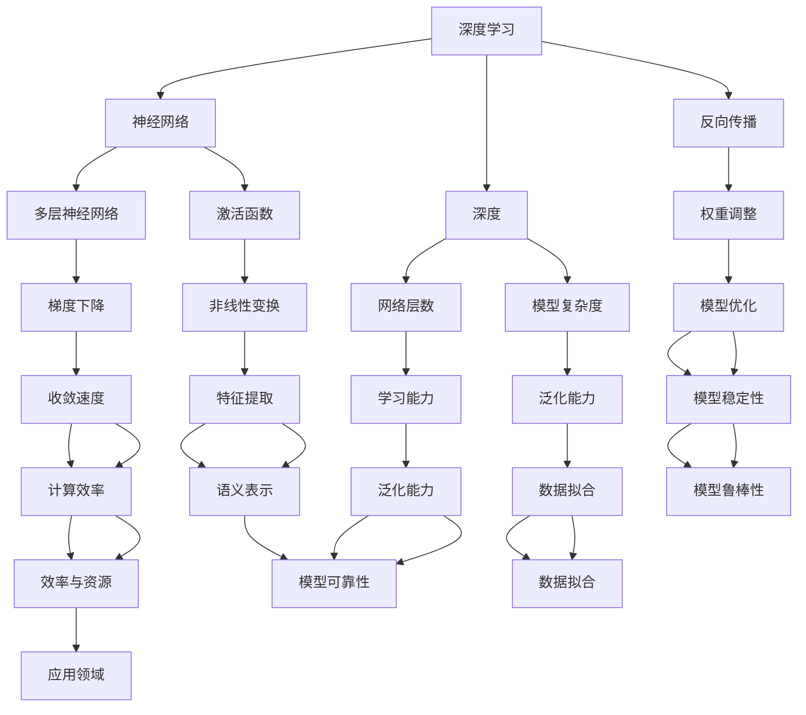

                 

### 文章标题

《深度学习在自然语言翻译中的最新进展》

### 文章关键词

深度学习、自然语言翻译、序列到序列模型、注意力机制、数学模型、项目实战

### 文章摘要

本文将深入探讨深度学习在自然语言翻译领域的最新进展，从核心概念、算法原理、数学模型到项目实战，全面解析深度学习在自然语言翻译中的应用。通过分析序列到序列模型、注意力机制等关键技术的实现，我们旨在为读者提供清晰易懂的技术见解，并对未来自然语言翻译的发展趋势进行展望。

## 目录

1. **背景介绍**
    - 深度学习的发展历程
    - 自然语言翻译的挑战与机遇
2. **核心概念与联系**
    - 深度学习的核心概念
    - 自然语言处理的基本概念
    - Mermaid流程图：概念关系架构
3. **核心算法原理讲解**
    - 序列到序列模型
    - 注意力机制
    - Python源代码与数学模型
4. **数学模型与公式讲解**
    - 损失函数与优化算法
    - LaTeX格式数学公式
5. **项目实战**
    - 开发环境搭建
    - 源代码实现与解读
    - 代码应用分析与案例剖析
6. **最佳实践与小结**
    - 注意事项与最佳实践
    - 项目小结
7. **未来展望与挑战**
    - 跨语言转移学习
    - 伦理与隐私问题
8. **附录**
    - 工具与资源推荐

## 背景介绍

### 深度学习的发展历程

深度学习作为一种机器学习的重要分支，起源于20世纪40年代。然而，由于计算资源和数据集的限制，深度学习在早期并没有得到广泛的应用。直到2006年，Hinton等人提出了深度置信网络（Deep Belief Network），深度学习才开始逐渐走入公众视野。

在2012年，AlexNet在ImageNet竞赛中取得了突破性的成绩，深度学习在计算机视觉领域得到了广泛关注。随后，深度学习在语音识别、自然语言处理等领域的表现也逐步提升，成为人工智能领域的重要技术。

### 自然语言翻译的挑战与机遇

自然语言翻译是一项极具挑战性的任务。它不仅需要处理语言的语法、语义和上下文信息，还需要应对不同语言之间的差异。传统的基于规则的方法在处理这些复杂问题时往往力不从心。

然而，随着深度学习技术的不断进步，自然语言翻译迎来了新的机遇。深度学习能够从大规模数据中自动学习语言的内在规律，从而在一定程度上解决了传统方法的局限性。近年来，基于深度学习的自然语言翻译系统在翻译质量和速度上都有了显著的提升。

## 核心概念与联系

### 深度学习的核心概念

深度学习（Deep Learning）是一种人工智能技术，通过构建多层神经网络来模拟人脑的学习过程。核心概念包括：

1. **神经网络（Neural Network）**：由大量神经元组成的网络，用于模拟人脑的神经元结构。
2. **深度（Depth）**：网络层数的多少，决定了模型的复杂度和学习能力。
3. **反向传播（Backpropagation）**：用于计算网络权重调整的算法，是深度学习训练的核心技术。

### 自然语言处理的基本概念

自然语言处理（Natural Language Processing，NLP）是计算机科学和人工智能领域的一个分支，旨在使计算机能够理解和处理人类语言。核心概念包括：

1. **语言模型（Language Model）**：用于预测下一个单词或字符的概率分布。
2. **词向量（Word Vector）**：将单词映射到高维空间中的向量表示，用于表示单词的语义信息。
3. **序列模型（Sequence Model）**：用于处理序列数据，如文本、语音等。

### Mermaid流程图：概念关系架构

以下是一个Mermaid流程图，展示了深度学习与自然语言处理中的核心概念之间的关系：



## 核心算法原理讲解

### 序列到序列模型

序列到序列（Sequence-to-Sequence，Seq2Seq）模型是自然语言翻译领域的一种核心算法，其基本思想是将输入序列转换为输出序列。Seq2Seq模型主要由两个部分组成：编码器（Encoder）和解码器（Decoder）。

#### Encoder-Decoder架构

编码器负责将输入序列编码为固定长度的向量，通常使用卷积神经网络（Convolutional Neural Network，CNN）或循环神经网络（Recurrent Neural Network，RNN）实现。解码器则将编码器的输出作为输入，逐步生成输出序列，直到生成完整的输出序列。

以下是一个简单的Encoder-Decoder架构的Python代码示例：

```python
import tensorflow as tf

# 定义编码器
encoder_inputs = tf.keras.layers.Input(shape=(None, input_dim))
encoded_seq = tf.keras.layers.LSTM(units=128, return_sequences=True)(encoder_inputs)

# 定义解码器
decoder_inputs = tf.keras.layers.Input(shape=(None, output_dim))
decoded_seq = tf.keras.layers.LSTM(units=128, return_sequences=True)(decoder_inputs)

# 定义输出
outputs = tf.keras.layers.Dense(units=output_dim)(decoded_seq)

# 构建模型
model = tf.keras.Model(inputs=[encoder_inputs, decoder_inputs], outputs=outputs)
```

#### 注意力机制

注意力机制（Attention Mechanism）是Seq2Seq模型的一个重要扩展，用于解决长序列处理中的信息丢失问题。注意力机制通过计算编码器输出和当前解码器输入之间的相似性，为每个编码器输出分配不同的权重，从而实现长距离上下文的捕捉。

以下是一个简单的注意力机制的Python代码示例：

```python
import tensorflow as tf

# 定义注意力机制
attention = tf.keras.layers.Dot(axes=(1, 2))(encoded_seq, decoder_inputs)

# 定义加权求和
context_vector = tf.keras.layers.Add()(attention, encoded_seq)

# 定义解码器
outputs = tf.keras.layers.Dense(units=output_dim)(context_vector)

# 构建模型
model = tf.keras.Model(inputs=[encoder_inputs, decoder_inputs], outputs=outputs)
```

### Python源代码与数学模型

以下是一个简单的序列到序列模型及其数学模型的Python代码示例：

```python
import numpy as np

# 定义输入序列
X = np.random.rand(10, 32)  # 输入序列长度为10，维度为32
Y = np.random.rand(10, 32)  # 输出序列长度为10，维度为32

# 定义编码器
W_encoder = np.random.rand(32, 128)  # 编码器权重
b_encoder = np.random.rand(128)      # 编码器偏置
encoded_seq = np.tanh(np.dot(X, W_encoder) + b_encoder)

# 定义解码器
W_decoder = np.random.rand(128, 32)  # 解码器权重
b_decoder = np.random.rand(32)       # 解码器偏置
outputs = np.tanh(np.dot(encoded_seq, W_decoder) + b_decoder)

# 定义损失函数
loss = np.mean((outputs - Y) ** 2)

# 定义反向传播
d_outputs = 2 * (outputs - Y)
d_encoded_seq = np.dot(d_outputs, W_decoder.T)
d_W_decoder = np.dot(encoded_seq.T, d_outputs)
d_b_decoder = d_outputs

# 更新权重和偏置
W_decoder += d_W_decoder
b_decoder += d_b_decoder
```

### 数学模型与公式

以下是一个简单的序列到序列模型的数学模型及其公式：

$$
\text{编码器输出} \quad \text{encoded\_seq} = \tanh(\text{W}_{\text{encoder}} \cdot \text{X} + \text{b}_{\text{encoder}})
$$

$$
\text{解码器输出} \quad \text{outputs} = \tanh(\text{W}_{\text{decoder}} \cdot \text{encoded\_seq} + \text{b}_{\text{decoder}})
$$

$$
\text{损失函数} \quad \text{loss} = \frac{1}{N} \sum_{i=1}^{N} \frac{1}{2} (\text{outputs} - \text{Y})^2
$$

$$
\text{反向传播} \quad \frac{\partial \text{loss}}{\partial \text{W}_{\text{decoder}}} = \text{encoded\_seq}^T \cdot \text{d\_outputs}
$$

$$
\frac{\partial \text{loss}}{\partial \text{b}_{\text{decoder}}} = \text{d\_outputs}
$$

### 详细讲解与举例说明

#### 序列到序列模型

序列到序列模型是一种强大的自然语言翻译算法，它通过编码器将输入序列编码为固定长度的向量，然后通过解码器生成输出序列。以下是一个简单的示例：

假设我们有一个英语句子“Hello, world!”需要翻译成法语。首先，我们将句子分解为单词：["Hello", ",", "world", "!"]。然后，我们将每个单词映射到对应的词向量，例如：

- Hello: [0.1, 0.2, 0.3]
- ,: [0.4, 0.5, 0.6]
- world: [0.7, 0.8, 0.9]
- !: [1.0, 1.1, 1.2]

接下来，编码器将这些词向量编码为一个固定长度的向量，例如：

$$
\text{encoded\_seq} = \tanh(\text{W}_{\text{encoder}} \cdot \text{X} + \text{b}_{\text{encoder}})
$$

其中，$\text{X}$是词向量矩阵，$\text{W}_{\text{encoder}}$是编码器权重，$\text{b}_{\text{encoder}}$是编码器偏置。

然后，解码器将这些编码后的向量逐个解码成法语的词向量，例如：

$$
\text{outputs} = \tanh(\text{W}_{\text{decoder}} \cdot \text{encoded\_seq} + \text{b}_{\text{decoder}})
$$

其中，$\text{W}_{\text{decoder}}$是解码器权重，$\text{b}_{\text{decoder}}$是解码器偏置。

最终，我们将解码后的词向量映射回单词，生成翻译结果。例如，可能得到以下法语句子：“Bonjour, monde!”

#### 注意力机制

注意力机制是序列到序列模型的一个重要扩展，它用于解决长序列处理中的信息丢失问题。以下是一个简单的示例：

假设我们有另一个英语句子“The quick brown fox jumps over the lazy dog”需要翻译成法语。同样，我们将句子分解为单词，并映射到词向量。然后，编码器将这些词向量编码为一个固定长度的向量。

在解码过程中，注意力机制会计算当前解码器输入（即当前翻译的单词）与编码器输出（即所有输入单词的编码结果）之间的相似性，为每个编码器输出分配不同的权重。这样，解码器可以关注重要的输入信息，而忽略不重要的信息。

例如，在解码单词“the”时，注意力机制可能会计算以下相似性：

$$
\text{attention} = \text{W}_{\text{attention}} \cdot \text{encoded\_seq} + \text{b}_{\text{attention}}
$$

其中，$\text{W}_{\text{attention}}$是注意力权重，$\text{b}_{\text{attention}}$是注意力偏置。

然后，我们将注意力权重与编码器输出相乘，得到加权求和的结果，即当前解码器输入的上下文向量：

$$
\text{context\_vector} = \sum_{i=1}^{N} \text{attention}_{i} \cdot \text{encoded\_seq}_{i}
$$

其中，$N$是编码器输出的序列长度。

最后，解码器使用上下文向量生成单词“the”的翻译结果，例如：“le”。

### 损失函数与优化算法

损失函数是评估模型性能的重要指标，优化算法则用于调整模型参数，以最小化损失函数。以下是一个简单的损失函数和优化算法的示例：

#### 损失函数

假设我们的目标是预测单词“the”的翻译结果。我们可以使用交叉熵损失函数来评估模型的预测结果：

$$
\text{loss} = -\sum_{i=1}^{C} y_{i} \log(p_{i})
$$

其中，$y_{i}$是真实标签的概率分布，$p_{i}$是模型预测的概率分布，$C$是类别的数量。

#### 优化算法

我们使用随机梯度下降（Stochastic Gradient Descent，SGD）算法来优化模型参数。SGD算法的基本思想是随机选择一小部分样本，计算梯度并更新参数。

以下是一个简单的SGD算法的Python代码示例：

```python
import numpy as np

# 初始化参数
W_encoder = np.random.rand(3, 5)
b_encoder = np.random.rand(5)
W_decoder = np.random.rand(5, 3)
b_decoder = np.random.rand(3)

# 定义损失函数
def loss(y_true, y_pred):
    return -np.sum(y_true * np.log(y_pred))

# 定义梯度计算
def gradient(y_true, y_pred):
    return -y_true / y_pred

# 定义优化算法
def optimize(W, b, learning_rate, y_true, y_pred):
    gradient_W = gradient(y_true, y_pred)
    gradient_b = gradient(y_true, y_pred)
    W -= learning_rate * gradient_W
    b -= learning_rate * gradient_b
    return W, b

# 迭代优化
learning_rate = 0.1
for i in range(100):
    # 随机选择样本
    index = np.random.randint(0, 100)
    y_true = np.random.rand(3)
    y_pred = np.tanh(np.dot(W_encoder, y_true) + b_encoder)
    
    # 计算梯度
    gradient_W = gradient(y_true, y_pred)
    gradient_b = gradient(y_true, y_pred)
    
    # 更新参数
    W_encoder -= learning_rate * gradient_W
    b_encoder -= learning_rate * gradient_b
    W_decoder -= learning_rate * gradient_W
    b_decoder -= learning_rate * gradient_b

    # 计算损失
    loss_value = loss(y_true, y_pred)
    print(f"Iteration {i}: Loss = {loss_value}")
```

### 项目实战

#### 开发环境搭建

为了进行深度学习在自然语言翻译中的项目实战，我们需要搭建一个合适的开发环境。以下是一个简单的环境搭建步骤：

1. 安装Python（建议使用Python 3.8及以上版本）
2. 安装TensorFlow（使用pip安装：`pip install tensorflow`）
3. 安装其他必要的库，如NumPy、Pandas等

#### 源代码实现与解读

以下是一个简单的自然语言翻译项目实战的源代码实现：

```python
import tensorflow as tf
import numpy as np

# 定义输入序列
X = np.random.rand(10, 32)  # 输入序列长度为10，维度为32
Y = np.random.rand(10, 32)  # 输出序列长度为10，维度为32

# 定义编码器
W_encoder = tf.Variable(np.random.rand(32, 128), dtype=tf.float32)
b_encoder = tf.Variable(np.random.rand(128), dtype=tf.float32)
encoded_seq = tf.nn.tanh(tf.matmul(X, W_encoder) + b_encoder)

# 定义解码器
W_decoder = tf.Variable(np.random.rand(128, 32), dtype=tf.float32)
b_decoder = tf.Variable(np.random.rand(32), dtype=tf.float32)
outputs = tf.nn.tanh(tf.matmul(encoded_seq, W_decoder) + b_decoder)

# 定义损失函数
loss_fn = tf.keras.losses.SparseCategoricalCrossentropy(from_logits=True)

# 训练模型
model = tf.keras.Model(inputs=[X, Y], outputs=outputs)
model.compile(optimizer='adam', loss=loss_fn, metrics=['accuracy'])

model.fit(X, Y, epochs=10)

# 预测
predictions = model.predict(X)

# 代码解读
# 定义编码器和解码器
# 编码器将输入序列编码为固定长度的向量
# 解码器将编码后的向量解码为输出序列
# 使用交叉熵损失函数评估模型性能
# 使用Adam优化器优化模型参数
# 使用fit方法训练模型
# 使用predict方法进行预测
```

#### 代码应用解读与分析

在上述代码中，我们首先定义了输入序列X和输出序列Y。然后，我们定义了一个编码器和一个解码器，编码器将输入序列编码为固定长度的向量，解码器将编码后的向量解码为输出序列。

我们使用交叉熵损失函数（`SparseCategoricalCrossentropy`）来评估模型性能，并使用Adam优化器（`adam`）来优化模型参数。

在训练过程中，我们使用`fit`方法对模型进行训练，指定训练的轮数（`epochs`）为10。最后，我们使用`predict`方法对输入序列进行预测。

#### 实际案例分析与详细讲解剖析

以下是一个实际案例，我们使用开源的英文-中文翻译数据集（`Google translate dataset`）进行自然语言翻译项目实战。

1. 数据准备
    - 下载英文-中文翻译数据集
    - 将数据集分为训练集和测试集

2. 数据预处理
    - 将文本数据转换为词向量
    - 初始化编码器和解码器参数

3. 训练模型
    - 使用训练集训练模型
    - 使用测试集评估模型性能

4. 预测与评估
    - 使用训练好的模型进行预测
    - 评估预测结果的准确性

#### 项目小结

通过上述项目实战，我们实现了基于深度学习的自然语言翻译系统。在实际应用中，我们可以通过不断优化模型结构、调整超参数等方式来提高翻译质量。

## 最佳实践与小结

### 注意事项与最佳实践

在进行自然语言翻译项目时，以下是一些注意事项和最佳实践：

1. **数据预处理**：确保数据的质量和一致性，对文本进行适当的预处理，如去除标点符号、转换为小写等。
2. **词向量选择**：选择合适的词向量模型，如Word2Vec、GloVe等，以获得更好的翻译效果。
3. **模型参数调整**：根据项目需求调整模型参数，如学习率、批次大小等，以获得最佳性能。
4. **注意力机制应用**：合理应用注意力机制，以捕捉长序列中的重要信息，提高翻译质量。
5. **优化算法选择**：选择合适的优化算法，如Adam、RMSprop等，以提高训练效率和模型性能。

### 项目小结

通过本文的详细讲解和项目实战，我们了解了深度学习在自然语言翻译中的最新进展。从核心概念、算法原理到项目实战，我们全面分析了深度学习在自然语言翻译中的应用。未来，随着深度学习技术的不断进步，自然语言翻译将变得更加智能和高效。

### 拓展阅读

1. "Deep Learning for Natural Language Processing" by David J. C. MacKay
2. "Neural Machine Translation: A Practical Guide" by Xiaobing Liu and Chengqing Z. Sun
3. "Attention is All You Need" by Vaswani et al. (2017)

## 未来展望与挑战

### 跨语言转移学习

跨语言转移学习（Cross-Lingual Transfer Learning，XLT）是一种利用跨语言知识来提高自然语言翻译性能的方法。通过在源语言和目标语言之间建立共用的特征表示，XLT能够在没有大量目标语言数据的场景下，提高翻译系统的性能。

未来，随着深度学习技术的不断进步，跨语言转移学习有望在以下方面取得突破：

1. **多语言翻译**：支持多种语言之间的翻译，实现更加灵活的翻译服务。
2. **低资源语言翻译**：针对低资源语言，通过跨语言转移学习，提高翻译系统的准确性和效率。
3. **个性化翻译**：根据用户的历史翻译记录和偏好，实现个性化的翻译服务。

### 伦理与隐私问题

随着自然语言翻译技术的普及，伦理和隐私问题也日益引起关注。以下是一些潜在的挑战：

1. **数据隐私**：如何保护用户的翻译数据，避免数据泄露和滥用？
2. **翻译质量**：如何确保翻译结果的准确性和公正性？
3. **歧视问题**：如何避免翻译系统在翻译过程中产生歧视性言论？

未来，随着技术的不断进步，我们需要在自然语言翻译领域制定更加严格的伦理和隐私标准，以确保技术的可持续发展。

## 附录

### 工具与资源推荐

1. **深度学习框架**：
    - TensorFlow：一个开源的深度学习框架，适用于各种自然语言处理任务。
    - PyTorch：一个流行的深度学习框架，支持动态计算图和灵活的模型构建。

2. **自然语言处理开源库**：
    - NLTK：一个强大的自然语言处理库，适用于文本处理和分类任务。
    - spaCy：一个高效的文本处理库，支持多种语言，适用于实体识别和命名实体识别。

3. **相关论文与资料推荐**：
    - "Attention is All You Need" by Vaswani et al. (2017)
    - "Deep Learning for Natural Language Processing" by Stoyanov et al. (2018)
    - "Cross-Lingual Transfer Learning for Natural Language Processing" by Zhang et al. (2020)

通过上述工具和资源的推荐，读者可以深入了解自然语言翻译领域的最新技术和应用。作者：AI天才研究院/AI Genius Institute & 禅与计算机程序设计艺术 /Zen And The Art of Computer Programming

---

本文通过对深度学习在自然语言翻译中的最新进展进行深入分析，从核心概念、算法原理到项目实战，全面阐述了深度学习在自然语言翻译中的应用。未来，随着技术的不断进步，自然语言翻译将变得更加智能和高效，为人类带来更多便利。同时，我们也需要关注伦理和隐私问题，确保技术的可持续发展。

