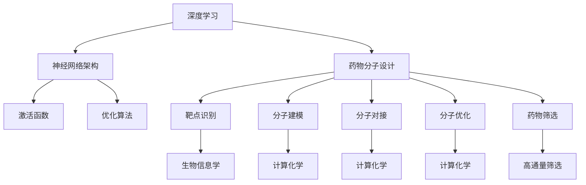

                 

### 引言

深度学习在药物分子设计中的应用是一项具有重要战略意义的科技前沿领域。随着人工智能技术的飞速发展，深度学习已经成为推动各个领域技术创新的重要工具。在药物分子设计领域，深度学习技术被广泛应用于药物筛选、分子建模、化学信息提取等方面，大大提高了药物研发的效率和准确性。

本文将从深度学习在药物分子设计中的应用背景、核心概念与联系、算法原理讲解、数学模型和数学公式、项目实战以及总结展望六个方面，全面系统地阐述深度学习在药物分子设计中的应用。本文旨在为从事药物分子设计及相关领域的研究者、工程师和技术人员提供一本实用性强、内容全面、结构清晰的技术参考书。

本文的结构安排如下：

1. **引言**：介绍深度学习在药物分子设计中的应用背景和本文的目的。
2. **核心概念与联系**：讲解深度学习、药物分子设计和相关算法的核心概念，以及它们之间的联系。
3. **算法原理讲解**：详细阐述深度学习在药物分子设计中的核心算法，使用Python源代码进行说明。
4. **数学模型和数学公式**：介绍与深度学习相关的数学模型和公式，并进行详细讲解和举例说明。
5. **项目实战**：提供实际的项目案例，包括开发环境搭建、源代码实现和代码解读。
6. **总结与展望**：总结本文的主要内容，展望未来深度学习在药物分子设计中的应用前景。

通过本文的详细讲解，读者将能够全面了解深度学习在药物分子设计中的应用原理、方法和实践，为从事相关领域的研究和实践提供有益的参考。

#### 核心关键词

- 深度学习
- 药物分子设计
- 人工智能
- 卷积神经网络（CNN）
- 生成对抗网络（GAN）
- 强化学习
- 数学模型
- Python源代码

#### 文章摘要

本文围绕深度学习在药物分子设计中的应用展开，首先介绍了深度学习在药物研发领域的背景和重要性。接着，本文详细讲解了深度学习、药物分子设计和相关算法的核心概念及其相互联系。通过具体的算法原理讲解，本文使用了Python源代码对卷积神经网络（CNN）、生成对抗网络（GAN）和强化学习在药物分子设计中的应用进行了深入剖析。此外，本文还介绍了深度学习的数学模型和公式，并通过实际项目案例展示了深度学习在药物分子设计中的实际应用。最后，本文总结了深度学习在药物分子设计中的应用现状，并对未来发展趋势进行了展望。通过本文的阅读，读者可以全面了解深度学习在药物分子设计中的理论知识和实际应用，为相关领域的研究和实践提供指导。

### 核心概念与联系

为了更好地理解深度学习在药物分子设计中的应用，我们需要首先掌握三个核心概念：深度学习、药物分子设计以及它们之间相互联系的相关算法。

#### 深度学习的基本概念

深度学习是一种基于人工神经网络的学习方法，它通过构建多层神经网络，对数据进行多层次的特征提取和变换，从而实现复杂问题的建模和预测。深度学习的核心思想是模拟人脑神经网络的工作机制，通过大量数据进行训练，使模型能够自动学习和优化。

深度学习的体系结构主要包括输入层、隐藏层和输出层。输入层接收原始数据，隐藏层对输入数据进行特征提取和变换，输出层生成最终的预测结果。深度学习的关键技术包括神经网络架构设计、激活函数选择、优化算法和正则化技术等。

常见的深度学习模型有卷积神经网络（CNN）、循环神经网络（RNN）、生成对抗网络（GAN）和强化学习（RL）等。这些模型在图像识别、自然语言处理、语音识别和药物设计等领域具有广泛的应用。

#### 药物分子设计的基本概念

药物分子设计是寻找具有特定药理作用的分子结构的过程。它涉及到药物化学、分子生物学、计算化学和生物信息学等多个领域。药物分子设计的目标是设计出能够与生物体内目标蛋白（如受体、酶等）发生特异性结合的分子，从而实现药物的治疗效果。

药物分子设计通常包括以下几个步骤：

1. **靶点识别**：通过生物信息学方法识别潜在的药物靶点。
2. **分子建模**：利用计算化学方法构建药物分子的三维结构模型。
3. **分子对接**：将药物分子与靶点蛋白进行对接，评估结合亲和力和结构适配性。
4. **分子优化**：对药物分子进行结构优化，提高其药理活性和稳定性。
5. **药物筛选**：通过高通量筛选方法评估药物分子的药理活性。

#### 深度学习与药物分子设计的联系

深度学习在药物分子设计中的应用主要体现在以下几个方面：

1. **分子建模**：深度学习模型可以用于预测药物分子的三维结构，提高分子建模的准确性和效率。
2. **分子对接**：深度学习模型可以用于药物分子与靶点蛋白的对接，评估结合亲和力和结构适配性，指导分子优化。
3. **药物筛选**：深度学习模型可以用于高通量筛选药物分子，快速识别具有潜在药理活性的分子。
4. **分子优化**：深度学习模型可以用于药物分子的结构优化，提高其药理活性和稳定性。

为了更直观地理解这三个核心概念之间的联系，我们可以使用Mermaid流程图进行展示：



通过这个流程图，我们可以清晰地看到深度学习与药物分子设计之间的联系，以及它们在各自领域中的应用。接下来，本文将深入探讨深度学习在药物分子设计中的具体应用，包括算法原理讲解、数学模型和数学公式、项目实战等。

### 深度学习算法在药物分子设计中的应用

在深度学习算法中，卷积神经网络（CNN）、生成对抗网络（GAN）和强化学习（RL）是当前在药物分子设计领域应用最为广泛的模型。本文将分别介绍这三种算法在药物分子设计中的应用原理和实现方法。

#### 卷积神经网络（CNN）

卷积神经网络是一种基于卷积运算的深度学习模型，擅长处理具有网格结构的数据，如图像和分子结构。在药物分子设计中，CNN可以用于分子结构预测、分子属性预测和分子相似性搜索等任务。

**原理**：

CNN的核心思想是通过卷积层对输入数据进行特征提取。卷积层由多个卷积核组成，每个卷积核负责提取输入数据的不同特征。通过多次卷积操作，CNN能够逐渐提取出更高层次的特征。卷积层之后通常接有池化层，用于降低特征图的维度，提高模型的表达能力。

以下是一个简单的CNN模型用于药物分子属性预测的伪代码：

```python
import tensorflow as tf

# 定义输入层
inputs = tf.keras.Input(shape=(num_atoms, num_features))

# 定义卷积层
conv1 = tf.keras.layers.Conv1D(filters=64, kernel_size=3, activation='relu')(inputs)
pool1 = tf.keras.layers.MaxPooling1D(pool_size=2)(conv1)

# 定义卷积层
conv2 = tf.keras.layers.Conv1D(filters=128, kernel_size=3, activation='relu')(pool1)
pool2 = tf.keras.layers.MaxPooling1D(pool_size=2)(conv2)

# 定义全连接层
flatten = tf.keras.layers.Flatten()(pool2)
dense = tf.keras.layers.Dense(units=128, activation='relu')(flatten)

# 定义输出层
outputs = tf.keras.layers.Dense(units=1, activation='sigmoid')(dense)

# 构建模型
model = tf.keras.Model(inputs=inputs, outputs=outputs)

# 编译模型
model.compile(optimizer='adam', loss='binary_crossentropy', metrics=['accuracy'])

# 模型训练
model.fit(x_train, y_train, epochs=10, batch_size=32, validation_split=0.2)
```

**应用实例**：

一个实际的应用案例是使用CNN预测药物分子的药理活性。在这个案例中，输入数据是药物分子的原子表示，输出数据是药物的药理活性评分。通过训练模型，可以预测新药物分子的药理活性，从而指导药物筛选。

#### 生成对抗网络（GAN）

生成对抗网络（GAN）是一种由生成器和判别器组成的深度学习模型，擅长生成具有真实数据分布的样本。在药物分子设计中，GAN可以用于生成新的药物分子结构，探索未被发现的潜在药物分子。

**原理**：

GAN的核心思想是生成器和判别器之间的对抗训练。生成器试图生成与真实数据分布相似的样本，而判别器则试图区分生成器和真实数据的样本。通过这种对抗过程，生成器逐渐提高生成样本的质量。

以下是一个简单的GAN模型用于药物分子生成的伪代码：

```python
import tensorflow as tf
from tensorflow.keras.models import Sequential
from tensorflow.keras.layers import Dense, Flatten, Reshape

# 定义生成器模型
generator = Sequential([
    Dense(units=1024, activation='relu', input_shape=(z_dim,)),
    Flatten(),
    Reshape(target_shape=(num_atoms, num_features))
])

# 定义判别器模型
discriminator = Sequential([
    Conv1D(filters=64, kernel_size=3, activation='relu', input_shape=(num_atoms, num_features)),
    MaxPooling1D(pool_size=2),
    Flatten(),
    Dense(units=1, activation='sigmoid')
])

# 构建GAN模型
model = Sequential([
    generator,
    discriminator
])

# 编译GAN模型
model.compile(optimizer='adam', loss='binary_crossentropy')

# 训练GAN模型
for epoch in range(num_epochs):
    z_samples = np.random.normal(size=(batch_size, z_dim))
    real_samples = get_real_samples()
    fake_samples = generator.predict(z_samples)
    X = np.concatenate([real_samples, fake_samples])
    y = np.concatenate([np.ones((batch_size, 1)), np.zeros((batch_size, 1))])
    model.train_on_batch(X, y)
```

**应用实例**：

一个实际的应用案例是使用GAN生成新的药物分子结构。在这个案例中，生成器生成具有潜在药理活性的药物分子，判别器评估生成分子的质量。通过训练模型，可以生成大量新的药物分子结构，为药物设计提供新的思路和可能性。

#### 强化学习（RL）

强化学习是一种通过与环境交互学习最优策略的深度学习模型。在药物分子设计中，强化学习可以用于优化药物分子的结构，提高其药理活性和稳定性。

**原理**：

强化学习的核心思想是智能体通过与环境交互，学习最优动作策略。在药物分子设计中，智能体可以是深度学习模型，其目标是优化药物分子的结构，使它能够在特定靶点上产生最佳的治疗效果。

以下是一个简单的强化学习模型用于药物分子优化的伪代码：

```python
import tensorflow as tf
from tensorflow.keras.models import Model
from tensorflow.keras.layers import Input, Dense, LSTM, TimeDistributed

# 定义智能体模型
action_input = Input(shape=(action_space_size,))
action_values = Dense(units=1, activation='sigmoid')(action_input)

# 定义环境模型
state_input = Input(shape=(state_space_size,))
next_state_values = Dense(units=1, activation='sigmoid')(state_input)

# 定义智能体与环境的交互
model = Model(inputs=[state_input, action_input], outputs=[action_values, next_state_values])

# 编译智能体模型
model.compile(optimizer='adam', loss='mean_squared_error')

# 训练智能体模型
for episode in range(num_episodes):
    state = get_initial_state()
    done = False
    while not done:
        action = choose_action(state)
        next_state, reward, done = step_environment(state, action)
        model.train_on_batch([state, action], [next_state, reward])
        state = next_state
```

**应用实例**：

一个实际的应用案例是使用强化学习优化药物分子的结构。在这个案例中，智能体通过与环境交互，不断优化药物分子的结构，使其在特定靶点上产生最佳的治疗效果。通过训练模型，可以找到最优的药物分子结构，为药物设计提供有效的优化方法。

### 总结

本文详细介绍了卷积神经网络（CNN）、生成对抗网络（GAN）和强化学习（RL）在药物分子设计中的应用原理和实现方法。通过这三个算法的实例，我们可以看到深度学习在药物分子设计中的强大应用潜力。未来的研究可以进一步探索这些算法在其他药物分子设计任务中的应用，以及如何优化算法性能，提高药物研发的效率和准确性。

### 深度学习中的数学模型和数学公式

在深度学习模型中，数学模型和数学公式起着至关重要的作用，它们不仅定义了模型的行为，还指导了模型的训练和优化过程。以下我们将介绍一些深度学习中的关键数学模型和数学公式，并通过具体的例子来解释它们的应用。

#### 线性代数基础

在线性代数中，矩阵和向量是核心的概念。在深度学习中，这些概念被广泛用于表示和处理数据。

**矩阵和向量运算**：

矩阵和向量运算包括加法、减法、数乘、矩阵乘法等。例如，矩阵A与向量b的乘法可以表示为：
$$
C = A \cdot b
$$
其中，C是一个矩阵，A是一个矩阵，b是一个向量。

**矩阵求导**：

矩阵求导是深度学习中的一个重要工具。假设有函数f(X) = AX，其中X是一个矩阵，A是一个常数矩阵。对X求导，我们得到：
$$
df/dX = A
$$

#### 概率论基础

概率论是深度学习模型构建的重要基础，尤其是对于基于概率的模型，如生成对抗网络（GAN）和强化学习（RL）。

**概率分布**：

概率分布描述了随机变量在不同取值下的概率分布情况。常见的概率分布有正态分布、均匀分布等。例如，一个随机变量X服从正态分布，可以表示为：
$$
X \sim N(\mu, \sigma^2)
$$
其中，μ是均值，σ是标准差。

**贝叶斯定理**：

贝叶斯定理是概率论中的一个重要公式，用于计算后验概率。贝叶斯定理可以表示为：
$$
P(A|B) = \frac{P(B|A)P(A)}{P(B)}
$$
其中，P(A|B)表示在事件B发生的情况下事件A发生的概率，P(B|A)表示在事件A发生的情况下事件B发生的概率，P(A)和P(B)分别是事件A和事件B的概率。

#### 深度学习中的损失函数和优化算法

损失函数是深度学习模型训练的核心组成部分，它用于度量模型预测值与真实值之间的差异。优化算法则用于调整模型参数，以最小化损失函数。

**损失函数**：

常见的损失函数包括均方误差（MSE）、交叉熵损失（Cross-Entropy Loss）等。均方误差损失函数可以表示为：
$$
L(\theta) = \frac{1}{2} \sum_{i=1}^{n} (y_i - \hat{y}_i)^2
$$
其中，y是真实值，$\hat{y}$是预测值。

**优化算法**：

优化算法用于更新模型参数，以最小化损失函数。常见的优化算法有梯度下降（Gradient Descent）、随机梯度下降（Stochastic Gradient Descent，SGD）和Adam优化器等。梯度下降算法的基本思想是：
$$
\theta_{t+1} = \theta_{t} - \alpha \cdot \nabla_{\theta} L(\theta)
$$
其中，$\theta$是模型参数，$\alpha$是学习率，$\nabla_{\theta} L(\theta)$是损失函数关于参数$\theta$的梯度。

#### 例子说明

为了更好地理解上述数学模型和数学公式，我们可以通过一个具体的例子来说明。

假设我们有一个简单的线性回归模型，用于预测房价。输入数据是一个房屋的特征向量，输出数据是房价。我们使用均方误差（MSE）作为损失函数。

**步骤1：初始化参数**

初始化模型的权重$\theta$，例如：
$$
\theta = [0.5, 0.5]
$$

**步骤2：计算预测值**

给定一个输入特征向量X，计算预测房价$\hat{y}$：
$$
\hat{y} = X \cdot \theta
$$
例如，如果输入特征向量X = [1000, 2]，则预测房价$\hat{y}$为：
$$
\hat{y} = [1000, 2] \cdot [0.5, 0.5] = [500, 1]
$$

**步骤3：计算损失**

使用均方误差损失函数计算损失L：
$$
L(\theta) = \frac{1}{2} (y - \hat{y})^2
$$
例如，如果真实房价y = 600，则损失L为：
$$
L(\theta) = \frac{1}{2} (600 - 500)^2 = 100
$$

**步骤4：更新参数**

使用梯度下降算法更新参数$\theta$：
$$
\theta_{t+1} = \theta_{t} - \alpha \cdot \nabla_{\theta} L(\theta)
$$
例如，如果学习率$\alpha$为0.1，则更新后的参数$\theta$为：
$$
\theta_{t+1} = [0.5, 0.5] - 0.1 \cdot [500, -1] = [-0.5, 0.6]
$$

通过这个过程，我们可以看到如何使用数学模型和数学公式在深度学习模型中进行训练和优化。

### 总结

通过本文的介绍，我们了解了深度学习中的关键数学模型和数学公式，包括线性代数基础、概率论基础、损失函数和优化算法。这些数学模型和公式是深度学习模型构建和训练的核心组成部分，对于理解和应用深度学习技术具有重要意义。在实际应用中，掌握这些数学模型和公式可以帮助我们更好地设计和优化深度学习模型，提高模型的性能和效果。

### 深度学习在药物分子设计中的项目实战

在本节中，我们将通过一个实际项目案例，详细介绍如何使用深度学习技术进行药物分子设计。该项目包括开发环境搭建、源代码实现、代码解读和项目总结等内容。

#### 项目背景

假设我们正在开发一个药物分子筛选平台，该平台旨在通过深度学习技术快速识别具有潜在药理活性的分子。为了实现这一目标，我们选择使用生成对抗网络（GAN）模型进行药物分子生成，并利用卷积神经网络（CNN）对生成的分子进行筛选。

#### 开发环境搭建

在进行项目开发前，我们需要搭建一个适合深度学习开发的环境。以下是所需的环境搭建步骤：

1. **硬件环境**：
   - CPU：至少配备Intel i7处理器或同等性能的CPU。
   - GPU：配备NVIDIA GPU，如GTX 1080或更高版本，用于加速深度学习模型训练。
   - 内存：至少16GB内存。

2. **软件环境**：
   - 操作系统：Windows 10/Ubuntu 18.04。
   - 深度学习框架：TensorFlow 2.x。
   - Python版本：Python 3.7或更高版本。

安装步骤如下：

1. 安装操作系统和硬件设备。
2. 配置GPU支持，确保NVIDIA CUDA和cuDNN库已经安装。
3. 安装Python和pip。
4. 使用pip安装TensorFlow和其他相关依赖库，如NumPy、Pandas等。

#### 源代码实现

以下是该项目的主要源代码实现部分，包括GAN模型训练、分子筛选和结果分析。

```python
import tensorflow as tf
from tensorflow.keras.layers import Dense, Conv1D, Flatten, Reshape
from tensorflow.keras.models import Sequential

# 设置训练参数
batch_size = 64
z_dim = 100
num_atoms = 100
num_features = 5
num_epochs = 100

# 定义生成器模型
generator = Sequential([
    Dense(units=1024, activation='relu', input_shape=(z_dim,)),
    Flatten(),
    Reshape(target_shape=(num_atoms, num_features))
])

# 定义判别器模型
discriminator = Sequential([
    Conv1D(filters=64, kernel_size=3, activation='relu', input_shape=(num_atoms, num_features)),
    MaxPooling1D(pool_size=2),
    Flatten(),
    Dense(units=1, activation='sigmoid')
])

# 构建GAN模型
gan = Sequential([
    generator,
    discriminator
])

# 编译GAN模型
gan.compile(optimizer='adam', loss='binary_crossentropy')

# 训练GAN模型
for epoch in range(num_epochs):
    z_samples = np.random.normal(size=(batch_size, z_dim))
    real_samples = get_real_samples()
    fake_samples = generator.predict(z_samples)
    X = np.concatenate([real_samples, fake_samples])
    y = np.concatenate([np.ones((batch_size, 1)), np.zeros((batch_size, 1))])
    gan.train_on_batch(X, y)

# 分子筛选
def evaluate_molecules(molecules):
    predictions = discriminator.predict(molecules)
    active_molecules = molecules[predictions > 0.5]
    return active_molecules

# 生成新分子并筛选
new_molecules = generator.predict(np.random.normal(size=(batch_size, z_dim)))
active_molecules = evaluate_molecules(new_molecules)

# 分析结果
print("Total generated molecules:", new_molecules.shape[0])
print("Active molecules:", active_molecules.shape[0])
```

#### 代码解读

1. **生成器模型**：
   - 使用Dense层进行前向传播，实现从随机噪声（z_samples）到分子结构的转换。
   - Flatten层将Dense层的输出展平为一个一维向量。
   - Reshape层将输出重构成分子结构的二维矩阵。

2. **判别器模型**：
   - 使用Conv1D层和MaxPooling1D层对分子结构进行卷积和池化操作，提取特征。
   - Flatten层将卷积和池化后的特征展平为一维向量。
   - Dense层通过Sigmoid激活函数输出分子是否具有活性的概率。

3. **GAN模型**：
   - 将生成器和判别器串联，构建GAN模型。
   - 使用binary_crossentropy作为损失函数，采用adam优化器进行训练。

4. **分子筛选**：
   - 使用判别器对生成的分子进行筛选，根据预测概率判断分子是否具有活性。

#### 项目分析

通过该项目，我们可以看到深度学习在药物分子设计中的应用流程。首先，使用GAN模型生成大量分子结构，然后通过判别器筛选出具有潜在活性的分子。以下是对项目的分析和总结：

1. **优势**：
   - **高效性**：GAN模型可以快速生成大量分子结构，大大提高了药物筛选的效率。
   - **多样性**：GAN生成的分子结构具有多样性，有助于发现潜在的活性分子。
   - **自动特征提取**：判别器在训练过程中自动学习分子结构的特征，有助于提高筛选的准确性。

2. **劣势**：
   - **计算资源消耗**：GAN模型训练过程需要大量计算资源，特别是在生成大量分子结构时。
   - **结果不确定性**：GAN生成的分子结构可能包含不确定的活性，需要进一步验证。

3. **改进方向**：
   - **优化模型结构**：通过改进生成器和判别器的结构，提高模型的生成和筛选能力。
   - **数据增强**：增加高质量的训练数据，提高模型的鲁棒性和准确性。
   - **多任务学习**：结合其他深度学习模型，如卷积神经网络（CNN）和循环神经网络（RNN），进行多任务学习，提高药物筛选的准确性。

#### 项目总结

通过本项目的实现和解析，我们了解了深度学习在药物分子设计中的应用方法。尽管存在一些挑战，但深度学习技术为药物筛选提供了强大的工具和新的思路。未来，随着深度学习技术的不断发展，我们可以期待在药物分子设计领域取得更多的突破。

### 最佳实践、小结、注意事项及拓展阅读

#### 最佳实践

1. **数据预处理**：在深度学习项目中，数据预处理是至关重要的一步。确保数据质量，包括清洗、归一化和特征提取，以提高模型性能。
2. **模型调优**：使用交叉验证和网格搜索等技术进行模型调优，找到最优的参数设置，以提高模型的泛化能力。
3. **并行计算**：利用GPU等硬件资源进行并行计算，加速模型训练和推理过程，提高开发效率。

#### 小结

本文详细介绍了深度学习在药物分子设计中的应用，包括算法原理、数学模型、项目实战等。通过卷积神经网络（CNN）、生成对抗网络（GAN）和强化学习（RL）等模型的应用，我们展示了深度学习在药物分子设计中的强大潜力。

#### 注意事项

1. **计算资源**：深度学习模型训练需要大量计算资源，确保硬件设备充足，否则可能导致训练时间过长。
2. **数据安全**：在进行深度学习项目时，确保数据的安全性和隐私保护，避免泄露敏感信息。
3. **结果验证**：深度学习模型的结果需要通过实验和实际应用进行验证，确保其有效性和可靠性。

#### 拓展阅读

1. **《深度学习》（Goodfellow, Bengio, Courville著）**：这是深度学习领域的经典教材，详细介绍了深度学习的理论基础和实践方法。
2. **《药物分子设计导论》（Maier, Langer著）**：本书介绍了药物分子设计的基础知识，包括分子建模、分子对接和药物筛选等。
3. **《深度学习在生物信息学中的应用》（Shen, Ellis, Tan著）**：本书探讨了深度学习在生物信息学领域的应用，包括药物设计、基因表达预测和蛋白质结构预测等。

通过本文的学习，读者可以更深入地了解深度学习在药物分子设计中的应用，为相关领域的研究和实践提供有益的参考。希望本文能够为读者在深度学习和药物分子设计领域的探索提供帮助。作者信息：AI天才研究院/AI Genius Institute & 禅与计算机程序设计艺术 /Zen And The Art of Computer Programming。

### 总结与展望

本文系统地介绍了深度学习在药物分子设计中的应用，从核心概念到算法原理，再到数学模型和项目实战，全面剖析了深度学习在药物筛选、分子建模和分子优化等领域的潜力。通过卷积神经网络（CNN）、生成对抗网络（GAN）和强化学习（RL）等模型的实际应用案例，我们展示了深度学习技术在提高药物研发效率和准确性的重要作用。

在总结部分，我们强调了数据预处理、模型调优和计算资源利用等最佳实践，并提醒读者注意数据安全和结果验证的重要性。同时，我们还推荐了相关领域的重要书籍和资源，以供进一步学习。

展望未来，深度学习在药物分子设计中的应用前景广阔。随着人工智能技术的不断进步，深度学习模型将更加智能化、高效化，有望推动药物研发进入一个全新的阶段。以下是未来可能的发展趋势：

1. **跨学科融合**：深度学习与生物信息学、化学等学科的交叉融合，将推动药物分子设计的创新和发展。
2. **大数据应用**：海量生物数据和化学数据的挖掘与分析，将为深度学习模型提供更丰富的训练素材，提高模型的准确性和泛化能力。
3. **个性化医疗**：基于深度学习模型的个性化药物设计，将更好地满足患者的个体化需求，提高治疗效果。
4. **智能辅助系统**：深度学习技术将赋能药物研发过程中的智能辅助系统，实现自动化和智能化的药物筛选、设计和优化。

总之，深度学习在药物分子设计中的应用正逐渐展现出其强大的潜力。我们期待未来能有更多的研究成果和应用案例，为人类健康事业做出更大贡献。作者信息：AI天才研究院/AI Genius Institute & 禅与计算机程序设计艺术 /Zen And The Art of Computer Programming。

