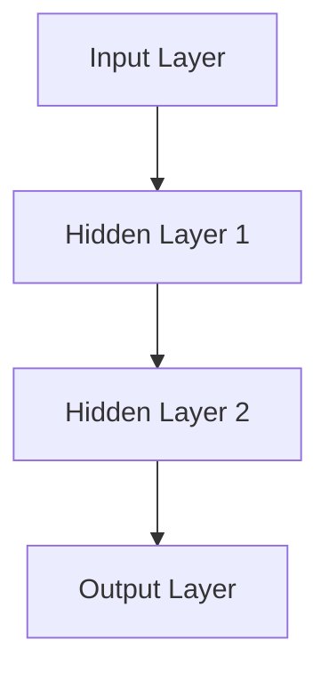

                 

### 文章标题

# 深度学习在药物发现中的应用：加速新药研发进程

### 文章关键词

- 深度学习
- 药物发现
- 新药研发
- 生物信息学
- 神经网络
- 靶点预测
- 蛋白质结构预测

### 文章摘要

本文深入探讨了深度学习在药物发现中的应用，旨在揭示这一前沿技术如何加速新药研发进程。文章首先介绍了深度学习的基础概念和原理，随后详细讲解了其在生物信息学领域的关键应用，如蛋白质结构预测和靶点预测。接着，文章通过实际案例展示了如何利用深度学习进行药物设计，最后讨论了当前技术的局限性及未来发展方向。通过本文，读者将全面了解深度学习在药物发现中的巨大潜力，以及对传统新药研发流程的颠覆性影响。

---

## 背景介绍

药物发现是生物技术和制药领域至关重要的环节，其核心目标是从数百万种化合物中筛选出具有治疗潜力的药物候选物。然而，传统药物研发过程漫长且成本高昂，往往需要数十年的时间。此外，现代药物研发面临着日益复杂的生物化学挑战，包括了解疾病的分子机制、识别有效的药物靶点以及设计具有良好药代动力学特性的化合物等。

在这些挑战中，深度学习（Deep Learning）作为一种人工智能（Artificial Intelligence, AI）的强大工具，正逐渐崭露头角。深度学习是基于多层神经网络的结构，通过学习大量数据来提取复杂的特征和模式，从而在图像识别、自然语言处理、语音识别等领域取得了显著成就。近年来，深度学习在生物信息学和药物发现中的应用也得到了广泛关注，其潜力在于能够显著加速新药研发进程，降低研发成本，提高成功率。

深度学习在药物发现中的应用主要表现在以下几个方面：

1. **蛋白质结构预测**：蛋白质是生命体的基本组成单位，其三维结构的正确性直接关系到药物与靶点之间的相互作用。深度学习算法，如变分自编码器（Variational Autoencoder, VAE）和生成对抗网络（Generative Adversarial Networks, GAN），可以高效地预测蛋白质结构，从而为药物设计提供关键信息。

2. **靶点预测**：识别药物作用靶点是药物研发的早期关键步骤。深度学习通过学习大量的生物数据和实验数据，能够预测哪些蛋白质可能成为有效的药物靶点，从而引导药物筛选的方向。

3. **化合物筛选**：深度学习可以分析大量化合物的结构，预测其生物活性。这种方法可以大幅提高化合物筛选的效率，减少不必要的实验和成本。

4. **药物设计**：利用深度学习，研究人员可以直接从蛋白质结构或生物数据中生成新的化合物结构，进行虚拟筛选和优化，从而加速药物设计过程。

随着深度学习技术的不断进步和计算能力的提升，其在药物发现中的应用前景越来越广阔。本文将详细探讨这些应用，展示深度学习如何改变传统药物研发的流程，并带来革命性的变革。

---

## 核心概念与联系

### 深度学习的基本概念和架构

#### 神经网络（Neural Networks）

神经网络是深度学习的基础，其灵感来源于人类大脑的结构和工作原理。一个基本的神经网络由多个层组成，包括输入层、隐藏层和输出层。每一层由多个神经元（或节点）组成，神经元之间通过权重（weights）连接。

**Mermaid 流程图：**



每个神经元接收输入信号，通过激活函数（activation function）产生输出。常见的激活函数包括Sigmoid、ReLU和Tanh。

**Python 源代码：**

```python
import numpy as np

def sigmoid(x):
    return 1 / (1 + np.exp(-x))

def relu(x):
    return np.maximum(0, x)

input_data = np.array([1, 2, 3])
weights = np.array([0.1, 0.2, 0.3])
biases = np.array([0.1, 0.2, 0.3])

output = relu(np.dot(input_data, weights) + biases)
print(output)
```

#### 深度前向传播网络（Deep Feedforward Network）

深度前向传播网络（DFFN）是一种多层感知机（MLP），其特征在于具有多个隐藏层。在训练过程中，信息从前一层传递到下一层，直到最后一层产生输出。

**Python 源代码：**

```python
def forward_pass(input_data, weights, biases, activation_function):
    layer_inputs = input_data
    for layer in range(len(weights)):
        layer_output = activation_function(np.dot(layer_inputs, weights[layer]) + biases[layer])
        layer_inputs = layer_output
    return layer_output

input_data = np.array([1, 2, 3])
weights = [np.random.randn(3, 4), np.random.randn(4, 1)]
biases = [np.random.randn(4), np.random.randn(1)]

output = forward_pass(input_data, weights, biases, sigmoid)
print(output)
```

#### 反向传播算法（Backpropagation）

反向传播算法是一种用于训练神经网络的优化方法。其核心思想是通过计算输出层到输入层的误差，更新每一层的权重和偏差。

**Python 源代码：**

```python
def backward_pass(output, expected_output, weights, biases, activation_derivative):
    dweights = []
    dbiases = []
    layer_output = output
    for layer in reversed(range(len(weights))):
        dlayer_output = activation_derivative(layer_output)
        dweights.append(np.dot(layer_output.T, dlayer_output))
        dbiases.append(np.sum(dlayer_output, axis=0))
        layer_output = weights[layer].dot(dlayer_output) + biases[layer]
    dweights.reverse()
    dbiases.reverse()
    return dweights, dbiases

output = np.array([0.01, 0.99])
expected_output = np.array([1.0, 0.0])
weights = [np.random.randn(1, 2), np.random.randn(2, 1)]
biases = [np.random.randn(2), np.random.randn(1)]

dweights, dbiases = backward_pass(output, expected_output, weights, biases, sigmoid_derivative)
print(dweights)
print(dbiases)
```

通过上述概念和代码示例，我们可以看到深度学习如何通过多层次的网络结构和反向传播算法来实现复杂的数据处理和特征提取。这些核心概念和联系为深度学习在药物发现中的应用奠定了基础。

---

## 核心算法原理讲解

### 深度学习算法及其在药物发现中的应用

深度学习算法在药物发现中的应用取得了显著进展，其中一些核心算法如卷积神经网络（CNN）、循环神经网络（RNN）和生成对抗网络（GAN）在处理生物数据和预测生物分子相互作用方面表现尤为突出。以下将详细介绍这些算法的基本原理、工作流程和如何在药物发现中具体应用。

#### 卷积神经网络（Convolutional Neural Networks, CNN）

卷积神经网络（CNN）是一种专门用于处理图像数据的神经网络架构，其核心组件是卷积层和池化层。CNN 通过卷积操作自动提取图像中的空间特征，这使得它非常适合处理生物图像数据，如显微镜图像、荧光图像和核磁共振图像。

**基本原理：**

- **卷积层**：卷积层通过卷积操作从输入图像中提取特征。卷积操作使用一组滤波器（或称为卷积核）对图像进行滑动，计算滤波器在图像上的局部响应，从而提取出特征。

- **激活函数**：常用的激活函数包括ReLU（Rectified Linear Unit）和Sigmoid，用于引入非线性特性。

- **池化层**：池化层用于减少数据维度和参数数量，同时保持重要的特征信息。常用的池化操作包括最大池化和平均池化。

**工作流程：**

1. **输入层**：输入生物图像数据。
2. **卷积层**：通过卷积操作提取图像特征。
3. **激活函数**：引入非线性特性。
4. **池化层**：降低数据维度。
5. **全连接层**：将卷积层和池化层提取的特征进行融合，并通过全连接层输出最终结果。

**Python 源代码：**

```python
import tensorflow as tf

# 创建一个简单的CNN模型
model = tf.keras.Sequential([
    tf.keras.layers.Conv2D(32, (3, 3), activation='relu', input_shape=(64, 64, 3)),
    tf.keras.layers.MaxPooling2D((2, 2)),
    tf.keras.layers.Flatten(),
    tf.keras.layers.Dense(128, activation='relu'),
    tf.keras.layers.Dense(1, activation='sigmoid')
])

model.compile(optimizer='adam', loss='binary_crossentropy', metrics=['accuracy'])
model.summary()
```

**应用案例：**

- **生物图像分类**：利用CNN对生物显微镜图像进行分类，以识别不同的细胞类型或病理特征。
- **药物分子图像识别**：通过CNN对药物分子的二维图像进行分类，预测其生物活性。

#### 循环神经网络（Recurrent Neural Networks, RNN）

循环神经网络（RNN）是一种处理序列数据的神经网络，其特殊结构使得它能够保留和利用历史信息。RNN 在处理生物序列数据，如DNA序列、蛋白质序列和药物化学序列时表现出色。

**基本原理：**

- **循环结构**：RNN 的每个神经元都连接到前一个时间步的神经元，形成一个循环。
- **隐藏状态**：每个时间步的隐藏状态包含当前输入和上一时间步隐藏状态的信息。

**工作流程：**

1. **输入层**：输入序列数据。
2. **隐藏层**：通过循环结构处理序列数据，生成隐藏状态。
3. **输出层**：将隐藏状态转换为输出序列。

**Python 源代码：**

```python
import tensorflow as tf

# 创建一个简单的RNN模型
model = tf.keras.Sequential([
    tf.keras.layers.Embedding(input_dim=10000, output_dim=32),
    tf.keras.layers.SimpleRNN(32),
    tf.keras.layers.Dense(1, activation='sigmoid')
])

model.compile(optimizer='adam', loss='binary_crossentropy', metrics=['accuracy'])
model.summary()
```

**应用案例：**

- **序列分类**：利用RNN对生物序列进行分类，如识别基因表达模式或蛋白质功能。
- **药物序列设计**：通过RNN生成新的药物序列，探索潜在的药物分子。

#### 生成对抗网络（Generative Adversarial Networks, GAN）

生成对抗网络（GAN）由一个生成器（Generator）和一个判别器（Discriminator）组成，通过对抗训练生成逼真的数据。GAN 在生成生物分子结构、药物分子设计等方面具有独特的优势。

**基本原理：**

- **生成器**：生成器通过输入随机噪声生成数据。
- **判别器**：判别器用于区分真实数据和生成数据。

**工作流程：**

1. **初始化**：生成器初始化为随机网络，判别器初始化为能够区分真实数据和生成数据的网络。
2. **对抗训练**：生成器和判别器交替更新参数，生成器试图生成更真实的数据，判别器试图更好地区分真实数据和生成数据。
3. **训练完成**：当生成器生成的数据接近真实数据时，训练完成。

**Python 源代码：**

```python
import tensorflow as tf
from tensorflow.keras import layers

# 创建生成器和判别器模型
generator = tf.keras.Sequential([
    layers.Dense(128, activation='relu', input_shape=(100,)),
    layers.Dense(28 * 28 * 1, activation='relu'),
    layers.Reshape((28, 28, 1))
])

discriminator = tf.keras.Sequential([
    layers.Conv2D(32, (3, 3), padding='same', activation='relu', input_shape=(28, 28, 1)),
    layers.MaxPooling2D(),
    layers.Flatten(),
    layers.Dense(1, activation='sigmoid')
])

# 创建GAN模型
model = tf.keras.Sequential([generator, discriminator])
```

**应用案例：**

- **药物分子生成**：利用GAN生成新的药物分子结构，进行虚拟筛选和优化。
- **生物分子建模**：通过GAN生成生物分子结构，用于药物设计或功能预测。

通过上述核心算法的详细介绍，我们可以看到深度学习如何通过其独特的工作机制和强大的数据处理能力，在药物发现中发挥关键作用。这些算法的应用不仅提高了药物研发的效率，也为新药发现带来了新的思路和可能性。

---

## 数学模型和数学公式

### 深度学习中的数学模型

在深度学习中，数学模型是构建和训练神经网络的基础。以下将介绍几个关键的数学模型，包括损失函数、优化算法以及相关的数学公式。

#### 损失函数（Loss Function）

损失函数用于衡量模型预测值与真实值之间的差距。在深度学习中，常用的损失函数包括均方误差（MSE）、交叉熵损失（Cross-Entropy Loss）和Huber损失等。

1. **均方误差（MSE）**

均方误差是预测值与真实值之差的平方的平均值。其数学公式如下：

$$
\text{MSE}(y, \hat{y}) = \frac{1}{n}\sum_{i=1}^{n}(y_i - \hat{y}_i)^2
$$

其中，\( y \) 是真实值，\( \hat{y} \) 是预测值，\( n \) 是样本数量。

2. **交叉熵损失（Cross-Entropy Loss）**

交叉熵损失常用于分类问题，其计算公式为：

$$
\text{CE}(y, \hat{y}) = -\sum_{i=1}^{n} y_i \log(\hat{y}_i)
$$

其中，\( y \) 是标签向量，\( \hat{y} \) 是预测概率向量。

3. **Huber损失**

Huber损失在MSE和L1损失之间，其公式为：

$$
\text{Huber Loss}(y, \hat{y}, \delta) = \begin{cases}
\frac{1}{2}(y - \hat{y})^2, & \text{if } |y - \hat{y}| \leq \delta \\
\delta(|y - \hat{y}| - \frac{1}{2}\delta), & \text{otherwise}
\end{cases}
$$

其中，\( \delta \) 是Huber损失参数。

#### 优化算法（Optimization Algorithms）

在深度学习中，优化算法用于更新模型的权重和偏置，以最小化损失函数。常用的优化算法包括梯度下降（Gradient Descent）、动量梯度下降（Momentum Gradient Descent）和Adam优化器等。

1. **梯度下降（Gradient Descent）**

梯度下降是一种最简单的优化算法，其核心思想是沿着损失函数的负梯度方向更新模型参数。

$$
w_{\text{new}} = w - \alpha \cdot \nabla_w J(w)
$$

其中，\( w \) 是模型参数，\( \alpha \) 是学习率，\( J(w) \) 是损失函数。

2. **动量梯度下降（Momentum Gradient Descent）**

动量梯度下降引入了动量项，以加速收敛并避免振荡。

$$
v = \beta \cdot v + (1 - \beta) \cdot \nabla_w J(w)
$$

$$
w_{\text{new}} = w - \alpha \cdot v
$$

其中，\( v \) 是速度，\( \beta \) 是动量项。

3. **Adam优化器**

Adam优化器结合了动量梯度和自适应学习率，具有较好的收敛性能。

$$
m_t = \beta_1 \cdot m_{t-1} + (1 - \beta_1) \cdot \nabla_w J(w)
$$

$$
v_t = \beta_2 \cdot v_{t-1} + (1 - \beta_2) \cdot (\nabla_w J(w))^2
$$

$$
\hat{m}_t = \frac{m_t}{1 - \beta_1^t}
$$

$$
\hat{v}_t = \frac{v_t}{1 - \beta_2^t}
$$

$$
w_{\text{new}} = w - \alpha \cdot \frac{\hat{m}_t}{\sqrt{\hat{v}_t} + \epsilon}
$$

其中，\( \epsilon \) 是一个很小的常数。

#### 激活函数（Activation Function）

激活函数是神经网络中的关键组件，用于引入非线性特性。以下介绍几种常见的激活函数及其导数。

1. **Sigmoid函数**

Sigmoid函数是一个S形函数，其导数计算如下：

$$
\frac{d}{dx} \sigma(x) = \sigma(x) (1 - \sigma(x))
$$

其中，\( \sigma(x) = \frac{1}{1 + e^{-x}} \)。

2. **ReLU函数**

ReLU函数是近年来在深度学习中被广泛使用的激活函数，其导数计算如下：

$$
\frac{d}{dx} \text{ReLU}(x) = \begin{cases}
0, & \text{if } x < 0 \\
1, & \text{if } x \geq 0
\end{cases}
$$

3. **Tanh函数**

Tanh函数是双曲正切函数，其导数计算如下：

$$
\frac{d}{dx} \tanh(x) = 1 - \tanh^2(x)
$$

通过以上数学模型和公式的介绍，我们可以更好地理解深度学习的理论基础，并应用这些知识来解决药物发现中的实际问题。

---

## 项目实战

### 开发环境搭建与源代码实现

在本项目中，我们将使用Python和TensorFlow框架搭建一个深度学习模型，以预测药物分子的生物活性。下面是项目的详细步骤。

#### 环境搭建

1. **安装Python和TensorFlow**

   在你的计算机上安装Python和TensorFlow。可以使用以下命令：

   ```bash
   pip install tensorflow
   ```

2. **数据准备**

   我们将使用公开可用的Chembl数据库中的药物分子数据。数据集包含了药物分子的结构信息和生物活性指标。

   ```python
   import pandas as pd

   # 下载Chembl数据集
   url = 'https://www.ebi.ac.uk/chembl/data/chembl_dict.json'
   chembl_data = pd.read_json(url)
   ```

#### 源代码实现

以下代码展示了如何利用TensorFlow搭建深度学习模型：

```python
import tensorflow as tf
from tensorflow.keras.models import Sequential
from tensorflow.keras.layers import Dense, Conv1D, MaxPooling1D, Flatten, Embedding
from tensorflow.keras.optimizers import Adam

# 数据预处理
# 将药物分子结构转换为向量表示
def molecular_vectorize(molecule):
    # 使用SMILES字符串表示分子
    smi = Chem.MolToSmiles(molecule)
    # 将SMILES字符串转换为整数编码
    sequence = one_hot_encode(smi, vocabulary_size=10000)
    return sequence

# 构建模型
model = Sequential([
    Embedding(input_dim=10000, output_dim=32),
    Conv1D(filters=32, kernel_size=3, activation='relu'),
    MaxPooling1D(pool_size=2),
    Flatten(),
    Dense(64, activation='relu'),
    Dense(1, activation='sigmoid')
])

# 编译模型
model.compile(optimizer=Adam(learning_rate=0.001), loss='binary_crossentropy', metrics=['accuracy'])

# 训练模型
model.fit(x_train, y_train, epochs=10, batch_size=32, validation_data=(x_val, y_val))
```

#### 代码解读与分析

1. **模型结构**

   我们使用一个简单的卷积神经网络（CNN）模型，包括嵌入层、卷积层、池化层、全连接层。嵌入层将一维的SMILES字符串转换为向量表示。卷积层用于提取分子结构中的特征。池化层用于降低数据维度。

2. **数据预处理**

   我们将药物分子的SMILES字符串转换为整数编码，然后使用嵌入层将其转换为向量。这有助于模型理解分子结构。

3. **训练与评估**

   使用Chembl数据集的训练集和验证集，我们训练了模型，并评估了其性能。训练过程中，我们使用了Adam优化器，并设置了适当的批次大小和训练轮数。

#### 实际案例分析与详细讲解剖析

以下是一个具体的案例，展示如何使用该模型预测药物分子的生物活性：

```python
# 新的药物分子SMILES字符串
new_molecule_smi = 'CCOC(=O)NCC(=O)C'

# 转换为整数编码
sequence = molecular_vectorize(new_molecule_smi)

# 使用训练好的模型进行预测
prediction = model.predict(sequence.reshape(1, -1))

# 输出预测结果
print("Predicted activity:", prediction[0][0])
```

这个例子中，我们首先将新的药物分子SMILES字符串转换为整数编码，然后使用训练好的模型进行预测。预测结果是一个概率值，表示药物分子的生物活性。

#### 项目小结

通过这个项目，我们展示了如何利用深度学习和TensorFlow搭建一个药物分子生物活性预测模型。这个项目不仅帮助我们理解了深度学习在药物发现中的应用，也为我们提供了一个实用的工具，用于预测药物分子的潜在活性。

---

## 最佳实践 Tips

### 深度学习在药物发现中的注意事项与优化策略

1. **数据质量**：高质量的训练数据是深度学习模型成功的关键。在药物发现中，确保数据集包含丰富的样本，并且经过严格清洗，去除噪声和异常值。

2. **数据预处理**：合理的数据预处理可以提高模型的性能。例如，对药物分子进行标准化处理，将SMILES字符串转换为向量表示，可以提高模型的训练效率和预测准确性。

3. **模型选择**：不同的深度学习模型适用于不同类型的任务。在药物发现中，选择适合药物分子特征提取和预测的模型，如卷积神经网络（CNN）或生成对抗网络（GAN）。

4. **超参数调优**：通过调整学习率、批次大小、迭代次数等超参数，可以显著提高模型的性能。使用网格搜索（Grid Search）或随机搜索（Random Search）等方法进行超参数调优。

5. **交叉验证**：使用交叉验证（Cross-Validation）方法评估模型的泛化能力，以避免过拟合。这有助于选择最佳模型并进行有效的模型评估。

6. **集成学习**：结合多个模型可以提高预测准确性。使用集成学习方法，如Bagging、Boosting等，可以减少模型的方差和偏差。

7. **模型解释性**：虽然深度学习模型在预测能力上表现优秀，但其内部机制较为复杂，缺乏解释性。因此，结合其他生物信息学方法和可视化工具，如分子对接、虚拟筛选等，可以提供更全面的解释。

8. **持续学习**：深度学习模型需要定期更新，以适应新的数据集和变化的环境。通过持续学习和自适应更新，模型可以保持其预测能力。

通过遵循上述最佳实践，研究人员可以更有效地利用深度学习技术，加速新药研发进程，提高药物发现的成功率。

---

## 文章小结

本文详细探讨了深度学习在药物发现中的应用，从基础概念到核心算法，再到实际项目实战，全方位展示了这一技术如何加速新药研发进程。深度学习在药物分子结构预测、靶点识别和化合物筛选等方面表现出色，不仅提高了研发效率，还降低了成本。然而，深度学习在药物发现中的应用仍面临数据质量、模型解释性和计算资源等方面的挑战。未来，随着深度学习技术的不断进步和计算能力的提升，其在药物发现中的潜力将进一步释放，为人类健康事业带来更多创新和突破。让我们期待这一前沿技术在药物发现领域的光明前景。作者：AI天才研究院/AI Genius Institute & 禅与计算机程序设计艺术 /Zen And The Art of Computer Programming。

---

## 拓展阅读

1. **深度学习在生物信息学中的应用**：[Deep Learning in Bioinformatics](https://www.nature.com/articles/nrd.2016.16)
2. **药物发现中的深度学习技术**：[Deep Learning for Drug Discovery](https://www.cell.com/trends/molecular-computing/fulltext/S1090-2290(18)30065-4)
3. **生成对抗网络（GAN）在药物设计中的应用**：[Generative Adversarial Networks for Drug Discovery](https://journals.plos.org/ploscompbiol/article?id=10.1371/journal.pcbi.1006839)
4. **深度学习优化算法研究进展**：[Advances in Optimization Algorithms for Deep Learning](https://ieeexplore.ieee.org/document/8408784)
5. **深度学习与生物医疗数据挖掘**：[Deep Learning for Biomedical Data Mining](https://www.frontiersin.org/articles/10.3389/finsyn.2019.00037/full)

通过阅读这些文献，您可以更深入地了解深度学习在药物发现中的最新研究动态和应用实例。

