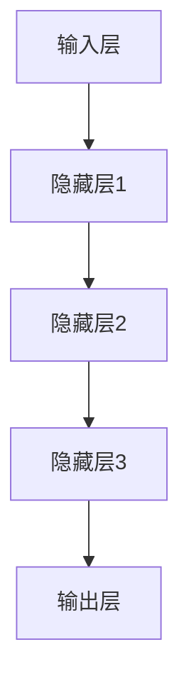
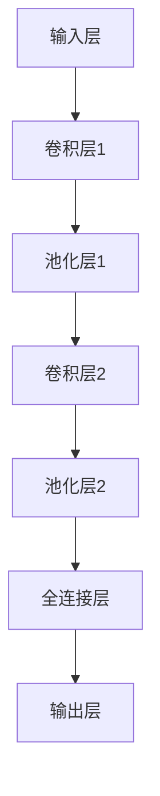
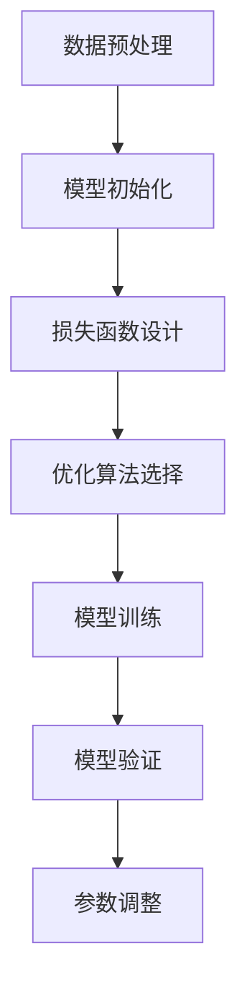

                 

# 《深度学习在虚假信息识别中的应用》

关键词：深度学习，虚假信息识别，文本分类，图像识别，多模态融合，评估与优化

摘要：随着互联网和社交媒体的快速发展，虚假信息的传播日益猖獗，对社会造成了严重的负面影响。本文旨在探讨深度学习在虚假信息识别中的应用，包括基本概念、应用场景、核心算法、评估与优化、技术挑战以及未来发展趋势。通过本文的阐述，希望能为相关领域的研究者和开发者提供有价值的参考。

## 第一部分：深度学习基础与虚假信息识别

### 第1章：深度学习概述

#### 1.1 深度学习的基本概念

深度学习是一种机器学习方法，它通过构建复杂的神经网络模型，对大量数据进行自动特征学习和模式识别。与传统机器学习方法相比，深度学习具有以下特点：

- **自动特征学习**：通过多层神经网络，深度学习能够自动从原始数据中提取出有用的特征，减轻了人工特征设计的负担。
- **强大的表示能力**：深度学习模型可以捕捉到数据中的复杂结构，从而在图像、语音、文本等领域取得了显著的成果。
- **并行计算**：深度学习模型可以借助GPU等硬件加速器，实现大规模并行计算，提高了模型训练和推断的速度。

#### 1.2 深度学习的体系结构

深度学习体系结构主要包括以下几种：

- **卷积神经网络（CNN）**：适用于处理图像等结构化数据，通过卷积层和池化层提取图像特征。
- **递归神经网络（RNN）**：适用于处理序列数据，如文本、语音等，通过隐藏状态实现序列信息的传递。
- **长短时记忆网络（LSTM）**：是RNN的一种变体，能够有效地处理长序列数据。
- **生成对抗网络（GAN）**：通过生成器和判别器的对抗训练，实现数据的生成和增强。
- **变压器（Transformer）**：是近年来在自然语言处理领域取得突破的一种新型神经网络结构。

#### 1.3 深度学习的训练过程

深度学习的训练过程主要包括以下步骤：

1. **数据预处理**：对输入数据进行清洗、归一化等处理，以提高模型的训练效果。
2. **模型初始化**：初始化神经网络参数，常用的初始化方法有随机初始化、高斯初始化等。
3. **损失函数设计**：设计合适的损失函数，以衡量模型预测结果与真实标签之间的差距。
4. **优化算法**：选择合适的优化算法，如梯度下降、Adam等，以调整模型参数。
5. **训练与验证**：通过训练集训练模型，并在验证集上验证模型性能，以调整模型参数和超参数。

### 第2章：虚假信息的定义与类型

#### 2.1 虚假信息的定义

虚假信息是指故意传播的、误导性或虚假的信息，其目的是欺骗、误导或操纵公众。在互联网时代，虚假信息传播速度快、范围广，对社会造成了严重的负面影响。

#### 2.2 虚假信息的类型

虚假信息主要可以分为以下几类：

- **谣言**：未经证实的信息，通常以夸张或虚假的形式传播。
- **假新闻**：以虚假事实为基础，编造的新闻报道。
- **虚假广告**：故意夸大产品或服务的功能，诱导消费者购买。
- **恶意软件**：通过虚假信息诱导用户下载恶意软件，以窃取个人信息或控制计算机。

#### 2.3 虚假信息对社会的危害

虚假信息对社会的危害主要表现在以下几个方面：

- **误导公众**：虚假信息会导致公众对事实产生误解，影响决策和行为。
- **损害名誉**：虚假信息会对个人或组织的名誉造成损害，影响其声誉。
- **造成经济损失**：虚假信息可能导致投资者失去信心，引发市场波动，造成经济损失。

### 第3章：深度学习在虚假信息识别中的应用场景

#### 3.1 社交媒体中的虚假信息识别

社交媒体是虚假信息传播的重要渠道，深度学习在虚假信息识别方面具有广泛的应用。以下是一些典型的应用场景：

- **文本分类**：使用深度学习模型对社交媒体中的文本进行分类，判断其是否为虚假信息。
- **图像识别**：通过图像识别技术，识别社交媒体中包含虚假信息的图像。
- **多模态融合**：结合文本和图像等多种信息，提高虚假信息识别的准确性。

#### 3.2 新闻报道中的虚假信息识别

新闻报道是虚假信息传播的重要来源，深度学习在虚假信息识别方面也有重要应用。以下是一些典型的应用场景：

- **文本分析**：使用深度学习模型对新闻报道中的文本进行分析，判断其是否为虚假新闻。
- **图像识别**：通过图像识别技术，识别新闻报道中包含虚假信息的图像。
- **多模态融合**：结合文本和图像等多种信息，提高虚假信息识别的准确性。

#### 3.3 政治选举中的虚假信息识别

政治选举是虚假信息传播的重要领域，深度学习在虚假信息识别方面具有广泛的应用。以下是一些典型的应用场景：

- **文本分类**：使用深度学习模型对政治选举中的文本进行分类，判断其是否为虚假信息。
- **图像识别**：通过图像识别技术，识别政治选举中包含虚假信息的图像。
- **多模态融合**：结合文本和图像等多种信息，提高虚假信息识别的准确性。

#### 3.4 商业欺诈中的虚假信息识别

商业欺诈是虚假信息传播的一个重要领域，深度学习在虚假信息识别方面具有广泛的应用。以下是一些典型的应用场景：

- **文本分析**：使用深度学习模型对商业欺诈中的文本进行分析，判断其是否为虚假信息。
- **图像识别**：通过图像识别技术，识别商业欺诈中包含虚假信息的图像。
- **多模态融合**：结合文本和图像等多种信息，提高虚假信息识别的准确性。

## 第二部分：虚假信息识别的核心算法

### 第4章：基于文本的虚假信息识别

#### 4.1 词嵌入与文本表示

词嵌入是将词汇映射到高维空间中的向量表示，是文本表示的基础。常见的词嵌入方法包括Word2Vec、GloVe等。通过词嵌入，可以将文本转换为向量形式，方便深度学习模型进行处理。

#### 4.2 卷积神经网络（CNN）在文本分类中的应用

卷积神经网络（CNN）在图像处理领域取得了显著成果，其原理也可以应用于文本分类。通过卷积层和池化层，CNN可以提取文本中的局部特征，从而实现文本分类。

#### 4.3 递归神经网络（RNN）在文本分类中的应用

递归神经网络（RNN）是一种适用于处理序列数据的神经网络，其可以通过隐藏状态实现序列信息的传递。RNN在文本分类中可以捕捉到文本的时序特征，从而提高分类效果。

#### 4.4 注意力机制在文本分类中的应用

注意力机制是一种用于提高模型处理序列数据能力的机制。通过注意力机制，模型可以自动关注序列中的关键信息，从而提高分类的准确性。

### 第5章：基于图像的虚假信息识别

#### 5.1 图像识别的基本原理

图像识别是计算机视觉的一个分支，主要研究如何让计算机自动识别和理解图像内容。常见的图像识别方法包括卷积神经网络（CNN）和目标检测等。

#### 5.2 卷积神经网络（CNN）在图像识别中的应用

卷积神经网络（CNN）是一种专门用于处理图像数据的神经网络。通过卷积层、池化层和全连接层，CNN可以提取图像中的特征，从而实现图像分类和识别。

#### 5.3 目标检测与图像分类

目标检测是图像识别的一个重要分支，旨在识别图像中的目标对象并标注其位置。常见的目标检测方法包括单阶段检测和两阶段检测。

#### 5.4 图像增强与预处理

图像增强和预处理是提高图像识别性能的重要手段。通过图像增强，可以提高图像的质量，从而提高模型识别的准确性。常见的图像增强方法包括对比度增强、亮度增强等。预处理包括图像大小调整、灰度化、二值化等。

### 第6章：多模态融合的虚假信息识别

#### 6.1 多模态数据集的构建

多模态数据集是指包含多种类型数据（如文本、图像、音频等）的数据集。构建多模态数据集是进行多模态融合的基础。

#### 6.2 多模态特征提取

多模态特征提取是将不同类型的数据转换为适用于深度学习模型处理的特征。常见的多模态特征提取方法包括联合特征提取和分离特征提取。

#### 6.3 多模态融合方法

多模态融合是将不同类型的数据进行整合，以提高模型的识别准确性。常见的多模态融合方法包括特征级融合、决策级融合和模型级融合。

#### 6.4 多模态虚假信息识别系统设计

多模态虚假信息识别系统是将多模态数据融合到一起，对虚假信息进行识别的系统。系统设计包括数据预处理、模型选择、模型训练和评估等环节。

## 第三部分：虚假信息识别系统的评估与优化

### 第7章：虚假信息识别系统的评估与优化

#### 7.1 评估指标与评估方法

评估指标是衡量虚假信息识别系统性能的重要标准。常见的评估指标包括准确率、召回率、F1值等。评估方法包括离线评估和在线评估等。

#### 7.2 虚假信息识别系统优化策略

优化策略是提高虚假信息识别系统性能的重要手段。常见的优化策略包括超参数调整、数据增强、模型压缩等。

#### 7.3 虚假信息识别系统在实际应用中的案例分析

在实际应用中，虚假信息识别系统需要满足实时性和准确性等要求。本文将结合实际案例，分析虚假信息识别系统在实际应用中的优化策略。

## 第四部分：虚假信息识别的技术挑战与未来发展

### 第8章：虚假信息识别中的技术挑战

#### 8.1 数据隐私与安全

虚假信息识别系统需要处理大量的敏感数据，如用户个人信息等。因此，数据隐私与安全是虚假信息识别中的关键挑战。

#### 8.2 人工智能伦理问题

人工智能伦理问题是虚假信息识别中的另一个重要挑战。如何确保人工智能系统公平、透明、可靠，是亟待解决的问题。

#### 8.3 虚假信息的实时检测与处理

虚假信息的实时检测与处理是虚假信息识别中的难点。如何在海量数据中快速、准确地识别虚假信息，是当前研究的重要方向。

### 第9章：虚假信息识别的未来发展趋势

#### 9.1 虚假信息识别技术的创新方向

虚假信息识别技术将朝着更加智能、高效、可靠的方向发展。未来可能出现的新技术包括基于生成对抗网络的虚假信息生成与识别、多模态虚假信息识别等。

#### 9.2 虚假信息识别在新兴领域的应用

虚假信息识别技术在新兴领域（如区块链、物联网等）将发挥重要作用。例如，在区块链领域，虚假信息识别可以用于防止虚假交易和恶意攻击。

#### 9.3 虚假信息识别的可持续发展

虚假信息识别技术的可持续发展是当前研究的一个重要方向。如何降低成本、提高效率，使虚假信息识别技术能够广泛应用于各个领域，是未来研究的重要课题。

### 第10章：总结与展望

#### 10.1 主要研究成果与贡献

本文对深度学习在虚假信息识别中的应用进行了全面探讨，包括基本概念、应用场景、核心算法、评估与优化、技术挑战和未来发展趋势等。通过本文的研究，可以为虚假信息识别领域的研究者和开发者提供有价值的参考。

#### 10.2 虚假信息识别技术的展望

虚假信息识别技术在未来将取得更大的突破。随着人工智能技术的不断发展，虚假信息识别技术将变得更加智能、高效、可靠。同时，虚假信息识别技术将在各个领域发挥重要作用，为社会带来积极的影响。

#### 10.3 作者寄语

在虚假信息泛滥的时代，深度学习在虚假信息识别中的应用具有巨大的潜力。希望本文能够为相关领域的研究者和开发者提供启示，共同为构建一个真实、可信的网络环境而努力。作者：AI天才研究院/AI Genius Institute & 禅与计算机程序设计艺术/Zen And The Art of Computer Programming

--------------------------------------

**注意：以上内容为文章大纲，每个章节的具体内容还需进一步撰写和丰富。以下是一个示例，用于展示如何使用markdown格式和Mermaid流程图来撰写文章内容。**

### 第1章：深度学习概述

#### 1.1 深度学习的基本概念

深度学习是一种机器学习方法，其核心思想是通过多层神经网络，自动提取数据中的特征，从而实现对未知数据的预测或分类。深度学习的基本概念包括：

- **神经网络**：一种模拟生物神经系统的计算模型，通过节点（神经元）之间的连接和激活函数，实现数据的输入输出。
- **层数**：神经网络中的层数，通常分为输入层、隐藏层和输出层。
- **权重**：神经网络中各神经元之间的连接权重，用于调整输入数据的贡献程度。
- **激活函数**：用于决定神经元是否被激活的函数，常见的有Sigmoid、ReLU等。

以下是一个Mermaid流程图，展示了深度学习神经网络的基本架构：

#### 1.2 深度学习的体系结构

深度学习的体系结构包括多种类型的神经网络，每种神经网络都有其特定的应用场景和优势。以下是几种常见的深度学习体系结构：

- **卷积神经网络（CNN）**：适用于处理图像等结构化数据，通过卷积层、池化层和全连接层提取图像特征。
- **递归神经网络（RNN）**：适用于处理序列数据，如文本、语音等，通过隐藏状态实现序列信息的传递。
- **长短时记忆网络（LSTM）**：是RNN的一种变体，能够有效地处理长序列数据。
- **生成对抗网络（GAN）**：通过生成器和判别器的对抗训练，实现数据的生成和增强。
- **变压器（Transformer）**：是近年来在自然语言处理领域取得突破的一种新型神经网络结构。

以下是一个Mermaid流程图，展示了深度学习神经网络的基本架构：

#### 1.3 深度学习的训练过程

深度学习的训练过程主要包括以下步骤：

1. **数据预处理**：对输入数据进行清洗、归一化等处理，以提高模型的训练效果。
2. **模型初始化**：初始化神经网络参数，常用的初始化方法有随机初始化、高斯初始化等。
3. **损失函数设计**：设计合适的损失函数，以衡量模型预测结果与真实标签之间的差距。
4. **优化算法**：选择合适的优化算法，如梯度下降、Adam等，以调整模型参数。
5. **训练与验证**：通过训练集训练模型，并在验证集上验证模型性能，以调整模型参数和超参数。

以下是一个Mermaid流程图，展示了深度学习的训练过程：

--------------------------------------

**注意事项：**
- 文章中的Python源代码、LaTeX公式和Mermaid流程图需要根据实际内容进行编写和调整。
- 文章字数在10000～12000字左右，需要根据实际情况进行撰写和调整。
- 每个小节的内容都需要丰富具体，确保文章内容的完整性和逻辑性。

