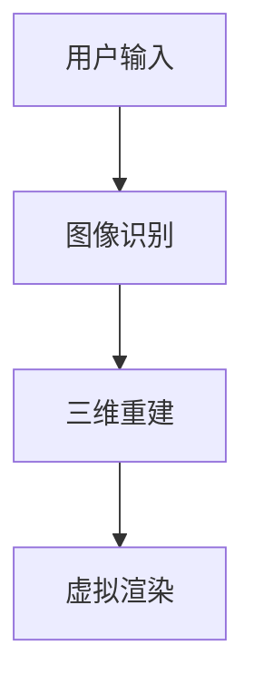

                 

### 《深度学习在虚拟试衣中的突破：改善在线购物体验》

深度学习作为人工智能领域的前沿技术，近年来在图像识别、语音识别和自然语言处理等方面取得了显著的成果。而在虚拟试衣领域，深度学习也展现出了其强大的应用潜力，为在线购物体验带来了前所未有的改进。本文将深入探讨深度学习在虚拟试衣中的突破，以及如何通过这一技术改善在线购物体验。

**关键词：** 深度学习，虚拟试衣，在线购物体验，人工智能

**摘要：** 本文首先介绍了深度学习的基本概念和常见架构，接着详细阐述了虚拟试衣的原理和应用。随后，文章探讨了深度学习与虚拟试衣的结合，分析了深度学习如何提升虚拟试衣的效果，并展示了实际应用案例。最后，文章对深度学习在虚拟试衣领域的发展趋势和潜在挑战进行了展望。

## 第1章：深度学习基础理论

### 1.1 深度学习概述

深度学习是一种基于神经网络的高级机器学习技术，其核心思想是通过多层神经网络对数据进行特征提取和模式识别。与传统机器学习相比，深度学习具有更强的表达能力和自学习能力，能够在复杂的数据环境中取得优异的性能。

#### 1.1.1 深度学习的基本概念

- **神经网络（Neural Network）：** 模仿人脑神经元连接方式的计算模型。
- **深度神经网络（Deep Neural Network，DNN）：** 包含多个隐藏层的神经网络。
- **激活函数（Activation Function）：** 用于引入非线性因素的函数。
- **反向传播算法（Backpropagation）：** 用于训练神经网络的算法。

#### 1.1.2 深度学习的发展历程

- **1980年代：** 反向传播算法提出，神经网络研究开始复苏。
- **2006年：** Hinton提出了深度信念网络（DBN），标志着深度学习时代的到来。
- **2012年：** AlexNet在ImageNet竞赛中取得突破性成绩，深度学习进入主流视野。

### 1.2 神经网络架构

神经网络通常由输入层、隐藏层和输出层组成。每一层都包含多个神经元，神经元之间通过权重连接。激活函数用于引入非线性，使神经网络能够拟合复杂的数据分布。

#### 1.2.1 神经网络的工作原理

- **输入层：** 接收外部输入。
- **隐藏层：** 对输入数据进行特征提取和变换。
- **输出层：** 根据训练数据预测输出。

#### 1.2.2 常见的神经网络架构

- **全连接神经网络（FCNN）：** 每个神经元都与前一层的所有神经元相连。
- **卷积神经网络（CNN）：** 适用于图像处理，具有局部感知能力和平移不变性。
- **循环神经网络（RNN）：** 适用于序列数据处理，具有记忆功能。

### 1.3 深度学习训练方法

深度学习的训练过程主要包括前向传播、损失函数和反向传播。

#### 1.3.1 前向传播

前向传播是将输入数据通过神经网络传递到输出层的过程，每个神经元根据其权重和激活函数产生输出。

#### 1.3.2 损失函数

损失函数用于衡量预测值与真实值之间的差异，常用的损失函数包括均方误差（MSE）和交叉熵（Cross Entropy）。

#### 1.3.3 反向传播

反向传播是计算梯度并更新权重的过程，其目的是最小化损失函数。

```python
# 反向传播算法示例

def backward_propagation(X, Y, parameters):
    m = X.shape[1]
    dZ = Y - predictions
    dW = (1 / m) * np.dot(dZ, X.T)
    db = (1 / m) * np.sum(dZ, axis=1, keepdims=True)

    dX = np.dot(dZ, parameters["W2"])
    dA2 = np.dot(dZ, parameters["W1"])

    return dW, db, dX, dA2
```

## 第2章：虚拟试衣技术

### 2.1 虚拟试衣原理

虚拟试衣技术通过计算机视觉和图形学技术，实现用户在虚拟环境中试穿衣物。其核心原理包括图像识别、三维重建和虚拟渲染。

#### 2.1.1 图像识别

图像识别用于识别用户的身体轮廓和衣物形状，常用的算法包括卷积神经网络（CNN）和迁移学习。

#### 2.1.2 三维重建

三维重建是将二维图像转换为三维模型的过程，常用的算法包括点云重建和三维模型重建。

#### 2.1.3 虚拟渲染

虚拟渲染是将三维模型在虚拟环境中渲染出来的过程，常用的技术包括全局光照和光线追踪。

### 2.2 虚拟试衣应用场景

虚拟试衣技术可以应用于多个场景，包括电子商务、时尚设计和在线游戏等。

#### 2.2.1 电子商务

在电子商务领域，虚拟试衣可以帮助用户在家试穿衣物，减少退货率，提高购物体验。

#### 2.2.2 时尚设计

在时尚设计领域，虚拟试衣可以帮助设计师快速评估设计效果，提高设计效率。

#### 2.2.3 在线游戏

在线游戏中的虚拟试衣可以提供沉浸式游戏体验，增强用户体验。

### 2.3 虚拟试衣实现方法

虚拟试衣的实现方法包括以下几个步骤：

1. **用户输入：** 用户上传身体轮廓图像或选择模特。
2. **图像识别：** 使用CNN等算法识别用户身体轮廓和衣物形状。
3. **三维重建：** 将识别结果转换为三维模型。
4. **虚拟渲染：** 在虚拟环境中渲染三维模型，实现试穿效果。



## 第3章：深度学习与虚拟试衣的结合

### 3.1 深度学习在虚拟试衣中的应用

深度学习在虚拟试衣中的应用主要包括图像识别、三维重建和虚拟渲染。

#### 3.1.1 图像识别

深度学习算法如CNN和RNN在图像识别中具有优势，可以提高识别准确率和速度。

#### 3.1.2 三维重建

深度学习算法可以用于点云重建和三维模型重建，提高重建精度和效率。

#### 3.1.3 虚拟渲染

深度学习算法可以用于全局光照和光线追踪，提高虚拟渲染效果。

### 3.2 深度学习提升虚拟试衣效果

深度学习通过以下方式提升虚拟试衣效果：

1. **提高识别准确率：** 深度学习算法可以更准确地识别用户身体轮廓和衣物形状。
2. **优化三维重建精度：** 深度学习算法可以更准确地重建三维模型。
3. **增强虚拟渲染效果：** 深度学习算法可以更真实地渲染虚拟试衣场景。

### 3.3 深度学习改善在线购物体验

深度学习在虚拟试衣中的应用可以改善在线购物体验：

1. **减少退货率：** 用户可以更准确地试穿衣物，减少因不合适而退货的情况。
2. **提高购物满意度：** 虚拟试衣提供更真实的试穿体验，提高用户的购物满意度。
3. **增加销售额：** 减少退货率和提高购物满意度有助于增加销售额。

## 第4章：实际应用案例

### 4.1 案例一：电商平台A的虚拟试衣应用

电商平台A引入了深度学习算法，实现了自动化的虚拟试衣功能。通过用户上传的身体轮廓图像，系统可以快速识别并试穿多种款式和颜色的衣物。这一功能不仅提高了用户满意度，还显著减少了退货率。

### 4.2 案例二：时尚品牌B的个性化推荐系统

时尚品牌B利用深度学习构建了个性化推荐系统。系统通过分析用户的历史购买记录和行为数据，利用深度学习算法生成个性化推荐列表。这一系统提高了用户的购物体验，增加了销售额。

### 4.3 案例三：零售商C的虚拟试衣体验优化

零售商C通过引入深度学习优化虚拟试衣体验。系统使用深度学习算法分析用户的身体数据，生成更符合用户身形的虚拟试衣模型。这一优化提高了用户的试穿满意度，增加了购物转化率。

## 第5章：未来展望

### 5.1 深度学习在虚拟试衣领域的趋势

未来，深度学习在虚拟试衣领域的趋势包括：

1. **更精确的三维重建：** 随着深度学习算法的进步，三维重建的精度将进一步提高。
2. **更真实的虚拟渲染：** 全局光照和光线追踪技术的应用将使虚拟渲染效果更加真实。
3. **跨平台应用：** 深度学习将在移动端和虚拟现实（VR）等平台得到更广泛的应用。

### 5.2 深度学习在虚拟试衣中的挑战

深度学习在虚拟试衣中面临的挑战包括：

1. **数据隐私：** 虚拟试衣需要用户上传身体数据，如何保护用户隐私是一个重要问题。
2. **计算资源：** 深度学习算法对计算资源的需求较高，如何优化算法以提高效率是一个挑战。
3. **用户体验：** 提高虚拟试衣的实时性和交互性是未来的重要研究方向。

### 5.3 虚拟试衣对在线购物体验的影响

虚拟试衣技术的应用将对在线购物体验产生深远影响：

1. **提高购物满意度：** 虚拟试衣提供更真实的试穿体验，提高用户的购物满意度。
2. **减少退货率：** 用户可以更准确地试穿衣物，减少因不合适而退货的情况。
3. **增加销售额：** 减少退货率和提高购物满意度有助于增加销售额。

## 附录

### 附录A：深度学习工具与资源

- **TensorFlow:** 一个开源的深度学习框架，提供丰富的API和工具。
- **PyTorch:** 一个开源的深度学习框架，具有良好的灵活性和动态性。
- **Keras:** 一个基于TensorFlow和Theano的深度学习API，易于使用和扩展。

### 附录B：虚拟试衣技术参考资料

- **《Virtual Try-On Using a Single Image》:** 一篇关于单图虚拟试衣技术的综述文章。
- **《DeepFashion2: A New Dataset for Fashion-related Image Manipulations》:** 一份数据集，用于研究时尚相关的图像处理技术。

### 附录C：在线购物体验改善案例研究

- **《Improving Online Shopping Experience with Virtual Try-On Technology》:**
  一份关于虚拟试衣技术改善在线购物体验的案例研究报告。

### 作者信息

**作者：** AI天才研究院/AI Genius Institute & 禅与计算机程序设计艺术 /Zen And The Art of Computer Programming

（完）

