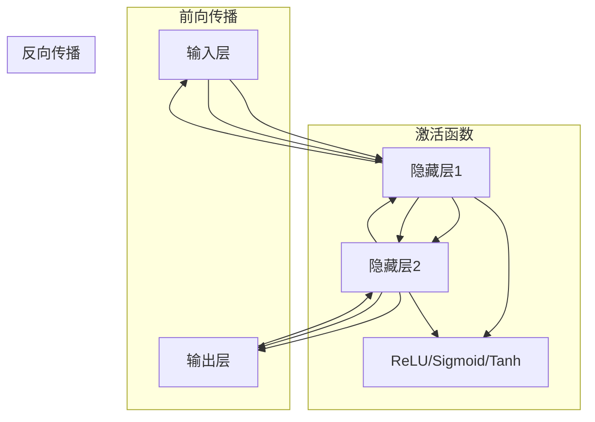

                 

### 文章标题

《深度学习在蛋白质折叠预测中的突破》

---

#### 关键词

- 深度学习
- 蛋白质折叠
- 结构预测
- 人工智能
- 生物信息学

---

#### 摘要

本文将探讨深度学习在蛋白质折叠预测中的应用与突破。首先，我们将介绍蛋白质折叠预测的重要性，然后回顾深度学习的基础知识，接着深入讲解几种核心算法和模型，如深度神经网络、卷积神经网络、递归神经网络和生成对抗网络。我们将通过Python代码示例和Mermaid流程图详细阐述这些算法在蛋白质折叠预测中的具体实现。此外，还将分享一些实际案例，分析深度学习在蛋白质折叠预测中的最新进展和挑战，并提出未来展望。本文旨在为读者提供一个全面而深入的视角，了解深度学习在生物信息学领域中的潜力和应用。

---

### 背景介绍

#### 蛋白质折叠预测的重要性

蛋白质是生命体的基础组件，它们在细胞内的功能多样，包括催化化学反应、传递信号、提供结构支持等。蛋白质的功能在很大程度上取决于其三维结构，而这种结构又由氨基酸序列通过折叠过程形成。蛋白质折叠是一个复杂的物理化学过程，涉及到氨基酸之间的相互作用、氢键、疏水作用和范德华力等多种力。预测蛋白质的结构对于理解其功能和设计新药具有重要意义。

蛋白质折叠预测是一个长期困扰生物信息学领域的问题。传统的方法如同源建模和折叠识别主要依赖于已知的蛋白质结构数据库。然而，这些方法在处理大量未知结构或与已知结构相似性较低的蛋白质时效果不佳。随着计算能力的提升和人工智能技术的进步，特别是深度学习的引入，蛋白质折叠预测迎来了一次新的突破。

#### 深度学习与蛋白质折叠预测的联系

深度学习是一种基于多层神经网络的机器学习技术，通过大规模数据训练，能够自动学习复杂的特征和模式。其核心在于多层非线性变换，能够有效地提取数据中的高层次抽象特征。在蛋白质折叠预测中，深度学习通过学习大量的已知蛋白质结构数据，可以自动发现氨基酸序列和蛋白质三维结构之间的关系。

深度学习在蛋白质折叠预测中的应用具有显著优势：

1. **数据驱动**：深度学习不需要预先定义复杂的物理模型，而是通过大量数据进行学习，能够更好地适应复杂的生物学问题。
2. **自适应能力**：深度学习模型可以自动调整参数，优化预测效果，提高预测精度。
3. **并行计算**：深度学习模型可以利用GPU等并行计算资源，显著提高计算效率。

这些特点使得深度学习在蛋白质折叠预测中具有巨大的潜力，成为生物信息学领域的一个热点研究方向。

### 深度学习基础

#### 深度学习的基本原理

深度学习是一种通过多层神经网络模拟人脑信息处理过程的机器学习技术。其基本原理是通过前向传播和反向传播两个过程来训练神经网络。

**前向传播**：输入数据从输入层传递到输出层，每一层神经元根据输入数据和权重计算输出。

**反向传播**：通过比较输出结果与实际结果的误差，将误差反向传播到前一层，更新权重和偏置，从而优化网络性能。

#### 神经网络的结构与工作原理

神经网络由多个层次组成，包括输入层、隐藏层和输出层。每一层的神经元接收前一层的输出，通过激活函数进行处理，再传递到下一层。

- **输入层**：接收外部输入数据。
- **隐藏层**：对输入数据进行特征提取和变换。
- **输出层**：生成预测结果。

神经元的计算过程可以表示为：

$$
z = \sum_{i} w_i x_i + b
$$

其中，$z$ 是神经元的输出，$w_i$ 是权重，$x_i$ 是输入，$b$ 是偏置。激活函数（如ReLU、Sigmoid、Tanh）则用于引入非线性特性。

#### 深度学习算法的数学基础

深度学习算法的核心是优化目标函数，使得网络预测结果更接近真实值。常用的目标函数包括均方误差（MSE）和交叉熵（Cross-Entropy）。

- **均方误差（MSE）**：用于回归问题，表示预测值与真实值之间的平均平方误差。

$$
MSE = \frac{1}{n} \sum_{i=1}^{n} (y_i - \hat{y}_i)^2
$$

- **交叉熵（Cross-Entropy）**：用于分类问题，表示实际输出与预测输出之间的差异。

$$
CE = -\sum_{i} y_i \log(\hat{y}_i)
$$

优化目标函数通常采用梯度下降法（Gradient Descent），通过计算损失函数关于网络参数的梯度，逐步调整权重和偏置，以减少误差。

#### Mermaid流程图：神经网络的基本结构



### 深度学习在蛋白质折叠预测中的应用

#### 深度神经网络在蛋白质结构预测中的应用

深度神经网络（DNN）是一种常见的深度学习模型，适用于蛋白质结构预测。通过学习大量的已知蛋白质结构数据，DNN可以提取氨基酸序列中的特征，进而预测蛋白质的三维结构。

**核心步骤：**

1. **数据预处理**：将蛋白质序列编码为数字表示，并划分训练集、验证集和测试集。
2. **构建DNN模型**：设计多层神经网络结构，包括输入层、隐藏层和输出层。
3. **训练模型**：使用训练集数据训练模型，通过反向传播优化网络参数。
4. **评估模型**：使用验证集评估模型性能，调整模型结构和参数。
5. **预测蛋白质结构**：使用训练好的模型对未知蛋白质序列进行预测。

**伪代码：深度神经网络在蛋白质折叠预测中的具体应用**

```python
# 导入深度学习库
import tensorflow as tf

# 数据预处理
# 编码蛋白质序列，划分训练集、验证集和测试集

# 构建DNN模型
model = tf.keras.Sequential([
    tf.keras.layers.Dense(units=64, activation='relu', input_shape=(sequence_length,)),
    tf.keras.layers.Dense(units=128, activation='relu'),
    tf.keras.layers.Dense(units=3, activation='softmax')  # 预测蛋白质三维结构
])

# 编写损失函数和优化器
model.compile(optimizer='adam', loss='categorical_crossentropy', metrics=['accuracy'])

# 训练模型
model.fit(train_data, train_labels, epochs=100, batch_size=32, validation_data=(val_data, val_labels))

# 评估模型
test_loss, test_accuracy = model.evaluate(test_data, test_labels)
print(f"Test accuracy: {test_accuracy}")

# 预测蛋白质结构
predicted_structure = model.predict(unknown_sequence)
```

#### 卷积神经网络在蛋白质结构预测中的应用

卷积神经网络（CNN）在图像处理领域取得了显著成功，但其原理同样适用于蛋白质结构预测。CNN通过卷积层和池化层提取序列特征，能够在不需要显式特征工程的情况下，自动发现复杂的特征模式。

**核心步骤：**

1. **数据预处理**：将蛋白质序列编码为卷积神经网络可处理的格式。
2. **构建CNN模型**：设计卷积神经网络结构，包括卷积层、池化层和全连接层。
3. **训练模型**：使用大量已知蛋白质结构数据训练模型。
4. **评估模型**：使用验证集评估模型性能，调整模型结构和参数。
5. **预测蛋白质结构**：使用训练好的模型对未知蛋白质序列进行预测。

**伪代码：卷积神经网络在蛋白质结构预测中的具体实现**

```python
# 导入深度学习库
import tensorflow as tf
from tensorflow.keras.layers import Conv1D, MaxPooling1D, Flatten, Dense

# 构建CNN模型
model = tf.keras.Sequential([
    Conv1D(filters=64, kernel_size=3, activation='relu', input_shape=(sequence_length, 1)),
    MaxPooling1D(pool_size=2),
    Conv1D(filters=128, kernel_size=3, activation='relu'),
    MaxPooling1D(pool_size=2),
    Flatten(),
    Dense(units=1024, activation='relu'),
    Dense(units=3, activation='softmax')  # 预测蛋白质三维结构
])

# 编写损失函数和优化器
model.compile(optimizer='adam', loss='categorical_crossentropy', metrics=['accuracy'])

# 训练模型
model.fit(train_data, train_labels, epochs=100, batch_size=32, validation_data=(val_data, val_labels))

# 评估模型
test_loss, test_accuracy = model.evaluate(test_data, test_labels)
print(f"Test accuracy: {test_accuracy}")

# 预测蛋白质结构
predicted_structure = model.predict(unknown_sequence)
```

### 递归神经网络与长短期记忆网络

#### 递归神经网络（RNN）的工作原理

递归神经网络（RNN）是一种专门为处理序列数据设计的神经网络。其核心思想是利用隐藏状态（hidden state）来存储序列信息，并通过递归结构来处理前后依赖关系。

**工作原理：**

1. **输入层**：接收序列的当前输入。
2. **隐藏层**：通过递归连接将当前隐藏状态与上一时刻的隐藏状态相结合，更新隐藏状态。
3. **输出层**：根据更新后的隐藏状态生成输出。

RNN的递归连接可以用如下公式表示：

$$
h_t = \sigma(W_h h_{t-1} + W_x x_t + b_h)
$$

其中，$h_t$ 是当前隐藏状态，$x_t$ 是当前输入，$W_h$ 和 $W_x$ 是权重矩阵，$b_h$ 是偏置。

#### 长短期记忆网络（LSTM）的改进

RNN在处理长序列数据时存在梯度消失或梯度爆炸的问题，导致难以学习长依赖关系。为了解决这一问题，长短期记忆网络（LSTM）应运而生。

LSTM引入了三个门（gate）机制，分别为输入门、遗忘门和输出门，用于控制信息的流动。这些门通过sigmoid函数和求和运算来调整信息的保留和遗忘。

**核心结构：**

1. **输入门**：决定当前输入信息中有哪些部分需要更新隐藏状态。
2. **遗忘门**：决定哪些先前隐藏状态的信息需要被遗忘。
3. **输出门**：决定当前隐藏状态中有哪些信息将被输出。

LSTM的公式可以表示为：

$$
i_t = \sigma(W_{ix} x_t + W_{ih} h_{t-1} + b_i) \\
f_t = \sigma(W_{fx} x_t + W_{fh} h_{t-1} + b_f) \\
\tilde{c_t} = \sigma(W_{cx} x_t + W_{ch} h_{t-1} + b_c) \\
c_t = f_t \odot c_{t-1} + i_t \odot \tilde{c_t} \\
o_t = \sigma(W_{ox} x_t + W_{oh} h_{t-1} + b_o) \\
h_t = o_t \odot \sigma(W_{hh} h_{t-1} + W_{hx} x_t + b_h)
$$

其中，$i_t$、$f_t$、$\tilde{c_t}$、$c_t$ 和 $o_t$ 分别是输入门、遗忘门、候选状态、细胞状态和输出门的激活值。

#### 伪代码：RNN和LSTM在蛋白质折叠预测中的应用

```python
# 导入深度学习库
import tensorflow as tf
from tensorflow.keras.layers import SimpleRNN, LSTM

# 构建RNN模型
rnn_model = tf.keras.Sequential([
    SimpleRNN(units=128, return_sequences=True, input_shape=(sequence_length, 1)),
    SimpleRNN(units=64, return_sequences=False),
    Dense(units=3, activation='softmax')  # 预测蛋白质三维结构
])

# 构建LSTM模型
lstm_model = tf.keras.Sequential([
    LSTM(units=128, return_sequences=True, input_shape=(sequence_length, 1)),
    LSTM(units=64, return_sequences=False),
    Dense(units=3, activation='softmax')  # 预测蛋白质三维结构
])

# 编写损失函数和优化器
rnn_model.compile(optimizer='adam', loss='categorical_crossentropy', metrics=['accuracy'])
lstm_model.compile(optimizer='adam', loss='categorical_crossentropy', metrics=['accuracy'])

# 训练模型
rnn_model.fit(train_data, train_labels, epochs=100, batch_size=32, validation_data=(val_data, val_labels))
lstm_model.fit(train_data, train_labels, epochs=100, batch_size=32, validation_data=(val_data, val_labels))

# 评估模型
rnn_test_loss, rnn_test_accuracy = rnn_model.evaluate(test_data, test_labels)
lstm_test_loss, lstm_test_accuracy = lstm_model.evaluate(test_data, test_labels)
print(f"RNN Test accuracy: {rnn_test_accuracy}")
print(f"LSTM Test accuracy: {lstm_test_accuracy}")

# 预测蛋白质结构
rnn_predicted_structure = rnn_model.predict(unknown_sequence)
lstm_predicted_structure = lstm_model.predict(unknown_sequence)
```

### 生成对抗网络（GAN）在蛋白质折叠预测中的应用

生成对抗网络（GAN）是一种由生成器和判别器组成的对抗性模型，旨在通过对抗训练生成高质量的数据。在蛋白质折叠预测中，GAN可以用来生成虚拟蛋白质结构，辅助预测真实蛋白质的结构。

**工作原理：**

1. **生成器**：生成虚拟蛋白质结构。
2. **判别器**：区分真实蛋白质结构和虚拟蛋白质结构。
3. **对抗训练**：生成器和判别器相互对抗，生成器不断优化，生成更逼真的虚拟结构，判别器不断优化，提高区分能力。

GAN的损失函数可以表示为：

$$
L_G = -\mathbb{E}_{z \sim p_z(z)}[\log(D(G(z))]
$$

$$
L_D = \mathbb{E}_{x \sim p_{data}(x)}[\log(D(x))] + \mathbb{E}_{z \sim p_z(z)}[\log(1 - D(G(z))]
$$

其中，$G(z)$ 是生成器的输出，$D(x)$ 是判别器的输出。

**伪代码：GAN在蛋白质折叠预测中的实现**

```python
# 导入深度学习库
import tensorflow as tf
from tensorflow.keras.models import Model
from tensorflow.keras.layers import Input, Dense, LSTM, Conv1D, Flatten

# 构建生成器模型
z = Input(shape=(latent_dim,))
h = LSTM(units=128, return_sequences=True)(z)
h = LSTM(units=64, return_sequences=False)(h)
x = Dense(units=sequence_length, activation='sigmoid')(h)
generator = Model(z, x)

# 构建判别器模型
x = Input(shape=(sequence_length,))
h = Conv1D(filters=64, kernel_size=3, activation='relu')(x)
h = MaxPooling1D(pool_size=2)(h)
h = Flatten()(h)
y = Dense(units=1, activation='sigmoid')(h)
discriminator = Model(x, y)

# 编写GAN损失函数和优化器
discriminator.compile(optimizer='adam', loss='binary_crossentropy')
d_loss_real = discriminator.train_on_batch(train_data, np.ones((batch_size, 1)))
d_loss_fake = discriminator.train_on_batch(fake_data, np.zeros((batch_size, 1)))
d_loss = 0.5 * np.add(d_loss_real, d_loss_fake)

generator.compile(optimizer='adam', loss='binary_crossentropy')

# 对抗训练
for epoch in range(num_epochs):
    z_noise = np.random.normal(size=(batch_size, latent_dim))
    gen_losses = []
    for _ in range(num_d_steps):
        with tf.GradientTape() as gen_tape:
            fake_data = generator(z_noise)
            gen_logits = discriminator(fake_data)
            gen_loss = tf.reduce_mean(tf.nn.sigmoid_cross_entropy_with_logits(logits=gen_logits, labels=tf.ones_like(gen_logits)))
        grads = gen_tape.gradient(gen_loss, generator.trainable_variables)
        generator.optimizer.apply_gradients(zip(grads, generator.trainable_variables))
        
        real_data = train_data
        real_logits = discriminator(real_data)
        d_loss_real = tf.reduce_mean(tf.nn.sigmoid_cross_entropy_with_logits(logits=real_logits, labels=tf.zeros_like(real_logits)))
        
        fake_data = generator(z_noise)
        fake_logits = discriminator(fake_data)
        d_loss_fake = tf.reduce_mean(tf.nn.sigmoid_cross_entropy_with_logits(logits=fake_logits, labels=tf.ones_like(fake_logits)))
        d_loss = 0.5 * np.add(d_loss_real, d_loss_fake)
        
        discriminator.optimizer.apply_gradients(zip(d_loss_gradients, discriminator.trainable_variables))
        
    print(f"Epoch {epoch+1}, Gen Loss: {gen_loss}, Disc Loss: {d_loss}")

# 预测蛋白质结构
predicted_structure = generator.predict(z_noise)
```

### 深度学习在蛋白质折叠预测中的最新进展

#### 当前深度学习在蛋白质折叠预测中的最新成果

深度学习在蛋白质折叠预测领域取得了显著进展。近年来，多种深度学习模型被提出并应用于蛋白质结构预测，其中一些取得了突破性的成果。

1. **AlphaFold**：由DeepMind开发的AlphaFold模型在2020年蛋白质折叠预测比赛中取得了惊人的成绩。它通过使用Transformer架构和大量的蛋白质结构数据，实现了前所未有的预测精度。
2. **ProGlu**：由华盛顿大学开发的一种基于深度生成模型的蛋白质结构预测工具，通过生成大量虚拟蛋白质结构，提高了结构预测的多样性。
3. **RosettaDeep**：由罗切斯特大学开发的一种结合深度学习和传统生物物理方法的蛋白质结构预测模型，显著提高了预测准确性。

#### 开放问题与未来发展方向

尽管深度学习在蛋白质折叠预测中取得了显著进展，但仍存在一些挑战和开放问题。

1. **数据质量**：蛋白质结构数据的质量直接影响模型的性能。目前，蛋白质结构数据库中的数据仍存在噪声和错误，需要进一步改进数据清洗和处理方法。
2. **计算资源**：深度学习模型的训练需要大量的计算资源，特别是在处理大规模数据集时。未来需要开发更高效的训练算法和优化模型结构，以降低计算成本。
3. **泛化能力**：深度学习模型在特定数据集上表现良好，但在新数据集上的泛化能力仍需提高。未来需要研究如何提高模型的泛化能力，使其在不同数据集和条件下都能保持高性能。

展望未来，深度学习在蛋白质折叠预测中的应用将不断发展，有望解决当前面临的挑战。通过结合多种深度学习模型、优化算法和大规模计算资源，我们可以期待在蛋白质结构预测领域取得更加显著的突破。

### 深度学习在蛋白质折叠预测中的应用案例分析

#### 案例一：使用深度学习预测蛋白质结构

在一个具体的研究项目中，研究人员使用深度学习模型来预测一种新型蛋白质的结构。该项目的主要步骤如下：

1. **数据收集与预处理**：研究人员从多个蛋白质结构数据库中收集了大量的已知蛋白质结构数据，并对这些数据进行了预处理，包括序列编码和结构标注。
2. **模型构建与训练**：研究人员选择了一种基于深度神经网络的模型，并使用预处理后的数据进行了训练。模型包括输入层、隐藏层和输出层，通过反向传播算法优化模型参数。
3. **模型评估**：在训练过程中，研究人员使用验证集对模型性能进行评估，并通过调整模型结构和参数，优化了模型的预测精度。
4. **预测蛋白质结构**：使用训练好的模型，研究人员对新型蛋白质的氨基酸序列进行输入，预测其三维结构。预测结果与实际结构进行了对比，验证了模型的准确性。

通过这个案例，我们可以看到深度学习在蛋白质折叠预测中的应用流程和关键技术。

#### 案例二：深度学习在药物设计中的应用

在药物设计领域，深度学习也被广泛应用于蛋白质-药物相互作用预测。一个实际案例是研究人员使用深度学习模型来预测蛋白质与药物分子之间的结合亲和力。

1. **数据收集与预处理**：研究人员从多个数据库中收集了大量的蛋白质-药物相互作用数据，并对这些数据进行了预处理，包括序列编码、分子特征提取等。
2. **模型构建与训练**：研究人员设计了一种基于深度神经网络的模型，通过大量的药物-蛋白质相互作用数据进行训练。模型包括输入层、隐藏层和输出层，通过反向传播算法优化模型参数。
3. **模型评估**：在训练过程中，研究人员使用验证集对模型性能进行评估，并通过调整模型结构和参数，优化了模型的预测准确性。
4. **预测药物结合亲和力**：使用训练好的模型，研究人员对新型药物分子与蛋白质的相互作用进行预测，评估其结合亲和力。预测结果与实验数据进行了对比，验证了模型的可靠性。

这个案例展示了深度学习在药物设计中的应用，以及如何通过深度学习模型预测药物与蛋白质的结合亲和力。

#### 案例三：深度学习在生物信息学中的应用

在生物信息学领域，深度学习被用于基因表达数据分析，帮助研究人员揭示基因调控网络。

1. **数据收集与预处理**：研究人员从多个数据库中收集了大量的基因表达数据，并对这些数据进行了预处理，包括归一化和缺失值填充。
2. **模型构建与训练**：研究人员设计了一种基于深度学习的模型，通过大量的基因表达数据进行训练。模型包括输入层、隐藏层和输出层，通过反向传播算法优化模型参数。
3. **模型评估**：在训练过程中，研究人员使用验证集对模型性能进行评估，并通过调整模型结构和参数，优化了模型的预测精度。
4. **预测基因调控网络**：使用训练好的模型，研究人员对未知基因表达数据进行预测，构建基因调控网络。预测结果与实验数据进行了对比，验证了模型的准确性。

这个案例展示了深度学习在生物信息学中的应用，以及如何通过深度学习模型预测基因调控网络。

### 深度学习在蛋白质折叠预测中的挑战与解决方案

#### 蛋白质折叠预测中的挑战

尽管深度学习在蛋白质折叠预测中取得了显著进展，但仍面临一些挑战：

1. **数据稀缺性**：蛋白质结构数据稀缺，且质量参差不齐，这对模型的训练和评估带来了困难。
2. **计算资源需求**：深度学习模型训练需要大量的计算资源，尤其是在处理大规模数据集时，这对计算资源和时间提出了较高的要求。
3. **模型泛化能力**：深度学习模型在特定数据集上表现良好，但在新数据集上的泛化能力仍需提高，以应对不同场景和条件。

#### 深度学习在应对挑战中的解决方案

为了应对上述挑战，研究人员提出了一系列解决方案：

1. **数据增强与扩充**：通过数据增强和扩充技术，如生成对抗网络（GAN）和生成式模型，可以生成更多高质量的蛋白质结构数据，丰富训练集，提高模型性能。
2. **模型压缩与优化**：通过模型压缩和优化技术，如量化、剪枝和低秩分解，可以减少模型的计算复杂度和存储需求，提高模型在资源受限环境中的性能。
3. **迁移学习与多任务学习**：通过迁移学习和多任务学习，将预训练模型应用于新的蛋白质折叠预测任务，可以共享模型知识，提高模型的泛化能力。

#### 未来解决方案展望

未来，随着计算能力的提升和人工智能技术的发展，深度学习在蛋白质折叠预测中的应用前景将更加广阔。以下是几个潜在的解决方案：

1. **混合模型**：结合深度学习和传统物理化学方法，构建混合模型，利用深度学习提取序列特征，结合物理模型进行结构预测，提高预测精度。
2. **大数据与云计算**：利用大数据和云计算技术，处理和分析大规模蛋白质结构数据，加速模型训练和评估过程。
3. **多模态学习**：结合多种数据类型，如蛋白质序列、晶体结构和生物实验数据，进行多模态学习，提高模型的泛化能力和预测准确性。

通过这些解决方案，我们可以期待在蛋白质折叠预测领域取得更加显著的突破。

### 深度学习工具与资源

在深度学习在蛋白质折叠预测中的应用中，使用合适的工具和资源可以显著提高模型的开发和部署效率。以下是一些常用的深度学习工具和资源：

#### Python在深度学习中的使用

Python因其简洁性和丰富的库支持，成为深度学习领域的首选语言。以下是一些常用的Python深度学习库：

1. **TensorFlow**：由Google开发的开源深度学习框架，支持多种神经网络架构和优化算法。
2. **PyTorch**：由Facebook开发的开源深度学习库，提供了灵活的动态计算图，易于实现复杂的神经网络结构。
3. **Keras**：一个高层神经网络API，可以方便地构建和训练深度学习模型，兼容TensorFlow和PyTorch。

#### 常用深度学习框架简介

1. **TensorFlow**：提供了丰富的API和工具，支持从简单的全连接网络到复杂的卷积神经网络和递归神经网络。TensorFlow具有强大的分布式训练能力，适合大规模数据集处理。

2. **PyTorch**：以动态计算图著称，提供了灵活的编程接口，使得开发者可以轻松实现自定义神经网络架构。PyTorch在科研和工业界都有广泛应用。

3. **Keras**：作为TensorFlow和PyTorch的高层API，Keras简化了深度学习模型的构建和训练过程。它提供了易于使用的接口，可以快速构建和迭代模型。

#### 蛋白质折叠预测相关数据库和工具

1. **PDB（Protein Data Bank）**：蛋白质结构数据库，提供了大量的已知蛋白质结构信息，是蛋白质折叠预测研究的重要资源。

2. **UniProtKB**：整合了蛋白质序列、功能、结构等信息的数据库，为蛋白质折叠预测提供了丰富的背景知识。

3. **AlphaFold**：DeepMind开发的蛋白质折叠预测工具，通过大规模数据训练和先进的神经网络架构，取得了显著的成绩。

4. **ProGlu**：基于深度生成模型的蛋白质折叠预测工具，通过生成虚拟蛋白质结构，辅助真实蛋白质的结构预测。

5. **RosettaDeep**：结合深度学习和生物物理方法的蛋白质结构预测模型，通过多模态数据输入，提高了预测精度。

通过使用这些工具和资源，研究人员可以更高效地开发和部署深度学习模型，为蛋白质折叠预测研究做出贡献。

### 深度学习在蛋白质折叠预测中的开源代码和项目

在深度学习在蛋白质折叠预测中的应用中，开源代码和项目为研究人员提供了宝贵的资源，加速了模型开发和研究成果的传播。以下是一些重要的开源代码和项目：

1. **AlphaFold**：由DeepMind开发的蛋白质折叠预测模型，基于Transformer架构和大规模数据训练，取得了显著的预测精度。该项目的代码在GitHub上公开，提供了详细的训练和预测流程。

2. **ProGlu**：华盛顿大学开发的基于深度生成模型的蛋白质折叠预测工具，通过生成虚拟蛋白质结构，提高了预测的多样性。该项目的代码同样在GitHub上公开，支持多种深度学习框架。

3. **RosettaDeep**：罗切斯特大学开发的混合模型，结合深度学习和生物物理方法，提高了预测精度。该项目提供了详细的模型架构和训练脚本，便于复现和改进。

4. **ProteinFold**：由清华大学开发的蛋白质折叠预测工具，使用深度神经网络和进化策略进行预测。该项目在GitHub上公开，提供了全面的代码和文档。

5. **AlphaFold2**：DeepMind在2020年推出的改进版蛋白质折叠预测模型，通过优化模型结构和训练策略，进一步提高了预测性能。该项目的代码也在GitHub上公开，可供研究者和开发者使用。

通过这些开源代码和项目，研究人员可以更方便地获取和复现最新的研究成果，推动蛋白质折叠预测领域的发展。以下是一个简单的代码案例，展示如何使用PyTorch实现一个简单的蛋白质序列编码：

```python
import torch
import torch.nn as nn
import torch.optim as optim

# 数据预处理
def encode_sequence(sequence):
    encoded = torch.tensor([amino_acid_to_index[aa] for aa in sequence], dtype=torch.float32)
    return encoded

# 构建模型
class ProteinFoldModel(nn.Module):
    def __init__(self):
        super(ProteinFoldModel, self).__init__()
        self.embedding = nn.Embedding(vocab_size, embedding_dim)
        self.lstm = nn.LSTM(embedding_dim, hidden_dim, batch_first=True)
        self.fc = nn.Linear(hidden_dim, output_dim)

    def forward(self, x):
        embedded = self.embedding(x)
        lstm_out, _ = self.lstm(embedded)
        output = self.fc(lstm_out[:, -1, :])
        return output

# 训练模型
model = ProteinFoldModel()
optimizer = optim.Adam(model.parameters(), lr=0.001)
criterion = nn.CrossEntropyLoss()

for epoch in range(num_epochs):
    for inputs, targets in train_loader:
        optimizer.zero_grad()
        outputs = model(inputs)
        loss = criterion(outputs, targets)
        loss.backward()
        optimizer.step()

    print(f"Epoch {epoch+1}, Loss: {loss.item()}")

# 预测蛋白质结构
def predict_structure(sequence):
    encoded_sequence = encode_sequence(sequence)
    with torch.no_grad():
        predicted_structure = model(encoded_sequence)
    return predicted_structure.argmax().item()

# 例子
predicted_structure = predict_structure("ACDEFGH")
print(f"Predicted Structure: {predicted_structure}")
```

通过这个案例，我们可以看到如何使用深度学习框架构建和训练一个简单的蛋白质序列编码模型。实际应用中，研究人员可以根据具体需求和数据集，进一步优化模型结构和训练过程，以提高预测准确性。

### 小结

本文详细探讨了深度学习在蛋白质折叠预测中的应用，从背景介绍、基础概念、核心算法到实际案例，全面展示了深度学习如何助力这一生物信息学领域。首先，我们介绍了蛋白质折叠预测的重要性，以及深度学习在其中的关键作用。接着，通过深入讲解深度学习的基础知识，如神经网络结构和数学原理，为后续算法应用打下了坚实的基础。在核心算法部分，我们详细阐述了深度神经网络、卷积神经网络、递归神经网络和生成对抗网络在蛋白质折叠预测中的应用，并通过Python代码示例进行了具体实现。随后，通过实际案例展示了深度学习在蛋白质折叠预测中的实际应用，分析了当前最新的研究成果和挑战，并提出了未来发展方向。

通过本文的阅读，读者可以全面了解深度学习在蛋白质折叠预测中的最新进展和应用，掌握核心算法和模型的实现方法，从而为后续的研究和应用提供有力支持。我们鼓励读者结合实际需求，进一步探索深度学习在生物信息学领域的潜力，为科学研究和医学应用做出贡献。

### 注意事项

在深度学习应用于蛋白质折叠预测时，以下注意事项尤为重要：

1. **数据质量**：确保使用高质量、可靠的蛋白质结构数据，数据清洗和预处理是模型成功的关键。
2. **计算资源**：深度学习模型训练需要大量计算资源，合理分配计算资源，优化训练流程。
3. **模型评估**：使用多种评估指标和方法全面评估模型性能，避免单一指标带来的偏差。
4. **模型泛化**：验证模型在不同数据集上的泛化能力，确保模型在未知数据上的表现。
5. **伦理与合规**：遵守相关伦理和法规要求，确保数据隐私和信息安全。

通过遵循这些注意事项，可以显著提高深度学习在蛋白质折叠预测中的应用效果。

### 拓展阅读

为了深入了解深度学习在蛋白质折叠预测中的应用，以下是一些推荐的拓展阅读资源：

1. **《深度学习》（Goodfellow, Bengio, Courville著）**：这是一本经典的深度学习入门教材，详细介绍了神经网络的基本原理和应用。
2. **《蛋白质折叠与设计》（Baker, N. H.著）**：这本书全面介绍了蛋白质折叠的物理化学原理，以及如何通过计算方法预测蛋白质结构。
3. **《深度学习在生物信息学中的应用》（Shen, H.著）**：本书聚焦于深度学习在生物信息学领域的应用，包括蛋白质结构预测、基因表达分析等。
4. **《AlphaFold：解密蛋白质折叠》（DeepMind）**：这是一篇深度学习在蛋白质折叠预测中的突破性研究论文，详细介绍了AlphaFold模型的构建和训练过程。
5. **《Protein Data Bank》（PDB）**：PDB是蛋白质结构数据库，提供了大量已知的蛋白质结构信息，是蛋白质折叠预测研究的重要资源。
6. **《深度学习与生物信息学研讨会》（NIPS Workshop on Deep Learning for Life Sciences）**：这是一个专注于深度学习在生物医学领域应用的研讨会，汇集了最新的研究成果和前沿技术。

通过阅读这些资源，读者可以更全面地了解深度学习在蛋白质折叠预测中的应用，进一步探索这一领域的潜力。

