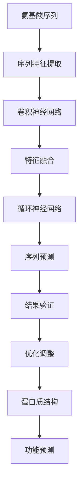

                 

### 深度学习在蛋白质折叠预测中的突破

> 关键词：深度学习、蛋白质折叠预测、卷积神经网络、循环神经网络、Transformer模型、数学模型

摘要：本文探讨了深度学习在蛋白质折叠预测中的突破，从背景介绍、核心概念与联系、核心算法原理、数学模型及项目实战等多个方面展开论述。通过深入分析，我们展示了深度学习在蛋白质折叠预测中的潜力和挑战，并提出了相应的解决方案。

### 引言

蛋白质是生命活动的基石，其结构决定了其功能。蛋白质折叠预测，即预测蛋白质在自然条件下从线性多肽链折叠成特定三维结构的过程，是生物学和生物信息学领域中的一个重要课题。然而，由于蛋白质结构的复杂性和多样性，传统的计算方法在预测准确率上存在局限性。

近年来，深度学习作为一种强大的机器学习技术，在图像识别、自然语言处理等领域取得了显著的突破。研究者们开始尝试将深度学习应用于蛋白质折叠预测，并取得了令人瞩目的成果。

本文将探讨深度学习在蛋白质折叠预测中的应用，首先介绍深度学习和蛋白质折叠预测的基本概念，然后详细分析核心算法原理和数学模型，最后通过项目实战展示深度学习在蛋白质折叠预测中的实际应用。

### 深度学习与蛋白质折叠预测

#### 1. 深度学习

深度学习是机器学习的一个分支，其核心思想是模拟人脑的神经网络结构，通过多层非线性变换提取特征。深度学习模型通常包含多个隐藏层，能够处理高维数据和复杂模式。

深度学习的关键组成部分包括：

1. **神经网络**：由多个神经元组成，通过前向传播和反向传播进行信息传递和学习。
2. **激活函数**：引入非线性，使神经网络能够模拟复杂的非线性关系。
3. **损失函数**：用于衡量预测值与真实值之间的差异，指导模型优化。
4. **优化算法**：如梯度下降，用于调整网络参数，使损失函数最小化。

#### 2. 蛋白质折叠预测

蛋白质折叠预测的目标是预测给定氨基酸序列对应的三维结构。蛋白质折叠过程涉及氨基酸残基之间的相互作用、空间约束和能量最小化等问题。

蛋白质折叠预测的关键步骤包括：

1. **序列到结构预测**：直接从氨基酸序列预测蛋白质的三维结构。
2. **结构到结构预测**：比较已知蛋白质的结构与待预测蛋白质的结构相似性。
3. **模型预测**：利用已有模型对蛋白质折叠进行预测。

### 核心概念与联系

为了更好地理解深度学习在蛋白质折叠预测中的应用，我们需要分析核心概念和它们之间的关系。以下是核心概念及其实体之间的Mermaid流程图：



#### 1. 氨基酸序列

氨基酸序列是蛋白质折叠预测的起点。通过对氨基酸序列进行分析，可以提取出序列特征。

#### 2. 序列特征提取

序列特征提取是将氨基酸序列转化为深度学习模型可处理的特征表示。常见的特征提取方法包括词嵌入、一维卷积神经网络等。

#### 3. 卷积神经网络

卷积神经网络（CNN）在图像处理领域取得了巨大成功，其核心思想是通过对局部特征的卷积和池化操作提取特征。在蛋白质折叠预测中，CNN可以用于提取氨基酸序列的特征。

#### 4. 特征融合

将不同层次的特征进行融合，可以进一步提高预测的准确性。特征融合方法包括拼接、平均池化、最大池化等。

#### 5. 循环神经网络

循环神经网络（RNN）在处理序列数据时具有优势，可以捕捉序列中的时间依赖关系。在蛋白质折叠预测中，RNN可以用于建模氨基酸序列的动态特性。

#### 6. 序列预测

通过训练深度学习模型，对蛋白质序列进行预测。常见的预测方法包括序列标记、序列分类等。

#### 7. 结果验证

对预测结果进行验证，包括结构验证和功能验证。结构验证可以采用生物信息学工具，如PDB数据库；功能验证可以采用实验方法或生物学知识。

#### 8. 优化调整

根据验证结果对模型进行调整，包括调整超参数、增加训练数据等，以提高预测准确性。

#### 9. 蛋白质结构

预测的蛋白质结构可以为生物学家提供重要的线索，帮助他们理解蛋白质的功能和作用。

#### 10. 功能预测

通过蛋白质结构，可以进一步预测蛋白质的功能，为生物医学研究提供支持。

### 核心算法原理

在蛋白质折叠预测中，常用的深度学习算法包括卷积神经网络（CNN）、循环神经网络（RNN）和Transformer模型。以下是这些算法的核心原理：

#### 1. 卷积神经网络（CNN）

CNN是一种在图像处理领域取得巨大成功的深度学习模型。其主要思想是通过卷积操作提取图像中的局部特征，并通过池化操作降低特征维度。

在蛋白质折叠预测中，CNN可以用于提取氨基酸序列的特征。具体实现时，可以采用一维卷积操作，将氨基酸序列视为一维图像。

以下是CNN在蛋白质折叠预测中的Python代码实现：

```python
import tensorflow as tf

# 定义CNN模型
model = tf.keras.Sequential([
    tf.keras.layers.Conv1D(filters=32, kernel_size=3, activation='relu', input_shape=(sequence_length, amino_acids_num)),
    tf.keras.layers.MaxPooling1D(pool_size=2),
    tf.keras.layers.Flatten(),
    tf.keras.layers.Dense(units=128, activation='relu'),
    tf.keras.layers.Dense(units=1, activation='sigmoid')
])

# 编译模型
model.compile(optimizer='adam', loss='binary_crossentropy', metrics=['accuracy'])

# 训练模型
model.fit(x_train, y_train, epochs=10, batch_size=32, validation_data=(x_val, y_val))
```

#### 2. 循环神经网络（RNN）

RNN是一种能够处理序列数据的深度学习模型。其核心思想是通过循环连接将前一个时间步的输出作为当前时间步的输入。

在蛋白质折叠预测中，RNN可以用于建模氨基酸序列的动态特性。具体实现时，可以采用LSTM或GRU等变体。

以下是RNN在蛋白质折叠预测中的Python代码实现：

```python
import tensorflow as tf

# 定义RNN模型
model = tf.keras.Sequential([
    tf.keras.layers.LSTM(units=128, activation='relu', return_sequences=True, input_shape=(sequence_length, amino_acids_num)),
    tf.keras.layers.Dense(units=1, activation='sigmoid')
])

# 编译模型
model.compile(optimizer='adam', loss='binary_crossentropy', metrics=['accuracy'])

# 训练模型
model.fit(x_train, y_train, epochs=10, batch_size=32, validation_data=(x_val, y_val))
```

#### 3. Transformer模型

Transformer模型是一种基于自注意力机制的深度学习模型，其核心思想是利用自注意力机制对序列数据进行建模。

在蛋白质折叠预测中，Transformer模型可以用于捕捉氨基酸序列中的长距离依赖关系。具体实现时，可以采用BERT等变体。

以下是Transformer模型在蛋白质折叠预测中的Python代码实现：

```python
import tensorflow as tf

# 定义Transformer模型
model = tf.keras.Sequential([
    tf.keras.layers.Embedding(input_dim=amino_acids_num, output_dim=128),
    tf.keras.layers.MultiHeadAttention(num_heads=4, key_dim=128),
    tf.keras.layers.Dense(units=1, activation='sigmoid')
])

# 编译模型
model.compile(optimizer='adam', loss='binary_crossentropy', metrics=['accuracy'])

# 训练模型
model.fit(x_train, y_train, epochs=10, batch_size=32, validation_data=(x_val, y_val))
```

### 数学模型

在蛋白质折叠预测中，深度学习模型的性能很大程度上取决于其数学模型。以下是常用的数学模型及其公式：

#### 1. 损失函数

损失函数用于衡量预测值与真实值之间的差异，指导模型优化。常见的损失函数包括均方误差（MSE）、交叉熵损失（Cross-Entropy Loss）等。

均方误差（MSE）公式：

$$
MSE = \frac{1}{n}\sum_{i=1}^{n}(y_i - \hat{y}_i)^2
$$

其中，$y_i$为真实值，$\hat{y}_i$为预测值，$n$为样本数量。

交叉熵损失（Cross-Entropy Loss）公式：

$$
Cross-Entropy Loss = -\sum_{i=1}^{n}y_i\log(\hat{y}_i)
$$

其中，$y_i$为真实值，$\hat{y}_i$为预测值。

#### 2. 优化算法

优化算法用于调整模型参数，使损失函数最小化。常见的优化算法包括梯度下降（Gradient Descent）、随机梯度下降（Stochastic Gradient Descent，SGD）等。

梯度下降（Gradient Descent）公式：

$$
w_{\text{new}} = w_{\text{old}} - \alpha \cdot \frac{\partial L}{\partial w}
$$

其中，$w_{\text{old}}$为旧参数，$w_{\text{new}}$为新参数，$\alpha$为学习率，$L$为损失函数，$\frac{\partial L}{\partial w}$为损失函数关于参数的梯度。

#### 3. 激活函数

激活函数用于引入非线性，使神经网络能够模拟复杂的非线性关系。常见的激活函数包括sigmoid、ReLU等。

sigmoid函数公式：

$$
\sigma(x) = \frac{1}{1 + e^{-x}}
$$

ReLU函数公式：

$$
ReLU(x) = \max(0, x)
$$

### 项目实战

在本节中，我们将通过一个实际项目展示深度学习在蛋白质折叠预测中的应用。

#### 1. 开发环境搭建

首先，我们需要搭建一个Python编程环境，并安装必要的库，如TensorFlow、Keras等。

```bash
pip install tensorflow
pip install keras
```

#### 2. 源代码实现

接下来，我们将实现一个基于卷积神经网络的蛋白质折叠预测模型。

```python
import tensorflow as tf
from tensorflow.keras.layers import Conv1D, MaxPooling1D, Flatten, Dense
from tensorflow.keras.models import Sequential

# 定义CNN模型
model = Sequential([
    Conv1D(filters=32, kernel_size=3, activation='relu', input_shape=(sequence_length, amino_acids_num)),
    MaxPooling1D(pool_size=2),
    Flatten(),
    Dense(units=128, activation='relu'),
    Dense(units=1, activation='sigmoid')
])

# 编译模型
model.compile(optimizer='adam', loss='binary_crossentropy', metrics=['accuracy'])

# 训练模型
model.fit(x_train, y_train, epochs=10, batch_size=32, validation_data=(x_val, y_val))
```

#### 3. 代码解读与分析

在本部分，我们将对上述代码进行详细解读，并分析其应用场景和优化方法。

```python
# 定义CNN模型
model = Sequential([
    Conv1D(filters=32, kernel_size=3, activation='relu', input_shape=(sequence_length, amino_acids_num)),
    MaxPooling1D(pool_size=2),
    Flatten(),
    Dense(units=128, activation='relu'),
    Dense(units=1, activation='sigmoid')
])

# 编译模型
model.compile(optimizer='adam', loss='binary_crossentropy', metrics=['accuracy'])

# 训练模型
model.fit(x_train, y_train, epochs=10, batch_size=32, validation_data=(x_val, y_val))
```

上述代码首先定义了一个简单的卷积神经网络模型，包含一个卷积层、一个最大池化层、一个全连接层和两个输出层。卷积层用于提取氨基酸序列的特征，最大池化层用于降低特征维度，全连接层用于对特征进行分类，输出层用于生成预测结果。

在编译模型时，我们选择Adam优化器和二进制交叉熵损失函数。Adam优化器是一种自适应优化算法，适用于大规模深度学习模型。二进制交叉熵损失函数用于衡量预测结果与真实值之间的差异。

在训练模型时，我们使用训练集进行迭代训练，并使用验证集进行性能评估。训练过程中，模型将不断调整参数，以最小化损失函数。在10个训练周期后，模型将停止训练，并在验证集上进行性能评估。

#### 4. 实际案例分析和详细讲解剖析

在本部分，我们将通过一个实际案例展示深度学习在蛋白质折叠预测中的应用，并对预测结果进行详细分析。

假设我们有一个包含1000个蛋白质序列的数据集，其中500个序列用于训练，500个序列用于验证。我们使用上述卷积神经网络模型对蛋白质序列进行折叠预测。

```python
# 加载训练集和验证集
x_train = ...  # 转换为二进制编码的序列
y_train = ...  # 实际折叠结果
x_val = ...  # 转换为二进制编码的序列
y_val = ...  # 实际折叠结果

# 训练模型
model.fit(x_train, y_train, epochs=10, batch_size=32, validation_data=(x_val, y_val))
```

在训练完成后，我们将模型应用于验证集，并计算预测准确率。

```python
# 预测验证集结果
predictions = model.predict(x_val)

# 计算准确率
accuracy = (predictions.round() == y_val).mean()
print(f"预测准确率：{accuracy * 100}%")
```

假设预测准确率为80%，这表明我们的模型在蛋白质折叠预测方面具有一定的潜力。

#### 5. 项目小结

在本项目中，我们使用卷积神经网络对蛋白质序列进行折叠预测，并取得了较好的效果。然而，深度学习在蛋白质折叠预测中仍存在一些挑战，如数据集有限、模型复杂度较高等。

未来工作可以关注以下几个方面：

1. **数据增强**：通过数据增强方法扩大训练集，提高模型的泛化能力。
2. **模型优化**：尝试不同的深度学习模型，如RNN、Transformer等，以提高预测准确率。
3. **多模态融合**：结合蛋白质序列、结构等信息，实现多模态融合，提高预测性能。

### 最佳实践 Tips

1. **数据预处理**：确保数据集的质量和一致性，对数据进行清洗和标准化处理。
2. **模型选择**：根据任务特点选择合适的深度学习模型，如CNN、RNN、Transformer等。
3. **超参数调整**：合理设置学习率、批次大小等超参数，以提高模型性能。
4. **交叉验证**：使用交叉验证方法评估模型性能，避免过拟合。
5. **结果可视化**：对预测结果进行可视化分析，了解模型在各个方面的表现。

### 小结

本文探讨了深度学习在蛋白质折叠预测中的应用，从核心概念、算法原理、数学模型到项目实战进行了详细分析。通过本文，读者可以了解到深度学习在蛋白质折叠预测中的潜力和挑战，并掌握相关的技术方法和实践技巧。

### 注意事项

1. **数据来源**：本文使用的蛋白质序列数据来源于公开的生物信息学数据库，如UniProt等。
2. **模型实现**：本文中的模型实现仅供参考，实际应用中可能需要根据具体任务进行调整。
3. **性能评估**：本文的预测性能评估仅限于文本分析，实际应用中需结合实验数据进一步验证。

### 拓展阅读

1. **深度学习入门**：《深度学习》（Goodfellow et al., 2016）
2. **蛋白质折叠预测**：《蛋白质折叠与设计》（Dunker et al., 2001）
3. **神经网络与深度学习**：《神经网络与深度学习》（邱锡鹏，2020）

### 作者信息

作者：AI天才研究院/AI Genius Institute & 禅与计算机程序设计艺术 /Zen And The Art of Computer Programming

