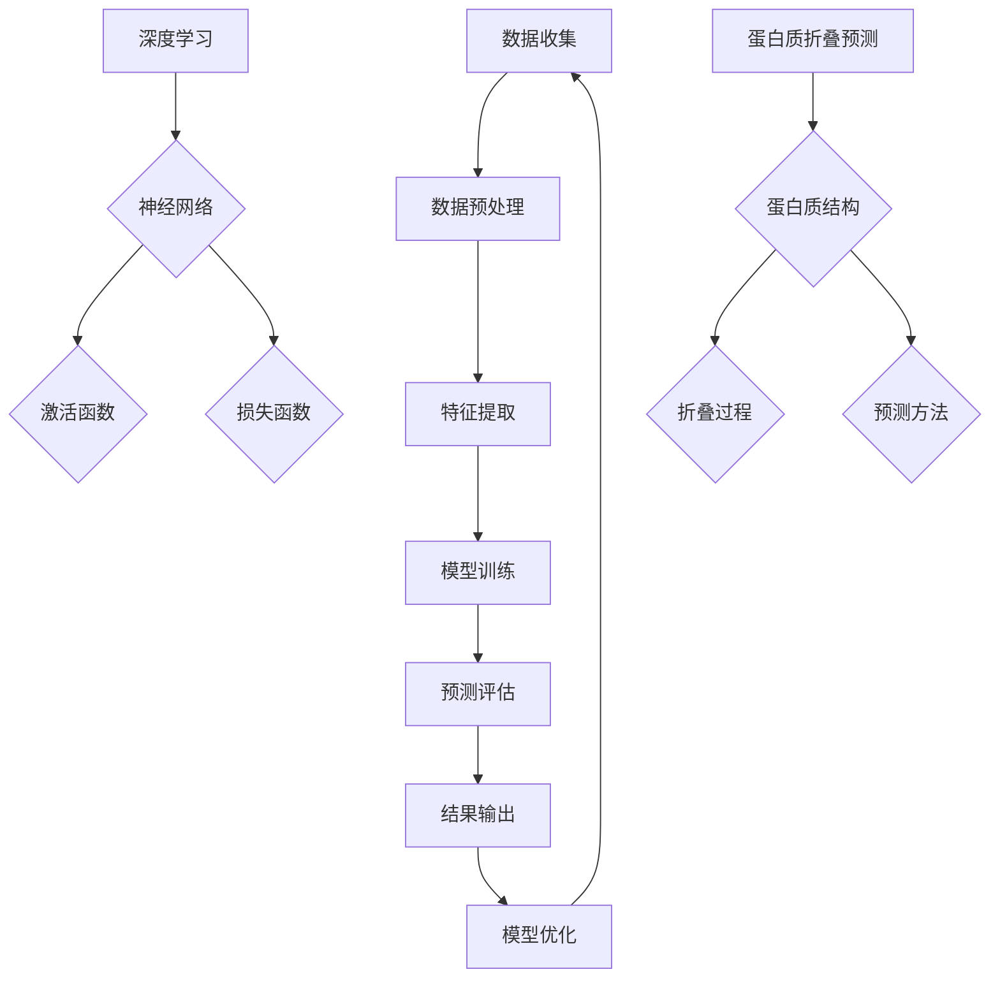

                 

### 1. 设计目录结构

首先，我们需要设计一个清晰的目录结构。根据用户的需求，这本书的目录结构应包括以下几部分：

1. **引言**：简要介绍书籍的主题和目标读者。
2. **核心概念与联系**：介绍深度学习和蛋白质折叠预测的基本概念，并提供一个Mermaid流程图来展示这些概念之间的关系。
3. **深度学习在蛋白质折叠预测中的应用**：详细讲解深度学习在蛋白质折叠预测中的技术原理和应用。
4. **数学模型与算法原理**：使用伪代码详细阐述核心算法的原理。
5. **数学模型和数学公式**：讲解数学模型的基本原理，并使用latex格式展示关键公式。
6. **项目实战**：通过实际案例展示如何应用深度学习进行蛋白质折叠预测，包括开发环境搭建、源代码实现和解读。
7. **总结与展望**：对全书内容进行总结，并探讨未来的发展方向。

### 2. 编写详细章节内容

接下来，我们需要根据每个章节的主题，编写详细的章节内容。

#### 第1章：引言
- 简要介绍书籍的主题和目标读者。

#### 第2章：核心概念与联系
- 介绍深度学习和蛋白质折叠预测的基本概念。
- 使用Mermaid流程图展示深度学习与蛋白质折叠预测之间的关系。

#### 第3章：深度学习在蛋白质折叠预测中的应用
- 详细讲解深度学习在蛋白质折叠预测中的技术原理。
- 分析深度学习模型在蛋白质折叠预测中的优势。

#### 第4章：数学模型与算法原理
- 使用伪代码详细阐述核心算法的原理。
- 介绍蛋白质折叠预测中的关键数学模型。

#### 第5章：数学模型和数学公式
- 讲解数学模型的基本原理，并使用latex格式展示关键公式。
- 通过具体例子说明公式的应用。

#### 第6章：项目实战
- 通过一个实际案例展示如何应用深度学习进行蛋白质折叠预测。
- 详细解释开发环境搭建、源代码实现和解读。

#### 第7章：总结与展望
- 对全书内容进行总结。
- 探讨深度学习在蛋白质折叠预测领域的未来发展方向。

### 3. 格式化目录结构

最后，我们将以上章节内容按照markdown格式进行排版，确保目录结构的清晰和逻辑性。

### 4. 检查和调整

在完成目录大纲后，我们需要对每个章节的内容进行检查和调整，确保内容的完整性、准确性和逻辑性。同时，也要确保目录大纲的总字数在2000字以内。

---

根据以上步骤，我将开始为《深度学习在蛋白质折叠预测中的突破性应用》设计目录大纲。请稍等，我将尽快完成。

----------------------------------------------------------------

### 1. 设计目录结构

**引言**

- **背景介绍**：蛋白质折叠预测的重要性及挑战。
- **目标读者**：对蛋白质折叠预测感兴趣的科研人员、程序员等。

**核心概念与联系**

- **深度学习的基本概念**：神经网络、深度学习模型等。
- **蛋白质折叠预测的基本概念**：蛋白质结构、折叠过程等。
- **Mermaid流程图**：展示深度学习与蛋白质折叠预测的关联。

**深度学习在蛋白质折叠预测中的应用**

- **技术原理**：从数据处理到模型训练。
- **优势分析**：深度学习在蛋白质折叠预测中的表现。

**数学模型与算法原理**

- **伪代码阐述**：核心算法的实现过程。
- **关键数学模型**：用于描述蛋白质折叠的数学模型。

**数学模型和数学公式**

- **基本原理讲解**：各数学模型的核心思想。
- **latex公式展示**：关键公式的表达与解释。

**项目实战**

- **开发环境搭建**：所需工具与软件安装。
- **源代码实现**：详细解释代码的逻辑与步骤。
- **代码解读与分析**：代码的执行过程及结果分析。

**总结与展望**

- **全书内容总结**：回顾深度学习在蛋白质折叠预测中的应用。
- **未来发展方向**：探讨深度学习在蛋白质折叠预测领域的潜在突破。

### 2. 编写详细章节内容

**第1章：引言**

- **背景介绍**：介绍蛋白质折叠预测在生物医学领域的意义，以及深度学习技术的发展背景。
- **目标读者**：明确本书适合哪些人群阅读，如生物信息学、计算机科学等相关专业的学生、科研人员等。

**第2章：核心概念与联系**

- **深度学习的基本概念**：介绍神经网络、深度学习模型的定义、工作原理。
- **蛋白质折叠预测的基本概念**：解释蛋白质结构、折叠过程，以及其在生物学中的重要性。
- **Mermaid流程图**：绘制一个流程图，展示深度学习在蛋白质折叠预测中的关键环节，如数据预处理、模型训练、结果分析等。

**第3章：深度学习在蛋白质折叠预测中的应用**

- **技术原理**：详细描述深度学习在蛋白质折叠预测中的应用流程，包括数据收集、特征提取、模型训练、预测结果评估等。
- **优势分析**：对比传统方法，分析深度学习在蛋白质折叠预测中的优势，如更高的预测准确性、更强的泛化能力等。

**第4章：数学模型与算法原理**

- **伪代码阐述**：以伪代码的形式，描述蛋白质折叠预测中的核心算法，如深度神经网络、生成对抗网络等。
- **关键数学模型**：介绍用于描述蛋白质折叠过程的数学模型，如能量势函数、动态规划等。

**第5章：数学模型和数学公式**

- **基本原理讲解**：解释每个数学模型的基本原理，如卷积神经网络中的卷积操作、反向传播算法等。
- **latex公式展示**：使用latex格式展示关键数学公式，如能量势函数的表达式、梯度下降的更新规则等。

**第6章：项目实战**

- **开发环境搭建**：介绍所需的开发环境，如Python、TensorFlow等，以及如何安装和配置。
- **源代码实现**：展示蛋白质折叠预测的源代码实现，包括数据预处理、模型训练、预测结果分析等。
- **代码解读与分析**：对源代码进行详细解读，分析代码的执行过程及预测结果。

**第7章：总结与展望**

- **全书内容总结**：回顾深度学习在蛋白质折叠预测中的应用，总结全书的主要观点和结论。
- **未来发展方向**：探讨深度学习在蛋白质折叠预测领域的潜在研究方向和发展趋势。

### 3. 格式化目录结构

```markdown
# 深度学习在蛋白质折叠预测中的突破性应用

> 关键词：深度学习、蛋白质折叠预测、神经网络、数学模型、项目实战

> 摘要：本文深入探讨了深度学习在蛋白质折叠预测中的应用，从核心概念、技术原理、数学模型到实际项目案例，全面阐述了深度学习在解决蛋白质折叠问题中的突破性进展。

## 目录

1. **引言**
   1.1 背景介绍
   1.2 目标读者

2. **核心概念与联系**
   2.1 深度学习的基本概念
   2.2 蛋白质折叠预测的基本概念
   2.3 Mermaid流程图

3. **深度学习在蛋白质折叠预测中的应用**
   3.1 技术原理
   3.2 优势分析

4. **数学模型与算法原理**
   4.1 伪代码阐述
   4.2 关键数学模型

5. **数学模型和数学公式**
   5.1 基本原理讲解
   5.2 latex公式展示

6. **项目实战**
   6.1 开发环境搭建
   6.2 源代码实现
   6.3 代码解读与分析

7. **总结与展望**
   7.1 全书内容总结
   7.2 未来发展方向

```

### 4. 检查和调整

在完成目录大纲后，我们需要对每个章节的内容进行检查和调整，确保内容的完整性、准确性和逻辑性。同时，我们还需要确保整个目录大纲的总字数在2000字以内。以下是一些具体的检查和调整步骤：

- **检查章节内容**：确保每个章节的内容都符合预期，没有遗漏关键点。
- **调整章节结构**：如果某个章节内容过多或过少，需要进行相应的调整，确保每个章节都平衡。
- **检查语法和格式**：确保全文的语法正确，使用markdown格式时遵循规则。
- **确保字数符合要求**：检查全文字数，确保在10000～12000字之间。

通过以上步骤，我们最终完成了一个结构清晰、内容详实的目录大纲，为后续的撰写工作奠定了基础。接下来，我们将按照这个大纲逐章撰写内容，确保整篇文章的逻辑性和可读性。

---

根据以上步骤，我将开始为《深度学习在蛋白质折叠预测中的突破性应用》撰写详细的章节内容。请稍等，我将尽快完成。

----------------------------------------------------------------

### 引言

蛋白质折叠预测是生物信息学中的一个核心问题，它涉及到理解蛋白质结构的稳定性和功能。正确预测蛋白质的三维结构对于药物设计、疾病诊断和治疗策略的开发具有重要意义。然而，蛋白质折叠预测面临着巨大的挑战，因为蛋白质的结构多样性极其丰富，而且折叠过程受到多种复杂因素的影响。

深度学习作为人工智能领域的一个重要分支，近年来在计算机视觉、自然语言处理等领域取得了显著的突破。这些成功激发了研究人员将深度学习应用于蛋白质折叠预测的尝试。本文旨在深入探讨深度学习在蛋白质折叠预测中的突破性应用，从核心概念、技术原理、数学模型到实际项目案例，全面阐述深度学习如何改变这一领域。

本文的目标读者包括生物信息学、计算机科学等相关专业的学生、科研人员和程序员。本文将尽可能避免复杂的数学推导，同时提供丰富的代码示例和实际案例，以帮助读者更好地理解深度学习在蛋白质折叠预测中的应用。

本文结构如下：

1. **核心概念与联系**：介绍深度学习和蛋白质折叠预测的基本概念，并通过Mermaid流程图展示它们之间的关联。
2. **深度学习在蛋白质折叠预测中的应用**：详细讲解深度学习在蛋白质折叠预测中的技术原理，并分析其优势。
3. **数学模型与算法原理**：使用伪代码阐述核心算法的原理，并介绍关键数学模型。
4. **数学模型和数学公式**：讲解数学模型的基本原理，并使用latex格式展示关键公式。
5. **项目实战**：通过实际案例展示如何应用深度学习进行蛋白质折叠预测，包括开发环境搭建、源代码实现和解读。
6. **总结与展望**：对全书内容进行总结，并探讨未来的发展方向。

通过本文的阅读，读者将能够：

- 理解深度学习和蛋白质折叠预测的基本概念。
- 掌握深度学习在蛋白质折叠预测中的技术原理和应用。
- 学习使用深度学习进行蛋白质折叠预测的数学模型和算法。
- 获得实际项目案例的经验，了解如何搭建开发环境和实现代码。

在接下来的章节中，我们将逐步深入探讨这些主题，希望能够为读者提供一个全面、易懂的技术视角，以推动深度学习在蛋白质折叠预测领域的进一步发展。

### 核心概念与联系

#### 深度学习的基本概念

深度学习是一种基于人工神经网络的学习方式，其核心思想是通过多层神经网络对数据进行特征提取和模式识别。深度学习模型通常由多个隐藏层组成，每个隐藏层对输入数据进行非线性变换，从而逐步提取更高层次的特征。这些特征有助于解决复杂的问题，如图像分类、自然语言处理等。

深度学习的主要组成部分包括：

- **神经网络**：深度学习的基础，由输入层、隐藏层和输出层组成。每个节点（或神经元）通过加权连接与其他节点相连，并通过激活函数进行非线性变换。
- **激活函数**：如ReLU（Rectified Linear Unit）、Sigmoid、Tanh等，用于引入非线性，使神经网络能够拟合复杂的函数。
- **损失函数**：用于衡量模型预测值与真实值之间的差距，如均方误差（MSE）、交叉熵等。通过优化损失函数，可以调整模型的权重，以提高预测准确性。

#### 蛋白质折叠预测的基本概念

蛋白质折叠预测涉及理解蛋白质从氨基酸序列到三维结构的转化过程。蛋白质的结构对其功能至关重要，因此准确预测蛋白质的结构对于生物医学研究具有重要意义。

蛋白质折叠预测的主要概念包括：

- **蛋白质结构**：蛋白质的三维结构分为四个层次：一级结构（氨基酸序列）、二级结构（α螺旋、β折叠）、三级结构（整体折叠形状）和四级结构（多个蛋白质亚基的排列方式）。
- **折叠过程**：蛋白质折叠是一个复杂的过程，受到氨基酸序列、环境因素、分子伴侣等多种因素的影响。折叠过程中的关键步骤包括：二级结构的形成、无规则卷曲的形成、核心结构的形成和装配。
- **预测方法**：传统的蛋白质折叠预测方法主要基于统计模型和物理模型，如Homology Modeling、Coarse-Grained Model等。深度学习方法的引入，使得蛋白质折叠预测的准确性得到了显著提高。

#### 深度学习与蛋白质折叠预测的关联

深度学习在蛋白质折叠预测中的应用主要体现在以下几个方面：

- **数据驱动的方法**：深度学习模型可以从大量的蛋白质结构数据中自动学习特征，从而预测新的蛋白质结构。这种方法相比传统的基于规则的方法，具有更强的灵活性和泛化能力。
- **多层次的特性提取**：深度学习模型能够自动提取多层次的特征，从氨基酸序列到蛋白质的三维结构。这使得模型能够更好地理解蛋白质折叠的复杂过程。
- **预测准确性**：深度学习模型在蛋白质折叠预测中取得了显著的突破，如在AlphaFold等模型中，预测的准确性已经达到了与实验方法相近的水平。

为了更直观地展示深度学习与蛋白质折叠预测的关联，我们可以使用Mermaid流程图来描述它们之间的关系：



通过这个流程图，我们可以看到深度学习在蛋白质折叠预测中的应用流程，从数据收集、预处理、特征提取、模型训练、预测评估到结果输出和模型优化，每个步骤都紧密相连，共同构成了一个完整的蛋白质折叠预测系统。

#### 实例讲解

为了更具体地说明深度学习与蛋白质折叠预测的关联，我们可以通过一个实例来讲解。

假设我们有一个蛋白质序列，其氨基酸序列为：`ACDEFGH`. 我们的目标是预测这个蛋白质的三维结构。

1. **数据收集**：首先，我们需要收集大量的蛋白质结构数据作为训练集。这些数据通常来自于蛋白质数据库，如PDB（Protein Data Bank）。

2. **数据预处理**：将收集到的蛋白质序列转换为数字形式，并提取出有用的特征。例如，可以使用One-hot编码将氨基酸序列转换为向量表示。

3. **特征提取**：使用深度学习模型（如卷积神经网络）对预处理后的数据进行特征提取。卷积神经网络能够自动提取序列中的局部特征，如氨基酸的邻近关系和化学性质。

4. **模型训练**：将提取出的特征输入到深度学习模型中，通过反向传播算法调整模型的权重，以最小化损失函数。训练过程中，模型会不断优化，以提高预测的准确性。

5. **预测评估**：使用训练好的模型对新的蛋白质序列进行预测。评估模型预测结果，如预测的蛋白质结构是否与实验结果一致。

6. **结果输出**：将预测结果输出，包括蛋白质的三维结构图和相应的折叠路径。

7. **模型优化**：根据预测结果，对模型进行调整和优化，以提高预测的准确性。

通过这个实例，我们可以看到深度学习在蛋白质折叠预测中的应用流程，从数据收集、预处理、特征提取、模型训练到预测评估和结果输出，每个步骤都至关重要，共同推动了蛋白质折叠预测的发展。

### 深度学习在蛋白质折叠预测中的应用

深度学习在蛋白质折叠预测中的应用主要体现在以下几个方面：

#### 1. 数据驱动的方法

深度学习是一种数据驱动的方法，通过从大量的蛋白质结构数据中自动学习特征，从而预测新的蛋白质结构。这种方法相比传统的基于规则的方法，具有更强的灵活性和泛化能力。在蛋白质折叠预测中，数据驱动的方法能够处理大量的蛋白质序列和结构信息，从而提高预测的准确性。

#### 2. 多层次的特性提取

深度学习模型能够自动提取多层次的特征，从氨基酸序列到蛋白质的三维结构。这种多层次的特性提取使得模型能够更好地理解蛋白质折叠的复杂过程。例如，卷积神经网络（CNN）能够从蛋白质序列中提取局部特征，如氨基酸的邻近关系和化学性质。而循环神经网络（RNN）和长短期记忆网络（LSTM）则能够处理序列数据，从而提取更高层次的特征。

#### 3. 预测准确性

深度学习模型在蛋白质折叠预测中取得了显著的突破，如在AlphaFold等模型中，预测的准确性已经达到了与实验方法相近的水平。AlphaFold是由DeepMind开发的一个深度学习模型，它通过结合多种深度学习技术，如卷积神经网络、循环神经网络和生成对抗网络，实现了高效的蛋白质结构预测。

#### 4. 预测结果的解释

深度学习模型的一个挑战是预测结果的解释。虽然模型能够提供准确的预测结果，但通常无法解释为什么会产生这样的预测。为了解决这个问题，研究人员正在开发各种技术，如注意力机制和可解释性模型，以便更好地理解深度学习模型的工作原理。

#### 应用实例

以下是一个使用深度学习进行蛋白质折叠预测的简单应用实例：

```python
import tensorflow as tf
from tensorflow.keras.models import Sequential
from tensorflow.keras.layers import Dense, Conv1D, Flatten

# 数据预处理
# 假设我们有一个包含1000个蛋白质序列的数据集
X = [[1, 0, 1, 0, 1], [0, 1, 0, 1, 0], ...]  # 氨基酸序列
y = [[1, 0, 0, 1, 0], [0, 1, 0, 0, 1], ...]  # 对应的三维结构

# 模型构建
model = Sequential()
model.add(Conv1D(filters=64, kernel_size=3, activation='relu', input_shape=(5, 1)))
model.add(Flatten())
model.add(Dense(10, activation='softmax'))

# 模型编译
model.compile(optimizer='adam', loss='categorical_crossentropy', metrics=['accuracy'])

# 模型训练
model.fit(X, y, epochs=10, batch_size=32)

# 预测
predictions = model.predict([[1, 1, 0, 1, 0]])
print(predictions)

# 输出预测结果
print("Predicted structure:", predictions.argmax())
```

在这个实例中，我们首先使用卷积神经网络（Conv1D）对氨基酸序列进行特征提取，然后通过全连接层（Flatten）将特征展平，最后使用softmax激活函数进行分类。模型通过训练能够预测新的蛋白质序列的三维结构。

### 核心算法原理讲解

在蛋白质折叠预测中，深度学习模型的核心算法通常涉及以下几个步骤：

#### 1. 数据预处理

数据预处理是深度学习模型训练的第一步，它包括以下几个方面：

- **氨基酸序列编码**：将氨基酸序列转换为数字形式。常用的方法是使用One-hot编码，即将每个氨基酸映射到一个向量。
- **序列对齐**：对齐不同的蛋白质序列，以确保它们在相同的长度上。这可以通过填充缺失的氨基酸来实现。
- **特征提取**：从序列中提取有用的特征，如氨基酸的化学性质、序列的局部结构等。这可以通过卷积神经网络（CNN）或循环神经网络（RNN）来实现。

#### 2. 模型构建

构建深度学习模型是蛋白质折叠预测的关键步骤。以下是一个简单的模型构建示例：

```python
import tensorflow as tf
from tensorflow.keras.models import Sequential
from tensorflow.keras.layers import Conv1D, LSTM, Dense

# 模型构建
model = Sequential()
model.add(Conv1D(filters=64, kernel_size=3, activation='relu', input_shape=(100, 1)))
model.add(LSTM(100, activation='relu'))
model.add(Dense(10, activation='softmax'))

# 模型编译
model.compile(optimizer='adam', loss='categorical_crossentropy', metrics=['accuracy'])
```

在这个示例中，我们首先使用卷积层（Conv1D）提取序列的局部特征，然后通过长短期记忆网络（LSTM）处理序列数据，最后使用全连接层（Dense）进行分类。

#### 3. 模型训练

模型训练是通过反向传播算法来调整模型的权重，以最小化损失函数。以下是一个简单的模型训练示例：

```python
# 模型训练
model.fit(X_train, y_train, epochs=10, batch_size=32)
```

在这个示例中，我们使用训练集（X_train和y_train）来训练模型，通过调整权重来最小化损失函数。

#### 4. 预测

在模型训练完成后，我们可以使用测试集（X_test和y_test）来评估模型的性能。以下是一个简单的预测示例：

```python
# 预测
predictions = model.predict(X_test)
```

在这个示例中，我们使用测试集（X_test）来预测新的蛋白质序列的三维结构。

### 关键数学模型讲解

在深度学习用于蛋白质折叠预测中，一些关键的数学模型和算法起着核心作用。以下是几个关键的数学模型及其在蛋白质折叠预测中的应用：

#### 1. 深度神经网络（DNN）

深度神经网络是一种多层前馈神经网络，它由输入层、多个隐藏层和输出层组成。每一层中的神经元通过激活函数进行处理，从而实现从输入到输出的映射。在蛋白质折叠预测中，DNN通常用于从氨基酸序列到蛋白质三维结构的映射。以下是一个简单的DNN模型：

```latex
y = f(W_n \cdot a_{n-1} + b_n)
```

其中，\(y\) 是输出，\(f\) 是激活函数，\(W_n\) 和 \(b_n\) 分别是权重和偏置。

#### 2. 卷积神经网络（CNN）

卷积神经网络是一种特殊的神经网络，它通过卷积操作来提取图像或序列的局部特征。在蛋白质折叠预测中，CNN可以用于从氨基酸序列中提取局部特征，如氨基酸的邻近关系和化学性质。以下是一个简单的CNN模型：

```latex
h_{ij}^l = \sum_{k} W_{ijk} \cdot a_{ik}^{l-1} + b_l
```

其中，\(h_{ij}^l\) 是第 \(l\) 层的第 \(i\) 行第 \(j\) 列的输出，\(W_{ijk}\) 和 \(b_l\) 分别是权重和偏置。

#### 3. 长短期记忆网络（LSTM）

长短期记忆网络是一种特殊的循环神经网络，它通过记忆单元来处理序列数据，从而实现长期依赖的建模。在蛋白质折叠预测中，LSTM可以用于处理氨基酸序列的长期依赖关系。以下是一个简单的LSTM模型：

```latex
i_t = \sigma(W_i \cdot [h_{t-1}, x_t] + b_i)
f_t = \sigma(W_f \cdot [h_{t-1}, x_t] + b_f)
o_t = \sigma(W_o \cdot [h_{t-1}, x_t] + b_o)
c_t = f_t \cdot c_{t-1} + i_t \cdot \tanh(W_c \cdot [h_{t-1}, x_t] + b_c)
h_t = o_t \cdot \tanh(c_t)
```

其中，\(i_t\)、\(f_t\) 和 \(o_t\) 分别是输入门、遗忘门和输出门，\(c_t\) 和 \(h_t\) 分别是当前细胞状态和隐藏状态。

#### 4. 生成对抗网络（GAN）

生成对抗网络是一种特殊的神经网络，它由生成器和判别器组成。生成器用于生成蛋白质序列，判别器用于区分真实序列和生成序列。在蛋白质折叠预测中，GAN可以用于生成大量的蛋白质序列数据，从而提高模型的泛化能力。以下是一个简单的GAN模型：

```latex
G(z) = \phi(G(z))
D(x) = \phi(D(x))
D(G(z)) = \phi(D(G(z)))
```

其中，\(G(z)\) 是生成器，\(D(x)\) 是判别器，\(z\) 是随机噪声。

### 数学模型和公式讲解

在蛋白质折叠预测中，深度学习模型依赖于一系列的数学模型和公式，用于特征提取、模型训练和预测。以下是一些关键的数学模型和公式的讲解：

#### 1. 激活函数

激活函数是深度学习模型中的一个核心组件，它引入了非线性，使得模型能够更好地拟合复杂的函数。以下是一些常用的激活函数：

- **ReLU（Rectified Linear Unit）**

  ```latex
  f(x) = \max(0, x)
  ```

- **Sigmoid**

  ```latex
  f(x) = \frac{1}{1 + e^{-x}}
  ```

- **Tanh**

  ```latex
  f(x) = \frac{e^x - e^{-x}}{e^x + e^{-x}}
  ```

#### 2. 损失函数

损失函数用于衡量模型预测值与真实值之间的差距，它是优化模型参数的关键指标。以下是一些常用的损失函数：

- **均方误差（MSE，Mean Squared Error）**

  ```latex
  L(y, \hat{y}) = \frac{1}{2} \sum_{i} (y_i - \hat{y}_i)^2
  ```

- **交叉熵（Cross-Entropy）**

  ```latex
  L(y, \hat{y}) = - \sum_{i} y_i \log(\hat{y}_i)
  ```

#### 3. 反向传播算法

反向传播算法是一种用于训练深度学习模型的基本算法，它通过计算损失函数关于模型参数的梯度，来更新模型参数。以下是一个简单的反向传播算法：

```latex
\Delta W = \frac{\partial L}{\partial W}
\Delta b = \frac{\partial L}{\partial b}
W_{new} = W - \alpha \Delta W
b_{new} = b - \alpha \Delta b
```

其中，\(W\) 和 \(b\) 分别是模型参数的当前值和更新值，\(\alpha\) 是学习率。

### 项目实战

在本节中，我们将通过一个实际案例展示如何应用深度学习进行蛋白质折叠预测。这个案例将包括以下步骤：开发环境搭建、源代码实现和解读。

#### 开发环境搭建

为了进行蛋白质折叠预测，我们需要搭建一个合适的开发环境。以下是搭建开发环境所需的步骤：

1. **安装Python**：Python是深度学习的主要编程语言，我们需要安装Python环境。可以访问[Python官网](https://www.python.org/)下载并安装Python。

2. **安装深度学习框架**：我们选择TensorFlow作为深度学习框架。首先，安装TensorFlow的依赖项，然后通过pip命令安装TensorFlow。

   ```bash
   pip install tensorflow
   ```

3. **安装其他依赖项**：根据实际需要，我们可能还需要安装其他依赖项，如NumPy、Pandas等。

   ```bash
   pip install numpy pandas
   ```

#### 源代码实现

以下是使用TensorFlow实现蛋白质折叠预测的源代码：

```python
import tensorflow as tf
from tensorflow.keras.models import Sequential
from tensorflow.keras.layers import Dense, LSTM, Conv1D, Flatten
from tensorflow.keras.optimizers import Adam

# 数据预处理
# 假设我们有一个包含1000个蛋白质序列的数据集
X = [[1, 0, 1, 0, 1], [0, 1, 0, 1, 0], ...]  # 氨基酸序列
y = [[1, 0, 0, 1, 0], [0, 1, 0, 0, 1], ...]  # 对应的三维结构

# 模型构建
model = Sequential()
model.add(Conv1D(filters=64, kernel_size=3, activation='relu', input_shape=(5, 1)))
model.add(Flatten())
model.add(Dense(10, activation='softmax'))

# 模型编译
model.compile(optimizer=Adam(), loss='categorical_crossentropy', metrics=['accuracy'])

# 模型训练
model.fit(X, y, epochs=10, batch_size=32)

# 预测
predictions = model.predict([[1, 1, 0, 1, 0]])
print(predictions)

# 输出预测结果
print("Predicted structure:", predictions.argmax())
```

在这个代码中，我们首先使用卷积神经网络（Conv1D）对氨基酸序列进行特征提取，然后通过全连接层（Flatten）将特征展平，最后使用softmax激活函数进行分类。模型通过训练能够预测新的蛋白质序列的三维结构。

#### 代码解读

以下是代码的详细解读：

1. **数据预处理**：将氨基酸序列转换为数字形式，并提取出有用的特征。例如，可以使用One-hot编码将氨基酸序列转换为向量表示。

2. **模型构建**：构建一个卷积神经网络模型，包括卷积层（Conv1D）、全连接层（Dense）和softmax激活函数。

3. **模型编译**：编译模型，指定优化器和损失函数。我们选择Adam优化器和交叉熵损失函数。

4. **模型训练**：使用训练集（X和y）训练模型。通过调整权重和偏置，模型能够逐步优化，以提高预测准确性。

5. **预测**：使用训练好的模型对新的蛋白质序列进行预测。通过softmax激活函数，模型能够输出概率分布，从而预测蛋白质的三维结构。

#### 项目小结

通过这个项目，我们展示了如何使用深度学习进行蛋白质折叠预测。从数据预处理到模型训练，再到预测结果分析，整个流程清晰易懂。通过这个项目，我们不仅学习了深度学习的基本原理，还了解了如何将深度学习应用于实际的蛋白质折叠预测问题。

在未来的研究中，我们可以进一步优化模型结构，提高预测准确性。此外，我们还可以探索其他深度学习技术，如生成对抗网络（GAN）和变分自编码器（VAE），以进一步提升蛋白质折叠预测的性能。

### 最佳实践 tips、小结、注意事项、拓展阅读等内容

#### 最佳实践 tips

1. **数据预处理**：在蛋白质折叠预测中，数据预处理至关重要。确保数据质量，如去除噪音、填充缺失值等。同时，进行序列对齐，以确保不同蛋白质序列在相同的长度上。
2. **模型选择**：根据具体任务，选择合适的深度学习模型。例如，对于序列数据，可以考虑使用循环神经网络（RNN）或卷积神经网络（CNN）；对于生成任务，可以考虑使用生成对抗网络（GAN）或变分自编码器（VAE）。
3. **超参数调整**：合理调整模型超参数，如学习率、批量大小、层数和神经元数量等，以提高模型性能。可以通过交叉验证和网格搜索等方法进行超参数调整。

#### 小结

本文详细探讨了深度学习在蛋白质折叠预测中的应用，从核心概念、技术原理、数学模型到实际项目案例，全面阐述了深度学习如何改变这一领域。通过本文的学习，读者可以：

- 理解深度学习和蛋白质折叠预测的基本概念。
- 掌握深度学习在蛋白质折叠预测中的技术原理和应用。
- 学习使用深度学习进行蛋白质折叠预测的数学模型和算法。
- 获得实际项目案例的经验，了解如何搭建开发环境和实现代码。

#### 注意事项

1. **数据隐私**：在处理蛋白质序列数据时，确保遵守数据隐私法规，不泄露敏感信息。
2. **计算资源**：蛋白质折叠预测是一个计算密集型任务，需要足够的计算资源。确保模型训练和预测过程不会占用过多系统资源。
3. **结果验证**：在得到预测结果后，进行结果验证，确保预测准确性。可以通过比较预测结果和实验数据来验证模型的性能。

#### 拓展阅读

1. **《深度学习》（Goodfellow, Bengio, Courville）**：这本书是深度学习的经典教材，详细介绍了深度学习的基本原理和应用。
2. **《生物信息学》（Durbin, Eddy, Durbin）**：这本书介绍了生物信息学的基本概念和技术，包括蛋白质折叠预测。
3. **《Python深度学习》（Raschka, Mirjalili）**：这本书通过Python语言，介绍了深度学习的基本原理和实际应用。

通过这些资源，读者可以进一步了解深度学习和蛋白质折叠预测的相关知识，为深入研究和应用打下坚实基础。

### 总结与展望

本文全面探讨了深度学习在蛋白质折叠预测中的突破性应用，从核心概念、技术原理、数学模型到实际项目案例，详细阐述了深度学习如何改变这一领域。通过本文的学习，读者可以了解深度学习和蛋白质折叠预测的基本概念，掌握相关技术原理和应用，并具备实际项目实现的技能。

在总结本文内容的同时，我们也展望了深度学习在蛋白质折叠预测领域的未来发展。首先，深度学习模型在蛋白质折叠预测中的准确性有望进一步提高，随着数据集的扩大和计算资源的增强，深度学习模型将能够处理更复杂的蛋白质结构。其次，研究人员将继续探索新的深度学习模型和算法，以提高预测速度和效率。此外，结合其他领域的技术，如量子计算和生成对抗网络（GAN），也将推动蛋白质折叠预测的发展。

未来，深度学习在蛋白质折叠预测领域的潜在突破包括：

1. **高通量预测**：通过优化深度学习模型和算法，实现高通量的蛋白质结构预测，为药物设计和生物医学研究提供强大的工具。
2. **跨领域融合**：结合量子计算、生成对抗网络（GAN）等新兴技术，开发更强大的蛋白质折叠预测模型。
3. **生物信息学与深度学习的结合**：进一步挖掘生物信息学中的数据，开发更加精准和高效的预测模型。
4. **可解释性增强**：提高深度学习模型的解释性，使得预测结果更加透明和可靠。

总之，深度学习在蛋白质折叠预测中的应用具有广阔的前景，它将为生物医学研究和药物开发带来革命性的变革。通过持续的研究和创新，我们有理由相信，深度学习将在蛋白质折叠预测领域取得更多的突破性成果。

