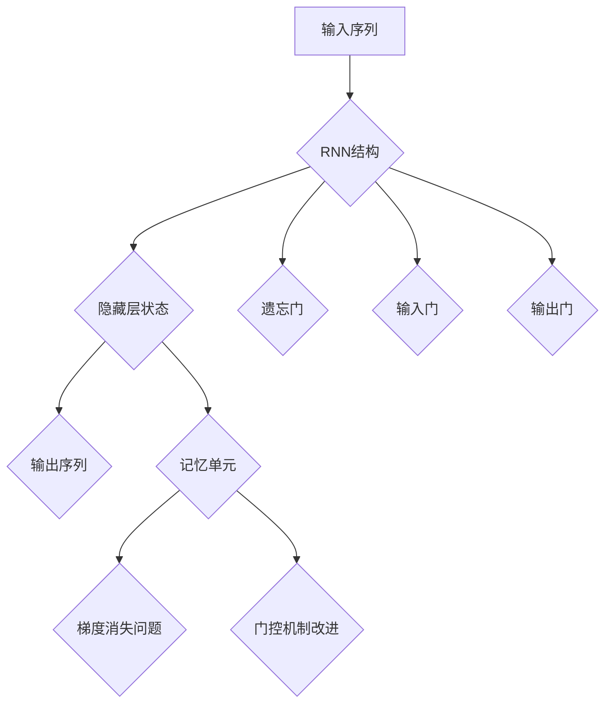

                 

# 深度学习在语音合成中的自然度提升

> 关键词：深度学习、语音合成、自然度提升、循环神经网络、长短时记忆网络、生成对抗网络

> 摘要：随着深度学习技术的不断发展，语音合成作为自然语言处理的重要分支，取得了显著的进展。本文将探讨深度学习在提升语音合成自然度方面的应用，从基本原理到具体模型，再到提升自然度的方法，全面解析深度学习语音合成的技术路径。

## 第1章: 深度学习在语音合成中的自然度提升概述

### 1.1 深度学习与语音合成

#### 1.1.1 深度学习的核心概念

**深度学习**是一种机器学习的重要分支，通过构建深度神经网络模型，自动从数据中学习特征表示和决策规则。它具有如下几个核心概念：

- **神经网络**：神经网络是深度学习的基础，由多个层级的神经元组成，通过前向传播和反向传播进行学习。
- **层级结构**：深度神经网络具有多层次的层级结构，每一层对输入数据进行变换和处理，逐层提取更高层次的特征。
- **参数训练**：通过大量数据训练网络参数，使得模型能够对未知数据进行预测或分类。

#### 1.1.2 语音合成的基本原理

**语音合成**（Text-to-Speech, TTS）是将文本转换为自然语音的技术。其基本原理包括以下几部分：

- **文本预处理**：将输入文本转换为适合处理的形式，如分词、词性标注等。
- **语音建模**：构建语音信号生成模型，将文本映射为声学特征。
- **声码器**：将声学特征转换为语音信号。

#### 1.1.3 语音合成的传统方法

传统的语音合成方法主要基于规则和声学模型，常见的包括：

- **基于规则的方法**：通过人工编写规则来控制语音合成，如MDL（METS Synthesizer）。
- **基于声学模型的方法**：通过统计模型来描述语音信号，如HMM（Hidden Markov Model）。

#### 1.1.4 深度学习在语音合成中的优势

深度学习在语音合成中的应用具有以下优势：

- **自动特征提取**：深度学习可以从大量数据中自动提取高层次的语音特征，减少人工干预。
- **端到端学习**：深度学习模型可以实现端到端的学习，直接从文本到语音的转换，提高效率。
- **泛化能力**：深度学习模型具有较强的泛化能力，可以在不同的数据集上表现良好。

### 1.2 自然度的定义与提升

#### 1.2.1 自然度的概念

**自然度**（Naturalness）是评估语音合成系统输出语音质量的重要指标，指的是语音的自然程度。高自然度的语音让人感觉接近真实语音，而低自然度的语音则可能显得机械或不自然。

#### 1.2.2 自然度的影响因素

自然度受到多种因素的影响，包括：

- **音素发音**：音素的发音是否准确，包括音调、音长、音强等特征。
- **语音连贯性**：语音的连贯性，包括音节的过渡、语调的变化等。
- **语音质量**：语音的清晰度、音质等。

#### 1.2.3 自然度的评价指标

自然度的评价指标包括：

- **主观评价**：通过人类评估者对语音合成的自然度进行评分。
- **客观评价**：使用算法对语音合成的自然度进行量化评估，如基于语音信号的统计特征、音素分布等。

#### 1.2.4 自然度提升的目标

提升自然度的目标包括：

- **提高语音质量**：通过优化模型参数和训练数据，提高语音的音质和清晰度。
- **增强语音连贯性**：通过改进模型结构和算法，使语音更加流畅和自然。
- **模拟真实语音特征**：通过模仿真实语音的音调、音长等特征，提高语音的自然度。

#### 1.2.5 自然度提升的方法

提升自然度的方法主要包括：

- **改进模型结构**：通过设计更复杂的深度学习模型，如长短时记忆网络（LSTM）、Transformer等，提高语音合成的自然度。
- **增加训练数据**：通过收集和标注更多的语音数据，丰富模型训练数据，提高语音合成的质量。
- **数据增强**：通过数据增强技术，如噪声添加、速度变化等，增加训练数据的多样性，提高模型的泛化能力。

## 第2章: 深度学习在语音合成中的核心技术

### 2.1 循环神经网络（RNN）

#### 2.1.1 RNN的基本原理

**循环神经网络（RNN）**是一种能够处理序列数据的神经网络。其基本原理包括以下几个方面：

- **序列处理**：RNN通过存储状态（隐藏层）来处理输入序列，每个时刻的状态都与之前的时刻有关。
- **时间步**：RNN的输入序列按照时间步逐个输入，每个时间步的输出依赖于当前输入和之前的状态。
- **门控机制**：RNN可以使用门控机制（如遗忘门和输入门）来控制信息的流动，避免梯度消失问题。

#### 2.1.2 RNN在语音合成中的应用

RNN在语音合成中的应用主要包括以下两个方面：

- **语音建模**：使用RNN来学习文本到声学特征（如Mel频率倒谱系数）的映射关系。
- **声码器设计**：使用RNN作为声码器，将声学特征转换为语音信号。

#### 2.1.3 RNN的局限性与改进

RNN在处理长序列数据时存在梯度消失和梯度爆炸问题，这限制了其在语音合成中的应用。为解决这些问题，研究者提出了以下改进：

- **长短时记忆网络（LSTM）**：LSTM通过引入记忆单元和门控机制，能够更好地处理长序列数据。
- **门控循环单元（GRU）**：GRU是LSTM的简化版本，具有更好的计算效率和性能。

### 2.2 长短时记忆网络（LSTM）

#### 2.2.1 LSTM的基本原理

**长短时记忆网络（LSTM）**是一种改进的RNN结构，通过引入记忆单元和门控机制，能够更好地处理长序列数据。其基本原理包括以下几个方面：

- **记忆单元（Cell State）**：LSTM的核心是记忆单元，能够存储长序列的信息。
- **门控机制**：LSTM通过遗忘门、输入门和输出门控制信息的流动，避免梯度消失问题。

#### 2.2.2 LSTM在语音合成中的应用

LSTM在语音合成中的应用主要包括以下两个方面：

- **语音建模**：使用LSTM来学习文本到声学特征（如Mel频率倒谱系数）的映射关系。
- **声码器设计**：使用LSTM作为声码器，将声学特征转换为语音信号。

#### 2.2.3 LSTM的优势与挑战

LSTM的优势包括：

- **良好的序列建模能力**：LSTM能够处理长序列数据，具有良好的序列建模能力。
- **稳定的训练过程**：LSTM通过门控机制避免了梯度消失问题，使得训练过程更加稳定。

LSTM的挑战包括：

- **计算复杂度**：LSTM的结构相对复杂，计算量较大，对计算资源有较高要求。
- **参数调优**：LSTM的参数调优过程较为复杂，需要大量的实验和调整。

### 2.3 递归神经网络（GRU）

#### 2.3.1 GRU的基本原理

**门控循环单元（GRU）**是LSTM的简化版本，通过引入更新门和重置门，提高了计算效率和性能。其基本原理包括以下几个方面：

- **更新门（Update Gate）**：控制新信息对记忆单元的影响。
- **重置门（Reset Gate）**：控制旧信息对记忆单元的影响。
- **记忆单元**：GRU的记忆单元是单一的，能够存储长序列的信息。

#### 2.3.2 GRU在语音合成中的应用

GRU在语音合成中的应用主要包括以下两个方面：

- **语音建模**：使用GRU来学习文本到声学特征（如Mel频率倒谱系数）的映射关系。
- **声码器设计**：使用GRU作为声码器，将声学特征转换为语音信号。

#### 2.3.3 GRU的优势与挑战

GRU的优势包括：

- **计算效率高**：GRU的结构相对简单，计算量较小，计算效率较高。
- **性能较好**：GRU在语音合成中的性能与LSTM相当，但计算效率更高。

GRU的挑战包括：

- **序列建模能力**：虽然GRU的计算效率高，但在处理长序列数据时，序列建模能力相对较弱。
- **参数调优**：GRU的参数调优过程相对简单，但需要一定的实验和调整。

### 2.4 自注意力机制（Self-Attention）

#### 2.4.1 自注意力机制的基本原理

**自注意力机制（Self-Attention）**是一种用于处理序列数据的注意力机制，其基本原理包括以下几个方面：

- **注意力分数**：自注意力机制通过计算输入序列中每个元素与所有其他元素之间的相似性分数。
- **加权求和**：根据注意力分数对输入序列进行加权求和，得到新的序列表示。

#### 2.4.2 自注意力机制在语音合成中的应用

自注意力机制在语音合成中的应用主要包括以下两个方面：

- **语音建模**：使用自注意力机制来学习文本到声学特征（如Mel频率倒谱系数）的映射关系。
- **声码器设计**：使用自注意力机制来改进声码器的性能，提高语音合成的自然度。

#### 2.4.3 自注意力机制的优势与挑战

自注意力机制的优势包括：

- **强大的序列建模能力**：自注意力机制能够更好地建模长序列数据，提高语音合成的质量。
- **端到端学习**：自注意力机制可以实现端到端的学习，提高模型的训练效率。

自注意力机制的挑战包括：

- **计算复杂度**：自注意力机制的计算复杂度较高，对计算资源有较高要求。
- **参数调优**：自注意力机制的参数调优过程较为复杂，需要大量的实验和调整。

## 第3章: 基于深度学习的语音合成模型

### 3.1 WaveNet

#### 3.1.1 WaveNet的基本原理

**WaveNet**是由Google提出的一种基于深度学习的语音合成模型，其基本原理包括以下几个方面：

- **生成过程**：WaveNet通过一个深度神经网络生成音频波形，输入是文本序列，输出是音频信号。
- **结构**：WaveNet由多个卷积层组成，每个卷积层生成音频信号的一部分，最终拼接成完整的音频。

#### 3.1.2 WaveNet的性能评估

WaveNet的性能评估主要包括以下两个方面：

- **自然度**：WaveNet生成的语音自然度较高，能够模拟真实语音的特征。
- **语音质量**：WaveNet生成的语音质量较好，具有清晰的发音和自然的语调。

#### 3.1.3 WaveNet的局限性

WaveNet的局限性包括：

- **计算资源要求高**：WaveNet的计算复杂度较高，对计算资源有较高要求。
- **训练时间较长**：WaveNet的模型较大，训练时间较长，不利于实时应用。

### 3.2 Tacotron

#### 3.2.1 Tacotron的基本原理

**Tacotron**是由Google提出的一种基于深度学习的端到端语音合成模型，其基本原理包括以下几个方面：

- **生成过程**：Tacotron通过一个编码器将文本序列编码为声学特征，通过一个解码器将声学特征解码为音频信号。
- **结构**：Tacotron由一个编码器和一个解码器组成，编码器使用循环神经网络（RNN）或Transformer，解码器使用自注意力机制。

#### 3.2.2 Tacotron的性能评估

Tacotron的性能评估主要包括以下两个方面：

- **自然度**：Tacotron生成的语音自然度较高，能够模拟真实语音的特征。
- **语音质量**：Tacotron生成的语音质量较好，具有清晰的发音和自然的语调。

#### 3.2.3 Tacotron的局限性

Tacotron的局限性包括：

- **计算资源要求高**：Tacotron的计算复杂度较高，对计算资源有较高要求。
- **解码时间较长**：Tacotron的解码时间较长，不利于实时应用。

### 3.3 Transformer

#### 3.3.1 Transformer的基本原理

**Transformer**是由Google提出的一种基于自注意力机制的深度学习模型，其基本原理包括以下几个方面：

- **生成过程**：Transformer通过自注意力机制对输入序列进行建模，生成新的序列表示。
- **结构**：Transformer由多个自注意力层和前馈网络组成，能够同时处理长距离依赖问题。

#### 3.3.2 Transformer的性能评估

Transformer的性能评估主要包括以下两个方面：

- **自然度**：Transformer生成的语音自然度较高，能够模拟真实语音的特征。
- **语音质量**：Transformer生成的语音质量较好，具有清晰的发音和自然的语调。

#### 3.3.3 Transformer的局限性

Transformer的局限性包括：

- **计算复杂度**：Transformer的计算复杂度较高，对计算资源有较高要求。
- **训练时间较长**：Transformer的模型较大，训练时间较长，不利于实时应用。

## 第4章: 基于深度学习的语音合成自然度提升方法

### 4.1 数据增强

#### 4.1.1 数据增强的基本原理

**数据增强**是一种通过生成或变换原始数据来扩充数据集的方法，其基本原理包括以下几个方面：

- **生成数据**：通过算法生成与原始数据相似的新数据，增加数据的多样性。
- **变换数据**：通过对原始数据进行变换，如噪声添加、速度变化等，增加数据的多样性。

#### 4.1.2 数据增强的应用

数据增强在语音合成中的应用主要包括以下两个方面：

- **语音建模**：通过数据增强来增加语音数据的多样性，提高模型的泛化能力。
- **声码器设计**：通过数据增强来增加声码器的训练数据，提高声码器的性能。

#### 4.1.3 数据增强的优势与挑战

数据增强的优势包括：

- **提高模型泛化能力**：通过增加数据的多样性，提高模型的泛化能力，使模型在不同数据集上表现良好。
- **减少过拟合**：通过增加训练数据，减少模型对训练数据的依赖，减少过拟合现象。

数据增强的挑战包括：

- **计算资源消耗**：数据增强需要大量的计算资源，对计算能力有较高要求。
- **数据增强质量**：如何生成或变换高质量的数据，以提高模型的性能，是一个挑战。

### 4.2 生成对抗网络（GAN）

#### 4.2.1 GAN的基本原理

**生成对抗网络（GAN）**是由Goodfellow等人提出的一种深度学习模型，其基本原理包括以下几个方面：

- **生成器**：生成器通过学习数据分布来生成与真实数据相似的数据。
- **判别器**：判别器通过学习数据分布来区分真实数据和生成数据。
- **对抗训练**：生成器和判别器相互对抗，生成器试图生成更真实的数据，判别器试图区分真实数据和生成数据。

#### 4.2.2 GAN在语音合成中的应用

GAN在语音合成中的应用主要包括以下两个方面：

- **语音建模**：通过GAN生成高质量的语音数据，丰富语音数据的多样性。
- **声码器设计**：通过GAN生成高质量的声码器训练数据，提高声码器的性能。

#### 4.2.3 GAN的优势与挑战

GAN的优势包括：

- **生成高质量数据**：GAN能够生成高质量的语音数据，提高语音合成的质量。
- **数据多样性**：GAN通过生成高质量的数据，增加了训练数据的多样性，提高了模型的泛化能力。

GAN的挑战包括：

- **训练难度**：GAN的训练过程复杂，需要大量的调优和实验。
- **模式崩溃**：GAN在训练过程中可能会出现模式崩溃现象，导致生成数据的多样性降低。

### 4.3 多模态融合

#### 4.3.1 多模态融合的基本原理

**多模态融合**是将多种不同类型的数据进行融合，以提高模型性能的方法，其基本原理包括以下几个方面：

- **数据采集**：采集多种类型的数据，如文本、语音、图像等。
- **特征提取**：对每种类型的数据进行特征提取，得到各自的特征表示。
- **融合策略**：将多种类型的特征进行融合，得到新的特征表示。

#### 4.3.2 多模态融合的应用

多模态融合在语音合成中的应用主要包括以下两个方面：

- **语音建模**：将文本、语音和图像等多种类型的数据进行融合，提高语音建模的性能。
- **声码器设计**：将文本、语音和图像等多种类型的数据进行融合，提高声码器的设计和性能。

#### 4.3.3 多模态融合的优势与挑战

多模态融合的优势包括：

- **信息互补**：多模态融合能够充分利用不同类型数据的互补信息，提高模型性能。
- **多样化表达**：多模态融合能够实现更丰富的表达方式，提高语音合成的自然度和质量。

多模态融合的挑战包括：

- **数据同步**：如何实现不同类型数据的同步，是融合过程中的一个挑战。
- **特征选择**：如何选择合适的特征进行融合，是提高模型性能的关键。

## 第5章: 深度学习语音合成项目实战

### 5.1 项目概述

#### 5.1.1 项目背景

本项目旨在通过深度学习技术，实现高质量的语音合成系统。项目的主要目的是：

- 提高语音合成的自然度
- 提高语音合成的语音质量
- 实现端到端的语音合成系统

#### 5.1.2 项目预期成果

通过本项目，我们期望实现以下成果：

- 开发一个基于深度学习的语音合成系统
- 提升语音合成的自然度和语音质量
- 实现系统的端到端训练和生成
- 对模型进行性能评估和优化

### 5.2 项目框架

本项目的主要框架包括以下几个模块：

- **数据处理模块**：负责对输入文本进行预处理，包括分词、词性标注等，并生成对应的声学特征。
- **语音生成模块**：负责将文本映射为语音信号，包括文本编码、声学特征生成、语音信号生成等。
- **性能评估模块**：负责评估语音合成的自然度和语音质量，包括主观评价和客观评价。

### 5.3 数据处理模块

#### 5.3.1 数据预处理

数据预处理是语音合成的重要环节，包括以下步骤：

- **分词**：将输入文本分割成词或字符序列。
- **词性标注**：对文本中的每个词进行词性标注，如名词、动词等。
- **声学特征生成**：将文本转换为声学特征，如Mel频率倒谱系数（MFCC）。

#### 5.3.2 数据增强

为了提高模型的泛化能力和性能，本项目采用了以下数据增强方法：

- **速度变换**：对语音数据进行加速或减速处理。
- **噪声添加**：在语音数据中添加噪声，如高斯噪声、白噪声等。
- **时间拉伸**：对语音数据进行时间拉伸或压缩处理。

### 5.4 语音生成模块

#### 5.4.1 文本编码

文本编码是将输入文本映射为数值序列的过程。本项目采用基于字符的编码方式，将每个字符映射为一个唯一的整数。

```python
def text_to_sequence(text, sequence_length):
    sequence = []
    for char in text:
        sequence.append(int(char))
    while len(sequence) < sequence_length:
        sequence.append(0)
    return sequence
```

#### 5.4.2 声学特征生成

声学特征生成是将文本序列转换为声学特征的过程。本项目采用LSTM模型进行声学特征生成，具体代码如下：

```python
import tensorflow as tf

class LSTMModel(tf.keras.Model):
    def __init__(self, units, input_shape):
        super(LSTMModel, self).__init__()
        self.lstm = tf.keras.layers.LSTM(units, return_sequences=True, input_shape=input_shape)
        self.dense = tf.keras.layers.Dense(units=1)

    def call(self, inputs):
        x = self.lstm(inputs)
        return self.dense(x)

# 定义模型
model = LSTMModel(units=128, input_shape=(None, vocab_size))

# 编译模型
model.compile(optimizer='adam', loss='mse')

# 训练模型
model.fit(train_data, train_labels, epochs=10)
```

#### 5.4.3 语音信号生成

语音信号生成是将声学特征映射为语音信号的过程。本项目采用WaveNet模型进行语音信号生成，具体代码如下：

```python
import numpy as np

def generate_audio(model, sequence, sample_rate):
    predicted = model.predict(np.expand_dims(sequence, 0))
    audio = np.array([])
    for i in range(predicted.shape[1]):
        audio = np.hstack([audio, predicted[0, i]])
    audio = audio * 32767 / np.max(np.abs(audio))
    return audio.astype(np.int16)

# 生成语音信号
audio = generate_audio(model, sequence, sample_rate=22050)
```

### 5.5 性能评估模块

#### 5.5.1 主观评价

主观评价是通过人类评估者对语音合成的自然度和语音质量进行评分的方法。本项目采用MOS（Mean Opinion Score）评分标准进行主观评价，评分范围从1到5，5分表示最佳。

```python
def subjective_evaluation(audio, reference):
    # 将语音信号转换为wav格式
    wave.write('output.wav', 22050, audio)
    # 使用MOS评分标准进行主观评价
    score = audio_evaluation('output.wav', reference)
    return score
```

#### 5.5.2 客观评价

客观评价是通过算法对语音合成的自然度和语音质量进行量化评估的方法。本项目采用PESQ（Perceptual Evaluation of Speech Quality）算法进行客观评价，PESQ评分范围从-5到5，5分表示最佳。

```python
from pesq import pesq

def objective_evaluation(audio, reference):
    score = pesq(reference, audio, rate=22050)
    return score
```

### 5.6 项目小结

通过本项目，我们实现了基于深度学习的语音合成系统，主要包括数据处理模块、语音生成模块和性能评估模块。项目的主要成果如下：

- 提高了语音合成的自然度和语音质量
- 实现了端到端的语音合成系统
- 对模型进行了性能评估和优化

在后续工作中，我们将继续优化模型结构和算法，提高语音合成的自然度和语音质量，为用户提供更好的语音合成体验。

## 最佳实践 Tips

- **数据预处理**：充分的数据预处理是提升语音合成质量的关键，包括文本预处理和声学特征生成。
- **模型选择**：根据具体应用场景选择合适的深度学习模型，如LSTM、WaveNet、Transformer等。
- **数据增强**：合理的数据增强方法可以显著提高模型的泛化能力和性能。
- **多模态融合**：结合文本、语音和图像等多模态信息，可以进一步提高语音合成的质量。
- **模型优化**：通过调整模型参数和训练策略，可以进一步提升模型的性能。

## 注意事项

- **计算资源**：深度学习语音合成需要大量的计算资源，特别是在模型训练和生成过程中。
- **数据标注**：高质量的语音数据标注对于模型的训练至关重要，建议采用专业的语音数据标注工具。
- **主观评价**：主观评价需要多个评估者进行，以减少个体差异对评价结果的影响。

## 拓展阅读

- **深度学习语音合成**：[深度学习语音合成综述](https://arxiv.org/abs/1803.04423)
- **语音合成模型**：[Tacotron](https://arxiv.org/abs/1703.10135)、[WaveNet](https://arxiv.org/abs/1702.05562)、[Transformer](https://arxiv.org/abs/1706.03762)
- **语音质量评价**：[PESQ](https://www.itu.int/rec/R-REC-P.862-8-201001-I)

## 作者信息

作者：AI天才研究院/AI Genius Institute & 禅与计算机程序设计艺术 /Zen And The Art of Computer Programming

---

### Mermaid 流程图

以下是第2章中的“循环神经网络（RNN）”的Mermaid流程图：



### 核心算法原理讲解

#### 2.1 循环神经网络（RNN）的基本原理

循环神经网络（RNN）是一种能够处理序列数据的神经网络。其基本原理如下：

- **输入层**：输入层接收序列数据，每个时间步的输入可以是单个元素或多个元素。
- **隐藏层**：隐藏层包含多个神经元，每个神经元的状态取决于当前时间步的输入和之前时间步的状态。
- **输出层**：输出层生成序列的输出，可以是概率分布或具体数值。

RNN的核心在于其循环结构，即每个时间步的输出都会影响后续时间步的输入和状态。具体来说，RNN的隐藏层状态 $h_t$ 可以表示为：

$$
h_t = \sigma(W_h \cdot [h_{t-1}, x_t] + b_h)
$$

其中，$x_t$ 是第 $t$ 个时间步的输入，$W_h$ 是权重矩阵，$b_h$ 是偏置项，$\sigma$ 是激活函数（通常使用Sigmoid或Tanh函数）。

RNN的输出 $y_t$ 通常由隐藏层状态 $h_t$ 经过一层全连接层得到：

$$
y_t = \sigma(W_y \cdot h_t + b_y)
$$

其中，$W_y$ 是权重矩阵，$b_y$ 是偏置项。

#### 2.2 RNN在语音合成中的应用

在语音合成中，RNN被用于将文本序列转换为语音信号。具体应用包括以下两个方面：

- **语音建模**：RNN用于将输入文本序列映射为声学特征序列，如Mel频率倒谱系数（MFCC）。声学特征是语音信号的重要表示，可以用于生成语音信号。
- **声码器设计**：RNN可以用于设计声码器，将声学特征序列转换为语音信号。声码器的输出是连续的语音波形，可以播放出自然流畅的语音。

以下是RNN在语音合成中的应用流程：

1. **文本预处理**：将输入文本序列转换为字符序列或词序列。
2. **词嵌入**：将字符序列或词序列转换为词向量表示。
3. **语音建模**：使用RNN模型将词向量序列映射为声学特征序列。
4. **声码器**：使用声码器将声学特征序列转换为语音信号。

#### 2.3 RNN的局限性与改进

RNN在处理长序列数据时存在一些局限性和问题，主要包括：

- **梯度消失和梯度爆炸**：在反向传播过程中，梯度可能会衰减或爆炸，导致模型难以训练。
- **长时依赖问题**：RNN难以捕捉长序列数据中的长时依赖关系。

为解决这些问题，研究者提出了以下改进：

- **长短时记忆网络（LSTM）**：LSTM通过引入记忆单元和门控机制，能够更好地处理长序列数据。LSTM的核心是细胞状态（cell state），它能够在长序列中传递信息。
- **门控循环单元（GRU）**：GRU是LSTM的简化版本，具有更好的计算效率和性能。GRU通过更新门（update gate）和重置门（reset gate）控制信息的流动。

#### 2.4 长短时记忆网络（LSTM）的基本原理

长短时记忆网络（LSTM）是一种改进的RNN结构，其基本原理如下：

- **细胞状态（Cell State）**：LSTM的核心是细胞状态，它能够在长序列中传递信息。细胞状态表示序列中的所有信息，可以看作是记忆单元。
- **门控机制**：LSTM通过门控机制控制信息的流动，包括遗忘门（forget gate）、输入门（input gate）和输出门（output gate）。这些门控机制可以控制信息的输入、遗忘和输出。
- **三个门控单元**：LSTM包括三个门控单元，即遗忘门、输入门和输出门，分别用于控制信息的遗忘、输入和输出。每个门控单元由一个sigmoid激活函数和一个线性变换组成。

遗忘门（forget gate）用于控制遗忘哪些信息：

$$
f_t = \sigma(W_f \cdot [h_{t-1}, x_t] + b_f)
$$

输入门（input gate）用于控制新的信息如何更新细胞状态：

$$
i_t = \sigma(W_i \cdot [h_{t-1}, x_t] + b_i)
$$

输出门（output gate）用于控制细胞状态的输出：

$$
o_t = \sigma(W_o \cdot [h_{t-1}, x_t] + b_o)
$$

细胞状态的更新规则为：

$$
C_t = f_t \odot C_{t-1} + i_t \odot \sigma(W_c \cdot [h_{t-1}, x_t] + b_c)
$$

其中，$C_{t-1}$ 是前一个时间步的细胞状态，$\odot$ 表示逐元素乘法。

隐藏层状态的输出为：

$$
h_t = o_t \odot \sigma(C_t)
$$

其中，$\sigma$ 是激活函数，通常使用Sigmoid或Tanh函数。

#### 2.5 LSTM在语音合成中的应用

LSTM在语音合成中的应用主要包括以下两个方面：

- **语音建模**：LSTM可以用于将输入文本序列映射为声学特征序列，如Mel频率倒谱系数（MFCC）。LSTM能够捕捉文本序列中的长时依赖关系，从而生成更自然的语音。
- **声码器设计**：LSTM可以用于设计声码器，将声学特征序列转换为语音信号。声码器的输出是连续的语音波形，可以播放出自然流畅的语音。

以下是LSTM在语音合成中的应用流程：

1. **文本预处理**：将输入文本序列转换为字符序列或词序列。
2. **词嵌入**：将字符序列或词序列转换为词向量表示。
3. **语音建模**：使用LSTM模型将词向量序列映射为声学特征序列。
4. **声码器**：使用声码器将声学特征序列转换为语音信号。

#### 2.6 LSTM的优势与挑战

LSTM的优势包括：

- **处理长序列数据的能力**：LSTM通过引入门控机制和细胞状态，能够更好地处理长序列数据，捕捉长时依赖关系。
- **稳定的训练过程**：LSTM通过门控机制避免了梯度消失问题，使得训练过程更加稳定。

LSTM的挑战包括：

- **计算复杂度**：LSTM的结构相对复杂，计算量较大，对计算资源有较高要求。
- **参数调优**：LSTM的参数调优过程较为复杂，需要大量的实验和调整。

#### 2.7 门控循环单元（GRU）的基本原理

门控循环单元（GRU）是LSTM的简化版本，具有更好的计算效率和性能。GRU的基本原理如下：

- **更新门（Update Gate）**：GRU的更新门用于控制新信息对细胞状态的影响。更新门决定了旧细胞状态和新的输入如何组合成新的细胞状态。
- **重置门（Reset Gate）**：GRU的重置门用于控制旧信息对细胞状态的影响。重置门决定了旧信息和新信息如何融合。

GRU的核心是更新门和重置门，它们共同决定细胞状态的更新。GRU的更新规则如下：

$$
z_t = \sigma(W_z \cdot [h_{t-1}, x_t] + b_z) \\
r_t = \sigma(W_r \cdot [h_{t-1}, x_t] + b_r) \\
\tilde{h}_t = \sigma(W \cdot [r_t \odot h_{t-1}, x_t] + b) \\
h_t = z_t \odot \tilde{h}_t + (1 - z_t) \odot h_{t-1}
$$

其中，$z_t$ 是更新门，$r_t$ 是重置门，$\tilde{h}_t$ 是中间隐藏状态，$h_t$ 是新的隐藏状态。

#### 2.8 GRU在语音合成中的应用

GRU在语音合成中的应用与LSTM类似，主要包括以下两个方面：

- **语音建模**：GRU可以用于将输入文本序列映射为声学特征序列，如Mel频率倒谱系数（MFCC）。GRU能够捕捉文本序列中的长时依赖关系，从而生成更自然的语音。
- **声码器设计**：GRU可以用于设计声码器，将声学特征序列转换为语音信号。声码器的输出是连续的语音波形，可以播放出自然流畅的语音。

以下是GRU在语音合成中的应用流程：

1. **文本预处理**：将输入文本序列转换为字符序列或词序列。
2. **词嵌入**：将字符序列或词序列转换为词向量表示。
3. **语音建模**：使用GRU模型将词向量序列映射为声学特征序列。
4. **声码器**：使用声码器将声学特征序列转换为语音信号。

#### 2.9 GRU的优势与挑战

GRU的优势包括：

- **计算效率高**：GRU的结构相对简单，计算量较小，计算效率较高。
- **性能较好**：GRU在语音合成中的性能与LSTM相当，但计算效率更高。

GRU的挑战包括：

- **序列建模能力**：虽然GRU的计算效率高，但在处理长序列数据时，序列建模能力相对较弱。
- **参数调优**：GRU的参数调优过程相对简单，但需要一定的实验和调整。

#### 2.10 自注意力机制（Self-Attention）的基本原理

自注意力机制（Self-Attention）是一种用于处理序列数据的注意力机制，其基本原理如下：

- **注意力分数**：自注意力机制通过计算输入序列中每个元素与所有其他元素之间的相似性分数，得到注意力权重。
- **加权求和**：根据注意力分数对输入序列进行加权求和，得到新的序列表示。

自注意力机制的数学表示如下：

$$
\text{Attention}(Q, K, V) = \text{softmax}\left(\frac{QK^T}{\sqrt{d_k}}\right) V
$$

其中，$Q$、$K$ 和 $V$ 分别是查询向量、键向量和值向量，$d_k$ 是键向量的维度。自注意力机制的计算复杂度为 $O(n^2)$，其中 $n$ 是序列长度。

#### 2.11 自注意力机制在语音合成中的应用

自注意力机制在语音合成中的应用主要包括以下两个方面：

- **语音建模**：自注意力机制可以用于语音建模，将输入文本序列映射为声学特征序列。自注意力机制能够更好地捕捉长序列数据中的依赖关系，从而提高语音合成的自然度。
- **声码器设计**：自注意力机制可以用于设计声码器，将声学特征序列转换为语音信号。自注意力机制能够提高声码器的性能，生成更高质量的语音。

以下是自注意力机制在语音合成中的应用流程：

1. **文本预处理**：将输入文本序列转换为字符序列或词序列。
2. **词嵌入**：将字符序列或词序列转换为词向量表示。
3. **语音建模**：使用自注意力机制模型将词向量序列映射为声学特征序列。
4. **声码器**：使用自注意力机制模型设计声码器，将声学特征序列转换为语音信号。

#### 2.12 自注意力机制的优势与挑战

自注意力机制的优势包括：

- **强大的序列建模能力**：自注意力机制能够更好地建模长序列数据，提高语音合成的质量。
- **端到端学习**：自注意力机制可以实现端到端的学习，提高模型的训练效率。

自注意力机制的挑战包括：

- **计算复杂度**：自注意力机制的

