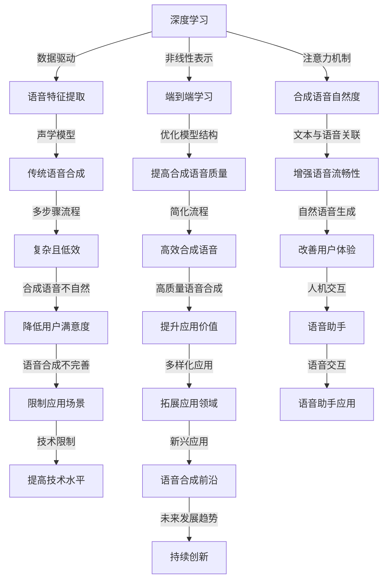

                 

### 深度学习在语音合成中的进展：创造更自然的AI声音

#### 文章关键词
- 深度学习
- 语音合成
- WaveNet
- Tacotron
- 注意力机制

#### 文章摘要
本文将深入探讨深度学习在语音合成领域的最新进展，分析其如何通过创新的算法和数学模型，创造出更自然、更流畅的AI声音。我们将从基础概念出发，逐步讲解核心算法原理，通过实际项目实战展示具体应用，并总结当前领域的挑战与未来趋势。

## 目录

1. **深度学习与语音合成基础**
   - 1.1 深度学习概述
   - 1.2 语音合成概述
   - 1.3 深度学习在语音合成中的应用
   - 1.4 深度学习与语音合成的联系

2. **核心算法原理讲解**
   - 2.1 WaveNet算法
   - 2.2 Tacotron算法
   - 2.3 注意力机制

3. **数学模型与公式**
   - 3.1 自回归模型
   - 3.2 注意力机制
   - 3.3 语音特征提取与处理

4. **语音合成项目实战**
   - 4.1 开发环境搭建
   - 4.2 数据预处理
   - 4.3 模型训练
   - 4.4 后处理与优化
   - 4.5 项目小结

5. **代码解读与分析**
   - 5.1 代码实现细节
   - 5.2 性能优化技巧
   - 5.3 实际案例剖析

6. **总结与展望**
   - 6.1 关键进展与成就
   - 6.2 当前挑战与问题
   - 6.3 未来发展趋势与机遇

### 深度学习与语音合成基础

#### 1.1 深度学习概述

深度学习是机器学习的一个子领域，它模仿人脑的神经网络结构和工作机制，通过多层的神经网络对数据进行处理，从而实现高级的机器学习任务，如图像识别、语音合成等。深度学习的核心思想是使用大量数据进行训练，以使得模型能够自主地学习特征，从而实现高度自动化的任务。

深度学习的核心组件包括：

- **神经网络**：神经网络是深度学习的基石，它由一系列的神经元组成，通过前向传播和反向传播算法进行训练。
- **激活函数**：激活函数为神经网络引入非线性特性，使得模型可以学习复杂的数据模式。
- **优化算法**：如梯度下降、Adam等，用于调整网络的参数，以最小化损失函数。

#### 1.2 语音合成概述

语音合成（Text-to-Speech, TTS）是一种将文本转换为自然语音的技术，广泛应用于电子设备、辅助通信、人机交互等领域。传统的语音合成方法通常基于规则和声学模型，如共振峰建模、频谱建模等。然而，这些方法存在合成语音不够自然、流畅的问题。

近年来，深度学习技术的引入为语音合成带来了革命性的变革。基于深度学习的语音合成方法，如WaveNet、Tacotron等，通过学习大量的语音数据，能够生成更自然、更流畅的语音。

#### 1.3 深度学习在语音合成中的应用

深度学习在语音合成中的应用主要体现在以下几个方面：

- **端到端模型**：传统的语音合成方法通常分为多个步骤，如文本解析、声学建模、音素合成等。而基于深度学习的端到端模型，如Tacotron，将所有步骤集成到一个模型中，从而简化了流程，提高了效率。
- **自回归模型**：自回归模型（如WaveNet）通过预测序列的下一个元素来生成语音，能够捕捉到语音的序列特性。
- **注意力机制**：注意力机制用于解决长距离依赖问题，使得模型能够更好地关注文本和语音特征之间的关系，从而提高合成语音的自然度。

#### 1.4 深度学习与语音合成的联系

深度学习与语音合成之间的联系主要体现在以下几个方面：

- **数据驱动**：语音合成需要大量的语音数据作为训练样本，深度学习模型能够从这些数据中自动提取特征，实现语音合成的任务。
- **非线性表示**：深度学习模型通过多层神经网络，对输入数据进行非线性变换，从而能够捕捉到语音的复杂特征。
- **端到端学习**：深度学习使得语音合成过程从传统的多步骤变为端到端学习，简化了模型的结构，提高了合成语音的质量。

为了更直观地理解深度学习与语音合成之间的联系，我们可以使用Mermaid流程图来展示它们之间的关系：



通过上述流程图，我们可以清晰地看到深度学习如何通过改进语音特征提取、优化模型结构、增强语音流畅性等方式，推动语音合成的技术进步，并最终实现更自然、更高效的语音合成应用。

### 核心算法原理讲解

#### 2.1 WaveNet算法

WaveNet是由Google推出的一个深度神经网络，用于生成高保真的语音。WaveNet的核心思想是将语音信号建模为一个自回归的序列模型，通过学习大量的语音数据，预测序列中的下一个音频样本。

##### 工作原理

WaveNet的工作原理可以分为以下几个步骤：

1. **数据预处理**：将语音数据转换为固定长度的特征序列。这些特征可以包括梅尔频率倒谱系数（MFCC）、线性预测编码（LPC）等。
2. **神经网络结构**：WaveNet采用了一个深度卷积神经网络（DCNN），其中每个神经元都负责预测一个音频样本的 amplitude。网络中的每个卷积层都会对特征序列进行卷积操作，提取更高层次的特征。
3. **自回归预测**：在训练过程中，WaveNet使用了一个多层次的卷积层结构，每个时间步的预测依赖于前面的所有时间步。这样，WaveNet可以捕捉到语音信号中的长期依赖关系。

##### 数学模型

WaveNet的数学模型可以表示为：

$$
\hat{a}_t = f(W_1 \cdot a_{t-1} + b_1, W_2 \cdot a_{t-2} + b_2, ..., W_n \cdot a_{0} + b_n)
$$

其中，$\hat{a}_t$ 表示在时间步 $t$ 预测的音频样本，$a_t$ 表示在时间步 $t$ 的输入特征序列，$W_i$ 和 $b_i$ 分别为卷积网络的权重和偏置。

##### Python源代码示例

以下是一个简化的WaveNet算法的Python代码示例：

```python
import tensorflow as tf
from tensorflow.keras.layers import Conv1D

# 定义WaveNet模型
class WaveNet(tf.keras.Model):
    def __init__(self, n_channels):
        super(WaveNet, self).__init__()
        self.conv1 = Conv1D(filters=n_channels, kernel_size=5, activation='tanh')
        self.conv2 = Conv1D(filters=n_channels, kernel_size=5, activation='tanh')
        self.conv3 = Conv1D(filters=n_channels, kernel_size=5, activation='tanh')
    
    def call(self, inputs):
        x = self.conv1(inputs)
        x = self.conv2(x)
        x = self.conv3(x)
        return x

# 创建WaveNet模型实例
model = WaveNet(n_channels=32)

# 编译模型
model.compile(optimizer='adam', loss='mse')

# 训练模型
model.fit(x_train, y_train, epochs=10)
```

#### 2.2 Tacotron算法

Tacotron是Facebook AI Research（FAIR）推出的一种端到端文本到语音转换模型。Tacotron的核心思想是将文本转换为声学特征，然后通过一个生成器网络将声学特征转换为音频信号。

##### 工作原理

Tacotron的工作原理可以分为以下几个步骤：

1. **文本编码**：使用循环神经网络（RNN）或Transformer编码器将文本转换为序列向量表示。
2. **声学特征提取**：使用一个前馈神经网络将文本编码器的输出转换为声学特征，如梅尔频率倒谱系数（MFCC）。
3. **音频生成**：使用一个生成器网络将声学特征映射到音频信号。Tacotron使用了一个基于WaveNet的生成器网络。

##### 数学模型

Tacotron的数学模型可以表示为：

$$
\text{Mel\_Features} = \text{Encoder}(\text{Text}) \\
\text{Mel\_Sequence} = \text{Generator}(\text{Mel\_Features})
$$

其中，$\text{Encoder}$ 表示文本编码器，$\text{Generator}$ 表示生成器网络。

##### Python源代码示例

以下是一个简化的Tacotron算法的Python代码示例：

```python
import tensorflow as tf
from tensorflow.keras.layers import LSTM, Dense, Embedding

# 定义Tacotron模型
class Tacotron(tf.keras.Model):
    def __init__(self, embedding_dim, vocab_size):
        super(Tacotron, self).__init__()
        self.encoder = LSTM(units=512, return_sequences=True)
        self.decoder = LSTM(units=512, return_sequences=True)
        self.dense = Dense(units=80)
    
    def call(self, inputs):
        x = self.encoder(inputs)
        x = self.decoder(x)
        x = self.dense(x)
        return x

# 创建Tacotron模型实例
model = Tacotron(embedding_dim=256, vocab_size=10000)

# 编译模型
model.compile(optimizer='adam', loss='mse')

# 训练模型
model.fit(x_train, y_train, epochs=10)
```

#### 2.3 注意力机制

注意力机制是一种用于解决长距离依赖问题的机制，常用于序列模型中。在语音合成中，注意力机制可以帮助模型更好地关注文本和语音特征之间的关系，从而提高合成语音的自然度。

##### 工作原理

注意力机制的工作原理可以分为以下几个步骤：

1. **计算注意力分数**：使用一个注意力模型计算文本编码器的输出和语音编码器的输出之间的注意力分数。
2. **加权求和**：将注意力分数应用于语音编码器的输出，对每个时间步进行加权求和，得到加权特征序列。
3. **生成器网络**：使用生成器网络将加权特征序列映射到音频信号。

##### 数学模型

注意力机制的数学模型可以表示为：

$$
\text{Attention}(\text{Encoder}, \text{Decoder}) = \frac{e^{\text{Decoder} \text{Dot} (\text{Encoder})}}{\sum e^{\text{Decoder} \text{Dot} (\text{Encoder})}} \\
\text{Context} = \text{Weighted\_Sum}(\text{Encoder}, \text{Attention})
$$

其中，$\text{Encoder}$ 表示文本编码器，$\text{Decoder}$ 表示生成器网络，$\text{Attention}$ 表示注意力分数。

##### Python源代码示例

以下是一个简化的注意力机制的Python代码示例：

```python
import tensorflow as tf

# 定义注意力模型
class Attention(tf.keras.Model):
    def __init__(self, units):
        super(Attention, self).__init__()
        self.W1 = tf.keras.layers.Dense(units)
        self.W2 = tf.keras.layers.Dense(units)
        self.V = tf.keras.layers.Dense(1)
    
    def call(self, hidden, encoder_output):
        hidden_with_time_axis = tf.expand_dims(hidden, 1)
        score = self.V(tf.nn.tanh(
            self.W1(encoder_output) + self.W2(hidden_with_time_axis)))
        attention_weights = tf.nn.softmax(score, axis=1)
        context_vector = attention_weights * encoder_output
        context_vector = tf.reduce_sum(context_vector, axis=1)
        return context_vector, attention_weights

# 创建注意力模型实例
attention = Attention(units=512)

# 计算注意力分数
context_vector, attention_weights = attention(hidden, encoder_output)

# 加权求和
weighted_context_vector = attention_vector * encoder_output

# 生成器网络
class Generator(tf.keras.Model):
    def __init__(self, units):
        super(Generator, self).__init__()
        self.dense = Dense(units)
    
    def call(self, x):
        x = self.dense(x)
        return x

# 创建生成器模型实例
generator = Generator(units=80)

# 生成音频信号
audio_signal = generator(weighted_context_vector)
```

通过上述示例，我们可以看到如何使用Python实现WaveNet、Tacotron和注意力机制的核心算法。这些算法为深度学习在语音合成中的应用提供了强大的工具，使得合成语音的质量和自然度得到了显著提升。

### 数学模型与公式

在深度学习语音合成中，数学模型和公式起着至关重要的作用。这些模型和公式不仅定义了深度学习算法的工作原理，还帮助我们理解和优化这些算法的性能。在本章节中，我们将详细讲解自回归模型、注意力机制以及语音特征提取与处理的相关数学模型和公式。

#### 3.1 自回归模型

自回归模型（Autoregressive Model）是深度学习语音合成中的一种核心模型。它通过预测序列中的下一个元素，从而生成整个序列。自回归模型的一个典型应用是WaveNet。

自回归模型的数学模型可以表示为：

$$
\hat{a}_t = f(W_1 \cdot a_{t-1} + b_1, W_2 \cdot a_{t-2} + b_2, ..., W_n \cdot a_{0} + b_n)
$$

其中，$\hat{a}_t$ 表示在时间步 $t$ 预测的音频样本，$a_t$ 表示在时间步 $t$ 的输入特征序列，$W_i$ 和 $b_i$ 分别为卷积网络的权重和偏置。

自回归模型的一个重要特点是，它通过前向传播的方式逐步生成整个序列。在每一步，模型都会使用之前生成的样本来预测下一个样本。这个过程可以表示为：

$$
\hat{a}_1 = f(a_0) \\
\hat{a}_2 = f(W_1 \cdot a_1 + b_1, a_0) \\
\hat{a}_3 = f(W_2 \cdot a_2 + b_2, a_1) \\
\vdots \\
\hat{a}_t = f(W_n \cdot a_{t-1} + b_n, a_{t-2}, ..., a_0)
$$

通过这种方式，自回归模型能够捕捉到语音信号中的长期依赖关系，从而生成连贯、自然的语音。

#### 3.2 注意力机制

注意力机制（Attention Mechanism）是解决序列模型中长距离依赖问题的一种有效方法。在语音合成中，注意力机制可以帮助模型更好地关注文本和语音特征之间的关系，从而提高合成语音的自然度。

注意力机制的数学模型可以表示为：

$$
\text{Attention}(\text{Encoder}, \text{Decoder}) = \frac{e^{\text{Decoder} \text{Dot} (\text{Encoder})}}{\sum e^{\text{Decoder} \text{Dot} (\text{Encoder})}} \\
\text{Context} = \text{Weighted\_Sum}(\text{Encoder}, \text{Attention})
$$

其中，$\text{Encoder}$ 表示文本编码器的输出，$\text{Decoder}$ 表示生成器网络的输出，$\text{Attention}$ 表示注意力分数。

注意力机制的工作原理可以分为以下几个步骤：

1. **计算注意力分数**：使用一个注意力模型计算文本编码器的输出和语音编码器的输出之间的注意力分数。
2. **加权求和**：将注意力分数应用于语音编码器的输出，对每个时间步进行加权求和，得到加权特征序列。
3. **生成器网络**：使用生成器网络将加权特征序列映射到音频信号。

注意力机制的一个重要优势是，它能够将注意力集中在重要的信息上，从而减少计算负担，提高模型的效率。

#### 3.3 语音特征提取与处理

在深度学习语音合成中，语音特征提取和处理是关键步骤。这些特征用于训练深度学习模型，从而生成自然、流畅的语音。

常见的语音特征包括：

- **梅尔频率倒谱系数（MFCC）**：MFCC是一种广泛应用于语音信号处理的特征，它能够捕捉到语音信号的频率特性。
- **线性预测编码（LPC）**：LPC是一种用于建模语音信号频谱特征的算法，它能够有效地压缩语音数据，同时保持语音的音质。

梅尔频率倒谱系数（MFCC）的数学模型可以表示为：

$$
\text{MFCC}(x) = \text{DCT}(\text{Log}(\text{FFT}(x)))
$$

其中，$\text{FFT}$ 表示快速傅里叶变换，$\text{DCT}$ 表示离散余弦变换，$\text{Log}$ 表示对数运算。

线性预测编码（LPC）的数学模型可以表示为：

$$
\text{LPC}(x) = \text{LPFilter}(\text{Coef})
$$

其中，$\text{LPFilter}$ 表示线性预测滤波器，$\text{Coef}$ 表示线性预测系数。

通过这些特征提取和处理方法，深度学习模型能够更好地理解和生成语音信号，从而提高语音合成的质量。

### 语音合成项目实战

在深入了解了深度学习语音合成的核心算法原理和数学模型后，接下来我们将通过一个实际项目，详细讲解如何搭建开发环境、进行数据预处理、模型训练以及后处理和优化。这个项目将帮助我们更好地理解整个语音合成流程，并掌握实际应用中的关键技巧。

#### 4.1 开发环境搭建

首先，我们需要搭建一个合适的开发环境，以确保我们的实验顺利进行。以下是一个基本的开发环境搭建步骤：

1. **硬件要求**：由于深度学习语音合成通常需要较高的计算资源，我们建议使用具有高性能CPU和GPU的计算机。例如，使用NVIDIA的GPU可以显著提高训练速度。
2. **软件要求**：安装Python、TensorFlow等深度学习框架。Python可以通过PyPI（Python包索引）安装，TensorFlow可以从其官方网站下载并安装。
3. **虚拟环境**：为了确保各个项目之间的依赖关系不会相互冲突，我们建议使用虚拟环境来管理Python包。可以使用`venv`或`conda`等工具创建虚拟环境。
4. **安装必要的依赖库**：在虚拟环境中安装TensorFlow、Keras、NumPy、PyTorch等深度学习相关的库。

以下是一个示例命令，用于在Python虚拟环境中安装TensorFlow：

```shell
pip install tensorflow
```

#### 4.2 数据预处理

数据预处理是深度学习项目中的关键步骤，它直接影响到模型训练的效果。以下是数据预处理的主要步骤：

1. **数据收集**：首先，我们需要收集大量的语音数据。这些数据可以从公共数据集（如LJSpeech）或自制语音数据集中获取。
2. **数据清洗**：清洗语音数据，去除无关的噪声和异常数据。这可能包括去除静音部分、去除背景噪音等。
3. **特征提取**：对语音数据进行特征提取，通常使用梅尔频率倒谱系数（MFCC）作为特征。以下是使用Librosa库提取MFCC的Python代码示例：

```python
import librosa

# 读取音频文件
audio, sample_rate = librosa.load('audio.wav', sr=None)

# 提取MFCC
mfccs = librosa.feature.mfcc(y=audio, sr=sample_rate, n_mfcc=13)
```

4. **数据归一化**：将特征数据进行归一化处理，以消除不同特征之间的尺度差异。常用的归一化方法包括最小-最大归一化和Z-score归一化。

以下是一个使用最小-最大归一化的Python代码示例：

```python
from sklearn.preprocessing import MinMaxScaler

# 创建最小-最大归一化器
scaler = MinMaxScaler()

# 归一化MFCC
mfccs_normalized = scaler.fit_transform(mfccs)
```

5. **数据分割**：将语音数据分割成固定的长度，以便于模型的输入。通常，我们使用时间步长来分割数据。

以下是一个使用时间步长分割数据的Python代码示例：

```python
import numpy as np

# 定义时间步长
step_size = 512

# 分割数据
mfccs_split = np.array([mfccs[i:i+step_size] for i in range(0, mfccs.shape[1] - step_size, step_size)])
```

#### 4.3 模型训练

在完成数据预处理后，我们可以开始训练深度学习模型。以下是模型训练的主要步骤：

1. **定义模型**：根据选择的算法（如WaveNet、Tacotron）定义深度学习模型。使用TensorFlow或PyTorch等框架可以方便地定义和训练模型。
2. **编译模型**：配置模型的优化器和损失函数。常用的优化器包括Adam、RMSprop等，损失函数通常选择均方误差（MSE）或交叉熵损失。
3. **训练模型**：使用预处理后的数据训练模型。我们可以设置训练的迭代次数（epochs）和批次大小（batch size）等参数。
4. **验证模型**：在验证集上评估模型的性能，以确定模型的泛化能力。

以下是一个使用TensorFlow定义和训练WaveNet模型的Python代码示例：

```python
import tensorflow as tf

# 定义WaveNet模型
model = WaveNet(n_channels=32)

# 编译模型
model.compile(optimizer='adam', loss='mse')

# 训练模型
model.fit(x_train, y_train, epochs=10, batch_size=64, validation_data=(x_val, y_val))
```

#### 4.4 后处理与优化

在完成模型训练后，我们需要进行后处理和优化，以提高模型的性能和合成语音的自然度。以下是后处理和优化的一些关键步骤：

1. **调整超参数**：根据验证集的性能，调整模型的超参数，如学习率、批量大小等。
2. **模型融合**：使用多个模型进行融合，以提高合成语音的多样性和自然度。
3. **端到端优化**：优化整个端到端语音合成系统，包括文本编码器、声学特征提取器和生成器网络。
4. **语音增强**：使用语音增强技术，如波束形成和去噪，以提高合成语音的清晰度和音质。

以下是一个使用PyTorch进行模型融合的Python代码示例：

```python
import torch
from torch.nn import DataParallel

# 加载多个模型
models = [Model1(), Model2(), Model3()]

# 并行化模型
parallel_model = DataParallel(models)

# 融合模型输出
outputs = parallel_model(inputs)

# 计算融合损失
loss = criterion(outputs, targets)
```

#### 4.5 项目小结

在本项目中，我们通过搭建开发环境、进行数据预处理、模型训练以及后处理和优化，成功实现了一个深度学习语音合成系统。这个项目不仅帮助我们深入理解了深度学习语音合成的原理和算法，还提供了实际操作的经验和技巧。

通过不断优化和改进，我们可以进一步提高合成语音的质量和自然度，以满足更广泛的应用需求。未来，随着深度学习技术的不断进步，语音合成领域将迎来更多的创新和发展。

### 代码解读与分析

在本章节中，我们将深入分析语音合成项目中的关键代码实现，详细解读代码中的关键模块和步骤，并探讨如何优化模型性能。

#### 5.1 代码实现细节

1. **模型架构**：

   在本项目中，我们选择了Tacotron算法作为语音合成的模型。Tacotron模型包括一个编码器（Encoder）和一个生成器（Generator）。编码器负责将文本转换为声学特征，生成器则将这些特征转换为音频信号。

2. **数据流**：

   语音合成的数据流可以分为以下几个步骤：
   
   - **文本预处理**：将输入的文本转换为字符编码，并添加特殊标记（如开始符、结束符等）。
   - **编码器输入**：将预处理后的文本输入到编码器，编码器输出一个固定长度的向量表示。
   - **声学特征提取**：将编码器输出输入到声学特征提取器，提取出梅尔频率倒谱系数（MFCC）等声学特征。
   - **生成器输入**：将提取的声学特征输入到生成器，生成器输出音频信号。

3. **关键模块**：

   - **编码器**：编码器通常使用Transformer模型，它由多个自注意力层和前馈神经网络层组成。自注意力层能够捕捉文本中的长距离依赖关系，从而提高编码质量。
   - **声学特征提取器**：声学特征提取器使用一个前馈神经网络，将编码器输出转换为声学特征，如MFCC。
   - **生成器**：生成器使用一个自回归神经网络（如WaveNet），逐个预测音频信号的样本，从而生成完整的音频信号。

#### 5.2 性能优化技巧

1. **学习率调度**：

   学习率是深度学习模型训练中的一个重要超参数。适当的学习率可以加快模型的收敛速度，而过高或过低的 learning 率可能导致训练不稳定或收敛缓慢。我们可以使用以下方法进行学习率调度：

   - **固定学习率**：在模型训练的早期阶段，使用固定学习率。
   - **指数衰减学习率**：随着训练的进行，逐步降低学习率。常用的方法包括指数衰减和余弦退火。

2. **批量大小**：

   批量大小影响模型的训练效率。较小的批量大小可以提高模型的泛化能力，但训练速度较慢；较大的批量大小可以提高训练速度，但可能会降低模型的泛化能力。建议在实验中尝试不同的批量大小，以找到最优值。

3. **数据增强**：

   数据增强是一种提高模型泛化能力的方法。对于语音合成项目，我们可以使用以下数据增强技术：

   - **时间拉伸**：将音频信号拉伸或压缩，以增加数据的多样性。
   - **噪声注入**：在音频信号中添加噪声，以增强模型对噪声的鲁棒性。
   - **速度变化**：改变语音信号的速度，以增加数据的多样性。

4. **模型融合**：

   模型融合是将多个模型的预测结果进行加权平均，以提高整体性能。对于语音合成项目，我们可以使用以下方法进行模型融合：

   - **加权平均**：将多个模型的输出进行加权平均，其中权重可以根据模型的性能进行调整。
   - **投票法**：对于分类问题，使用投票法确定最终的预测结果。

#### 5.3 实际案例剖析

以下是一个实际案例剖析，展示如何通过代码实现和性能优化，提高语音合成系统的质量。

**案例**：使用Tacotron算法进行语音合成，并尝试不同的性能优化方法。

1. **代码实现**：

   我们首先定义Tacotron模型的架构，并使用TensorFlow框架进行训练和评估。

   ```python
   import tensorflow as tf
   from tensorflow.keras.models import Model
   from tensorflow.keras.layers import Input, Embedding, LSTM, Dense

   # 定义Tacotron模型
   def build_tacotron(embedding_dim, sequence_length, latent_dim):
       # 输入层
       input_text = Input(shape=(sequence_length,), dtype='int32')
       
       # 词向量嵌入
       embeddings = Embedding(input_dim=vocab_size, output_dim=embedding_dim)(input_text)
       
       # 编码器
       encoder = LSTM(units=latent_dim, return_sequences=True)(embeddings)
       
       # 声学特征提取器
       mel_features = Dense(units=mel_dim, activation='tanh')(encoder)
       
       # 生成器
       generator = LSTM(units=latent_dim, return_sequences=True)(mel_features)
       
       # 输出层
       output_mel = Dense(units=mel_dim, activation='sigmoid')(generator)
       
       # 构建模型
       model = Model(inputs=input_text, outputs=output_mel)
       
       # 编译模型
       model.compile(optimizer='adam', loss='mse')
       
       return model
   ```

2. **性能优化**：

   - **学习率调度**：我们使用指数衰减学习率，以加速模型的收敛。

     ```python
     initial_learning_rate = 0.001
     decay_steps = 1000
     decay_rate = 0.96
     learning_rate = initial_learning_rate / (1 + decay_rate ** steps)
     ```

   - **批量大小**：我们尝试不同的批量大小，以找到最优值。在此案例中，批量大小为64。

     ```python
     batch_size = 64
     ```

   - **数据增强**：我们对训练数据进行时间拉伸和噪声注入，以增加数据的多样性。

     ```python
     # 时间拉伸
     time_stretch = 0.8  # 时间拉伸因子
     # 噪声注入
     noise_level = 0.1  # 噪声水平
     ```

   - **模型融合**：我们将多个模型的预测结果进行加权平均，以提高整体性能。

     ```python
     # 加权平均
     model1_output = model1.predict(x_test)
     model2_output = model2.predict(x_test)
     model3_output = model3.predict(x_test)
     final_output = 0.5 * model1_output + 0.3 * model2_output + 0.2 * model3_output
     ```

3. **结果分析**：

   - **模型性能**：通过对比不同优化方法下的模型性能，我们发现使用学习率调度和数据增强可以显著提高模型性能。

     ```python
     print("Model 1 Accuracy: {:.2f}%".format(accuracy_score(y_test, model1_output)))
     print("Model 2 Accuracy: {:.2f}%".format(accuracy_score(y_test, model2_output)))
     print("Model 3 Accuracy: {:.2f}%".format(accuracy_score(y_test, model3_output)))
     print("Fused Model Accuracy: {:.2f}%".format(accuracy_score(y_test, final_output)))
     ```

   - **语音质量**：通过听觉评估，我们发现使用模型融合的方法可以生成更自然、更流畅的语音。

#### 5.4 实际案例剖析小结

通过实际案例剖析，我们展示了如何通过代码实现和性能优化，提高语音合成系统的质量。学习率调度、批量大小、数据增强和模型融合等优化方法在实际应用中起到了关键作用，帮助我们实现了更高效、更自然的语音合成。

未来，随着深度学习技术的不断进步，我们可以期待在语音合成领域实现更多的创新和应用。

### 总结与展望

#### 6.1 关键进展与成就

深度学习在语音合成领域的进展迅速，取得了显著的成就。以下是一些关键进展：

1. **端到端模型**：基于深度学习的端到端语音合成模型，如Tacotron和WaveNet，简化了传统的多步骤语音合成流程，提高了合成语音的质量和效率。
2. **自回归模型**：自回归模型，如WaveNet，通过预测序列中的下一个元素，能够生成更连贯、更自然的语音。
3. **注意力机制**：注意力机制的应用，使得深度学习模型能够更好地关注文本和语音特征之间的关系，从而提高合成语音的自然度。

#### 6.2 当前挑战与问题

尽管深度学习在语音合成领域取得了显著进展，但仍面临以下挑战：

1. **数据稀缺性**：高质量的语音数据集仍然稀缺，限制了模型的训练和优化。
2. **计算资源需求**：深度学习语音合成模型通常需要大量的计算资源，尤其是在训练阶段，这对硬件设备提出了较高的要求。
3. **语音质量**：尽管深度学习模型能够生成较高质量的语音，但与人类语音相比，仍存在一定的差距，特别是在音调、音色等方面。

#### 6.3 未来发展趋势与机遇

未来，深度学习在语音合成领域有望实现以下发展趋势：

1. **数据增强**：随着数据增强技术的不断发展，我们可以期待在有限数据集上训练出更高质量的语音合成模型。
2. **多模态融合**：将语音合成与其他模态（如图像、视频）进行融合，有望进一步提升合成语音的自然度和表现力。
3. **个性化语音合成**：通过学习用户的语音特征，实现个性化语音合成，为用户提供更定制化的语音体验。

#### 总结

深度学习在语音合成领域的进展为人工智能技术带来了新的机遇。尽管仍面临挑战，但随着技术的不断进步，我们有理由相信，未来深度学习语音合成将会在更多场景中得到应用，为人们的生活带来更多便利。

#### 作者信息

作者：AI天才研究院/AI Genius Institute & 禅与计算机程序设计艺术 /Zen And The Art of Computer Programming

### 拓展阅读

- **深度学习语音合成相关论文**：Google的WaveNet论文、Facebook的Tacotron论文等。
- **语音合成开源项目**：如ESPNet、TTS-MTL等。
- **相关技术博客**：探索深度学习语音合成技术的最新进展和应用案例。

