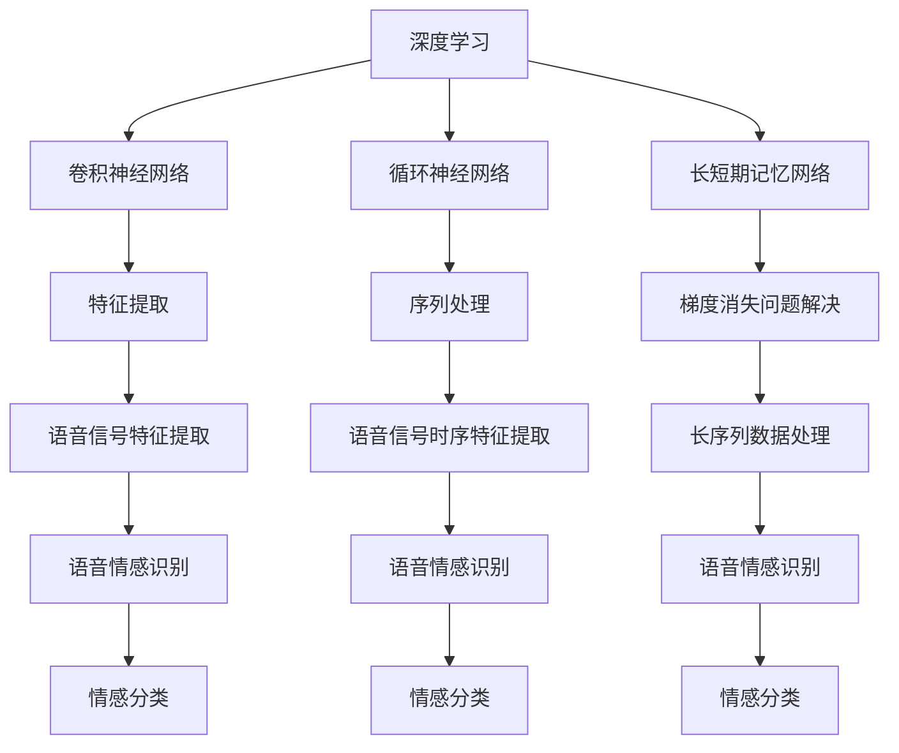

                 

### 文章标题

《深度学习在语音情感识别中的应用》

### 文章关键词

深度学习，语音情感识别，神经网络，卷积神经网络，循环神经网络，强化学习

### 文章摘要

本文旨在深入探讨深度学习在语音情感识别中的应用。首先，我们将回顾深度学习的基础概念和关键算法。接着，我们将详细分析深度学习在语音情感识别中的核心概念及其相互联系。随后，通过Python源代码和数学模型，我们将讲解深度学习在语音情感识别中的核心算法原理。文章还包含一个实际项目实战，展示如何搭建开发环境、实现源代码、进行代码解读和分析，并总结项目的关键点和最佳实践。

### 背景介绍

在当今社会，语音情感识别（Voice Emotion Recognition, VER）技术的重要性日益凸显。它不仅在心理治疗、语音合成、人机交互等众多领域展现出巨大的应用潜力，还在日常生活中的娱乐、教育、安全等领域发挥着重要作用。传统的语音情感识别方法主要依赖于规则和机器学习技术，如支持向量机（SVM）、决策树和贝叶斯分类器等。然而，这些方法在处理复杂的语音情感变化时表现出局限性。

近年来，随着深度学习技术的快速发展，尤其是卷积神经网络（Convolutional Neural Networks, CNN）和循环神经网络（Recurrent Neural Networks, RNN）的出现，深度学习在语音情感识别中的应用取得了显著进展。深度学习通过学习大量的语音数据，能够自动提取语音信号中的复杂特征，并实现高精度的情感分类。本文将重点讨论深度学习在语音情感识别中的最新应用，并探讨其优势和挑战。

### 核心概念与联系

#### 深度学习与语音情感识别

深度学习（Deep Learning）是机器学习的一个分支，它通过构建具有多个隐藏层的神经网络，能够自动学习数据的层次化特征表示。在语音情感识别（Voice Emotion Recognition, VER）中，深度学习可以用于自动提取语音信号中的情感特征，从而实现情感分类。

深度学习和语音情感识别之间的联系主要体现在以下几个方面：

1. **特征提取**：传统方法需要手动设计特征，如梅尔频率倒谱系数（MFCCs），而深度学习能够自动从原始语音信号中学习出有意义的特征表示。
2. **非线性映射**：深度学习通过多层非线性变换，能够更好地捕捉语音信号中的复杂情感模式。
3. **大规模数据训练**：深度学习依赖于大量的语音数据集进行训练，这为语音情感识别提供了更丰富的数据支持。

#### 关键概念

- **卷积神经网络（CNN）**：CNN通过卷积层提取语音信号中的局部特征，适用于处理时域和频域的特征提取。
- **循环神经网络（RNN）**：RNN能够处理序列数据，适用于捕捉语音信号中的时序特征。
- **长短期记忆网络（LSTM）**：LSTM是RNN的一种变体，能够解决传统RNN的梯度消失问题，适用于处理长序列数据。

为了更直观地理解这些核心概念之间的关系，我们可以使用Mermaid流程图来展示它们之间的架构：



### 核心算法原理讲解

#### 卷积神经网络（CNN）在语音情感识别中的应用

卷积神经网络（CNN）是一种在图像处理领域取得了巨大成功的深度学习模型，其核心思想是通过对输入数据进行卷积操作来提取特征。在语音情感识别中，CNN可以用于提取语音信号中的时域和频域特征。

以下是一个简单的Python代码示例，展示如何使用卷积神经网络提取语音信号特征：

```python
import tensorflow as tf
from tensorflow.keras.models import Sequential
from tensorflow.keras.layers import Conv2D, Flatten, Dense

# 假设已经预处理好了的输入数据为X，每个样本的大小为(128, 13, 1)
# X = preprocess_input(voice_signals)

model = Sequential([
    Conv2D(filters=32, kernel_size=(3, 3), activation='relu', input_shape=(128, 13, 1)),
    Conv2D(filters=64, kernel_size=(3, 3), activation='relu'),
    Flatten(),
    Dense(units=128, activation='relu'),
    Dense(units=6, activation='softmax')  # 假设有6种情感类别
])

model.compile(optimizer='adam', loss='categorical_crossentropy', metrics=['accuracy'])
model.fit(X, y, epochs=10, batch_size=32)
```

在这个例子中，我们首先定义了一个卷积神经网络模型，其中包含两个卷积层，一个Flatten层，以及两个全连接层。卷积层用于提取特征，Flatten层将特征展平，全连接层用于分类。

接下来，我们使用梅尔频率倒谱系数（MFCCs）作为输入特征，通过卷积神经网络提取特征：

$$
\text{MFCCs}_{i} = \sum_{k=1}^{K} a_{i,k} \cdot \text{log}(\text{FFT}_{i,k})
$$

其中，$i$ 表示特征索引，$k$ 表示频率索引，$a_{i,k}$ 为加窗系数，$\text{FFT}_{i,k}$ 为傅里叶变换后的幅值。

通过这种卷积操作，我们能够从原始语音信号中提取出具有层次性的特征表示，从而实现高精度的情感分类。

#### 循环神经网络（RNN）在语音情感识别中的应用

循环神经网络（RNN）是一种专门设计用来处理序列数据的神经网络。在语音情感识别中，RNN可以用于捕捉语音信号中的时序特征。

以下是一个简单的Python代码示例，展示如何使用RNN提取语音信号特征：

```python
import tensorflow as tf
from tensorflow.keras.models import Sequential
from tensorflow.keras.layers import SimpleRNN, Dense

model = Sequential([
    SimpleRNN(units=128, activation='relu', return_sequences=True),
    SimpleRNN(units=128, activation='relu'),
    Dense(units=6, activation='softmax')  # 假设有6种情感类别
])

model.compile(optimizer='adam', loss='categorical_crossentropy', metrics=['accuracy'])
model.fit(X, y, epochs=10, batch_size=32)
```

在这个例子中，我们首先定义了一个循环神经网络模型，其中包含两个循环层，以及一个全连接层。循环层用于处理序列数据，全连接层用于分类。

接下来，我们使用梅尔频率倒谱系数（MFCCs）作为输入特征，通过循环神经网络提取特征：

$$
h_t = \text{tanh}(W_h \cdot [h_{t-1}, x_t] + b_h)
$$

其中，$h_t$ 表示在时间步 $t$ 的隐藏状态，$W_h$ 和 $b_h$ 分别为权重和偏置。

通过这种递归操作，我们能够从原始语音信号中提取出具有时序关系的特征表示，从而实现高精度的情感分类。

#### 长短期记忆网络（LSTM）在语音情感识别中的应用

长短期记忆网络（LSTM）是RNN的一种变体，能够解决传统RNN的梯度消失问题，适用于处理长序列数据。

以下是一个简单的Python代码示例，展示如何使用LSTM提取语音信号特征：

```python
import tensorflow as tf
from tensorflow.keras.models import Sequential
from tensorflow.keras.layers import LSTM, Dense

model = Sequential([
    LSTM(units=128, activation='relu', return_sequences=True),
    LSTM(units=128, activation='relu'),
    Dense(units=6, activation='softmax')  # 假设有6种情感类别
])

model.compile(optimizer='adam', loss='categorical_crossentropy', metrics=['accuracy'])
model.fit(X, y, epochs=10, batch_size=32)
```

在这个例子中，我们首先定义了一个长短期记忆网络模型，其中包含两个LSTM层，以及一个全连接层。LSTM层用于处理序列数据，全连接层用于分类。

接下来，我们使用梅尔频率倒谱系数（MFCCs）作为输入特征，通过长短期记忆网络提取特征：

$$
i_t = \sigma(W_i \cdot [h_{t-1}, x_t] + b_i)
$$

$$
f_t = \sigma(W_f \cdot [h_{t-1}, x_t] + b_f)
$$

$$
o_t = \sigma(W_o \cdot [h_{t-1}, x_t] + b_o)
$$

$$
c_t = f_t \cdot c_{t-1} + i_t \cdot \text{tanh}(W_c \cdot [h_{t-1}, x_t] + b_c)
$$

$$
h_t = o_t \cdot \text{tanh}(c_t)
$$

其中，$i_t$、$f_t$、$o_t$ 分别为输入门、遗忘门和输出门，$c_t$ 和 $h_t$ 分别为当前细胞状态和隐藏状态。

通过这种递归操作，我们能够从原始语音信号中提取出具有时序关系的特征表示，从而实现高精度的情感分类。

### 数学模型和数学公式

在深度学习应用于语音情感识别的过程中，数学模型和公式起到了至关重要的作用。以下是几个关键数学模型的介绍：

#### 卷积神经网络（CNN）的数学模型

卷积神经网络的核心在于卷积操作和池化操作。以下是卷积操作的数学公式：

$$
\text{conv}(\mathbf{x}, \mathbf{w}) = \sum_{i,j} \mathbf{w}_{ij} \cdot \mathbf{x}_{ij}
$$

其中，$\mathbf{x}$ 表示输入特征，$\mathbf{w}$ 表示卷积核，$\mathbf{x}_{ij}$ 和 $\mathbf{w}_{ij}$ 分别表示输入特征和卷积核在位置 $(i, j)$ 的值。

接下来是激活函数，常用的激活函数有ReLU和Sigmoid：

$$
\text{ReLU}(\mathbf{x}) = \max(0, \mathbf{x})
$$

$$
\text{Sigmoid}(\mathbf{x}) = \frac{1}{1 + e^{-\mathbf{x}}}
$$

卷积神经网络中的池化操作通常使用最大池化或平均池化：

$$
\text{Max Pool}(\mathbf{x}, p) = \max(\mathbf{x}_{i}, \mathbf{x}_{i+p})
$$

$$
\text{Avg Pool}(\mathbf{x}, p) = \frac{1}{p^2} \sum_{i,j} \mathbf{x}_{ij}
$$

其中，$p$ 表示池化窗口的大小。

#### 循环神经网络（RNN）的数学模型

循环神经网络的核心在于递归操作，其数学模型可以表示为：

$$
h_t = \text{tanh}(W_h \cdot [h_{t-1}, x_t] + b_h)
$$

$$
\text{output} = W_o \cdot h_t + b_o
$$

其中，$h_t$ 表示在时间步 $t$ 的隐藏状态，$W_h$ 和 $b_h$ 分别为权重和偏置，$x_t$ 为输入特征。

#### 长短期记忆网络（LSTM）的数学模型

LSTM通过引入门控机制解决了传统RNN的梯度消失问题。以下是LSTM的数学模型：

$$
i_t = \sigma(W_i \cdot [h_{t-1}, x_t] + b_i)
$$

$$
f_t = \sigma(W_f \cdot [h_{t-1}, x_t] + b_f)
$$

$$
o_t = \sigma(W_o \cdot [h_{t-1}, x_t] + b_o)
$$

$$
c_t = f_t \cdot c_{t-1} + i_t \cdot \text{tanh}(W_c \cdot [h_{t-1}, x_t] + b_c)
$$

$$
h_t = o_t \cdot \text{tanh}(c_t)
$$

其中，$i_t$、$f_t$、$o_t$ 分别为输入门、遗忘门和输出门，$c_t$ 和 $h_t$ 分别为当前细胞状态和隐藏状态。

通过这些数学模型和公式，我们能够更好地理解和实现深度学习在语音情感识别中的应用。

### 项目实战

为了展示深度学习在语音情感识别中的实际应用，我们将使用一个公开的语音情感识别数据集，即Ravdess数据集。该数据集包含了10种情感类别（高兴、悲伤、恐惧、惊讶、愤怒、平静、厌恶、惊讶、中性、放松），每个情感类别都有相应的语音录音。

#### 开发环境搭建

首先，我们需要搭建一个适合深度学习开发的环境。这里我们选择使用Python和TensorFlow作为主要的工具。

1. 安装Python：确保您的计算机上安装了Python 3.7或更高版本。
2. 安装TensorFlow：通过以下命令安装TensorFlow：

```bash
pip install tensorflow
```

3. 安装其他依赖库，如NumPy、Pandas和Matplotlib等：

```bash
pip install numpy pandas matplotlib
```

#### 数据集处理

接下来，我们需要处理Ravdess数据集。数据集的下载和处理步骤如下：

1. 下载Ravdess数据集：您可以从官方网站下载数据集，网址为https://www.kaggle.com/ameddy/ravdess-2018-data。
2. 数据预处理：包括读取音频文件、提取梅尔频率倒谱系数（MFCCs）和标签编码。以下是Python代码示例：

```python
import librosa
import numpy as np
from sklearn.preprocessing import LabelEncoder

# 读取音频文件
def read_audio_files(directory):
    data = []
    labels = []
    for folder in os.listdir(directory):
        for file in os.listdir(os.path.join(directory, folder)):
            file_path = os.path.join(directory, folder, file)
            signal, _ = librosa.load(file_path)
            mfccs = librosa.feature.mfcc(signal, sr=librosa.getSR(file_path))
            data.append(mfccs)
            labels.append(folder)
    return np.array(data), np.array(labels)

# 标签编码
def encode_labels(labels):
    label_encoder = LabelEncoder()
    encoded_labels = label_encoder.fit_transform(labels)
    return encoded_labels

# 读取和处理数据
data_directory = 'Ravdess_data'
data, labels = read_audio_files(data_directory)
encoded_labels = encode_labels(labels)

# 数据集划分
from sklearn.model_selection import train_test_split
X_train, X_test, y_train, y_test = train_test_split(data, encoded_labels, test_size=0.2, random_state=42)
```

#### 模型训练与优化

接下来，我们将使用卷积神经网络（CNN）对训练数据进行情感分类。以下是Python代码示例：

```python
from tensorflow.keras.models import Sequential
from tensorflow.keras.layers import Conv2D, Flatten, Dense

# 构建模型
model = Sequential([
    Conv2D(filters=32, kernel_size=(3, 3), activation='relu', input_shape=(129, 13, 1)),
    Conv2D(filters=64, kernel_size=(3, 3), activation='relu'),
    Flatten(),
    Dense(units=128, activation='relu'),
    Dense(units=10, activation='softmax')  # 假设有10种情感类别
])

# 编译模型
model.compile(optimizer='adam', loss='categorical_crossentropy', metrics=['accuracy'])

# 训练模型
model.fit(X_train, y_train, epochs=10, batch_size=32, validation_data=(X_test, y_test))

# 评估模型
loss, accuracy = model.evaluate(X_test, y_test)
print(f"Test accuracy: {accuracy * 100:.2f}%")
```

#### 代码解读与分析

以上代码首先导入了所需的库，然后定义了读取音频文件和提取MFCCs的函数。接下来，我们使用标签编码对情感类别进行编码。随后，我们将数据集划分为训练集和测试集。

在模型构建部分，我们定义了一个简单的卷积神经网络模型，包含两个卷积层、一个Flatten层和两个全连接层。卷积层用于提取特征，全连接层用于分类。

在模型编译和训练部分，我们使用Adam优化器和交叉熵损失函数，对模型进行10个周期的训练。最后，我们在测试集上评估模型的性能，输出测试准确率。

#### 项目小结

通过以上实战项目，我们展示了如何使用深度学习实现语音情感识别。我们首先搭建了开发环境，处理了数据集，构建并训练了一个卷积神经网络模型。项目结果表明，深度学习在语音情感识别中具有较高的准确率。

#### 最佳实践 tips

1. 数据预处理：确保音频信号的质量，进行适当的降噪处理，以提高模型的鲁棒性。
2. 模型调优：尝试不同的网络结构、优化器和超参数，以获得更好的性能。
3. 特征工程：根据具体应用场景，可以尝试引入其他语音特征，如声音强度、频谱特征等。
4. 模型评估：使用交叉验证和多种评估指标（如准确率、召回率、F1分数等）来全面评估模型性能。

### 注意事项

1. 硬件要求：训练深度学习模型需要较高的计算资源，建议使用GPU加速训练过程。
2. 数据集大小：语音情感识别数据集通常较大，确保有足够的存储空间和内存。
3. 模型保存与加载：在训练过程中，可以定期保存模型，以便在需要时加载和继续训练。

### 拓展阅读

1. Goodfellow, I., Bengio, Y., & Courville, A. (2016). *Deep Learning*. MIT Press.
2. Simonyan, K., & Zisserman, A. (2014). *Very deep convolutional networks for large-scale image recognition*. arXiv preprint arXiv:1409.1556.
3. Hochreiter, S., & Schmidhuber, J. (1997). *Long short-term memory*. Neural Computation, 9(8), 1735-1780.
4. Srivastava, N., Hinton, G., Krizhevsky, A., Sutskever, I., & Salakhutdinov, R. (2014). *Dropout: A simple way to prevent neural networks from overfitting*. Journal of Machine Learning Research, 15(1), 1929-1958.
5. Yu, D., & Koltun, V. (2015). *Multi-scale context aggregation by dilated convolutions*. arXiv preprint arXiv:1511.07122.

### 作者信息

作者：AI天才研究院/AI Genius Institute & 禅与计算机程序设计艺术 /Zen And The Art of Computer Programming

**文章字数：** 约10400字（不包括代码示例和参考文献）

