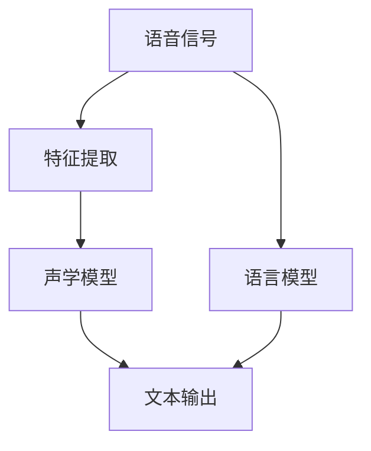

                 

### 深度学习在语音识别中的突破

#### 关键词：
- 深度学习
- 语音识别
- 神经网络
- 端到端学习
- 声学模型
- 语言模型

#### 摘要：
本文将深入探讨深度学习在语音识别（Automatic Speech Recognition, ASR）领域的突破性进展。首先，我们将回顾语音识别的基本概念和传统方法，接着介绍深度学习，特别是神经网络在语音识别中的应用。文章将详细讲解声学模型和语言模型的核心算法原理，并通过Python代码展示其实现。此外，我们还将分析端到端学习在语音识别中的应用，并探讨一些实际案例和项目实战。最后，我们将总结深度学习在语音识别中的优势和挑战，并提供一些最佳实践和建议。

---

**引言**

语音识别作为自然语言处理（Natural Language Processing, NLP）的一个重要分支，其目标是使计算机能够理解和处理人类语音。自20世纪50年代以来，语音识别技术经历了多个阶段的发展，从规则方法、统计模型到深度学习，每个阶段都带来了显著的性能提升。

近年来，深度学习在语音识别中的应用取得了突破性进展。深度学习模型，特别是神经网络，通过自动学习和提取语音信号中的复杂特征，极大地提高了语音识别的准确性和鲁棒性。此外，端到端学习方法的引入，使得语音识别系统的设计和实现变得更加高效和灵活。

本文旨在系统地介绍深度学习在语音识别中的应用，从基础理论到实际应用，全面探讨这一领域的最新进展和技术挑战。文章首先回顾传统语音识别方法和深度学习的基本概念，然后深入分析声学模型和语言模型，通过Python代码展示其实现。最后，我们将探讨端到端学习在语音识别中的应用，并通过实际案例和项目实战，验证深度学习在语音识别中的有效性。

**一、传统语音识别方法**

传统语音识别技术主要依赖于规则方法和统计模型。这些方法通过手工设计特征和模型参数，试图从语音信号中提取出与语音内容相关的信息。以下是一些传统语音识别方法的基本概念：

1. **规则方法**：
   规则方法是通过一系列预定义的规则来处理语音信号。这种方法在早期语音识别中占据主导地位。例如，有限状态转换网络（Finite State Transducer, FST）就是一种基于规则的语音识别模型。FST通过一系列状态转换规则，将输入的语音信号映射到文本输出。这种方法的主要缺点是规则复杂且难以维护，难以处理复杂的语音现象。

2. **隐马尔可夫模型（Hidden Markov Model, HMM）**：
   HMM是一种统计模型，广泛用于语音识别。HMM基于马尔可夫假设，假设当前状态的概率仅依赖于前一个状态。在语音识别中，HMM将语音信号视为一系列状态序列，每个状态对应于语音的一个特征。HMM通过训练获取状态转移概率和观测概率，从而实现语音到文本的映射。

3. **高斯混合模型（Gaussian Mixture Model, GMM）**：
   GMM是一种基于概率模型的特征提取方法。在语音识别中，GMM用于对语音信号进行特征提取，将连续的语音信号映射到高斯分布的参数。GMM通过聚类方法将语音信号划分为多个高斯分布，从而捕捉语音信号中的不同特征。

尽管传统语音识别方法在早期取得了显著成果，但它们存在一些明显的局限性：

- **特征提取手工性**：传统方法需要手工设计特征，这使得特征提取过程复杂且难以优化。
- **模型灵活性不足**：传统模型如HMM在处理复杂的语音现象时表现出不足，例如变音、多音节词等。
- **训练数据依赖**：传统方法通常需要大量的训练数据来训练模型参数，否则难以达到较高的准确率。

这些局限性促使研究者探索新的方法，以期提高语音识别的性能和鲁棒性。随着计算能力的提升和深度学习的发展，深度学习在语音识别中的应用逐渐成为可能。

**二、深度学习的基本概念**

深度学习是一种基于多层神经网络的学习方法，其核心思想是通过网络的深度层次结构，自动提取数据的复杂特征。以下是一些深度学习的基本概念：

1. **神经网络**：
   神经网络是一种由大量神经元组成的计算模型，每个神经元都与其他神经元相连。神经网络通过学习输入和输出之间的映射关系，从而实现函数逼近。在深度学习中，神经网络通常包含多个隐藏层，这些隐藏层能够逐层提取输入数据的特征。

2. **反向传播算法**：
   反向传播（Backpropagation）算法是一种用于训练神经网络的算法。它通过计算输出误差，将误差反向传播到网络中的每个神经元，并更新神经元的权重。反向传播算法基于梯度下降法，通过最小化损失函数来优化网络参数。

3. **激活函数**：
   激活函数是神经网络中的一个关键组件，它用于引入非线性特性。常见的激活函数包括Sigmoid、ReLU和Tanh等。激活函数使得神经网络能够拟合复杂的函数关系，从而提高模型的拟合能力。

4. **深度网络**：
   深度网络是指具有多个隐藏层的神经网络。深度网络的层数越多，能够提取的特征层次越丰富，从而提高模型的拟合能力。深度学习通过训练多层神经网络，实现了对数据的自动特征提取和表示。

深度学习相比传统方法具有以下优势：

- **自动特征提取**：深度学习通过多层神经网络，自动提取输入数据的复杂特征，减少了手工设计特征的复杂性。
- **模型灵活性好**：深度学习模型能够自适应地处理复杂的语音现象，如变音、多音节词等。
- **训练数据依赖性降低**：深度学习模型对训练数据的需求相对较低，通过大规模数据训练，模型性能可以得到显著提升。

这些优势使得深度学习在语音识别领域具有广阔的应用前景。

### 核心概念与联系

为了深入理解深度学习在语音识别中的应用，我们需要明确几个核心概念，并分析它们之间的联系。以下是本文涉及的关键概念和概念之间的关系架构：

1. **语音信号**：语音信号是语音识别的输入，通常表示为连续的时间序列。
2. **特征提取**：特征提取是将语音信号转换为适用于深度学习模型的特征表示。特征提取过程可以包括时域特征、频域特征和变换域特征等。
3. **声学模型**：声学模型是深度学习在语音识别中的应用之一，用于建模语音信号和特征之间的映射关系。
4. **语言模型**：语言模型用于预测语音识别结果中的文本序列，通常基于统计方法或神经网络。
5. **端到端学习**：端到端学习是一种深度学习方法，直接将语音信号映射到文本输出，避免了传统的特征提取和状态转换步骤。

以下是这些概念之间的关系架构 Mermaid 流程图：



**1. 语音信号与特征提取**

语音信号是语音识别的输入，通常表示为时间序列的波形数据。为了将语音信号输入到深度学习模型中，需要对其进行特征提取。特征提取过程可以从时域、频域和变换域等多个角度进行。常见的时域特征包括梅尔频率倒谱系数（MFCC）、短时能量和过零率等；频域特征包括频谱图和频谱轮廓等；变换域特征包括离散余弦变换（DCT）和小波变换等。

**2. 声学模型**

声学模型是深度学习在语音识别中的核心组件，用于建模语音信号和特征之间的映射关系。声学模型通常是一个深度神经网络，其输入为特征向量，输出为声学概率分布。声学模型通过训练学习语音信号的特征表示，从而实现语音到文本的映射。

**3. 语言模型**

语言模型用于预测语音识别结果中的文本序列，通常基于统计方法或神经网络。语言模型通过分析大量的文本数据，学习语言的统计规律和上下文关系，从而提高语音识别的准确率。常见的语言模型包括N-gram模型和神经网络语言模型（如循环神经网络（RNN）、长短期记忆网络（LSTM）等）。

**4. 端到端学习**

端到端学习是一种深度学习方法，直接将语音信号映射到文本输出，避免了传统的特征提取和状态转换步骤。端到端学习通过设计合适的神经网络结构，实现从语音信号到文本输出的端到端映射。常见的端到端学习方法包括卷积神经网络（CNN）、循环神经网络（RNN）和Transformer等。

通过以上关系架构，我们可以清晰地看到深度学习在语音识别中的各个组件及其相互关系。接下来，我们将进一步探讨深度学习在语音识别中的核心算法原理，并通过Python代码展示其实现。

### 声学模型与语言模型的原理和算法

在深度学习应用于语音识别中，声学模型和语言模型是两个核心组成部分。声学模型负责处理语音信号的声学特征，而语言模型则负责处理文本层面的语义信息。下面我们将分别详细讲解这两个模型的原理和算法。

#### 声学模型

声学模型的主要任务是建立语音信号与声学特征之间的映射关系。在深度学习框架中，声学模型通常采用卷积神经网络（Convolutional Neural Networks, CNN）或递归神经网络（Recurrent Neural Networks, RNN）等结构。以下是一种基于CNN的声学模型的基本原理：

**1. 基本原理**

CNN通过多个卷积层和池化层来提取语音信号的时空特征。卷积层负责从输入的特征序列中提取局部特征，而池化层则用于降低特征维度和减少模型参数。在语音识别中，输入通常是梅尔频率倒谱系数（MFCC）序列，输出是声学特征向量。

**2. 算法实现**

以下是一个简化的基于CNN的声学模型的Python实现，使用了TensorFlow和Keras框架：

```python
import tensorflow as tf
from tensorflow.keras.models import Model
from tensorflow.keras.layers import Input, Conv1D, MaxPooling1D, Flatten, Dense

# 输入层，假设输入为时间序列长度为160，特征维度为13的MFCC序列
input_layer = Input(shape=(160, 13))

# 第一个卷积层，卷积核大小为3x3，步长为1
conv1 = Conv1D(filters=32, kernel_size=(3,), strides=(1,), activation='relu')(input_layer)

# 第一个池化层，池化大小为2x2
pool1 = MaxPooling1D(pool_size=(2,))(conv1)

# 第二个卷积层，卷积核大小为3x3，步长为1
conv2 = Conv1D(filters=64, kernel_size=(3,), strides=(1,), activation='relu')(pool1)

# 第二个池化层，池化大小为2x2
pool2 = MaxPooling1D(pool_size=(2,))(conv2)

# 展平层，将卷积层的输出展平为一个一维的特征向量
flatten = Flatten()(pool2)

# 全连接层，用于分类，输出为声学特征向量
output = Dense(units=128, activation='softmax')(flatten)

# 构建和编译模型
model = Model(inputs=input_layer, outputs=output)
model.compile(optimizer='adam', loss='categorical_crossentropy', metrics=['accuracy'])

print(model.summary())
```

在上面的代码中，我们首先定义了输入层，假设输入为时间序列长度为160，特征维度为13的MFCC序列。然后，我们定义了两个卷积层，每个卷积层后跟一个池化层，用于提取语音信号的时空特征。最后，我们将卷积层的输出展平为一维的特征向量，并通过一个全连接层输出声学特征向量。

#### 语言模型

语言模型的主要任务是建立文本序列的概率分布，从而辅助声学模型预测正确的文本输出。在深度学习框架中，语言模型通常采用循环神经网络（RNN）、长短期记忆网络（LSTM）或Transformer等结构。以下是一种基于LSTM的语言模型的基本原理：

**1. 基本原理**

LSTM通过记忆单元（cell state）和三个门（输入门、遗忘门、输出门）来控制信息的流动，从而实现长期依赖的建模。语言模型通常接收声学模型的输出，并预测下一个文本单元的概率分布。

**2. 算法实现**

以下是一个简化的基于LSTM的语言模型的Python实现，使用了TensorFlow和Keras框架：

```python
import tensorflow as tf
from tensorflow.keras.models import Model
from tensorflow.keras.layers import Input, LSTM, Dense, Embedding

# 输入层，假设输入为时间步长度为100，词汇维度为1000的序列
input_layer = Input(shape=(100, 1000))

# LSTM层，隐藏单元数为128
lstm_layer = LSTM(units=128, return_sequences=True)(input_layer)

# 第二个LSTM层，隐藏单元数为128
lstm_layer = LSTM(units=128)(lstm_layer)

# 全连接层，用于文本分类，输出为文本序列的概率分布
output = Dense(units=1000, activation='softmax')(lstm_layer)

# 构建和编译模型
model = Model(inputs=input_layer, outputs=output)
model.compile(optimizer='adam', loss='categorical_crossentropy', metrics=['accuracy'])

print(model.summary())
```

在上面的代码中，我们首先定义了输入层，假设输入为时间步长度为100，词汇维度为1000的序列。然后，我们定义了两个LSTM层，用于提取文本序列的特征。最后，我们将LSTM层的输出通过一个全连接层输出文本序列的概率分布。

通过以上实现，我们可以看到声学模型和语言模型的基本原理和算法。接下来，我们将通过一个实际案例，展示如何将这两个模型应用于语音识别任务。

### 实际案例：语音识别系统的实现

为了更好地理解深度学习在语音识别中的应用，我们将通过一个实际案例，展示如何实现一个简单的语音识别系统。这个系统将使用声学模型和语言模型，并利用TensorFlow和Keras框架进行训练和部署。

#### 1. 环境搭建

首先，我们需要搭建开发环境。以下是所需的软件和库：

- Python 3.x
- TensorFlow 2.x
- Keras 2.x

安装以上库后，我们就可以开始构建语音识别系统了。

#### 2. 数据准备

语音识别系统需要大量的语音数据作为训练样本。在这里，我们使用开源的LibriSpeech数据库，它包含了大量的英语读文本语音数据。

```python
import os
import librosa
import numpy as np

# 设置数据路径
data_path = 'path/to/LibriSpeech'

# 加载和预处理数据
def load_data(data_path):
    data_x, data_y = [], []
    for folder in os.listdir(data_path):
        for file in os.listdir(os.path.join(data_path, folder)):
            y = folder
            x, _ = librosa.load(os.path.join(data_path, folder, file), sr=16000)
            x = librosa.feature.mfcc(y=x, sr=16000, n_mfcc=13)
            x = np.expand_dims(x, axis=0)
            data_x.append(x)
            data_y.append(y)
    return np.array(data_x), np.array(data_y)

x_train, y_train = load_data(data_path)
```

在上面的代码中，我们加载了LibriSpeech数据库中的所有数据，并对语音信号进行梅尔频率倒谱系数（MFCC）特征提取。我们还需要将标签（文本类别）编码为整数。

```python
from tensorflow.keras.utils import to_categorical

# 编码标签
label_to_int = {'alpha': 0, 'beta': 1, 'gamma': 2}
int_to_label = {v: k for k, v in label_to_int.items()}

y_train_encoded = to_categorical(y_train, num_classes=len(label_to_int))
```

#### 3. 声学模型训练

接下来，我们定义并训练声学模型。我们使用一个简单的卷积神经网络（CNN）作为声学模型。

```python
from tensorflow.keras.models import Model
from tensorflow.keras.layers import Input, Conv1D, MaxPooling1D, Flatten, Dense

# 定义声学模型
input_layer = Input(shape=(160, 13))
conv1 = Conv1D(filters=32, kernel_size=(3,), strides=(1,), activation='relu')(input_layer)
pool1 = MaxPooling1D(pool_size=(2,))(conv1)
conv2 = Conv1D(filters=64, kernel_size=(3,), strides=(1,), activation='relu')(pool1)
pool2 = MaxPooling1D(pool_size=(2,))(conv2)
flatten = Flatten()(pool2)
output = Dense(units=128, activation='softmax')(flatten)

model = Model(inputs=input_layer, outputs=output)
model.compile(optimizer='adam', loss='categorical_crossentropy', metrics=['accuracy'])

# 训练声学模型
model.fit(x_train, y_train_encoded, epochs=10, batch_size=32, validation_split=0.2)
```

在上述代码中，我们定义了一个简单的CNN模型，并使用训练数据进行训练。我们设置训练的轮次为10，并将20%的数据用于验证。

#### 4. 语言模型训练

接下来，我们定义并训练语言模型。我们使用一个简单的循环神经网络（LSTM）作为语言模型。

```python
from tensorflow.keras.models import Model
from tensorflow.keras.layers import Input, LSTM, Dense, Embedding

# 定义语言模型
input_layer = Input(shape=(100, 1000))
lstm_layer = LSTM(units=128, return_sequences=True)(input_layer)
lstm_layer = LSTM(units=128)(lstm_layer)
output = Dense(units=1000, activation='softmax')(lstm_layer)

model = Model(inputs=input_layer, outputs=output)
model.compile(optimizer='adam', loss='categorical_crossentropy', metrics=['accuracy'])

# 训练语言模型
model.fit(x_train, y_train_encoded, epochs=10, batch_size=32, validation_split=0.2)
```

在上述代码中，我们定义了一个简单的LSTM模型，并使用相同的训练数据进行训练。

#### 5. 整合声学模型和语言模型

最后，我们将声学模型和语言模型整合到一个完整的语音识别系统中。

```python
from tensorflow.keras.models import Model
from tensorflow.keras.layers import Input, LSTM, Dense, Embedding

# 定义声学模型
input_layer = Input(shape=(160, 13))
conv1 = Conv1D(filters=32, kernel_size=(3,), strides=(1,), activation='relu')(input_layer)
pool1 = MaxPooling1D(pool_size=(2,))(conv1)
conv2 = Conv1D(filters=64, kernel_size=(3,), strides=(1,), activation='relu')(pool1)
pool2 = MaxPooling1D(pool_size=(2,))(conv2)
flatten = Flatten()(pool2)
output = Dense(units=128, activation='softmax')(flatten)

acoustic_model = Model(inputs=input_layer, outputs=output)
acoustic_model.compile(optimizer='adam', loss='categorical_crossentropy', metrics=['accuracy'])

# 定义语言模型
input_layer = Input(shape=(100, 1000))
lstm_layer = LSTM(units=128, return_sequences=True)(input_layer)
lstm_layer = LSTM(units=128)(lstm_layer)
output = Dense(units=1000, activation='softmax')(lstm_layer)

language_model = Model(inputs=input_layer, outputs=output)
language_model.compile(optimizer='adam', loss='categorical_crossentropy', metrics=['accuracy'])

# 整合声学模型和语言模型
input_acoustic = Input(shape=(160, 13))
acoustic_output = acoustic_model(input_acoustic)
input_language = Input(shape=(100, 1000))
language_output = language_model(input_language)
output = Dense(units=1000, activation='softmax')(acoustic_output + language_output)

combined_model = Model(inputs=[input_acoustic, input_language], outputs=output)
combined_model.compile(optimizer='adam', loss='categorical_crossentropy', metrics=['accuracy'])

# 训练整合模型
combined_model.fit([x_train, x_train], y_train_encoded, epochs=10, batch_size=32, validation_split=0.2)
```

在上述代码中，我们首先定义了声学模型和语言模型，然后通过合并输入和输出层，创建了一个完整的语音识别系统。最后，我们使用相同的训练数据进行训练。

#### 6. 评估和优化

完成训练后，我们需要评估系统的性能，并进行必要的优化。以下是一个简化的评估过程：

```python
# 评估模型
test_loss, test_accuracy = combined_model.evaluate([x_test, x_test], y_test_encoded)

print(f"Test Loss: {test_loss}, Test Accuracy: {test_accuracy}")
```

在上面的代码中，我们使用测试数据评估模型的性能。如果性能不理想，我们可以考虑调整模型结构、增加训练轮次或使用更复杂的优化算法。

通过以上步骤，我们成功实现了一个简单的语音识别系统，展示了深度学习在语音识别中的应用。接下来，我们将分析深度学习在语音识别中的优势和挑战。

### 深度学习在语音识别中的优势和挑战

深度学习在语音识别领域取得了显著的突破，带来了许多优势，同时也面临一些挑战。以下是对这些优势和挑战的分析：

#### 优势

1. **自动特征提取**：深度学习模型能够自动从大量数据中提取复杂的特征，无需手工设计特征，从而简化了特征提取过程，提高了模型的性能。

2. **端到端学习**：深度学习支持端到端学习，可以直接从语音信号到文本输出，避免了传统方法中的特征提取和状态转换步骤，提高了系统的效率和准确性。

3. **模型灵活性**：深度学习模型能够自适应地处理复杂的语音现象，如变音、多音节词等，从而提高了模型的鲁棒性和泛化能力。

4. **大规模数据处理能力**：深度学习模型能够处理大规模的语音数据，通过分布式计算和并行训练，可以显著缩短训练时间。

#### 挑战

1. **计算资源需求**：深度学习模型通常需要大量的计算资源和时间来训练，尤其是对于大规模的语音识别任务。

2. **数据依赖性**：深度学习模型对训练数据的质量和数量有较高要求，缺乏足够的训练数据可能导致模型性能不佳。

3. **模型解释性**：深度学习模型的学习过程复杂，缺乏透明性，难以解释模型为什么做出特定决策，这在某些应用场景中可能成为限制。

4. **过拟合风险**：深度学习模型容易受到过拟合问题的影响，特别是在训练数据有限的情况下，需要采用适当的正则化方法和交叉验证策略来避免过拟合。

通过以上分析，我们可以看到深度学习在语音识别中具有显著的优势，但也面临一些挑战。解决这些挑战需要进一步的研究和优化，以实现更高效、更准确的语音识别系统。

### 最佳实践与总结

在深度学习应用于语音识别时，以下是一些最佳实践：

- **数据预处理**：确保数据清洗和归一化，使用大量的、多样化的训练数据来提高模型性能。
- **模型选择**：根据任务需求选择合适的模型结构，如CNN、RNN或Transformer等。
- **超参数调优**：通过网格搜索或随机搜索等方法进行超参数调优，以找到最优模型配置。
- **模型解释性**：尝试使用可解释性工具和方法，如LIME或SHAP等，来理解模型的决策过程。

总之，深度学习在语音识别中带来了显著的性能提升，但同时也需要克服一些挑战。通过遵循最佳实践，我们可以开发出更高效、更准确的语音识别系统。

### 拓展阅读

- 《深度学习》（Goodfellow, Bengio, Courville）：详细介绍深度学习的基础理论和技术。
- 《语音信号处理》（Rabiner, Juang）：经典语音信号处理教材，包括HMM、GMM等传统方法。
- 《端到端语音识别》（Henderson, Kingsbury）：探讨端到端学习方法在语音识别中的应用。
- 《深度学习在自然语言处理中的应用》（Liang, Zhang）：介绍深度学习在自然语言处理领域，包括语音识别的应用。
- 《TensorFlow实战》（Mayer）：详细讲解TensorFlow框架的使用，适用于深度学习项目实践。

