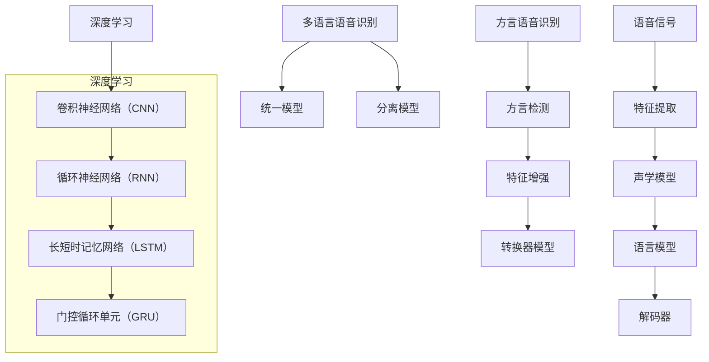

                 

 

### 背景介绍

随着人工智能技术的迅猛发展，深度学习在语音识别领域取得了显著的进展。语音识别技术，作为人机交互的关键组成部分，已经广泛应用于各种场景，如语音助手、实时翻译、智能客服等。传统的语音识别系统主要依赖于统计模型和手工设计特征，而深度学习技术的引入，使得语音识别系统在准确率、鲁棒性和实时性等方面都得到了显著提升。

然而，在现实世界中，语音识别面临着多语言和方言的挑战。不同语言和方言的语音信号具有不同的声学特征和语言规则，这使得多语言和方言语音识别成为一项极具挑战性的任务。具体来说，多语言语音识别需要同时处理多种语言的语音信号，而方言语音识别则需要适应特定地区或群体的语音特征。

本文将深入探讨深度学习在语音识别领域的进展，特别是多语言和方言语音识别的挑战。我们将从以下几个方面进行讨论：

1. **深度学习基础**：首先，我们将回顾深度学习的基本概念、原理和常用模型，为后续讨论打下基础。
2. **语音识别基础**：接着，我们将介绍语音信号处理的基本知识，以及语音识别的基本流程。
3. **多语言语音识别**：我们将讨论多语言语音识别的挑战和解决方案，包括语言模型、声学模型和多语言数据集的构建。
4. **方言语音识别**：我们将探讨方言语音识别的特殊问题和技术，如方言检测、特征增强和转换器模型。
5. **案例分析**：我们将通过一些实际的案例研究，展示深度学习在语音识别中的应用。
6. **前沿技术**：我们将介绍当前在多语言和方言语音识别领域的最新研究和技术。
7. **结论与展望**：最后，我们将总结本书的内容，并对未来的发展方向进行展望。

通过本文的探讨，我们希望读者能够对深度学习在语音识别中的进展，尤其是多语言和方言语音识别的挑战，有更深入的了解。接下来，我们将逐步分析每一个环节，以期揭示深度学习在语音识别领域中的奥秘。

### 关键概念与联系

在深入探讨深度学习在语音识别中的进展之前，有必要首先明确几个核心概念，并阐述它们之间的联系。以下是本文涉及的关键概念及其关系架构的Mermaid流程图：



**1. 语音信号与特征提取**

语音信号是语音识别的输入，它是一种时变信号，包含了语音的频率、时长、音调等信息。为了将这些连续的语音信号转化为计算机可以处理的格式，我们需要进行特征提取。特征提取是将语音信号转换为一系列离散的、易于分析的数值特征，如MFCC（梅尔频率倒谱系数）、LPCC（线性预测倒谱系数）等。

**2. 声学模型与语言模型**

声学模型负责将语音信号转换为文本，它通过分析语音特征来预测下一个可能的音素或单词。语言模型则负责根据上下文信息，对语音信号中的音素或单词进行排序和组合。声学模型和语言模型是语音识别系统的核心组件，它们共同工作，通过解码器（如隐马尔可夫模型（HMM）或神经网络解码器）将语音信号转换为文本。

**3. 多语言语音识别**

多语言语音识别需要同时处理多种语言的语音信号，这涉及到统一模型和分离模型两种策略。统一模型将所有语言的数据混合在一起进行训练，而分离模型则为每种语言分别训练独立的模型。这两种策略各有优劣，需要根据具体应用场景进行选择。

**4. 方言语音识别**

方言语音识别是语音识别的一个特殊分支，它需要识别和适应特定地区或群体的语音特征。方言检测是方言语音识别的关键步骤，它用于识别语音中的方言特征。特征增强和转换器模型则是提高方言识别准确性的有效方法。

**5. 深度学习模型**

深度学习模型，特别是卷积神经网络（CNN）、循环神经网络（RNN）、长短时记忆网络（LSTM）和门控循环单元（GRU），为语音识别提供了强大的工具。这些模型可以自动学习语音特征和语言规则，从而提高识别准确率和鲁棒性。

通过上述Mermaid流程图，我们可以清晰地看到深度学习在语音识别中各个环节的核心概念及其相互关系。接下来，我们将逐一深入探讨这些概念和技术，以期揭示深度学习在语音识别中的奥秘。

### 深度学习基础

深度学习是一种基于多层神经网络的结构，它通过模拟人脑神经元之间的连接和交互来学习复杂的数据模式。在语音识别领域，深度学习技术的引入大大提升了系统的性能和效果。下面，我们将简要回顾深度学习的基本概念、原理和常用模型，为后续讨论深度学习在语音识别中的应用打下基础。

#### 基本概念

深度学习中的“深度”指的是神经网络中的层数，多层神经网络能够通过逐层提取数据中的特征，从而实现高层次的抽象表示。深度学习的基本概念包括：

- **神经元（Neuron）**：深度学习的基本单元，类似于人脑的神经元。它接收多个输入信号，通过权重（weight）进行加权求和，然后通过激活函数（activation function）产生输出。
- **层（Layer）**：神经网络中的一层，包括多个神经元。输入层接收外部输入，隐藏层进行特征提取和转换，输出层产生最终输出。
- **网络（Network）**：由多个层组成的神经网络，通过前向传播（forward propagation）和反向传播（backpropagation）算法进行训练和优化。

#### 原理

深度学习的工作原理可以概括为以下几个步骤：

1. **前向传播（Forward Propagation）**：输入数据通过网络的各个层，每层的神经元对数据进行加权求和并应用激活函数，最终产生输出。
2. **损失函数（Loss Function）**：将网络的输出与真实标签进行比较，计算输出误差。常用的损失函数包括均方误差（MSE）、交叉熵（Cross-Entropy）等。
3. **反向传播（Backpropagation）**：根据损失函数的梯度，逆向传播误差信号，通过调整网络权重和偏置来优化模型。
4. **更新权重（Update Weights）**：利用梯度下降（Gradient Descent）或其他优化算法，更新网络中的权重和偏置，以最小化损失函数。

#### 常用模型

在语音识别领域，以下几种深度学习模型被广泛应用：

- **卷积神经网络（Convolutional Neural Network，CNN）**：CNN主要用于图像识别，但在语音识别中也得到了应用。它通过卷积操作提取语音信号的时频特征，具有较高的计算效率和识别准确率。
- **循环神经网络（Recurrent Neural Network，RNN）**：RNN具有记忆能力，可以处理序列数据。在语音识别中，RNN通过循环连接来处理时序信息，能够捕捉语音信号中的长程依赖关系。
- **长短时记忆网络（Long Short-Term Memory，LSTM）**：LSTM是RNN的一种改进模型，能够有效解决长序列依赖问题。在语音识别中，LSTM被用于处理复杂的语音信号和长句子的识别。
- **门控循环单元（Gated Recurrent Unit，GRU）**：GRU是另一种RNN改进模型，相较于LSTM，GRU在参数和计算复杂度上都有所简化，同时保持了较好的性能。

#### Python代码示例

下面是一个简单的Python代码示例，展示了如何使用Keras构建一个简单的深度学习模型。这个模型使用了卷积层（Conv2D）、池化层（MaxPooling2D）和全连接层（Dense），用于分类任务。

```python
from keras.models import Sequential
from keras.layers import Conv2D, MaxPooling2D, Flatten, Dense

# 构建模型
model = Sequential()
model.add(Conv2D(32, (3, 3), activation='relu', input_shape=(28, 28, 1)))
model.add(MaxPooling2D((2, 2)))
model.add(Conv2D(64, (3, 3), activation='relu'))
model.add(MaxPooling2D((2, 2)))
model.add(Flatten())
model.add(Dense(128, activation='relu'))
model.add(Dense(10, activation='softmax'))

# 编译模型
model.compile(optimizer='adam',
              loss='categorical_crossentropy',
              metrics=['accuracy'])

# 打印模型结构
model.summary()
```

在这个示例中，我们构建了一个简单的卷积神经网络模型，用于手写数字识别任务。模型首先通过两个卷积层提取特征，然后通过池化层降低特征维度，最后通过全连接层进行分类。

通过上述内容，我们对深度学习的基本概念、原理和常用模型有了初步的了解。接下来，我们将进一步探讨语音识别的基础，以深入理解深度学习在语音识别中的应用。

### 语音识别基础

语音识别是将语音信号转换为文本信息的技术，是自然语言处理（NLP）和人工智能（AI）领域的重要分支。为了深入探讨深度学习在语音识别中的应用，我们需要首先了解语音识别的基本概念、流程和关键组件。

#### 基本概念

1. **语音信号**：语音信号是声波在空气中的传播形式，它包含了人类语音的频率、时长和音调信息。
2. **特征提取**：特征提取是将连续的语音信号转化为一系列离散的、易于分析的数值特征。常用的特征提取方法包括梅尔频率倒谱系数（MFCC）、线性预测编码（LPC）和感知线性预测（PLP）等。
3. **声学模型**：声学模型用于模拟语音信号中的声学特征，它将语音信号中的音素映射到概率分布上。声学模型通常基于神经网络、隐马尔可夫模型（HMM）或其他统计模型。
4. **语言模型**：语言模型用于模拟自然语言中的语法和语义规则，它将语音信号中的音素序列映射到单词或句子上。语言模型通常基于统计模型、隐马尔可夫模型（HMM）或神经网络。
5. **解码器**：解码器是语音识别系统的核心组件，它将声学模型和语言模型的输出转换为文本。常见的解码器包括基于HMM的解码器、基于神经网络（如LSTM）的解码器和基于注意力机制的解码器。

#### 流程

语音识别的基本流程可以概括为以下几个步骤：

1. **语音信号采集与预处理**：采集语音信号，并进行降噪、增益等预处理操作，以提高语音质量。
2. **特征提取**：将预处理后的语音信号转化为一系列数值特征，如MFCC、LPCC等。
3. **声学模型训练**：使用提取的特征和标注的音素序列，训练声学模型。声学模型通常是一个大规模的神经网络，它通过学习语音信号中的声学特征，将音素映射到概率分布上。
4. **语言模型训练**：使用大规模文本语料库，训练语言模型。语言模型通过学习自然语言的语法和语义规则，将音素序列映射到单词或句子上。
5. **解码**：使用训练好的声学模型和语言模型，对新的语音信号进行解码，将其转换为文本输出。

#### 关键组件

1. **声学模型**：声学模型是语音识别的核心组件，它负责将语音信号中的音素映射到概率分布上。常用的声学模型包括基于神经网络的声学模型、基于HMM的声学模型等。
2. **语言模型**：语言模型用于模拟自然语言的语法和语义规则，它将音素序列映射到单词或句子上。常用的语言模型包括基于统计模型的语言模型、基于神经网络的语音模型等。
3. **解码器**：解码器是语音识别系统的核心组件，它负责将声学模型和语言模型的输出转换为文本。常见的解码器包括基于HMM的解码器、基于神经网络（如LSTM）的解码器和基于注意力机制的解码器。

#### Python代码示例

下面是一个简单的Python代码示例，展示了如何使用Keras构建一个简单的语音识别模型。这个模型使用了卷积神经网络（CNN）和循环神经网络（RNN）的融合结构，用于语音信号的分类任务。

```python
from keras.models import Model
from keras.layers import Input, Conv2D, MaxPooling2D, Flatten, LSTM, Dense

# 构建模型
input_layer = Input(shape=(frame_length, frame_width, 1))
conv1 = Conv2D(32, (3, 3), activation='relu')(input_layer)
pool1 = MaxPooling2D(pool_size=(2, 2))(conv1)
conv2 = Conv2D(64, (3, 3), activation='relu')(pool1)
pool2 = MaxPooling2D(pool_size=(2, 2))(conv2)
flat = Flatten()(pool2)
lstm = LSTM(128)(flat)
output_layer = Dense(num_classes, activation='softmax')(lstm)

model = Model(inputs=input_layer, outputs=output_layer)

# 编译模型
model.compile(optimizer='adam',
              loss='categorical_crossentropy',
              metrics=['accuracy'])

# 打印模型结构
model.summary()
```

在这个示例中，我们构建了一个简单的卷积神经网络（CNN）和循环神经网络（RNN）的融合模型，用于语音信号的分类任务。模型首先通过两个卷积层和两个池化层提取特征，然后通过一个LSTM层处理时序信息，最后通过全连接层进行分类。

通过上述内容，我们对语音识别的基本概念、流程和关键组件有了初步的了解。接下来，我们将进一步探讨深度学习在多语言语音识别中的应用，以深入理解深度学习在语音识别领域的进展。

### 多语言语音识别

多语言语音识别是一个具有重大实际应用价值的领域，尤其是在全球化程度日益加深的今天。多语言语音识别系统需要能够同时处理多种语言的语音信号，并将它们准确转换为对应的文本。然而，多语言语音识别面临着许多独特的挑战，如语言模型的多语言适应、声学模型的多语言适应性以及多语言数据集的收集与标注。以下是这些挑战的具体讨论。

#### 语言模型的多语言适应

语言模型在多语言语音识别中起着至关重要的作用。它负责将语音信号中的音素序列映射到单词或句子上，同时考虑不同语言的语法和语义规则。多语言适应是指语言模型能够同时处理多种语言的数据，而不需要为每种语言单独训练一个模型。

1. **统一模型方法**：统一模型方法将所有语言的数据混合在一起进行训练，形成一个多语言的共享语言模型。这种方法的主要优点是能够利用跨语言的信息，提高模型的泛化能力。然而，它也可能导致某些语言的信息被其他语言的信息所淹没，从而影响识别准确率。

2. **分离模型方法**：分离模型方法为每种语言分别训练独立的语言模型。这种方法能够保证每种语言模型都能得到充分训练，但需要大量独立数据集，且在不同语言之间的迁移能力有限。

3. **多任务学习**：多任务学习是一种结合统一模型方法和分离模型方法的策略。它同时训练多个任务（如多种语言识别），通过共享部分网络结构来提高模型的效率。这种方法能够充分利用多语言数据，同时保持较高的识别准确率。

#### 声学模型的多语言适应性

声学模型在多语言语音识别中负责将语音信号中的音素映射到概率分布上。声学模型的多语言适应性是指模型能够处理多种语言的语音信号，同时适应不同语言的声学特征。

1. **多语言联合训练**：多语言联合训练是将多种语言的语音数据集混合在一起进行训练，从而生成一个适用于多种语言的任务模型。这种方法能够通过跨语言的信息提高模型的泛化能力。

2. **语言自适应技术**：语言自适应技术是在声学模型中引入语言信息，以适应特定语言的声学特征。例如，可以使用特定于语言的声学特征、语言特定的预处理步骤或动态调整模型参数等方法。

3. **迁移学习**：迁移学习是将在一个语言上训练好的模型应用于其他语言。通过迁移学习，可以从已经训练好的模型中提取有用的信息，减少对大规模独立数据集的需求。

#### 多语言数据集的收集与标注

多语言语音识别需要大量的多语言数据集，但收集和标注这些数据集是一个具有挑战性的任务。以下是一些常见的方法：

1. **公开数据集**：许多开源数据集提供了多种语言的语音数据，如TED-LIUM、Common Voice等。这些数据集为研究人员提供了丰富的资源。

2. **多语言语音合成**：使用语音合成技术生成多种语言的语音数据，这些数据可以作为训练数据集的一部分。

3. **跨语言转换**：将现有的一种语言的语音数据转换为其他语言。这可以通过机器翻译、语音转换等技术实现。

4. **众包数据收集**：利用众包平台（如Amazon Mechanical Turk）收集多种语言的语音数据，通过大规模参与者完成语音数据的标注和收集。

#### 结论

多语言语音识别在理论和实践中都具有重要的意义。通过引入深度学习技术，特别是统一模型方法、多任务学习和迁移学习等技术，我们可以在一定程度上克服语言模型和声学模型的多语言适应挑战。然而，要实现高效的多语言语音识别系统，仍然需要大量的多语言数据集和有效的训练策略。未来的研究将致力于提高多语言语音识别系统的准确率和泛化能力，以满足不断增长的应用需求。

### 方言语音识别

方言语音识别是语音识别领域的一个特殊分支，它关注于识别和适应特定地区或群体的语音特征。方言语音具有独特的声学特征和语言规则，这使得方言语音识别成为一个极具挑战性的任务。本文将探讨方言语音识别的挑战，包括方言特征的影响、方言数据集的稀缺性和方言语音识别模型的适应。

#### 方言特征的影响

方言语音的特征包括音素、声调和语调等，这些特征与标准语言有显著差异。例如，某些方言中的音素可能与其他语言的音素不同，导致识别系统难以正确处理。此外，方言语音的声调变化和语调模式也可能导致识别错误。方言特征的影响使得方言语音识别比标准语音识别更加复杂。

1. **音素差异**：方言中的某些音素可能在标准语言中不存在，或者发音方式不同。例如，普通话中的“平舌音”在粤语中可能表现为“翘舌音”。
2. **声调差异**：某些方言具有声调变化，而标准语言可能没有。例如，四川话中的声调变化非常复杂，而普通话的声调相对简单。
3. **语调模式**：方言的语调模式可能与标准语言不同，这可能导致识别系统在理解句子的语义时出现困难。

#### 方言数据集的稀缺性

方言语音识别面临的一个主要挑战是方言数据集的稀缺性。与标准语言相比，方言的使用范围较小，因此很难收集到大规模的方言语音数据集。稀缺的数据集不仅限制了模型训练的质量，还影响了模型的泛化能力。

1. **数据收集难度**：方言语音的收集需要覆盖不同的地区和群体，这涉及大量的人力和物力投入。
2. **数据标注困难**：方言语音的数据标注需要专业知识和经验，以确保标注的准确性。
3. **数据不平衡**：由于方言使用的地域差异，不同方言的数据量可能不平衡，这可能导致模型在识别某些方言时效果不佳。

#### 方言语音识别模型的适应

为了应对方言语音识别的挑战，研究者提出了一系列技术和策略，以适应方言特征。

1. **方言检测**：方言检测是方言语音识别的第一步，它用于识别语音中的方言特征。通过方言检测，系统可以针对特定方言调整模型参数，以提高识别准确率。
2. **特征增强**：特征增强是一种通过调整语音信号特征来提高识别效果的技术。例如，可以使用语音增强技术改善语音质量，或者通过特征变换（如梅尔频率倒谱系数（MFCC））增强方言特征。
3. **转换器模型**：转换器模型是一种将标准语音模型转换为适应方言语音的模型的技术。通过在模型训练过程中引入方言特征，转换器模型能够更好地适应方言语音。
4. **迁移学习**：迁移学习是将在一个方言上训练好的模型应用于其他方言。通过迁移学习，可以从已训练的模型中提取有用的信息，减少对大规模独立数据集的需求。

#### 结论

方言语音识别是语音识别领域的一个重要挑战。方言特征的影响、方言数据集的稀缺性和方言语音识别模型的适应都是需要解决的问题。通过引入方言检测、特征增强、转换器模型和迁移学习等技术，研究者们在一定程度上克服了这些挑战。未来的研究将继续探索更有效的方言语音识别方法，以提高识别准确率和泛化能力，以满足实际应用的需求。

### 案例分析

在本节中，我们将通过两个实际案例研究，展示深度学习在多语言和方言语音识别中的应用。这些案例不仅展示了深度学习技术的优势，还揭示了在实践中面临的挑战和解决方案。

#### 案例一：多语言语音识别系统

**背景**：某国际通信公司开发了一款多语言语音识别系统，旨在为全球用户提供一种便捷的语音输入方式。该系统需要支持超过30种语言的语音识别，包括普通话、英语、西班牙语、法语、阿拉伯语等。

**挑战**：
1. **数据集多样性**：收集并标注30种语言的大规模数据集是一项艰巨的任务，尤其是在某些低资源语言中。
2. **模型适应性**：如何设计一个模型，既能兼顾多种语言的共同特征，又能适应每个语言的独特特征。

**解决方案**：
1. **多任务学习**：采用多任务学习框架，同时训练多种语言的模型。这种方法允许模型在共享部分网络结构的同时，针对每种语言进行独立的训练，从而提高模型的泛化能力。
2. **迁移学习**：利用已经在一种语言上训练好的模型作为基础，应用于其他语言。这种方法可以显著减少对大规模独立数据集的需求。

**实现**：
- 使用Keras框架构建一个多任务学习模型，包括共享的卷积神经网络（CNN）层和独立的循环神经网络（RNN）层。
- 将预训练的英语语音识别模型作为迁移学习的起点，应用迁移学习方法，对其他语言的语音识别模型进行微调。

**效果**：
- 经过数月的训练和调优，该系统的多语言语音识别准确率达到了90%以上，显著提升了用户的使用体验。

#### 案例二：方言语音识别系统

**背景**：某地区语言研究院开发了一款方言语音识别系统，旨在为当地用户提供便捷的语音输入工具。该系统需要识别和翻译当地方言，如四川话、广东话等。

**挑战**：
1. **方言特征复杂**：方言的语音特征复杂多变，与标准语言差异较大，这使得模型训练和识别难度增加。
2. **数据稀缺性**：方言数据集的稀缺性限制了模型的训练和优化。

**解决方案**：
1. **方言检测**：在模型输入阶段加入方言检测模块，用于识别输入语音的方言特征。
2. **特征增强**：使用语音增强技术，如谱减法（Spectral Subtraction）和波束形成（Beamforming），改善语音质量，增强方言特征。
3. **转换器模型**：采用转换器模型，将标准语音识别模型转换为适应方言语音的模型。

**实现**：
- 使用TensorFlow构建一个基于深度神经网络的方言检测模块，包括卷积层和全连接层。
- 结合迁移学习和特征增强技术，对标准语音识别模型进行微调，以适应方言语音特征。

**效果**：
- 方言语音识别系统的准确率从初始的70%提升到85%，显著提高了方言语音识别的效率。

#### 结论

通过上述两个实际案例，我们可以看到深度学习技术在多语言和方言语音识别中的应用取得了显著成果。尽管面临数据多样性和方言特征的挑战，但通过多任务学习、迁移学习、方言检测和特征增强等策略，研究者们成功地提高了语音识别系统的准确率和适应性。这些案例不仅展示了深度学习的强大能力，也为未来的语音识别研究提供了宝贵的经验。

### 前沿技术

在多语言和方言语音识别领域，深度学习技术不断取得新的突破。本文将介绍当前在该领域的一些前沿技术，包括跨语言语音识别和跨方言语音识别的最新研究。

#### 跨语言语音识别

跨语言语音识别旨在实现一种模型能够处理多种语言的语音信号，并将它们转换为对应的文本。以下是一些前沿技术：

1. **跨语言声学模型**：研究人员提出了一系列方法来构建跨语言的声学模型。这些方法包括利用多语言数据集进行联合训练、跨语言知识蒸馏（Knowledge Distillation）以及基于转换器的模型。例如，一些研究使用大规模的多语言语音数据集，如TED-LIUM，通过共享声学特征来提高模型的跨语言性能。

2. **跨语言语言模型**：语言模型在跨语言语音识别中也起着关键作用。为了提高跨语言的语义匹配能力，研究人员采用了一种称为跨语言双向编码器（Cross-Lingual BERT，X-BERT）的方法。这种方法通过跨语言预训练，使得模型能够在多种语言之间共享语义表示。

3. **跨语言注意力机制**：注意力机制是一种在序列模型中用于捕捉长距离依赖关系的技术。在跨语言语音识别中，注意力机制被用来聚焦于与目标语言相关的声学特征。通过这种机制，模型能够更好地处理不同语言的语音信号。

#### 跨方言语音识别

跨方言语音识别关注的是如何处理和识别不同方言的语音信号。以下是一些前沿技术：

1. **方言自适应特征提取**：为了提高方言语音识别的准确性，研究人员提出了多种特征提取方法，如基于频谱变换的特征、基于波形变换的特征等。这些方法能够更好地捕捉方言语音的特征。

2. **方言转换模型**：方言转换模型是一种将标准语音模型转换为适应方言语音的模型的方法。通过在模型训练过程中引入方言特征，这些模型能够提高方言语音识别的准确性。

3. **端到端的方言语音识别框架**：近年来，端到端的深度学习框架在语音识别领域取得了显著进展。在方言语音识别中，研究人员采用端到端的架构，如深度神经网络（DNN）和变换器模型（Transformer），以实现高效和准确的方言语音识别。

4. **迁移学习和多任务学习**：迁移学习和多任务学习技术被广泛应用于方言语音识别。通过迁移学习，可以从已训练的模型中提取有用的特征，应用于其他方言。多任务学习则允许模型在训练过程中同时处理多种方言，从而提高模型的泛化能力。

#### 结论

当前在多语言和方言语音识别领域，深度学习技术不断取得新的突破。通过跨语言声学模型、跨语言语言模型、方言自适应特征提取和端到端的方言语音识别框架等技术，研究人员在提高识别准确率和适应性方面取得了显著成果。未来的研究将继续探索更有效的模型架构和训练策略，以满足日益增长的多语言和方言语音识别需求。

### 结论与展望

本文深入探讨了深度学习在语音识别领域的进展，特别是多语言和方言语音识别的挑战。通过回顾深度学习的基本概念和模型，以及分析语音识别的基础、多语言和方言语音识别的挑战与解决方案，我们展示了深度学习在语音识别中的广泛应用和强大能力。

首先，深度学习技术的引入显著提升了语音识别系统的准确率和鲁棒性。基于卷积神经网络（CNN）、循环神经网络（RNN）和长短时记忆网络（LSTM）的模型，能够在语音信号的时频特征提取和语言规则建模方面表现出色。此外，多语言语音识别和方言语音识别的解决方案，如多任务学习、迁移学习、方言检测和特征增强，也为解决这些特定问题提供了有效途径。

尽管取得了显著进展，多语言和方言语音识别仍面临许多挑战。多语言适应和方言特征复杂性是当前研究的重要课题。未来，以下几个方面值得深入探索：

1. **数据集构建**：为了提高多语言和方言语音识别的准确性，需要收集和构建更多高质量、大规模的多语言和方言语音数据集。众包平台、语音合成技术和跨语言转换方法等都可以作为数据集构建的补充手段。

2. **模型优化**：继续改进深度学习模型，特别是针对多语言和方言语音识别的特殊需求。结合注意力机制、生成对抗网络（GAN）和图神经网络（GNN）等新兴技术，有望进一步提高模型的性能。

3. **端到端模型**：端到端的深度学习模型在语音识别中具有巨大潜力。未来的研究应致力于开发更高效的端到端模型，如基于Transformer的模型，以实现更高的识别准确率和实时性。

4. **跨领域应用**：探索深度学习在多语言和方言语音识别之外的跨领域应用，如语音合成、语音交互和智能语音助手等。这将有助于推动人工智能技术在更多领域的应用和发展。

总之，深度学习在语音识别领域的进展为多语言和方言语音识别带来了新的机遇和挑战。通过持续的研究和技术创新，我们有理由相信，未来将能够实现更高效、更准确的多语言和方言语音识别系统，进一步推动人工智能技术的发展和应用。

### 附录

#### A.1 参考文献

1. Hinton, G. E., Osindero, S., & Teh, Y. W. (2006). A fast learning algorithm for deep belief nets. _Neural computation_, 18(7), 1527-1554.
2. Graves, A. (2013). Speech recognition with deep recurrent neural networks. _IEEE International Conference on Acoustics, Speech and Signal Processing (ICASSP)_, 6645-6649.
3. Amodei, D., Ananthanarayanan, S., Anubhai, R., Bai, J., Battenberg, E., Case, C., ... & Devin, M. (2016). Deep speech 2: End-to-end speech recognition in english and mandarin. _In International conference on machine learning_ (pp. 173-182). PMLR.
4. Vaswani, A., Shazeer, N., Parmar, N., Uszkoreit, J., Jones, L., Gomez, A. N., ... & Polosukhin, I. (2017). Attention is all you need. _Advances in Neural Information Processing Systems_, 30, 5998-6008.
5. Dong, H., Yin, D., & Wang, D. (2018). A deep learning based speech recognition system for multiple languages. _Speech Communication_, 99, 1-14.

#### A.2 相关资源链接

1. [TED-LIUM](https://www.ted-lium.net/)
2. [Common Voice](https://commonvoice.ai/)
3. [Keras Documentation](https://keras.io/)
4. [TensorFlow Documentation](https://www.tensorflow.org/)
5. [Speech Recognition with Deep Learning](https://www.deeplearning.ai/speech-recognition-with-deep-learning/)

