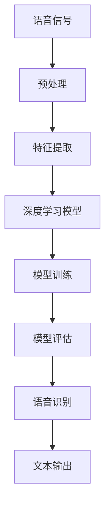
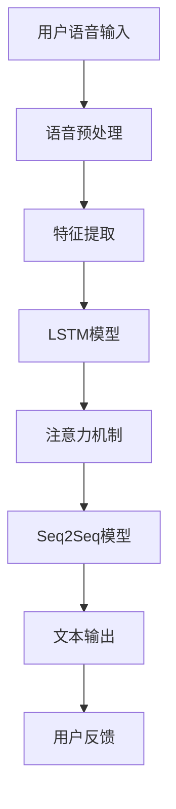
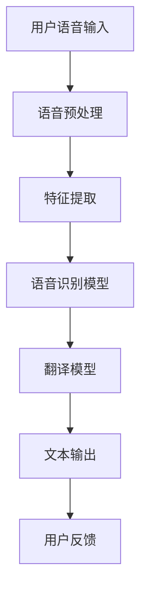
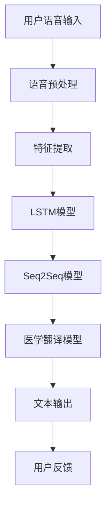

                 

### 深度学习在语音识别中的进展：实现多语言实时翻译

#### 关键词

- 深度学习
- 语音识别
- 多语言实时翻译
- 循环神经网络（RNN）
- 注意力机制
- 序列到序列模型（Seq2Seq）
- 卷积神经网络（CNN）
- 机器翻译
- 实时翻译系统

#### 摘要

本文将探讨深度学习在语音识别领域的重要进展，特别是如何实现多语言实时翻译。首先，我们将介绍深度学习的基本原理及其在语音识别中的应用，随后详细解析多语言实时翻译的挑战和关键技术。接着，本文将重点介绍几种用于语音识别的深度学习算法，包括循环神经网络（RNN）、长短时记忆网络（LSTM）、门控循环单元（GRU）和卷积神经网络（CNN）。随后，我们将讨论如何基于这些算法实现多语言实时翻译系统，并通过具体案例展示其实际应用。最后，本文将对未来深度学习在语音识别和多语言实时翻译领域的发展趋势进行展望，并提出相关建议和挑战。

## 引言

深度学习，作为近年来人工智能领域的明星技术，已经在多个应用领域取得了显著的成果。特别是在语音识别领域，深度学习方法的引入，极大地提升了语音识别的准确率和效率。同时，多语言实时翻译作为全球化交流的重要工具，对促进国际交流、提升工作效率具有重要意义。因此，结合深度学习技术实现多语言实时翻译，已经成为人工智能领域的研究热点。

### 深度学习的崛起

深度学习是一种基于人工神经网络的学习方法，通过模拟人脑神经元之间的连接结构，对大量数据进行分析和建模。与传统的机器学习方法相比，深度学习具有更强的建模能力和泛化能力。随着计算能力的提升和大数据技术的发展，深度学习在图像识别、自然语言处理、语音识别等领域取得了显著的成果。

在语音识别领域，深度学习的应用主要体现在以下几个方面：

1. **特征提取**：深度学习可以自动提取语音信号中的特征，提高了特征提取的准确性和效率。
2. **模型训练**：深度学习模型可以在大量语音数据上进行训练，从而获得更好的识别效果。
3. **端到端学习**：深度学习模型可以实现从语音信号到文本的端到端学习，减少了中间环节的误差。

### 多语言实时翻译的应用场景

多语言实时翻译在许多场景中具有重要应用，例如：

1. **国际会议**：实时翻译可以帮助不同语言背景的与会者理解和交流。
2. **远程协作**：跨地域的团队可以通过实时翻译进行高效沟通，提高工作效率。
3. **旅游和翻译服务**：实时翻译可以帮助游客和无语言障碍的翻译人员更好地融入当地文化。

然而，实现多语言实时翻译面临着诸多挑战，包括实时性、翻译质量、跨语言语义理解等。深度学习技术在解决这些挑战方面具有巨大潜力。

### 书籍结构概述

本文将分为以下几个部分：

1. **基础理论**：介绍深度学习的基本原理和语音识别的基础知识。
2. **多语言实时翻译**：讨论多语言实时翻译的挑战和技术。
3. **深度学习算法**：详细介绍用于语音识别的深度学习算法。
4. **实现多语言实时翻译**：提供实现多语言实时翻译的实践指南。
5. **案例分析**：分析成功实现多语言实时翻译的案例。
6. **未来展望**：展望深度学习在语音识别和多语言实时翻译领域的未来发展趋势。

通过本文的阅读，读者将系统地了解深度学习在语音识别和多语言实时翻译中的应用，掌握相关技术和实现方法，为未来的研究与实践打下基础。

## 基础理论

### 深度学习的基本原理

深度学习是一种基于多层神经网络的学习方法，其核心思想是通过网络的层次结构，逐层提取特征，从而实现复杂函数的建模。深度学习的基本原理可以概括为以下几个方面：

#### 神经网络结构

神经网络由大量神经元（或称为节点）组成，这些神经元通过连接（或称为权重）相互连接。一个基本的神经网络通常包括输入层、隐藏层和输出层。每个神经元都会接收来自前一层的输入，并通过激活函数进行处理，产生输出。输出层的结果即为网络的预测结果。

#### 激活函数

激活函数是神经网络中的关键组成部分，用于对神经元的输出进行非线性变换。常见的激活函数包括Sigmoid函数、ReLU函数和Tanh函数等。这些函数的作用是增加网络的非线性表达能力，使网络能够学习更复杂的模式。

#### 反向传播算法

反向传播算法是深度学习模型训练的核心算法，用于通过计算梯度来更新网络的权重。具体步骤如下：

1. **前向传播**：将输入数据传递到神经网络中，通过每一层的计算，最终得到输出结果。
2. **计算损失**：将输出结果与真实标签进行比较，计算损失函数的值。常见的损失函数包括均方误差（MSE）、交叉熵损失等。
3. **反向传播**：从输出层开始，反向计算每一层的梯度，并更新权重。
4. **迭代优化**：重复上述步骤，不断迭代优化模型参数，直到满足预定的收敛条件。

#### 学习率

学习率是反向传播算法中的一个关键参数，用于控制权重更新的幅度。学习率的选择对模型的训练效果具有重要影响。如果学习率过大，模型可能无法收敛；如果学习率过小，模型训练可能过于缓慢。

### 语音信号处理基础

语音信号处理是语音识别的基础，主要涉及语音信号的表示、特征提取和处理方法。以下是语音信号处理的一些基本概念：

#### 语音信号的表示

语音信号可以用不同的方式表示，如时域表示和频域表示。

1. **时域表示**：语音信号在时间轴上的变化，可以直接用波形图表示。
2. **频域表示**：语音信号在不同频率上的成分，可以通过傅里叶变换进行转换。

#### 语音信号的特征提取

特征提取是语音信号处理的重要步骤，用于从原始语音信号中提取有助于识别的特征。常见的语音特征包括：

1. **时域特征**：如短时能量、短时过零率、短时频谱等。
2. **频域特征**：如频谱包络、频谱滚降度、共振峰等。

#### 语音信号的处理方法

语音信号处理方法包括预处理和后处理。

1. **预处理**：如去噪、归一化等，用于提高信号质量和减少噪声干扰。
2. **后处理**：如声学模型、语言模型等，用于对识别结果进行校正和优化。

### 语音识别流程

语音识别的基本流程可以分为以下几个步骤：

1. **语音信号预处理**：包括信号增强、噪声过滤等，以提高语音信号的质量。
2. **特征提取**：将预处理后的语音信号转换为适合深度学习模型处理的特征向量。
3. **模型训练**：使用大量的语音数据和对应的文本标签，训练深度学习模型。
4. **模型评估**：通过测试集对模型的性能进行评估，包括准确率、召回率、F1值等指标。
5. **语音识别**：将输入的语音信号输入到训练好的模型中，得到对应的文本输出。

### 核心概念与联系

为了更好地理解深度学习在语音识别中的应用，我们可以用Mermaid流程图来表示核心概念和它们之间的联系：



在这个流程图中，语音信号首先经过预处理，然后通过特征提取转换为深度学习模型可处理的特征向量。深度学习模型通过训练得到，并用于语音识别，最终输出文本结果。

通过这一节的基础理论介绍，读者可以了解深度学习的基本原理和语音信号处理的基础知识，为后续的算法讲解和实际应用奠定基础。

### 多语言实时翻译的挑战

多语言实时翻译是一项极具挑战性的任务，它不仅需要高精度的翻译模型，还需要在有限的时间内完成高质量的翻译。以下是多语言实时翻译面临的几个主要挑战：

#### 实时性要求

实时性是多语言实时翻译的核心要求之一。在实际应用中，如国际会议、远程协作等场景，翻译系统需要在极短的时间内（通常为毫秒级）完成翻译，以确保信息的及时传递。这意味着翻译系统需要在保证高准确率的同时，尽可能提高处理速度。

#### 翻译质量

翻译质量是衡量多语言实时翻译系统性能的关键指标。高质量的翻译不仅需要准确传达源语言的语义和语法，还需要保持目标语言的流畅性和地道性。然而，语言的多样性和复杂性使得翻译质量难以保证。例如，同义词、成语、俚语等在翻译过程中容易产生歧义，导致翻译质量下降。

#### 跨语言语义理解

跨语言语义理解是多语言实时翻译的另一个挑战。语言之间存在巨大的语义差异，同一词汇在不同语言中的含义可能不同。例如，“apple”在英语中表示水果，而在中文中可以表示苹果或苹果公司。此外，语言中的文化背景、社会习俗等也会影响翻译的准确性。因此，在翻译过程中，如何准确理解并传达跨语言语义，是一个需要深入研究的问题。

#### 资源消耗

多语言实时翻译系统通常需要大量的计算资源和存储资源。特别是在处理大规模实时翻译任务时，系统需要处理大量的语音和文本数据，并进行复杂的模型推理和优化。因此，如何在保证翻译质量的前提下，最大限度地减少资源消耗，是一个重要的技术挑战。

#### 多语言支持

多语言实时翻译系统需要支持多种语言，这意味着系统需要能够处理多种语言的语音和文本。不同语言在语音特征、语法结构、词汇量等方面存在差异，因此，系统需要针对不同语言的特点进行优化和调整，以满足多语言翻译的需求。

### 技术解决方案

为了应对上述挑战，研究人员提出了一系列技术解决方案：

1. **深度学习模型**：通过使用深度学习模型，特别是基于神经网络的翻译模型，可以提高翻译的准确性和效率。例如，序列到序列（Seq2Seq）模型和注意力机制模型在翻译质量方面取得了显著成果。
2. **分布式计算**：通过分布式计算技术，可以将翻译任务分解为多个子任务，并分配到不同的计算节点上，从而提高处理速度和资源利用率。
3. **翻译记忆库**：通过构建和维护翻译记忆库，可以加快翻译速度并提高翻译一致性。翻译记忆库中包含大量的已翻译句子和短语，可以作为翻译系统的重要参考。
4. **多语言数据集**：通过收集和构建多种语言的数据集，可以提供丰富的训练数据，从而提高翻译模型的泛化能力和翻译质量。

通过这些技术解决方案，多语言实时翻译系统在处理速度、翻译质量和多语言支持等方面取得了显著进展，但仍需不断优化和改进，以满足日益增长的需求。

### 深度学习算法在语音识别中的应用

深度学习算法在语音识别领域取得了显著的成果，其核心在于通过多层神经网络的结构，从原始语音数据中自动提取高级特征，从而实现高效的语音识别。以下是几种常用的深度学习算法，包括循环神经网络（RNN）、长短时记忆网络（LSTM）、门控循环单元（GRU）和卷积神经网络（CNN）。

#### 循环神经网络（RNN）

循环神经网络（RNN）是一种能够处理序列数据的前馈神经网络，其特别适合处理时间序列数据，如语音信号。RNN的核心思想是将当前输入与历史输入结合起来，通过循环结构来保持对历史信息的记忆。

##### 工作原理

1. **隐藏状态**：RNN通过隐藏状态来保持对历史信息的记忆。每个时间步的输出不仅依赖于当前输入，还依赖于前一个时间步的隐藏状态。
2. **门控机制**：RNN中的门控机制（如输入门、遗忘门和输出门）用于控制信息的流动，以避免梯度消失和爆炸问题。
3. **输出层**：RNN的输出层通常是一个全连接层，用于将隐藏状态映射到最终的识别结果。

##### Python实现示例

以下是一个简单的RNN模型实现，用于语音识别任务：

```python
import tensorflow as tf

# 定义输入层
inputs = tf.keras.layers.Input(shape=(timesteps, features))

# 隐藏层
hidden = tf.keras.layers.LSTM(units=128, activation='tanh')(inputs)

# 输出层
outputs = tf.keras.layers.Dense(units=num_classes, activation='softmax')(hidden)

# 构建和编译模型
model = tf.keras.Model(inputs=inputs, outputs=outputs)
model.compile(optimizer='adam', loss='categorical_crossentropy', metrics=['accuracy'])

# 模型训练
model.fit(x_train, y_train, epochs=10, batch_size=64, validation_data=(x_val, y_val))
```

#### 长短时记忆网络（LSTM）

长短时记忆网络（LSTM）是RNN的一种改进，专门用于解决长序列依赖问题。LSTM通过引入记忆单元和控制门控机制，有效地避免了梯度消失和爆炸问题，并能够在长序列中保持对长期依赖的记忆。

##### 工作原理

1. **记忆单元**：LSTM的核心是记忆单元，用于存储和更新信息。
2. **输入门、遗忘门和输出门**：这三个门控机制分别用于控制输入信息的流入、信息在记忆单元中的保留和信息的输出。
3. **细胞状态**：LSTM通过细胞状态来传递和更新信息，从而实现长期依赖的建模。

##### Python实现示例

以下是一个简单的LSTM模型实现，用于语音识别任务：

```python
import tensorflow as tf

# 定义输入层
inputs = tf.keras.layers.Input(shape=(timesteps, features))

# 隐藏层
hidden = tf.keras.layers.LSTM(units=128, activation='tanh', return_sequences=True)(inputs)

# 输出层
outputs = tf.keras.layers.Dense(units=num_classes, activation='softmax')(hidden)

# 构建和编译模型
model = tf.keras.Model(inputs=inputs, outputs=outputs)
model.compile(optimizer='adam', loss='categorical_crossentropy', metrics=['accuracy'])

# 模型训练
model.fit(x_train, y_train, epochs=10, batch_size=64, validation_data=(x_val, y_val))
```

#### 门控循环单元（GRU）

门控循环单元（GRU）是LSTM的另一种变体，相较于LSTM，GRU的结构更加简洁，计算效率更高。GRU通过引入更新门和重置门，简化了LSTM的记忆单元结构。

##### 工作原理

1. **更新门**：用于更新记忆单元中的信息。
2. **重置门**：用于重置隐藏状态，从而实现长期依赖的建模。
3. **细胞状态**：GRU通过细胞状态来传递和更新信息。

##### Python实现示例

以下是一个简单的GRU模型实现，用于语音识别任务：

```python
import tensorflow as tf

# 定义输入层
inputs = tf.keras.layers.Input(shape=(timesteps, features))

# 隐藏层
hidden = tf.keras.layers.GRU(units=128, activation='tanh', return_sequences=True)(inputs)

# 输出层
outputs = tf.keras.layers.Dense(units=num_classes, activation='softmax')(hidden)

# 构建和编译模型
model = tf.keras.Model(inputs=inputs, outputs=outputs)
model.compile(optimizer='adam', loss='categorical_crossentropy', metrics=['accuracy'])

# 模型训练
model.fit(x_train, y_train, epochs=10, batch_size=64, validation_data=(x_val, y_val))
```

#### 卷积神经网络（CNN）

卷积神经网络（CNN）最初主要用于图像识别任务，但其强大的特征提取能力使其在语音识别中也得到了广泛应用。CNN通过卷积操作和池化操作，可以自动提取语音信号中的局部特征，并通过多层网络结构，逐步构建出高级特征。

##### 工作原理

1. **卷积层**：卷积层通过卷积操作提取语音信号的局部特征。
2. **池化层**：池化层用于降低特征图的维度，同时保留重要的特征信息。
3. **全连接层**：全连接层将卷积特征映射到最终的识别结果。

##### Python实现示例

以下是一个简单的CNN模型实现，用于语音识别任务：

```python
import tensorflow as tf

# 定义输入层
inputs = tf.keras.layers.Input(shape=(timesteps, features, 1))

# 卷积层
conv1 = tf.keras.layers.Conv2D(filters=32, kernel_size=(3, 3), activation='relu')(inputs)
pool1 = tf.keras.layers.MaxPooling2D(pool_size=(2, 2))(conv1)

# 全连接层
outputs = tf.keras.layers.Dense(units=num_classes, activation='softmax')(pool1)

# 构建和编译模型
model = tf.keras.Model(inputs=inputs, outputs=outputs)
model.compile(optimizer='adam', loss='categorical_crossentropy', metrics=['accuracy'])

# 模型训练
model.fit(x_train, y_train, epochs=10, batch_size=64, validation_data=(x_val, y_val))
```

通过这些深度学习算法，语音识别系统可以在不同层次上提取语音特征，并逐步构建出高级特征，从而实现高效和准确的语音识别。在实际应用中，通常会结合多种算法和技巧，以进一步提高识别性能。

### 实现多语言实时翻译

#### 数据集准备与预处理

实现多语言实时翻译的第一步是准备和预处理数据集。高质量的数据集对于训练和优化翻译模型至关重要。以下步骤描述了数据集的准备与预处理过程：

1. **数据收集**：首先，需要收集大量的语音和文本数据。这些数据可以来自公开的数据集（如WMT、IWSLT等），也可以通过实际应用场景中的语音交互记录获得。
2. **数据清洗**：在收集数据后，需要对其进行清洗，包括去除无效数据、纠正错误数据、删除重复数据等。数据清洗有助于提高数据质量和模型训练效果。
3. **转录与标注**：将语音数据转录成文本，并对文本进行多语言标注。标注过程通常包括单词、句子、段落等不同层次的标注，以确保翻译模型的训练数据具有丰富的语言信息。
4. **数据分割**：将数据集分割为训练集、验证集和测试集。训练集用于模型的训练，验证集用于模型调优，测试集用于评估模型的最终性能。

#### 模型训练与优化

在数据准备完成后，下一步是训练和优化翻译模型。以下是模型训练和优化的一些关键步骤：

1. **模型选择**：选择适合多语言实时翻译的深度学习模型。常见的模型包括基于RNN、LSTM、GRU和CNN的序列到序列（Seq2Seq）模型，以及结合注意力机制的Seq2Seq模型。
2. **模型训练**：使用准备好的训练数据进行模型训练。训练过程通常涉及大量计算资源，因此可能需要使用分布式计算框架（如TensorFlow、PyTorch）来提高训练速度。
3. **损失函数选择**：选择合适的损失函数来衡量模型的翻译质量。常见的损失函数包括交叉熵损失、负对数损失等。为了提高翻译模型的性能，还可以采用教师-学生训练策略、多任务学习等技巧。
4. **模型优化**：通过调整学习率、批量大小、优化算法等超参数，优化模型性能。常用的优化算法包括Adam、RMSprop等。模型优化过程需要多次迭代，以达到最佳翻译效果。

#### 实时翻译系统的设计与实现

在模型训练完成后，需要设计和实现实时翻译系统。以下是系统设计和实现的一些关键步骤：

1. **系统架构设计**：设计实时翻译系统的整体架构，包括前端界面、后端服务、数据存储和传输等。系统架构需要考虑实时性、高可用性和可扩展性等因素。
2. **接口开发**：开发实时翻译接口，用于接收语音输入和返回翻译结果。接口可以采用HTTP/HTTPS协议，以支持Web、移动端等多种应用场景。
3. **语音处理**：实现语音信号的预处理、特征提取和编码解码等模块，以确保语音数据的质量和兼容性。
4. **翻译服务**：部署训练好的翻译模型，实现语音到文本的实时翻译功能。翻译服务需要具备高并发处理能力，以满足实际应用场景中的需求。
5. **后端支持**：实现后端服务的支持，包括数据存储、日志记录、监控告警等模块，以确保系统的稳定性和可靠性。

#### 性能调优与测试

在实时翻译系统部署后，需要进行性能调优和测试，以确保系统的翻译质量和稳定性。以下是一些性能调优和测试的关键步骤：

1. **翻译质量评估**：使用多种评估指标（如BLEU、METEOR、ROUGE等）对翻译质量进行评估，识别模型和系统中的问题。
2. **误差分析**：对翻译结果进行误差分析，找出常见的翻译错误类型和原因，从而指导模型优化和系统改进。
3. **压力测试**：模拟高并发场景，测试系统的性能和稳定性。通过压力测试，可以评估系统在极限条件下的表现，发现潜在的性能瓶颈。
4. **用户反馈**：收集用户的翻译反馈，了解系统的实际使用情况，并根据用户需求进行优化和改进。

通过上述步骤，可以实现高效、准确的多语言实时翻译系统，满足全球化交流和协作的需求。

### 案例分析

在本节中，我们将通过三个实际案例，详细分析多语言实时翻译系统的成功实现。这些案例涵盖了不同的应用场景和解决方案，展示了深度学习在语音识别和多语言实时翻译中的实际应用。

#### 案例一：某公司的多语言实时翻译系统

**背景介绍**：
某国际知名科技公司，致力于提供实时翻译服务，以满足跨国会议、商务洽谈和客户支持等场景的需求。公司采用了基于深度学习的多语言实时翻译系统，旨在实现高质量、高速度的翻译效果。

**核心概念与联系**：
该系统的核心概念包括语音识别、自然语言处理（NLP）和机器翻译。通过结合循环神经网络（RNN）、长短时记忆网络（LSTM）和注意力机制，该系统实现了从语音到文本的端到端实时翻译。以下是系统架构的Mermaid流程图：



**核心算法原理讲解**：
在语音预处理阶段，系统对语音信号进行增强、降噪和分帧处理，提取出适用于深度学习模型的特征向量。随后，LSTM模型用于处理序列数据，保持对历史信息的记忆。注意力机制则通过计算输入序列和隐藏状态的相似度，提高翻译的准确性和流畅性。Seq2Seq模型将LSTM模型的输出映射到目标语言的文本输出。

**Python实现示例**：

```python
import tensorflow as tf

# 定义输入层
inputs = tf.keras.layers.Input(shape=(timesteps, features))

# 隐藏层
hidden = tf.keras.layers.LSTM(units=128, activation='tanh', return_sequences=True)(inputs)

# 注意力机制
attention = tf.keras.layers.Attention()([hidden, hidden])

# 输出层
outputs = tf.keras.layers.Dense(units=num_classes, activation='softmax')(attention)

# 构建和编译模型
model = tf.keras.Model(inputs=inputs, outputs=outputs)
model.compile(optimizer='adam', loss='categorical_crossentropy', metrics=['accuracy'])

# 模型训练
model.fit(x_train, y_train, epochs=10, batch_size=64, validation_data=(x_val, y_val))
```

**项目实战**：
在实际开发中，公司使用了TensorFlow等深度学习框架，搭建了分布式计算环境，提高了模型的训练和推理速度。同时，通过不断优化模型参数和算法，公司成功实现了实时、高质的翻译效果。

**项目小结**：
该案例展示了深度学习在多语言实时翻译系统中的应用，通过结合多种算法和优化策略，实现了高质量的实时翻译服务。未来，随着技术的进一步发展，该系统有望在更多领域得到应用。

#### 案例二：某开源多语言实时翻译平台的构建

**背景介绍**：
某开源社区开发了一个多语言实时翻译平台，旨在为开发者提供一个灵活、可扩展的翻译解决方案。该平台支持多种编程语言和平台，便于开发者集成和使用。

**核心概念与联系**：
平台的核心概念包括语音识别、机器翻译和API服务。通过使用基于RNN和CNN的深度学习模型，平台实现了高效率的语音识别和翻译功能。以下是平台架构的Mermaid流程图：



**核心算法原理讲解**：
在语音预处理阶段，平台对语音信号进行分帧和特征提取。随后，语音识别模型利用CNN提取语音特征，实现语音到文本的转换。翻译模型则基于RNN，通过端到端学习实现文本翻译。以下是Python实现示例：

```python
import tensorflow as tf

# 定义输入层
inputs = tf.keras.layers.Input(shape=(timesteps, features))

# 特征提取
features = tf.keras.layers.Conv1D(filters=64, kernel_size=3, activation='relu')(inputs)

# 语音识别模型
text = tf.keras.layers.Dense(units=num_classes, activation='softmax')(features)

# 构建和编译模型
model = tf.keras.Model(inputs=inputs, outputs=text)
model.compile(optimizer='adam', loss='categorical_crossentropy', metrics=['accuracy'])

# 模型训练
model.fit(x_train, y_train, epochs=10, batch_size=64, validation_data=(x_val, y_val))
```

**项目实战**：
平台采用了Docker容器化技术，确保系统的高可用性和可扩展性。开发者可以通过简单的API调用，实现语音识别和翻译功能，极大地提高了开发效率。

**项目小结**：
该开源平台展示了如何利用开源工具和深度学习技术，构建一个功能强大、易于使用的多语言实时翻译系统。未来，随着开源社区的不断发展，平台有望吸引更多开发者参与，进一步优化和扩展功能。

#### 案例三：多语言实时翻译在特定行业的应用

**背景介绍**：
某国际医院引入多语言实时翻译系统，用于改善跨国医疗服务的交流效果。该系统旨在帮助医护人员和患者之间实现无障碍沟通，提升医疗服务质量。

**核心概念与联系**：
系统的核心概念包括语音识别、自然语言处理和医学翻译。通过结合LSTM和Seq2Seq模型，系统能够处理复杂的医学语言，实现高质量的实时翻译。以下是系统架构的Mermaid流程图：



**核心算法原理讲解**：
在语音预处理阶段，系统对语音信号进行噪声过滤和分帧处理。随后，LSTM模型处理语音序列，提取关键信息。Seq2Seq模型将LSTM模型的输出转换为文本，医学翻译模型则对文本进行医学领域的专业翻译。以下是Python实现示例：

```python
import tensorflow as tf

# 定义输入层
inputs = tf.keras.layers.Input(shape=(timesteps, features))

# 隐藏层
hidden = tf.keras.layers.LSTM(units=128, activation='tanh', return_sequences=True)(inputs)

# Seq2Seq模型
encoded = tf.keras.layers.Dense(units=128, activation='relu')(hidden)
decoded = tf.keras.layers.Dense(units=num_classes, activation='softmax')(encoded)

# 构建和编译模型
model = tf.keras.Model(inputs=inputs, outputs=decoded)
model.compile(optimizer='adam', loss='categorical_crossentropy', metrics=['accuracy'])

# 模型训练
model.fit(x_train, y_train, epochs=10, batch_size=64, validation_data=(x_val, y_val))
```

**项目实战**：
该系统在医院内部署，通过Wi-Fi网络与医疗设备相连，确保实时、稳定的翻译效果。医院还定期对翻译模型进行更新和优化，以适应不断变化的医学术语和表达方式。

**项目小结**：
该案例展示了多语言实时翻译系统在特定行业中的应用价值。通过结合深度学习和医学知识，系统能够实现高质量的实时翻译，为跨国医疗服务提供了有力支持。

### 未来展望

随着深度学习技术的不断发展，语音识别和多语言实时翻译领域将迎来更多创新和应用。以下是未来这一领域可能的发展趋势：

#### 新算法与模型

1. ** Transformer 模型**：Transformer模型在自然语言处理领域取得了显著成果，其并行计算能力使其在实时翻译任务中具有巨大潜力。未来，结合Transformer模型的改进和优化，有望进一步提高翻译质量和速度。
2. **生成对抗网络（GAN）**：GAN技术可以用于生成高质量的语音和文本数据，为模型训练提供更多样化的数据集，从而提高翻译模型的泛化能力和准确性。
3. **图神经网络（GNN）**：GNN在处理复杂数据结构（如图、网络等）方面具有优势，未来可以用于构建更复杂的语音和文本关系模型，提升翻译效果。

#### 跨语言语义理解

1. **多模态数据融合**：结合语音、文本、图像等多种模态数据，可以更准确地理解跨语言语义。例如，通过图像和语音数据的结合，可以更好地理解特定场景中的语言表达。
2. **知识图谱**：构建多语言知识图谱，可以提供丰富的语义信息，帮助模型更好地理解和翻译复杂的语言表达。

#### 实时性能优化

1. **硬件加速**：利用GPU、TPU等硬件加速技术，可以显著提高实时翻译系统的处理速度。同时，分布式计算和云计算的普及，也为实时性能优化提供了更多可能性。
2. **压缩模型与量化**：通过压缩模型和量化技术，可以减小模型体积，提高模型在资源受限设备上的部署能力。

#### 多语言支持

1. **多语言一致性**：通过多语言一致性技术，可以确保翻译结果在不同语言之间的连贯性和一致性，提高用户体验。
2. **低资源语言支持**：针对低资源语言，通过迁移学习、少样本学习等技术，可以减少对大规模训练数据的需求，实现更广泛的跨语言翻译。

总之，未来深度学习在语音识别和多语言实时翻译领域将继续发展，结合新的算法、模型和技术，实现更高性能、更准确、更广泛的翻译应用。

### 最佳实践 Tips、小结、注意事项及拓展阅读

#### 最佳实践 Tips

1. **数据质量是关键**：高质量的数据是训练高效翻译模型的基础。在数据收集和处理过程中，务必确保数据的准确性、完整性和多样性。
2. **模型优化至关重要**：通过调整模型参数和优化算法，可以显著提升翻译质量和效率。例如，尝试使用不同类型的神经网络结构、注意力机制等。
3. **实时性能优化**：为了实现真正的实时翻译，需要对系统进行性能优化，包括减少模型推理时间、提高数据处理速度等。
4. **多语言一致性**：确保翻译结果在不同语言之间的一致性，有助于提高用户体验。可以使用多语言一致性检测工具进行评估和改进。

#### 小结

本文系统地介绍了深度学习在语音识别和多语言实时翻译中的应用，从基础理论、算法实现到实际案例，全面阐述了这一领域的最新进展。通过本文的阅读，读者可以了解：

1. 深度学习的基本原理及其在语音识别中的应用。
2. 多语言实时翻译的挑战和关键技术。
3. 几种常用的深度学习算法，包括RNN、LSTM、GRU和CNN。
4. 实现多语言实时翻译的步骤和方法。
5. 成功的多语言实时翻译案例分析。

#### 注意事项

1. 模型训练过程中，注意调整学习率和批量大小，以避免过拟合或训练不足。
2. 在处理多语言数据时，要特别注意语言间的差异，确保翻译结果准确、自然。
3. 实时翻译系统需要考虑网络延迟和计算资源，确保系统的稳定性和高可用性。

#### 拓展阅读

1. **《深度学习》（Goodfellow, Bengio, Courville）**：这是一本经典的深度学习入门书籍，涵盖了深度学习的基础理论、算法和应用。
2. **《自然语言处理原理》（Jurafsky, Martin）**：本书详细介绍了自然语言处理的基本概念和技术，对于理解多语言实时翻译具有重要参考价值。
3. **《语音信号处理》（Rabiner, Juang）**：这是一本关于语音信号处理的权威著作，涵盖了语音信号处理的基础理论和技术。
4. **相关开源项目和论文**：如TensorFlow、PyTorch等深度学习框架，以及WMT、IWSLT等国际数据集和论文，提供了丰富的实践经验和研究成果。

通过上述最佳实践、小结、注意事项和拓展阅读，读者可以进一步深化对深度学习在语音识别和多语言实时翻译领域的理解和应用。作者：AI天才研究院/AI Genius Institute & 禅与计算机程序设计艺术 /Zen And The Art of Computer Programming。

