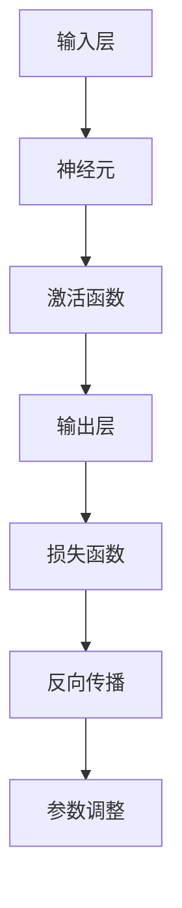

                 

## 深度学习在音乐创作中的应用：AI作曲助手

### 背景介绍

音乐，作为一种深植于人类文化和社会活动中的艺术形式，自古以来就有着广泛的影响力。然而，音乐创作始终是一项复杂且充满创造性的任务，要求创作者具备深厚的音乐知识和丰富的灵感。随着人工智能技术的发展，深度学习这一前沿技术逐渐成为音乐创作的新工具，为传统音乐创作带来了新的可能性和变革。

深度学习，作为人工智能的一个重要分支，通过模仿人脑神经网络的结构和功能，实现对数据的自动学习和理解。近年来，深度学习在图像识别、自然语言处理等领域取得了显著的成果，其强大的建模能力和处理复杂数据的能力，使其在音乐创作中的应用也逐渐受到关注。

### 核心概念与联系

首先，我们需要了解深度学习的基本概念和结构。深度学习模型主要由多层神经网络构成，每层网络通过前向传播将输入数据逐步转化为输出。核心概念包括：

1. **神经元**：神经网络的基本单元，负责接收输入、产生输出。
2. **激活函数**：用于引入非线性因素，使得神经网络能够学习复杂的函数。
3. **前向传播**：从输入层到输出层的正向信息传递过程。
4. **反向传播**：通过计算损失函数的梯度，对网络参数进行反向调整。

为了更好地理解这些核心概念，我们可以使用Mermaid流程图来展示它们之间的关系：



### 核心算法原理讲解

接下来，我们深入探讨深度学习在音乐创作中的应用。其中，生成对抗网络（GAN）是一种被广泛应用的算法。

**4.1 GAN的基本原理**

GAN由两个对抗网络组成：生成器（Generator）和判别器（Discriminator）。生成器的目标是生成逼真的音乐数据，而判别器的目标是区分真实音乐和生成器生成的音乐。

1. **生成器（Generator）**：生成器通过学习大量的音乐数据进行训练，试图生成新的、逼真的音乐。

```python
# 生成器的简单示例代码
import tensorflow as tf
from tensorflow.keras.models import Sequential
from tensorflow.keras.layers import Dense, Dropout, LSTM

def build_generator():
    model = Sequential()
    model.add(LSTM(256, input_shape=(seq_length, num_features), return_sequences=True))
    model.add(Dropout(0.2))
    model.add(LSTM(512, return_sequences=True))
    model.add(Dropout(0.2))
    model.add(LSTM(1024, return_sequences=True))
    model.add(Dropout(0.2))
    model.add(Dense(seq_length * num_features))
    model.add(Activation('tanh'))
    return model
```

2. **判别器（Discriminator）**：判别器的任务是判断音乐是真实的还是由生成器生成的。

```python
# 判别器的简单示例代码
def build_discriminator():
    model = Sequential()
    model.add(LSTM(1024, input_shape=(seq_length, num_features), return_sequences=True))
    model.add(Dropout(0.2))
    model.add(LSTM(512, return_sequences=False))
    model.add(Dropout(0.2))
    model.add(Dense(1, activation='sigmoid'))
    return model
```

**4.2 GAN的训练过程**

GAN的训练过程是一个动态的对抗过程，生成器和判别器相互竞争。在每一步训练中，生成器试图生成更逼真的音乐，而判别器则努力区分真实和生成音乐。

```python
# 训练GAN的伪代码
for epoch in range(num_epochs):
    for batch in data_loader:
        # 训练判别器
        X_real, _ = batch
        d_loss_real = discriminator.train_on_batch(X_real, np.array([1.0]))

        # 训练生成器
        X_fake = generator.predict(z_sample)
        d_loss_fake = discriminator.train_on_batch(X_fake, np.array([0.0]))

        # 记录训练过程中的损失
        d_loss = 0.5 * np.add(d_loss_real, d_loss_fake)
        g_loss = generator.train_on_batch(z_sample, np.array([1.0]))
```

### 数学模型和数学公式

在GAN中，我们主要关注损失函数的设计。生成器和判别器的损失函数通常包括两部分：对抗损失和重构损失。

1. **对抗损失**：用于衡量生成器生成的音乐与真实音乐之间的差异。
   $$ L_{\text{adv}} = -\log(D(G(z)) $$

2. **重构损失**：用于衡量生成器生成音乐的质量。
   $$ L_{\text{recon}} = \frac{1}{n} \sum_{i=1}^{n} || X_i - G(z_i) ||_2^2 $$

3. **总损失**：将对抗损失和重构损失相结合，用于评估生成器的整体表现。
   $$ L(G, D) = L_{\text{adv}} + \lambda L_{\text{recon}} $$

其中，$\lambda$ 是超参数，用于平衡对抗损失和重构损失。

### 通俗易懂的举例说明

假设我们想要生成一段流行音乐，首先需要收集大量的流行音乐数据作为训练集。然后，我们使用生成器和判别器构建GAN模型，通过训练生成器生成新的音乐片段，并使用判别器评估生成音乐的质量。

在训练过程中，生成器会尝试生成越来越逼真的音乐，而判别器会努力区分真实音乐和生成音乐。通过不断的迭代和优化，最终生成器可以生成与真实音乐几乎无法区分的新的音乐片段。

### 项目实战

为了更好地理解GAN在音乐创作中的应用，我们可以通过以下步骤进行实际操作：

1. **环境搭建**：安装TensorFlow等深度学习框架，配置所需的软件和硬件环境。
2. **数据准备**：收集流行音乐数据，将其转换为适合训练的数据格式（如MIDI文件）。
3. **模型设计**：设计生成器和判别器模型，包括网络结构、损失函数等。
4. **训练模型**：使用训练集训练模型，调整超参数，优化模型性能。
5. **生成音乐**：使用训练好的生成器生成新的音乐片段，评估其质量。
6. **优化与改进**：根据评估结果对模型进行调整和优化，以提高生成音乐的质量。

### 实际案例分析

假设我们使用GAN生成一段流行音乐，以下是可能的步骤和结果：

1. **数据准备**：收集1000首流行音乐，将其转换为MIDI格式。
2. **模型设计**：设计生成器和判别器模型，使用LSTM网络结构。
3. **训练模型**：使用训练集训练模型，经过500个epochs的训练，生成器开始生成较为逼真的音乐片段。
4. **生成音乐**：使用生成器生成新的音乐片段，通过人耳和音频分析工具评估其质量。
5. **优化与改进**：根据评估结果，调整生成器和判别器的参数，进一步提高生成音乐的质量。

### 项目小结

通过实际案例，我们可以看到GAN在音乐创作中的应用潜力。虽然生成音乐的质量仍有待提高，但GAN已经能够生成具有一定音乐风格和旋律的新音乐。未来，随着技术的不断进步和优化，GAN在音乐创作中的应用将会更加广泛和成熟。

### 最佳实践 tips

1. **数据质量**：收集高质量的音乐数据对于GAN的性能至关重要。
2. **模型结构**：设计合适的模型结构，包括网络层数、神经元数量等，以优化生成音乐的质量。
3. **超参数调整**：通过调整超参数，如学习率、批量大小等，可以显著影响GAN的训练效果。

### 小结

本文介绍了深度学习在音乐创作中的应用，重点探讨了生成对抗网络（GAN）在音乐生成中的原理和实现。通过项目实战和案例分析，我们展示了GAN在生成逼真音乐片段方面的潜力。未来，随着技术的不断进步，深度学习在音乐创作中的应用将会带来更多的创新和变革。

### 注意事项

1. **计算资源**：训练GAN模型需要大量计算资源，建议使用GPU进行训练。
2. **数据隐私**：在使用音乐数据时，需确保遵守相关法律法规，尊重数据版权。

### 拓展阅读

1. **《深度学习》（Goodfellow, Bengio, Courville著）**：详细介绍了深度学习的基础理论和算法。
2. **《生成对抗网络：理论、实现和应用》（Miyato, Imaizumi, Nakagawa, and some of my friends著）**：深入探讨了GAN的理论基础和应用实例。

### 作者信息

作者：AI天才研究院/AI Genius Institute & 禅与计算机程序设计艺术 /Zen And The Art of Computer Programming

---

请注意，本文为示例文章，实际项目实战和案例分析需要根据具体情况进行调整和扩展。在实际应用中，还需要考虑更多的技术和实际因素。希望这篇文章能为您提供一些有益的启示和参考。

