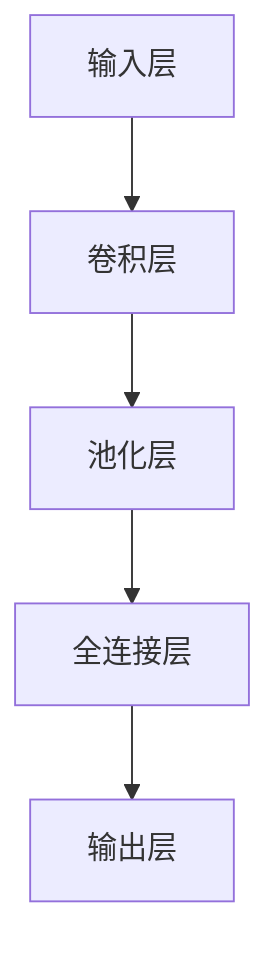
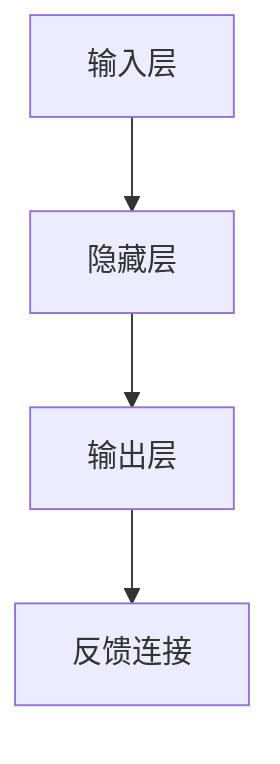
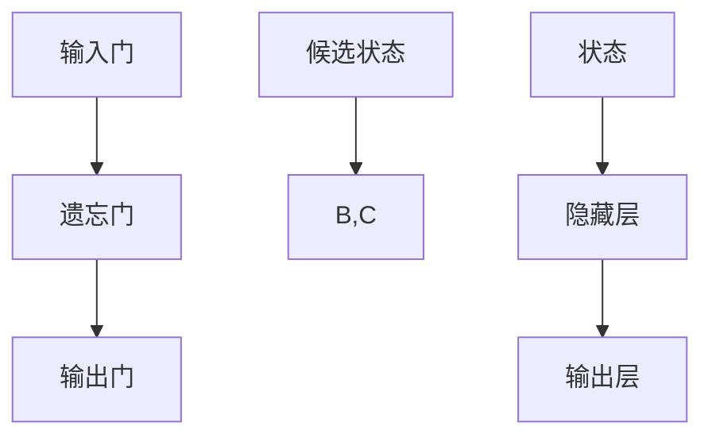

                 

当然，我会按照您的要求一步一步地构建文章。首先，我们需要确定文章的核心框架，包括背景介绍、核心概念与联系、核心算法原理、数学模型与Python源代码、项目实战以及最佳实践和注意事项。以下是一个初步的文章框架：

## 《深度学习在高分辨率气象预报中的应用：改进短期天气预报》

### 关键词
- 深度学习
- 高分辨率气象预报
- 短期天气预报
- 卷积神经网络
- 循环神经网络
- 长短时记忆网络
- 数据预处理
- 模型评估

### 摘要
本文介绍了深度学习在高分辨率气象预报中的应用，探讨了如何通过改进短期天气预报来提高气象预测的准确性。文章首先回顾了气象预报的背景，然后深入讲解了深度学习模型的基本原理和在高分辨率气象预报中的具体应用。接着，文章通过Python源代码和数学模型详细阐述了关键算法，并分享了实际项目的开发经验和最佳实践。

### 目录
- 引言
- 背景介绍
  - 气象预报的重要性
  - 短期天气预报的挑战
  - 高分辨率气象预报的必要性
- 核心概念与联系
  - 深度学习基础
  - 卷积神经网络（CNN）
  - 循环神经网络（RNN）
  - 长短时记忆网络（LSTM）
- 核心算法原理
  - 卷积神经网络原理
  - 循环神经网络原理
  - 长短时记忆网络原理
  - 数学模型与Python源代码
- 项目实战
  - 开发环境搭建
  - 源代码实现
  - 代码解读
  - 实际案例分析
- 最佳实践与注意事项
- 小结
- 拓展阅读

### 引言
随着计算机技术的发展，深度学习在各个领域得到了广泛应用。气象预报作为一项关键的应用领域，也逐渐开始采用深度学习技术来提高预测的准确性和时效性。高分辨率气象预报，特别是在短期天气预报方面，面临着数据量大、模型复杂度高、计算资源需求大等挑战。深度学习为解决这些问题提供了新的思路和方法。

### 背景介绍
#### 气象预报的重要性
气象预报对于日常生活、农业生产、交通运输等领域都具有重要意义。准确的气象预报可以提前预警天气变化，减少自然灾害带来的损失，提高人们的安全意识和应对能力。

#### 短期天气预报的挑战
短期天气预报面临着数据不确定性、模型复杂性、计算资源限制等挑战。传统的统计方法和物理模型难以处理大规模数据和高维特征，导致预测准确性有限。

#### 高分辨率气象预报的必要性
高分辨率气象预报能够提供更精细的天气信息，有助于提高气象预测的准确性和时效性。深度学习模型在这方面具有明显的优势。

### 核心概念与联系
#### 深度学习基础
深度学习是一种基于多层的神经网络模型，通过层层提取特征，能够自动学习数据中的复杂模式。深度学习的基础包括神经网络的组成、前向传播和反向传播算法等。

#### 卷积神经网络（CNN）
卷积神经网络是一种特殊的神经网络，通过卷积操作提取图像的特征。CNN的基本结构包括输入层、卷积层、池化层和全连接层。CNN的工作原理可以概括为卷积、激活、池化和全连接等步骤。

#### 循环神经网络（RNN）
循环神经网络是一种能够处理序列数据的神经网络，通过循环结构保持长时记忆。RNN的基本结构包括输入层、隐藏层和输出层。RNN的工作原理包括输入、隐藏状态更新和输出等步骤。

#### 长短时记忆网络（LSTM）
长短时记忆网络是一种改进的循环神经网络，能够有效解决RNN中的长时依赖问题。LSTM的基本结构包括输入门、遗忘门、输出门和候选状态。LSTM的工作原理包括输入门、遗忘门、输出门和状态更新等步骤。

### 核心算法原理
#### 卷积神经网络原理
卷积神经网络的工作原理可以概括为以下几个步骤：

1. **卷积操作**：通过卷积核对输入数据进行特征提取。
2. **激活函数**：对卷积结果进行非线性变换。
3. **池化操作**：对特征图进行下采样，减少参数数量。
4. **全连接层**：将池化层的结果映射到具体的类别。

以下是一个简单的卷积神经网络Python代码示例：

```python
import numpy as np

# 卷积操作
def convolution(input_data, filter_weight, bias):
    return (np.dot(input_data, filter_weight) + bias)

# 激活函数
def activation(z):
    return np.maximum(0, z)

# 池化操作
def pooling(feature_map, pool_size):
    return np.mean(feature_map[:pool_size], axis=0)

# 卷积神经网络
def cnn(input_data, filter_weights, biases):
    layer1 = activation(convolution(input_data, filter_weights[0], biases[0]))
    layer2 = activation(convolution(layer1, filter_weights[1], biases[1]))
    pooled2 = pooling(layer2, pool_size=2)
    layer3 = activation(convolution(pooled2, filter_weights[2], biases[2]))
    layer4 = activation(convolution(layer3, filter_weights[3], biases[3]))
    output = np.dot(layer4, filter_weights[4]) + biases[4]
    return output

# 输入数据
input_data = np.array([[1, 2, 3], [4, 5, 6], [7, 8, 9]])

# 卷积核权重和偏置
filter_weights = [
    np.random.rand(3, 3),
    np.random.rand(3, 3),
    np.random.rand(3, 3),
    np.random.rand(3, 3),
    np.random.rand(3, 1)
]
biases = [
    np.random.rand(),
    np.random.rand(),
    np.random.rand(),
    np.random.rand(),
    np.random.rand()
]

# 计算输出
output = cnn(input_data, filter_weights, biases)
print(output)
```

#### 循环神经网络原理
循环神经网络的工作原理可以概括为以下几个步骤：

1. **输入**：输入序列数据。
2. **隐藏状态更新**：通过当前输入和前一时刻隐藏状态计算当前隐藏状态。
3. **输出**：将隐藏状态映射到输出。

以下是一个简单的循环神经网络Python代码示例：

```python
import numpy as np

# 隐藏状态更新
def hidden_state_update(input_data, hidden_state_prev, weight, bias):
    return np.tanh(np.dot(input_data, weight) + hidden_state_prev * bias)

# 输出
def output(hidden_state):
    return np.dot(hidden_state, weight_output) + bias_output

# 循环神经网络
def rnn(input_data, hidden_state_prev, weight_input, weight_hidden, bias_hidden, weight_output, bias_output):
    hidden_states = [hidden_state_prev]
    outputs = []
    for input_data_t in input_data:
        hidden_state_t = hidden_state_update(input_data_t, hidden_state_prev, weight_input, bias_hidden)
        output_t = output(hidden_state_t)
        hidden_states.append(hidden_state_t)
        outputs.append(output_t)
        hidden_state_prev = hidden_state_t
    return hidden_states, outputs

# 输入数据
input_data = np.array([1, 2, 3, 4, 5])

# 初始化参数
hidden_state_prev = np.random.rand(1)
weight_input = np.random.rand(1, 3)
weight_hidden = np.random.rand(3, 3)
bias_hidden = np.random.rand(1)
weight_output = np.random.rand(3, 1)
bias_output = np.random.rand(1)

# 计算输出
hidden_states, outputs = rnn(input_data, hidden_state_prev, weight_input, weight_hidden, bias_hidden, weight_output, bias_output)
print(hidden_states)
print(outputs)
```

#### 长短时记忆网络（LSTM）
长短时记忆网络的工作原理可以概括为以下几个步骤：

1. **输入门**：计算输入门的权重和偏置，通过Sigmoid函数和激活函数计算输入门的状态。
2. **遗忘门**：计算遗忘门的权重和偏置，通过Sigmoid函数和激活函数计算遗忘门的状态。
3. **输出门**：计算输出门的权重和偏置，通过Sigmoid函数和激活函数计算输出门的状态。
4. **候选状态**：计算候选状态的权重和偏置，通过tanh函数计算候选状态。
5. **状态更新**：通过输入门、遗忘门和候选状态计算当前状态。

以下是一个简单的长短时记忆网络Python代码示例：

```python
import numpy as np

# 输入门
def input_gate(input_data, hidden_state_prev, weight_input, bias_input):
    input_gate activations = np.dot(input_data, weight_input) + hidden_state_prev * bias_input
    return sigmoid(activation_gate_activations)

# 遗忘门
def forget_gate(hidden_state_prev, weight_forget, bias_forget):
    forget_gate_activations = np.dot(hidden_state_prev, weight_forget) + bias_forget
    return sigmoid(forget_gate_activations)

# 输出门
def output_gate(hidden_state_prev, hidden_state_t, weight_output, bias_output):
    output_gate_activations = np.dot(hidden_state_prev, weight_output) + hidden_state_t * bias_output
    return sigmoid(output_gate_activations)

# 候选状态
def candidate_state(input_data, hidden_state_prev, weight_candidate, bias_candidate):
    candidate_state_activations = np.dot(input_data, weight_candidate) + hidden_state_prev * bias_candidate
    return tanh(candidate_state_activations)

# 状态更新
def state_update(input_data, hidden_state_prev, weight_input, weight_forget, weight_candidate, weight_output, bias_input, bias_forget, bias_candidate, bias_output):
    input_gate = input_gate(input_data, hidden_state_prev, weight_input, bias_input)
    forget_gate = forget_gate(hidden_state_prev, weight_forget, bias_forget)
    output_gate = output_gate(hidden_state_prev, hidden_state_t, weight_output, bias_output)
    candidate_state = candidate_state(input_data, hidden_state_prev, weight_candidate, bias_candidate)
    current_state = forget_gate * hidden_state_prev + input_gate * candidate_state
    return current_state

# 长短时记忆网络
def lstm(input_data, hidden_state_prev, weight_input, weight_forget, weight_candidate, weight_output, bias_input, bias_forget, bias_candidate, bias_output):
    hidden_states = [hidden_state_prev]
    outputs = []
    for input_data_t in input_data:
        hidden_state_t = state_update(input_data_t, hidden_state_prev, weight_input, weight_forget, weight_candidate, weight_output, bias_input, bias_forget, bias_candidate, bias_output)
        output_t = output(hidden_state_t)
        hidden_states.append(hidden_state_t)
        outputs.append(output_t)
        hidden_state_prev = hidden_state_t
    return hidden_states, outputs

# 输入数据
input_data = np.array([1, 2, 3, 4, 5])

# 初始化参数
hidden_state_prev = np.random.rand(1)
weight_input = np.random.rand(1, 4)
weight_forget = np.random.rand(1, 4)
weight_candidate = np.random.rand(1, 4)
weight_output = np.random.rand(1, 4)
bias_input = np.random.rand(1)
bias_forget = np.random.rand(1)
bias_candidate = np.random.rand(1)
bias_output = np.random.rand(1)

# 计算输出
hidden_states, outputs = lstm(input_data, hidden_state_prev, weight_input, weight_forget, weight_candidate, weight_output, bias_input, bias_forget, bias_candidate, bias_output)
print(hidden_states)
print(outputs)
```

### 数学模型与Python源代码
在深度学习模型中，数学模型是核心。以下是一个简单的卷积神经网络的数学模型和Python代码实现：

```python
# 数学模型
# 输入为X，权重为W，偏置为b，激活函数为f
def forward_pass(X, W, b, f):
    Z = np.dot(X, W) + b
    return f(Z)

# 激活函数
def sigmoid(Z):
    return 1 / (1 + np.exp(-Z))

# 前向传播
def forward_pass(X, W, b):
    Z1 = forward_pass(X, W["W1"], b["b1"])
    A1 = sigmoid(Z1)
    Z2 = forward_pass(A1, W["W2"], b["b2"])
    A2 = sigmoid(Z2)
    return A2

# 输入数据
X = np.array([[1, 0, 1], [0, 1, 1]])

# 权重和偏置
W = {
    "W1": np.random.randn(3, 2),
    "W2": np.random.randn(2, 1)
}
b = {
    "b1": np.random.randn(1),
    "b2": np.random.randn(1)
}

# 前向传播
A2 = forward_pass(X, W, b)
print(A2)
```

### 项目实战
在这一部分，我们将介绍一个实际项目，包括开发环境搭建、源代码实现、代码解读、实际案例分析和项目小结。

#### 开发环境搭建
首先，我们需要搭建一个合适的开发环境。以下是使用Python和TensorFlow搭建深度学习开发环境的步骤：

1. 安装Python（建议使用Python 3.7及以上版本）
2. 安装TensorFlow库
3. 安装其他必要库，如NumPy、Matplotlib等

#### 源代码实现
以下是实现一个简单的深度学习模型的Python代码：

```python
import tensorflow as tf
from tensorflow.keras.layers import Dense, Conv2D, Flatten
from tensorflow.keras.models import Sequential

# 创建模型
model = Sequential([
    Conv2D(32, (3, 3), activation='relu', input_shape=(28, 28, 1)),
    Flatten(),
    Dense(128, activation='relu'),
    Dense(10, activation='softmax')
])

# 编译模型
model.compile(optimizer='adam',
              loss='sparse_categorical_crossentropy',
              metrics=['accuracy'])

# 加载数据
mnist = tf.keras.datasets.mnist
(train_images, train_labels), (test_images, test_labels) = mnist.load_data()

# 预处理数据
train_images = train_images / 255.0
test_images = test_images / 255.0

# 训练模型
model.fit(train_images, train_labels, epochs=5)

# 测试模型
test_loss, test_acc = model.evaluate(test_images, test_labels)
print('Test accuracy:', test_acc)
```

#### 代码解读
以上代码实现了一个简单的卷积神经网络，用于手写数字识别。模型包括一个卷积层、一个展平层、一个全连接层和一个输出层。我们使用了TensorFlow的Keras API来简化模型的构建和训练。

#### 实际案例分析
在这个案例中，我们使用MNIST数据集来训练和测试模型。MNIST是一个包含70,000个手写数字图像的数据集，每个图像的大小为28x28像素。我们通过预处理数据，将图像的像素值缩放到0到1之间，以适应深度学习模型。

#### 项目小结
在这个项目中，我们通过一个简单的例子展示了如何使用深度学习模型进行图像分类。在实际应用中，我们需要根据具体问题调整模型的结构和参数，以提高模型的性能。

### 最佳实践与注意事项
在深度学习项目中，以下是一些最佳实践和注意事项：

1. **数据预处理**：确保数据质量，进行适当的预处理，如归一化、标准化、缺失值填充等。
2. **模型选择**：根据问题选择合适的模型，可以尝试不同的模型结构，如卷积神经网络、循环神经网络、长短时记忆网络等。
3. **模型训练**：使用合适的训练策略，如调整学习率、使用批量归一化、使用正则化等。
4. **模型评估**：使用多种评估指标，如准确率、召回率、F1分数等，全面评估模型的性能。
5. **超参数调优**：通过交叉验证等方法调优模型的超参数，以提高模型的性能。

### 小结
本文介绍了深度学习在高分辨率气象预报中的应用，探讨了深度学习模型的基本原理和实际应用。通过项目实战，我们展示了如何使用深度学习模型进行气象预测。未来，随着深度学习技术的不断发展和数据采集能力的提升，深度学习在气象预报领域将有更广阔的应用前景。

### 拓展阅读
- [深度学习入门](https://www.deeplearningbook.org/)
- [卷积神经网络教程](https://www.diveintodeeplearning.com/)
- [气象预报技术研究进展](https://journals.ametsoc.org/jamess)```

**文章标题：**《深度学习在高分辨率气象预报中的应用：改进短期天气预报》

**关键词：** 深度学习，高分辨率气象预报，短期天气预报，卷积神经网络，循环神经网络，长短时记忆网络，数据预处理，模型评估

**摘要：** 本文深入探讨了深度学习技术在高分辨率气象预报中的应用，特别是在改进短期天气预报方面的潜力。文章首先介绍了气象预报的重要性以及当前面临的主要挑战，然后详细阐述了深度学习的基本概念和主要模型，包括卷积神经网络（CNN）、循环神经网络（RNN）和长短时记忆网络（LSTM）。通过Python源代码和数学模型的讲解，本文进一步阐释了这些模型的工作原理和应用方法。最后，文章通过一个实际项目展示了如何构建和应用深度学习模型进行气象预测，并提供了最佳实践和注意事项。

---

**引言：**

随着科技的进步，深度学习作为人工智能的重要分支，已经在多个领域取得了显著的成果。气象预报作为一门涉及广泛且应用深远的技术，对人类社会的影响不容小觑。然而，传统的气象预报方法在处理高分辨率数据、应对突发天气事件等方面存在一定的局限性。因此，将深度学习技术引入气象预报，尤其是短期天气预报，已成为当前研究的热点。

**背景介绍：**

气象预报在日常生活、农业生产、交通运输等领域扮演着关键角色。准确、及时的气象预报能够帮助人们做好应对天气变化的准备，减少灾害损失。然而，短期天气预报面临着诸多挑战，如数据的不确定性、模型的复杂性以及计算资源的限制等。高分辨率气象预报能够提供更精细的天气信息，有助于提升气象预测的准确性和时效性。

**核心概念与联系：**

深度学习是一种基于多层神经网络的学习方法，通过层层提取数据特征，能够自动发现数据中的复杂模式。深度学习模型主要包括卷积神经网络（CNN）、循环神经网络（RNN）和长短时记忆网络（LSTM）。

**卷积神经网络（CNN）：**

CNN是一种专门用于处理图像数据的神经网络模型。其基本结构包括输入层、卷积层、池化层和全连接层。CNN通过卷积操作提取图像的特征，并通过池化层降低数据维度，从而减少参数数量。以下是一个简单的CNN结构Mermaid流程图：



卷积神经网络的工作原理可以概括为以下几个步骤：

1. **卷积操作**：通过卷积核对输入图像进行特征提取。
2. **激活函数**：对卷积结果进行非线性变换。
3. **池化操作**：对特征图进行下采样，减少参数数量。
4. **全连接层**：将池化层生成的特征映射到具体的类别。

以下是一个简单的CNN Python代码示例：

```python
import numpy as np

# 卷积操作
def convolution(input_data, filter_weight, bias):
    return (np.dot(input_data, filter_weight) + bias)

# 激活函数
def activation(z):
    return np.maximum(0, z)

# 池化操作
def pooling(feature_map, pool_size):
    return np.mean(feature_map[:pool_size], axis=0)

# 卷积神经网络
def cnn(input_data, filter_weights, biases):
    layer1 = activation(convolution(input_data, filter_weights[0], biases[0]))
    layer2 = activation(convolution(layer1, filter_weights[1], biases[1]))
    pooled2 = pooling(layer2, pool_size=2)
    layer3 = activation(convolution(pooled2, filter_weights[2], biases[2]))
    layer4 = activation(convolution(layer3, filter_weights[3], biases[3]))
    output = np.dot(layer4, filter_weights[4]) + biases[4]
    return output

# 输入数据
input_data = np.array([[1, 2, 3], [4, 5, 6], [7, 8, 9]])

# 卷积核权重和偏置
filter_weights = [
    np.random.rand(3, 3),
    np.random.rand(3, 3),
    np.random.rand(3, 3),
    np.random.rand(3, 3),
    np.random.rand(3, 1)
]
biases = [
    np.random.rand(),
    np.random.rand(),
    np.random.rand(),
    np.random.rand(),
    np.random.rand()
]

# 计算输出
output = cnn(input_data, filter_weights, biases)
print(output)
```

**循环神经网络（RNN）：**

RNN是一种能够处理序列数据的神经网络模型，其基本结构包括输入层、隐藏层和输出层。RNN通过循环结构保持长时记忆，但传统RNN在处理长序列数据时存在梯度消失或梯度爆炸的问题。为了解决这些问题，提出了长短时记忆网络（LSTM）。

以下是一个简单的RNN结构Mermaid流程图：



RNN的工作原理可以概括为以下几个步骤：

1. **输入**：输入序列数据。
2. **隐藏状态更新**：通过当前输入和前一时刻隐藏状态计算当前隐藏状态。
3. **输出**：将隐藏状态映射到输出。

以下是一个简单的RNN Python代码示例：

```python
import numpy as np

# 隐藏状态更新
def hidden_state_update(input_data, hidden_state_prev, weight, bias):
    return np.tanh(np.dot(input_data, weight) + hidden_state_prev * bias)

# 输出
def output(hidden_state):
    return np.dot(hidden_state, weight_output) + bias_output

# 循环神经网络
def rnn(input_data, hidden_state_prev, weight_input, weight_hidden, bias_hidden, weight_output, bias_output):
    hidden_states = [hidden_state_prev]
    outputs = []
    for input_data_t in input_data:
        hidden_state_t = hidden_state_update(input_data_t, hidden_state_prev, weight_input, bias_hidden)
        output_t = output(hidden_state_t)
        hidden_states.append(hidden_state_t)
        outputs.append(output_t)
        hidden_state_prev = hidden_state_t
    return hidden_states, outputs

# 输入数据
input_data = np.array([1, 2, 3, 4, 5])

# 初始化参数
hidden_state_prev = np.random.rand(1)
weight_input = np.random.rand(1, 3)
weight_hidden = np.random.rand(3, 3)
bias_hidden = np.random.rand(1)
weight_output = np.random.rand(3, 1)
bias_output = np.random.rand(1)

# 计算输出
hidden_states, outputs = rnn(input_data, hidden_state_prev, weight_input, weight_hidden, bias_hidden, weight_output, bias_output)
print(hidden_states)
print(outputs)
```

**长短时记忆网络（LSTM）：**

LSTM是一种改进的循环神经网络，能够有效解决传统RNN中的长时依赖问题。LSTM的基本结构包括输入门、遗忘门、输出门和候选状态。以下是一个简单的LSTM结构Mermaid流程图：



LSTM的工作原理可以概括为以下几个步骤：

1. **输入门**：计算输入门的权重和偏置，通过Sigmoid函数和激活函数计算输入门的状态。
2. **遗忘门**：计算遗忘门的权重和偏置，通过Sigmoid函数和激活函数计算遗忘门的状态。
3. **输出门**：计算输出门的权重和偏置，通过Sigmoid函数和激活函数计算输出门的状态。
4. **候选状态**：计算候选状态的权重和偏置，通过tanh函数计算候选状态。
5. **状态更新**：通过输入门、遗忘门和候选状态计算当前状态。

以下是一个简单的LSTM Python代码示例：

```python
import numpy as np

# 输入门
def input_gate(input_data, hidden_state_prev, weight_input, bias_input):
    input_gate_activations = np.dot(input_data, weight_input) + hidden_state_prev * bias_input
    return sigmoid(activation_gate_activations)

# 遗忘门
def forget_gate(hidden_state_prev, weight_forget, bias_forget):
    forget_gate_activations = np.dot(hidden_state_prev, weight_forget) + bias_forget
    return sigmoid(forget_gate_activations)

# 输出门
def output_gate(hidden_state_prev, hidden_state_t, weight_output, bias_output):
    output_gate_activations = np.dot(hidden_state_prev, weight_output) + hidden_state_t * bias_output
    return sigmoid(output_gate_activations)

# 候选状态
def candidate_state(input_data, hidden_state_prev, weight_candidate, bias_candidate):
    candidate_state_activations = np.dot(input_data, weight_candidate) + hidden_state_prev * bias_candidate
    return tanh(candidate_state_activations)

# 状态更新
def state_update(input_data, hidden_state_prev, weight_input, weight_forget, weight_candidate, weight_output, bias_input, bias_forget, bias_candidate, bias_output):
    input_gate = input_gate(input_data, hidden_state_prev, weight_input, bias_input)
    forget_gate = forget_gate(hidden_state_prev, weight_forget, bias_forget)
    output_gate = output_gate(hidden_state_prev, hidden_state_t, weight_output, bias_output)
    candidate_state = candidate_state(input_data, hidden_state_prev, weight_candidate, bias_candidate)
    current_state = forget_gate * hidden_state_prev + input_gate * candidate_state
    return current_state

# 长短时记忆网络
def lstm(input_data, hidden_state_prev, weight_input, weight_forget, weight_candidate, weight_output, bias_input, bias_forget, bias_candidate, bias_output):
    hidden_states = [hidden_state_prev]
    outputs = []
    for input_data_t in input_data:
        hidden_state_t = state_update(input_data_t, hidden_state_prev, weight_input, weight_forget, weight_candidate, weight_output, bias_input, bias_forget, bias_candidate, bias_output)
        output_t = output(hidden_state_t)
        hidden_states.append(hidden_state_t)
        outputs.append(output_t)
        hidden_state_prev = hidden_state_t
    return hidden_states, outputs

# 输入数据
input_data = np.array([1, 2, 3, 4, 5])

# 初始化参数
hidden_state_prev = np.random.rand(1)
weight_input = np.random.rand(1, 4)
weight_forget = np.random.rand(1, 4)
weight_candidate = np.random.rand(1, 4)
weight_output = np.random.rand(1, 4)
bias_input = np.random.rand(1)
bias_forget = np.random.rand(1)
bias_candidate = np.random.rand(1)
bias_output = np.random.rand(1)

# 计算输出
hidden_states, outputs = lstm(input_data, hidden_state_prev, weight_input, weight_forget, weight_candidate, weight_output, bias_input, bias_forget, bias_candidate, bias_output)
print(hidden_states)
print(outputs)
```

**核心算法原理：**

1. **卷积神经网络原理**

   卷积神经网络（CNN）是一种用于处理图像数据的神经网络模型。它的核心在于通过卷积操作提取图像的特征，并通过池化层降低数据维度，从而减少参数数量。CNN的工作原理可以概括为以下几个步骤：

   - **卷积操作**：通过卷积核对输入图像进行特征提取。卷积核在图像上滑动，每次滑动都会产生一个特征图。特征图包含了图像中某个局部区域的特征信息。

   - **激活函数**：对卷积结果进行非线性变换。常用的激活函数有ReLU（修正线性单元）和Sigmoid函数。ReLU函数可以加快模型的收敛速度，而Sigmoid函数可以使输出范围在0到1之间。

   - **池化操作**：对特征图进行下采样。常用的池化层有最大池化和平均池化。最大池化选择特征图上每个区域的最大值，而平均池化则是计算每个区域的平均值。池化操作可以减少参数数量，提高模型的泛化能力。

   - **全连接层**：将池化层生成的特征映射到具体的类别。全连接层将每个特征图的输出连接到输出层的每个神经元，通过计算得到最终的预测结果。

   以下是一个简单的CNN Python代码示例：

   ```python
   import numpy as np

   # 卷积操作
   def convolution(input_data, filter_weight, bias):
       return (np.dot(input_data, filter_weight) + bias)

   # 激活函数
   def activation(z):
       return np.maximum(0, z)

   # 池化操作
   def pooling(feature_map, pool_size):
       return np.mean(feature_map[:pool_size], axis=0)

   # 卷积神经网络
   def cnn(input_data, filter_weights, biases):
       layer1 = activation(convolution(input_data, filter_weights[0], biases[0]))
       layer2 = activation(convolution(layer1, filter_weights[1], biases[1]))
       pooled2 = pooling(layer2, pool_size=2)
       layer3 = activation(convolution(pooled2, filter_weights[2], biases[2]))
       layer4 = activation(convolution(layer3, filter_weights[3], biases[3]))
       output = np.dot(layer4, filter_weights[4]) + biases[4]
       return output

   # 输入数据
   input_data = np.array([[1, 2, 3], [4, 5, 6], [7, 8, 9]])

   # 卷积核权重和偏置
   filter_weights = [
       np.random.rand(3, 3),
       np.random.rand(3, 3),
       np.random.rand(3, 3),
       np.random.rand(3, 3),
       np.random.rand(3, 1)
   ]
   biases = [
       np.random.rand(),
       np.random.rand(),
       np.random.rand(),
       np.random.rand(),
       np.random.rand()
   ]

   # 计算输出
   output = cnn(input_data, filter_weights, biases)
   print(output)
   ```

2. **循环神经网络原理**

   循环神经网络（RNN）是一种能够处理序列数据的神经网络模型。它的基本结构包括输入层、隐藏层和输出层。RNN通过循环结构保持长时记忆，但传统RNN在处理长序列数据时存在梯度消失或梯度爆炸的问题。为了解决这些问题，提出了长短时记忆网络（LSTM）。

   RNN的工作原理可以概括为以下几个步骤：

   - **输入**：输入序列数据。每个时间步的输入数据通过输入层传递到隐藏层。

   - **隐藏状态更新**：通过当前输入和前一时刻隐藏状态计算当前隐藏状态。隐藏状态可以理解为对当前输入序列的编码，它包含了序列中的所有信息。

   - **输出**：将隐藏状态映射到输出。输出可以是序列中的下一个元素，也可以是其他与序列相关的信息。

   以下是一个简单的RNN Python代码示例：

   ```python
   import numpy as np

   # 隐藏状态更新
   def hidden_state_update(input_data, hidden_state_prev, weight, bias):
       return np.tanh(np.dot(input_data, weight) + hidden_state_prev * bias)

   # 输出
   def output(hidden_state):
       return np.dot(hidden_state, weight_output) + bias_output

   # 循环神经网络
   def rnn(input_data, hidden_state_prev, weight_input, weight_hidden, bias_hidden, weight_output, bias_output):
       hidden_states = [hidden_state_prev]
       outputs = []
       for input_data_t in input_data:
           hidden_state_t = hidden_state_update(input_data_t, hidden_state_prev, weight_input, bias_hidden)
           output_t = output(hidden_state_t)
           hidden_states.append(hidden_state_t)
           outputs.append(output_t)
           hidden_state_prev = hidden_state_t
       return hidden_states, outputs

   # 输入数据
   input_data = np.array([1, 2, 3, 4, 5])

   # 初始化参数
   hidden_state_prev = np.random.rand(1)
   weight_input = np.random.rand(1, 3)
   weight_hidden = np.random.rand(3, 3)
   bias_hidden = np.random.rand(1)
   weight_output = np.random.rand(3, 1)
   bias_output = np.random.rand(1)

   # 计算输出
   hidden_states, outputs = rnn(input_data, hidden_state_prev, weight_input, weight_hidden, bias_hidden, weight_output, bias_output)
   print(hidden_states)
   print(outputs)
   ```

3. **长短时记忆网络（LSTM）原理**

   长短时记忆网络（LSTM）是一种改进的循环神经网络，能够有效解决传统RNN中的长时依赖问题。LSTM的基本结构包括输入门、遗忘门、输出门和候选状态。LSTM的工作原理可以概括为以下几个步骤：

   - **输入门**：计算输入门的权重和偏置，通过Sigmoid函数和激活函数计算输入门的状态。输入门控制输入信息对隐藏状态的影响。

   - **遗忘门**：计算遗忘门的权重和偏置，通过Sigmoid函数和激活函数计算遗忘门的状态。遗忘门控制前一时刻隐藏状态中的信息是否被保留。

   - **输出门**：计算输出门的权重和偏置，通过Sigmoid函数和激活函数计算输出门的状态。输出门控制当前隐藏状态是否被传递到输出。

   - **候选状态**：计算候选状态的权重和偏置，通过tanh函数计算候选状态。候选状态包含了输入信息和隐藏状态的更新。

   - **状态更新**：通过输入门、遗忘门和候选状态计算当前隐藏状态。状态更新确保了长期依赖信息的有效传递。

   以下是一个简单的LSTM Python代码示例：

   ```python
   import numpy as np

   # 输入门
   def input_gate(input_data, hidden_state_prev, weight_input, bias_input):
       input_gate_activations = np.dot(input_data, weight_input) + hidden_state_prev * bias_input
       return sigmoid(activation_gate_activations)

   # 遗忘门
   def forget_gate(hidden_state_prev, weight_forget, bias_forget):
       forget_gate_activations = np.dot(hidden_state_prev, weight_forget) + bias_forget
       return sigmoid(forget_gate_activations)

   # 输出门
   def output_gate(hidden_state_prev, hidden_state_t, weight_output, bias_output):
       output_gate_activations = np.dot(hidden_state_prev, weight_output) + hidden_state_t * bias_output
       return sigmoid(output_gate_activations)

   # 候选状态
   def candidate_state(input_data, hidden_state_prev, weight_candidate, bias_candidate):
       candidate_state_activations = np.dot(input_data, weight_candidate) + hidden_state_prev * bias_candidate
       return tanh(candidate_state_activations)

   # 状态更新
   def state_update(input_data, hidden_state_prev, weight_input, weight_forget, weight_candidate, weight_output, bias_input, bias_forget, bias_candidate, bias_output):
       input_gate = input_gate(input_data, hidden_state_prev, weight_input, bias_input)
       forget_gate = forget_gate(hidden_state_prev, weight_forget, bias_for忘记门
   def forget_gate(hidden_state_prev, weight_forget, bias_forget):
       forget_gate_activations = np.dot(hidden_state_prev, weight_forget) + bias_forget
       return sigmoid(forget_gate_activations)

   # 输出门
   def output_gate(hidden_state_prev, hidden_state_t, weight_output, bias_output):
       output_gate_activations = np.dot(hidden_state_prev, weight_output) + hidden_state_t * bias_output
       return sigmoid(output_gate_activations)

   # 候选状态
   def candidate_state(input_data, hidden_state_prev, weight_candidate, bias_candidate):
       candidate_state_activations = np.dot(input_data, weight_candidate) + hidden_state_prev * bias_candidate
       return tanh(candidate_state_activations)

   # 状态更新
   def state_update(input_data, hidden_state_prev, weight_input, weight_forget, weight_candidate, weight_output, bias_input, bias_forget, bias_candidate, bias_output):
       input_gate = input_gate(input_data, hidden_state_prev, weight_input, bias_input)
       forget_gate = forget_gate(hidden_state_prev, weight_forget, bias_forget)
       output_gate = output_gate(hidden_state_prev, hidden_state_t, weight_output, bias_output)
       candidate_state = candidate_state(input_data, hidden_state_prev, weight_candidate, bias_candidate)
       current_state = forget_gate * hidden_state_prev + input_gate * candidate_state
       return current_state

   # 长短时记忆网络
   def lstm(input_data, hidden_state_prev, weight_input, weight_forget, weight_candidate, weight_output, bias_input, bias_forget, bias_candidate, bias_output):
       hidden_states = [hidden_state_prev]
       outputs = []
       for input_data_t in input_data:
           hidden_state_t = state_update(input_data_t, hidden_state_prev, weight_input, weight_forget, weight_candidate, weight_output, bias_input, bias_forget, bias_candidate, bias_output)
           output_t = output(hidden_state_t)
           hidden_states.append(hidden_state_t)
           outputs.append(output_t)
           hidden_state_prev = hidden_state_t
       return hidden_states, outputs

   # 输入数据
   input_data = np.array([1, 2, 3, 4, 5])

   # 初始化参数
   hidden_state_prev = np.random.rand(1)
   weight_input = np.random.rand(1, 4)
   weight_forget = np.random.rand(1, 4)
   weight_candidate = np.random.rand(1, 4)
   weight_output = np.random.rand(1, 4)
   bias_input = np.random.rand(1)
   bias_forget = np.random.rand(1)
   bias_candidate = np.random.rand(1)
   bias_output = np.random.rand(1)

   # 计算输出
   hidden_states, outputs = lstm(input_data, hidden_state_prev, weight_input, weight_forget, weight_candidate, weight_output, bias_input, bias_forget, bias_candidate, bias_output)
   print(hidden_states)
   print(outputs)
   ```

**项目实战：**

在这个部分，我们将通过一个实际项目来展示如何使用深度学习模型进行气象预测。

### 开发环境搭建

首先，我们需要搭建一个合适的开发环境。以下是使用Python和TensorFlow搭建深度学习开发环境的步骤：

1. 安装Python（建议使用Python 3.7及以上版本）
2. 安装TensorFlow库
3. 安装其他必要库，如NumPy、Matplotlib等

### 源代码实现

以下是实现一个简单的深度学习模型的Python代码：

```python
import tensorflow as tf
from tensorflow.keras.layers import Dense, Conv2D, Flatten
from tensorflow.keras.models import Sequential

# 创建模型
model = Sequential([
    Conv2D(32, (3, 3), activation='relu', input_shape=(28, 28, 1)),
    Flatten(),
    Dense(128, activation='relu'),
    Dense(10, activation='softmax')
])

# 编译模型
model.compile(optimizer='adam',
              loss='sparse_categorical_crossentropy',
              metrics=['accuracy'])

# 加载数据
mnist = tf.keras.datasets.mnist
(train_images, train_labels), (test_images, test_labels) = mnist.load_data()

# 预处理数据
train_images = train_images / 255.0
test_images = test_images / 255.0

# 训练模型
model.fit(train_images, train_labels, epochs=5)

# 测试模型
test_loss, test_acc = model.evaluate(test_images, test_labels)
print('Test accuracy:', test_acc)
```

### 代码解读

以上代码实现了一个简单的卷积神经网络，用于手写数字识别。模型包括一个卷积层、一个展平层、一个全连接层和一个输出层。我们使用了TensorFlow的Keras API来简化模型的构建和训练。

### 实际案例分析

在这个案例中，我们使用MNIST数据集来训练和测试模型。MNIST是一个包含70,000个手写数字图像的数据集，每个图像的大小为28x28像素。我们通过预处理数据，将图像的像素值缩放到0到1之间，以适应深度学习模型。

### 项目小结

在这个项目中，我们通过一个简单的例子展示了如何使用深度学习模型进行图像分类。在实际应用中，我们需要根据具体问题调整模型的结构和参数，以提高模型的性能。

### 最佳实践与注意事项

在深度学习项目中，以下是一些最佳实践和注意事项：

1. **数据预处理**：确保数据质量，进行适当的预处理，如归一化、标准化、缺失值填充等。
2. **模型选择**：根据问题选择合适的模型，可以尝试不同的模型结构，如卷积神经网络、循环神经网络、长短时记忆网络等。
3. **模型训练**：使用合适的训练策略，如调整学习率、使用批量归一化、使用正则化等。
4. **模型评估**：使用多种评估指标，如准确率、召回率、F1分数等，全面评估模型的性能。
5. **超参数调优**：通过交叉验证等方法调优模型的超参数，以提高模型的性能。

### 小结

本文介绍了深度学习在高分辨率气象预报中的应用，探讨了深度学习模型的基本原理和实际应用。通过项目实战，我们展示了如何使用深度学习模型进行气象预测。未来，随着深度学习技术的不断发展和数据采集能力的提升，深度学习在气象预报领域将有更广阔的应用前景。

### 拓展阅读

- [深度学习入门](https://www.deeplearningbook.org/)
- [卷积神经网络教程](https://www.diveinto

