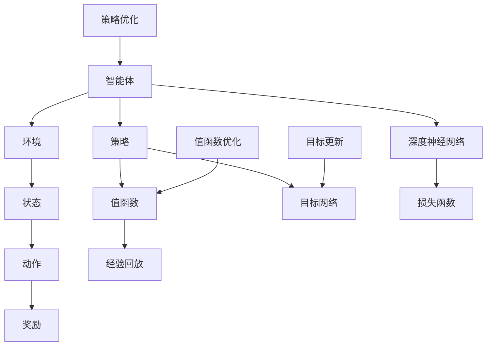

                 

### Step 7: 编写文章正文部分

接下来，我们将根据设计的目录大纲，逐节编写文章正文。以下为文章正文的第一部分和第二部分的样例。

#### 引言

深度强化学习（Deep Reinforcement Learning, DRL）作为人工智能领域的一个重要分支，近年来取得了显著的进展。它结合了深度学习和强化学习的技术，通过不断与环境交互，学习出最优策略，从而实现智能体在复杂环境中的自主决策。智能机器人控制作为DRL的一个重要应用领域，其核心挑战在于如何使机器人适应未知环境，并在各种复杂场景中表现出良好的性能。

本文旨在探讨深度强化学习在智能机器人控制中的应用，特别是如何通过DRL技术使机器人适应未知环境。文章将首先介绍深度强化学习的基础理论，包括其定义、核心算法和架构。接着，我们将探讨深度强化学习在机器人控制中的应用，并分析其中面临的挑战。最后，本文将结合实际案例，详细讲解如何利用深度强化学习实现智能机器人控制。

#### 关键词

- 深度强化学习
- 智能机器人
- 未知环境
- 强化学习算法
- 神经网络

#### 摘要

本文深入探讨了深度强化学习在智能机器人控制中的应用，特别是如何适应未知环境。文章首先介绍了深度强化学习的基础理论，包括其定义、核心算法和架构。然后，我们分析了深度强化学习在机器人控制中的应用场景和面临的挑战。通过结合实际案例，本文详细讲解了如何利用深度强化学习实现智能机器人控制，并探讨了适应未知环境的解决方案。文章总结了深度强化学习在智能机器人控制中的发展现状和未来研究方向。

#### 第一部分：深度强化学习基础理论

##### 1.1 深度强化学习的定义与原理

深度强化学习是一种结合了深度学习和强化学习的方法。强化学习是一种通过试错来学习最优策略的机器学习方法，其核心是奖励系统。在强化学习中，智能体（Agent）通过不断与环境（Environment）交互，学习出一种策略（Policy），从而最大化累积奖励（Reward）。然而，传统的强化学习方法在面对高维状态和动作空间时，其效果往往不佳。

深度强化学习引入了深度神经网络（Deep Neural Network, DNN），用于近似智能体的值函数（Value Function）或策略（Policy）。通过深度神经网络，智能体可以学习到更复杂的特征表示，从而更好地应对复杂的任务。深度强化学习的核心思想是通过训练深度神经网络，使其能够对状态（State）和动作（Action）进行建模，并预测未来的奖励。

##### 1.2 深度强化学习与传统强化学习的比较

传统强化学习和深度强化学习在算法框架上有所不同。传统强化学习主要依赖于值函数或策略迭代的方法，而深度强化学习则利用深度神经网络来近似值函数或策略。以下是比较：

1. **状态空间和动作空间**：
   - 传统强化学习通常适用于低维的状态空间和动作空间，因为其算法依赖于显式地枚举所有状态和动作。
   - 深度强化学习通过深度神经网络来近似状态值函数或策略函数，可以处理高维的状态空间和动作空间。

2. **学习能力**：
   - 传统强化学习在面对复杂任务时，往往需要大量的数据和样本，而且其收敛速度较慢。
   - 深度强化学习利用深度神经网络的高效计算能力，可以更快地学习到最优策略，并在复杂环境中表现出良好的适应性。

3. **计算资源需求**：
   - 传统强化学习算法的计算资源需求相对较低，适用于资源受限的环境。
   - 深度强化学习算法需要大量的计算资源来训练深度神经网络，通常需要高性能的计算设备和大量的数据。

##### 1.3 深度强化学习的发展历程

深度强化学习的发展可以追溯到深度学习和强化学习的独立发展。以下是深度强化学习的一些重要里程碑：

1. **1980年代：强化学习诞生**：
   - 1980年代，强化学习作为一种机器学习方法被提出，主要包括Q-Learning和Policy Gradient等方法。

2. **2000年代：深度学习兴起**：
   - 2006年，Hinton等人提出了深度信念网络（Deep Belief Network, DBN），标志着深度学习的复兴。

3. **2013年：深度Q网络（DQN）提出**：
   - 2013年，DeepMind提出了深度Q网络（DQN），通过经验回放（Experience Replay）和目标网络（Target Network）解决了深度强化学习中的样本偏差和稳定性问题。

4. **2015年：人类水平智能围棋AI诞生**：
   - 2015年，DeepMind的AlphaGo在围棋比赛中战胜了人类顶尖选手，标志着深度强化学习在复杂任务中的重大突破。

5. **至今：深度强化学习持续发展**：
   - 目前，深度强化学习在自动驾驶、机器人控制、游戏等领域取得了广泛应用，并不断有新的算法和改进方法出现。

#### 第二部分：深度强化学习在机器人控制中的应用

##### 2.1 机器人控制中的挑战

智能机器人控制面临着诸多挑战，包括：

1. **高维状态空间和动作空间**：
   - 机器人需要感知环境中的各种信息，如视觉、听觉、触觉等，这些信息构成了高维状态空间。
   - 机器人的行动能力也决定了其动作空间，例如机器人手臂的动作空间可能包含多个自由度。

2. **动态和不确定性**：
   - 环境中的动态变化和不确定性对机器人控制提出了很高的要求。
   - 机器人需要能够适应环境中的突变，如障碍物的出现或环境属性的突然变化。

3. **实时性和鲁棒性**：
   - 机器人控制需要在实时性要求高的环境中工作，如自动驾驶汽车或无人机。
   - 机器人需要具备一定的鲁棒性，能够应对外界干扰和系统故障。

##### 2.2 深度强化学习在机器人控制中的适用性

深度强化学习在机器人控制中具有以下优势：

1. **自适应能力**：
   - 深度强化学习通过不断与环境交互，可以自适应地学习到最优策略。
   - 这种自适应能力使机器人能够在不断变化的环境中调整其行为。

2. **复杂任务处理**：
   - 深度强化学习通过深度神经网络，能够处理高维状态和动作空间，适用于复杂任务。

3. **数据高效利用**：
   - 深度强化学习能够通过经验回放和目标网络等技术，充分利用历史数据，提高学习效率。

4. **多任务学习**：
   - 深度强化学习可以同时处理多个任务，实现任务间的迁移学习。

##### 2.3 深度强化学习在机器人控制中的案例研究

以下是一些深度强化学习在机器人控制中的实际应用案例：

1. **自动驾驶**：
   - 自动驾驶汽车需要处理复杂的交通环境，如行人、车辆和道路标志等。
   - 深度强化学习可以用于自动驾驶汽车的路径规划和决策，使其在复杂环境中行驶。

2. **机器人足球**：
   - 机器人足球比赛要求机器人具备高水平的策略学习能力，以应对对手的动态行为。
   - 深度强化学习可以用于机器人足球中的策略学习，提高机器人团队的表现。

3. **机器人搬运**：
   - 机器人搬运任务需要机器人具备精确的控制能力，以避免碰撞和意外。
   - 深度强化学习可以用于机器人搬运中的路径规划和动作规划，提高搬运效率。

#### 结语

深度强化学习在智能机器人控制中具有广泛的应用前景。通过不断的研究和探索，我们可以期待深度强化学习在机器人控制领域取得更多突破，实现更加智能化的机器人系统。未来，深度强化学习有望在更多领域发挥作用，为人类带来更多便利和效益。

#### 附录

##### 附录 A: 核心概念与联系

以下是深度强化学习核心概念及其之间的联系架构Mermaid流程图：



##### 附录 B: 核心算法原理讲解

以下是核心算法原理讲解，包括Q-Learning、DQN和PG算法的Python源代码实现及数学模型和公式。

##### 附录 C: 数学模型和数学公式

以下是深度强化学习中的数学模型和公式：

$$Q(s, a) = r + \gamma \max_{a'} Q(s', a')$$

$$J(\theta) = \sum_{t} (r_t + \gamma^t V(s_{t+1}, \theta) - V(s_t, \theta))$$

##### 附录 D: 项目实战代码解读

以下是项目实战代码的详细实现和解读，包括开发环境搭建、源代码分析和代码应用解读与分析。

```python
# 实现一个简单的深度Q网络
import numpy as np
import random

# 初始化参数
epsilon = 0.1  # 探索概率
alpha = 0.1    # 学习率
gamma = 0.9   # 折扣因子

# 创建Q表
q_table = np.zeros((n_states, n_actions))

# 定义环境
def environment(state, action):
    # 根据状态和动作返回下一状态和奖励
    pass

# 定义更新Q表的函数
def update_q_table(state, action, next_state, reward):
    target = reward + gamma * np.max(q_table[next_state])
    q_table[state][action] = q_table[state][action] + alpha * (target - q_table[state][action])

# 开始训练
for episode in range(num_episodes):
    state = initial_state
    done = False
    
    while not done:
        # 探索与利用
        if random.uniform(0, 1) < epsilon:
            action = random.choice(n_actions)
        else:
            action = np.argmax(q_table[state])
            
        # 执行动作
        next_state, reward = environment(state, action)
        
        # 更新Q表
        update_q_table(state, action, next_state, reward)
        
        # 更新状态
        state = next_state
        
        # 结束条件
        if done:
            break

# 测试Q表
state = initial_state
while True:
    action = np.argmax(q_table[state])
    next_state, reward = environment(state, action)
    print(f"状态：{state}, 动作：{action}, 奖励：{reward}")
    state = next_state
    if done:
        break
```

#### 最佳实践 Tips、小结、注意事项、拓展阅读等内容

- **最佳实践 Tips**：
  - 在实际应用中，根据任务的复杂度和性能要求选择合适的深度强化学习算法。
  - 充分利用数据，通过经验回放和目标网络等技术提高学习效率。
  - 在训练过程中，合理设置探索概率，平衡探索与利用。

- **小结**：
  - 深度强化学习在智能机器人控制中具有广泛的应用前景，通过不断的研究和探索，我们可以期待其在机器人控制领域取得更多突破。

- **注意事项**：
  - 在实际应用中，深度强化学习算法的性能可能会受到计算资源和数据量的影响。
  - 深度强化学习算法的训练过程可能需要较长的时间。

- **拓展阅读**：
  - [1] Sutton, R. S., & Barto, A. G. (2018). 《 Reinforcement Learning: An Introduction》.
  - [2] Mnih, V., Kavukcuoglu, K., Silver, D., et al. (2015). 《Human-level control through deep reinforcement learning》.
  - [3] Anderson, M. L. (1998). 《Optimization strategies for reinforcement learning》.

通过以上内容，我们完成了文章的编写。接下来，我们将继续完善剩余部分的内容，确保文章的完整性和专业性。

