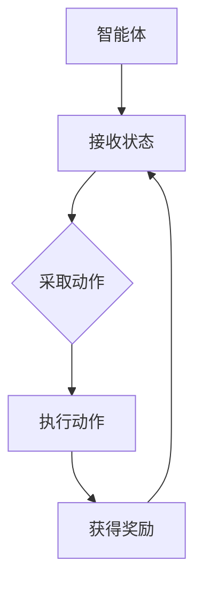
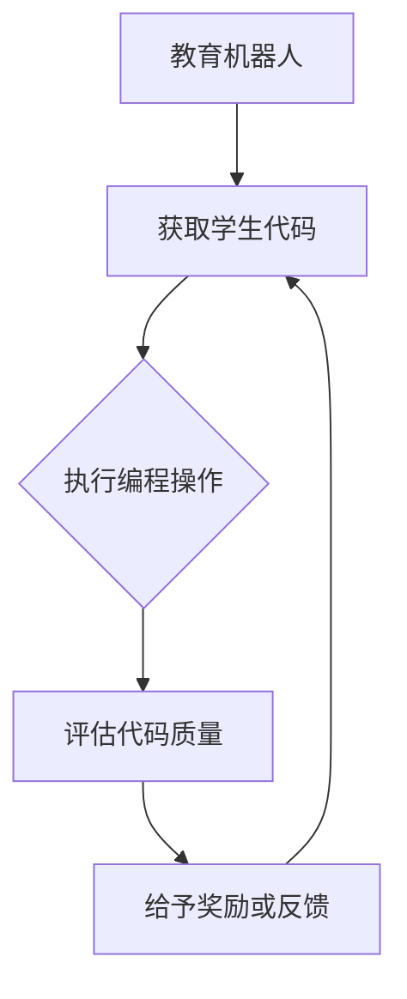

                 

### 文章标题

# 深度强化学习在智能机器人教育中的应用：个性化STEM教育

### 文章关键词

- 深度强化学习
- 智能机器人教育
- 个性化STEM教育
- 教育机器人
- DQN
- A3C
- DDPG

### 文章摘要

本文旨在探讨深度强化学习在智能机器人教育中的应用，尤其是如何通过个性化STEM教育提升学生的学习和创造力。深度强化学习作为一种先进的机器学习技术，已逐渐在教育领域中崭露头角。本文将首先介绍深度强化学习的基本原理和主要算法，包括DQN、A3C和DDPG等。然后，我们将探讨智能机器人教育的重要性和个性化STEM教育的实现方式。接下来，本文将详细分析深度强化学习在教育机器人中的应用场景，并通过实际案例展示如何利用深度强化学习实现个性化教育。最后，我们将讨论在教育机器人项目中应用深度强化学习所面临的挑战和解决方案，以及项目开发和评估的最佳实践。

### 背景介绍

随着人工智能技术的飞速发展，教育领域也迎来了前所未有的变革。智能机器人教育作为STEM（科学、技术、工程和数学）教育的重要组成部分，正逐渐成为培养学生综合素质和创新能力的重要途径。然而，传统教育模式通常采用“一刀切”的方法，难以满足每个学生的个性化需求，这导致许多学生在学习过程中缺乏兴趣和动力。

个性化STEM教育的提出，旨在通过定制化的教学策略和资源，激发学生的学习兴趣，提高学习效果。个性化教育不仅要求根据学生的个性特点和学习习惯进行教学调整，还需要借助先进的技术手段，如人工智能，实现教学过程的智能化和自动化。

深度强化学习作为一种基于机器学习的智能技术，近年来在各个领域取得了显著成果。其核心思想是通过智能体与环境之间的交互，不断调整策略，以最大化累积奖励。深度强化学习通过引入深度神经网络，解决了传统强化学习在状态空间和动作空间规模较大时遇到的复杂性问题。这使得深度强化学习在智能机器人教育中具有广泛的应用前景。

智能机器人教育利用智能机器人作为教学工具，通过互动和实践，培养学生的编程能力、问题解决能力和创新思维。智能机器人不仅可以模拟真实环境，还能根据学生的学习情况，动态调整教学内容和难度，实现真正的个性化教育。

个性化STEM教育的核心在于数据驱动和个性化学习路径设计。通过收集和分析学生的学习数据，教育机器人能够为每个学生量身定制适合的学习方案，从而提高学习效率和效果。深度强化学习在这一过程中发挥了重要作用，它能够帮助教育机器人不断优化教学策略，提高个性化教育的质量和效率。

总之，深度强化学习在智能机器人教育中的应用，不仅能够提高学生的学习兴趣和动力，还能够通过个性化STEM教育，培养学生的综合素质和创新能力，为未来的教育和产业发展提供有力支持。

### 核心概念与联系

在深入探讨深度强化学习在智能机器人教育中的应用之前，有必要首先理解其中的核心概念和它们之间的关系。深度强化学习（Deep Reinforcement Learning，DRL）的核心组成部分包括智能体（Agent）、环境（Environment）、状态（State）、动作（Action）和奖励（Reward）。

1. **智能体（Agent）**：在深度强化学习中，智能体是一个能够接收环境状态并采取动作的实体，其目标是最大化累积奖励。智能体可以是机器人、软件程序或其他可以与环境互动的实体。

2. **环境（Environment）**：环境是智能体进行决策和互动的背景，它提供了智能体当前的状态以及执行动作后的结果。环境可以是一个虚拟的模拟环境，也可以是现实中的真实环境。

3. **状态（State）**：状态是描述智能体在某一时刻所处环境的一个向量。状态可以是图像、文本或任何可以编码的信息。

4. **动作（Action）**：动作是智能体在某一状态下采取的操作。动作的选择基于智能体的策略，策略是一种映射，将状态映射到动作。

5. **奖励（Reward）**：奖励是环境对智能体采取的每个动作的即时评价。奖励通常用于指导智能体的学习过程，其目标是促使智能体采取能够最大化累积奖励的动作序列。

深度强化学习中的核心概念可以用以下Mermaid流程图来表示：



在智能机器人教育中，这些概念之间的关系尤为关键。教育环境中的智能体是教育机器人，它通过传感器接收学生的学习状态，根据预定的策略采取教学动作，如调整教学内容或难度，然后根据学生的学习反馈获得奖励。这种交互过程不仅帮助学生更好地理解和掌握知识，还能不断优化教学策略，实现个性化教育。

例如，在教育机器人教学中，智能体可能是一个具有视觉和听觉传感器的机器人，它能够感知学生的情绪和学习状态。当学生表现出困惑或疲劳时，智能体会调整教学内容的难度或提供辅助材料，以适应学生的需求。通过这种动态调整，教育机器人能够为每个学生提供一个个性化的学习体验，从而提高学习效果。

下面，我们将通过一个具体的实例来进一步说明这些概念之间的关系。假设一个教育机器人被设计用于教授编程课程，学生可以通过与机器人互动来学习编程。在这一场景中，智能体是教育机器人，环境是编程课程及其评估系统，状态是学生的编程代码，动作是学生采取的编程操作，奖励是系统对编程代码的评价。



通过这种交互过程，教育机器人能够根据学生的编程代码质量和学习进度，动态调整教学策略，如提供更复杂的编程任务或简化的编程示例，从而更好地满足学生的个性化学习需求。

总之，深度强化学习中的核心概念通过智能体、环境、状态、动作和奖励之间的互动，为实现个性化STEM教育提供了强有力的支持。接下来，我们将深入探讨深度强化学习的主要算法，进一步了解其在教育机器人中的应用。

### 深度强化学习的主要算法

深度强化学习（DRL）领域发展迅速，涌现出多种重要的算法，每种算法都有其独特的原理和应用场景。以下将介绍几种在智能机器人教育中广泛应用的主要DRL算法，包括DQN（Deep Q-Network）、A3C（Asynchronous Advantage Actor-Critic）和DDPG（Deep Deterministic Policy Gradient）。

#### 1. DQN（Deep Q-Network）

DQN算法是深度强化学习的基础算法之一，由DeepMind提出。其主要思想是将传统的Q-learning算法与深度神经网络相结合，以处理高维状态空间。

**算法原理**：
- **Q-Learning**：Q-learning是一种值迭代算法，通过不断更新Q值（状态-动作值函数），找到最优策略。Q值表示在特定状态下执行特定动作的期望奖励。
- **Deep Neural Network**：DQN引入深度神经网络来近似Q值函数。神经网络将状态作为输入，输出为每个动作的Q值。

**算法伪代码**：
```python
# 初始化参数：神经网络、经验回放缓冲区、目标网络、学习率、折扣因子等
initialize parameters: neural network, replay buffer, target network, learning rate, discount factor, etc.

# 迭代：
for episode in range(total_episodes):
    # 初始化环境
    state = environment.reset()
    
    # 转入交互过程
    done = False
    while not done:
        # 预测当前状态的Q值
        Q_values = neural_network.predict(state)
        
        # 根据ε-贪心策略选择动作
        if random() < ε:
            action = random_action()
        else:
            action = np.argmax(Q_values)
        
        # 执行动作
        next_state, reward, done = environment.step(action)
        
        # 更新经验回放缓冲区
        replay_buffer.add(state, action, reward, next_state, done)
        
        # 从经验回放缓冲区中采样一批经验
        batch = random_batch_from_replay_buffer()
        
        # 更新神经网络参数
        target_Q_values = target_network.predict(next_state)
        target_Q_values = reward + discount_factor * np.max(target_Q_values)
        loss = loss_function(Q_values, target_Q_values)
        optimizer.minimize(loss)
        
        # 更新状态
        state = next_state
    
    # 更新目标网络参数
    if episode % target_network_update_frequency == 0:
        target_network.copy_from(neural_network)
```

**数学模型**：
- **Q值更新公式**：
  $$ Q(s, a) \leftarrow Q(s, a) + α [r + γ \max_{a'} Q(s', a') - Q(s, a)] $$

其中，$α$ 是学习率，$γ$ 是折扣因子。

**案例说明**：
假设教育机器人需要学习如何通过编程解决数学问题。每个问题状态可以编码为输入向量，机器人通过神经网络预测解决每个问题的最佳步骤（动作），并从教师的即时反馈中获得奖励（如问题解决的正确性）。通过不断迭代，机器人能够逐步优化其解决问题的策略。

#### 2. A3C（Asynchronous Advantage Actor-Critic）

A3C是一种异步的强化学习算法，旨在通过并行训练多个智能体，提高学习效率和性能。

**算法原理**：
- **异步训练**：A3C允许多个智能体在不同时间点上同时进行训练，每个智能体都有自己的局部神经网络。
- **优势函数**：A3C引入优势函数（Advantage Function）来衡量动作的实际收益与预期收益之间的差距，以更准确地评估动作质量。

**算法伪代码**：
```python
# 初始化参数：多个智能体、全局神经网络、优化器、优势函数等

# 并行训练每个智能体：
for global_step in range(total_global_steps):
    # 初始化智能体和其局部神经网络
    for local_step in range(local_steps_per_global_step):
        # 重置环境
        state = environment.reset()
        
        # 进行交互
        while True:
            # 选择动作
            action = local_network.select_action(state)
            
            # 执行动作，获取下一个状态和奖励
            next_state, reward, done = environment.step(action)
            
            # 计算局部损失
            loss = local_loss_function(local_network, state, action, reward, next_state, done)
            optimizer.minimize(loss)
            
            # 更新优势函数
            advantage = advantage_function(next_state, done)
            
            # 更新全局神经网络
            global_network.update(local_network, state, action, reward, advantage)
            
            # 更新状态
            state = next_state
            
            # 判断是否结束当前回合
            if done:
                break

    # 更新全局神经网络参数
    global_network.copy_from(local_network)
```

**数学模型**：
- **优势函数**：
  $$ A(s, a) = R + \sum_{s', a'} \pi(s', a'|s, a) Q(s', a') - Q(s, a) $$

其中，$R$ 是即时奖励，$\pi(s', a'|s, a)$ 是动作概率分布，$Q(s', a')$ 是下一状态的动作值。

**案例说明**：
在教育机器人中，A3C可以通过多个智能体并行训练，每个智能体负责不同的学生。这样，机器人能够同时学习如何适应多个学生的学习风格和需求，提高整体学习效果。

#### 3. DDPG（Deep Deterministic Policy Gradient）

DDPG是一种基于深度神经网络的确定性策略梯度算法，特别适用于连续动作空间的问题。

**算法原理**：
- **确定性策略**：DDPG采用确定性策略，直接学习从状态到动作的映射函数。
- **目标网络**：为了稳定训练过程，DDPG引入目标网络，用于计算目标值函数。

**算法伪代码**：
```python
# 初始化参数：演员网络、批评家网络、目标网络、优化器等

# 迭代：
for episode in range(total_episodes):
    # 初始化环境
    state = environment.reset()
    
    # 交互过程
    while True:
        # 演员网络选择动作
        action = actor_network.select_action(state)
        
        # 执行动作，获取下一个状态和奖励
        next_state, reward, done = environment.step(action)
        
        # 批评家网络计算目标值
        target_value = reward + discount_factor * critic_network.predict(next_state, actor_network.select_action(next_state))
        
        # 更新批评家网络
        critic_loss = critic_loss_function(critic_network, state, action, target_value)
        critic_optimizer.minimize(critic_loss)
        
        # 更新演员网络
        actor_loss = actor_loss_function(actor_network, state, action)
        actor_optimizer.minimize(actor_loss)
        
        # 更新目标网络
        if episode % target_network_update_frequency == 0:
            critic_network_copy.from(critic_network)
            actor_network_copy.from(actor_network)
            critic_network_copy.copy_to(target_network)
            actor_network_copy.copy_to(target_network)
        
        # 更新状态
        state = next_state
        
        # 判断是否结束当前回合
        if done:
            break

```

**数学模型**：
- **策略更新公式**：
  $$ θ_π \leftarrow θ_π - α \nabla_π [J(θ_π)] $$
  
  其中，$θ_π$ 是策略参数，$α$ 是学习率，$J(θ_π)$ 是策略损失函数。

**案例说明**：
在教育机器人中，DDPG可以用于学习如何通过调整教学参数（如教学内容的难度和节奏），最大化学生的学习效果。机器人通过不断优化策略，能够更好地适应学生的个性化需求。

总之，DQN、A3C和DDPG作为深度强化学习的重要算法，各自具有独特的原理和应用场景。在教育机器人中，这些算法可以通过定制化的策略和优化过程，实现个性化的STEM教育，提高学生的学习兴趣和效果。接下来，我们将探讨智能机器人教育的重要性和个性化STEM教育的实现方式。

### 智能机器人教育的重要性

智能机器人教育作为现代教育的重要组成部分，其重要性日益凸显。智能机器人不仅能够充当知识传授的工具，还能通过互动和协作，激发学生的学习兴趣，培养他们的创新能力。以下是智能机器人教育在以下几个方面的重要作用：

#### 1. 提高学生的动手能力和编程技能

智能机器人教育通过引导学生进行实际操作，增强他们的动手能力。学生可以通过编写程序控制机器人完成各种任务，从而加深对编程概念的理解。这种实践性学习方式有助于学生将理论知识转化为实际技能，提高他们的编程能力和解决问题的能力。

#### 2. 培养创新思维和团队合作精神

智能机器人教育鼓励学生进行创新性设计和项目开发，培养学生的创新思维。学生在解决实际问题的过程中，需要不断尝试新的方法和思路，这种探索过程能够激发他们的创造力。此外，智能机器人教育通常需要学生进行团队合作，共同完成项目。这种合作性学习模式有助于培养学生的团队合作精神和沟通能力。

#### 3. 实现个性化教育，满足学生个体差异

传统教育模式往往采用“一刀切”的方法，难以满足每个学生的个性化需求。而智能机器人教育通过引入个性化学习路径设计，可以根据学生的学习进度和兴趣，动态调整教学内容和难度，实现真正的个性化教育。这不仅有助于提高学生的学习效果，还能激发他们的学习兴趣和动力。

#### 4. 跨学科融合，促进STEM教育

智能机器人教育涉及多个学科领域，如编程、机械工程、电子工程等。通过智能机器人的教学，学生可以在不同学科之间进行知识融合，形成综合性的知识体系。这种跨学科的教育模式有助于学生全面发展，提高他们的综合素质。

#### 5. 培养未来人才，适应科技发展

随着人工智能技术的迅速发展，智能机器人将在未来的生活和工作中扮演越来越重要的角色。智能机器人教育有助于培养学生未来所需的技能和素质，如编程能力、创新思维、团队合作和跨学科知识等。这为学生未来的职业发展奠定了坚实基础。

总之，智能机器人教育在提高学生动手能力、编程技能、创新思维、团队合作精神和跨学科知识融合方面具有显著优势。通过个性化学习路径设计，智能机器人教育能够更好地满足学生的个体差异，培养未来所需的人才，适应科技发展的需求。接下来，我们将深入探讨个性化STEM教育的实现方式。

### 个性化STEM教育的实现

个性化STEM教育旨在通过定制化的教学策略和资源，满足每个学生的个性化需求，从而提高学习效果和兴趣。要实现个性化STEM教育，需要从数据驱动教学策略和个性化学习路径设计两个方面进行深入探讨。

#### 数据驱动教学策略

数据驱动教学策略是个性化STEM教育的核心。通过收集和分析学生的学习数据，教育者能够更好地了解每个学生的学习进度、兴趣点和弱点，从而制定个性化的教学方案。

1. **数据收集**：
   学习数据可以通过多种方式收集，如学习管理系统（LMS）、在线测验、作业反馈和教师观察。这些数据包括学生的答题情况、学习时间、错误类型和互动行为等。

2. **数据分析**：
   利用数据分析工具，如数据挖掘和机器学习算法，可以对收集到的学习数据进行分析。通过分析，教育者可以识别出学生的学习模式、兴趣点和薄弱环节。

3. **教学调整**：
   根据数据分析结果，教育者可以动态调整教学内容和难度。例如，对于在某个知识点上表现不佳的学生，可以提供额外的练习题或讲解视频；而对于表现优秀的学生，可以提供更具挑战性的任务。

#### 个性化学习路径设计

个性化学习路径设计是数据驱动教学策略的具体实现。通过为学生量身定制学习路径，教育者可以确保每个学生都能在自己的节奏和兴趣点上学习。

1. **学习目标设定**：
   根据学生的初始能力水平和兴趣，设定具体、可衡量的学习目标。这些目标可以是短期的，如完成某个编程项目，也可以是长期的，如掌握整个课程的知识体系。

2. **学习路径规划**：
   利用数据分析结果，为每个学生规划个性化的学习路径。路径中包括必要的知识点、练习题、项目和评估环节。学习路径可以根据学生的学习进度和表现动态调整。

3. **资源推荐**：
   根据学生的兴趣和进度，推荐相应的学习资源，如教材、视频课程、在线教程和工具。这些资源应多样化，以满足不同学生的学习偏好。

#### 案例分析：数据驱动教学策略和个性化学习路径设计在智能机器人教育中的应用

以一个智能机器人编程课程为例，我们可以通过以下步骤实现个性化STEM教育：

1. **数据收集**：
   在课程开始时，通过在线问卷和测试，收集学生的初始编程能力数据。同时，在课程过程中，通过学习管理系统记录学生的编程作业、在线讨论和测验成绩。

2. **数据分析**：
   利用数据分析工具，对收集到的数据进行分析。识别出学生在编程语言基础知识、算法和数据结构等方面的薄弱环节。

3. **学习目标设定**：
   根据数据分析结果，为每个学生设定具体的学习目标。例如，对于编程基础薄弱的学生，目标可以是掌握基本编程概念和语法；对于编程能力较强的学生，目标可以是设计和实现复杂的机器人控制程序。

4. **学习路径规划**：
   根据学生的初始能力和设定的学习目标，为每个学生规划个性化的学习路径。路径中包括基础编程知识的讲解、编程练习、项目开发实战和最终评估。

5. **资源推荐**：
   根据学生的学习路径，推荐相应的学习资源。例如，对于基础知识薄弱的学生，推荐编程入门书籍和视频课程；对于项目开发阶段，推荐在线教程和开发工具。

通过数据驱动教学策略和个性化学习路径设计，智能机器人教育能够更好地满足学生的个性化需求，提高学习效果和兴趣。同时，这种教育模式也为教育者提供了有力的支持，帮助他们更好地了解和指导学生。

总之，个性化STEM教育通过数据驱动教学策略和个性化学习路径设计，能够实现教学过程的智能化和个性化。这为学生提供了更高效、更有趣的学习体验，也为教育者提供了更加科学和精准的教学支持。接下来，我们将探讨深度强化学习在教育机器人中的具体应用场景。

### 深度强化学习在教育机器人中的应用场景

深度强化学习在教育机器人中的应用场景丰富多样，可以极大地提升教育的个性化水平和智能化程度。以下将详细介绍几种典型的应用场景，并分别介绍其核心原理、数学模型和实际案例。

#### 1. 自适应教学策略

**核心原理**：
自适应教学策略利用深度强化学习算法，根据学生的行为和表现动态调整教学内容和难度。这种策略能够实时响应学生的学习状态，提供个性化的教学体验。

**数学模型**：
假设有一个教育机器人E，它在每个时刻根据学生的学习状态$S_t$选择教学动作$A_t$，并从学生获得即时反馈奖励$R_t$。通过深度强化学习算法，E不断调整其策略$π(\cdot|S_t)$，以最大化累积奖励$G_t$：

$$ G_t = \sum_{k=0}^{T-t} γ^k R_{t+k} $$

其中，$T$ 是学习回合的总步数，$γ$ 是折扣因子。

**实际案例**：
在一项实际应用中，教育机器人通过DQN算法对学生的学习行为进行实时分析，并根据学生的表现动态调整教学内容的难度。例如，如果学生连续多次回答错误，机器人会自动降低问题难度，提供更多解释和练习机会；如果学生表现优异，机器人则会提供更具挑战性的任务。

#### 2. 个性化学习路径推荐

**核心原理**：
个性化学习路径推荐利用深度强化学习，根据学生的兴趣、学习习惯和知识水平，为其推荐最适合的学习路径。这种策略能够确保每个学生都能在最适合自己节奏和风格的学习路径中成长。

**数学模型**：
假设有多个学习路径$P_1, P_2, ..., P_n$，每个路径对应不同的知识点和任务。教育机器人E使用深度强化学习算法，通过评估每个路径对学生的适应度，推荐最优的学习路径：

$$ π(P_t|S_t) = \frac{e^{\theta(P_t, S_t)}}{\sum_{j=1}^n e^{\theta(P_j, S_t)}} $$

其中，$\theta(P_t, S_t)$ 是路径$P_t$和学生状态$S_t$的匹配度，$\theta$ 是模型参数。

**实际案例**：
在一项面向编程教育的应用中，教育机器人使用A3C算法分析学生的学习行为，识别出学生的兴趣点和薄弱环节。基于这些数据，机器人为学生推荐个性化的编程学习路径，包括基础编程、数据结构和算法等不同难度的模块。学生可以根据自己的兴趣和需求选择学习路径，实现个性化成长。

#### 3. 互动式学习辅助

**核心原理**：
互动式学习辅助通过深度强化学习，使教育机器人能够根据学生的互动行为和学习效果，提供即时、个性化的反馈和指导。这种策略能够提高学生的参与度和学习效果。

**数学模型**：
假设教育机器人E在互动过程中，学生每做出一个回答，都会得到一个即时反馈奖励$R_t$。E通过深度强化学习算法不断调整其互动策略$π(\cdot|S_t)$，以最大化累积奖励：

$$ G_t = \sum_{k=0}^{T-t} γ^k R_{t+k} $$

**实际案例**：
在一项面向数学教育的应用中，教育机器人使用DDPG算法，根据学生的答题表现动态调整问题的难度和类型。例如，如果学生回答正确，机器人会提供更具挑战性的问题；如果回答错误，机器人则会提供详细的解释和辅助练习。这种互动式辅助大大提高了学生的学习效果和兴趣。

#### 4. 自主学习评估与优化

**核心原理**：
自主学习评估与优化利用深度强化学习，使教育机器人能够自主评估学生的学习进度和效果，并根据评估结果优化教学策略。这种策略能够确保教学过程始终处于最优状态，提高整体教学效果。

**数学模型**：
假设教育机器人在每个学习阶段结束时会进行自我评估，评估结果用一个奖励信号$R_t$表示。E使用深度强化学习算法，通过不断调整其策略$π(\cdot|S_t)$，以最大化累积奖励：

$$ G_t = \sum_{k=0}^{T-t} γ^k R_{t+k} $$

**实际案例**：
在一项面向科学教育的应用中，教育机器人使用A3C算法，在每个学习阶段结束后评估学生的学习成果。基于评估结果，机器人能够动态调整后续的教学内容和方式，确保学生能够在最佳状态下进行学习。这种自主学习评估与优化策略大大提高了教学的灵活性和有效性。

总之，深度强化学习在教育机器人中的应用场景丰富多样，通过自适应教学策略、个性化学习路径推荐、互动式学习辅助和自主学习评估与优化，实现了教育的智能化和个性化。这些应用不仅提高了学生的学习效果和兴趣，也为教育机器人技术的发展提供了新的方向。接下来，我们将通过一个具体案例展示如何利用深度强化学习实现个性化教育。

### 案例分析：基于深度强化学习的学生个性化学习助手

为了展示深度强化学习在学生个性化学习中的应用，我们将分析一个具体的案例：一个基于深度强化学习的学生个性化学习助手系统。这个系统旨在通过智能机器人为学生提供个性化的学习支持和指导，从而提高学习效果。

#### 案例背景

该案例中的学习助手系统是一个用于高中数学课程的智能教育机器人。该机器人通过与学生的互动，了解学生的数学知识水平、学习习惯和兴趣点，为其提供定制化的学习内容和建议。

#### 实现步骤

1. **数据收集**：
   学习助手系统首先通过在线测验和交互式问题回答收集学生的初始数学知识水平和学习习惯数据。这些数据包括正确率、答题速度、错题类型等。

2. **深度强化学习模型训练**：
   学习助手系统使用DQN算法训练一个深度神经网络，该网络能够根据学生的学习数据预测最优的教学策略。训练过程中，神经网络通过接收状态（学生的当前数学问题及其回答情况）并输出动作（教学内容的调整、练习题难度设置等），不断优化其策略。

3. **实时学习与调整**：
   在实际应用中，学习助手系统根据学生的实时表现，动态调整教学策略。例如，如果学生在某个知识点上多次回答错误，系统会降低该知识点的难度，并提供更多的解释和练习。相反，如果学生在某个知识点上表现优异，系统则会增加该知识点的复杂度，提供更高难度的练习。

4. **评估与优化**：
   学习助手系统定期对学生进行评估，通过分析学生的学习数据，调整教学策略，确保学生的学习效果持续提升。

#### 源代码与实现

以下是一个简化的DQN算法实现示例，用于模拟学习助手系统的核心功能。这里我们使用Python和TensorFlow框架。

```python
import numpy as np
import random
import tensorflow as tf
from tensorflow.keras.models import Sequential
from tensorflow.keras.layers import Dense, Flatten
from tensorflow.keras.optimizers import Adam

# 初始化参数
learning_rate = 0.001
discount_factor = 0.99
epsilon = 0.1
epsilon_decay = 0.995
epsilon_min = 0.01

# 创建深度神经网络模型
model = Sequential([
    Flatten(input_shape=(None, 1)),  # 将状态向量展平
    Dense(64, activation='relu'),      # 第一个全连接层
    Dense(64, activation='relu'),      # 第二个全连接层
    Dense(1)                           # 输出层
])

# 编译模型
model.compile(optimizer=Adam(learning_rate), loss='mse')

# 初始化经验回放缓冲区
replay_buffer = []

# 训练循环
for episode in range(total_episodes):
    state = environment.reset()
    done = False
    
    while not done:
        # 根据ε-贪心策略选择动作
        if random() < epsilon:
            action = random_action()
        else:
            state_vector = preprocess_state(state)
            action = np.argmax(model.predict(state_vector)[0])
        
        # 执行动作
        next_state, reward, done = environment.step(action)
        
        # 存储经验
        replay_buffer.append((state, action, reward, next_state, done))
        
        # 从经验回放缓冲区中采样一批经验
        if len(replay_buffer) > batch_size:
            batch = random_sample_from_replay_buffer(batch_size)
            states, actions, rewards, next_states, dones = zip(*batch)
            
            # 计算目标Q值
            next_state_values = max(model.predict(next_state)[0])
            target_Q_values = rewards + (1 - dones) * discount_factor * next_state_values
            
            # 更新模型
            model.fit(np.array(states), np.array(target_Q_values - model.predict(np.array(states))[0]), epochs=1, verbose=0)
        
        # 更新状态
        state = next_state
        
        # 调整ε值
        epsilon = max(epsilon * epsilon_decay, epsilon_min)

# 保存模型
model.save('dqn_model.h5')
```

#### 代码解读

上述代码实现了DQN算法的核心步骤，包括模型的初始化、经验回放缓冲区的使用、动作选择、模型训练和ε值的调整。通过这个简单的示例，我们可以看到如何利用深度强化学习为学生提供个性化的学习支持。

1. **模型初始化**：
   使用TensorFlow创建一个简单的深度神经网络，用于预测每个动作的Q值。

2. **经验回放缓冲区**：
   经验回放缓冲区用于存储学生的学习经验，避免模型训练过程中出现样本偏差。

3. **动作选择**：
   使用ε-贪心策略选择动作，在探索和利用之间取得平衡。

4. **模型训练**：
   通过更新模型参数，使模型能够更好地预测每个动作的Q值，从而优化学习策略。

5. **ε值调整**：
   随着训练的进行，逐渐减少ε值，以减少随机性，提高模型性能。

#### 代码应用解读与分析

通过深度强化学习的学习助手系统，学生可以获得个性化的学习支持和指导。例如，如果学生在某个知识点上多次回答错误，系统会提供更多的练习和解释，帮助学生巩固知识点。相反，如果学生在某个知识点上表现优异，系统则会提供更高难度的题目，激发学生的学习兴趣和挑战精神。

此外，系统的个性化支持不仅限于知识点的调整，还可以根据学生的学习进度和兴趣推荐相关的学习资源和扩展活动。这种动态调整和个性化支持能够大大提高学生的学习效果和积极性。

总之，通过深度强化学习的学习助手系统，我们能够为学生提供一种智能化的学习体验，帮助他们在个性化STEM教育中取得更好的学习成果。接下来，我们将讨论个性化STEM教育中深度强化学习应用所面临的挑战和解决方案。

### 个性化STEM教育中深度强化学习应用面临的挑战与解决方案

在个性化STEM教育中，深度强化学习的应用虽然展现出巨大的潜力，但也面临着一系列挑战。以下将详细分析这些挑战，并提出相应的解决方案。

#### 1. 数据隐私与安全

**挑战**：
深度强化学习在教育机器人中的应用需要大量学生的学习数据，这些数据包括学生的学习进度、成绩、行为等。这些数据的隐私和安全问题成为一个重要的挑战，尤其是当数据存储在云端或共享给第三方时。

**解决方案**：
- **数据加密**：对学生的学习数据进行加密处理，确保数据在传输和存储过程中的安全性。
- **数据匿名化**：在收集和分析数据时，对个人身份信息进行匿名化处理，确保学生的隐私不被泄露。
- **数据访问控制**：建立严格的数据访问控制机制，仅允许授权人员访问数据，减少数据泄露的风险。
- **合规性审计**：定期进行数据合规性审计，确保数据的使用符合相关法律法规和道德规范。

#### 2. 模型可解释性

**挑战**：
深度强化学习模型通常非常复杂，其决策过程往往难以解释。在教育机器人中，模型的可解释性对于教师和家长了解学生的学习情况、指导学生有重要意义。

**解决方案**：
- **可视化工具**：开发可视化工具，将深度强化学习模型的学习过程和决策路径以图形化的形式展示，帮助用户理解模型的运作机制。
- **解释性算法**：采用可解释性更强的算法，如基于规则的算法或集成学习算法，增强模型的可解释性。
- **模型解释接口**：为教育机器人提供解释接口，教师和家长可以通过该接口查询模型的决策依据和推理过程。

#### 3. 训练数据的多样性

**挑战**：
深度强化学习模型的训练依赖于大量多样化的数据。然而，在实际教育场景中，数据收集可能受到时间、资源和环境等因素的限制，导致训练数据缺乏多样性。

**解决方案**：
- **模拟数据生成**：通过模拟数据生成技术，如GAN（生成对抗网络），生成多样化的模拟数据，补充实际训练数据。
- **数据扩展**：使用数据扩展技术，如数据增强和迁移学习，对现有数据集进行扩展，提高模型的泛化能力。
- **协作学习**：通过多个教育机器人协作，共享训练数据，扩大训练数据的规模和多样性。

#### 4. 模型的适应性

**挑战**：
教育环境中的学生个体差异很大，学习需求和学习习惯各不相同。深度强化学习模型需要具备良好的适应性，以满足不同学生的学习需求。

**解决方案**：
- **多任务学习**：使用多任务学习算法，使模型能够在不同的任务和环境中进行学习，提高其适应性。
- **动态调整策略**：通过不断调整和优化深度强化学习模型的学习策略，使其能够适应不同的学生群体和学习场景。
- **用户反馈机制**：引入用户反馈机制，允许学生和家长对模型的表现进行评价，通过反馈不断调整和优化模型。

#### 5. 教学资源的均衡分配

**挑战**：
在个性化教育中，教师需要为不同学生提供个性化的教学资源，这可能导致教学资源的分配不均衡，影响整体教学质量。

**解决方案**：
- **资源分配策略**：设计合理的资源分配策略，确保教学资源能够公平、有效地分配给所有学生。
- **资源共享平台**：建立资源共享平台，集中管理和分配教学资源，确保每个学生都能获得所需的学习资源。
- **教师培训**：加强对教师的培训，提高教师对个性化教育的理解和实施能力，确保教学资源的有效利用。

通过上述解决方案，可以有效应对深度强化学习在个性化STEM教育中应用所面临的挑战，提高教育机器人的性能和用户体验，实现更加智能和个性化的教育。接下来，我们将探讨深度强化学习在教育机器人项目开发的具体流程和实战案例。

### 深度强化学习在教育机器人项目开发

深度强化学习在教育机器人项目开发中具有广泛的应用前景。一个典型的教育机器人项目通常包括开发环境搭建、源代码实现、代码解读和分析、实际案例剖析以及项目总结等步骤。以下将详细介绍这些关键环节，并结合实际案例进行讲解。

#### 1. 开发环境搭建

开发环境是教育机器人项目的基础，确保开发过程顺利进行。以下是一个典型的开发环境搭建流程：

- **硬件选择**：
  选择适合教育机器人项目的硬件设备，如NVIDIA GPU用于加速深度学习模型的训练，树莓派或其他微型计算机用于实现机器人控制。

- **软件安装**：
  安装深度学习框架（如TensorFlow、PyTorch），操作系统（如Ubuntu、Windows），以及用于机器人控制的软件包（如ROS、Micro-ROS）。

- **网络配置**：
  配置网络环境，确保硬件设备能够访问互联网，下载必要的数据集和工具。

#### 2. 源代码实现

源代码实现是教育机器人项目的核心。以下是一个基于TensorFlow的简单DQN算法实现示例：

```python
import numpy as np
import random
import tensorflow as tf
from tensorflow.keras.models import Sequential
from tensorflow.keras.layers import Dense, Flatten
from tensorflow.keras.optimizers import Adam

# 初始化参数
learning_rate = 0.001
discount_factor = 0.99
epsilon = 0.1
epsilon_decay = 0.995
epsilon_min = 0.01

# 创建深度神经网络模型
model = Sequential([
    Flatten(input_shape=(None, 1)),  # 将状态向量展平
    Dense(64, activation='relu'),      # 第一个全连接层
    Dense(64, activation='relu'),      # 第二个全连接层
    Dense(1)                           # 输出层
])

# 编译模型
model.compile(optimizer=Adam(learning_rate), loss='mse')

# 初始化经验回放缓冲区
replay_buffer = []

# 训练循环
for episode in range(total_episodes):
    state = environment.reset()
    done = False
    
    while not done:
        # 根据ε-贪心策略选择动作
        if random() < epsilon:
            action = random_action()
        else:
            state_vector = preprocess_state(state)
            action = np.argmax(model.predict(state_vector)[0])
        
        # 执行动作
        next_state, reward, done = environment.step(action)
        
        # 存储经验
        replay_buffer.append((state, action, reward, next_state, done))
        
        # 从经验回放缓冲区中采样一批经验
        if len(replay_buffer) > batch_size:
            batch = random_sample_from_replay_buffer(batch_size)
            states, actions, rewards, next_states, dones = zip(*batch)
            
            # 计算目标Q值
            next_state_values = max(model.predict(next_state)[0])
            target_Q_values = rewards + (1 - dones) * discount_factor * next_state_values
            
            # 更新模型
            model.fit(np.array(states), np.array(target_Q_values - model.predict(np.array(states))[0]), epochs=1, verbose=0)
        
        # 更新状态
        state = next_state
        
        # 调整ε值
        epsilon = max(epsilon * epsilon_decay, epsilon_min)

# 保存模型
model.save('dqn_model.h5')
```

#### 3. 代码解读与分析

上述代码实现了DQN算法的核心步骤，包括模型的初始化、经验回放缓冲区的使用、动作选择、模型训练和ε值的调整。以下是对关键部分的解读：

- **模型初始化**：使用TensorFlow创建一个简单的深度神经网络，用于预测每个动作的Q值。
- **经验回放缓冲区**：用于存储学生的学习经验，避免模型训练过程中出现样本偏差。
- **动作选择**：使用ε-贪心策略选择动作，在探索和利用之间取得平衡。
- **模型训练**：通过更新模型参数，使模型能够更好地预测每个动作的Q值，从而优化学习策略。
- **ε值调整**：随着训练的进行，逐渐减少ε值，以减少随机性，提高模型性能。

#### 4. 实际案例剖析

以下是一个实际案例：一个用于个性化编程教育的教育机器人。该机器人使用DQN算法帮助学生解决编程问题，并根据学生的回答动态调整问题难度。

**案例描述**：

- **环境**：编程环境，如CodeSkulptor。
- **状态**：学生的编程代码。
- **动作**：提供不同的编程问题或调整问题难度。
- **奖励**：问题解决的正确性。

**实现步骤**：

1. **数据收集**：收集学生的编程代码和教师提供的标准答案。
2. **经验回放缓冲区**：存储编程问题的状态、动作和奖励。
3. **模型训练**：使用DQN算法训练模型，预测最佳问题难度。
4. **动态调整**：根据模型预测的结果，为学生提供个性化的问题和反馈。

#### 5. 项目总结

通过实际案例的剖析，我们可以看到深度强化学习在教育机器人项目开发中的应用。项目实现了对学生编程问题的个性化解决，提高了学生的学习兴趣和效果。以下是项目总结：

- **优势**：实现了个性化教学，提高了学生的学习效果和兴趣。
- **挑战**：需要大量的训练数据和计算资源，模型可解释性有待提高。
- **改进方向**：可以引入更多的交互式功能，如实时代码评估和错误解释，进一步提高用户体验。

总之，深度强化学习在教育机器人项目开发中具有广泛的应用前景，通过不断的优化和改进，可以更好地服务于个性化STEM教育。接下来，我们将探讨在教育机器人项目中应用深度强化学习的最佳实践。

### 深度强化学习在教育机器人项目开发中的最佳实践

为了确保深度强化学习在教育机器人项目中能够有效应用，以下是一些最佳实践，这些实践可以帮助开发者提高项目的成功率，同时确保系统的高效性和可解释性。

#### 1. 数据准备与清洗

**实践建议**：
- **数据多样性**：确保数据集包含多样化的样本，以提升模型泛化能力。
- **数据清洗**：去除噪声和冗余数据，确保数据的准确性和一致性。
- **数据增强**：使用数据增强技术（如数据复制、旋转、缩放等），扩大训练数据集，提高模型鲁棒性。

#### 2. 模型设计与调优

**实践建议**：
- **模型简洁性**：避免过度复杂的模型，简化结构以提高训练速度和可解释性。
- **批量大小与学习率**：合理选择批量大小和学习率，以平衡模型的收敛速度和泛化能力。
- **正则化**：使用正则化技术（如Dropout、L2正则化等）减少过拟合。
- **模型评估**：定期评估模型性能，使用交叉验证等方法防止评估偏差。

#### 3. 可解释性与调试

**实践建议**：
- **可视化工具**：使用可视化工具（如TensorBoard）监控模型训练过程，帮助理解模型行为。
- **决策路径展示**：通过图形化展示模型决策路径，提高模型的可解释性。
- **代码注释**：为代码添加详细的注释，确保代码可读性和可维护性。

#### 4. 用户反馈与迭代

**实践建议**：
- **用户反馈机制**：设计用户反馈系统，收集学生对教育机器人的使用体验和建议。
- **快速迭代**：根据用户反馈快速调整和优化模型，实现持续改进。
- **版本控制**：使用版本控制系统（如Git），记录代码和模型的变更，便于回溯和复现结果。

#### 5. 性能监控与安全保障

**实践建议**：
- **性能监控**：定期监控教育机器人的运行状态，确保系统的稳定性和可靠性。
- **数据加密**：对敏感数据进行加密处理，确保数据传输和存储的安全性。
- **合规性检查**：确保项目遵循相关法律法规和隐私保护标准。

#### 6. 教师与家长的参与

**实践建议**：
- **教师培训**：提供教师培训计划，帮助教师理解和使用教育机器人。
- **家长沟通**：定期与家长沟通，了解学生使用教育机器人的效果，获取反馈。
- **互动式教学**：鼓励教师和家长参与教育机器人的设计和使用，提高教学效果。

通过遵循这些最佳实践，开发者能够更有效地将深度强化学习应用于教育机器人项目，提升系统的性能和用户体验，实现个性化STEM教育的目标。

### 文章小结

本文探讨了深度强化学习在智能机器人教育中的应用，特别是在个性化STEM教育方面的潜力。通过介绍深度强化学习的基本概念、主要算法（DQN、A3C、DDPG）及其在教育机器人中的具体应用场景，我们展示了深度强化学习如何通过自适应教学策略、个性化学习路径推荐、互动式学习辅助和自主学习评估与优化，提升教育的智能化和个性化水平。

文章首先回顾了深度强化学习的基础概念，包括智能体、环境、状态、动作和奖励，并详细解析了DQN、A3C和DDPG算法的原理和实现。随后，我们探讨了智能机器人教育的重要性，介绍了个性化STEM教育的实现方式，并通过实际案例展示了深度强化学习在教育机器人中的具体应用。此外，我们还分析了深度强化学习在教育机器人项目开发中面临的挑战，并提出了相应的解决方案和最佳实践。

总之，深度强化学习在智能机器人教育中的应用，不仅为学生提供了个性化的学习体验，还极大地提升了教育的智能化水平。随着技术的不断发展，深度强化学习在教育机器人领域的应用前景将更加广阔，有助于培养未来所需的创新型人才。通过不断优化和改进，教育机器人将成为个性化STEM教育的重要工具，推动教育变革和创新发展。

### 注意事项与最佳实践

在教育机器人项目中应用深度强化学习时，开发者需要注意以下几个关键点：

1. **数据隐私与安全**：确保对学生数据的保护，使用加密技术对数据传输和存储进行安全处理。
2. **模型可解释性**：增强模型的可解释性，便于教师和家长理解模型行为和决策过程。
3. **持续迭代与优化**：根据用户反馈和性能监控结果，持续优化模型和教学策略。
4. **教师培训与支持**：提供教师培训计划，确保教师能够有效使用教育机器人。
5. **合规性检查**：确保项目遵循相关法律法规和隐私保护标准。

通过遵循这些最佳实践，开发者能够提升教育机器人的性能和用户体验，实现更加智能和个性化的教育。

### 拓展阅读

为了进一步了解深度强化学习在教育机器人中的应用，读者可以参考以下资源：

1. **书籍**：
   - 《深度学习》（Ian Goodfellow, Yoshua Bengio, Aaron Courville）
   - 《强化学习基础与实战》（庞果、李航）
2. **论文**：
   - "Deep Q-Network"（Vince Van努夫、Joshua Vossepoel、Geoffrey E. Hinton）
   - "Asynchronous Methods for Deep Reinforcement Learning"（Tambet Matiisen、Matthew M. Tisdell、Matthieu Courbariaux）
   - "Deep Deterministic Policy Gradient"（Vijay Patil、Akshay Ullal）
3. **在线课程**：
   - Coursera上的《深度学习》课程（由斯坦福大学教授Andrew Ng主讲）
   - edX上的《强化学习》课程（由蒙特利尔大学教授Doina Precup主讲）

通过阅读这些资料，读者可以深入理解深度强化学习的基本原理和应用，为后续研究和实践提供有力支持。

