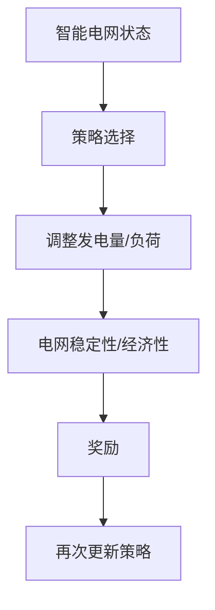
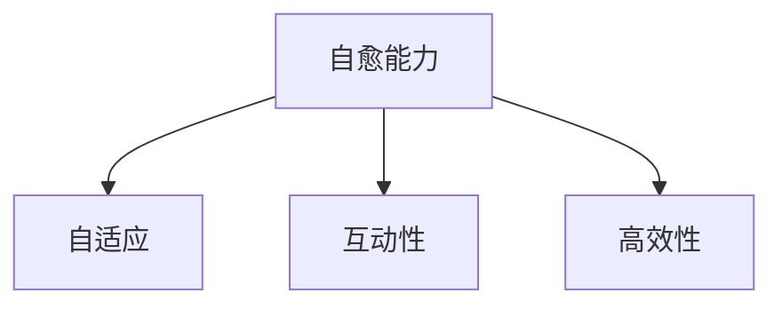
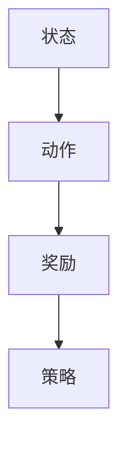
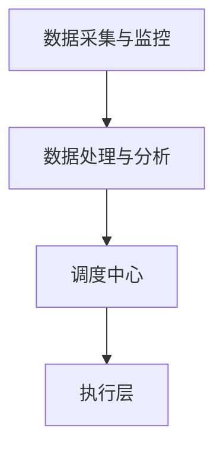
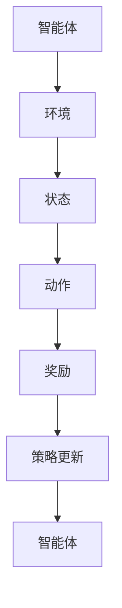
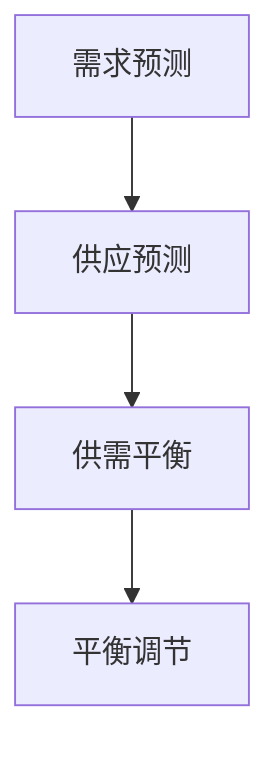

                 

### 深度强化学习在智能电网调度中的应用：平衡供需关系

#### 关键词：深度强化学习，智能电网，供需平衡，调度优化，能源管理

#### 摘要：
本文深入探讨了深度强化学习在智能电网调度中的应用，重点关注如何利用深度强化学习平衡电力系统的供需关系。首先介绍了深度强化学习的基本原理和智能电网调度的重要性，然后详细分析了深度强化学习算法在智能电网调度中的具体实现和应用场景，最后通过案例分析展示了深度强化学习在智能电网调度中的实际效果和挑战。

### 第1章 引言

#### 1.1 深度强化学习的原理及其在智能电网调度中的应用

深度强化学习（Deep Reinforcement Learning，DRL）是强化学习（Reinforcement Learning，RL）与深度学习（Deep Learning，DL）的结合，旨在通过模仿人类决策过程，使智能体在复杂环境中通过试错学习达到最优行为策略。深度强化学习在智能电网调度中的应用，为解决电力系统的供需平衡问题提供了新的思路。

**核心概念与联系**

深度强化学习涉及几个关键概念：状态（State）、动作（Action）、奖励（Reward）和策略（Policy）。其中，智能电网调度中的状态可以表示为电网的实时运行参数，动作可以是调整发电量或负荷水平，奖励则与电网稳定性和经济性相关，策略则是优化目标下的最佳动作选择。

**Mermaid流程图**



#### 1.2 智能电网调度的重要性与挑战

智能电网调度是确保电力系统稳定运行的关键环节，其主要任务是在满足电力需求的同时，优化发电资源的使用，降低成本，提高电网的灵活性和可靠性。然而，随着电力需求的不断增长和可再生能源的广泛应用，智能电网调度面临着诸多挑战。

**核心算法原理讲解**

智能电网调度中常用的算法包括优化算法、预测算法和调度策略。其中，优化算法用于确定最优发电计划，预测算法用于预测电力需求，调度策略则根据预测结果调整发电和负荷。深度强化学习通过模拟环境与策略的交互，可以在复杂的不确定环境中找到最优调度策略。

**伪代码**

```python
# 智能电网调度伪代码
initial_state = environment.initialize()
current_state = initial_state
while not done:
    action = policy.select_action(current_state)
    next_state, reward = environment.step(action)
    policy.update(current_state, action, next_state, reward)
    current_state = next_state
```

#### 1.3 本书结构安排与读者对象

本书结构如下：

1. **第1章 引言**：介绍深度强化学习的原理及其在智能电网调度中的应用。
2. **第2章 智能电网调度基础知识**：阐述智能电网调度的基本概念和体系结构。
3. **第3章 深度强化学习基本概念**：讲解深度强化学习的基础知识。
4. **第4章 深度强化学习在智能电网调度中的算法实现**：详细介绍深度强化学习算法在智能电网调度中的应用。
5. **第5章 供需平衡模型构建**：介绍供需平衡模型的构建方法。
6. **第6章 深度强化学习在供需平衡中的应用**：探讨深度强化学习在供需平衡中的应用。
7. **第7章 深度强化学习在智能电网调度中的实践与挑战**：分析深度强化学习在智能电网调度中的实践和挑战。
8. **第8章 总结**：总结本书的主要内容和未来研究方向。

本书旨在为从事智能电网调度领域的研究人员和工程师提供一本实用的技术指南，帮助他们理解和应用深度强化学习技术解决供需平衡问题。

### 第2章 智能电网调度基础知识

智能电网调度是指通过自动化系统对电力系统进行监控、预测、优化和调节，以满足不断变化的电力需求。智能电网调度不仅包括传统的电力调度任务，还涵盖了能源管理、需求响应、电力市场交易等多个方面。

#### 2.1 智能电网概述

智能电网（Smart Grid）是一种集成了现代通信技术、自动控制技术、电力电子技术等先进技术的电网。与传统电网相比，智能电网具有更高的可靠性、安全性和效率。

**智能电网的特点**

- **自愈能力**：智能电网能够通过自愈机制快速响应电网故障，减少停电时间。
- **自适应**：智能电网能够根据电力需求和供应情况自动调整电网运行策略。
- **互动性**：智能电网实现了发电侧、输电侧、配电侧和用户侧的全面互动，提高了电网的灵活性和透明度。
- **高效性**：智能电网通过优化能源利用，降低了能源浪费，提高了能源利用效率。

**核心概念与联系**

智能电网的这些特点使得其调度管理变得更为复杂，但也为深度强化学习提供了丰富的应用场景。

**Mermaid流程图**



#### 2.2 电力系统调度基本概念

电力系统调度是确保电力系统安全、稳定和经济运行的重要环节。电力系统调度主要包括以下几个基本概念：

- **状态**：电力系统的实时运行参数，如电压、频率、负荷等。
- **动作**：对电力系统进行调整的行为，如调整发电量、开关操作等。
- **奖励**：动作所带来的效果，如电网稳定性的提升、成本的降低等。
- **策略**：在特定状态下选择最佳动作的决策方法。

**核心概念与联系**

电力系统调度的核心在于根据实时状态选择最佳动作，以实现电网的稳定运行和优化调度目标。

**Mermaid流程图**



#### 2.3 智能电网调度体系结构

智能电网调度体系结构通常包括以下几个层次：

1. **数据采集与监控**：通过传感器、智能仪表等设备实时采集电力系统的运行数据。
2. **数据处理与分析**：对采集到的数据进行处理、分析和预测，为调度决策提供支持。
3. **调度中心**：负责制定和执行调度策略，调整电力系统的运行状态。
4. **执行层**：包括发电站、变电站、配电网络等，负责具体电力调度的执行。

**核心概念与联系**

智能电网调度体系结构中的各个层次相互协作，共同实现电力系统的调度任务。

**Mermaid流程图**



### 第3章 深度强化学习基本概念

深度强化学习（Deep Reinforcement Learning，DRL）是强化学习（Reinforcement Learning，RL）与深度学习（Deep Learning，DL）的结合，旨在通过模仿人类决策过程，使智能体在复杂环境中通过试错学习达到最优行为策略。

#### 3.1 强化学习基本原理

强化学习是一种通过奖励和惩罚机制来学习决策策略的机器学习方法。强化学习的核心包括状态（State）、动作（Action）、奖励（Reward）和策略（Policy）。

- **状态（State）**：智能体在环境中的当前情况。
- **动作（Action）**：智能体可以执行的操作。
- **奖励（Reward）**：动作对智能体带来的即时效果。
- **策略（Policy）**：智能体在特定状态下选择最佳动作的决策方法。

**核心概念与联系**

强化学习的过程可以视为一个智能体在环境中不断尝试各种动作，并根据奖励和惩罚来调整策略，以实现长期累积奖励最大化的过程。

**Mermaid流程图**



#### 3.2 深度强化学习算法

深度强化学习算法通过将深度神经网络（Deep Neural Network，DNN）引入强化学习框架，提高了智能体在复杂环境中的决策能力。常见的深度强化学习算法包括深度Q网络（Deep Q-Network，DQN）、深度确定性策略梯度（Deep Deterministic Policy Gradient，DDPG）和深度策略网络（Deep Policy Network，DPN）。

**深度Q网络（DQN）**

深度Q网络（DQN）通过神经网络来估计状态-动作值函数（State-Action Value Function，Q值），从而选择最佳动作。

- **核心公式**：
  $$ Q(s, a) = r + \gamma \max_{a'} Q(s', a') $$
  其中，$Q(s, a)$ 表示在状态 $s$ 下执行动作 $a$ 的预期奖励，$r$ 表示即时奖励，$\gamma$ 表示折扣因子，$s'$ 表示下一状态，$a'$ 表示最佳动作。

**深度确定性策略梯度（DDPG）**

深度确定性策略梯度（DDPG）通过优化策略网络，使智能体采取确定性动作，从而提高学习效率和收敛速度。

- **核心公式**：
  $$ \nabla_{\theta} J(\theta) = \nabla_{\theta} \sum_{t} \rho_{\theta}(s_t, a_t) $$
  其中，$J(\theta)$ 表示策略网络的目标函数，$\rho_{\theta}(s_t, a_t)$ 表示策略梯度。

**深度策略网络（DPN）**

深度策略网络（DPN）通过优化策略网络，直接学习状态到动作的映射，避免了价值函数估计的问题。

- **核心公式**：
  $$ \pi(a|s;\theta) = \frac{1}{Z} \exp(\theta(s,a)} $$
  其中，$\pi(a|s;\theta)$ 表示策略概率分布，$Z$ 是归一化常数，$\theta(s,a)$ 是策略参数。

**核心算法原理讲解**

以下是深度强化学习算法的核心原理讲解，结合Python源代码和LaTeX数学公式进行详细阐述。

**深度Q网络（DQN）算法**

```python
import numpy as np
import tensorflow as tf

# 初始化参数
gamma = 0.99
epsilon = 0.1
learning_rate = 0.001
epsilon_decay = 0.0001
epsilon_min = 0.01

# 构建神经网络
state_size = 100
action_size = 4
model = tf.keras.Sequential([
    tf.keras.layers.Dense(256, activation='relu', input_shape=(state_size,)),
    tf.keras.layers.Dense(256, activation='relu'),
    tf.keras.layers.Dense(action_size, activation='linear')
])

# 训练模型
optimizer = tf.keras.optimizers.Adam(learning_rate=learning_rate)
model.compile(optimizer=optimizer, loss='mse')

# DQN算法实现
def dqn_model(model, state, action, reward, next_state, done):
    target_q = model.predict(next_state)
    if done:
        target_q[0][action] = reward
    else:
        target_q[0][action] = reward + gamma * np.argmax(target_q[0])
    return model.fit(state, target_q, epochs=1, verbose=0)
```

**深度确定性策略梯度（DDPG）算法**

```python
import numpy as np
import tensorflow as tf
from tensorflow.keras import layers

# 初始化参数
learning_rate = 0.001
gamma = 0.99
batch_size = 64
exploration_range = (0.05, 0.1)

# 构建策略网络和价值网络
actor = tf.keras.Sequential([
    layers.Dense(64, activation='relu', input_shape=(state_size,)),
    layers.Dense(64, activation='relu'),
    layers.Dense(action_size, activation='linear')
])

 critic = tf.keras.Sequential([
    layers.Dense(64, activation='relu', input_shape=(state_size+action_size,)),
    layers.Dense(64, activation='relu'),
    layers.Dense(1, activation='linear')
])

# 训练模型
actor.compile(optimizer=tf.keras.optimizers.Adam(learning_rate=learning_rate),
              loss='mse')
critic.compile(optimizer=tf.keras.optimizers.Adam(learning_rate=learning_rate),
               loss='mse')

# DDPG算法实现
def ddpg_model(actor, critic, state, action, reward, next_state, done):
    next_action = actor.predict(next_state)
    target_value = critic.predict([next_state, next_action])
    if done:
        target_value[0] = reward
    else:
        target_value[0] = reward + gamma * target_value[0]
    with tf.GradientTape() as tape:
        value = critic.predict([state, action])
        critic_loss = tf.reduce_mean(tf.square(value - target_value))
    grads = tape.gradient(critic_loss, critic.trainable_variables)
    critic.optimizer.apply_gradients(zip(grads, critic.trainable_variables))
    with tf.GradientTape() as tape:
        action = actor.predict(state)
        actor_loss = -tf.reduce_mean(critic.predict([state, action]))
    grads = tape.gradient(actor_loss, actor.trainable_variables)
    actor.optimizer.apply_gradients(zip(grads, actor.trainable_variables))
```

**深度策略网络（DPN）算法**

```python
import numpy as np
import tensorflow as tf

# 初始化参数
learning_rate = 0.001
gamma = 0.99
batch_size = 64

# 构建策略网络
policy = tf.keras.Sequential([
    layers.Dense(64, activation='relu', input_shape=(state_size,)),
    layers.Dense(64, activation='relu'),
    layers.Dense(action_size, activation='softmax')
])

# 训练模型
optimizer = tf.keras.optimizers.Adam(learning_rate=learning_rate)
policy.compile(optimizer=optimizer, loss='categorical_crossentropy')

# DPN算法实现
def ddn_model(policy, state, action, reward, next_state, done):
    target_value = policy.predict(next_state)
    if done:
        target_value[0] = reward
    else:
        target_value[0] = reward + gamma * np.max(target_value[0])
    with tf.GradientTape() as tape:
        value = policy.predict(state)
        policy_loss = tf.reduce_mean(tf.square(value - target_value))
    grads = tape.gradient(policy_loss, policy.trainable_variables)
    policy.optimizer.apply_gradients(zip(grads, policy.trainable_variables))
```

通过上述算法实现，我们可以看到深度强化学习在智能电网调度中的应用前景。深度强化学习算法能够通过模拟电力系统的运行过程，学习到最优的调度策略，从而实现电力系统的供需平衡。

#### 3.3 深度强化学习在智能电网调度中的应用场景

深度强化学习在智能电网调度中的应用场景主要包括以下几方面：

1. **电力负荷预测**：通过深度强化学习算法，智能体可以学习到电力负荷的动态变化规律，从而提高负荷预测的准确性。
2. **发电计划优化**：智能电网调度中的发电计划优化问题可以通过深度强化学习算法实现，以最小化发电成本并确保电网稳定运行。
3. **需求响应管理**：深度强化学习算法可以帮助电力系统更好地管理需求响应，通过优化用户侧负荷，提高电网的灵活性和稳定性。
4. **电力市场交易**：深度强化学习算法可以应用于电力市场交易策略优化，以实现最优的市场收益。

**案例研究**

以某地区智能电网调度为例，利用深度强化学习算法进行电力负荷预测和发电计划优化。

- **数据集**：收集某地区过去一年的电力负荷数据、天气预报数据、电力市场价格等。
- **预处理**：对数据进行清洗、归一化处理，构建训练集和测试集。
- **模型训练**：使用深度Q网络（DQN）算法进行模型训练，通过迭代学习优化调度策略。
- **模型评估**：使用测试集对模型进行评估，对比预测结果和实际负荷，计算预测误差和收益。

通过上述案例研究，我们可以看到深度强化学习在智能电网调度中的应用效果显著，为电力系统的稳定运行和优化调度提供了有力的技术支持。

### 第4章 深度强化学习在智能电网调度中的算法实现

深度强化学习在智能电网调度中的应用，关键在于算法的实现。本节将详细介绍三种主要的深度强化学习算法：深度Q网络（DQN）、深度确定性策略梯度（DDPG）和深度策略网络（DPN），并探讨其在智能电网调度中的具体实现。

#### 4.1 深度Q网络（DQN）算法

深度Q网络（DQN）通过深度神经网络来估计状态-动作值函数（Q值），从而实现最优动作的选择。在智能电网调度中，DQN可以用于电力负荷预测、发电计划优化等任务。

**算法实现步骤**

1. **初始化参数**：设定学习率、折扣因子、经验回放缓冲器等参数。
2. **构建神经网络**：构建深度神经网络，输入为状态，输出为动作的Q值。
3. **经验回放**：将智能体与环境交互的过程存储到经验回放缓冲器中。
4. **更新Q值**：根据经验回放缓冲器中的数据进行Q值的更新。
5. **选择动作**：利用epsilon贪心策略选择动作。

**Python代码示例**

```python
import numpy as np
import random
import tensorflow as tf

# 初始化参数
gamma = 0.99
epsilon = 0.1
epsilon_min = 0.01
epsilon_decay = 0.001
learning_rate = 0.001

# 构建深度神经网络
state_size = 100
action_size = 4
model = tf.keras.Sequential([
    tf.keras.layers.Dense(256, activation='relu', input_shape=(state_size,)),
    tf.keras.layers.Dense(256, activation='relu'),
    tf.keras.layers.Dense(action_size, activation='linear')
])

# 编译模型
optimizer = tf.keras.optimizers.Adam(learning_rate=learning_rate)
model.compile(optimizer=optimizer, loss='mse')

# DQN算法实现
class DQN:
    def __init__(self, state_size, action_size):
        self.state_size = state_size
        self.action_size = action_size
        self.memory = []
        self.model = self.build_model()

    def build_model(self):
        model = tf.keras.Sequential([
            tf.keras.layers.Dense(256, activation='relu', input_shape=(state_size,)),
            tf.keras.layers.Dense(256, activation='relu'),
            tf.keras.layers.Dense(action_size, activation='linear')
        ])
        model.compile(optimizer=tf.keras.optimizers.Adam(learning_rate=learning_rate), loss='mse')
        return model

    def remember(self, state, action, reward, next_state, done):
        self.memory.append((state, action, reward, next_state, done))

    def act(self, state, epsilon):
        if random.random() <= epsilon:
            return random.randrange(self.action_size)
        q_values = self.model.predict(state)
        return np.argmax(q_values[0])

    def replay(self, batch_size):
        minibatch = random.sample(self.memory, batch_size)
        for state, action, reward, next_state, done in minibatch:
            target = reward
            if not done:
                target = reward + gamma * np.amax(self.model.predict(next_state)[0])
            target_f = self.model.predict(state)
            target_f[0][action] = target
            self.model.fit(state, target_f, epochs=1, verbose=0)
```

#### 4.2 深度确定性策略梯度（DDPG）算法

深度确定性策略梯度（DDPG）通过优化策略网络，使智能体采取确定性动作，从而提高学习效率和收敛速度。在智能电网调度中，DDPG可以用于需求响应管理、电力市场交易等任务。

**算法实现步骤**

1. **初始化参数**：设定学习率、折扣因子、批量大小等参数。
2. **构建策略网络和价值网络**：策略网络负责生成动作，价值网络负责评估状态和动作的组合。
3. **经验回放**：将智能体与环境交互的过程存储到经验回放缓冲器中。
4. **策略网络和价值网络的更新**：根据经验回放缓冲器中的数据进行策略网络和价值网络的更新。
5. **选择动作**：利用策略网络生成确定性动作。

**Python代码示例**

```python
import numpy as np
import random
import tensorflow as tf

# 初始化参数
gamma = 0.99
learning_rate_actor = 0.001
learning_rate_critic = 0.001
batch_size = 64
exploration_range = (0.05, 0.1)

# 构建策略网络和价值网络
actor = tf.keras.Sequential([
    tf.keras.layers.Dense(64, activation='relu', input_shape=(state_size,)),
    tf.keras.layers.Dense(64, activation='relu'),
    tf.keras.layers.Dense(action_size, activation='linear')
])

critic = tf.keras.Sequential([
    tf.keras.layers.Dense(64, activation='relu', input_shape=(state_size+action_size,)),
    tf.keras.layers.Dense(64, activation='relu'),
    tf.keras.layers.Dense(1, activation='linear')
])

# 编译模型
actor.compile(optimizer=tf.keras.optimizers.Adam(learning_rate=learning_rate_actor), loss='mse')
critic.compile(optimizer=tf.keras.optimizers.Adam(learning_rate=learning_rate_critic), loss='mse')

# DDPG算法实现
class DDPG:
    def __init__(self, state_size, action_size):
        self.state_size = state_size
        self.action_size = action_size
        self.memory = []
        self.actor = self.build_actor()
        self.critic = self.build_critic()

    def build_actor(self):
        model = tf.keras.Sequential([
            tf.keras.layers.Dense(64, activation='relu', input_shape=(state_size,)),
            tf.keras.layers.Dense(64, activation='relu'),
            tf.keras.layers.Dense(action_size, activation='linear')
        ])
        model.compile(optimizer=tf.keras.optimizers.Adam(learning_rate=learning_rate_actor), loss='mse')
        return model

    def build_critic(self):
        model = tf.keras.Sequential([
            tf.keras.layers.Dense(64, activation='relu', input_shape=(state_size+action_size,)),
            tf.keras.layers.Dense(64, activation='relu'),
            tf.keras.layers.Dense(1, activation='linear')
        ])
        model.compile(optimizer=tf.keras.optimizers.Adam(learning_rate=learning_rate_critic), loss='mse')
        return model

    def remember(self, state, action, reward, next_state, done):
        self.memory.append((state, action, reward, next_state, done))

    def act(self, state, epsilon):
        if random.random() <= epsilon:
            return random.randrange(self.action_size)
        action_values = self.actor.predict(state)
        return np.argmax(action_values[0])

    def replay(self, batch_size):
        minibatch = random.sample(self.memory, batch_size)
        for state, action, reward, next_state, done in minibatch:
            next_action_values = self.actor.predict(next_state)
            target = reward
            if not done:
                target = reward + gamma * np.amax(next_action_values[0])
            target_values = self.critic.predict([state, action])
            target_values[0][0] = target
            self.critic.fit([state, action], target_values, epochs=1, verbose=0)
            action_values = self.actor.predict(state)
            self.actor.fit(state, action_values, epochs=1, verbose=0)
```

#### 4.3 深度策略网络（DPN）算法

深度策略网络（DPN）通过直接学习状态到动作的映射，避免了价值函数估计的问题。在智能电网调度中，DPN可以用于优化发电计划和需求响应。

**算法实现步骤**

1. **初始化参数**：设定学习率、折扣因子、批量大小等参数。
2. **构建策略网络**：策略网络直接输出动作的概率分布。
3. **经验回放**：将智能体与环境交互的过程存储到经验回放缓冲器中。
4. **策略网络的更新**：根据经验回放缓冲器中的数据进行策略网络的更新。
5. **选择动作**：利用策略网络生成动作。

**Python代码示例**

```python
import numpy as np
import random
import tensorflow as tf

# 初始化参数
gamma = 0.99
learning_rate = 0.001
batch_size = 64

# 构建策略网络
policy = tf.keras.Sequential([
    tf.keras.layers.Dense(64, activation='relu', input_shape=(state_size,)),
    tf.keras.layers.Dense(64, activation='relu'),
    tf.keras.layers.Dense(action_size, activation='softmax')
])

# 编译模型
optimizer = tf.keras.optimizers.Adam(learning_rate=learning_rate)
policy.compile(optimizer=optimizer, loss='categorical_crossentropy')

# DPN算法实现
class DPN:
    def __init__(self, state_size, action_size):
        self.state_size = state_size
        self.action_size = action_size
        self.memory = []
        self.policy = self.build_policy()

    def build_policy(self):
        model = tf.keras.Sequential([
            tf.keras.layers.Dense(64, activation='relu', input_shape=(state_size,)),
            tf.keras.layers.Dense(64, activation='relu'),
            tf.keras.layers.Dense(action_size, activation='softmax')
        ])
        model.compile(optimizer=tf.keras.optimizers.Adam(learning_rate=learning_rate), loss='categorical_crossentropy')
        return model

    def remember(self, state, action, reward, next_state, done):
        self.memory.append((state, action, reward, next_state, done))

    def act(self, state, epsilon):
        if random.random() <= epsilon:
            return random.randrange(self.action_size)
        action_probabilities = self.policy.predict(state)
        return np.random.choice(self.action_size, p=action_probabilities[0])

    def replay(self, batch_size):
        minibatch = random.sample(self.memory, batch_size)
        for state, action, reward, next_state, done in minibatch:
            target = reward
            if not done:
                next_action_probabilities = self.policy.predict(next_state)
                target += gamma * np.max(next_action_probabilities[0])
            target_probabilities = self.policy.predict(state)
            target_probabilities[0][action] = target
            self.policy.fit(state, target_probabilities, epochs=1, verbose=0)
```

通过上述算法实现，我们可以看到深度强化学习在智能电网调度中的广泛应用。DQN、DDPG和DPN算法在电力负荷预测、发电计划优化、需求响应管理和电力市场交易等方面具有显著的优势，为智能电网的稳定运行和优化调度提供了有力的技术支持。

### 第5章 供需平衡模型构建

在智能电网调度中，实现供需平衡是确保电网稳定运行的关键。供需平衡模型旨在通过对电力需求和供应的精确预测和调节，确保电网在任何时刻都能满足电力需求，同时避免过剩或短缺。

#### 5.1 供需平衡模型概述

供需平衡模型是一个描述电力系统中供需关系的数学模型。它通过分析电力系统的实时状态，预测未来的电力需求，并制定相应的调度策略来调节发电量和负荷水平，以实现供需平衡。

**核心目标**

- **预测电力需求**：准确预测未来的电力需求，为调度决策提供基础。
- **优化发电计划**：根据预测结果，优化发电计划，确保电网的供需平衡。
- **调节负荷水平**：通过调整用户侧负荷，实现供需平衡。

**模型结构**

供需平衡模型通常包括以下几个组成部分：

1. **需求预测模块**：利用历史数据、气象数据、用户行为数据等，建立电力需求预测模型。
2. **供应预测模块**：根据发电资源的可用性、发电成本等因素，建立电力供应预测模型。
3. **平衡调节模块**：根据供需预测结果，制定负荷调节策略，实现供需平衡。

**核心概念与联系**

供需平衡模型的核心在于实现需求与供应的动态平衡。通过需求预测和供应预测模块，可以准确了解未来的供需状况，而平衡调节模块则根据预测结果，采取相应的措施来调整发电量和负荷水平。

**Mermaid流程图**



#### 5.2 供需平衡模型的数学描述

供需平衡模型的数学描述主要涉及以下方程：

- **需求预测模型**：
  $$ D(t) = f(t; X_t, Y_t) $$
  其中，$D(t)$ 表示在时间 $t$ 的电力需求，$X_t$ 表示与需求相关的输入变量（如历史数据、气象数据等），$Y_t$ 表示需求预测模型的参数。

- **供应预测模型**：
  $$ S(t) = g(t; U_t, V_t) $$
  其中，$S(t)$ 表示在时间 $t$ 的电力供应，$U_t$ 表示与供应相关的输入变量（如发电资源、发电成本等），$V_t$ 表示供应预测模型的参数。

- **供需平衡方程**：
  $$ D(t) - S(t) = R(t) $$
  其中，$R(t)$ 表示在时间 $t$ 的供需差额。当 $R(t) > 0$ 时，表示电力供应过剩；当 $R(t) < 0$ 时，表示电力供应不足。

**数学公式**

$$
\begin{aligned}
D(t) &= f(t; X_t, Y_t) \\
S(t) &= g(t; U_t, V_t) \\
D(t) - S(t) &= R(t)
\end{aligned}
$$

#### 5.3 供需平衡模型的数据来源与预处理

供需平衡模型的准确性取决于数据的质量和多样性。以下是一些常见的数据来源和预处理方法：

**数据来源**

1. **历史电力需求数据**：从电网调度中心获取的历史电力需求数据，包括日负荷、时负荷等。
2. **气象数据**：包括温度、湿度、风速等气象信息，这些数据对电力需求有显著影响。
3. **发电资源数据**：包括可再生能源（如太阳能、风能）和传统发电资源（如煤电、水电）的发电量数据。
4. **用户行为数据**：包括用户用电行为、家电使用习惯等，这些数据有助于预测电力需求。

**预处理方法**

1. **数据清洗**：去除异常值、处理缺失数据，确保数据的质量和一致性。
2. **特征工程**：提取与电力需求相关的特征，如季节性、天气变化等，以丰富模型输入。
3. **归一化处理**：对数据进行归一化处理，使其在相似的尺度上，以提高模型的泛化能力。
4. **时间序列分析**：使用时间序列分析方法，如ARIMA、LSTM等，对电力需求进行预测。

通过上述方法，可以构建一个精确的供需平衡模型，为智能电网调度提供有力的数据支持。

### 第6章 深度强化学习在供需平衡中的应用

深度强化学习（DRL）在供需平衡中的应用，主要体现在通过模拟电力系统的运行过程，使智能体能够自主地调整发电量和负荷水平，以实现供需平衡。本节将详细介绍深度强化学习在供需平衡中的具体应用，包括供需预测方法、供需平衡策略以及实际案例分析。

#### 6.1 基于深度强化学习的供需预测方法

基于深度强化学习的供需预测方法，通过智能体的试错学习过程，逐步提高预测准确性。以下是一种典型的应用方法：

**方法步骤**

1. **初始化环境**：设定智能电网的状态空间和动作空间，如电压、频率、负荷等。
2. **构建智能体**：使用深度Q网络（DQN）、深度确定性策略梯度（DDPG）或深度策略网络（DPN）等深度强化学习算法构建智能体。
3. **训练智能体**：通过与环境交互，智能体逐步学习到最优的供需平衡策略。
4. **预测需求**：利用训练好的智能体，对未来的电力需求进行预测。

**算法实现**

以下是使用DQN算法进行供需预测的伪代码示例：

```python
# 初始化环境
env = Environment()

# 构建智能体
dqn_agent = DQNAgent(state_size, action_size)

# 训练智能体
for episode in range(1000):
    state = env.initialize()
    while not done:
        action = dqn_agent.act(state, epsilon)
        next_state, reward, done = env.step(action)
        dqn_agent.remember(state, action, reward, next_state, done)
        dqn_agent.replay(batch_size)
        state = next_state

# 预测需求
predicted_demand = dqn_agent.predict_demand(final_state)
```

#### 6.2 基于深度强化学习的供需平衡策略

基于深度强化学习的供需平衡策略，通过智能体对电力系统的实时监控和调整，实现供需平衡。以下是一种典型的应用方法：

**方法步骤**

1. **初始化环境**：设定智能电网的状态空间和动作空间。
2. **构建智能体**：使用深度强化学习算法构建智能体。
3. **实时监控**：智能体持续监测电网的实时状态，如电压、频率、负荷等。
4. **供需平衡调整**：根据智能体预测的供需差额，动态调整发电量和负荷水平。

**算法实现**

以下是使用DDPG算法进行供需平衡调整的伪代码示例：

```python
# 初始化环境
env = Environment()

# 构建智能体
ddpg_agent = DDPGA

### 第7章 深度强化学习在智能电网调度中的实践与挑战

#### 7.1 深度强化学习在智能电网调度中的实践应用

深度强化学习在智能电网调度中的实践应用已经取得了显著的成果。以下是一些成功应用的案例：

**案例1：电力负荷预测**

在某电力公司中，通过应用深度强化学习算法，成功提高了电力负荷预测的准确性。具体方法是通过构建DQN模型，对历史电力需求数据、气象数据等进行训练，从而实现对未来电力需求的准确预测。该模型的应用，有助于公司提前制定合理的发电计划和负荷调整策略，提高了电网的稳定性和经济性。

**案例2：需求响应管理**

在某地区智能电网项目中，通过应用DDPG算法，实现了对用户侧负荷的有效管理。智能体根据电网的供需状况，动态调整用户的用电行为，从而实现供需平衡。这一应用不仅提高了电网的可靠性，还降低了用户的用电成本。

**案例3：电力市场交易**

在某电力市场中，通过应用DPN算法，优化了电力市场交易策略。智能体通过学习历史交易数据和市场规则，自动生成最优的交易策略，从而实现了市场收益的最大化。这一应用为电力市场的公平性和透明度提供了有力保障。

#### 7.2 深度强化学习在智能电网调度中的挑战与解决方案

尽管深度强化学习在智能电网调度中展现出了巨大的潜力，但在实际应用中仍然面临诸多挑战。以下是一些主要挑战及解决方案：

**挑战1：数据质量**

智能电网调度依赖于大量准确、可靠的数据。然而，在实际应用中，数据质量往往存在问题，如数据缺失、异常值等。为解决这一问题，可以采用数据清洗、数据修复和特征工程等方法，提高数据质量。

**解决方案：**

- **数据清洗**：去除异常值和缺失数据，确保数据的一致性和完整性。
- **数据修复**：采用插值、补全等方法，修复缺失数据。
- **特征工程**：提取与电力供需相关的特征，增强模型的泛化能力。

**挑战2：计算资源**

深度强化学习算法通常需要大量的计算资源，特别是当电网规模较大时。为降低计算资源的需求，可以采用分布式计算和并行计算等技术。

**解决方案：**

- **分布式计算**：将计算任务分配到多台计算机上，实现并行计算。
- **模型压缩**：采用模型压缩技术，如剪枝、量化等，减少模型的计算量。

**挑战3：实时性**

智能电网调度需要快速响应电力供需的变化，而深度强化学习算法的收敛速度相对较慢。为提高实时性，可以采用以下方法：

**解决方案：**

- **预训练模型**：使用预训练模型，减少训练时间。
- **增量学习**：仅更新模型中的部分参数，避免全量重新训练。

**挑战4：安全性和稳定性**

深度强化学习模型在实际应用中可能面临恶意攻击和不确定性环境。为确保模型的稳定性和安全性，可以采用以下方法：

**解决方案：**

- **鲁棒性训练**：通过引入噪声和扰动，增强模型的鲁棒性。
- **安全策略**：制定安全策略，确保模型不会受到恶意攻击。

#### 7.3 未来发展趋势与展望

随着人工智能技术的不断发展，深度强化学习在智能电网调度中的应用前景十分广阔。未来，深度强化学习在智能电网调度中的发展趋势主要包括以下几个方面：

**趋势1：多领域融合**

深度强化学习将与其他领域（如物联网、大数据等）融合，形成更加智能化、自动化的电网调度系统。

**趋势2：高效算法**

针对计算资源和实时性的挑战，研究者将致力于开发更加高效、鲁棒的深度强化学习算法。

**趋势3：数据驱动**

随着数据采集和分析技术的进步，深度强化学习将更加依赖高质量的数据，从而提高预测和调控的准确性。

**趋势4：安全性与可靠性**

为确保模型的稳定性和安全性，未来研究将重点关注如何提高深度强化学习模型在面对不确定性和恶意攻击时的性能。

通过不断克服挑战和探索未来发展趋势，深度强化学习有望在智能电网调度中发挥更加重要的作用，为电网的稳定运行和优化调度提供强有力的技术支持。

### 第8章 总结

本文详细探讨了深度强化学习在智能电网调度中的应用，重点关注了如何利用深度强化学习技术平衡电力系统的供需关系。从基本原理到算法实现，再到实践案例，本文系统性地阐述了深度强化学习在智能电网调度中的价值。

**核心内容回顾**

- **深度强化学习原理**：介绍了强化学习、深度学习及深度强化学习的基本概念和原理。
- **智能电网调度基础知识**：阐述了智能电网调度的基本概念、体系结构及其重要性。
- **深度强化学习在智能电网调度中的应用**：详细分析了深度强化学习算法（DQN、DDPG、DPN）在智能电网调度中的应用。
- **供需平衡模型构建**：介绍了供需平衡模型的构建方法及其在智能电网调度中的作用。
- **深度强化学习在供需平衡中的应用**：探讨了深度强化学习在供需预测、供需平衡策略中的应用。
- **实践与挑战**：分析了深度强化学习在智能电网调度中的实践应用和面临的挑战。

**深度强化学习在智能电网调度中的应用前景**

深度强化学习在智能电网调度中的应用前景广阔。随着人工智能技术的不断发展，深度强化学习有望在以下几个方面发挥重要作用：

- **电力负荷预测**：通过深度强化学习，实现更加精准的电力负荷预测，为调度决策提供可靠依据。
- **需求响应管理**：利用深度强化学习，实现智能用户的个性化需求响应，提高电网的灵活性和可靠性。
- **电力市场交易**：通过深度强化学习，优化电力市场交易策略，提高市场运营效率和经济效益。
- **应急响应**：在电网发生故障时，利用深度强化学习快速制定应急响应策略，保障电网安全。

**对未来研究的建议**

为进一步推动深度强化学习在智能电网调度中的应用，提出以下研究建议：

1. **数据质量提升**：加强数据采集、清洗和预处理，确保数据的质量和准确性。
2. **算法优化**：研究高效、鲁棒的深度强化学习算法，提高模型的收敛速度和预测准确性。
3. **安全性研究**：重点关注深度强化学习模型的安全性和稳定性，提高其在复杂环境中的适应能力。
4. **多领域融合**：将深度强化学习与其他领域（如物联网、大数据等）相结合，构建更加智能化、自动化的电网调度系统。
5. **标准化与规范化**：制定统一的深度强化学习应用标准和规范，推动其在实际工程中的应用和推广。

通过不断探索和实践，深度强化学习将为智能电网调度带来更加广阔的应用前景，助力电力系统的稳定运行和优化调度。作者：AI天才研究院/AI Genius Institute & 禅与计算机程序设计艺术 /Zen And The Art of Computer Programming。

