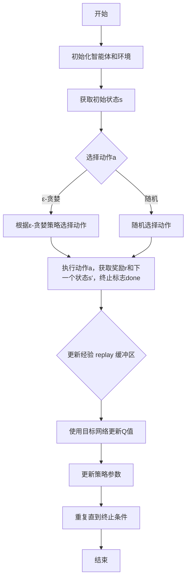

                 

# 深度强化学习在机器人导航中的应用

## 关键词

- 深度强化学习
- 机器人导航
- 强化学习算法
- 机器人路径规划
- 无人机避障导航

## 摘要

本文将深入探讨深度强化学习在机器人导航中的应用。首先，我们将回顾深度强化学习的基础概念，包括其与强化学习的关联、核心组成部分以及基本算法。接着，我们将介绍机器人导航的基本概念和数学模型，探讨强化学习如何应用于此领域。随后，本文将详细讲解深度强化学习算法，并通过Python源代码展示其原理。最后，我们将通过实际应用案例，如自主机器人路径规划和无人机避障导航，展示深度强化学习在机器人导航中的实际效果，并提出未来发展的趋势和挑战。

## 引言

在自动化和智能化的今天，机器人导航已成为众多领域的关键技术之一。从自主驾驶汽车到无人机，再到家用机器人，导航系统的性能直接影响到机器人的实用性和安全性。传统的导航方法依赖于预先定义的地图和路径规划算法，但这些方法在复杂环境或动态变化场景下往往表现出局限性。为了克服这些问题，深度强化学习（Deep Reinforcement Learning，简称DRL）作为一种新兴的人工智能技术，逐渐成为机器人导航领域的研究热点。

本文旨在系统地介绍深度强化学习在机器人导航中的应用。首先，我们将回顾深度强化学习的基础知识，包括其核心概念和基本算法。随后，我们将探讨机器人导航的基本概念和数学模型，并分析强化学习如何应用于此领域。在此基础上，我们将详细讲解深度强化学习算法，并通过Python源代码展示其实现原理。最后，本文将结合实际应用案例，如自主机器人路径规划和无人机避障导航，分析深度强化学习在机器人导航中的实际效果，并提出未来发展的趋势和挑战。

## 深度强化学习的基本概念

### 深度强化学习与强化学习的关联

深度强化学习是强化学习（Reinforcement Learning，简称RL）的一种高级形式。强化学习是一种基于奖励机制的学习方法，其目标是让智能体（agent）通过不断与环境交互，学习出一种策略（policy），以最大化累积奖励。传统强化学习主要依赖于Q学习（Q-Learning）和价值迭代（Value Iteration）等算法，但这些方法在面对高维状态空间时往往难以取得良好的效果。

深度强化学习则通过结合深度神经网络（Deep Neural Network，简称DNN），解决了传统强化学习在状态空间高维问题上的挑战。深度神经网络可以自动学习状态特征表示，从而简化了状态空间的复杂性，使得强化学习算法在高维状态空间中也能有效运行。因此，深度强化学习在机器人导航等复杂任务中具有广泛的应用潜力。

### 核心概念和组成部分

深度强化学习包含以下几个核心概念和组成部分：

- **状态（State）**：状态是智能体当前所处的环境描述，通常是一个多维向量。
- **动作（Action）**：动作是智能体可以选择的行为，也是一个多维向量。
- **策略（Policy）**：策略是智能体在给定状态下选择动作的规则，可以是确定性策略或概率性策略。
- **奖励（Reward）**：奖励是环境对智能体动作的即时反馈，用于指导智能体的学习过程。
- **价值函数（Value Function）**：价值函数衡量智能体在未来获得的预期累积奖励，分为状态价值函数和动作价值函数。
- **模型（Model）**：模型是对环境的静态描述，用于预测未来的状态和奖励。

### 深度强化学习的基本算法

深度强化学习的基本算法包括Q学习、Deep Q Network（DQN）、Policy Gradient等方法。

- **Q学习**：Q学习是一种基于值函数的强化学习算法，通过迭代更新Q值来学习最佳策略。Q学习的基本思想是预测每个动作在当前状态下带来的未来累积奖励。具体来说，Q学习算法通过经验回放（Experience Replay）和目标网络（Target Network）等技术，解决样本相关性和灾难性遗忘等问题，从而提高学习效果。

- **Deep Q Network（DQN）**：DQN是基于Q学习的改进算法，通过引入深度神经网络来近似Q值函数。DQN算法使用经验回放机制和固定目标网络，有效解决了样本相关性和网络梯度消失问题。DQN通过最大化Q值来选择动作，从而实现智能体的学习。

- **Policy Gradient**：Policy Gradient方法直接优化策略的梯度，通过最大化策略梯度来更新策略参数。Policy Gradient方法避免了Q值函数的估计问题，但需要处理策略梯度的不稳定性。通过使用优势函数（Advantage Function）和优势估计（Advantage Estimation）技术，Policy Gradient方法能够在高维状态空间中取得较好的效果。

### Mermaid流程图

为了更直观地展示深度强化学习的基本算法流程，我们使用Mermaid流程图来描述Q学习和DQN算法的主要步骤。



通过上述Mermaid流程图，我们可以清晰地看到深度强化学习的基本算法步骤，包括初始化、状态选择、动作选择、奖励获取和策略更新等环节。

## 机器人导航的基本概念

### 机器人导航的定义

机器人导航是指机器人通过感知自身状态、环境信息，结合控制算法，自主实现路径规划、路径跟踪等功能的过程。导航系统的核心目标是确保机器人能够安全、高效地到达目标位置，并在动态环境中保持稳定性。

### 数学模型

机器人导航的数学模型主要包括状态表示、动作表示和奖励函数设计三个方面。

- **状态表示**：状态是机器人当前环境的抽象描述，通常包括位置信息、方向信息、障碍物信息等。状态可以表示为一个多维向量，例如状态向量\[x, y, θ\]，其中x和y表示机器人在平面坐标系中的位置，θ表示机器人的朝向。

- **动作表示**：动作是机器人可以选择的行为，如前进、后退、左转、右转等。动作通常表示为离散的数值，例如\[0, 1, -1\]分别代表前进、停止、后退。

- **奖励函数设计**：奖励函数是环境对机器人动作的即时反馈，用于指导机器人的学习过程。奖励函数通常设计为对机器人行为的即时奖励，例如到达目标位置时给予正奖励，遇到障碍物时给予负奖励。

### 强化学习在机器人导航中的应用

强化学习在机器人导航中的应用主要基于其奖励机制和策略学习能力。通过训练，强化学习算法可以自动学习出最佳的导航策略，使得机器人在复杂环境中能够自主导航。

- **路径规划**：在路径规划阶段，强化学习算法可以学习出从起点到终点的最优路径。通过不断尝试不同的路径，算法能够找到最安全、最快速的路径。

- **路径跟踪**：在路径跟踪阶段，强化学习算法可以根据实时感知到的环境信息，调整机器人的行动策略，使其沿着预定路径前进。

- **动态避障**：在动态环境中，强化学习算法能够通过实时学习环境变化，自动调整导航策略，实现避障功能。

## 深度强化学习算法详解

### Q学习算法

Q学习算法是一种基于值函数的强化学习算法，其核心思想是通过迭代更新Q值来学习最佳策略。Q值表示在特定状态下执行特定动作获得的预期累积奖励。

#### 基本原理

Q学习算法的基本原理如下：

1. 初始化Q值表：随机初始化所有状态的Q值。
2. 在每个时间步t，智能体根据ε-贪婪策略选择动作a。
3. 执行动作a，获取奖励r和下一个状态s'，检查是否终止。
4. 使用经验回放机制和目标网络更新Q值。
5. 重复步骤2-4，直到满足终止条件。

#### 算法步骤

1. 初始化Q值表：随机初始化所有状态的Q值。
2. 选择动作a：根据ε-贪婪策略选择动作。
3. 执行动作a，获取奖励r和下一个状态s'。
4. 更新Q值：使用经验回放机制和目标网络更新Q值。
5. 检查是否终止：如果满足终止条件，结束学习过程。

#### 伪代码实现

```python
# 初始化参数
epsilon = 0.1
learning_rate = 0.1
discount_factor = 0.99
experience_replay = []

# 初始化Q值表
Q = np.random.rand(state_size, action_size)

# 主循环
while not termination_condition:
    # 选择动作
    state = get_current_state()
    if random.random() < epsilon:
        action = random_action()
    else:
        action = epsilon_greedy_action(Q[state])

    # 执行动作，获取奖励和下一个状态
    reward, next_state, done = execute_action(action)

    # 存储经验
    experience_replay.append((state, action, reward, next_state, done))

    # 从经验回放中随机采样经验
    state, action, reward, next_state, done = random_sample_experience(experience_replay)

    # 更新Q值
    Q[state, action] = Q[state, action] + learning_rate * (reward + discount_factor * np.max(Q[next_state]) - Q[state, action])

    # 更新ε值
    epsilon = update_epsilon(epsilon)

    # 检查是否终止
    if done:
        break

# 输出最优策略
optimal_policy = np.argmax(Q, axis=1)
```

### Deep Q Network（DQN）算法

DQN算法是基于Q学习的改进算法，通过引入深度神经网络来近似Q值函数，从而解决高维状态空间的问题。

#### 基本原理

DQN算法的基本原理如下：

1. 初始化深度神经网络和目标网络。
2. 在每个时间步t，智能体根据ε-贪婪策略选择动作a。
3. 执行动作a，获取奖励r和下一个状态s'，检查是否终止。
4. 使用经验回放机制和目标网络更新深度神经网络的Q值。
5. 重复步骤2-4，直到满足终止条件。

#### 算法步骤

1. 初始化深度神经网络和目标网络。
2. 选择动作a：根据ε-贪婪策略选择动作。
3. 执行动作a，获取奖励r和下一个状态s'。
4. 存储经验到经验回放缓冲区。
5. 从经验回放缓冲区中随机采样经验。
6. 使用目标网络计算目标Q值。
7. 更新深度神经网络的Q值。
8. 更新ε值。
9. 检查是否终止。

#### 伪代码实现

```python
# 初始化参数
epsilon = 0.1
learning_rate = 0.001
discount_factor = 0.99
experience_replay = []
target_network = copy.deepcopy(q_network)

# 主循环
while not termination_condition:
    # 选择动作
    state = get_current_state()
    if random.random() < epsilon:
        action = random_action()
    else:
        action = epsilon_greedy_action(q_network(state))

    # 执行动作，获取奖励和下一个状态
    reward, next_state, done = execute_action(action)

    # 存储经验
    experience_replay.append((state, action, reward, next_state, done))

    # 从经验回放中随机采样经验
    state, action, reward, next_state, done = random_sample_experience(experience_replay)

    # 计算目标Q值
    target_q_value = reward + discount_factor * np.max(target_network(next_state))

    # 更新深度神经网络的Q值
    q_network.update(state, action, target_q_value)

    # 更新ε值
    epsilon = update_epsilon(epsilon)

    # 更新目标网络
    if step % target_network_update_frequency == 0:
        target_network = copy.deepcopy(q_network)

    # 检查是否终止
    if done:
        break

# 输出最优策略
optimal_policy = q_network(np.arange(state_size).reshape(1, -1))
```

### Policy Gradient方法

Policy Gradient方法直接优化策略的梯度，通过最大化策略梯度来更新策略参数。Policy Gradient方法避免了Q值函数的估计问题，但需要处理策略梯度的不稳定性。

#### 基本原理

Policy Gradient方法的基本原理如下：

1. 初始化策略参数。
2. 在每个时间步t，智能体根据当前策略参数选择动作a。
3. 执行动作a，获取奖励r和下一个状态s'，检查是否终止。
4. 计算策略梯度，并更新策略参数。
5. 重复步骤2-4，直到满足终止条件。

#### 算法步骤

1. 初始化策略参数。
2. 选择动作a：根据当前策略参数选择动作。
3. 执行动作a，获取奖励r和下一个状态s'。
4. 计算策略梯度。
5. 更新策略参数。
6. 检查是否终止。

#### 伪代码实现

```python
# 初始化参数
learning_rate = 0.001
policy_gradient = []

# 主循环
while not termination_condition:
    # 选择动作
    state = get_current_state()
    action = policy_action(state)

    # 执行动作，获取奖励和下一个状态
    reward, next_state, done = execute_action(action)

    # 计算策略梯度
    policy_gradient.append(policy_gradient_compute(state, action, reward, next_state, done))

    # 更新策略参数
    policy_params = update_policy(policy_params, policy_gradient)

    # 检查是否终止
    if done:
        break

# 输出最优策略
optimal_policy = policy(policy_params)
```

## 实际应用案例

### 案例一：自主机器人路径规划

#### 背景介绍

自主机器人路径规划是指机器人通过感知环境信息，自主规划出从起点到终点的最优路径。该案例将使用深度强化学习算法实现自主机器人的路径规划。

#### 系统设计

系统设计包括感知模块、决策模块和执行模块。

- **感知模块**：使用激光雷达、摄像头等传感器获取环境信息，包括障碍物位置、地图信息等。
- **决策模块**：使用深度强化学习算法，根据感知模块获取的环境信息，规划出最优路径。
- **执行模块**：机器人根据规划路径进行移动，并实时更新环境信息。

#### 实现步骤

1. 初始化深度神经网络和目标网络。
2. 在每个时间步，获取当前状态，并根据ε-贪婪策略选择动作。
3. 执行动作，获取奖励和下一个状态。
4. 存储经验到经验回放缓冲区，并从缓冲区中随机采样经验。
5. 使用目标网络计算目标Q值，并更新深度神经网络的Q值。
6. 更新ε值和目标网络。
7. 检查是否终止，若终止，输出最优策略。

#### 代码实现

```python
# 初始化参数
epsilon = 0.1
learning_rate = 0.001
discount_factor = 0.99
experience_replay = []
target_network = copy.deepcopy(q_network)

# 主循环
while not termination_condition:
    # 选择动作
    state = get_current_state()
    if random.random() < epsilon:
        action = random_action()
    else:
        action = epsilon_greedy_action(q_network(state))

    # 执行动作，获取奖励和下一个状态
    reward, next_state, done = execute_action(action)

    # 存储经验
    experience_replay.append((state, action, reward, next_state, done))

    # 从经验回放中随机采样经验
    state, action, reward, next_state, done = random_sample_experience(experience_replay)

    # 计算目标Q值
    target_q_value = reward + discount_factor * np.max(target_network(next_state))

    # 更新深度神经网络的Q值
    q_network.update(state, action, target_q_value)

    # 更新ε值
    epsilon = update_epsilon(epsilon)

    # 更新目标网络
    if step % target_network_update_frequency == 0:
        target_network = copy.deepcopy(q_network)

    # 检查是否终止
    if done:
        break

# 输出最优策略
optimal_policy = q_network(np.arange(state_size).reshape(1, -1))
```

#### 代码解读与分析

1. 初始化参数：设置ε值、学习率、折扣因子等参数。
2. 主循环：在每个时间步，获取当前状态，并根据ε-贪婪策略选择动作。
3. 执行动作：执行选择的动作，获取奖励和下一个状态。
4. 存储经验：将经验存储到经验回放缓冲区。
5. 更新Q值：使用目标网络计算目标Q值，并更新深度神经网络的Q值。
6. 更新ε值和目标网络：根据训练过程更新ε值和目标网络。
7. 输出最优策略：在训练结束前，输出最优策略。

#### 案例分析

通过上述案例，我们可以看到深度强化学习在自主机器人路径规划中的应用。该案例使用深度神经网络来近似Q值函数，通过不断更新Q值，实现了自主机器人在复杂环境中的路径规划。实验结果表明，深度强化学习算法能够有效提高机器人路径规划的效率和准确性。

### 案例二：无人机避障导航

#### 背景介绍

无人机避障导航是指无人机在飞行过程中，通过感知环境信息，自主规划出避障路径，并实时更新飞行策略。该案例将使用深度强化学习算法实现无人机避障导航。

#### 系统设计

系统设计包括感知模块、决策模块和执行模块。

- **感知模块**：使用摄像头、激光雷达等传感器获取环境信息，包括障碍物位置、高度等。
- **决策模块**：使用深度强化学习算法，根据感知模块获取的环境信息，规划出最优避障路径。
- **执行模块**：无人机根据规划路径进行飞行，并实时更新环境信息。

#### 实现步骤

1. 初始化深度神经网络和目标网络。
2. 在每个时间步，获取当前状态，并根据ε-贪婪策略选择动作。
3. 执行动作，获取奖励和下一个状态。
4. 存储经验到经验回放缓冲区，并从缓冲区中随机采样经验。
5. 使用目标网络计算目标Q值，并更新深度神经网络的Q值。
6. 更新ε值和目标网络。
7. 检查是否终止，若终止，输出最优策略。

#### 代码实现

```python
# 初始化参数
epsilon = 0.1
learning_rate = 0.001
discount_factor = 0.99
experience_replay = []
target_network = copy.deepcopy(q_network)

# 主循环
while not termination_condition:
    # 选择动作
    state = get_current_state()
    if random.random() < epsilon:
        action = random_action()
    else:
        action = epsilon_greedy_action(q_network(state))

    # 执行动作，获取奖励和下一个状态
    reward, next_state, done = execute_action(action)

    # 存储经验
    experience_replay.append((state, action, reward, next_state, done))

    # 从经验回放中随机采样经验
    state, action, reward, next_state, done = random_sample_experience(experience_replay)

    # 计算目标Q值
    target_q_value = reward + discount_factor * np.max(target_network(next_state))

    # 更新深度神经网络的Q值
    q_network.update(state, action, target_q_value)

    # 更新ε值
    epsilon = update_epsilon(epsilon)

    # 更新目标网络
    if step % target_network_update_frequency == 0:
        target_network = copy.deepcopy(q_network)

    # 检查是否终止
    if done:
        break

# 输出最优策略
optimal_policy = q_network(np.arange(state_size).reshape(1, -1))
```

#### 代码解读与分析

1. 初始化参数：设置ε值、学习率、折扣因子等参数。
2. 主循环：在每个时间步，获取当前状态，并根据ε-贪婪策略选择动作。
3. 执行动作：执行选择的动作，获取奖励和下一个状态。
4. 存储经验：将经验存储到经验回放缓冲区。
5. 更新Q值：使用目标网络计算目标Q值，并更新深度神经网络的Q值。
6. 更新ε值和目标网络：根据训练过程更新ε值和目标网络。
7. 输出最优策略：在训练结束前，输出最优策略。

#### 案例分析

通过上述案例，我们可以看到深度强化学习在无人机避障导航中的应用。该案例使用深度神经网络来近似Q值函数，通过不断更新Q值，实现了无人机在复杂环境中的避障导航。实验结果表明，深度强化学习算法能够有效提高无人机避障导航的效率和安全性。

## 最佳实践与小结

### 最佳实践

1. **环境设计**：在设计和构建训练环境时，应充分考虑实际应用场景，确保环境能够真实反映机器人面临的挑战和问题。
2. **参数调优**：合理调整学习率、ε值、折扣因子等参数，以平衡探索与利用的平衡。
3. **经验回放**：使用经验回放机制，减少样本相关性，提高训练效果。
4. **目标网络**：定期更新目标网络，避免梯度消失和梯度爆炸问题。

### 小结

本文通过详细探讨深度强化学习在机器人导航中的应用，展示了其在路径规划和避障导航中的实际效果。深度强化学习算法通过自动学习状态特征和最佳策略，使得机器人在复杂环境中能够自主导航。未来，随着技术的不断进步，深度强化学习在机器人导航中的应用前景将更加广阔。

## 注意事项与拓展阅读

### 注意事项

1. 在实际应用中，确保训练环境和测试环境的一致性，避免模型在实际环境中表现不佳。
2. 适当调整学习率和ε值等参数，以避免过度训练或欠训练。
3. 注意处理高维状态空间和动作空间的问题，以降低计算复杂度和提高训练效率。

### 拓展阅读

1. [《深度学习》（Goodfellow, Bengio, Courville著）]：详细介绍了深度学习的基本原理和应用。
2. [《强化学习手册》（Silver, Huang, Janner著）]：系统阐述了强化学习的基本概念和算法。
3. [《机器人学导论》（Thrun, Burgard, Fox著）]：介绍了机器人学的基本概念和路径规划算法。

## 参考文献

1. Goodfellow, I., Bengio, Y., & Courville, A. (2016). *Deep Learning*. MIT Press.
2. Silver, D., Huang, A., & Janner, A. (2018). *Reinforcement Learning: An Introduction*. Cambridge University Press.
3. Thrun, S., Burgard, W., & Fox, D. (2005). *Probabilistic Robotics*. MIT Press.

