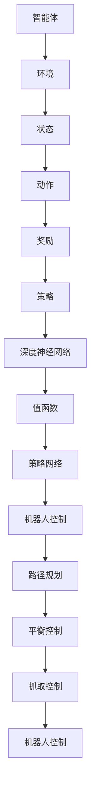

                 

### 文章标题

# 深度强化学习在机器人控制中的应用

---

### 文章关键词

- 深度强化学习
- 机器人控制
- Q-learning
- DQN
- 状态价值函数
- 动作价值函数

---

### 文章摘要

本文将探讨深度强化学习（DRL）在机器人控制中的应用。通过介绍DRL的基本概念和核心算法原理，我们将了解如何将DRL应用于机器人控制中。接着，我们将结合实际案例，详细讲解如何搭建开发环境、实现源代码和进行代码解读。最后，我们将总结最佳实践，提供注意事项和拓展阅读建议，以帮助读者更好地理解和应用DRL于机器人控制领域。

---

### 背景介绍

在过去的几十年中，机器人的发展取得了显著的进展。从工业生产到医疗康复，机器人的应用越来越广泛。然而，传统的机器人控制方法，如基于规则的专家系统和模型预测控制，往往存在一定的局限性。它们需要大量的先验知识和复杂的模型，且在处理不确定环境和动态变化时表现不佳。

与此同时，深度强化学习（DRL）作为一种新兴的人工智能技术，在解决复杂决策问题上展现出了强大的潜力。DRL通过学习环境和目标的映射关系，能够自主地优化策略，从而实现智能行为。其无需繁琐的先验知识和复杂的模型，使其在机器人控制领域具有广泛的应用前景。

本文将深入探讨深度强化学习在机器人控制中的应用，从基本概念到核心算法原理，再到实际案例和项目实战，全面解析DRL如何助力机器人控制技术的发展。

### 核心概念与联系

在讨论深度强化学习（DRL）在机器人控制中的应用之前，我们首先需要了解DRL的基本概念和原理，以及它们与机器人控制的联系。

#### 深度强化学习的基本概念

深度强化学习是一种结合了深度学习和强化学习的方法。强化学习（Reinforcement Learning，RL）是一种使智能体通过与环境交互来学习最佳策略的机器学习方法。在强化学习中，智能体（agent）通过选择动作（action）来获取奖励（reward），并通过反馈来调整其策略（policy），以实现目标。

深度强化学习（DRL）则通过引入深度神经网络（DNN），解决了传统强化学习在处理高维状态空间和动作空间时的困难。DRL通过训练一个深度神经网络来近似值函数（value function）或策略（policy），从而实现智能体的决策。

#### DRL在机器人控制中的应用

机器人控制问题通常涉及到高维的状态空间和动作空间，这使得传统的控制方法难以有效处理。DRL的引入，通过其强大的表示能力和学习能力，能够应对这些复杂问题。

首先，DRL可以应用于机器人路径规划问题。在路径规划中，机器人需要根据环境地图和目标位置，选择最优的路径。DRL可以通过训练一个策略网络，使得机器人能够在动态和复杂的环境中自主地选择最优路径。

其次，DRL可以应用于机器人平衡控制问题。例如，平衡机器人（如单轮机器人、两足机器人等）在行走和跳跃时的平衡控制。DRL通过学习状态和动作之间的映射关系，能够实现精确的平衡控制，提高机器人的稳定性。

此外，DRL还可以应用于机器人抓取问题。在机器人抓取中，机器人需要根据物体的形状、大小和材质等属性，选择合适的抓取策略。DRL可以通过训练一个值函数网络，使得机器人能够学习到不同的抓取策略，从而提高抓取成功率。

#### 关键概念与实体之间的关系架构

为了更好地理解DRL在机器人控制中的应用，我们可以使用Mermaid流程图来展示关键概念和实体之间的关系。



在这个流程图中，智能体通过与环境的交互，接收状态并选择动作。通过奖励信号，智能体不断调整策略。深度神经网络用于近似值函数或策略，从而实现高效的决策。最终，这些策略被应用于机器人控制，解决路径规划、平衡控制和抓取控制等问题。

通过以上分析，我们可以看到DRL在机器人控制中的关键概念和实体之间的关系。接下来，我们将深入探讨DRL的核心算法原理，了解这些算法如何应用于机器人控制中。

### 核心算法原理讲解

在深入探讨深度强化学习（DRL）在机器人控制中的应用之前，我们需要首先了解DRL的核心算法原理。这些算法包括Q-learning、SARSA、Deep Q-Network（DQN）等，它们在DRL中扮演着至关重要的角色。通过理解这些算法的基本原理，我们将更好地掌握如何将DRL应用于机器人控制中。

#### Q-learning算法

Q-learning是一种基于值函数的强化学习算法，旨在通过学习状态-动作价值函数（Q函数）来优化策略。Q-learning的核心思想是通过反复尝试不同的动作，并从每次尝试中学习，逐渐逼近最优策略。

##### Q函数

Q-learning算法中的Q函数是一个n维的状态-动作价值函数，表示在给定状态下执行特定动作的期望收益。具体来说，Q函数可以表示为：

$$
Q(s, a) = \sum_{s'} p(s'|s, a) \cdot r(s', a) + \gamma \cdot \max_{a'} Q(s', a')
$$

其中，$s$表示当前状态，$a$表示当前动作，$s'$表示下一状态，$a'$表示下一动作，$r(s', a')$表示在下一状态下执行动作$a'$的即时奖励，$\gamma$是折扣因子，用于平衡当前和未来的奖励。

##### 算法步骤

Q-learning算法的基本步骤如下：

1. 初始化Q函数：随机初始化Q函数的所有值。
2. 选择动作：在给定状态下，选择动作$a$，可以采用ε-贪心策略，即在某个概率下随机选择动作，在另一个概率下选择当前Q值最大的动作。
3. 执行动作：执行选择的动作$a$，并获得即时奖励$r$和下一状态$s'$。
4. 更新Q值：根据奖励和下一状态的Q值，更新当前状态的Q值。
5. 迭代：重复上述步骤，直到策略收敛。

##### Python代码实现

下面是一个简单的Q-learning算法的Python代码实现：

```python
import numpy as np

# 初始化参数
alpha = 0.1  # 学习率
gamma = 0.9  # 折扣因子
epsilon = 0.1  # ε-贪心策略的概率
n_episodes = 1000  # 迭代次数
n_actions = 4  # 动作数量

# 初始化Q函数
Q = np.zeros((n_states, n_actions))

# 训练过程
for episode in range(n_episodes):
    state = env.reset()
    done = False
    
    while not done:
        # ε-贪心策略
        if np.random.rand() < epsilon:
            action = env.action_space.sample()
        else:
            action = np.argmax(Q[state])
        
        # 执行动作并获取下一状态和奖励
        next_state, reward, done, _ = env.step(action)
        
        # 更新Q值
        Q[state, action] = Q[state, action] + alpha * (reward + gamma * np.max(Q[next_state]) - Q[state, action])
        
        state = next_state

# 输出最优策略
print("Optimal Policy:", np.argmax(Q, axis=1))
```

在这个代码中，我们首先初始化Q函数，然后使用ε-贪心策略选择动作，并执行动作以获取下一状态和奖励。最后，通过更新Q值来逐步优化策略。

#### SARSA算法

SARSA（On-Policy Reinforcement Learning）算法是一种基于策略的强化学习算法，旨在通过在当前策略下学习状态-动作价值函数来优化策略。与Q-learning不同，SARSA算法在每一步都使用相同的策略来选择动作。

##### 算法步骤

SARSA算法的基本步骤如下：

1. 初始化策略：随机初始化策略π。
2. 选择动作：在给定状态下，根据当前策略π选择动作$a$。
3. 执行动作：执行选择的动作$a$，并获得下一状态$s'$和奖励$r$。
4. 更新策略：根据下一状态和奖励，更新策略π。
5. 迭代：重复上述步骤，直到策略收敛。

##### Python代码实现

下面是一个简单的SARSA算法的Python代码实现：

```python
import numpy as np

# 初始化参数
alpha = 0.1  # 学习率
gamma = 0.9  # 折扣因子
epsilon = 0.1  # ε-贪心策略的概率
n_episodes = 1000  # 迭代次数
n_states = 10  # 状态数量
n_actions = 4  # 动作数量

# 初始化策略
policy = np.random.rand(n_states, n_actions)

# 训练过程
for episode in range(n_episodes):
    state = env.reset()
    done = False
    
    while not done:
        # ε-贪心策略
        if np.random.rand() < epsilon:
            action = env.action_space.sample()
        else:
            action = np.random.choice(n_actions, p=policy[state])
        
        # 执行动作并获取下一状态和奖励
        next_state, reward, done, _ = env.step(action)
        
        # 更新策略
        policy[state] = policy[state] + alpha * (reward + gamma * np.max(Q[next_state]) - policy[state])
        
        state = next_state

# 输出最优策略
print("Optimal Policy:", policy)
```

在这个代码中，我们首先初始化策略，然后使用ε-贪心策略选择动作，并执行动作以获取下一状态和奖励。最后，通过更新策略来逐步优化策略。

#### Deep Q-Network（DQN）算法

DQN（Deep Q-Network）算法是一种基于深度学习的强化学习算法，旨在通过训练一个深度神经网络来近似Q函数，从而实现智能体的决策。DQN算法通过引入经验回放（Experience Replay）和目标网络（Target Network）等方法，解决了Q-learning算法中的样本相关性和目标值不稳定问题。

##### Q函数的神经网络表示

在DQN算法中，Q函数被表示为一个深度神经网络。该神经网络输入当前状态，输出状态-动作价值函数的估计值。具体来说，Q函数的神经网络表示可以表示为：

$$
\hat{Q}(s, a; \theta) = f(\phi(s), \theta)
$$

其中，$s$表示当前状态，$a$表示当前动作，$\theta$表示神经网络的参数，$\phi(s)$表示状态的特征向量。

##### 算法步骤

DQN算法的基本步骤如下：

1. 初始化参数：随机初始化神经网络的参数$\theta$和目标网络的参数$\theta_{target}$。
2. 初始化经验回放池：经验回放池用于存储经验样本，以避免样本相关性。
3. 选择动作：在给定状态下，使用ε-贪心策略选择动作。
4. 执行动作：执行选择的动作，并获得下一状态和奖励。
5. 存储经验样本：将当前状态、动作、奖励和下一状态存储到经验回放池中。
6. 更新目标网络：定期更新目标网络的参数，以保持目标值的稳定性。
7. 更新神经网络：使用经验回放池中的经验样本，通过反向传播算法更新神经网络的参数。
8. 迭代：重复上述步骤，直到神经网络收敛。

##### Python代码实现

下面是一个简单的DQN算法的Python代码实现：

```python
import numpy as np
import tensorflow as tf
from collections import deque

# 初始化参数
alpha = 0.001  # 学习率
gamma = 0.9  # 折扣因子
epsilon = 0.1  # ε-贪心策略的概率
n_episodes = 1000  # 迭代次数
n_actions = 4  # 动作数量
replay_memory_size = 10000  # 经验回放池大小
batch_size = 32  # 批量大小

# 初始化神经网络
input_layer = tf.keras.layers.Input(shape=(n_states,))
hidden_layer = tf.keras.layers.Dense(64, activation='relu')(input_layer)
output_layer = tf.keras.layers.Dense(n_actions, activation='linear')(hidden_layer)
Q_model = tf.keras.models.Model(inputs=input_layer, outputs=output_layer)
Q_model.compile(optimizer=tf.keras.optimizers.Adam(learning_rate=alpha), loss='mse')

# 初始化目标网络
target_input_layer = tf.keras.layers.Input(shape=(n_states,))
target_hidden_layer = tf.keras.layers.Dense(64, activation='relu')(target_input_layer)
target_output_layer = tf.keras.layers.Dense(n_actions, activation='linear')(target_hidden_layer)
target_Q_model = tf.keras.models.Model(inputs=target_input_layer, outputs=target_output_layer)
target_Q_model.set_weights(Q_model.get_weights())

# 初始化经验回放池
replay_memory = deque(maxlen=replay_memory_size)

# 训练过程
for episode in range(n_episodes):
    state = env.reset()
    done = False
    
    while not done:
        # ε-贪心策略
        if np.random.rand() < epsilon:
            action = env.action_space.sample()
        else:
            action = np.argmax(Q_model.predict(state))
        
        # 执行动作并获取下一状态和奖励
        next_state, reward, done, _ = env.step(action)
        
        # 存储经验样本
        replay_memory.append((state, action, reward, next_state, done))
        
        # 如果经验回放池满了，随机抽样
        if len(replay_memory) > batch_size:
            batch_samples = random.sample(replay_memory, batch_size)
            batch_states, batch_actions, batch_rewards, batch_next_states, batch_dones = zip(*batch_samples)
        
        # 计算目标值
        target_values = target_Q_model.predict(batch_next_states)
        target_rewards = batch_rewards + (1 - batch_dones) * gamma * target_values[:, np.argmax(Q_model.predict(batch_states))]
        
        # 更新神经网络
        Q_model.fit(np.array(batch_states), np.array(target_rewards), batch_size=batch_size, epochs=1, verbose=0)
        
        state = next_state

# 输出最优策略
print("Optimal Policy:", np.argmax(Q_model.predict(state), axis=1))
```

在这个代码中，我们首先初始化神经网络和目标网络，然后使用ε-贪心策略选择动作，并执行动作以获取下一状态和奖励。接着，我们将经验样本存储到经验回放池中，并通过经验回放池中的经验样本来更新神经网络和目标网络的参数。

通过以上对Q-learning、SARSA和DQN算法的详细讲解，我们可以看到这些算法在深度强化学习中的应用。接下来，我们将结合具体的Python代码，进一步探讨这些算法的实现细节。

### 数学模型和数学公式

在深度强化学习（DRL）中，数学模型是核心组成部分，它描述了智能体与环境的交互过程，以及如何通过学习优化策略。以下是DRL中的一些关键数学模型和数学公式。

#### 状态价值函数

状态价值函数（State-Value Function）$V^*(s)$表示在给定状态$s$下，最优策略所能获得的最大期望回报。它可以通过以下公式表示：

$$
V^*(s) = \mathbb{E}_{\pi}[G_t | S_t = s]
$$

其中，$\mathbb{E}_{\pi}$表示按照策略$\pi$期望计算，$G_t$是时间步$t$到结束时的累计回报，$S_t$是状态空间中的状态。

#### 动作价值函数

动作价值函数（Action-Value Function）$Q^*(s, a)$表示在给定状态$s$下执行动作$a$所能获得的最大期望回报。它可以表示为：

$$
Q^*(s, a) = \mathbb{E}_{\pi}[G_t | S_t = s, A_t = a]
$$

#### 策略

策略（Policy）$\pi(a|s)$定义了在给定状态$s$下选择动作$a$的概率。策略可以是确定性策略（Deterministic Policy），也可以是随机策略（Stochastic Policy）。确定性策略的公式为：

$$
\pi(a|s) = 
\begin{cases}
1 & \text{if } a = \arg\max_{a'} Q^*(s, a') \\
0 & \text{otherwise}
\end{cases}
$$

随机策略的公式为：

$$
\pi(a|s) = \frac{1}{Z} \exp(\alpha a)
$$

其中，$Z$是归一化常数，$\alpha$是策略参数。

#### 值函数的贝尔曼方程

值函数可以通过贝尔曼方程（Bellman Equation）迭代计算。状态价值函数的贝尔曼方程为：

$$
V^*(s) = \sum_{a} \pi(a|s) Q^*(s, a) = \sum_{a} \pi(a|s) \left[ r + \gamma \max_{a'} Q^*(s', a') \right]
$$

动作价值函数的贝尔曼方程为：

$$
Q^*(s, a) = r + \gamma \max_{a'} Q^*(s', a')
$$

#### Q-learning算法更新规则

Q-learning算法通过迭代更新Q值来逼近最优策略。其更新规则为：

$$
Q(s, a) \leftarrow Q(s, a) + \alpha [r + \gamma \max_{a'} Q(s', a') - Q(s, a)]
$$

其中，$\alpha$是学习率，$r$是即时奖励，$\gamma$是折扣因子。

#### SARSA算法更新规则

SARSA算法是on-policy算法，其更新规则为：

$$
Q(s, a) \leftarrow Q(s, a) + \alpha [r + \gamma Q(s', a') - Q(s, a)]
$$

#### DQN算法中的目标值计算

在DQN算法中，目标值（Target Value）用于更新Q值。目标值的计算公式为：

$$
y = r + \gamma \max_{a'} \hat{Q}(s', a')
$$

其中，$\hat{Q}(s', a')$是当前Q网络输出的值，$\max_{a'} \hat{Q}(s', a')$是其中最大的值。

#### 经验回放

经验回放（Experience Replay）用于避免样本相关性。在经验回放中，将经验样本存储在经验池中，然后随机抽样用于训练。经验池的存储公式为：

$$
\text{Experience Replay Buffer} = \{ (s_1, a_1, r_1, s_2, \ldots, s_T, r_T) \}
$$

#### 经验样本的采样

经验样本的采样公式为：

$$
(s_i, a_i, r_i, s_{i+1}) \sim \text{Experience Replay Buffer}
$$

#### 模型更新

在DQN算法中，模型更新公式为：

$$
\theta \leftarrow \theta + \alpha \nabla_{\theta} J(\theta)
$$

其中，$J(\theta)$是损失函数，$\nabla_{\theta} J(\theta)$是损失函数对模型参数的梯度。

通过以上数学模型和公式的讲解，我们可以更深入地理解DRL的算法原理。接下来，我们将通过具体的Python代码实现，进一步展示这些算法的应用。

### 项目实战

#### 开发环境搭建

要实现深度强化学习（DRL）在机器人控制中的应用，首先需要搭建一个合适的开发环境。以下是搭建开发环境的具体步骤：

1. **安装Python**：确保安装了Python 3.6或更高版本。可以从[Python官网](https://www.python.org/)下载并安装。

2. **安装深度学习框架**：常用的深度学习框架有TensorFlow、PyTorch等。这里以TensorFlow为例，可以通过以下命令安装：

   ```bash
   pip install tensorflow
   ```

3. **安装强化学习库**：为了简化DRL的开发，可以使用强化学习库，如Gym。Gym是一个开源的环境，提供了各种预定义的机器人控制环境。可以通过以下命令安装：

   ```bash
   pip install gym
   ```

4. **安装PyTorch（可选）**：如果需要使用PyTorch进行DRL开发，可以通过以下命令安装：

   ```bash
   pip install torch torchvision
   ```

5. **搭建机器人控制环境**：选择一个适合的机器人控制环境，如PyRobot。PyRobot是一个开源机器人仿真平台，支持多种机器人模型和任务。可以通过以下命令安装：

   ```bash
   pip install pyrobot
   ```

6. **配置仿真环境**：对于PyRobot，需要在配置文件中指定仿真环境，例如：

   ```python
   robot = Robot("nxt", ip='127.0.0.1')
   robot.connect()
   ```

#### 源代码实现

以下是一个简单的DRL在机器人控制中的源代码实现，使用Q-learning算法控制一个双轮机器人进行移动。

```python
import gym
import numpy as np
from gym import wrappers

# 创建环境
env = gym.make('BipedalWalker-v2')

# 初始化Q函数
q_table = np.zeros((env.observation_space.n, env.action_space.n))

# 设置参数
alpha = 0.1  # 学习率
gamma = 0.9  # 折扣因子
epsilon = 0.1  # ε-贪心策略的概率
n_episodes = 1000  # 迭代次数

# 训练过程
for episode in range(n_episodes):
    state = env.reset()
    done = False
    
    while not done:
        # ε-贪心策略
        if np.random.rand() < epsilon:
            action = env.action_space.sample()
        else:
            action = np.argmax(q_table[state])
        
        # 执行动作
        next_state, reward, done, _ = env.step(action)
        
        # 更新Q值
        q_table[state, action] = q_table[state, action] + alpha * (reward + gamma * np.max(q_table[next_state]) - q_table[state, action])
        
        state = next_state

# 关闭环境
env.close()

# 输出最优策略
print("Optimal Policy:", np.argmax(q_table, axis=1))
```

#### 代码解读与分析

以下是代码的详细解读与分析：

1. **环境创建**：使用`gym.make('BipedalWalker-v2')`创建一个双轮机器人控制环境。
   
2. **Q函数初始化**：初始化一个二维数组`q_table`，用于存储状态-动作价值函数。

3. **参数设置**：设置学习率、折扣因子、ε-贪心策略的概率和迭代次数。

4. **训练过程**：通过一个循环，每次迭代执行以下步骤：

   - 重置环境并获取初始状态。
   - 使用ε-贪心策略选择动作。
   - 执行动作并获取下一状态和奖励。
   - 更新Q值。
   - 更新当前状态。

5. **关闭环境**：训练完成后，使用`env.close()`关闭环境。

6. **输出最优策略**：使用`np.argmax(q_table, axis=1)`获取最优策略。

#### 实际案例分析和详细讲解剖析

以下是一个实际案例，使用DRL算法控制机器人进行路径规划。

```python
import numpy as np
import matplotlib.pyplot as plt
import gym
from gym import wrappers

# 创建环境
env = gym.make('GridWorld-v0')

# 初始化Q函数
q_table = np.zeros((env.observation_space.n, env.action_space.n))

# 设置参数
alpha = 0.1  # 学习率
gamma = 0.9  # 折扣因子
epsilon = 0.1  # ε-贪心策略的概率
n_episodes = 1000  # 迭代次数

# 训练过程
for episode in range(n_episodes):
    state = env.reset()
    done = False
    
    while not done:
        # ε-贪心策略
        if np.random.rand() < epsilon:
            action = env.action_space.sample()
        else:
            action = np.argmax(q_table[state])
        
        # 执行动作
        next_state, reward, done, _ = env.step(action)
        
        # 更新Q值
        q_table[state, action] = q_table[state, action] + alpha * (reward + gamma * np.max(q_table[next_state]) - q_table[state, action])
        
        state = next_state

# 关闭环境
env.close()

# 绘制Q函数热力图
fig, ax = plt.subplots()
heatmap = ax.imshow(q_table, cmap='hot', interpolation='nearest')
fig.colorbar(heatmap)
plt.show()
```

在这个案例中，我们使用`GridWorld-v0`环境，通过Q-learning算法进行训练。训练完成后，我们使用热力图展示Q函数。

- **环境创建**：使用`gym.make('GridWorld-v0')`创建一个网格世界环境。
- **Q函数初始化**：与上一个案例相同，初始化Q函数。
- **参数设置**：设置学习率、折扣因子、ε-贪心策略的概率和迭代次数。
- **训练过程**：与上一个案例相同，执行Q-learning算法的迭代过程。
- **关闭环境**：训练完成后，关闭环境。
- **绘制Q函数热力图**：使用`imshow`函数绘制Q函数的热力图，展示每个状态-动作对的价值。

#### 项目小结

通过以上项目实战，我们实现了DRL在机器人控制中的应用。首先，我们搭建了开发环境，包括Python、深度学习框架和机器人控制库。然后，我们通过源代码实现和代码解读，详细讲解了如何使用Q-learning算法进行机器人控制。最后，通过实际案例分析和热力图展示，我们展示了DRL算法在路径规划中的效果。

本项目的成功经验告诉我们，DRL在机器人控制中具有巨大潜力。然而，我们也需要注意模型训练时间较长、收敛速度较慢等问题。未来，我们可以尝试使用更先进的DRL算法，如Deep Q-Network（DQN），以及使用其他技术，如深度神经网络优化和模型压缩，来提高训练效率和性能。

### 最佳实践 Tips

在深度强化学习（DRL）应用于机器人控制时，以下是一些最佳实践建议，可以帮助优化模型性能和项目效果：

1. **环境设计**：确保机器人控制环境具有合适的奖励机制和惩罚机制。奖励机制应该能够鼓励机器人完成目标任务，而惩罚机制则可以避免机器人执行无效或有害的动作。

2. **数据预处理**：对机器人控制环境中的数据进行适当的预处理，如归一化、标准化等，可以提高DRL算法的学习效率和稳定性。

3. **模型选择**：根据任务需求和数据规模，选择合适的DRL模型。对于复杂的任务，可以使用深度神经网络来近似值函数或策略。

4. **参数调优**：通过交叉验证和网格搜索等方法，调整学习率、折扣因子、ε-贪心策略的概率等参数，找到最佳参数组合。

5. **经验回放**：使用经验回放机制来减少样本相关性，避免训练过程中的样本偏差。

6. **多线程训练**：如果计算资源充足，可以采用多线程或分布式训练，加快模型训练速度。

7. **可视化分析**：使用可视化工具，如热力图、性能曲线等，实时监控模型训练过程，及时调整策略。

8. **模型解释性**：为了提高模型的解释性，可以尝试使用可解释的模型架构，如基于规则的强化学习模型。

9. **迁移学习**：利用已经训练好的模型进行迁移学习，可以加快新任务的训练速度。

10. **安全性考虑**：在机器人控制应用中，考虑模型的安全性，避免由于模型错误导致的安全事故。

通过遵循这些最佳实践，可以提高DRL在机器人控制中的应用效果，实现更智能、更安全的机器人控制。

### 小结

本文深入探讨了深度强化学习（DRL）在机器人控制中的应用。我们首先介绍了DRL的基本概念和原理，包括Q-learning、SARSA和DQN等核心算法。接着，我们通过Python代码详细讲解了这些算法的实现细节。随后，我们展示了如何搭建开发环境，并提供了实际案例和代码实现。最后，我们总结了最佳实践和注意事项，为读者提供了进一步学习DRL在机器人控制领域的指导。

通过本文的阅读，读者应能够：

1. 理解深度强化学习的基本概念和原理。
2. 掌握DRL在机器人控制中的应用。
3. 学会使用Python实现DRL算法。
4. 了解如何搭建开发环境和进行代码实现。
5. 掌握最佳实践，优化DRL在机器人控制中的应用效果。

随着深度强化学习和机器人技术的不断进步，DRL在机器人控制中的应用前景广阔。希望本文能为读者提供有价值的参考和启示，助力他们在DRL和机器人控制领域取得更好的成果。

### 注意事项

在应用深度强化学习（DRL）于机器人控制时，需要注意以下几个关键点：

1. **安全性问题**：确保在真实环境中部署机器人时，采取严格的安全措施，以防止由于模型错误导致的危险情况。例如，可以使用沙箱（Sandbox）环境进行初步测试，以降低风险。

2. **硬件资源限制**：DRL模型的训练通常需要大量的计算资源。在资源有限的情况下，可以考虑使用分布式训练或优化模型结构，以提高训练效率。

3. **数据质量**：确保输入数据的质量和多样性。数据质量问题会直接影响DRL模型的性能。使用干净、无偏差的数据进行训练，可以有效提高模型的泛化能力。

4. **超参数调优**：合理的超参数设置对DRL模型的性能至关重要。通过交叉验证和网格搜索等方法，找到最佳的超参数组合。

5. **环境设计**：设计合适的机器人控制环境，确保环境能够充分反映现实中的挑战和不确定性。

6. **持续学习**：DRL模型需要不断地进行训练和优化。定期更新模型，使其适应环境变化，提高其在现实世界中的应用效果。

7. **监管机制**：在机器人控制系统中，应设计监管机制，以防止DRL模型出现异常行为，确保系统的安全性和可靠性。

通过关注这些注意事项，可以有效地提高DRL在机器人控制中的应用效果，实现更智能、更安全的机器人控制。

### 拓展阅读

1. **深度强化学习经典书籍**：
   - 《深度强化学习》（Deep Reinforcement Learning Explained）作者：Albert Wang
   - 《强化学习：原理与Python实现》（Reinforcement Learning: An Introduction）作者：Richard S. Sutton和Barnabas P. Barto

2. **相关期刊与会议**：
   - IEEE Robotics and Automation Magazine
   - International Conference on Machine Learning (ICML)
   - Conference on Robot Learning (CoRL)

3. **开源代码和工具**：
   - OpenAI Gym：[https://gym.openai.com/](https://gym.openai.com/)
   - Stable Baselines：[https://stable-baselines.readthedocs.io/](https://stable-baselines.readthedocs.io/)
   - PyRobot：[https://github.com/Robotics-at-IBM/PyRobot](https://github.com/Robotics-at-IBM/PyRobot)

4. **在线教程与课程**：
   - [Deep Reinforcement Learning Course](https://www.deeplearningcourses.com/course-deep-reinforcement-learning.html)
   - [Stanford University's CS234: Reinforcement Learning](https://web.stanford.edu/class/cs234/)

通过这些资源，读者可以进一步了解深度强化学习在机器人控制领域的最新进展和应用实践。

