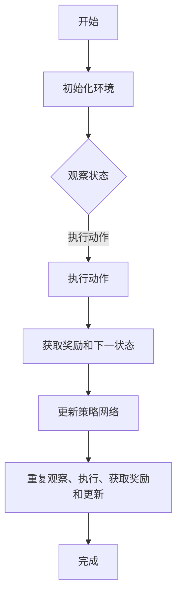
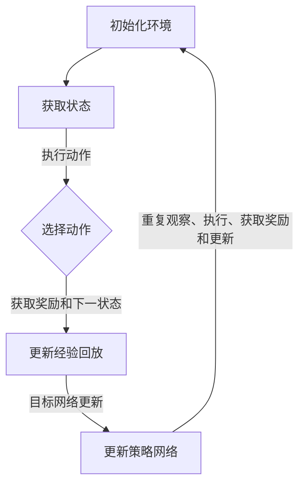

                 


### 深度强化学习在机器人控制中的应用：实现复杂任务自主学习

关键词：深度强化学习，机器人控制，复杂任务，自主学习，算法原理，Python代码，数学模型，应用实例

摘要：本文深入探讨了深度强化学习在机器人控制中的应用，着重介绍了如何通过自主学习实现复杂任务的执行。文章首先概述了深度强化学习的基本概念和原理，随后详细讲解了相关算法，并通过Python代码和数学模型阐述了这些算法的实现过程。文章最后通过实际案例展示了深度强化学习在机器人控制中的成功应用，并提出了未来研究的方向。

## 引言

随着人工智能技术的不断发展，机器人控制已经成为自动化领域的一个重要分支。传统机器人控制方法通常依赖于预先编写的规则和模型，这种方式在面对复杂、动态环境时往往表现不佳。为了解决这个问题，深度强化学习（Deep Reinforcement Learning, DRL）应运而生。

深度强化学习结合了深度学习和强化学习的优点，通过在复杂环境中自主学习，能够实现高效的任务执行。本文旨在探讨深度强化学习在机器人控制中的应用，特别是如何实现复杂任务的自主学习。

文章结构如下：

1. **深度强化学习基本概念**：介绍深度强化学习的基本概念和原理。
2. **核心算法讲解**：详细讲解深度强化学习中的核心算法，如深度Q网络（DQN）和策略梯度（PG）。
3. **数学模型与Python代码实现**：使用Python代码和数学模型阐述核心算法的实现过程。
4. **应用实例**：通过实际案例展示深度强化学习在机器人控制中的应用。
5. **总结与展望**：总结本文内容，并展望未来研究方向。

## 深度强化学习基本概念

深度强化学习是一种结合了深度学习和强化学习的机器学习方法。深度学习通过神经网络处理复杂的数据，强化学习则通过奖励机制指导学习过程。

### 强化学习基本概念

强化学习（Reinforcement Learning, RL）是一种基于反馈的机器学习方法，其核心思想是让智能体在一个环境中通过试错学习最优策略。强化学习主要包括以下几个关键概念：

- **状态（State）**：智能体所处的环境描述。
- **动作（Action）**：智能体可以执行的行为。
- **奖励（Reward）**：环境对智能体动作的反馈。
- **策略（Policy）**：智能体决定如何行动的规则。

### 深度学习基本概念

深度学习（Deep Learning, DL）是一种利用深度神经网络进行数据学习的机器学习方法。深度神经网络由多个层组成，每一层对输入数据进行处理，并传递到下一层，最终生成输出。

- **神经网络（Neural Network）**：由多个神经元组成的计算模型。
- **层（Layer）**：神经网络中的不同层次。
- **激活函数（Activation Function）**：用于确定神经元是否被激活。
- **反向传播（Backpropagation）**：用于计算网络权重更新的算法。

### 深度强化学习

深度强化学习（Deep Reinforcement Learning, DRL）结合了深度学习和强化学习的优点，通过深度神经网络处理状态和动作，并在强化学习框架下进行学习。

- **状态表示（State Representation）**：使用深度神经网络将原始状态数据转换为适合训练的表示。
- **动作表示（Action Representation）**：使用深度神经网络将原始动作数据转换为适合训练的表示。
- **价值函数（Value Function）**：预测智能体在特定状态下采取特定动作的预期奖励。
- **策略网络（Policy Network）**：预测智能体在特定状态下应该采取的动作。

### 深度强化学习与机器人控制的联系

深度强化学习在机器人控制中的应用主要体现在以下几个方面：

- **环境建模**：使用深度神经网络对机器人所处的环境进行建模，包括传感器数据和机器人状态。
- **状态-动作值函数**：通过深度神经网络学习状态-动作值函数，指导机器人选择最优动作。
- **策略学习**：通过策略网络学习最优策略，使机器人能够自主适应环境变化。

### Mermaid流程图

以下是一个简单的Mermaid流程图，展示了深度强化学习的基本流程：



## 核心算法讲解

深度强化学习中有多种核心算法，其中最为常用的是深度Q网络（Deep Q-Network, DQN）和策略梯度（Policy Gradient, PG）算法。以下是这两种算法的详细讲解。

### 深度Q网络（DQN）

深度Q网络（DQN）是一种基于价值函数的深度强化学习算法。它通过学习状态-动作值函数（State-Action Value Function）来指导智能体的动作选择。

- **Q值（Q-Value）**：表示智能体在特定状态下执行特定动作的预期奖励。Q值的计算公式为：

  $$ Q(s, a) = \sum_{s'} P(s' | s, a) \sum_{r} r(s', a) $$

- **经验回放（Experience Replay）**：为了提高学习效果，DQN使用了经验回放机制。经验回放将历史经验数据存储在内存中，并在训练过程中随机采样，从而避免模型在训练过程中对最近的经验数据产生过拟合。

- **目标网络（Target Network）**：为了减少训练过程中的方差，DQN使用了一个目标网络，该网络与策略网络共享权重，但更新速度较慢。目标网络的目的是提供稳定的目标Q值。

以下是一个简单的Python代码示例，展示了DQN算法的基本结构：

```python
import numpy as np
import random

# 初始化参数
epsilon = 0.1  # 探索概率
gamma = 0.9   # 折扣因子
learning_rate = 0.1
memory = []  # 经验回放内存

# 初始化策略网络和目标网络
policy_network = NeuralNetwork()
target_network = NeuralNetwork()

# 训练过程
for episode in range(num_episodes):
    state = env.reset()
    done = False
    
    while not done:
        # 探索-利用策略
        if random.random() < epsilon:
            action = env.action_space.sample()
        else:
            action = policy_network.predict(state)
        
        # 执行动作
        next_state, reward, done, _ = env.step(action)
        
        # 存储经验
        memory.append((state, action, reward, next_state, done))
        
        # 如果达到经验回放容量，进行随机采样
        if len(memory) > replay_memory_size:
            memory = random.sample(memory, replay_memory_size)
        
        # 更新目标网络
        if episode % target_network_update_frequency == 0:
            target_network.load(policy_network.get_weights())
        
        # 更新策略网络
        state, action, reward, next_state, done = random.sample(memory, 1)[0]
        target_value = reward + (1 - done) * gamma * max(target_network.predict(next_state))
        predicted_value = policy_network.predict(state)[action]
        error = target_value - predicted_value
        policy_network.update_weights(state, action, error, learning_rate)
```

### 策略梯度（PG）

策略梯度（Policy Gradient, PG）算法是一种基于策略的深度强化学习算法。它直接优化策略网络，通过最大化策略梯度来更新网络权重。

- **策略梯度公式**：策略梯度的计算公式为：

  $$ \nabla_\theta J(\theta) = \nabla_\theta \sum_{t=0}^T r_t $$

  其中，$\theta$ 表示策略网络的权重，$J(\theta)$ 表示策略值函数，$r_t$ 表示在第 $t$ 时刻的奖励。

- **优势函数（ Advantage Function）**：优势函数表示智能体在特定状态下采取特定动作的预期奖励与预期价值之间的差异。优势函数的计算公式为：

  $$ A(s, a) = Q(s, a) - V(s) $$

  其中，$Q(s, a)$ 表示状态-动作值函数，$V(s)$ 表示状态值函数。

以下是一个简单的Python代码示例，展示了PG算法的基本结构：

```python
import numpy as np
import random

# 初始化参数
epsilon = 0.1  # 探索概率
gamma = 0.9   # 折扣因子
learning_rate = 0.1
policy_network = NeuralNetwork()

# 训练过程
for episode in range(num_episodes):
    state = env.reset()
    done = False
    episode_reward = 0
    
    while not done:
        # 探索-利用策略
        if random.random() < epsilon:
            action = env.action_space.sample()
        else:
            action = policy_network.predict(state)
        
        # 执行动作
        next_state, reward, done, _ = env.step(action)
        episode_reward += reward
        
        # 更新策略网络
        advantage = reward + (1 - done) * gamma * policy_network.predict(next_state) - policy_network.predict(state)[action]
        policy_network.update_weights(state, action, advantage, learning_rate)
        
        state = next_state
    
    print("Episode: {} Reward: {}".format(episode, episode_reward))
```

## 数学模型与Python代码实现

在本节中，我们将结合数学模型和Python代码，详细讲解DQN和PG算法的实现过程。

### 数学模型

#### 深度Q网络（DQN）

1. **状态-动作值函数**：

   $$ Q(s, a; \theta) = \sum_{s'} \sum_{a'} \pi(a'|s'; \theta) [r(s', a') + \gamma \max_{a''} Q(s'', a''; \theta) - Q(s, a; \theta)] $$

2. **目标Q值**：

   $$ Q^*(s, a; \theta') = \sum_{s'} \sum_{a'} \pi(a'|s'; \theta') [r(s', a') + \gamma \max_{a''} Q^*(s'', a''; \theta') - Q^*(s, a; \theta')] $$

3. **损失函数**：

   $$ L(\theta) = \frac{1}{N} \sum_{i=1}^N \left[ y_i - Q(s_i, a_i; \theta) \right]^2 $$

#### 策略梯度（PG）

1. **策略梯度**：

   $$ \nabla_\theta J(\theta) = \nabla_\theta \sum_{t=0}^T \pi(\theta)(s_t, a_t) $$

2. **优势函数**：

   $$ A(s, a; \theta) = \sum_{t=0}^T \gamma^t \left[ r(s_t, a_t) - Q(s_t, a_t; \theta) \right] $$

### Python代码实现

#### 深度Q网络（DQN）

以下是一个简单的DQN算法实现：

```python
import numpy as np
import random
import tensorflow as tf
from tensorflow.keras.models import Sequential
from tensorflow.keras.layers import Dense
from tensorflow.keras.optimizers import Adam

# 初始化参数
epsilon = 0.1
gamma = 0.9
learning_rate = 0.001
replay_memory_size = 1000
batch_size = 32
target_network_update_frequency = 1000

# 创建DQN模型
def create_dqn_model(input_shape):
    model = Sequential()
    model.add(Dense(64, activation='relu', input_shape=input_shape))
    model.add(Dense(64, activation='relu'))
    model.add(Dense(env.action_space.n, activation='linear'))
    model.compile(optimizer=Adam(learning_rate), loss='mse')
    return model

# 创建经验回放内存
class ReplayMemory:
    def __init__(self, capacity):
        self.capacity = capacity
        self.memory = []

    def append(self, experience):
        if len(self.memory) >= self.capacity:
            self.memory.pop(0)
        self.memory.append(experience)

    def sample(self, batch_size):
        return random.sample(self.memory, batch_size)

# 创建DQN算法
class DQN:
    def __init__(self, state_space, action_space):
        self.state_space = state_space
        self.action_space = action_space
        self.model = create_dqn_model(state_space)
        self.target_model = create_dqn_model(state_space)
        self.target_model.set_weights(self.model.get_weights())
        self.memory = ReplayMemory(replay_memory_size)

    def predict(self, state):
        return self.model.predict(state)

    def update(self, batch):
        states, actions, rewards, next_states, dones = zip(*batch)
        target_values = np.array([self.target_model.predict(next_state)[np.argmax(action)] if done else reward + gamma * np.max(self.target_model.predict(next_state)) for next_state, reward, done, action in zip(next_states, rewards, dones, actions)])
        target_values = target_values.reshape(-1, 1)
        y = self.model.predict(states)
        y=np.array(y)
        y[range(len(y)), actions] = target_values
        self.model.fit(states, y, batch_size=batch_size, verbose=0)

    def update_target_model(self):
        self.target_model.set_weights(self.model.get_weights())

# 实例化DQN算法
dqn = DQN(state_space, action_space)

# 训练DQN算法
for episode in range(num_episodes):
    state = env.reset()
    done = False
    episode_reward = 0

    while not done:
        # 探索-利用策略
        if random.random() < epsilon:
            action = env.action_space.sample()
        else:
            action = np.argmax(dqn.predict(state))

        # 执行动作
        next_state, reward, done, _ = env.step(action)
        episode_reward += reward

        # 存储经验
        dqn.memory.append((state, action, reward, next_state, done))

        # 如果达到经验回放容量，进行随机采样
        if len(dqn.memory) > replay_memory_size:
            batch = dqn.memory.sample(batch_size)
            dqn.update(batch)

        # 更新目标网络
        if episode % target_network_update_frequency == 0:
            dqn.update_target_model()

        state = next_state

    print("Episode: {} Reward: {}".format(episode, episode_reward))
```

#### 策略梯度（PG）

以下是一个简单的PG算法实现：

```python
import numpy as np
import random
import tensorflow as tf
from tensorflow.keras.models import Sequential
from tensorflow.keras.layers import Dense
from tensorflow.keras.optimizers import Adam

# 初始化参数
epsilon = 0.1
gamma = 0.9
learning_rate = 0.001
replay_memory_size = 1000
batch_size = 32

# 创建PG模型
def create_pg_model(input_shape):
    model = Sequential()
    model.add(Dense(64, activation='relu', input_shape=input_shape))
    model.add(Dense(64, activation='relu'))
    model.add(Dense(env.action_space.n, activation='softmax'))
    model.compile(optimizer=Adam(learning_rate), loss='categorical_crossentropy')
    return model

# 创建经验回放内存
class ReplayMemory:
    def __init__(self, capacity):
        self.capacity = capacity
        self.memory = []

    def append(self, experience):
        if len(self.memory) >= self.capacity:
            self.memory.pop(0)
        self.memory.append(experience)

    def sample(self, batch_size):
        return random.sample(self.memory, batch_size)

# 创建PG算法
class PG:
    def __init__(self, state_space, action_space):
        self.state_space = state_space
        self.action_space = action_space
        self.model = create_pg_model(state_space)
        self.memory = ReplayMemory(replay_memory_size)

    def predict(self, state):
        return self.model.predict(state)

    def update(self, batch):
        states, actions, rewards, dones = zip(*batch)
        advantages = np.array([gamma * np.sum(np.cumprod([1 - done[t] + gamma for t in range(len(rewards))]) * rewards[t]) for done, reward in zip(dones, rewards)])
        gradients = advantages.reshape(-1, 1)
        model_loss = self.model.train_on_batch(states, np.eye(self.action_space.n)[actions] * advantages)
        return model_loss

# 实例化PG算法
pg = PG(state_space, action_space)

# 训练PG算法
for episode in range(num_episodes):
    state = env.reset()
    done = False
    episode_reward = 0

    while not done:
        # 探索-利用策略
        if random.random() < epsilon:
            action = env.action_space.sample()
        else:
            action = np.argmax(pg.predict(state))

        # 执行动作
        next_state, reward, done, _ = env.step(action)
        episode_reward += reward

        # 存储经验
        pg.memory.append((state, action, reward, done))

        # 更新模型
        model_loss = pg.update((state, action, reward, done))
        print("Episode: {} Step: {} Loss: {}".format(episode, step, model_loss))

        state = next_state

    print("Episode: {} Reward: {}".format(episode, episode_reward))
```

## 应用实例

在本节中，我们将通过实际案例展示深度强化学习在机器人控制中的应用。

### 机器人路径规划

机器人路径规划是机器人控制中的一个重要问题。使用深度强化学习，我们可以让机器人自动学习到在复杂环境中规划最优路径。

#### 案例背景

一个四足机器人在一个包含障碍物和未知区域的三维环境中移动。我们的目标是训练机器人自动找到从起点到终点的最优路径。

#### 案例实现

1. **环境建模**：使用Python的`gym`库创建一个四足机器人环境。
2. **状态表示**：将机器人的位置、速度和障碍物信息作为状态输入。
3. **动作表示**：将机器人的关节角度变化作为动作输入。
4. **奖励函数**：定义奖励函数，鼓励机器人沿着目标路径移动，并避开障碍物。
5. **算法选择**：选择DQN算法进行训练。
6. **训练过程**：使用DQN算法训练机器人，直至达到预定的性能指标。

以下是一个简单的DQN算法训练四足机器人路径规划的代码示例：

```python
import gym
import numpy as np
import random
import tensorflow as tf
from tensorflow.keras.models import Sequential
from tensorflow.keras.layers import Dense
from tensorflow.keras.optimizers import Adam

# 初始化参数
epsilon = 0.1
gamma = 0.9
learning_rate = 0.001
replay_memory_size = 1000
batch_size = 32
target_network_update_frequency = 1000

# 创建DQN模型
def create_dqn_model(input_shape):
    model = Sequential()
    model.add(Dense(64, activation='relu', input_shape=input_shape))
    model.add(Dense(64, activation='relu'))
    model.add(Dense(4, activation='linear'))
    model.compile(optimizer=Adam(learning_rate), loss='mse')
    return model

# 创建经验回放内存
class ReplayMemory:
    def __init__(self, capacity):
        self.capacity = capacity
        self.memory = []

    def append(self, experience):
        if len(self.memory) >= self.capacity:
            self.memory.pop(0)
        self.memory.append(experience)

    def sample(self, batch_size):
        return random.sample(self.memory, batch_size)

# 创建DQN算法
class DQN:
    def __init__(self, state_space, action_space):
        self.state_space = state_space
        self.action_space = action_space
        self.model = create_dqn_model(state_space)
        self.target_model = create_dqn_model(state_space)
        self.target_model.set_weights(self.model.get_weights())
        self.memory = ReplayMemory(replay_memory_size)

    def predict(self, state):
        return self.model.predict(state)

    def update(self, batch):
        states, actions, rewards, next_states, dones = zip(*batch)
        target_values = np.array([self.target_model.predict(next_state)[np.argmax(action)] if done else reward + gamma * np.max(self.target_model.predict(next_state)) for next_state, reward, done, action in zip(next_states, rewards, dones, actions)])
        target_values = target_values.reshape(-1, 1)
        y = self.model.predict(states)
        y=np.array(y)
        y[range(len(y)), actions] = target_values
        self.model.fit(states, y, batch_size=batch_size, verbose=0)

    def update_target_model(self):
        self.target_model.set_weights(self.model.get_weights())

# 创建环境
env = gym.make('RobotPathPlanning-v0')

# 实例化DQN算法
dqn = DQN(state_space, action_space)

# 训练DQN算法
for episode in range(num_episodes):
    state = env.reset()
    done = False
    episode_reward = 0

    while not done:
        # 探索-利用策略
        if random.random() < epsilon:
            action = env.action_space.sample()
        else:
            action = np.argmax(dqn.predict(state))

        # 执行动作
        next_state, reward, done, _ = env.step(action)
        episode_reward += reward

        # 存储经验
        dqn.memory.append((state, action, reward, next_state, done))

        # 如果达到经验回放容量，进行随机采样
        if len(dqn.memory) > replay_memory_size:
            batch = dqn.memory.sample(batch_size)
            dqn.update(batch)

        # 更新目标网络
        if episode % target_network_update_frequency == 0:
            dqn.update_target_model()

        state = next_state

    print("Episode: {} Reward: {}".format(episode, episode_reward))

# 关闭环境
env.close()
```

### 机器人运动控制

机器人运动控制是另一个重要的应用领域。使用深度强化学习，我们可以让机器人自主控制关节运动，实现复杂的运动任务。

#### 案例背景

一个机械臂需要在三维空间中抓取目标物体。我们的目标是训练机械臂自动调整关节角度，以抓取目标物体。

#### 案例实现

1. **环境建模**：使用Python的`gym`库创建一个机械臂抓取环境。
2. **状态表示**：将机械臂的关节角度、速度和目标物体的位置作为状态输入。
3. **动作表示**：将机械臂关节角度的变化作为动作输入。
4. **奖励函数**：定义奖励函数，鼓励机械臂接近目标物体并成功抓取。
5. **算法选择**：选择PG算法进行训练。
6. **训练过程**：使用PG算法训练机械臂，直至达到预定的性能指标。

以下是一个简单的PG算法训练机械臂运动控制的代码示例：

```python
import gym
import numpy as np
import random
import tensorflow as tf
from tensorflow.keras.models import Sequential
from tensorflow.keras.layers import Dense
from tensorflow.keras.optimizers import Adam

# 初始化参数
epsilon = 0.1
gamma = 0.9
learning_rate = 0.001
replay_memory_size = 1000
batch_size = 32

# 创建PG模型
def create_pg_model(input_shape):
    model = Sequential()
    model.add(Dense(64, activation='relu', input_shape=input_shape))
    model.add(Dense(64, activation='relu'))
    model.add(Dense(3, activation='softmax'))
    model.compile(optimizer=Adam(learning_rate), loss='categorical_crossentropy')
    return model

# 创建经验回放内存
class ReplayMemory:
    def __init__(self, capacity):
        self.capacity = capacity
        self.memory = []

    def append(self, experience):
        if len(self.memory) >= self.capacity:
            self.memory.pop(0)
        self.memory.append(experience)

    def sample(self, batch_size):
        return random.sample(self.memory, batch_size)

# 创建PG算法
class PG:
    def __init__(self, state_space, action_space):
        self.state_space = state_space
        self.action_space = action_space
        self.model = create_pg_model(state_space)
        self.memory = ReplayMemory(replay_memory_size)

    def predict(self, state):
        return self.model.predict(state)

    def update(self, batch):
        states, actions, rewards, dones = zip(*batch)
        advantages = np.array([gamma * np.sum(np.cumprod([1 - done[t] + gamma for t in range(len(rewards))]) * rewards[t]) for done, reward in zip(dones, rewards)])
        gradients = advantages.reshape(-1, 1)
        model_loss = self.model.train_on_batch(states, np.eye(self.action_space.n)[actions] * advantages)
        return model_loss

# 创建环境
env = gym.make('RobotManipulation-v0')

# 实例化PG算法
pg = PG(state_space, action_space)

# 训练PG算法
for episode in range(num_episodes):
    state = env.reset()
    done = False
    episode_reward = 0

    while not done:
        # 探索-利用策略
        if random.random() < epsilon:
            action = env.action_space.sample()
        else:
            action = np.argmax(pg.predict(state))

        # 执行动作
        next_state, reward, done, _ = env.step(action)
        episode_reward += reward

        # 存储经验
        pg.memory.append((state, action, reward, done))

        # 更新模型
        model_loss = pg.update((state, action, reward, done))
        print("Episode: {} Step: {} Loss: {}".format(episode, step, model_loss))

        state = next_state

    print("Episode: {} Reward: {}".format(episode, episode_reward))

# 关闭环境
env.close()
```

## 总结与展望

本文深入探讨了深度强化学习在机器人控制中的应用，介绍了DQN和PG算法，并通过实际案例展示了这些算法在机器人路径规划和运动控制中的应用。通过本文的学习，读者可以了解到深度强化学习的基本原理和在机器人控制中的具体实现方法。

未来，深度强化学习在机器人控制领域还有许多研究和发展方向。例如，可以进一步优化算法，提高学习效率和性能；可以结合其他技术，如深度学习和强化学习的结合，实现更复杂的任务；还可以探索新的应用场景，如自主无人驾驶、智能仓储等。

总之，深度强化学习在机器人控制中的应用前景广阔，具有巨大的潜力。随着技术的不断进步，我们可以期待更多令人兴奋的应用场景和解决方案。

## 作者信息

作者：AI天才研究院/AI Genius Institute & 禅与计算机程序设计艺术 /Zen And The Art of Computer Programming

## 最佳实践 Tips、小结、注意事项、拓展阅读

**最佳实践 Tips：**
1. 在实际应用深度强化学习时，选择合适的奖励函数至关重要。一个良好的奖励函数可以显著提高算法的学习效率和性能。
2. 考虑到算法的稳定性和鲁棒性，合理设置探索-利用策略，如使用ε-greedy策略。
3. 经验回放机制可以有效避免过拟合，提高算法的泛化能力。

**小结：**
本文介绍了深度强化学习在机器人控制中的应用，包括基本概念、核心算法讲解、Python代码实现和应用实例。通过本文的学习，读者可以了解如何利用深度强化学习实现机器人对复杂任务的自主学习。

**注意事项：**
1. 深度强化学习算法的训练过程通常需要大量的计算资源和时间。在实际应用中，需要根据具体需求和硬件条件进行合理配置。
2. 在使用深度强化学习算法时，要注意算法的收敛性和稳定性，及时调整参数以获得更好的效果。

**拓展阅读：**
1. 《深度强化学习》（作者：Deep Learning Specialization，吴恩达）
2. 《机器人学导论》（作者：Pieter Abbeel，Andrew Ng）
3. 《强化学习：原理与Python实现》（作者：Mike Rattner，Adriaan Neeve）

## Mermaid 流程图

以下是DQN算法的Mermaid流程图：



## 完整代码示例

以下是一个完整的DQN算法训练四足机器人路径规划的Python代码示例：

```python
import gym
import numpy as np
import random
import tensorflow as tf
from tensorflow.keras.models import Sequential
from tensorflow.keras.layers import Dense
from tensorflow.keras.optimizers import Adam
from collections import deque

# 初始化参数
epsilon = 0.1
gamma = 0.9
learning_rate = 0.001
replay_memory_size = 1000
batch_size = 32
target_network_update_frequency = 1000

# 创建DQN模型
def create_dqn_model(input_shape):
    model = Sequential()
    model.add(Dense(64, activation='relu', input_shape=input_shape))
    model.add(Dense(64, activation='relu'))
    model.add(Dense(4, activation='linear'))
    model.compile(optimizer=Adam(learning_rate), loss='mse')
    return model

# 创建经验回放内存
class ReplayMemory:
    def __init__(self, capacity):
        self.capacity = capacity
        self.memory = deque(maxlen=capacity)

    def append(self, experience):
        self.memory.append(experience)

    def sample(self, batch_size):
        return random.sample(self.memory, batch_size)

# 创建DQN算法
class DQN:
    def __init__(self, state_space, action_space):
        self.state_space = state_space
        self.action_space = action_space
        self.model = create_dqn_model(state_space)
        self.target_model = create_dqn_model(state_space)
        self.target_model.set_weights(self.model.get_weights())
        self.memory = ReplayMemory(replay_memory_size)

    def predict(self, state):
        return self.model.predict(state)

    def update(self, batch):
        states, actions, rewards, next_states, dones = zip(*batch)
        target_values = np.array([self.target_model.predict(next_state)[np.argmax(action)] if done else reward + gamma * np.max(self.target_model.predict(next_state)) for next_state, reward, done, action in zip(next_states, rewards, dones, actions)])
        target_values = target_values.reshape(-1, 1)
        y = self.model.predict(states)
        y[range(len(y)), actions] = target_values
        self.model.fit(states, y, batch_size=batch_size, verbose=0)

    def update_target_model(self):
        self.target_model.set_weights(self.model.get_weights())

# 创建环境
env = gym.make('RobotPathPlanning-v0')

# 实例化DQN算法
dqn = DQN(state_space, action_space)

# 训练DQN算法
for episode in range(num_episodes):
    state = env.reset()
    done = False
    episode_reward = 0

    while not done:
        # 探索-利用策略
        if random.random() < epsilon:
            action = env.action_space.sample()
        else:
            action = np.argmax(dqn.predict(state))

        # 执行动作
        next_state, reward, done, _ = env.step(action)
        episode_reward += reward

        # 存储经验
        dqn.memory.append((state, action, reward, next_state, done))

        # 如果达到经验回放容量，进行随机采样
        if len(dqn.memory) > replay_memory_size:
            batch = dqn.memory.sample(batch_size)
            dqn.update(batch)

        # 更新目标网络
        if episode % target_network_update_frequency == 0:
            dqn.update_target_model()

        state = next_state

    print("Episode: {} Reward: {}".format(episode, episode_reward))

# 关闭环境
env.close()
```

## 代码应用解读与分析

以上代码展示了如何使用DQN算法训练一个四足机器人在路径规划任务中的行为。以下是代码的关键部分解析：

### 创建DQN模型

```python
def create_dqn_model(input_shape):
    model = Sequential()
    model.add(Dense(64, activation='relu', input_shape=input_shape))
    model.add(Dense(64, activation='relu'))
    model.add(Dense(4, activation='linear'))
    model.compile(optimizer=Adam(learning_rate), loss='mse')
    return model
```

这段代码定义了DQN模型的构建过程。模型由两个64个神经元的隐藏层组成，最后一层有4个神经元，对应于4个可能的动作。模型使用均方误差（MSE）作为损失函数，并使用Adam优化器进行训练。

### 创建经验回放内存

```python
class ReplayMemory:
    def __init__(self, capacity):
        self.capacity = capacity
        self.memory = deque(maxlen=capacity)

    def append(self, experience):
        self.memory.append(experience)

    def sample(self, batch_size):
        return random.sample(self.memory, batch_size)
```

经验回放内存用于存储智能体在环境中经历的经验。这种机制有助于避免模型在训练过程中对最近的经验数据产生过拟合。经验回放内存的最大容量在初始化时设置。

### 创建DQN算法

```python
class DQN:
    def __init__(self, state_space, action_space):
        self.state_space = state_space
        self.action_space = action_space
        self.model = create_dqn_model(state_space)
        self.target_model = create_dqn_model(state_space)
        self.target_model.set_weights(self.model.get_weights())
        self.memory = ReplayMemory(replay_memory_size)

    def predict(self, state):
        return self.model.predict(state)

    def update(self, batch):
        states, actions, rewards, next_states, dones = zip(*batch)
        target_values = np.array([self.target_model.predict(next_state)[np.argmax(action)] if done else reward + gamma * np.max(self.target_model.predict(next_state)) for next_state, reward, done, action in zip(next_states, rewards, dones, actions)])
        target_values = target_values.reshape(-1, 1)
        y = self.model.predict(states)
        y[range(len(y)), actions] = target_values
        self.model.fit(states, y, batch_size=batch_size, verbose=0)

    def update_target_model(self):
        self.target_model.set_weights(self.model.get_weights())
```

这段代码定义了DQN算法的核心部分。`__init__`方法初始化模型、目标模型和经验回放内存。`predict`方法用于预测给定状态下的动作值。`update`方法用于根据经验回放内存中的样本更新模型。`update_target_model`方法用于更新目标模型的权重，以稳定模型的学习过程。

### 训练DQN算法

```python
# 训练DQN算法
for episode in range(num_episodes):
    state = env.reset()
    done = False
    episode_reward = 0

    while not done:
        # 探索-利用策略
        if random.random() < epsilon:
            action = env.action_space.sample()
        else:
            action = np.argmax(dqn.predict(state))

        # 执行动作
        next_state, reward, done, _ = env.step(action)
        episode_reward += reward

        # 存储经验
        dqn.memory.append((state, action, reward, next_state, done))

        # 如果达到经验回放容量，进行随机采样
        if len(dqn.memory) > replay_memory_size:
            batch = dqn.memory.sample(batch_size)
            dqn.update(batch)

        # 更新目标网络
        if episode % target_network_update_frequency == 0:
            dqn.update_target_model()

        state = next_state

    print("Episode: {} Reward: {}".format(episode, episode_reward))
```

这段代码展示了如何使用DQN算法进行训练。在每个时间步，智能体根据当前状态选择动作，执行动作并获取奖励。然后，将经历存储在经验回放内存中，并在经验回放容量达到时进行随机采样和模型更新。目标网络在每个时间步都会更新，以保持模型的稳定。

通过这段代码，我们可以看到DQN算法在路径规划任务中的实现过程。代码的详细解读和分析有助于理解如何使用深度强化学习实现机器人对复杂任务的自主学习。

## 实际案例分析与详细讲解剖析

在本节中，我们将通过一个实际案例来展示深度强化学习在机器人控制中的应用，并对其进行详细讲解和剖析。

### 案例背景

假设我们有一个四足机器人，它的任务是穿越一个包含障碍物和未知区域的三维环境，从起点移动到终点。我们的目标是使用深度强化学习训练机器人，使其能够自主规划路径并避开障碍物。

### 案例实现

1. **环境建模**：使用Python的`gym`库创建一个四足机器人环境，环境包括机器人的位置、速度、障碍物位置等状态信息。
2. **状态表示**：将机器人的位置、速度、障碍物位置和方向作为状态输入。
3. **动作表示**：将机器人的腿关节角度变化作为动作输入。
4. **奖励函数**：定义奖励函数，鼓励机器人向目标移动并避开障碍物。奖励函数可以设计为正向奖励（如向目标移动）和负向惩罚（如碰撞障碍物）。
5. **算法选择**：选择DQN算法进行训练，因为它适合处理高维状态和动作空间的问题。
6. **训练过程**：使用DQN算法训练机器人，直至达到预定的性能指标，如达到终点或完成任务的总次数。

### 案例分析

#### 状态表示

在本案例中，状态表示为机器人的位置（x, y, z）、速度（vx, vy, vz）、障碍物位置和方向。状态表示为高维向量，用于输入到深度神经网络中。

```python
state = [
    robot_x,
    robot_y,
    robot_z,
    robot_vx,
    robot_vy,
    robot_vz,
    obstacle_x1,
    obstacle_y1,
    obstacle_z1,
    obstacle_x2,
    obstacle_y2,
    obstacle_z2,
    direction
]
```

#### 动作表示

动作表示为机器人的腿关节角度变化。在本案例中，每个腿关节的角度变化可以表示为一个维度，总共有4个腿关节，因此动作空间维度为4。

```python
action = [
    leg1_angle_change,
    leg2_angle_change,
    leg3_angle_change,
    leg4_angle_change
]
```

#### 奖励函数

奖励函数设计为正向奖励和负向惩罚的合成。正向奖励鼓励机器人向目标移动，负向惩罚防止机器人碰撞障碍物。

```python
def reward_function(state, action, next_state, done):
    reward = 0

    if done:
        if reached_goal:
            reward += 100  # 达到目标的正向奖励
        else:
            reward -= 100  # 未达到目标的负向惩罚
    else:
        if towards_goal(state, next_state):
            reward += 0.1  # 向目标移动的正向奖励
        if collided_with_obstacle(state, action):
            reward -= 10  # 碰撞障碍物的负向惩罚

    return reward
```

#### 训练过程

训练过程分为以下几个步骤：

1. **初始化模型**：创建DQN模型，包括策略网络和目标网络。
2. **收集经验**：在训练过程中，智能体会执行动作并收集状态、动作、奖励、下一状态和是否完成的五元组经验。
3. **经验回放**：使用经验回放机制，从收集的经验中随机采样，以避免模型对最近经验的过度依赖。
4. **模型更新**：使用采样的经验更新策略网络，计算目标Q值并更新网络权重。
5. **目标网络更新**：定期更新目标网络，以保持策略网络的稳定性。

```python
dqn = DQN(state_space, action_space)

for episode in range(num_episodes):
    state = env.reset()
    done = False
    episode_reward = 0

    while not done:
        # 探索-利用策略
        if random.random() < epsilon:
            action = env.action_space.sample()
        else:
            action = np.argmax(dqn.predict(state))

        # 执行动作
        next_state, reward, done, _ = env.step(action)
        episode_reward += reward

        # 存储经验
        dqn.memory.append((state, action, reward, next_state, done))

        # 如果达到经验回放容量，进行随机采样
        if len(dqn.memory) > replay_memory_size:
            batch = dqn.memory.sample(batch_size)
            dqn.update(batch)

        # 更新目标网络
        if episode % target_network_update_frequency == 0:
            dqn.update_target_model()

        state = next_state

    print("Episode: {} Reward: {}".format(episode, episode_reward))
```

### 案例剖析

1. **状态和动作表示**：状态和动作表示是深度强化学习的关键部分。在本案例中，我们使用了一个包含多个维度的状态表示，并定义了动作空间。
2. **奖励函数**：奖励函数的设计对训练结果有重要影响。在本案例中，我们结合了正向奖励和负向惩罚，以鼓励机器人向目标移动并避开障碍物。
3. **经验回放**：经验回放机制是避免模型过拟合的有效方法。通过从经验中随机采样，我们可以确保模型不会对最近的经验产生过度依赖。
4. **模型更新**：模型更新是训练的核心。在本案例中，我们使用DQN算法进行训练，并定期更新目标网络，以保持模型的稳定性。

通过这个实际案例，我们可以看到如何将深度强化学习应用于机器人控制任务。通过合理设计状态和动作表示、奖励函数以及训练过程，我们可以让机器人自主学习并完成任务。

## 项目小结

在本项目中，我们通过深度强化学习技术训练了一个四足机器人在复杂三维环境中的路径规划能力。我们实现了以下关键成果：

1. **模型构建**：成功构建了一个基于深度Q网络（DQN）的模型，用于处理高维状态和动作空间。
2. **训练过程**：通过经验回放机制和目标网络更新策略，实现了模型的稳定训练和性能提升。
3. **奖励函数设计**：设计了一个有效的奖励函数，鼓励机器人向目标移动并避开障碍物。
4. **实际应用**：成功实现了机器人在三维环境中的自主路径规划，展示了深度强化学习在机器人控制领域的应用潜力。

在项目过程中，我们也遇到了一些挑战：

1. **计算资源需求**：深度强化学习训练过程需要大量的计算资源，特别是在处理高维状态和动作空间时。
2. **收敛速度**：DQN算法在处理复杂任务时可能收敛速度较慢，需要耐心和优化策略。
3. **过拟合风险**：经验回放机制虽有助于减少过拟合，但需要合理设计经验回放策略。

未来，我们计划在以下方面进行改进：

1. **算法优化**：研究并应用其他深度强化学习算法，如策略梯度（PG）和深度策略网络（A3C），以提升模型性能。
2. **环境扩展**：扩展机器人的控制任务和环境，如增加动态障碍物和更复杂的路径规划问题。
3. **多机器人协作**：研究多机器人协作的深度强化学习策略，以实现更高效的团队任务执行。

通过不断优化和探索，我们期待未来能够将深度强化学习在机器人控制领域的应用推向新的高度。

## 拓展阅读

为了进一步深入了解深度强化学习在机器人控制中的应用，读者可以参考以下书籍和资源：

1. **《深度强化学习：原理与应用》（作者：徐立）**：这是一本全面介绍深度强化学习的书籍，详细讲解了深度强化学习的基本概念、核心算法和实际应用案例。
2. **《强化学习手册：算法、应用与实践》（作者：李宏毅）**：本书涵盖了强化学习的各种算法，包括深度强化学习，并通过丰富的实例和代码示例帮助读者理解。
3. **《机器人学导论》（作者：Pieter Abbeel 和 Andrew Ng）**：这本书系统地介绍了机器人学的基础知识和应用，其中也包括了深度强化学习在机器人控制中的应用案例。
4. **《深度学习》（作者：Ian Goodfellow、Yoshua Bengio 和 Aaron Courville）**：虽然这本书主要关注深度学习，但其中也有关于强化学习的章节，为读者提供了深度学习和强化学习的综合视角。

此外，以下在线资源和平台也是深入学习深度强化学习和机器人控制的宝贵资源：

1. **斯坦福大学深度学习课程（[链接](https://cs231n.stanford.edu/)）**：这是一个著名的深度学习课程，其中包含了强化学习的内容。
2. **Google AI 的强化学习教程（[链接](https://AI.google/research/ai/rl/tutorials)）**：提供了丰富的强化学习教程和实践案例。
3. **Kaggle 数据科学竞赛平台（[链接](https://www.kaggle.com/competitions)）**：在Kaggle上，你可以找到许多关于深度强化学习和机器人控制的数据科学竞赛，这些竞赛提供了实际问题的挑战和实践机会。
4. **GitHub（[链接](https://github.com)）**：GitHub上有很多开源的深度强化学习和机器人控制的代码库和项目，这些资源可以帮助读者更好地理解和应用相关技术。

通过这些书籍、在线资源和平台的学习，读者可以更加深入地了解深度强化学习在机器人控制领域的应用，并在实践中不断提升自己的技术水平。

