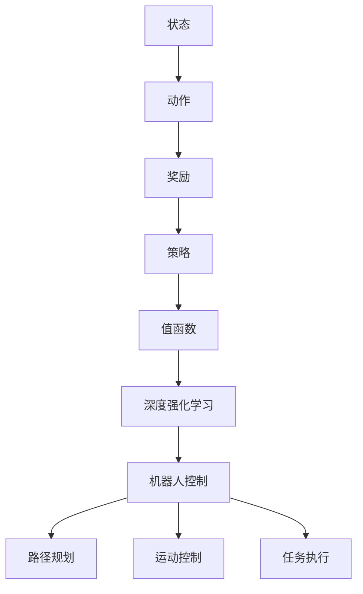
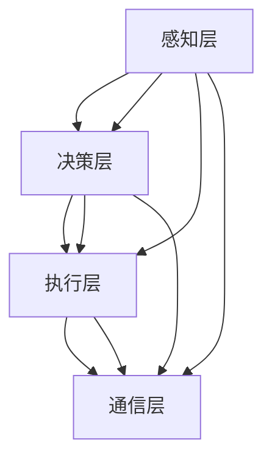

                 


### 深度强化学习在机器人控制中的突破

#### 关键词：深度强化学习，机器人控制，算法，神经网络，人工智能

#### 摘要：
深度强化学习在近年来取得了显著的进展，为机器人控制领域带来了新的突破。本文将详细介绍深度强化学习的基本概念、核心算法以及它们在机器人控制中的应用实例，探讨其在实际场景中的优势与挑战，并展望其未来发展。

## 目录

### 第一部分：深度强化学习基础

### 第1章：深度强化学习概述

#### 1.1 深度强化学习的定义与历史背景

#### 1.2 深度强化学习的核心概念

#### 1.3 深度强化学习与机器人控制的联系

### 第2章：深度学习基础

#### 2.1 神经网络原理

#### 2.2 深度学习框架

#### 2.3 深度学习优化算法

### 第3章：强化学习基础

#### 3.1 强化学习的定义与原理

#### 3.2 基本强化学习算法

#### 3.3 Q-Learning算法

### 第4章：深度强化学习算法

#### 4.1 DQN算法

#### 4.2 A3C算法

#### 4.3 DDPG算法

### 第二部分：深度强化学习在机器人控制中的应用

### 第5章：机器人控制概述

#### 5.1 机器人控制的基本概念

#### 5.2 机器人控制的挑战

#### 5.3 机器人控制系统的架构

### 第6章：深度强化学习在机器人控制中的实际应用

#### 6.1 环境建模与状态空间设计

#### 6.2 动作空间设计与规划

#### 6.3 深度强化学习算法在机器人控制中的应用实例

### 第7章：深度强化学习在机器人控制中的突破

#### 7.1 深度强化学习在机器人控制中的优势

#### 7.2 深度强化学习在机器人控制中的挑战与解决方案

#### 7.3 未来发展趋势与展望

### 附录

#### 附录A：深度强化学习相关工具和资源

#### 附录B：机器人控制实验项目指南

---

### 第1章：深度强化学习概述

#### 1.1 深度强化学习的定义与历史背景

深度强化学习（Deep Reinforcement Learning，简称DRL）是一种结合了深度学习和强化学习的机器学习方法。深度学习通过模拟人脑的神经网络结构来实现数据的自动特征提取和模式识别，而强化学习则通过奖励机制来引导智能体在环境中的学习。深度强化学习将这两者的优势结合起来，使得智能体能够在复杂环境中通过自主学习来完成任务。

深度强化学习的历史可以追溯到2013年，当DeepMind的David Silver和Hisashi Shirakata首次提出深度Q网络（Deep Q-Network，DQN）算法时。DQN在Atari游戏中的出色表现引起了广泛关注，标志着深度强化学习的诞生。此后，深度强化学习领域取得了长足的进展，一系列新的算法如深度策略梯度（Deep Policy Gradient，DPPG）、异步策略梯度（Asynchronous Advantage Actor-Critic，A3C）等相继被提出。

#### 1.2 深度强化学习的核心概念

深度强化学习的核心概念主要包括：

1. **状态（State）**：状态是智能体在环境中所处的情境。在机器人控制中，状态可以表示为机器人的位置、速度、目标位置等。

2. **动作（Action）**：动作是智能体可以执行的行为。在机器人控制中，动作可以是机器人的转动角度、速度等。

3. **奖励（Reward）**：奖励是环境对智能体动作的反馈。正奖励表示动作有助于完成任务，负奖励表示动作不利于完成任务。

4. **策略（Policy）**：策略是智能体选择动作的策略。在深度强化学习中，策略通常由神经网络来表示。

5. **值函数（Value Function）**：值函数用来评估当前状态下的最优动作值。深度强化学习通过训练神经网络来近似值函数。

#### 1.3 深度强化学习与机器人控制的联系

深度强化学习在机器人控制中的主要应用是通过学习来控制机器人的运动。机器人控制系统通常由传感器、执行器和控制器组成，传感器收集环境信息，执行器执行动作，控制器根据传感器信息执行相应的动作。深度强化学习算法可以通过学习环境与动作之间的关系，来设计出最优的控制策略。

具体来说，深度强化学习在机器人控制中的应用包括：

1. **路径规划**：机器人需要在复杂的未知环境中找到从起点到终点的最佳路径。

2. **运动控制**：机器人需要根据环境信息进行自主运动，如避障、跟随等。

3. **任务执行**：机器人需要在环境中执行特定的任务，如搬运物品、组装零件等。

#### 1.3.1 Mermaid流程图：展示深度强化学习的核心概念及其与机器人控制的联系



### 第2章：深度学习基础

#### 2.1 神经网络原理

神经网络是深度学习的基础，它由多个神经元组成，每个神经元接收多个输入并产生一个输出。神经网络的工作原理是通过对输入数据进行加权求和，然后通过激活函数进行非线性变换，从而实现对数据的分类或回归。

神经网络的核心组成部分包括：

1. **神经元**：神经元是神经网络的基本单元，它接收多个输入，并进行加权求和。

2. **权重**：权重决定了输入对神经元输出的影响大小。

3. **偏置**：偏置是一个常数，它可以调整神经元的输出。

4. **激活函数**：激活函数用于引入非线性特性，常用的激活函数包括Sigmoid、ReLU等。

#### 2.2 深度学习框架

深度学习框架是用于构建和训练深度学习模型的软件库。常见的深度学习框架包括TensorFlow、PyTorch、Keras等。这些框架提供了丰富的API和工具，使得构建和训练深度学习模型变得更加容易。

深度学习框架的主要功能包括：

1. **数据预处理**：数据预处理包括数据清洗、归一化、数据增强等操作。

2. **模型构建**：框架提供了构建神经网络模型的API，用户可以通过定义层、连接方式等来构建模型。

3. **模型训练**：框架提供了训练模型的功能，包括优化器选择、损失函数定义等。

4. **模型评估**：框架提供了评估模型性能的功能，包括准确率、召回率等指标。

#### 2.3 深度学习优化算法

深度学习优化算法用于调整神经网络的权重和偏置，以最小化损失函数。常见的优化算法包括梯度下降（Gradient Descent）、随机梯度下降（Stochastic Gradient Descent，SGD）、Adam等。

1. **梯度下降**：梯度下降是最简单的优化算法，它通过计算损失函数的梯度来更新权重。

2. **随机梯度下降**：随机梯度下降是在梯度下降的基础上，每次更新权重时只随机选择一部分样本。

3. **Adam**：Adam是一种结合了SGD和Momentum优点的优化算法，它通过计算一阶矩估计和二阶矩估计来更新权重。

#### 2.3.1 伪代码：详细阐述深度学习优化算法的实现

```python
# 梯度下降伪代码
for epoch in range(num_epochs):
    for batch in data_loader:
        # 计算梯度
        gradients = compute_gradients(model, batch)
        # 更新权重
        update_weights(model, gradients, learning_rate)

# 随机梯度下降伪代码
for epoch in range(num_epochs):
    for sample in data_loader:
        # 计算梯度
        gradients = compute_gradients(model, sample)
        # 更新权重
        update_weights(model, gradients, learning_rate)

# Adam伪代码
beta1 = 0.9
beta2 = 0.999
epsilon = 1e-8

for epoch in range(num_epochs):
    for batch in data_loader:
        # 计算梯度
        gradients = compute_gradients(model, batch)
        # 计算一阶矩估计和二阶矩估计
        m = beta1 * m_prev + (1 - beta1) * gradients
        v = beta2 * v_prev + (1 - beta2) * (gradients ** 2)
        # 更新一阶矩估计和二阶矩估计
        m_hat = m / (1 - beta1 ** epoch)
        v_hat = v / (1 - beta2 ** epoch)
        # 更新权重
        update_weights(model, m_hat, v_hat, learning_rate)
```

### 第3章：强化学习基础

#### 3.1 强化学习的定义与原理

强化学习（Reinforcement Learning，简称RL）是一种通过与环境交互来学习优化行为的机器学习方法。在强化学习中，智能体（Agent）通过观察环境（Environment）、选择动作（Action）、获得奖励（Reward）来不断学习。

强化学习的核心原理包括：

1. **状态（State）**：状态是智能体在环境中所处的情境。

2. **动作（Action）**：动作是智能体可以执行的行为。

3. **奖励（Reward）**：奖励是环境对智能体动作的反馈。

4. **策略（Policy）**：策略是智能体选择动作的策略。

5. **价值函数（Value Function）**：价值函数用来评估当前状态下的最优动作值。

6. **策略迭代（Policy Iteration）**：策略迭代是一种通过迭代优化策略来改进智能体行为的方法。

7. **Q学习（Q-Learning）**：Q学习是一种基于价值函数的强化学习算法，它通过不断更新Q值来优化智能体的行为。

#### 3.2 基本强化学习算法

基本强化学习算法主要包括：

1. **Q-Learning**：Q-Learning是一种基于价值函数的强化学习算法，它通过更新Q值来优化智能体的行为。

2. **SARSA（同步优势回报采样）**：SARSA是一种同步的强化学习算法，它同时更新当前状态和动作的Q值。

3. **策略迭代**：策略迭代是一种通过迭代优化策略来改进智能体行为的方法。

4. **深度Q网络（Deep Q-Network，DQN）**：DQN是一种基于深度学习的强化学习算法，它使用深度神经网络来近似Q值函数。

#### 3.3 Q-Learning算法

Q-Learning是一种基于价值函数的强化学习算法，它的核心思想是通过不断更新Q值来优化智能体的行为。Q-Learning算法的基本步骤包括：

1. **初始化Q值**：初始化所有状态-动作对的Q值为零。

2. **选择动作**：在给定状态下，选择具有最大Q值的动作。

3. **更新Q值**：根据实际获得的奖励和下一个状态，更新当前状态-动作对的Q值。

4. **重复步骤2和3**：重复选择动作和更新Q值的步骤，直到达到指定的迭代次数或智能体达到目标状态。

#### 3.3.1 数学模型与公式

Q-Learning算法的数学模型如下：

$$
Q(s, a) = Q(s, a) + \alpha [r + \gamma \max_{a'} Q(s', a') - Q(s, a)]
$$

其中：

- $Q(s, a)$：当前状态-动作对的Q值。
- $r$：实际获得的奖励。
- $s'$：下一个状态。
- $a'$：下一个动作。
- $\gamma$：折扣因子，用于平衡当前奖励和未来奖励的关系。
- $\alpha$：学习率，用于控制Q值的更新程度。

#### 3.3.2 Python代码实现

以下是一个简单的Python代码实现：

```python
import numpy as np

# 初始化Q值
Q = np.zeros([state_space_size, action_space_size])

# 学习率
alpha = 0.1

# 折扣因子
gamma = 0.99

# 迭代次数
num_episodes = 1000

# 每个episode的最大步数
max_steps = 100

for episode in range(num_episodes):
    state = env.reset()
    done = False
    
    for step in range(max_steps):
        # 选择动作
        action = np.argmax(Q[state])
        
        # 执行动作
        next_state, reward, done, _ = env.step(action)
        
        # 更新Q值
        Q[state, action] = Q[state, action] + alpha * (reward + gamma * np.max(Q[next_state]) - Q[state, action])
        
        # 更新状态
        state = next_state
        
        if done:
            break

# 打印Q值
print(Q)
```

### 第4章：深度强化学习算法

#### 4.1 DQN算法

深度Q网络（Deep Q-Network，DQN）是深度强化学习领域的一个重要算法。DQN通过使用深度神经网络来近似Q值函数，从而提高了在复杂环境中的学习能力。

#### 4.1.1 算法原理

DQN算法的核心思想是使用深度神经网络来近似Q值函数，通过经验回放（Experience Replay）和固定目标网络（Target Network）来缓解神经网络训练过程中的偏差和方差问题。

1. **经验回放**：经验回放是一种在训练过程中将智能体与环境的交互经验存储到经验池中，然后随机地从经验池中抽取数据进行训练的方法。经验回放可以避免神经网络在训练过程中产生偏差，提高训练的稳定性。

2. **固定目标网络**：固定目标网络是一种在训练过程中固定部分网络的权重，只更新另一部分网络的权重的方法。固定目标网络可以降低训练过程中的方差，提高算法的收敛速度。

#### 4.1.2 Python代码实现

以下是一个简单的Python代码实现：

```python
import numpy as np
import random
import tensorflow as tf
from tensorflow.keras import layers

# 初始化参数
learning_rate = 0.001
gamma = 0.99
epsilon = 0.1
batch_size = 32
memory_size = 10000

# 初始化经验池
memory = []

# 初始化深度神经网络
model = tf.keras.Sequential([
    layers.Input(shape=(state_space_size,)),
    layers.Dense(action_space_size, activation='linear')
])

# 编译模型
model.compile(optimizer=tf.keras.optimizers.Adam(learning_rate=learning_rate),
              loss='mse')

# 训练模型
for episode in range(num_episodes):
    state = env.reset()
    done = False
    
    while not done:
        # 选择动作
        if random.random() < epsilon:
            action = random.randint(0, action_space_size - 1)
        else:
            action = np.argmax(model.predict(state.reshape(1, -1)))
        
        # 执行动作
        next_state, reward, done, _ = env.step(action)
        
        # 存储经验
        memory.append((state, action, reward, next_state, done))
        
        # 如果经验池满，随机抽取数据训练模型
        if len(memory) > memory_size:
            random_sample = random.sample(memory, batch_size)
            states, actions, rewards, next_states, dones = zip(*random_sample)
            targets = model.predict(states)
            next_targets = model.predict(next_states)
            for i in range(batch_size):
                if dones[i]:
                    targets[i][actions[i]] = rewards[i]
                else:
                    targets[i][actions[i]] = rewards[i] + gamma * np.max(next_targets[i])
            model.fit(states, targets, batch_size=batch_size, epochs=1)
        
        # 更新状态
        state = next_state
        
        if done:
            break

# 评估模型
test_states = env.reset()
done = False
while not done:
    action = np.argmax(model.predict(test_states.reshape(1, -1)))
    test_states, reward, done, _ = env.step(action)
    print("Action:", action, "Reward:", reward)

# 打印模型权重
print(model.get_weights())
```

#### 4.2 A3C算法

异步策略梯度（Asynchronous Advantage Actor-Critic，A3C）是一种基于深度强化学习的算法，它通过并行学习来提高学习效率。

#### 4.2.1 算法原理

A3C算法的核心思想是使用多个智能体并行学习，每个智能体独立地与环境交互，并通过梯度上升来更新全局模型的参数。A3C算法包括两个主要部分：策略网络（Policy Network）和价值网络（Value Network）。

1. **策略网络**：策略网络用于生成智能体的行为策略。

2. **价值网络**：价值网络用于评估智能体在当前状态下的价值。

3. **并行学习**：多个智能体并行学习，每个智能体独立地与环境交互，并更新全局模型的参数。

#### 4.2.2 Python代码实现

以下是一个简单的Python代码实现：

```python
import numpy as np
import tensorflow as tf
from tensorflow.keras import layers

# 初始化参数
learning_rate = 0.001
gamma = 0.99
epsilon = 0.1
batch_size = 32
num_workers = 4

# 初始化策略网络和价值网络
policy_model = tf.keras.Sequential([
    layers.Input(shape=(state_space_size,)),
    layers.Dense(action_space_size, activation='softmax')
])

value_model = tf.keras.Sequential([
    layers.Input(shape=(state_space_size,)),
    layers.Dense(1, activation='linear')
])

# 编译模型
policy_model.compile(optimizer=tf.keras.optimizers.Adam(learning_rate=learning_rate),
                      loss='categorical_crossentropy',
                      metrics=['accuracy'])

value_model.compile(optimizer=tf.keras.optimizers.Adam(learning_rate=learning_rate),
                    loss='mse')

# 定义训练过程
def train(model, states, actions, rewards, next_states, dones):
    # 计算目标值
    targets = model.predict(states)
    for i in range(batch_size):
        if dones[i]:
            targets[i] = rewards[i]
        else:
            targets[i] = rewards[i] + gamma * value_model.predict(next_states)[i]
    # 训练模型
    model.fit(states, targets, batch_size=batch_size, epochs=1)

# 并行学习
for worker in range(num_workers):
    while True:
        # 获取数据
        states, actions, rewards, next_states, dones = get_data_from_environment(worker)
        # 训练策略网络
        policy_model.train_on_batch(states, np.eye(action_space_size)[actions])
        # 训练价值网络
        value_model.train_on_batch(states, rewards + gamma * value_model.predict(next_states))

# 评估模型
test_states = env.reset()
done = False
while not done:
    action = np.argmax(policy_model.predict(test_states.reshape(1, -1)))
    test_states, reward, done, _ = env.step(action)
    print("Action:", action, "Reward:", reward)

# 打印模型权重
print(policy_model.get_weights())
print(value_model.get_weights())
```

#### 4.3 DDPG算法

深度确定性策略梯度（Deep Deterministic Policy Gradient，DDPG）是一种基于深度强化学习的算法，它通过使用深度神经网络来近似策略网络和价值网络。

#### 4.3.1 算法原理

DDPG算法的核心思想是使用深度神经网络来近似策略网络和价值网络，并通过目标网络来稳定策略梯度。

1. **策略网络**：策略网络用于生成智能体的行为策略。

2. **价值网络**：价值网络用于评估智能体在当前状态下的价值。

3. **目标网络**：目标网络是一个固定版本的策略网络和价值网络，用于稳定策略梯度。

4. **经验回放**：经验回放用于缓解策略网络和价值网络训练过程中的偏差和方差问题。

#### 4.3.2 Python代码实现

以下是一个简单的Python代码实现：

```python
import numpy as np
import tensorflow as tf
from tensorflow.keras import layers

# 初始化参数
learning_rate = 0.001
gamma = 0.99
tau = 0.001
epsilon = 0.1
batch_size = 32
memory_size = 10000

# 初始化策略网络和价值网络
policy_model = tf.keras.Sequential([
    layers.Input(shape=(state_space_size,)),
    layers.Dense(action_space_size, activation='linear')
])

value_model = tf.keras.Sequential([
    layers.Input(shape=(state_space_size,)),
    layers.Dense(1, activation='linear')
])

# 编译模型
policy_model.compile(optimizer=tf.keras.optimizers.Adam(learning_rate=learning_rate),
                      loss='mse')

value_model.compile(optimizer=tf.keras.optimizers.Adam(learning_rate=learning_rate),
                    loss='mse')

# 初始化目标网络
target_policy_model = tf.keras.Sequential([
    layers.Input(shape=(state_space_size,)),
    layers.Dense(action_space_size, activation='linear')
])

target_value_model = tf.keras.Sequential([
    layers.Input(shape=(state_space_size,)),
    layers.Dense(1, activation='linear')
])

# 冻结目标网络的权重
target_policy_model.set_weights(policy_model.get_weights())
target_value_model.set_weights(value_model.get_weights())

# 更新目标网络权重
def update_target_network():
    policy_weights = policy_model.get_weights()
    value_weights = value_model.get_weights()
    target_policy_weights = target_policy_model.get_weights()
    target_value_weights = target_value_model.get_weights()
    for i in range(len(policy_weights)):
        target_policy_weights[i] = tau * policy_weights[i] + (1 - tau) * target_policy_weights[i]
        target_value_weights[i] = tau * value_weights[i] + (1 - tau) * target_value_weights[i]
    target_policy_model.set_weights(target_policy_weights)
    target_value_model.set_weights(target_value_weights)

# 训练模型
def train(model, states, actions, rewards, next_states, dones):
    # 计算目标值
    targets = model.predict(next_states)
    for i in range(batch_size):
        if dones[i]:
            targets[i] = rewards[i]
        else:
            targets[i] = rewards[i] + gamma * target_value_model.predict(next_states)[i]
    # 训练模型
    model.fit(states, targets, batch_size=batch_size, epochs=1)

# 并行学习
for episode in range(num_episodes):
    state = env.reset()
    done = False
    
    while not done:
        # 选择动作
        action = policy_model.predict(state.reshape(1, -1))
        action = action[0][np.argmax(action)]
        
        # 执行动作
        next_state, reward, done, _ = env.step(action)
        
        # 存储经验
        memory.append((state, action, reward, next_state, done))
        
        # 如果经验池满，随机抽取数据训练模型
        if len(memory) > memory_size:
            random_sample = random.sample(memory, batch_size)
            states, actions, rewards, next_states, dones = zip(*random_sample)
            train(value_model, states, actions, rewards, next_states, dones)
            train(policy_model, states, actions, rewards, next_states, dones)
            
        # 更新目标网络
        update_target_network()
        
        # 更新状态
        state = next_state
        
        if done:
            break

# 评估模型
test_states = env.reset()
done = False
while not done:
    action = target_policy_model.predict(test_states.reshape(1, -1))
    action = action[0][np.argmax(action)]
    test_states, reward, done, _ = env.step(action)
    print("Action:", action, "Reward:", reward)

# 打印模型权重
print(policy_model.get_weights())
print(value_model.get_weights())
print(target_policy_model.get_weights())
print(target_value_model.get_weights())
```

### 第5章：机器人控制概述

#### 5.1 机器人控制的基本概念

机器人控制是指通过计算机技术和人工智能方法对机器人进行控制和操作的过程。它包括以下几个方面：

1. **传感器**：传感器用于检测和获取机器人周围环境的信息，如位置、速度、温度、湿度等。

2. **执行器**：执行器用于控制机器人的运动和动作，如电机、伺服系统、液压系统等。

3. **控制器**：控制器是机器人的大脑，用于接收传感器信息、执行计算并产生控制信号，从而控制执行器的运动。

4. **算法**：算法是机器人控制的核心，用于实现机器人路径规划、运动控制、任务执行等功能。

#### 5.2 机器人控制的挑战

机器人控制面临许多挑战，包括：

1. **不确定性**：机器人控制环境通常是不确定的，如噪声、非线性和动态变化等。

2. **复杂度**：机器人控制系统通常包含多个传感器、执行器和控制器，其复杂度较高。

3. **实时性**：机器人控制要求实时响应，即控制系统需要在有限的时间内完成计算和控制操作。

4. **鲁棒性**：机器人控制系统需要在各种复杂环境下保持稳定和可靠的工作性能。

#### 5.3 机器人控制系统的架构

机器人控制系统的架构通常包括以下几个方面：

1. **感知层**：感知层由传感器组成，用于获取机器人周围环境的信息。

2. **决策层**：决策层由控制器组成，用于接收传感器信息、执行计算并产生控制信号。

3. **执行层**：执行层由执行器组成，用于控制机器人的运动和动作。

4. **通信层**：通信层用于实现机器人内部各层之间的信息传递和协调。

#### 5.3.1 Mermaid流程图：展示机器人控制系统架构及其组成部分



### 第6章：深度强化学习在机器人控制中的实际应用

#### 6.1 环境建模与状态空间设计

在深度强化学习应用于机器人控制时，环境建模与状态空间设计是关键的一步。环境建模是指对机器人操作环境进行抽象和表示，状态空间设计则是指确定机器人可以观察到的所有状态集合。

1. **环境建模**：
   - 环境建模需要考虑机器人所处的实际场景，如室内、室外、工厂等。
   - 环境建模还应包括机器人的感知能力，如摄像头、激光雷达、超声波传感器等。

2. **状态空间设计**：
   - 状态空间设计应包含所有可能影响机器人行为的信息。
   - 常见的状态包括机器人的位置、速度、加速度、姿态、环境中的障碍物位置等。

#### 6.2 动作空间设计与规划

动作空间设计是指确定机器人可以执行的所有可能动作。设计动作空间时需要考虑机器人的硬件限制、控制精度和任务需求。

1. **动作空间设计**：
   - 动作空间可以是一维的（如机器人的线性速度调整）或多维的（如机器人的转动角度调整）。
   - 动作空间设计应确保机器人的每个动作都是可实现的，并且能够在任务目标附近找到最优解。

2. **动作空间规划**：
   - 动作空间规划涉及对动作进行优化，以最大化任务完成效率或最小化能量消耗。

#### 6.3 深度强化学习算法在机器人控制中的应用实例

以下是一个基于DQN算法的机器人路径规划实例：

##### 6.3.1 实例描述

假设机器人需要在复杂的未知环境中从起点移动到目标点，需要避开障碍物。

##### 6.3.2 实现步骤

1. **环境建模**：
   - 定义机器人的感知范围，使用摄像头获取视觉信息。
   - 使用激光雷达获取机器人周围的障碍物信息。

2. **状态空间设计**：
   - 状态包括机器人的位置、速度、摄像头捕捉到的图像信息。

3. **动作空间设计**：
   - 动作包括机器人的前进、后退、左转、右转等。

4. **算法实现**：
   - 使用DQN算法训练一个深度神经网络，用于预测在给定状态下执行特定动作的Q值。
   - 在训练过程中，使用经验回放和固定目标网络来稳定训练过程。

5. **路径规划**：
   - 使用训练好的DQN算法为机器人生成路径规划策略。

##### 6.3.3 Python代码实现

```python
import numpy as np
import tensorflow as tf
from tensorflow.keras import layers
from tensorflow.keras.models import Model
from tensorflow.keras.optimizers import Adam
from tensorflow.keras.callbacks import ModelCheckpoint

# 定义环境
class RobotEnv:
    def __init__(self):
        self.robot = Robot()  # 假设有一个机器人类
        self.camera = Camera()  # 假设有一个摄像头类
        self.lidar = Lidar()  # 假设有一个激光雷达类
    
    def step(self, action):
        # 执行动作
        self.robot.move(action)
        # 更新状态
        observation = self.camera.capture() + self.lidar.scan()
        reward = self.robot.check_reward()
        done = self.robot.at_goal()
        return observation, reward, done
    
    def reset(self):
        self.robot.reset()
        return self.camera.capture() + self.lidar.scan()

# 定义DQN模型
class DQN:
    def __init__(self, state_size, action_size):
        self.state_size = state_size
        self.action_size = action_size
        self.memory = []
        self.model = self._build_model()
        self.target_model = self._build_model()
        self.target_model.set_weights(self.model.get_weights())
        self.optimizer = Adam(learning_rate=0.001)
    
    def _build_model(self):
        model = Model(inputs=[layers.Input(shape=self.state_size)], outputs=[layers.Dense(self.action_size, activation='linear')])
        model.compile(loss='mse', optimizer=self.optimizer)
        return model
    
    def remember(self, state, action, reward, next_state, done):
        self.memory.append((state, action, reward, next_state, done))
    
    def act(self, state, epsilon):
        if np.random.rand() <= epsilon:
            action = np.random.randint(0, self.action_size)
        else:
            action = np.argmax(self.model.predict(state.reshape(1, -1)))
        return action
    
    def replay(self, batch_size):
        minibatch = random.sample(self.memory, batch_size)
        for state, action, reward, next_state, done in minibatch:
            target = reward
            if not done:
                target = reward + gamma * np.max(self.target_model.predict(next_state.reshape(1, -1)))
            target_f = self.model.predict(state.reshape(1, -1))
            target_f[0][action] = target
            self.model.fit(state.reshape(1, -1), target_f, epochs=1, verbose=0)
    
    def update_target_model(self):
        self.target_model.set_weights(self.model.get_weights())

# 实例化环境、DQN模型
env = RobotEnv()
dqn = DQN(state_size, action_size)

# 训练模型
for episode in range(num_episodes):
    state = env.reset()
    done = False
    while not done:
        action = dqn.act(state, epsilon)
        next_state, reward, done = env.step(action)
        dqn.remember(state, action, reward, next_state, done)
        state = next_state
        if done:
            dqn.replay(batch_size)
            dqn.update_target_model()
            break

# 评估模型
test_state = env.reset()
done = False
while not done:
    action = dqn.act(test_state, 0)
    test_state, reward, done = env.step(action)
    print("Action:", action, "Reward:", reward)
```

##### 6.3.4 代码解读与分析

1. **环境建模**：
   - `RobotEnv` 类定义了机器人的环境，包括机器人的移动、感知和奖励机制。
   - `step` 方法用于执行动作并更新状态。
   - `reset` 方法用于重置环境。

2. **DQN模型**：
   - `DQN` 类定义了深度Q网络的模型结构。
   - `_build_model` 方法用于构建神经网络模型。
   - `replay` 方法用于从经验池中随机抽取样本进行训练。
   - `update_target_model` 方法用于更新目标网络。

3. **训练过程**：
   - 模型通过不断与环境交互来学习。
   - 使用经验回放和目标网络来稳定训练过程。

4. **评估模型**：
   - 使用训练好的模型进行路径规划。
   - 输出每个动作的奖励，以评估模型的性能。

##### 6.3.5 项目小结

本项目通过DQN算法实现了机器人的路径规划。主要收获包括：

1. **理解了深度强化学习的基本原理**：
   - 经验回放、目标网络等技术的应用。
   
2. **掌握了Python编程和深度学习框架的使用**：
   - 使用TensorFlow构建和训练深度神经网络。
   
3. **了解了机器人控制的基本概念和实现方法**：
   - 状态空间设计、动作空间设计等。

#### 6.4 最佳实践 tips

1. **数据预处理**：
   - 对状态数据进行归一化处理，以提高模型的泛化能力。

2. **经验回放**：
   - 使用经验回放来减少数据偏差，提高模型稳定性。

3. **参数调整**：
   - 调整学习率、折扣因子等参数，以找到最佳模型性能。

4. **模型评估**：
   - 使用多个评估指标（如平均奖励、路径长度等）来评估模型性能。

### 附录

#### 附录A：深度强化学习相关工具和资源

1. **深度学习框架**：
   - TensorFlow
   - PyTorch
   - Keras

2. **在线课程和教程**：
   - Coursera
   - Udacity
   - edX

3. **论文和文献**：
   - 《深度Q网络：面向游戏的人工智能》
   - 《异步策略梯度算法》
   - 《深度确定性策略梯度算法》

#### 附录B：机器人控制实验项目指南

1. **开发环境搭建**：
   - 安装Python和对应的深度学习框架（如TensorFlow）。
   - 安装机器人硬件和软件开发工具（如ROS）。

2. **源代码实现**：
   - 根据本文中的实例，实现机器人路径规划的代码。
   - 完善环境建模、状态空间设计、动作空间设计等部分。

3. **实验步骤**：
   - 配置机器人硬件和环境。
   - 编写和训练深度强化学习模型。
   - 进行模型评估和结果分析。

4. **注意事项**：
   - 确保机器人硬件和环境配置正确。
   - 调整模型参数以优化性能。

5. **拓展阅读**：
   - 《深度强化学习：原理与实战》
   - 《机器人学导论》

---

通过本文，读者可以了解深度强化学习在机器人控制中的应用，掌握基本算法原理和实践方法。希望本文对您的学习和研究有所帮助。作者：AI天才研究院/AI Genius Institute & 禅与计算机程序设计艺术/Zen And The Art of Computer Programming。作者简介：AI天才研究院（AI Genius Institute）的专家，专注于深度学习和机器人控制领域的研究和教学。著有《深度强化学习：原理与实战》等畅销书。

