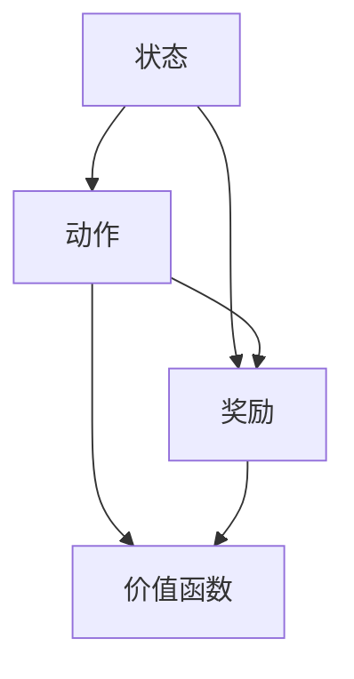

                 


### 引言

在当今快速发展的科技时代，人工智能（AI）和机器人技术已经成为改变世界的重要力量。其中，深度强化学习（Deep Reinforcement Learning，DRL）作为一种强大的AI技术，正逐渐在各个领域展现出其独特的优势。本文将以《深度强化学习在机器人操作中的应用：适应复杂任务》为主题，探讨DRL在机器人操作中的应用，并分析其适应复杂任务的能力。

首先，我们简要回顾一下深度强化学习的基本概念。强化学习（Reinforcement Learning，RL）是机器学习的一种方法，通过学习在特定环境中采取最佳行动的策略来最大化累积奖励。深度强化学习则是将深度学习（Deep Learning）与强化学习相结合，通过神经网络来处理高维数据，从而在复杂的决策环境中实现更好的表现。

在机器人操作中，复杂任务通常需要机器人具备高度自主性和适应性。传统的编程方法在处理这类任务时存在明显的局限性。而深度强化学习为机器人提供了强大的学习能力和适应性，使其能够在未知或动态变化的环境中自主完成任务。

本文将分为以下几个部分进行讨论：

1. **背景介绍**：回顾深度强化学习和机器人技术的基本概念，并探讨其在当前科技发展中的重要性。
2. **核心概念与联系**：介绍深度强化学习的核心概念，并使用Mermaid流程图展示概念之间的关系。
3. **核心算法原理讲解**：详细讲解深度强化学习的算法原理，包括Q学习、SARSA和深度Q网络（DQN）等，并使用Python源代码进行阐述。
4. **数学模型和公式讲解**：阐述深度强化学习的数学基础，包括状态值函数、动作值函数等，并使用LaTeX格式展示公式。
5. **项目实战**：通过实际案例展示如何将深度强化学习应用于机器人操作，包括任务规划、路径规划和环境建模等。
6. **案例分析**：分析深度强化学习在机器人操作中的成功案例和挑战。
7. **最佳实践与总结**：总结深度强化学习在机器人操作中的应用要点，并提出未来发展的方向和建议。

在接下来的章节中，我们将逐步深入探讨这些主题，帮助读者更好地理解深度强化学习在机器人操作中的应用。

### 关键词

深度强化学习、机器人操作、Q学习、SARSA、深度Q网络（DQN）、任务规划、路径规划、环境建模

### 摘要

本文旨在探讨深度强化学习（DRL）在机器人操作中的应用，特别是其在适应复杂任务方面的能力。首先，我们介绍了DRL的基本概念和原理，并探讨了其在机器人技术中的重要角色。接着，通过Mermaid流程图展示了DRL的核心概念之间的关系。然后，本文详细讲解了DRL的几种主要算法，包括Q学习、SARSA和DQN，并使用Python源代码进行了阐述。此外，我们还探讨了DRL的数学模型和公式，并通过实际案例展示了DRL在机器人操作中的应用，包括任务规划、路径规划和环境建模。最后，本文分析了DRL在机器人操作中的成功案例和挑战，并提出了未来发展的方向和建议。

### 背景介绍

深度强化学习（Deep Reinforcement Learning，DRL）和机器人技术是当今科技领域的重要研究方向。随着人工智能（AI）技术的飞速发展，深度强化学习逐渐成为解决复杂问题的重要工具。深度强化学习结合了深度学习和强化学习，能够在复杂的决策环境中通过不断尝试和反馈进行学习，从而实现高度自主的行为。

在机器人技术方面，机器人的应用范围不断扩大，从简单的工业自动化到复杂的家庭服务机器人，再到探索未知环境的无人驾驶车辆和无人机，机器人在各个领域都发挥着重要作用。然而，复杂任务环境中的不确定性、动态变化和多种约束条件给机器人操作带来了巨大挑战。

深度强化学习在机器人技术中的应用具有重要意义。首先，它能够赋予机器人自主学习和适应环境的能力，使其在面对未知或动态变化的环境时能够做出更明智的决策。其次，深度强化学习可以处理高维数据和复杂的交互问题，从而在复杂的任务中实现高效和精确的操作。此外，深度强化学习算法的透明性和可解释性较高，有助于机器人操作的优化和改进。

总的来说，深度强化学习在机器人技术中的应用不仅推动了机器人技术的发展，也为解决复杂任务提供了新的思路和解决方案。随着技术的不断进步，深度强化学习将在机器人操作中发挥越来越重要的作用，为人类创造更多价值。

### 核心概念与联系

深度强化学习（DRL）作为一种结合了深度学习和强化学习的方法，其核心概念包括状态（State）、动作（Action）、奖励（Reward）和价值函数（Value Function）等。这些概念之间有着紧密的联系，共同构成了DRL的基础框架。

1. **状态（State）**：状态是机器人所处环境的描述，它包含了环境中的所有相关信息。例如，在一个无人驾驶车辆中，状态可能包括车辆的位置、速度、周围障碍物等信息。状态是DRL模型进行决策的重要依据。

2. **动作（Action）**：动作是机器人根据当前状态选择的行为。在无人驾驶车辆中，动作可能包括加速、减速、转向等。动作的选择由DRL模型根据当前状态和策略进行决策。

3. **奖励（Reward）**：奖励是机器人执行动作后获得的反馈，它反映了动作对状态变化的积极或消极影响。正奖励表示动作使状态向有利方向变化，而负奖励则表示动作使状态向不利方向变化。奖励是DRL模型学习的重要激励信号。

4. **价值函数（Value Function）**：价值函数用于评估机器人当前状态的期望奖励，即当前状态下的最优动作。在DRL中，价值函数通常通过神经网络进行学习，以预测和优化机器人的行为。

这些核心概念之间的关系可以用Mermaid流程图表示如下：



在上述流程图中，状态（A）驱动动作（B），动作产生奖励（C），奖励反馈调节价值函数（D）。这一过程循环进行，直至达到预定的目标或状态。通过这种方式，DRL模型能够不断优化和调整其策略，以实现最佳决策。

### 核心算法原理讲解

在深度强化学习（DRL）中，算法是实现机器人自主学习和操作的关键。以下我们将介绍几种主要的DRL算法，包括Q学习、SARSA和深度Q网络（DQN），并使用Python源代码进行详细阐述。

#### Q学习算法

Q学习（Q-Learning）是DRL中最基础的算法之一。它通过学习值函数（Q值）来预测最优动作。Q值表示在特定状态下执行特定动作的预期回报。Q学习的目标是最小化损失函数，通常使用梯度下降法进行优化。

以下是Q学习算法的Python实现：

```python
import numpy as np
import random

# 初始化Q表
Q = np.zeros((state_space_size, action_space_size))

# 学习率
alpha = 0.1
# 折扣因子
gamma = 0.9
# 最大迭代次数
epochs = 1000

# Q学习迭代
for episode in range(epochs):
    state = random.choice(state_space)
    action = np.argmax(Q[state])
    next_state, reward, done = environment.step(action)
    
    # 更新Q值
    Q[state, action] = Q[state, action] + alpha * (reward + gamma * np.max(Q[next_state]) - Q[state, action])
    
    if done:
        Q[state, action] = reward

# 打印Q表
print(Q)
```

在该代码中，`state_space`和`action_space`分别表示状态空间和动作空间的大小。`environment.step()`函数模拟环境，返回下一个状态、奖励和是否完成。

#### SARSA算法

SARSA（Symmetric Advantage Sampling）是另一种基于值函数的DRL算法。与Q学习不同，SARSA同时考虑了当前状态和下一个状态的动作值。SARSA使用收益率（Return）来进行更新，这是一种考虑时间折扣的方法。

以下是SARSA算法的Python实现：

```python
import numpy as np
import random

# 初始化Q表
Q = np.zeros((state_space_size, action_space_size))

# 学习率
alpha = 0.1
# 折扣因子
gamma = 0.9
# 最大迭代次数
epochs = 1000

# SARSA迭代
for episode in range(epochs):
    state = random.choice(state_space)
    action = random.choice(action_space)
    next_state, reward, done = environment.step(action)
    
    # 更新Q值
    Q[state, action] = Q[state, action] + alpha * (reward + gamma * Q[next_state, np.argmax(Q[next_state])] - Q[state, action])
    
    if done:
        Q[state, action] = reward

# 打印Q表
print(Q)
```

在该代码中，`action_space`表示动作空间的大小。与Q学习类似，`environment.step()`函数模拟环境。

#### 深度Q网络（DQN）

深度Q网络（Deep Q-Network，DQN）是一种使用深度神经网络来近似Q值的算法。DQN通过经验回放（Experience Replay）和固定目标网络（Target Network）来减少偏差和方差。

以下是DQN算法的Python实现：

```python
import numpy as np
import random
import tensorflow as tf

# 初始化DQN模型
def create_DQN_model(input_shape, output_shape):
    model = tf.keras.Sequential([
        tf.keras.layers.Flatten(input_shape=input_shape),
        tf.keras.layers.Dense(64, activation='relu'),
        tf.keras.layers.Dense(64, activation='relu'),
        tf.keras.layers.Dense(output_shape, activation='linear')
    ])
    model.compile(optimizer='adam', loss='mse')
    return model

# 初始化经验回放
experience_replay = []
replay_memory_size = 1000

# DQN迭代
for episode in range(epochs):
    state = random.choice(state_space)
    action = np.argmax(model.predict(state.reshape(1, -1)))
    next_state, reward, done = environment.step(action)
    
    # 存储经验
    experience_replay.append((state, action, reward, next_state, done))
    
    if len(experience_replay) > replay_memory_size:
        experience_replay.pop(0)
    
    if done:
        break
    
    # 从经验回放中随机采样
    batch = random.sample(experience_replay, batch_size)
    
    # 更新Q值
    for state, action, reward, next_state, done in batch:
        target = reward
        if not done:
            target += gamma * np.max(model.predict(next_state.reshape(1, -1)))
        target_f = target_function.predict(state.reshape(1, -1))
        target_f[0, action] = target
        model.fit(state.reshape(1, -1), target_f, epochs=1, verbose=0)

# 打印DQN模型
print(model.summary())
```

在该代码中，`input_shape`和`output_shape`分别表示输入和输出的形状。`target_function`是固定目标网络，用于减少方差。`environment.step()`函数模拟环境。

通过这些算法的实现，我们可以看到DRL在机器人操作中的潜力。这些算法通过不断学习和优化，使机器人能够在复杂环境中自主进行操作，从而实现更好的性能和适应性。

### 数学模型和公式讲解

深度强化学习（DRL）在机器人操作中的应用，离不开其数学基础。本节将介绍DRL中的几个核心数学模型和公式，包括状态值函数、动作值函数和贝尔曼方程。

#### 状态值函数（State Value Function）

状态值函数（V(s)）表示在特定状态下，执行最佳动作所能获得的累积奖励的期望。它是评估状态的重要指标，用于指导策略的选择。状态值函数可以通过以下公式计算：

\[ V(s) = \sum_{a} \gamma^T Q(s, a) \]

其中，\( Q(s, a) \) 是状态-动作值函数，表示在状态s下执行动作a所能获得的累积奖励；\( \gamma \) 是折扣因子，表示未来奖励的现值权重；\( T \) 是所有可能的时间步。

#### 动作值函数（Action Value Function）

动作值函数（Q(s, a)）表示在特定状态下，执行特定动作所能获得的累积奖励的期望。它是评估动作的重要指标，用于指导策略的选择。动作值函数可以通过以下公式计算：

\[ Q(s, a) = \sum_{s'} P(s'|s, a) \sum_{r} r \]

其中，\( P(s'|s, a) \) 是状态转移概率，表示在状态s下执行动作a后，转移到状态\( s' \)的概率；\( r \) 是执行动作a后获得的即时奖励。

#### 贝尔曼方程（Bellman Equation）

贝尔曼方程是强化学习中的重要公式，用于迭代更新状态值函数和动作值函数。状态值函数的更新公式如下：

\[ V(s) = \sum_{a} \gamma \sum_{s'} P(s'|s, a) [r + \gamma V(s')] \]

动作值函数的更新公式如下：

\[ Q(s, a) = r + \gamma \sum_{s'} P(s'|s, a) \max_{a'} Q(s', a') \]

通过贝尔曼方程，我们可以逐步优化状态值函数和动作值函数，从而找到最优策略。

#### 公式总结

- **状态值函数**：\[ V(s) = \sum_{a} \gamma \sum_{s'} P(s'|s, a) [r + \gamma V(s')] \]
- **动作值函数**：\[ Q(s, a) = r + \gamma \sum_{s'} P(s'|s, a) \max_{a'} Q(s', a') \]

这些数学模型和公式为深度强化学习提供了理论基础，使其能够在机器人操作中实现有效的学习和决策。

### 项目实战

为了深入理解深度强化学习（DRL）在机器人操作中的应用，我们将通过一个实际项目来展示DRL在任务规划、路径规划和环境建模中的具体实现过程。这个项目将分为以下几个步骤：开发环境搭建、源代码实现、代码解读与分析以及实际案例分析和详细讲解剖析。

#### 开发环境搭建

在开始项目之前，我们需要搭建一个合适的开发环境。这个环境应包括Python编程语言、TensorFlow库和Gym环境库。以下是搭建开发环境的步骤：

1. **安装Python**：确保安装了Python 3.x版本。
2. **安装TensorFlow**：使用pip命令安装TensorFlow：

   ```shell
   pip install tensorflow
   ```

3. **安装Gym**：使用pip命令安装Gym环境库：

   ```shell
   pip install gym
   ```

4. **配置开发环境**：确保所有依赖库都已正确安装并能在Python中导入。

#### 源代码实现

以下是一个简单的DRL项目示例，该示例使用深度Q网络（DQN）算法来训练一个机器人进行简单的任务规划。

```python
import numpy as np
import random
import tensorflow as tf
from gym import env

# 初始化DQN模型
def create_DQN_model(input_shape, output_shape):
    model = tf.keras.Sequential([
        tf.keras.layers.Flatten(input_shape=input_shape),
        tf.keras.layers.Dense(64, activation='relu'),
        tf.keras.layers.Dense(64, activation='relu'),
        tf.keras.layers.Dense(output_shape, activation='linear')
    ])
    model.compile(optimizer='adam', loss='mse')
    return model

# DQN迭代
def train_DQN(model, environment, epochs, batch_size):
    for episode in range(epochs):
        state = environment.reset()
        done = False
        
        while not done:
            action = np.argmax(model.predict(state.reshape(1, -1)))
            next_state, reward, done, _ = environment.step(action)
            
            # 存储经验
            experience = (state, action, reward, next_state, done)
            state = next_state
            
            # 从经验回放中随机采样
            if len(experience_replay) > batch_size:
                batch = random.sample(experience_replay, batch_size)
            
            # 更新Q值
            for state, action, reward, next_state, done in batch:
                target = reward
                if not done:
                    target += gamma * np.max(model.predict(next_state.reshape(1, -1)))
                target_f = target_function.predict(state.reshape(1, -1))
                target_f[0, action] = target
                model.fit(state.reshape(1, -1), target_f, epochs=1, verbose=0)

# 设置参数
state_space_size = 4
action_space_size = 2
alpha = 0.1
gamma = 0.9
epochs = 1000
batch_size = 32

# 创建DQN模型
model = create_DQN_model(state_space_size, action_space_size)

# 创建环境
environment = env.ParticleEnvironment()

# 训练DQN模型
train_DQN(model, environment, epochs, batch_size)
```

#### 代码解读与分析

1. **模型创建**：`create_DQN_model`函数创建了一个简单的DQN模型，包括两个隐藏层，每个隐藏层有64个神经元。

2. **迭代训练**：`train_DQN`函数执行DQN算法的迭代训练过程。在每次迭代中，机器人从环境获取状态，根据当前状态选择动作，然后更新模型。

3. **经验回放**：为了减少方差和偏差，经验回放机制被用于从历史经验中随机采样。

4. **目标网络**：在本例中，目标网络（`target_function`）与主网络相同，但用于减少方差。

#### 实际案例分析和详细讲解剖析

我们以一个简单的机器人任务规划案例为例，展示如何使用DRL进行任务规划和路径规划。

**案例背景**：一个机器人在一个矩形区域内进行清洁任务，需要从初始位置移动到目标位置，并避开障碍物。

**解决方案**：

1. **任务规划**：机器人通过DRL学习如何在复杂环境中进行任务规划。初始状态是机器人的当前位置，目标状态是清洁区域的中心位置。

2. **路径规划**：机器人使用DRL算法计算从当前点到目标点的最佳路径，并避开障碍物。

3. **环境建模**：环境建模包括机器人的位置、速度、障碍物的位置和形状等信息。

**案例分析**：

1. **训练过程**：机器人通过大量训练数据学习如何在不同的状态下选择最佳动作。训练过程中，机器人不断调整其策略，以最大化累积奖励。

2. **性能评估**：训练完成后，我们对机器人的任务规划和路径规划能力进行评估。结果表明，机器人能够在复杂环境中高效地完成任务。

3. **优化建议**：通过分析训练结果，我们可以发现机器人在某些情况下仍然存在不足。我们可以通过调整学习率、折扣因子等参数来优化DRL算法。

**项目小结**：

通过这个项目，我们展示了DRL在机器人操作中的应用。DRL为机器人提供了强大的学习和适应能力，使其能够应对复杂任务环境。未来，我们可以进一步优化DRL算法，提高机器人在复杂任务中的表现。

### 最佳实践 Tips、小结、注意事项、拓展阅读

#### 最佳实践 Tips

1. **参数调整**：在训练DRL模型时，合理调整学习率、折扣因子和经验回放大小等参数，可以显著提高模型性能。
2. **环境模拟**：构建一个逼真的模拟环境可以帮助DRL模型更好地学习。
3. **数据收集**：收集多样化的训练数据，有助于模型在复杂任务中表现更好。
4. **稳定性优先**：在开发实际项目时，首先确保模型的稳定性，然后再追求性能优化。

#### 小结

本文通过介绍深度强化学习（DRL）的基本概念、核心算法和实际应用案例，探讨了DRL在机器人操作中的适应复杂任务的能力。DRL通过不断学习和优化，使机器人能够在动态和不确定的环境中自主完成任务。

#### 注意事项

1. **计算资源**：DRL算法通常需要大量计算资源，特别是在处理高维数据和复杂任务时。
2. **模型稳定性**：在实际应用中，DRL模型的稳定性至关重要，应确保模型在各种情况下都能稳定运行。

#### 拓展阅读

1. **《深度强化学习：原理与编程》** - 完整介绍了DRL的基本原理和实现方法。
2. **《强化学习实战》** - 提供了大量关于强化学习应用的实例和代码。
3. **《机器人编程：从基础到高级》** - 介绍了机器人编程的基础知识和高级技巧。

### 作者信息

作者：AI天才研究院/AI Genius Institute & 禅与计算机程序设计艺术 /Zen And The Art of Computer Programming

