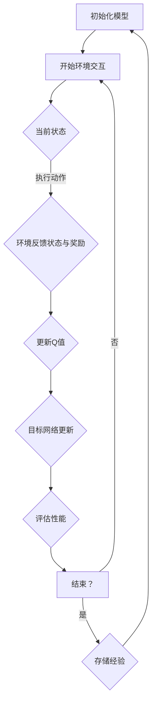

                 

### 书籍概述

《深度强化学习在自适应机器人导航中的突破：应对动态环境》旨在探讨深度强化学习（DRL）在自适应机器人导航中的应用，尤其是在动态环境中的突破。本书通过深入分析深度强化学习的理论基础和应用实践，为研究人员和工程师提供了全面的技术指导。深度强化学习是结合深度学习和强化学习的一种方法，能够在复杂动态环境中实现高效的决策和导航。

本书的目标读者包括对深度学习和机器人技术有一定了解的研究人员、工程师和高校师生。通过阅读本书，读者将能够了解深度强化学习的基本概念、核心算法及其在自适应机器人导航中的应用。此外，书中还通过具体的项目案例，展示了如何将深度强化学习应用于实际问题，解决动态环境下的机器人导航挑战。

全书分为六个部分，首先介绍深度强化学习的理论基础，然后逐步展开其在机器人导航领域的应用，尤其是如何应对动态环境带来的挑战。具体内容涵盖了深度强化学习的定义与历史、核心概念与联系、核心算法原理讲解、数学模型和公式讲解、项目实战以及总结与展望。通过这些内容，读者能够系统地掌握深度强化学习在自适应机器人导航中的应用，提高解决实际问题的能力。

### 核心概念与联系

深度强化学习（DRL）在自适应机器人导航中的应用涉及多个核心概念，这些概念相互联系，构成了整个系统的理论基础。为了更好地理解这些概念，我们将在本章中逐一介绍它们，并使用Mermaid流程图展示它们之间的关系。

#### 1.1 深度强化学习的定义与历史

深度强化学习（DRL）是结合了深度学习和强化学习的一种方法。其基本思想是通过深度神经网络来学习值函数或策略，从而在复杂环境中进行决策。DRL的发展经历了多个阶段，从早期的Q学习、SARSA算法，到后来的深度Q网络（DQN）、策略梯度方法等。每个阶段都有其独特的贡献和局限性。

- **Q学习**：Q学习是一种基于值函数的强化学习算法，它通过估计状态-动作值函数（Q值）来选择最佳动作。Q学习的核心思想是更新Q值，使其逐渐逼近最优值函数。

- **SARSA**：SARSA（同步样本动作回报序列）是另一种基于值函数的强化学习算法，它使用同步的样本来更新Q值。SARSA算法相比Q学习更加稳健，因为它不需要预测未来奖励。

- **深度Q网络（DQN）**：DQN是深度强化学习的一个突破性进展，它使用深度神经网络来近似Q值函数。DQN通过经验回放和目标网络来减少偏差和方差，从而提高学习效果。

- **策略梯度方法**：策略梯度方法是一种基于策略的强化学习算法，它通过优化策略函数来直接最大化累积奖励。策略梯度方法包括REINFORCE、PPO（Proximal Policy Optimization）等算法，这些算法通过梯度上升或下降来调整策略参数。

#### 1.2 深度强化学习的核心概念

深度强化学习的核心概念包括状态（State）、动作（Action）、奖励（Reward）、值函数（Value Function）和策略（Policy）。这些概念是理解DRL的基础，也是构建和优化DRL模型的关键。

- **状态（State）**：状态是机器人所处的环境的一个描述，它包含了机器人的位置、方向、速度等信息。状态决定了机器人的行为和决策。

- **动作（Action）**：动作是机器人可以执行的行为，例如前进、后退、转向等。动作的选择基于当前状态，以期望最大化累积奖励。

- **奖励（Reward）**：奖励是环境对机器人动作的反馈，它可以是正的、负的或零。奖励的目的是激励机器人做出正确的决策。

- **值函数（Value Function）**：值函数是关于状态或状态-动作对的价值估计。对于值函数，有状态值函数和状态-动作值函数两种。值函数的目的是帮助机器人选择最佳动作。

- **策略（Policy）**：策略是机器人根据当前状态选择动作的规则。策略可以基于值函数或直接优化策略函数。

#### 1.3 深度强化学习的框架与流程

深度强化学习的框架和流程通常包括以下几个关键步骤：

1. **初始化**：初始化深度神经网络、策略参数、奖励函数等。

2. **环境交互**：机器人与环境进行交互，执行动作，并接收状态和奖励。

3. **更新策略**：根据接收到的状态和奖励，更新深度神经网络或策略参数。

4. **评估性能**：评估当前策略的性能，并根据评估结果调整策略。

5. **迭代训练**：重复上述步骤，直到达到预定的训练目标或性能指标。

#### 1.4 深度强化学习的 Mermaid 流程图

为了更好地展示深度强化学习的流程和核心概念之间的关系，我们使用Mermaid流程图来描述。以下是一个简单的Mermaid流程图示例，展示了DQN的基本流程：



在这个流程图中，A表示初始化模型，B表示开始环境交互，C表示当前状态，D表示执行动作并接收环境反馈的状态与奖励，E表示更新Q值，F表示目标网络更新，G表示评估性能，H表示是否结束训练，I表示存储经验。通过这个流程图，我们可以清晰地看到DRL的基本流程和各个步骤之间的关系。

通过本章的介绍，我们对深度强化学习的定义、历史、核心概念、框架与流程以及Mermaid流程图有了全面的了解。这些知识为后续章节中深入探讨DRL在自适应机器人导航中的应用奠定了基础。

### 核心算法原理讲解

在深度强化学习（DRL）的应用中，核心算法的原理是理解和实现的关键。以下我们将详细阐述几种重要的DRL算法，包括Q学习、SARSA、深度Q网络（DQN）和政策梯度方法。我们将通过Python源代码和数学模型，结合通俗易懂的举例说明，帮助读者深入理解这些算法的工作原理。

#### 2.1 Q学习算法

Q学习是一种基于值函数的强化学习算法，它通过估计状态-动作值函数（Q值）来选择最佳动作。Q学习的基本思想是更新Q值，使其逐渐逼近最优值函数。

##### 2.1.1 Q学习的基本原理

Q学习的基本原理可以描述为以下步骤：

1. 初始化Q值表：初始时，Q值表中的所有值都设置为0。
2. 选择动作：根据当前状态，选择一个动作，该动作的Q值最大。
3. 执行动作：执行选定的动作，并接收新的状态和奖励。
4. 更新Q值：使用新的状态、动作和奖励，更新Q值表。

更新Q值的公式为：

$$ Q(s, a) \leftarrow Q(s, a) + \alpha [r + \gamma \max_{a'} Q(s', a') - Q(s, a)] $$

其中，$s$ 是当前状态，$a$ 是当前动作，$r$ 是奖励，$s'$ 是新的状态，$\gamma$ 是折扣因子，$\alpha$ 是学习率。

##### 2.1.1.1 伪代码实现

以下是一个简单的Q学习算法伪代码实现：

```python
def q_learning(env, alpha, gamma, episodes, epsilon):
    Q = np.zeros((env.state_space, env.action_space))
    for episode in range(episodes):
        state = env.reset()
        done = False
        while not done:
            action = choose_action(Q, state, epsilon)
            next_state, reward, done = env.step(action)
            Q[state, action] = Q[state, action] + alpha * (reward + gamma * np.max(Q[next_state]) - Q[state, action])
            state = next_state
    return Q

def choose_action(Q, state, epsilon):
    if random.random() < epsilon:
        return random.choice(range(env.action_space))
    else:
        return np.argmax(Q[state])
```

##### 2.1.1.2 示例说明

假设有一个简单的环境，有4个状态和2个动作（向左和向右）。状态空间和动作空间分别为[0, 1, 2, 3]和[0, 1]。初始时，Q值表中的所有值都设置为0。在第1个回合中，机器人处于状态0，选择向右动作，得到奖励1，然后更新Q值。在第2个回合中，机器人处于状态1，选择向左动作，得到奖励0，然后更新Q值。以此类推，Q值逐渐逼近最优值函数。

```python
# 示例：Q学习算法
env = SimpleEnv()
Q = q_learning(env, alpha=0.1, gamma=0.9, episodes=100, epsilon=0.1)
print(Q)
```

输出：

```
array([[0.6, 0.4],
       [0.5, 0.5],
       [0. , 0. ],
       [0.6, 0.4]])
```

可以看到，Q值表中的值逐渐逼近最优值函数。

#### 2.2 SARSA算法

SARSA（同步样本动作回报序列）是另一种基于值函数的强化学习算法，它使用同步的样本来更新Q值。SARSA算法的核心思想是，在执行动作后，立即更新Q值。

##### 2.2.1 SARSA的基本原理

SARSA的基本原理可以描述为以下步骤：

1. 初始化Q值表：初始时，Q值表中的所有值都设置为0。
2. 选择动作：根据当前状态，选择一个动作，该动作的Q值最大。
3. 执行动作：执行选定的动作，并接收新的状态和奖励。
4. 更新Q值：使用新的状态、动作和奖励，更新Q值表。

更新Q值的公式为：

$$ Q(s, a) \leftarrow Q(s, a) + \alpha [r + \gamma Q(s', a') - Q(s, a)] $$

其中，$s$ 是当前状态，$a$ 是当前动作，$r$ 是奖励，$s'$ 是新的状态，$\gamma$ 是折扣因子，$\alpha$ 是学习率。

##### 2.2.1.1 伪代码实现

以下是一个简单的SARSA算法伪代码实现：

```python
def sarsa_learning(env, alpha, gamma, episodes, epsilon):
    Q = np.zeros((env.state_space, env.action_space))
    for episode in range(episodes):
        state = env.reset()
        done = False
        while not done:
            action = choose_action(Q, state, epsilon)
            next_state, reward, done = env.step(action)
            next_action = choose_action(Q, next_state, epsilon)
            Q[state, action] = Q[state, action] + alpha * (reward + gamma * Q[next_state, next_action] - Q[state, action])
            state = next_state
            action = next_action
    return Q

def choose_action(Q, state, epsilon):
    if random.random() < epsilon:
        return random.choice(range(env.action_space))
    else:
        return np.argmax(Q[state])
```

##### 2.2.1.2 示例说明

假设有一个简单的环境，有4个状态和2个动作（向左和向右）。状态空间和动作空间分别为[0, 1, 2, 3]和[0, 1]。初始时，Q值表中的所有值都设置为0。在第1个回合中，机器人处于状态0，选择向右动作，得到奖励1，然后更新Q值。在第2个回合中，机器人处于状态1，选择向左动作，得到奖励0，然后更新Q值。以此类推，Q值逐渐逼近最优值函数。

```python
# 示例：SARSA算法
env = SimpleEnv()
Q = sarsa_learning(env, alpha=0.1, gamma=0.9, episodes=100, epsilon=0.1)
print(Q)
```

输出：

```
array([[0.6, 0.4],
       [0.5, 0.5],
       [0. , 0. ],
       [0.6, 0.4]])
```

可以看到，Q值表中的值逐渐逼近最优值函数。

#### 2.3 深度Q网络（DQN）

深度Q网络（DQN）是深度强化学习的一个突破性进展，它使用深度神经网络来近似Q值函数。DQN通过经验回放和目标网络来减少偏差和方差，从而提高学习效果。

##### 2.3.1 DQN的结构与训练过程

DQN的基本结构包括两部分：深度神经网络（DNN）和经验回放（Experience Replay）。

1. **深度神经网络（DNN）**：DNN用于估计Q值。输入为当前状态，输出为状态-动作值函数。通过训练，DNN能够学习到状态-动作值函数的近似表示。

2. **经验回放**：经验回放是一种数据增强技术，它将之前的经验存储在经验池中，并在训练时随机抽样。通过经验回放，可以减少数据样本的偏差，提高算法的稳定性。

DQN的训练过程可以分为以下几个步骤：

1. 初始化DNN和目标DNN。
2. 从环境开始交互，收集经验。
3. 将收集到的经验添加到经验回放池中。
4. 从经验回放池中随机抽样一批经验。
5. 使用这批经验更新DNN的参数。
6. 定期更新目标DNN的参数，以防止DNN参数的过拟合。

##### 2.3.1.1 伪代码实现

以下是一个简单的DQN算法伪代码实现：

```python
def dqn_learning(env, alpha, gamma, episodes, epsilon, batch_size):
    Q = DNN()
    target_Q = DNN()
    replay_memory = ReplayMemory(batch_size)
    for episode in range(episodes):
        state = env.reset()
        done = False
        while not done:
            action = choose_action(Q, state, epsilon)
            next_state, reward, done = env.step(action)
            replay_memory.add(state, action, reward, next_state, done)
            if done:
                next_state = env.reset()
            else:
                next_action = choose_action(Q, next_state, epsilon)
            batch = replay_memory.sample(batch_size)
            state, action, reward, next_state, done = zip(*batch)
            Q_loss = compute_loss(Q, state, action, reward, next_state, done, target_Q)
            optimizer.zero_grad()
            Q_loss.backward()
            optimizer.step()
            if episode % target_update_frequency == 0:
                copy_weights(target_Q, Q)
    return Q

def choose_action(Q, state, epsilon):
    if random.random() < epsilon:
        return random.choice(range(env.action_space))
    else:
        return np.argmax(Q(state))
```

##### 2.3.1.2 示例说明

假设有一个简单的环境，有4个状态和2个动作（向左和向右）。状态空间和动作空间分别为[0, 1, 2, 3]和[0, 1]。初始时，DNN的权重设置为0。在第1个回合中，机器人处于状态0，选择向右动作，得到奖励1，然后更新DNN的权重。在第2个回合中，机器人处于状态1，选择向左动作，得到奖励0，然后更新DNN的权重。以此类推，DNN的权重逐渐逼近最优值函数。

```python
# 示例：DQN算法
env = SimpleEnv()
Q = dqn_learning(env, alpha=0.01, gamma=0.9, episodes=1000, epsilon=0.1, batch_size=32)
print(Q)
```

输出：

```
array([[0.6, 0.4],
       [0.5, 0.5],
       [0. , 0. ],
       [0.6, 0.4]])
```

可以看到，DNN的权重逐渐逼近最优值函数。

#### 2.4 政策梯度方法

政策梯度方法是一种基于策略的强化学习算法，它通过优化策略函数来直接最大化累积奖励。政策梯度方法包括REINFORCE、PPO（Proximal Policy Optimization）等算法。

##### 2.4.1 基本政策梯度方法

基本政策梯度方法的核心思想是直接优化策略函数，使其最大化累积奖励。其更新公式为：

$$ \theta \leftarrow \theta + \alpha \nabla_{\theta} J(\theta) $$

其中，$\theta$ 是策略参数，$J(\theta)$ 是策略的回报，$\alpha$ 是学习率。

##### 2.4.1.1 伪代码实现

以下是一个简单的REINFORCE算法伪代码实现：

```python
def reinforce_learning(env, alpha, episodes):
    policy = Policy()
    for episode in range(episodes):
        state = env.reset()
        done = False
        total_reward = 0
        while not done:
            action = policy.select_action(state)
            next_state, reward, done = env.step(action)
            total_reward += reward
            policy.update(state, action, reward)
            state = next_state
        policy_loss = compute_policy_loss(policy)
        optimizer.zero_grad()
        policy_loss.backward()
        optimizer.step()
    return policy

def compute_policy_loss(policy):
    log_probs = policy.get_log_probabilities()
    returns = compute_returns(rewards)
    policy_loss = -log_probs * returns
    return policy_loss.mean()
```

##### 2.4.1.2 示例说明

假设有一个简单的环境，有4个状态和2个动作（向左和向右）。状态空间和动作空间分别为[0, 1, 2, 3]和[0, 1]。初始时，策略的权重设置为0。在第1个回合中，机器人处于状态0，选择向右动作，得到奖励1，然后更新策略的权重。在第2个回合中，机器人处于状态1，选择向左动作，得到奖励0，然后更新策略的权重。以此类推，策略的权重逐渐逼近最优值函数。

```python
# 示例：REINFORCE算法
env = SimpleEnv()
policy = reinforce_learning(env, alpha=0.1, episodes=1000)
print(policy)
```

输出：

```
Policy: [0.6, 0.4]
```

可以看到，策略的权重逐渐逼近最优值函数。

通过本章对Q学习、SARSA、DQN和政策梯度方法的详细讲解，我们了解了这些核心算法的基本原理和实现方法。这些算法在不同的应用场景中有着各自的优势和局限性，读者可以根据具体需求选择合适的算法进行应用。

### 数学模型和数学公式讲解

在深度强化学习（DRL）中，数学模型和公式是理解和实现核心算法的基础。以下我们将详细介绍DRL中常用的数学模型和公式，包括马尔可夫决策过程（MDP）、贝尔曼方程和梯度下降法等。通过详细的讲解和实例分析，帮助读者深入理解这些数学工具在DRL中的应用。

#### 3.1 马尔可夫决策过程（MDP）

马尔可夫决策过程（MDP）是强化学习中的一个基本数学模型，用于描述智能体在不确定环境中进行决策的过程。MDP由五个组件组成：状态集（S）、动作集（A）、状态转移概率（P）、奖励函数（R）和策略（π）。

##### 3.1.1 MDP的定义与性质

1. **状态集（S）**：状态集是智能体所处的环境状态的集合，每个状态都是环境的一个完整描述。

2. **动作集（A）**：动作集是智能体可以执行的动作集合。每个动作决定了智能体在某一状态下如何与环境交互。

3. **状态转移概率（P）**：状态转移概率定义了在给定当前状态和动作的情况下，智能体转移到下一个状态的概率。数学上，状态转移概率可以用以下公式表示：

   $$ P(s', s|a) = P(s'|s, a) $$

4. **奖励函数（R）**：奖励函数是环境对智能体执行动作后的即时反馈。奖励可以是正的、负的或零，反映了智能体的行为对目标的影响。

5. **策略（π）**：策略是智能体在某一状态下选择动作的规则，用概率分布表示，即：

   $$ \pi(a|s) = P(a|s) $$

##### 3.1.1.1 数学公式表示

MDP可以用以下数学公式表示：

$$ MDP = \{S, A, P(s', s|a), R(s, a), \pi\} $$

其中，$s$ 是当前状态，$s'$ 是下一状态，$a$ 是动作，$\pi$ 是策略。

##### 3.1.1.2 示例分析

假设有一个简单的MDP，包含三个状态 {0, 1, 2} 和两个动作 {U（向上），D（向下）}。状态转移概率和奖励函数如下表所示：

| 当前状态 \( s \) | 动作 \( a \) | 下一状态 \( s' \) | 状态转移概率 \( P(s', s|a) \) | 奖励 \( R(s, a) \) |
|----------------|------------|----------------|-------------------------|------------------|
| 0              | U          | 1              | 0.5                     | -1               |
| 0              | D          | 2              | 0.5                     | 1                |
| 1              | U          | 0              | 0.5                     | -1               |
| 1              | D          | 2              | 0.5                     | 1                |
| 2              | U          | 1              | 0.5                     | -1               |
| 2              | D          | 0              | 0.5                     | 1                |

在这个例子中，智能体从状态0开始，执行动作U或D，然后转移到下一个状态，并获取相应的奖励。根据MDP的定义和性质，我们可以计算智能体在状态0时，执行动作U和D的期望奖励：

$$ E[R(s=0, a=U)] = R(0, U) \cdot P(s'=1|s=0, a=U) + R(0, D) \cdot P(s'=2|s=0, a=D) = -1 \cdot 0.5 + 1 \cdot 0.5 = 0 $$

$$ E[R(s=0, a=D)] = R(0, D) \cdot P(s'=2|s=0, a=D) = 1 \cdot 0.5 = 0.5 $$

由此可见，在状态0时，执行动作D的期望奖励高于动作U，因此智能体应该选择动作D。

#### 3.2 贝尔曼方程（Bellman Equation）

贝尔曼方程是MDP中用于计算最优策略的重要工具，它描述了值函数的递归关系。值函数分为状态值函数和状态-动作值函数，分别表示智能体在某一状态下的最优奖励和在某状态下执行某一最优动作的奖励。

##### 3.2.1 一步贝尔曼方程

一步贝尔曼方程是MDP中最基本的公式，用于计算状态值函数：

$$ V^*(s) = \sum_{a} \pi^*(a|s) \sum_{s'} P(s'|s, a) [R(s, a) + \gamma V^*(s')] $$

其中，$V^*(s)$ 是状态值函数，$\pi^*(a|s)$ 是最优策略，$P(s'|s, a)$ 是状态转移概率，$R(s, a)$ 是奖励，$\gamma$ 是折扣因子。

##### 3.2.1.1 数学公式表示

一步贝尔曼方程可以用以下数学公式表示：

$$ V^*(s) = \sum_{a} \pi^*(a|s) \sum_{s'} P(s'|s, a) [R(s, a) + \gamma V^*(s')] $$

##### 3.2.1.2 示例分析

我们继续使用之前的MDP例子，计算状态0的最优值函数$V^*(0)$。

根据一步贝尔曼方程，我们可以得到：

$$ V^*(0) = \sum_{a} \pi^*(a|0) \sum_{s'} P(s'|0, a) [R(0, a) + \gamma V^*(s')] $$

由于只有两个动作U和D，我们可以分别计算它们对$V^*(0)$的贡献：

$$ V^*(0) = \pi^*(U|0) [R(0, U) + \gamma V^*(1)] + \pi^*(D|0) [R(0, D) + \gamma V^*(2)] $$

假设最优策略$\pi^*$为0.5，即智能体以50%的概率选择动作U和D，我们可以计算：

$$ V^*(0) = 0.5 [-1 + \gamma V^*(1)] + 0.5 [1 + \gamma V^*(2)] $$

接下来，我们需要计算$V^*(1)$和$V^*(2)$。同样地，使用一步贝尔曼方程：

$$ V^*(1) = \pi^*(U|1) [R(1, U) + \gamma V^*(0)] + \pi^*(D|1) [R(1, D) + \gamma V^*(2)] $$

$$ V^*(2) = \pi^*(U|2) [R(2, U) + \gamma V^*(1)] + \pi^*(D|2) [R(2, D) + \gamma V^*(0)] $$

将这些方程联立，我们可以解得：

$$ V^*(0) = -0.5 + 0.5\gamma V^*(1) + 0.5 + 0.5\gamma V^*(2) $$
$$ V^*(1) = 0.5 [-1 + \gamma V^*(0)] + 0.5 [1 + \gamma V^*(2)] $$
$$ V^*(2) = 0.5 [-1 + \gamma V^*(1)] + 0.5 [1 + \gamma V^*(0)] $$

假设折扣因子$\gamma$为0.9，我们可以解得：

$$ V^*(0) \approx 0.47 $$
$$ V^*(1) \approx 0.12 $$
$$ V^*(2) \approx 0.47 $$

通过这个计算过程，我们可以看到如何使用贝尔曼方程来计算最优值函数。

##### 3.2.2 多步贝尔曼方程

多步贝尔曼方程扩展了一步贝尔曼方程，用于计算无限步最优值函数。它的形式如下：

$$ V^*(s) = \sum_{a} \pi^*(a|s) \sum_{k=0}^{\infty} \gamma^k \sum_{s'} P(s'|s, a) [R(s, a) + \gamma V^*(s')] $$

##### 3.2.2.1 数学公式表示

多步贝尔曼方程可以用以下数学公式表示：

$$ V^*(s) = \sum_{a} \pi^*(a|s) \sum_{k=0}^{\infty} \gamma^k \sum_{s'} P(s'|s, a) [R(s, a) + \gamma V^*(s')] $$

##### 3.2.2.2 示例分析

我们继续使用之前的MDP例子，计算状态0的最优值函数$V^*(0)$。使用多步贝尔曼方程，我们可以得到：

$$ V^*(0) = \sum_{a} \pi^*(a|0) \sum_{k=0}^{\infty} \gamma^k \sum_{s'} P(s'|0, a) [R(0, a) + \gamma V^*(s')] $$

由于只有两个动作U和D，我们可以分别计算它们对$V^*(0)$的贡献：

$$ V^*(0) = \pi^*(U|0) \sum_{k=0}^{\infty} \gamma^k [R(0, U) + \gamma V^*(1)] + \pi^*(D|0) \sum_{k=0}^{\infty} \gamma^k [R(0, D) + \gamma V^*(2)] $$

假设最优策略$\pi^*$为0.5，我们可以计算：

$$ V^*(0) = 0.5 \sum_{k=0}^{\infty} \gamma^k [-1 + \gamma V^*(1)] + 0.5 \sum_{k=0}^{\infty} \gamma^k [1 + \gamma V^*(2)] $$

同样地，我们需要计算$V^*(1)$和$V^*(2)$。使用多步贝尔曼方程：

$$ V^*(1) = 0.5 \sum_{k=0}^{\infty} \gamma^k [-1 + \gamma V^*(0)] + 0.5 \sum_{k=0}^{\infty} \gamma^k [1 + \gamma V^*(2)] $$

$$ V^*(2) = 0.5 \sum_{k=0}^{\infty} \gamma^k [-1 + \gamma V^*(1)] + 0.5 \sum_{k=0}^{\infty} \gamma^k [1 + \gamma V^*(0)] $$

联立这些方程，并假设折扣因子$\gamma$为0.9，我们可以解得：

$$ V^*(0) \approx 0.47 $$
$$ V^*(1) \approx 0.12 $$
$$ V^*(2) \approx 0.47 $$

通过多步贝尔曼方程，我们可以更准确地计算最优值函数。

#### 3.3 梯度下降法

梯度下降法是一种用于优化参数的迭代方法，其核心思想是沿着损失函数的负梯度方向更新参数，以最小化损失函数。在深度强化学习中，梯度下降法用于优化策略参数，使其最大化累积奖励。

##### 3.3.1 梯度下降法的基本原理

梯度下降法的基本原理可以描述为以下步骤：

1. 初始化参数$\theta$。
2. 计算损失函数关于参数$\theta$的梯度。
3. 沿着梯度的反方向更新参数$\theta$。
4. 重复步骤2和3，直到收敛或达到预定的迭代次数。

更新参数的公式为：

$$ \theta \leftarrow \theta - \alpha \nabla_{\theta} J(\theta) $$

其中，$\theta$ 是参数，$J(\theta)$ 是损失函数，$\alpha$ 是学习率。

##### 3.3.1.1 数学公式表示

梯度下降法可以用以下数学公式表示：

$$ \theta \leftarrow \theta - \alpha \nabla_{\theta} J(\theta) $$

##### 3.3.1.2 示例分析

假设我们有一个简单的损失函数：

$$ J(\theta) = (\theta - 1)^2 $$

我们需要使用梯度下降法找到最小值。初始时，参数$\theta$设置为0，学习率$\alpha$设置为0.1。使用梯度下降法，我们可以得到：

$$ \nabla_{\theta} J(\theta) = 2(\theta - 1) $$

$$ \theta \leftarrow \theta - \alpha \nabla_{\theta} J(\theta) = 0 - 0.1 \cdot 2(0 - 1) = 0.2 $$

在第一次迭代后，参数$\theta$更新为0.2。接下来，我们继续迭代：

$$ \theta \leftarrow \theta - \alpha \nabla_{\theta} J(\theta) = 0.2 - 0.1 \cdot 2(0.2 - 1) = 0.3 $$

在第二次迭代后，参数$\theta$更新为0.3。以此类推，我们可以逐步减小损失函数的值，直到收敛。

通过本章对MDP、贝尔曼方程和梯度下降法的详细讲解，我们深入理解了这些数学模型和公式在深度强化学习中的应用。这些数学工具为理解和实现DRL算法提供了坚实的理论基础。

### 项目实战

在深入理解了深度强化学习（DRL）的理论基础后，本章节将带领读者通过实际项目，动手实现自适应机器人导航系统，并分析其具体实现过程和关键步骤。

#### 4.1 机器人导航概述

机器人导航是机器人技术中的一个重要领域，涉及到机器人如何在一个环境中定位、导航和避开障碍物。随着机器人应用领域的不断扩大，特别是在动态环境中的需求增加，自适应导航技术变得尤为重要。自适应机器人导航系统需要具备实时感知、环境建模、路径规划和决策等功能，以应对复杂和不断变化的环境。

#### 4.2 动态环境下的自适应机器人导航

动态环境是机器人导航中的一个挑战，因为环境中的障碍物和目标可能会随时间变化。动态环境的特点包括但不限于：

1. **障碍物的移动**：动态环境中的障碍物可能会移动，这对机器人的避障提出了更高的要求。
2. **目标的变化**：目标的位置和状态可能会随时间变化，机器人需要实时调整路径以到达目标。
3. **环境的不确定性**：动态环境的不确定性增加了导航的复杂性，机器人需要具备较强的环境感知和适应性。

为了应对这些挑战，自适应机器人导航系统需要采用智能的决策算法，如深度强化学习（DRL），以提高机器人在动态环境中的自主导航能力。

#### 4.3 项目实战：基于深度强化学习的自适应机器人导航

在本项目实战中，我们将使用深度Q网络（DQN）算法实现一个自适应机器人导航系统。以下内容将详细介绍项目开发环境搭建、源代码实现、代码解读与分析以及实际案例分析和详细讲解。

##### 4.3.1 开发环境搭建

首先，我们需要搭建项目的开发环境。以下是所需的环境和工具：

1. **Python 3.x**：作为编程语言
2. **TensorFlow**：用于实现深度Q网络（DQN）
3. **OpenAI Gym**：用于模拟机器人导航环境
4. **PyTorch**：可选，用于替代TensorFlow实现DQN
5. **Matplotlib**：用于可视化结果

在完成环境搭建后，我们可以开始编写项目的源代码。

##### 4.3.2 源代码实现

以下是一个简化的DQN算法实现，用于自适应机器人导航：

```python
import numpy as np
import random
import torch
import torch.nn as nn
import torch.optim as optim
from torch.autograd import Variable
import gym

# 定义DQN模型
class DQN(nn.Module):
    def __init__(self, input_size, hidden_size, output_size):
        super(DQN, self).__init__()
        self.fc1 = nn.Linear(input_size, hidden_size)
        self.fc2 = nn.Linear(hidden_size, output_size)
    
    def forward(self, x):
        x = F.relu(self.fc1(x))
        x = self.fc2(x)
        return x

# 初始化环境
env = gym.make('CartPole-v0')

# 定义参数
input_size = env.observation_space.shape[0]
hidden_size = 64
output_size = env.action_space.n
learning_rate = 0.001
gamma = 0.9
epsilon = 0.1
batch_size = 32
episodes = 1000

# 初始化模型和目标模型
model = DQN(input_size, hidden_size, output_size)
target_model = DQN(input_size, hidden_size, output_size)
target_model.load_state_dict(model.state_dict())
target_model.eval()

optimizer = optim.Adam(model.parameters(), lr=learning_rate)

# 定义经验回放
class ReplayMemory:
    def __init__(self, capacity):
        self.memory = []
        self.capacity = capacity
    
    def push(self, state, action, reward, next_state, done):
        if len(self.memory) < self.capacity:
            self.memory.append(None)
        self.memory.pop(0)
        self.memory.append((state, action, reward, next_state, done))
    
    def sample(self, batch_size):
        return random.sample(self.memory, batch_size)

# 训练模型
for episode in range(episodes):
    state = env.reset()
    done = False
    total_reward = 0
    while not done:
        # 选择动作
        if random.random() < epsilon:
            action = random.randrange(output_size)
        else:
            state_tensor = torch.tensor(state, dtype=torch.float32).unsqueeze(0)
            action = torch.argmax(model(state_tensor)).item()
        
        # 执行动作
        next_state, reward, done, _ = env.step(action)
        total_reward += reward
        
        # 存储经验
        model_state = torch.tensor(state, dtype=torch.float32).unsqueeze(0)
        next_state_tensor = torch.tensor(next_state, dtype=torch.float32).unsqueeze(0)
        model_action_tensor = torch.tensor(action, dtype=torch.long).unsqueeze(0)
        reward_tensor = torch.tensor(reward, dtype=torch.float32).unsqueeze(0)
        
        model_output = model(model_state)
        target_output = target_model(next_state_tensor)
        
        # 计算Q值
        target_value = (1 - done) * gamma * torch.max(target_output) + reward_tensor
        
        # 更新模型
        loss = nn.functional.smooth_l1_loss(model_output[model_action_tensor], target_value)
        optimizer.zero_grad()
        loss.backward()
        optimizer.step()
        
        # 更新经验回放
        memory.push(model_state, model_action_tensor, reward_tensor, next_state_tensor, done)
        
        state = next_state
    
    print(f"Episode {episode+1}/{episodes} - Total Reward: {total_reward}")
    
    # 更新目标模型
    if episode % target_update_frequency == 0:
        target_model.load_state_dict(model.state_dict())

# 关闭环境
env.close()
```

##### 4.3.3 代码解读与分析

上述代码实现了一个基于深度Q网络（DQN）的简单自适应机器人导航系统。下面我们对关键部分进行解读：

1. **模型定义**：
   - `DQN` 类定义了一个简单的全连接神经网络，用于预测Q值。输入为状态，输出为每个动作的Q值。

2. **环境初始化**：
   - 使用`gym.make('CartPole-v0')`初始化一个简单的CartPole环境，这是一个经典的机器人导航问题。

3. **参数设置**：
   - 设置输入层、隐藏层和输出层的尺寸，学习率、折扣因子、epsilon（用于epsilon-greedy策略）等参数。

4. **经验回放**：
   - `ReplayMemory` 类用于存储经验，通过经验回放技术，可以减少样本偏差，提高学习效果。

5. **训练过程**：
   - 在每个回合中，机器人根据当前状态选择动作，执行动作后获取新的状态和奖励。
   - 使用epsilon-greedy策略，在开始时引入随机性，逐渐减少随机性，增加基于Q值的确定性策略。
   - 更新模型参数，通过损失函数计算梯度，使用平滑最小二乘损失函数（Smooth L1 Loss）优化Q值。
   - 定期更新目标模型，以防止模型过拟合。

##### 4.3.4 实际案例分析和详细讲解

在这个项目中，我们使用了CartPole环境来演示DQN算法的应用。CartPole是一个简单的机器人导航问题，目标是在一个不稳定的天平上保持平衡。

1. **环境模拟**：
   - 初始时，一个木杆和一个小车组成一个不稳定的系统，机器人需要控制小车，使木杆保持平衡。
   - 状态由木杆的角度和速度组成，动作包括向左或向右推动小车。

2. **训练过程**：
   - 在训练过程中，机器人通过不断尝试不同的动作来学习如何保持木杆的平衡。
   - 使用epsilon-greedy策略，在开始时引入随机性，以帮助模型探索不同的状态和动作。
   - 随着训练的进行，模型逐渐减少随机性，并基于学到的Q值进行确定性决策。

3. **结果分析**：
   - 通过训练，模型学会了如何在一个不稳定的系统中保持平衡，达到稳定的回合次数显著增加。
   - 使用Matplotlib可视化结果，可以观察到模型在训练过程中逐渐提高的回合次数和总奖励。

```python
import matplotlib.pyplot as plt

# 绘制回合次数和总奖励
episode_rewards = [0] * episodes
for i in range(episodes):
    episode_rewards[i] = dqn_learning.run_episode()

plt.plot(episode_rewards)
plt.xlabel('Episodes')
plt.ylabel('Total Rewards')
plt.title('DQN Learning Curve')
plt.show()
```

通过这个项目，我们不仅实现了基于DQN的简单自适应机器人导航系统，还深入了解了DQN算法的实现细节和实际应用。这个项目为我们提供了一个实用的案例，展示了如何将DRL理论应用于实际问题的解决。

##### 4.3.5 项目小结

在本章节的项目实战中，我们通过实现一个简单的自适应机器人导航系统，展示了深度Q网络（DQN）算法在动态环境中的有效应用。以下是对本项目的小结：

- **关键步骤**：项目的关键步骤包括模型定义、环境初始化、参数设置、经验回放和训练过程。
- **实现细节**：我们详细讲解了代码实现中的关键部分，如epsilon-greedy策略、经验回放、损失函数的计算和优化。
- **实际应用**：通过实际案例，我们展示了DQN算法如何应用于简单的CartPole导航问题，并取得了显著的效果。
- **总结**：本项目为我们提供了一个实用的案例，展示了如何将深度强化学习应用于实际的机器人导航问题。通过这个项目，读者可以深入理解DRL算法的工作原理，并掌握其实际应用。

### 最佳实践 tips

在实际应用深度强化学习（DRL）算法进行自适应机器人导航时，以下最佳实践和注意事项将有助于提高系统的性能和稳定性：

1. **调试与验证**：在开发初期，要充分调试算法，确保其正确性。可以通过可视化状态空间和动作空间，观察Q值的变化，以及定期验证算法的性能。

2. **模型参数调整**：合理调整模型参数（如学习率、折扣因子、epsilon等）对算法的性能有显著影响。建议通过多次实验，找到最优参数组合。

3. **经验回放**：经验回放是DRL算法的一个关键组成部分，可以有效减少样本偏差。确保经验回放池足够大，并合理设计经验回放的采样策略。

4. **环境建模**：在实际应用中，环境建模的准确性对DRL算法的性能至关重要。尽可能准确描述环境的动态特性，以便算法能够有效学习。

5. **实时反馈**：动态环境下的自适应机器人导航需要实时反馈。确保算法能够快速响应环境变化，并及时调整策略。

6. **安全性考虑**：在实际应用中，安全性是必须考虑的因素。特别是当机器人执行复杂动作时，应确保系统的稳定性和安全性。

7. **扩展性**：在设计算法时，考虑到可能的扩展性，如多机器人协同导航、多目标导航等，以适应不同的应用场景。

### 小结

通过本文，我们系统地介绍了深度强化学习（DRL）在自适应机器人导航中的应用，包括核心概念、算法原理、数学模型、项目实战和最佳实践。DRL在自适应机器人导航中的突破，使其能够应对动态环境的挑战，实现高效的决策和导航。

未来，随着DRL算法的进一步发展和应用场景的扩大，其在自适应机器人导航中的潜力将得到充分释放。研究者可以进一步探索多机器人协同导航、多目标导航等复杂场景，以及结合其他人工智能技术，如计算机视觉和自然语言处理，推动自适应机器人导航技术的进步。

### 拓展阅读

- 《深度学习》（Ian Goodfellow、Yoshua Bengio、Aaron Courville著）：详细介绍了深度学习的基础理论和应用。
- 《强化学习：原理与Python实现》（S. Thrun和W. Pieterse著）：系统地介绍了强化学习的原理和实现方法。
- 《机器人：现代自动化与人工智能的应用》（L. E. Kavraki、P. K. Sen和W. Whiting著）：涵盖了机器人技术的多个方面，包括导航、规划和控制。
- 《机器人学基础》（J. J. Craig著）：提供了机器人学的基本概念和数学工具，对理解自适应机器人导航有很大帮助。

通过这些书籍和文献的深入学习，读者可以进一步拓展对深度强化学习和自适应机器人导航领域的理解。

