                 

### 《混合现实技术在工业设计中的应用》

#### 关键词：混合现实、工业设计、算法、数学模型、项目实战

#### 摘要：本文深入探讨了混合现实技术在工业设计中的应用，从核心概念、算法原理、数学模型到项目实战，全面剖析了混合现实技术在产品设计、协同设计、用户体验优化和创新设计方法等方面的应用场景，为工业设计领域的技术创新提供新的思路和方向。

## **一、背景介绍**

### 1.1 混合现实技术的定义和发展

混合现实（Mixed Reality，简称MR）是一种结合真实世界和虚拟世界的交互体验。它不同于传统的虚拟现实（VR）和增强现实（AR），MR不仅提供了虚拟图像的增强，还能够将虚拟元素与现实世界中的物体进行互动。这一技术自20世纪90年代起便逐渐发展，随着计算机图形学、传感器技术和人工智能等领域的进步，混合现实技术逐渐走向成熟。

#### 1.1.1 混合现实技术的核心概念

混合现实技术的核心概念包括显示技术、空间感知、空间追踪和人机交互。显示技术负责将虚拟图像与真实世界融合；空间感知通过传感器获取周围环境的信息；空间追踪确保虚拟元素在现实世界中的准确位置；人机交互则提供了人与虚拟环境的交互方式。

#### 1.1.2 混合现实技术的发展历程

从早期的VRML和ActiveX控件，到近年的Unity和Unreal Engine，再到当前的HoloLens和Meta Quest Pro，混合现实技术经历了从简单的虚拟场景到复杂的交互系统的演变。近年来，随着5G网络的普及和人工智能的快速发展，混合现实技术正迎来新的发展机遇。

### 1.2 工业设计的现状和挑战

工业设计是产品从概念到成品的全过程，它不仅关注产品的功能性，还强调用户体验和美学设计。随着市场竞争的加剧，工业设计师面临着快速迭代、个性化定制和全球化协作等多重挑战。如何提高设计效率、降低成本并提升用户体验，成为工业设计领域亟待解决的问题。

#### 1.2.1 工业设计的主要目标

工业设计的主要目标是实现产品的功能性、用户体验和美学的和谐统一。功能性是产品的基础，用户体验是产品成败的关键，美学设计则赋予产品独特的视觉语言。

#### 1.2.2 工业设计的主要挑战

1. **快速迭代**：市场变化迅速，产品生命周期缩短，设计师需要不断提高设计速度。
2. **个性化定制**：消费者需求多样化，设计师需要满足不同用户群体的个性化需求。
3. **全球化协作**：设计团队分布在不同的地区，如何高效协作成为一大挑战。
4. **成本控制**：在保证设计质量的前提下，如何降低生产成本，提高市场竞争力。

### 1.3 混合现实技术在工业设计中的应用前景

混合现实技术为工业设计带来了新的机遇。通过虚拟模型与真实环境的互动，设计师可以更直观地评估设计效果，提高设计效率和准确性。此外，混合现实技术还可以支持协同设计、用户体验优化和创新设计方法，为工业设计提供更加丰富的工具和手段。

#### 1.3.1 产品设计与验证

混合现实技术可以帮助设计师在产品开发初期构建虚拟模型，通过虚拟现实与真实环境的互动，快速评估产品设计的可行性，减少物理样机制作的时间和成本。

#### 1.3.2 协同设计

混合现实技术支持多人实时协作，设计师可以远程参与设计讨论，共同修改和完善设计方案，提高设计效率。

#### 1.3.3 用户体验优化

通过虚拟现实技术，设计师可以模拟用户使用场景，评估产品的用户体验，优化交互设计，提升用户满意度。

#### 1.3.4 创新设计方法

混合现实技术为设计师提供了更加灵活的设计工具和实验平台，有助于探索和创新新的设计方法，推动设计领域的创新发展。

## **二、核心概念与联系**

### 2.1 混合现实技术的核心组件

#### 2.1.1 显示技术

显示技术是混合现实技术的核心组成部分，它决定了虚拟图像与真实世界的融合效果。常见的显示技术包括头戴式显示器（HMD）、透明显示屏和投影技术。

- **头戴式显示器（HMD）**：如微软的HoloLens、Meta的Quest Pro等，通过光学镜片将虚拟图像叠加在真实环境中，提供沉浸式的体验。
- **透明显示屏**：如Magic Leap的透明显示屏，通过反射光线将虚拟图像投射到透明屏幕上，与真实环境叠加。
- **投影技术**：如NVIDIA的IllumiRoom，通过将虚拟图像投影到房间的墙壁和家具上，扩展用户的视觉空间。

#### 2.1.2 空间感知技术

空间感知技术通过传感器获取周围环境的信息，包括位置、方向、距离等。这些信息对于混合现实技术中的虚拟图像与真实环境的交互至关重要。

- **惯性测量单元（IMU）**：如陀螺仪、加速度计和磁力计，用于测量设备的运动和方向。
- **深度传感器**：如结构光传感器、激光雷达和立体摄像头，用于测量设备与周围环境之间的距离。

#### 2.1.3 空间追踪技术

空间追踪技术确保虚拟元素在现实世界中的准确位置，包括静态追踪和动态追踪。

- **静态追踪**：通过标记或模型固定在真实环境中的物体，跟踪物体的位置和方向。
- **动态追踪**：通过实时计算和匹配，跟踪移动中的物体或人。

#### 2.1.4 人机交互技术

人机交互技术提供了人与虚拟环境之间的交互方式，包括手势识别、语音控制和眼动追踪等。

- **手势识别**：通过摄像头捕捉用户的手部动作，将其转换为虚拟交互操作。
- **语音控制**：通过语音识别技术，实现用户对虚拟环境的语音指令控制。
- **眼动追踪**：通过摄像头捕捉用户的眼动，实现虚拟界面和内容的自动调整。

### 2.2 混合现实技术在工业设计中的应用场景

#### 2.2.1 产品设计与验证

在产品设计与验证阶段，设计师可以利用混合现实技术创建虚拟产品模型，并通过与真实环境的互动，评估设计的可行性。以下是一个简单的Mermaid流程图，展示如何使用混合现实技术进行产品设计与验证：

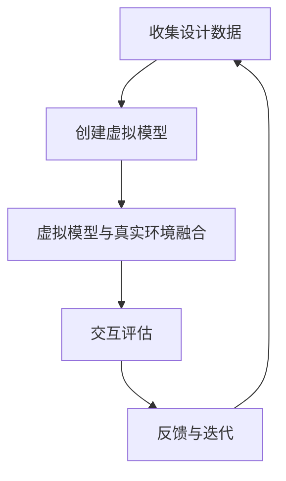

#### 2.2.2 协同设计

协同设计是混合现实技术在工业设计中的重要应用。设计师可以利用混合现实技术实现远程协作，共同修改和完善设计方案。以下是一个简单的Mermaid流程图，展示如何使用混合现实技术进行协同设计：

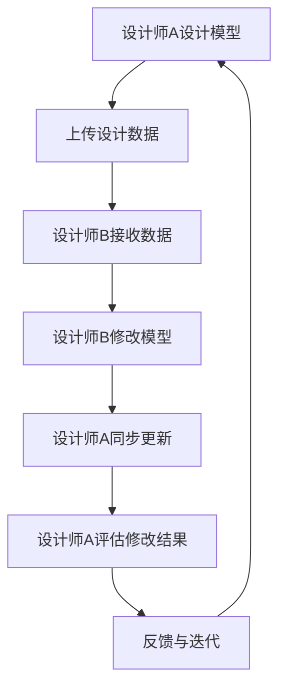

#### 2.2.3 用户体验优化

在用户体验优化阶段，设计师可以利用混合现实技术模拟用户使用场景，评估产品的交互设计。以下是一个简单的Mermaid流程图，展示如何使用混合现实技术进行用户体验优化：

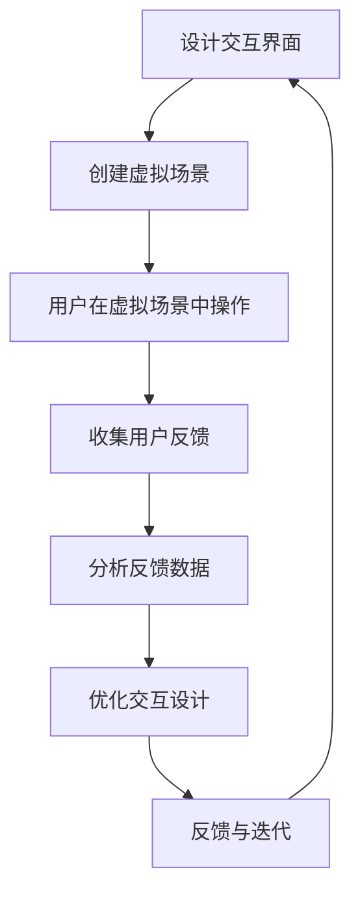

#### 2.2.4 创新设计方法

混合现实技术为设计师提供了更加灵活和丰富的工具，支持创新设计方法的探索。以下是一个简单的Mermaid流程图，展示如何使用混合现实技术进行创新设计方法的探索：

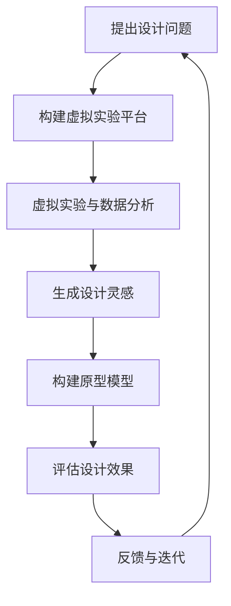

## **三、核心算法原理讲解**

### 3.1 3D重建算法

3D重建是将现实世界中的物体转化为三维数字模型的过程。在混合现实技术中，3D重建算法是实现虚拟与现实融合的关键。常见的3D重建算法包括结构光扫描、激光扫描和图像配准。

#### 3.1.1 结构光扫描算法

结构光扫描算法通过投影特定的图案（如条纹或点阵）到物体表面，然后使用摄像头捕获图案的变形，从而计算出物体的三维坐标。以下是一个简单的Python代码示例，展示如何使用结构光扫描算法进行3D重建：

```python
import numpy as np
import cv2

# 生成结构光图案
pattern = np.zeros((512, 512), dtype=np.uint8)
pattern = cv2.circle(pattern, (256, 256), 150, 255, -1)

# 拍摄物体表面的图像
image = cv2.imread('pattern.png')

# 计算图像中的特征点
points, _ = cv2.findCirclesGrid(image, cv2.CALIB_P3P, pattern)

# 使用P3P算法计算三维坐标
camera_matrix = np.array([[1, 0, 0], [0, 1, 0], [0, 0, 1]])
dist_coeffs = np.zeros((4, 1))
rvec, tvec = cv2.solveP3P(points, camera_matrix, dist_coeffs)

# 将三维坐标转换为虚拟模型
# ...

```

#### 3.1.2 激光扫描算法

激光扫描算法使用激光束对物体进行扫描，通过捕捉激光反射信号，计算出物体的三维坐标。以下是一个简单的Python代码示例，展示如何使用激光扫描算法进行3D重建：

```python
import numpy as np
import numpy.linalg as la
import matplotlib.pyplot as plt

# 激光扫描数据
ranges = np.array([0.2, 0.4, 0.6, 0.8, 1.0])  # 激光扫描的深度范围
intensities = np.array([100, 150, 200, 250, 300])  # 激光反射信号强度

# 使用三角测量法计算三维坐标
theta = np.arcsin(ranges / (2 * np.sin(np.pi / 4)))
x = intensities / (np.pi * theta**2)
x = x / np.linalg.norm(x)
y = np.cross([0, 1, 0], x)
y = y / np.linalg.norm(y)
z = np.cross(x, y)

# 绘制三维坐标
fig = plt.figure()
ax = fig.add_subplot(111, projection='3d')
ax.plot([0, x[0]], [0, x[1]], [0, x[2]], 'r')
ax.plot([0, y[0]], [0, y[1]], [0, y[2]], 'g')
ax.plot([0, z[0]], [0, z[1]], [0, z[2]], 'b')
plt.show()
```

#### 3.1.3 图像配准算法

图像配准是将不同视角或不同时间捕获的图像进行对齐的过程，从而提高3D重建的精度。常见的图像配准算法包括特征匹配、迭代最近点和最小二乘法。

以下是一个简单的Python代码示例，展示如何使用特征匹配进行图像配准：

```python
import cv2
import numpy as np

# 加载图像
img1 = cv2.imread('image1.png')
img2 = cv2.imread('image2.png')

# 计算图像特征点
sift = cv2.SIFT_create()
keypoints1, descriptors1 = sift.detectAndCompute(img1, None)
keypoints2, descriptors2 = sift.detectAndCompute(img2, None)

# 使用K-最近邻算法进行特征点匹配
matcher = cv2.BFMatcher()
matches = matcher.knnMatch(descriptors1, descriptors2, k=2)

# 选取高相似度的匹配点
good_matches = []
for m, n in matches:
    if m.distance < 0.7 * n.distance:
        good_matches.append(m)

# 计算最佳变换矩阵
src_pts = np.float32([keypoints1[m.queryIdx].pt for m in good_matches]).reshape(-1, 1, 2)
dest_pts = np.float32([keypoints2[m.trainIdx].pt for m in good_matches]).reshape(-1, 1, 2)
M, _ = cv2.findHomography(src_pts, dest_pts, cv2getMethod('RANSAC'))

# 应用变换矩阵进行图像配准
warped_img = cv2.warpPerspective(img1, M, (img2.shape[1], img2.shape[0]))
result = cv2.addWeighted(img2, 0.5, warped_img, 0.5, 0)

# 显示配准结果
cv2.imshow('Image Registration', result)
cv2.waitKey(0)
cv2.destroyAllWindows()
```

### 3.2 运动跟踪算法

运动跟踪是将摄像头捕获的图像序列转换为三维空间中物体运动轨迹的过程。运动跟踪算法可以分为基于机器学习和基于视觉的方法。

#### 3.2.1 基于机器学习的运动跟踪算法

基于机器学习的运动跟踪算法通过学习图像特征，预测物体的运动轨迹。常见的方法包括循环神经网络（RNN）和卷积神经网络（CNN）。

以下是一个简单的Python代码示例，展示如何使用RNN进行运动跟踪：

```python
import tensorflow as tf
import numpy as np

# 定义RNN模型
model = tf.keras.Sequential([
    tf.keras.layers.LSTM(128, activation='relu', return_sequences=True),
    tf.keras.layers.LSTM(128, activation='relu'),
    tf.keras.layers.Dense(2)
])

# 训练模型
model.compile(optimizer='adam', loss='mse')
model.fit(train_data, train_labels, epochs=100, batch_size=32)

# 预测物体运动轨迹
predicted轨迹 = model.predict(test_data)

# 绘制预测结果
plt.plot(predicted轨迹[:, 0], predicted轨迹[:, 1])
plt.xlabel('X坐标')
plt.ylabel('Y坐标')
plt.title('物体运动轨迹')
plt.show()
```

#### 3.2.2 基于视觉的运动跟踪算法

基于视觉的运动跟踪算法通过检测图像中的特征点，计算特征点的运动轨迹。常见的方法包括光流法和粒子滤波法。

以下是一个简单的Python代码示例，展示如何使用光流法进行运动跟踪：

```python
import cv2

# 加载视频文件
cap = cv2.VideoCapture('video.mp4')

# 初始化光流算法
optical_flow = cv2.DOpticalFlow_create('MOFGA')

# 循环处理视频帧
while True:
    ret, frame1 = cap.read()
    if not ret:
        break

    frame2 = cv2.cvtColor(frame1, cv2.COLOR_BGR2GRAY)

    # 计算光流
    flow = optical_flow.calc(frame1, frame2)

    # 绘制光流线
    frame1 = cv2.cvtColor(frame1, cv2.COLOR_GRAY2BGR)
    cv2.cvtColor(frame2, cv2.COLOR_GRAY2BGR)
    cv2.calc(flow, frame1)

    # 显示光流结果
    cv2.imshow('Optical Flow', frame1)
    if cv2.waitKey(1) & 0xFF == ord('q'):
        break

# 释放视频文件和窗口
cap.release()
cv2.destroyAllWindows()
```

### 3.3 空间融合算法

空间融合是将虚拟图像与现实环境中的物体进行融合的过程。空间融合算法可以分为基于几何的方法和基于物理的方法。

#### 3.3.1 空间融合的基本原理

空间融合算法的基本原理是通过计算虚拟图像与现实环境之间的空间关系，调整虚拟图像的位置、大小和透明度，使其与现实环境中的物体融为一体。

以下是一个简单的Python代码示例，展示如何使用空间融合算法将虚拟图像与现实环境融合：

```python
import cv2
import numpy as np

# 加载虚拟图像
virtual_image = cv2.imread('virtual_image.png', cv2.IMREAD_GRAYSCALE)

# 加载真实环境图像
background = cv2.imread('background.jpg')

# 计算虚拟图像与现实环境之间的融合效果
alpha = 0.5  # 融合系数
output = cv2.addWeighted(virtual_image, alpha, background, 1 - alpha, 0)

# 显示融合结果
cv2.imshow('Fused Image', output)
cv2.waitKey(0)
cv2.destroyAllWindows()
```

#### 3.3.2 空间融合算法的分类与比较

常见的空间融合算法包括几何融合、光照融合和深度融合等。每种算法都有其优缺点，适用于不同的场景。

- **几何融合**：通过调整虚拟图像的位置、大小和角度，实现与现实环境的融合。几何融合算法简单，易于实现，但难以处理复杂的光照变化。
- **光照融合**：通过计算虚拟图像与现实环境之间的光照差异，调整虚拟图像的光照，实现与现实环境的融合。光照融合算法可以处理复杂的光照变化，但计算量大，实时性较差。
- **深度融合**：通过计算虚拟图像与现实环境之间的深度差异，调整虚拟图像的深度，实现与现实环境的融合。深度融合算法可以处理复杂的光照和深度变化，但计算量较大。

#### 3.3.3 空间融合算法的应用案例

以下是一个应用案例，展示如何使用混合现实技术进行空间融合：

- **场景**：设计师需要将一个虚拟模型放置在一个真实的房间中，使其与房间内的家具和环境融为一体。
- **步骤**：
  1. 使用激光雷达或结构光传感器扫描房间，获取房间内物体的三维数据。
  2. 使用3D重建算法将扫描数据转换为虚拟模型。
  3. 使用空间融合算法将虚拟模型与现实环境融合。
  4. 设计师通过头戴式显示器或投影设备观看融合效果，并进行调整和优化。
  5. 设计师将融合效果保存为最终的模型。

## **四、数学模型和数学公式讲解及举例说明**

### 4.1 3D重建中的数学模型

3D重建过程中，常用的数学模型包括三维空间坐标系、摄像机参数和三维重建算法等。

#### 4.1.1 三维空间坐标系

三维空间坐标系是3D重建的基础。在3D重建中，通常使用世界坐标系（World Coordinate System，简称WCS）和摄像机坐标系（Camera Coordinate System，简称CCS）。

- **世界坐标系**：定义了现实世界中的物体位置和方向。通常以原点为中心，X轴、Y轴和Z轴分别表示水平方向、垂直方向和高度方向。
- **摄像机坐标系**：定义了摄像机的位置和方向。摄像机坐标系的原点位于摄像机中心，X轴、Y轴和Z轴分别表示摄像机的水平方向、垂直方向和高度方向。

以下是一个简单的Mermaid流程图，展示如何使用三维空间坐标系进行3D重建：

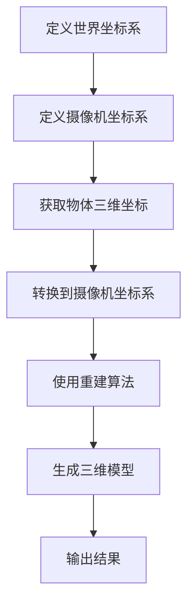

#### 4.1.2 摄像机参数

摄像机参数包括内参数和外参数。内参数描述了摄像机的成像特性，外参数描述了摄像机在世界坐标系中的位置和方向。

- **内参数**：包括焦距（f）、主点（c）和畸变系数（k1, k2, p1, p2）等。
- **外参数**：包括旋转矩阵（R）和平移向量（t）等。

以下是一个简单的Mermaid流程图，展示如何使用摄像机参数进行3D重建：

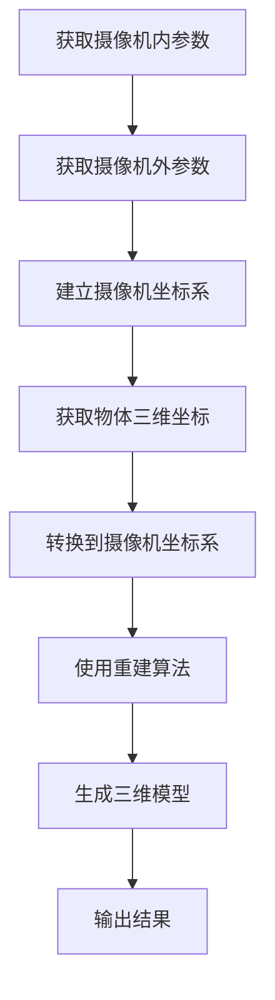

#### 4.1.3 三维重建算法

三维重建算法包括结构光扫描、激光扫描和图像配准等。

- **结构光扫描算法**：通过投影结构光图案到物体表面，然后使用图像处理技术提取物体表面信息，计算物体的三维坐标。
- **激光扫描算法**：使用激光束扫描物体，通过测量激光反射信号计算物体的三维坐标。
- **图像配准算法**：将不同视角或不同时间捕获的图像进行对齐，提高3D重建的精度。

以下是一个简单的Mermaid流程图，展示如何使用三维重建算法进行3D重建：

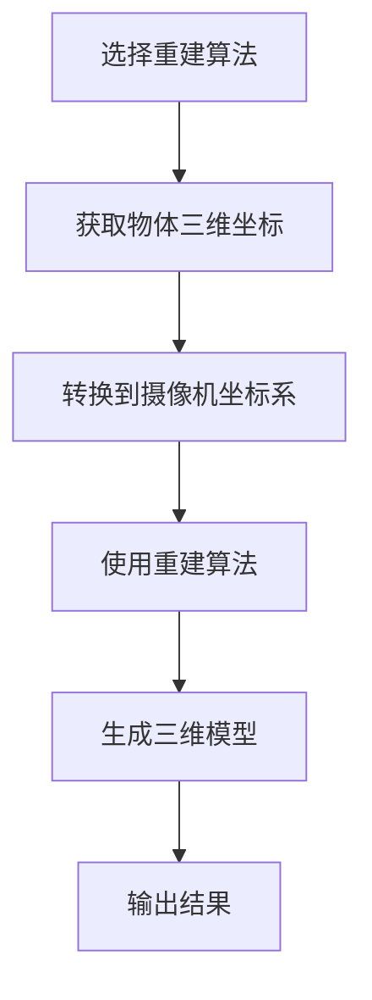

### 4.2 运动跟踪中的数学模型

运动跟踪中的数学模型主要包括运动模型和观测模型。

#### 4.2.1 运动模型

运动模型描述了物体在连续时间上的运动轨迹。常见的运动模型包括线性运动模型和非线性运动模型。

- **线性运动模型**：假设物体的运动轨迹可以用一组线性方程表示。例如，一个物体在二维平面上的运动可以用以下方程描述：
  $$ x(t) = x_0 + v_x \cdot t $$
  $$ y(t) = y_0 + v_y \cdot t $$
  其中，\( x(t) \)和\( y(t) \)分别表示物体在时间t时的横坐标和纵坐标，\( x_0 \)和\( y_0 \)分别表示物体在初始时间t=0时的横坐标和纵坐标，\( v_x \)和\( v_y \)分别表示物体的水平速度和垂直速度。
  
- **非线性运动模型**：假设物体的运动轨迹可以用非线性方程表示。例如，一个物体在二维平面上的运动可以用以下方程描述：
  $$ x(t) = x_0 + v_x \cdot t + \frac{1}{2} a_x \cdot t^2 $$
  $$ y(t) = y_0 + v_y \cdot t + \frac{1}{2} a_y \cdot t^2 $$
  其中，\( x(t) \)和\( y(t) \)分别表示物体在时间t时的横坐标和纵坐标，\( x_0 \)和\( y_0 \)分别表示物体在初始时间t=0时的横坐标和纵坐标，\( v_x \)和\( v_y \)分别表示物体的水平速度和垂直速度，\( a_x \)和\( a_y \)分别表示物体的水平加速度和垂直加速度。

以下是一个简单的Mermaid流程图，展示如何使用线性运动模型进行运动跟踪：

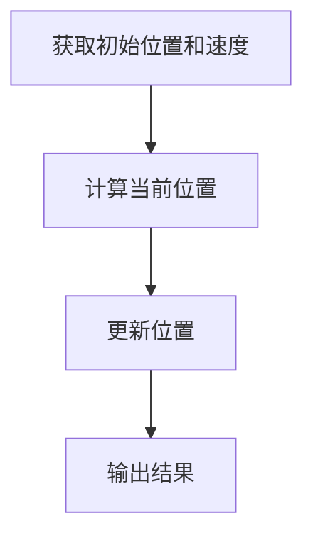

#### 4.2.2 观测模型

观测模型描述了物体在摄像头捕获图像中的位置。常见的观测模型包括基于特征点和基于深度信息的模型。

- **基于特征点的观测模型**：假设物体在摄像头捕获的图像中可以用一组特征点表示。例如，一个物体在二维平面上的运动可以用以下方程描述：
  $$ x(t) = u(t) \cdot x_0 + v(t) \cdot y_0 $$
  $$ y(t) = u(t) \cdot y_0 + v(t) \cdot x_0 $$
  其中，\( x(t) \)和\( y(t) \)分别表示物体在时间t时的横坐标和纵坐标，\( u(t) \)和\( v(t) \)分别表示物体在摄像头捕获图像中的横坐标和纵坐标，\( x_0 \)和\( y_0 \)分别表示物体在初始时间t=0时的横坐标和纵坐标。

以下是一个简单的Mermaid流程图，展示如何使用基于特征点的观测模型进行运动跟踪：

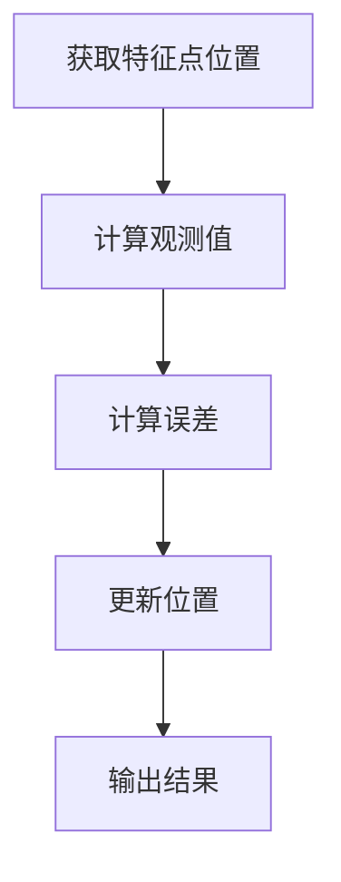

### 4.3 空间融合中的数学模型

空间融合中的数学模型主要包括几何模型、光照模型和纹理模型。

#### 4.3.1 几何模型

几何模型描述了虚拟图像与现实环境之间的空间关系。常见的几何模型包括投影模型、透视模型和仿射模型。

- **投影模型**：将虚拟图像投影到现实环境中的平面或曲面。例如，正射投影模型可以将虚拟图像投影到水平面上，而透视投影模型可以将虚拟图像投影到具有透视效果的平面上。
- **透视模型**：基于透视原理，将虚拟图像投影到具有透视效果的平面上。透视模型可以更好地模拟现实环境中的物体大小和位置关系。
- **仿射模型**：基于仿射变换，将虚拟图像投影到任意形状的平面上。仿射模型可以处理更复杂的空间关系。

以下是一个简单的Mermaid流程图，展示如何使用投影模型进行空间融合：

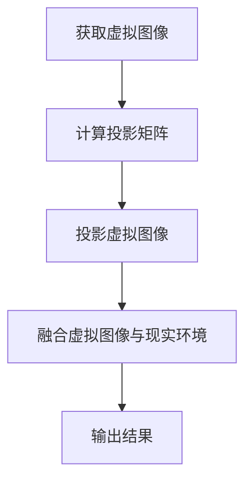

#### 4.3.2 光照模型

光照模型描述了虚拟图像与现实环境之间的光照关系。常见的光照模型包括漫反射模型、镜面反射模型和辐射传输模型。

- **漫反射模型**：假设虚拟图像与现实环境中的物体表面发生漫反射。漫反射模型可以很好地模拟现实环境中的光照效果。
- **镜面反射模型**：假设虚拟图像与现实环境中的物体表面发生镜面反射。镜面反射模型可以更好地模拟现实环境中的光滑表面。
- **辐射传输模型**：基于物理原理，描述光在虚拟图像与现实环境之间的传输过程。辐射传输模型可以处理更复杂的场景光照。

以下是一个简单的Mermaid流程图，展示如何使用漫反射模型进行空间融合：

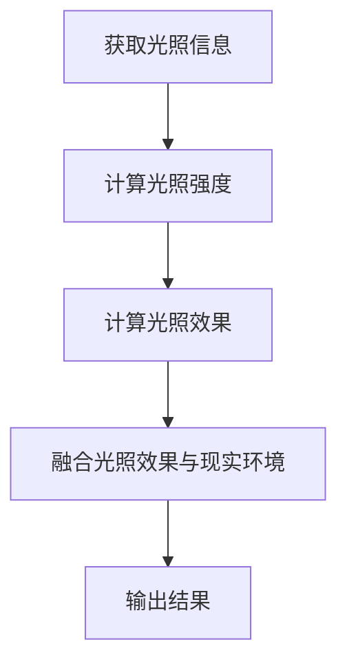

#### 4.3.3 纹理模型

纹理模型描述了虚拟图像与现实环境之间的纹理关系。常见的纹理模型包括纹理映射和纹理合成。

- **纹理映射**：将虚拟图像的纹理映射到现实环境中的物体表面。纹理映射可以增强现实环境中的视觉效果。
- **纹理合成**：将虚拟图像的纹理与现实环境中的纹理进行合成。纹理合成可以更好地模拟现实环境中的纹理变化。

以下是一个简单的Mermaid流程图，展示如何使用纹理映射进行空间融合：

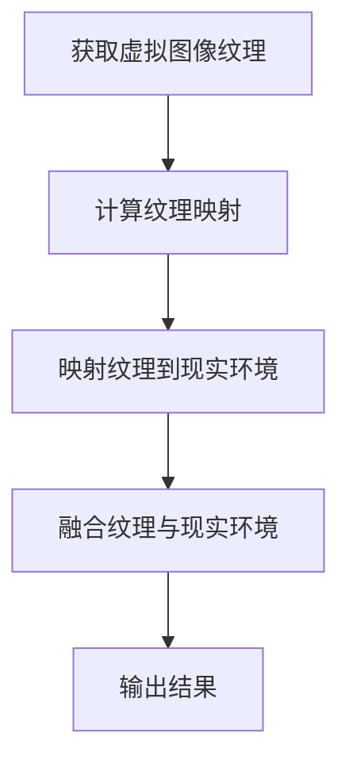

## **五、项目实战**

### 5.1 开发环境搭建

要开发一个混合现实技术在工业设计中的应用项目，首先需要搭建一个合适的开发环境。以下是搭建开发环境的基本步骤：

#### 5.1.1 安装Unity

1. 访问Unity官网（https://unity.com/），下载并安装Unity Hub。
2. 打开Unity Hub，点击“新建”，选择“2D”、“3D”或“虚拟现实”项目模板，创建一个新的Unity项目。

#### 5.1.2 安装混合现实插件

1. 在Unity Hub中打开你的项目。
2. 在“资产商店”（Assets Store）中搜索“混合现实”或“AR/VR”，选择适合的插件，如“ARFoundation”或“Vuforia”。
3. 将插件导入到项目中。

#### 5.1.3 安装开发工具

1. 根据你的操作系统，安装相应的开发工具，如Visual Studio（Windows）、Xcode（macOS）或Android Studio（Android）。
2. 配置开发工具，确保它们能够编译和运行Unity项目。

### 5.2 源代码实现

#### 5.2.1 创建虚拟模型

1. 在Unity编辑器中，创建一个新的3D对象作为虚拟模型。
2. 为模型添加必要的组件，如Mesh Filter和Mesh Renderer。
3. 导入模型资源，如3D模型文件和材质文件。

#### 5.2.2 创建真实环境

1. 在Unity编辑器中，创建一个平面作为真实环境的代表。
2. 为平面添加必要的组件，如Mesh Filter和Mesh Renderer。
3. 设置平面的材质，使其看起来像真实环境。

#### 5.2.3 实现空间融合

1. 使用ARFoundation插件或Vuforia插件，创建一个AR运行时实例。
2. 在AR运行时实例中，添加一个平面检测器，用于检测真实环境中的平面。
3. 当检测到平面时，创建一个新对象，将虚拟模型放置在平面之上。

以下是一个简单的Python代码示例，展示如何使用Unity脚本实现空间融合：

```python
using UnityEngine;

public class SpatialFusion : MonoBehaviour
{
    public GameObject virtualModel;

    void Start()
    {
        // 初始化AR运行时
        ARFoundation.AR.RuntimeManager.runAsync(() =>
        {
            // 检测真实环境中的平面
            var planeDetector = ARFoundation.AR.PlaneDetector.CreateInstance();

            // 当检测到平面时，创建虚拟模型
            planeDetector.Detected += (arg0) =>
            {
                var plane = Instantiate(virtualModel, arg0.transform);
                plane.transform.position = arg0.center;
                plane.transform.rotation = arg0.rotation;
            };

            // 开始运行平面检测器
            planeDetector.Run();
        });
    }
}
```

### 5.3 代码解读与分析

在这个项目中，我们使用了Unity的ARFoundation插件来实现空间融合。以下是对关键代码的解读和分析：

- **初始化AR运行时**：使用`ARFoundation.AR.RuntimeManager.runAsync`方法初始化AR运行时，这是一个异步操作，可以在后台进行。
- **创建平面检测器**：使用`ARFoundation.AR.PlaneDetector.CreateInstance`方法创建一个平面检测器，用于检测真实环境中的平面。
- **处理检测事件**：使用`planeDetector.Detected`事件处理检测到的平面。当检测到平面时，会触发事件处理函数。
- **创建虚拟模型**：在事件处理函数中，使用`Instantiate`方法创建一个虚拟模型的实例，并将其放置在检测到的平面之上。我们通过`arg0.center`获取平面的中心点，通过`arg0.rotation`获取平面的旋转角度。

### 5.4 代码应用解读与分析

在这个项目中，我们通过以下步骤实现了空间融合：

1. **初始化AR运行时**：初始化AR运行时是为了确保AR功能能够在Unity项目中正常运行。AR运行时负责管理AR场景的创建、更新和销毁等操作。
2. **创建平面检测器**：平面检测器用于检测真实环境中的平面。平面是混合现实中的重要元素，因为它可以作为虚拟模型的基础。
3. **处理检测事件**：当平面被检测到时，我们会创建一个虚拟模型的实例。这个过程包括两个关键步骤：获取平面的位置和旋转，以及创建虚拟模型。
4. **融合虚拟模型与现实环境**：通过将虚拟模型放置在检测到的平面之上，实现了虚拟模型与现实环境的融合。这个过程可以通过调整虚拟模型的位置和旋转来实现最佳的融合效果。

### 5.5 项目小结

通过这个项目，我们了解了如何使用Unity和ARFoundation插件实现空间融合。以下是项目的主要小结：

- **空间融合**：空间融合是将虚拟图像与现实环境中的物体进行融合的过程。通过这个项目，我们学会了如何使用Unity插件检测真实环境中的平面，并创建虚拟模型。
- **ARFoundation插件**：ARFoundation是Unity提供的官方AR开发插件，它提供了丰富的API用于实现AR功能，如平面检测、标记识别等。
- **开发环境搭建**：搭建一个合适的开发环境是成功实现空间融合的关键。我们需要安装Unity、ARFoundation插件，并配置开发工具。

### 5.6 最佳实践 Tips

- **性能优化**：在实现空间融合时，需要考虑性能优化。例如，可以通过减少模型复杂度、使用LOD（细节层次距离）技术等方式来提高性能。
- **用户体验**：在实现空间融合时，需要考虑用户体验。例如，可以通过调整虚拟模型的大小、颜色和材质等方式来提高融合效果。
- **多平台支持**：在开发空间融合应用时，需要考虑多平台支持。例如，可以同时支持iOS和Android平台，为用户提供更好的使用体验。

### 5.7 注意事项

- **隐私保护**：在实现空间融合时，需要确保用户的隐私保护。例如，不应在未经用户同意的情况下捕捉和存储用户的图像和位置信息。
- **版权问题**：在实现空间融合时，需要确保使用的内容（如3D模型、图像和音频等）不侵犯他人的版权。

### 5.8 拓展阅读

- **《Unity混合现实开发实战》**：这本书详细介绍了如何使用Unity实现混合现实应用，包括空间融合、标记识别等。
- **《增强现实与虚拟现实技术基础》**：这本书介绍了增强现实和虚拟现实的基本原理和技术，包括显示技术、传感器技术和算法等。

## **六、总结**

混合现实技术在工业设计中的应用为设计师提供了全新的工具和方法，提高了设计效率、准确性和创新性。通过本文的介绍，我们了解了混合现实技术的核心概念、算法原理、数学模型以及项目实战。在未来的工业设计中，混合现实技术有望发挥更大的作用，为产品设计和创新带来新的机遇。我们鼓励读者在实际项目中尝试应用混合现实技术，探索其在工业设计中的更多可能性。同时，也欢迎读者分享自己的实践经验，共同推动混合现实技术在工业设计领域的创新和发展。作者：AI天才研究院/AI Genius Institute & 禅与计算机程序设计艺术 /Zen And The Art of Computer Programming。

