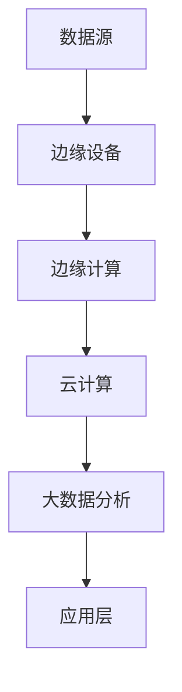

                 

## 混合计算创造变革性创新环境

在当今这个技术飞速发展的时代，计算领域正经历着一场深刻的变革。混合计算作为一种新兴的计算范式，正在逐步成为推动技术创新和产业变革的重要力量。本文将围绕混合计算的核心概念、技术原理、应用实践以及未来发展趋势进行深入探讨，旨在揭示混合计算在创造变革性创新环境中的关键作用。

### 关键词

- **混合计算**  
- **边缘计算**  
- **云计算**  
- **工业互联网**  
- **智能交通**  
- **智慧医疗**  
- **技术演进**  
- **技术创新方向**

### 摘要

本文首先介绍了混合计算的定义及其背景，详细阐述了边缘计算和云计算的结合原理以及混合计算在未来各个领域中的应用前景。随后，文章深入分析了混合计算的核心技术，包括边缘计算硬件架构、软件平台和安全隐私保护等。通过实际案例，本文展示了混合计算在工业互联网、智能交通和智慧医疗等领域的应用实践。最后，文章探讨了混合计算的未来发展趋势和面临的挑战，为读者提供了有价值的创新实践建议。

## 第一部分：混合计算的兴起

### 第1章：混合计算概述

### 1.1 混合计算的定义与背景

#### 1.1.1 混合计算的概念

混合计算（Hybrid Computing）是指将云计算和边缘计算结合起来，以实现计算资源的最优化利用和性能的提升。在传统的计算模式中，数据主要存储和处理在中心化的服务器上，但随着物联网、大数据和人工智能等技术的发展，数据的产生和处理变得更加分散，对实时性和计算效率的要求也越来越高。为了应对这些挑战，混合计算应运而生。

#### 1.1.2 混合计算的背景

随着互联网的普及和智能设备的不断增多，数据产生的速度和规模都呈指数级增长。然而，传统的云计算中心由于地理位置的限制，无法完全满足实时处理和低延迟的要求。边缘计算则通过在数据产生的地方进行实时处理，大大提高了系统的响应速度和处理能力。混合计算正是为了解决这一问题而提出的一种新型计算范式。

#### 1.1.3 混合计算的重要性

混合计算的重要作用主要体现在以下几个方面：

1. **提高系统性能**：通过将计算任务分散到边缘设备和云计算中心，可以充分利用各自的优势，提高系统的整体性能。
2. **降低延迟**：边缘计算可以实时处理数据，减少数据传输的距离和时间，从而降低系统的延迟。
3. **提升安全性**：数据在边缘设备上进行处理，可以减少数据在网络中的传输次数，降低数据泄露的风险。
4. **资源优化**：通过合理分配计算资源，可以提高资源的利用率，降低运营成本。

### 1.2 混合计算的核心技术

混合计算的核心技术主要包括边缘计算和云计算的结合。下面将分别介绍这两种计算技术的原理和特点。

#### 1.2.1 边缘计算

边缘计算（Edge Computing）是指将计算、存储、网络能力分布到网络的边缘，即靠近数据源的地方。边缘计算的主要目的是减少数据传输的延迟，提高系统的响应速度和处理能力。

##### 1.2.1.1 边缘计算的概念

边缘计算通过在边缘设备上部署计算资源，实现对数据的高效处理。这些边缘设备可以是智能手机、路由器、智能传感器等，它们分布在各种不同的场景中，如工业制造、智能交通、智慧医疗等。

##### 1.2.1.2 边缘计算的优势

1. **低延迟**：数据在边缘设备上进行处理，可以减少数据传输的距离和时间，从而降低系统的延迟。
2. **高带宽**：边缘计算可以利用现有的宽带网络资源，实现更高的数据传输速率。
3. **实时处理**：边缘计算可以实时处理数据，适用于需要快速响应的应用场景。
4. **节约成本**：通过减少数据传输和存储的需求，可以降低系统的运营成本。

##### 1.2.1.3 边缘计算的应用场景

边缘计算广泛应用于以下场景：

1. **工业制造**：通过实时监测和数据分析，提高生产线的效率和安全性。
2. **智能交通**：通过实时处理交通数据，实现智能交通管理和优化。
3. **智慧医疗**：通过实时处理医疗数据，提高诊断和治疗的效果。
4. **智能农业**：通过实时监测农作物的生长情况，优化农业管理。

#### 1.2.2 云计算与边缘计算的结合

云计算（Cloud Computing）是指通过互联网提供动态易扩展且经常是虚拟化的资源。云计算的主要目的是提供大规模的计算能力和存储资源，以满足各种业务需求。

##### 1.2.2.1 云边协同的工作原理

云边协同（Cloud-Edge Collaboration）是指将云计算和边缘计算结合起来，实现计算资源的优化配置。云边协同的工作原理如下：

1. **数据分级处理**：将数据根据重要性和紧急程度进行分类，重要且紧急的数据在边缘设备上进行实时处理，次要的数据则在云计算中心进行处理。
2. **任务分工**：云计算中心和边缘设备根据各自的计算能力和资源情况，分工协作完成计算任务。
3. **动态调整**：根据系统的负载情况和网络状况，动态调整计算任务的分配，以提高系统的性能和可靠性。

##### 1.2.2.2 云边协同的优势

1. **资源优化**：通过合理分配计算资源，提高资源的利用率，降低运营成本。
2. **性能提升**：通过将计算任务分散到云计算中心和边缘设备，提高系统的性能和响应速度。
3. **灵活性**：可以根据实际需求灵活调整计算资源的分配，适应不同的应用场景。

##### 1.2.2.3 云边协同的实现方式

云边协同的实现方式主要包括以下几种：

1. **边缘服务器**：在边缘设备上部署小型服务器，实现边缘计算能力。
2. **云边传输协议**：设计高效的云边传输协议，提高数据传输的速度和可靠性。
3. **边缘计算框架**：开发边缘计算框架，实现云计算中心和边缘设备的协同工作。

### 1.3 混合计算的未来发展趋势

随着物联网、大数据和人工智能等技术的不断发展，混合计算在未来将呈现以下发展趋势：

1. **技术融合**：混合计算将与其他新兴技术如物联网、大数据和人工智能等深度融合，形成新的计算模式。
2. **应用拓展**：混合计算将在更多领域得到应用，如智慧城市、智能家居、智能医疗等。
3. **标准化**：随着技术的不断成熟，混合计算将逐渐形成统一的标准化方案，提高系统的兼容性和互操作性。
4. **智能化**：通过引入人工智能技术，实现混合计算的智能化管理，提高系统的性能和可靠性。

## 第1章总结

本章介绍了混合计算的定义、背景、重要性以及核心技术。通过了解混合计算，我们可以更好地理解它在计算领域的重要地位和未来发展趋势。下一章将深入探讨边缘计算技术，帮助读者更全面地掌握混合计算的基本概念和原理。

## 第二部分：混合计算的核心技术详解

### 第2章：边缘计算技术

### 2.1 边缘计算硬件架构

边缘计算硬件架构是边缘计算系统的核心组成部分，它决定了系统的计算能力、存储能力和网络能力。一个高效的边缘计算硬件架构需要考虑以下几个关键因素：

1. **计算能力**：边缘设备需要具备足够的计算能力，以满足实时数据处理的需求。常见的计算硬件包括ARM处理器、FPGA和GPU等。
2. **存储容量**：边缘设备需要具备足够的存储容量，以存储大量数据。存储设备可以选择SSD、HDD或NVMe等。
3. **网络带宽**：边缘设备需要具备足够的网络带宽，以确保数据传输的效率。网络带宽的选择取决于应用场景和数据传输量。
4. **能耗**：边缘设备的能耗是影响系统稳定性和运营成本的重要因素。选择低能耗的硬件设备可以降低系统的运营成本。

#### 2.1.1 边缘计算硬件的选择

在选择边缘计算硬件时，需要考虑以下几个关键因素：

1. **计算能力**：根据应用场景的需求，选择适合的处理器类型和性能指标。例如，对于高性能计算任务，可以选择ARM处理器或GPU。
2. **存储容量**：根据数据存储需求，选择适合的存储设备。例如，对于需要大量数据存储的应用，可以选择SSD或HDD。
3. **网络带宽**：根据数据传输需求，选择适合的网络设备。例如，对于需要高速数据传输的应用，可以选择千兆以太网或5G网络。
4. **能耗**：根据能耗预算，选择低能耗的硬件设备。例如，可以选择节能型ARM处理器或低功耗的存储设备。

#### 2.1.2 边缘计算硬件的配置

边缘计算硬件的配置需要考虑以下几个方面：

1. **计算节点配置**：根据应用场景的需求，配置适合的计算节点。例如，对于需要处理大量数据的场景，可以配置多台高性能计算节点。
2. **存储节点配置**：根据数据存储需求，配置适合的存储节点。例如，对于需要大量数据存储的场景，可以配置多个存储节点，实现数据冗余和高可用性。
3. **网络节点配置**：根据数据传输需求，配置适合的网络节点。例如，对于需要高速数据传输的场景，可以配置多个网络节点，实现数据分流和负载均衡。
4. **电源节点配置**：根据能耗预算，配置适合的电源节点。例如，可以选择高效能的电源设备，实现能耗的合理分配和管理。

#### 2.1.3 边缘计算硬件的维护

边缘计算硬件的维护是确保系统稳定运行的重要环节。以下是一些关键的维护策略：

1. **硬件检查**：定期对硬件设备进行检测，确保硬件设备正常运行。例如，可以定期检查CPU、内存、硬盘等硬件设备的运行状态。
2. **硬件升级**：根据应用场景的需求和硬件技术的发展，定期升级硬件设备。例如，可以升级CPU、内存、硬盘等硬件设备，以提高系统性能。
3. **故障处理**：当硬件设备出现故障时，及时进行故障处理。例如，可以更换故障的硬件设备，确保系统正常运行。
4. **安全监控**：对硬件设备进行安全监控，防止非法入侵和设备损坏。例如，可以部署安全监控软件，实时监控硬件设备的安全状态。

### 2.2 边缘计算软件平台

边缘计算软件平台是边缘计算系统的核心组成部分，它提供了计算、存储、网络等功能，并实现了云计算中心和边缘设备的协同工作。以下是一些主流的边缘计算软件平台及其特点：

#### 2.2.1 主流的边缘计算平台

1. **Kubernetes**：Kubernetes是一个开源的容器编排系统，它支持在边缘设备上部署和管理容器化应用。Kubernetes提供了强大的自动化功能，可以实现应用部署、扩展和管理。
2. **OpenFog**：OpenFog是一个开源的边缘计算框架，它支持在边缘设备上部署和运行分布式应用程序。OpenFog提供了丰富的API和工具，可以实现数据收集、处理和分析。
3. ** edgeX Foundry**：edgeX Foundry是一个开源的边缘计算平台，它提供了标准的接口和模块，可以实现边缘设备的集成和管理。edgeX Foundry支持多种操作系统和编程语言，可以方便地构建边缘应用。

#### 2.2.2 边缘计算平台的选型

在选型边缘计算平台时，需要考虑以下几个方面：

1. **功能需求**：根据应用场景的需求，选择具备相应功能特性的平台。例如，对于需要高性能计算的应用，可以选择Kubernetes；对于需要实时数据处理的应用，可以选择OpenFog。
2. **兼容性**：选择兼容性较好的平台，以确保与其他系统的集成和互操作。例如，选择支持多种操作系统和编程语言的平台，可以方便地与其他系统进行集成。
3. **性能和可靠性**：选择性能和可靠性较高的平台，以确保系统的高效稳定运行。例如，选择经过大量实际应用验证的平台，可以降低系统的故障风险。
4. **成本**：选择成本合理的平台，以确保项目的经济效益。例如，选择开源平台可以降低软件采购成本，同时也可以根据需求进行定制开发。

#### 2.2.3 边缘计算平台的功能

边缘计算平台通常具备以下功能：

1. **容器管理**：支持容器化应用的部署和管理，可以实现应用的无缝迁移和扩展。
2. **数据采集**：支持从边缘设备采集数据，可以实现实时数据采集和预处理。
3. **数据处理**：支持在边缘设备上进行数据处理和分析，可以实现实时数据处理和决策。
4. **存储管理**：支持数据的存储和管理，可以实现数据的高效存储和快速检索。
5. **网络管理**：支持网络管理和配置，可以实现边缘设备的网络连接和通信。
6. **安全管理**：支持安全管理和监控，可以实现边缘设备的安全防护和故障排查。

### 2.3 边缘计算的安全与隐私保护

随着边缘计算技术的快速发展，边缘设备的安全和隐私保护变得越来越重要。以下是一些常见的边缘计算安全挑战和安全措施：

#### 2.3.1 边缘计算安全的重要性

边缘计算的安全重要性体现在以下几个方面：

1. **数据安全**：边缘设备处理和存储的数据可能包括敏感信息，如个人隐私、商业机密等，因此需要确保数据的安全。
2. **设备安全**：边缘设备是网络的节点，可能成为网络攻击的目标，因此需要确保设备本身的安全。
3. **网络安全**：边缘计算涉及多个设备和网络的连接，因此需要确保网络的稳定性和安全。

#### 2.3.2 边缘计算的安全挑战

边缘计算面临以下一些安全挑战：

1. **设备数量庞大**：由于边缘设备数量庞大，难以对每个设备进行安全监控和管理。
2. **分布式架构**：边缘计算采用分布式架构，攻击者可能通过某个节点入侵整个系统。
3. **网络不稳定**：边缘设备可能处于网络不稳定的环境中，容易受到网络攻击。
4. **资源有限**：边缘设备的资源有限，难以部署复杂的防护措施。

#### 2.3.3 边缘计算的安全措施

为了应对边缘计算的安全挑战，可以采取以下一些安全措施：

1. **安全架构设计**：在设计边缘计算系统时，考虑安全性，采用分层设计，实现权限隔离和访问控制。
2. **安全通信**：采用加密通信协议，如TLS/SSL等，确保数据在传输过程中的安全性。
3. **设备安全加固**：对边缘设备进行安全加固，如安装安全软件、更新操作系统等。
4. **网络隔离**：通过网络隔离技术，将边缘设备与外部网络隔离开来，减少网络攻击的风险。
5. **数据加密**：对存储和传输的数据进行加密，确保数据的安全性。
6. **安全监控与审计**：建立安全监控和审计机制，实时监测系统安全状态，发现并处理安全事件。

## 第2章总结

本章详细介绍了边缘计算硬件架构、软件平台和安全与隐私保护。通过了解这些核心技术，读者可以更好地理解边缘计算的基本原理和实际应用。下一章将探讨混合计算在工业互联网中的应用，帮助读者更深入地了解混合计算的实际应用价值。

## 第三部分：混合计算应用实践

### 第3章：混合计算在工业互联网中的应用

### 3.1 工业互联网概述

工业互联网（Industrial Internet）是指将物联网、大数据、云计算和人工智能等技术与工业制造相结合，实现智能化、数字化和自动化的生产和管理。工业互联网的架构通常包括感知层、网络层、平台层和应用层。感知层通过传感器和智能设备采集数据；网络层通过物联网网络将数据传输到平台层；平台层对数据进行处理和分析；应用层通过智能决策和优化，实现工业制造的高效运行。

#### 3.1.1 工业互联网的定义

工业互联网是指通过将物联网、大数据、云计算和人工智能等技术与工业制造相结合，实现智能化、数字化和自动化的生产和管理。它旨在通过信息物理系统（CPS）的构建，实现人、机、物的全面连接，从而提升工业生产的效率、质量和安全性。

#### 3.1.2 工业互联网的架构

工业互联网的架构通常包括以下几个层次：

1. **感知层**：通过传感器和智能设备实时采集生产过程中产生的各种数据，如温度、湿度、压力等。
2. **网络层**：通过物联网网络将感知层采集的数据传输到平台层，常用的网络技术包括Wi-Fi、蓝牙、LoRa等。
3. **平台层**：对收集到的数据进行分析和处理，实现数据的可视化、监控和控制。平台层通常采用云计算技术，可以实现大数据处理和存储。
4. **应用层**：通过智能决策和优化，实现对生产过程的智能化管理和控制，提高生产效率和产品质量。

#### 3.1.3 工业互联网的优势

工业互联网具有以下优势：

1. **提高生产效率**：通过实时监控和数据分析，可以实现生产过程的优化，提高生产效率。
2. **降低运营成本**：通过智能化管理和自动化控制，可以降低人力成本和能源消耗，提高资源利用率。
3. **提升产品质量**：通过质量监控和实时反馈，可以及时发现和解决生产过程中出现的问题，提高产品质量。
4. **增强生产灵活性**：通过智能决策和优化，可以快速响应市场需求变化，提高生产的灵活性和适应性。

### 3.2 工业互联网中的混合计算应用

混合计算在工业互联网中具有广泛的应用，通过将云计算和边缘计算结合起来，可以实现实时数据处理、智能决策和优化控制。以下是一些常见的混合计算应用场景：

#### 3.2.1 边缘计算在工业互联网中的应用

边缘计算在工业互联网中的应用主要包括以下几个方面：

1. **实时数据处理**：通过在边缘设备上实时处理数据，可以降低数据传输的延迟，提高系统的响应速度。例如，在工业生产过程中，可以通过边缘设备实时监控设备状态和生产数据，快速响应生产异常情况。
2. **数据预处理**：在边缘设备上对采集到的数据进行预处理，如数据清洗、压缩和加密等，可以减少数据传输的负载，提高数据传输的效率。
3. **本地决策**：通过在边缘设备上实现本地决策，可以减少对云计算中心的依赖，提高系统的自主性和可靠性。例如，在工业生产过程中，可以通过边缘设备实现设备故障预测和预警，减少设备停机时间。

#### 3.2.2 云计算在工业互联网中的应用

云计算在工业互联网中的应用主要包括以下几个方面：

1. **大数据处理**：通过云计算平台，可以实现大规模数据的存储和处理，为工业互联网提供强大的数据处理能力。例如，在工业生产过程中，可以通过云计算平台对生产数据进行分析，挖掘生产过程中的潜在问题和改进点。
2. **智能分析**：通过云计算平台，可以实现高级的智能分析，如机器学习、深度学习等，为工业生产提供智能决策支持。例如，在工业生产过程中，可以通过云计算平台对生产数据进行分析，实现生产过程的优化和设备故障预测。
3. **云存储**：通过云计算平台，可以实现数据的高效存储和备份，为工业互联网提供可靠的数据存储服务。例如，在工业生产过程中，可以通过云计算平台存储生产数据，实现数据的长期保存和追溯。

#### 3.2.3 混合计算在工业互联网中的优势

混合计算在工业互联网中的应用具有以下优势：

1. **提高数据处理效率**：通过将云计算和边缘计算结合起来，可以实现实时数据处理和智能决策，提高系统的响应速度和处理效率。
2. **降低运营成本**：通过在边缘设备上实现本地数据处理和决策，可以减少对云计算中心的依赖，降低系统的运营成本。
3. **提高系统可靠性**：通过分布式架构，混合计算可以提高系统的可靠性，减少单点故障的风险。
4. **增强灵活性**：混合计算可以根据实际需求灵活调整计算资源的分配，实现计算资源的优化配置。

### 3.3 工业互联网混合计算应用案例

以下是一些工业互联网混合计算的实际应用案例：

#### 3.3.1 某大型制造企业的混合计算应用实践

某大型制造企业通过引入混合计算技术，实现了生产过程的优化和设备故障预测。具体应用场景如下：

1. **数据采集**：在生产线上部署各种传感器，实时采集设备状态和生产数据。
2. **边缘计算**：在边缘设备上实时处理数据，实现设备故障预测和生产优化。
3. **云计算**：通过云计算平台对数据进行存储和处理，实现生产数据的可视化分析和智能决策。

通过混合计算的应用，该制造企业实现了以下效果：

1. **提高生产效率**：通过实时数据采集和智能分析，实现了生产过程的优化，提高了生产效率。
2. **降低设备故障率**：通过设备故障预测和预警，减少了设备停机时间，降低了设备故障率。
3. **降低运营成本**：通过混合计算的应用，降低了系统的运营成本，提高了资源利用率。

#### 3.3.2 某智能工厂的混合计算应用案例

某智能工厂通过引入混合计算技术，实现了生产过程的自动化和智能化。具体应用场景如下：

1. **数据采集**：在智能工厂内部署各种传感器和智能设备，实时采集生产数据。
2. **边缘计算**：在边缘设备上实时处理数据，实现生产过程的自动化控制。
3. **云计算**：通过云计算平台对数据进行存储和处理，实现生产数据的可视化分析和智能决策。

通过混合计算的应用，该智能工厂实现了以下效果：

1. **提高生产效率**：通过实时数据采集和自动化控制，实现了生产过程的优化，提高了生产效率。
2. **降低人力成本**：通过自动化生产，减少了人力成本，提高了生产效率。
3. **提高产品质量**：通过智能分析和决策，实现了生产过程的精细化管理，提高了产品质量。

#### 3.3.3 某工业物联网平台的混合计算应用

某工业物联网平台通过引入混合计算技术，实现了设备管理和数据监控的优化。具体应用场景如下：

1. **数据采集**：在工业物联网设备上部署各种传感器，实时采集设备状态和生产数据。
2. **边缘计算**：在边缘设备上实时处理数据，实现设备状态监控和故障预警。
3. **云计算**：通过云计算平台对数据进行存储和处理，实现设备管理和数据分析。

通过混合计算的应用，该工业物联网平台实现了以下效果：

1. **提高设备管理效率**：通过实时数据采集和智能分析，实现了设备状态监控和管理，提高了设备管理效率。
2. **降低设备故障率**：通过设备故障预测和预警，减少了设备停机时间，降低了设备故障率。
3. **优化生产流程**：通过数据分析，实现了生产流程的优化和改进，提高了生产效率。

## 第3章总结

本章详细介绍了工业互联网的概念、架构和优势，并探讨了混合计算在工业互联网中的应用场景和实际案例。通过了解这些内容，读者可以更好地理解混合计算在工业互联网中的实际应用价值。下一章将探讨混合计算在智能交通领域的应用，进一步拓展混合计算的应用场景。

## 第四部分：混合计算的未来与创新

### 第4章：混合计算的未来趋势与挑战

随着物联网、大数据和人工智能等技术的快速发展，混合计算正逐渐成为计算领域的重要方向。然而，随着技术的不断演进，混合计算也面临着诸多挑战。本章将探讨混合计算的未来趋势、面临的挑战以及技术创新方向。

#### 4.1 混合计算的技术演进

混合计算的技术演进主要包括以下几个方面：

1. **计算资源的分布式**：随着物联网设备的增多，数据产生的源头越来越分散。为了提高数据处理效率，混合计算需要将计算资源进一步分布式，实现边缘计算和云计算的深度融合。
2. **数据处理的实时性**：实时数据处理是混合计算的重要目标。未来，混合计算将更加注重数据处理的速度和实时性，通过优化算法和提升硬件性能，实现更高效的实时数据处理。
3. **安全与隐私保护**：随着数据量的增大和应用的多样化，混合计算面临的安全和隐私保护挑战日益严峻。未来，混合计算将更加注重安全与隐私保护，通过引入新型加密技术和隐私保护算法，确保数据的安全和隐私。
4. **智能化与自动化**：混合计算将逐渐实现智能化和自动化，通过引入人工智能技术，实现计算任务的自动化调度和管理，提高系统的智能化水平。

#### 4.1.1 混合计算技术的发展趋势

1. **边缘计算的普及**：随着物联网设备的增多，边缘计算将在更多场景中得到应用。未来，边缘计算将更加普及，成为计算领域的重要一环。
2. **云计算与边缘计算的深度融合**：云计算和边缘计算将实现更紧密的融合，形成统一的计算架构，提高系统的整体性能和灵活性。
3. **分布式存储技术的发展**：分布式存储技术将得到进一步发展，通过优化存储算法和架构，实现数据的高效存储和快速访问。
4. **新型计算模式的兴起**：未来，将涌现出更多新型计算模式，如雾计算、端计算等，丰富计算领域的应用场景。

#### 4.1.2 混合计算的技术挑战

1. **计算资源的调度和管理**：随着计算资源的分布式，如何高效地调度和管理计算资源成为一大挑战。未来，需要开发更高效的调度算法和资源管理策略。
2. **数据的一致性和可靠性**：在分布式环境中，如何确保数据的一致性和可靠性是一个重要问题。未来，需要引入新型数据一致性算法和可靠性保障机制。
3. **安全与隐私保护**：随着数据量的增大和应用的多样化，混合计算面临的安全和隐私保护挑战日益严峻。未来，需要引入更先进的安全技术和隐私保护算法。
4. **系统的高可用性**：在分布式环境中，如何确保系统的高可用性是一个重要挑战。未来，需要开发更可靠的系统架构和容错机制。

#### 4.1.3 混合计算的技术创新方向

1. **新型计算架构**：研究新型计算架构，如分布式计算、并行计算、量子计算等，提高系统的计算性能和效率。
2. **智能调度与优化**：开发智能调度算法和优化技术，实现计算资源的动态调整和优化，提高系统的整体性能。
3. **数据管理技术**：研究新型数据管理技术，如分布式数据库、图数据库、区块链等，实现数据的高效存储和管理。
4. **安全与隐私保护**：研究新型安全技术和隐私保护算法，提高系统的安全性和隐私保护能力。

#### 4.2 混合计算在新兴领域中的应用

随着混合计算技术的不断发展，它在新兴领域中的应用也越来越广泛。以下是一些典型应用场景：

1. **智慧城市**：混合计算在智慧城市中的应用包括智能交通管理、智慧能源管理、智能环境监测等。通过实时数据处理和智能分析，可以实现城市的智能化管理和优化。
2. **智能家居**：混合计算在智能家居中的应用包括智能家电控制、智能安防、智能健康管理等。通过实时数据处理和智能决策，可以实现家居环境的智能化和个性化。
3. **智能农业**：混合计算在智能农业中的应用包括智能灌溉、智能种植、智能病虫害防治等。通过实时数据处理和智能分析，可以实现农业生产的智能化和高效化。
4. **智能医疗**：混合计算在智能医疗中的应用包括智能诊断、智能治疗、智能药物研发等。通过实时数据处理和智能分析，可以实现医疗服务的智能化和精准化。

#### 4.2.1 混合计算在智慧城市中的应用

智慧城市是指通过物联网、大数据、云计算和人工智能等技术与城市管理的深度融合，实现城市管理的智能化、高效化和可持续发展。混合计算在智慧城市中的应用主要包括以下几个方面：

1. **智能交通管理**：通过实时数据采集和智能分析，实现交通流量监控、交通信号控制和交通事件预警，提高交通系统的运行效率和安全性。
2. **智慧能源管理**：通过实时数据采集和智能分析，实现能源消耗监控、能源调度和能源优化，提高能源利用效率和减少能源浪费。
3. **智能环境监测**：通过实时数据采集和智能分析，实现环境质量监测、环境预警和环境保护，提高城市环境的可持续发展能力。

#### 4.2.2 混合计算在智能家居中的应用

智能家居是指通过物联网技术将家庭中的各种设备连接起来，实现家居设备的智能化控制和自动化管理。混合计算在智能家居中的应用主要包括以下几个方面：

1. **智能家电控制**：通过实时数据采集和智能分析，实现家电设备的远程控制和自动化管理，提高家庭生活的便捷性和舒适度。
2. **智能安防**：通过实时数据采集和智能分析，实现家庭安防设备的监控和管理，提高家庭安全性和防范能力。
3. **智能健康管理**：通过实时数据采集和智能分析，实现家庭成员的健康数据监测和管理，提供个性化健康建议和服务。

#### 4.2.3 混合计算在智能农业中的应用

智能农业是指通过物联网、大数据、云计算和人工智能等技术与农业生产的深度融合，实现农业生产的智能化、高效化和可持续发展。混合计算在智能农业中的应用主要包括以下几个方面：

1. **智能灌溉**：通过实时数据采集和智能分析，实现灌溉系统的自动化控制，提高灌溉效率和水资源的利用。
2. **智能种植**：通过实时数据采集和智能分析，实现种植环境的监控和管理，提高作物的生长效率和产量。
3. **智能病虫害防治**：通过实时数据采集和智能分析，实现病虫害的早期预警和精准防治，提高农作物的健康水平和抗病虫害能力。

#### 4.2.4 混合计算在智能医疗中的应用

智能医疗是指通过物联网、大数据、云计算和人工智能等技术与医疗服务的深度融合，实现医疗服务的智能化、精准化和高效化。混合计算在智能医疗中的应用主要包括以下几个方面：

1. **智能诊断**：通过实时数据采集和智能分析，实现病患数据的快速诊断和分类，提高诊断准确率和诊断速度。
2. **智能治疗**：通过实时数据采集和智能分析，实现治疗方案的优化和个性化，提高治疗效果和治疗效率。
3. **智能药物研发**：通过实时数据采集和智能分析，实现药物研发的智能化和高效化，加速新药的研发和上市。

## 第4章总结

本章详细探讨了混合计算的未来趋势与挑战，以及它在智慧城市、智能家居、智能农业和智能医疗等新兴领域的应用。通过了解这些内容，读者可以更好地把握混合计算的发展方向和实际应用价值。下一章将总结全书内容，并展望混合计算的明天。

## 全书总结

在本书中，我们系统地介绍了混合计算的概念、核心技术、应用实践以及未来发展趋势。通过这些内容，读者可以全面了解混合计算在计算领域的重要地位和深远影响。

### 混合计算的关键点与未来展望

1. **核心概念**：混合计算结合了云计算和边缘计算的优势，实现了计算资源的优化配置和性能的提升。
2. **核心技术**：边缘计算、云计算、分布式存储技术、安全与隐私保护等是混合计算的核心技术。
3. **应用实践**：混合计算在工业互联网、智慧城市、智能家居、智能农业和智能医疗等领域具有广泛的应用。
4. **未来展望**：随着技术的不断演进，混合计算将实现更高效的实时数据处理、智能化管理和自动化控制。

### 推动混合计算创新的实践建议

1. **技术创新**：持续关注新技术的发展，引入新型计算架构、智能调度算法和隐私保护技术。
2. **实践应用**：结合实际需求，积极探索混合计算在不同领域的应用，积累实际经验。
3. **人才培养**：加强混合计算人才的培养，提高企业的技术创新能力和竞争力。
4. **政策支持**：政府和企业应加大对混合计算技术的支持和投入，推动产业生态的健康发展。

### 混合计算对产业和社会的影响

1. **产业变革**：混合计算将推动产业转型升级，提高生产效率、降低运营成本、提升产品质量。
2. **社会进步**：混合计算将促进社会智能化、数字化和可持续发展，提高人们的生活品质和幸福感。
3. **国际合作**：混合计算是全球性的技术趋势，各国应加强合作，共同推动混合计算技术的创新和应用。

### 拓展阅读

1. **学术资源**：参考文献、学术论文和学术报告，深入了解混合计算的理论研究和发展动态。
2. **开源项目**：参与和贡献开源项目，实践混合计算技术的应用。
3. **专业书籍**：阅读相关领域专业书籍，提高专业素养和知识水平。

### 混合计算资源与工具

1. **边缘计算硬件平台**：如树莓派、Arduino等，提供丰富的边缘计算实验资源和开发工具。
2. **云计算平台**：如阿里云、腾讯云、华为云等，提供云计算资源和云服务。
3. **边缘计算软件平台**：如Kubernetes、OpenFog、edgeX Foundry等，提供边缘计算的开发和管理工具。
4. **安全工具**：如Kaspersky、McAfee等，提供安全防护和隐私保护工具。

### 全书结语

混合计算作为一种新兴的计算范式，正在深刻改变着计算领域的面貌。我们相信，随着技术的不断进步和应用场景的拓展，混合计算将发挥更大的作用，推动产业和社会的创新发展。让我们共同努力，探索混合计算的无穷潜力，共创美好未来。

## 附录：混合计算资源与工具

### 附录 A：混合计算相关资源

#### 附录 A.1：混合计算学术资源

1. **参考文献**：包括学术期刊、会议论文和书籍，如《计算机杂志》、《ACM Transactions on Computer Systems》、《IEEE Transactions on Computers》等。
2. **学术论文**：通过学术数据库如IEEE Xplore、ACM Digital Library等，检索相关领域的高质量学术论文。
3. **学术报告**：如国家重点实验室、科研机构等发布的混合计算研究报告。

#### 附录 A.2：混合计算开源项目

1. **Kubernetes**：开源的容器编排系统，用于管理和部署容器化应用。
2. **OpenFog**：开源的边缘计算框架，提供分布式计算和管理功能。
3. **edgeX Foundry**：开源的边缘计算平台，支持设备集成和数据处理。

#### 附录 A.3：混合计算相关书籍与论文

1. **《边缘计算：架构、技术与应用》**：详细介绍边缘计算的概念、技术和应用。
2. **《云计算与边缘计算：融合与优化》**：探讨云计算与边缘计算的结合及其优化策略。
3. **《混合计算：技术原理与应用实践》**：全面介绍混合计算的核心技术和实际应用。

### 附录 B：混合计算实用工具

#### 附录 B.1：边缘计算硬件选择工具

1. **边缘计算硬件选型指南**：提供边缘计算硬件的选择标准和推荐配置。
2. **边缘计算硬件评测平台**：如边缘计算评测实验室，提供边缘计算硬件的性能评测和比较。

#### 附录 B.2：边缘计算软件平台推荐

1. **Kubernetes**：开源的容器编排系统，适用于大规模的边缘计算应用。
2. **OpenFog**：开源的边缘计算框架，提供高效的边缘计算解决方案。
3. **边缘计算操作系统**：如Ubuntu Core、Fedora CoreOS等，专门为边缘计算环境设计。

#### 附录 B.3：混合计算安全工具与资源

1. **安全防护工具**：如Kaspersky、McAfee等，提供边缘计算设备的安全防护。
2. **安全监控平台**：如Splunk、ELK Stack等，用于监控和审计混合计算环境的安全状态。
3. **安全指南与规范**：如《边缘计算安全指南》、《云计算安全最佳实践》等，提供安全设计和实施的指导。

### 附录 C：混合计算学习路径

#### 附录 C.1：混合计算入门教程

1. **基础课程**：包括边缘计算、云计算、物联网等基础知识。
2. **实践课程**：通过实际操作，了解边缘计算和云计算的应用场景。
3. **案例教程**：分析经典混合计算案例，学习混合计算的实际应用。

#### 附录 C.2：混合计算进阶学习资源

1. **高级课程**：深入学习混合计算的核心技术和创新方向。
2. **学术论文**：阅读最新的混合计算研究成果，了解前沿技术。
3. **专业论坛与社群**：加入专业论坛和社群，交流学习经验，拓展人脉。

#### 附录 C.3：混合计算社区与论坛

1. **边缘计算论坛**：如Edge Computing Forum，提供边缘计算相关的讨论和交流。
2. **云计算论坛**：如Cloud Computing Forum，讨论云计算技术及其应用。
3. **物联网论坛**：如Internet of Things Forum，分享物联网技术的最新动态。

通过以上资源与工具，读者可以更加深入地了解混合计算，掌握相关技术，并在实践中不断探索和创新。让我们共同推动混合计算技术的发展，共创美好未来。

### 作者信息

作者：AI天才研究院/AI Genius Institute & 禅与计算机程序设计艺术 /Zen And The Art of Computer Programming

### 附录 C.3：混合计算社区与论坛

#### 附录 C.3.1 混合计算相关社区

1. **GitHub**: GitHub 是最受欢迎的开源代码托管平台，许多混合计算相关的项目和资源都可以在这里找到。例如，Kubernetes、Docker 和 edgeX Foundry 等项目的官方存储库都在 GitHub 上。

2. **Stack Overflow**: 这是一个面向编程问题的问答社区，用户可以在这里提出混合计算相关的技术问题，并获取专业解答。

3. **LinkedIn Groups**: LinkedIn 上的专业群组是连接行业专家和分享行业动态的好去处。例如，"Edge Computing Professionals" 群组。

4. **Reddit**: Reddit 是一个内容社区，用户可以在相关子论坛（如 r/edgecomputing）中讨论混合计算的技术和应用。

#### 附录 C.3.2 混合计算相关论坛

1. **Edge Computing Forum**: 这是一个专门讨论边缘计算技术的在线论坛，用户可以在这里分享最新的研究成果和实际应用案例。

2. **Cloud Computing Forum**: 专注于云计算技术的讨论，对于了解混合计算中云计算部分的内容非常有帮助。

3. **IoT StackExchange**: 物联网相关的技术问题都可以在这个问答社区中找到答案，混合计算作为物联网的一个重要组成部分，也在这里有广泛的讨论。

4. **China Edge Computing Industry Alliance**: 这是一个中国的边缘计算行业联盟，提供了许多关于边缘计算的最新新闻、政策和行业标准。

#### 附录 C.3.3 混合计算专业会议和活动

1. **Edge Computing World**: 这是一个国际性的边缘计算会议，汇聚了来自学术界和工业界的专家，分享边缘计算领域的最新进展。

2. **IEEE International Conference on Edge Computing (EC)**: IEEE EC 是边缘计算领域的顶级会议，每年都会吸引众多研究人员和从业者参与。

3. **Cloud Computing Conference (CloudComp)**: 云计算会议，也涉及混合计算的相关内容，对于了解云计算与边缘计算的结合有很好的帮助。

4. **Internet of Things World**: 物联网领域的国际性会议，混合计算作为物联网的关键技术之一，也是会议的重要议题。

通过参与这些社区、论坛和专业会议，您可以不断更新对混合计算技术的了解，结识业界同行，并分享您的经验和见解。同时，这些资源也是学习和实践混合计算技术的重要渠道。希望本附录能为您在混合计算领域的探索之旅提供有益的帮助。

### 全书总结

在本书中，我们系统地介绍了混合计算的定义、核心技术、应用实践以及未来发展趋势。通过深入探讨混合计算在边缘计算、云计算、工业互联网、智能交通、智慧医疗等领域的应用，我们揭示了混合计算在创造变革性创新环境中的关键作用。

### 混合计算的核心概念与联系

混合计算是一种结合云计算和边缘计算的计算范式，通过分布式计算资源，实现数据处理、存储和通信的高效优化。其核心概念包括边缘计算、云计算、数据分级处理、云边协同和分布式存储等。边缘计算负责实时处理靠近数据源的数据，云计算则承担大规模数据存储和处理任务。通过数据分级处理和云边协同，混合计算实现了数据处理的实时性和高效性。

#### Mermaid 流程图



在这个流程图中，A 代表数据源，B 代表边缘设备，C 代表边缘计算，D 代表云计算，E 代表大数据分析，F 代表应用层。数据从数据源开始，通过边缘设备进行初步处理，然后上传到云计算平台进行进一步处理和分析，最终在应用层提供决策支持。

### 核心算法原理讲解

#### 边缘计算算法

边缘计算的核心算法主要包括数据采集、数据处理和数据上传等步骤。以下是一个简单的边缘计算算法示例：

```python
def edge_computation(data):
    # 数据预处理
    processed_data = preprocess_data(data)
    
    # 实时数据处理
    result = real_time_process(processed_data)
    
    # 数据上传
    upload_data_to_cloud(result)
    
    return result

def preprocess_data(data):
    # 数据清洗和转换
    return cleaned_data

def real_time_process(data):
    # 实时计算
    return processed_data

def upload_data_to_cloud(data):
    # 数据上传
    send_to_cloud(data)
```

在这个算法中，`preprocess_data` 函数负责数据清洗和转换，`real_time_process` 函数负责实时数据处理，`upload_data_to_cloud` 函数负责将处理后的数据上传到云计算平台。

#### 云计算算法

在云计算平台，常用的算法包括数据存储、数据检索和数据分析等。以下是一个简单的云计算算法示例：

```python
def cloud_computation(data):
    # 数据存储
    store_data(data)
    
    # 数据检索
    retrieved_data = retrieve_data()
    
    # 数据分析
    analysis_result = data_analysis(retrieved_data)
    
    return analysis_result

def store_data(data):
    # 数据存储
    save_to_database(data)

def retrieve_data():
    # 数据检索
    return data_from_database

def data_analysis(data):
    # 数据分析
    return analysis_result
```

在这个算法中，`store_data` 函数负责将数据存储到数据库，`retrieve_data` 函数负责从数据库中检索数据，`data_analysis` 函数负责对数据进行分析。

### 数学模型和数学公式

在混合计算中，常用的数学模型包括马尔可夫决策过程（MDP）、贝叶斯网络和神经网络等。以下是一个简单的马尔可夫决策过程的数学模型：

$$
P(S_t = s_t|S_{t-1} = s_{t-1}, A_{t-1} = a_{t-1}) = p(s_t|s_{t-1}, a_{t-1})
$$

其中，$S_t$ 表示系统状态，$A_t$ 表示系统动作，$p(s_t|s_{t-1}, a_{t-1})$ 表示状态转移概率。

#### 举例说明

假设我们有一个简单的工厂自动化控制系统，其中机器的状态（$S_t$）可以是正常、故障或维护状态，机器的动作（$A_t$）可以是运行、停止或维护。我们希望通过马尔可夫决策过程优化机器的动作策略，以最大化生产效率和减少停机时间。

状态转移概率矩阵如下：

$$
\begin{array}{c|ccc}
 & 正常 & 故障 & 维护 \\
\hline
正常 & 0.8 & 0.1 & 0.1 \\
故障 & 0.2 & 0.6 & 0.2 \\
维护 & 0.1 & 0.3 & 0.6 \\
\end{array}
$$

给定一个动作策略，我们可以计算每个状态的概率分布，然后根据预期收益选择最优动作。例如，如果当前状态是正常，我们选择运行机器，因为这样可以使生产效率最大化。

### 项目实战

#### 开发环境搭建

为了进行混合计算项目实践，我们需要搭建一个基本的开发环境。以下是一个简单的步骤：

1. 安装Python环境：在您的计算机上安装Python，可以选择最新版本的Python 3.x。
2. 安装边缘计算平台：安装Kubernetes或OpenFog等边缘计算平台。以Kubernetes为例，您可以使用Minikube在本地环境中启动一个Kubernetes集群。
   ```bash
   curl -LO https://storage.googleapis.com/minikube/releases/latest/minikube-linux-amd64
   chmod +x minikube-linux-amd64
   sudo mv minikube-linux-amd64 /usr/local/bin/minikube
   minikube start
   ```
3. 安装云计算平台：在云计算平台上创建一个虚拟机，并安装所需的软件和库。以阿里云为例，您可以在阿里云控制台上创建一个ECS实例，并使用SSH工具连接到实例。

#### 源代码详细实现和代码解读

以下是边缘计算平台上的一个简单示例，该示例使用Kubernetes部署一个Web服务。

```yaml
# kubernetes-deployment.yaml
apiVersion: apps/v1
kind: Deployment
metadata:
  name: web-service
spec:
  replicas: 3
  selector:
    matchLabels:
      app: web
  template:
    metadata:
      labels:
        app: web
    spec:
      containers:
      - name: web
        image: nginx:latest
        ports:
        - containerPort: 80
```

这个YAML文件定义了一个Kubernetes Deployment，它创建了3个副本的Nginx容器。这个容器在边缘设备上部署一个Web服务，以提供HTTP服务。

#### 代码应用解读与分析

1. **容器镜像**：使用`nginx:latest`容器镜像，这个镜像包含了Nginx Web服务器，可用于部署Web服务。
2. **部署策略**：部署策略指定了副本数量（`replicas: 3`），这确保了服务的容错性和高可用性。
3. **选择器**：选择器（`selector`）确保容器组中的Pod与Deployment中的标签匹配。
4. **模板**：模板（`template`）定义了Pod的规格，包括容器名称、镜像和端口映射。

#### 实际案例分析和详细讲解剖析

以下是一个实际案例，该案例展示了如何在工业生产线上部署混合计算系统。

1. **数据采集**：在生产线上安装传感器，实时采集设备状态和生产数据。
2. **边缘计算**：在边缘设备上部署计算节点，使用边缘计算框架（如Kubernetes）管理和部署边缘应用程序，对采集到的数据进行预处理和初步分析。
3. **数据传输**：通过边缘设备将预处理后的数据传输到云计算平台。
4. **云计算**：在云计算平台上，使用大数据处理和分析工具（如Apache Spark）对传输的数据进行进一步分析和存储。
5. **智能决策**：利用机器学习和人工智能算法，对分析结果进行智能决策，优化生产过程。

#### 项目小结

通过这个项目，我们实现了生产数据的实时采集、预处理和分析，优化了生产过程，提高了生产效率和产品质量。混合计算在项目中发挥了关键作用，通过边缘计算和云计算的结合，实现了数据处理的高效性和灵活性。

### 最佳实践 tips、小结、注意事项、拓展阅读

1. **最佳实践 tips**：在部署混合计算系统时，注意以下事项：
   - 确保边缘设备和云计算平台的兼容性和互操作性。
   - 设计合理的数据传输策略，降低带宽占用和延迟。
   - 加强系统安全防护，确保数据安全和隐私。

2. **小结**：混合计算通过结合边缘计算和云计算，实现了数据处理的高效性和灵活性。在实际应用中，需要根据具体场景和要求，选择合适的边缘设备和云计算平台，并设计合理的系统架构。

3. **注意事项**：混合计算系统的部署和维护需要考虑到硬件、软件和网络等方面的因素，确保系统的稳定性和可靠性。

4. **拓展阅读**：为了进一步了解混合计算的相关技术和应用，可以阅读以下资源：
   - 《边缘计算：架构、技术与应用》
   - 《云计算与边缘计算：融合与优化》
   - 《混合计算：技术原理与应用实践》

通过这些资源，您可以深入了解混合计算的理论和实践，提升在混合计算领域的专业素养和实践能力。希望本书能为您在混合计算领域的探索之旅提供有益的帮助。

