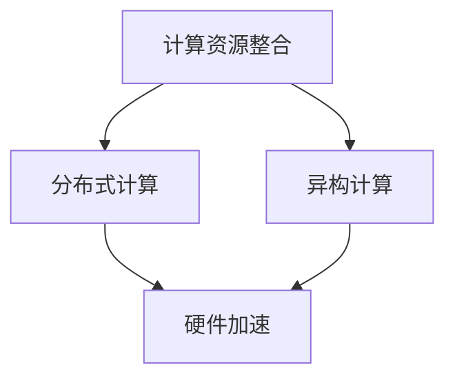

                 

---
# 混合计算在AI领域的突破性应用

关键词：混合计算、AI、突破性技术、计算架构、硬件加速、数据管理、模型优化、应用案例

摘要：本文将探讨混合计算在AI领域的突破性应用，分析其在提升计算效率和降低成本方面的潜力。我们将详细阐述混合计算的核心概念、AI应用场景、计算架构、硬件加速技术、数据管理和模型优化策略，并通过实际案例展示其应用效果。

## 引言

### 混合计算的背景

随着人工智能（AI）技术的快速发展，对计算能力的需求不断增加。传统的单一计算架构在处理复杂AI任务时面临着性能瓶颈和成本问题。为了解决这一问题，混合计算应运而生。

### 混合计算的定义

混合计算是一种结合了多种计算资源和技术的计算架构，旨在通过整合不同类型的计算资源来提升计算效率和降低成本。

### 混合计算在AI领域的应用

随着AI技术的发展，混合计算在AI领域展现出了巨大的应用潜力。本文将重点探讨以下几个方面：

1. **计算架构与硬件加速**：介绍混合计算架构，探讨硬件加速技术如何提高AI计算性能。
2. **数据管理**：讨论如何在混合计算环境中优化数据存储和处理。
3. **模型优化**：探讨AI模型的优化策略，如何通过混合计算实现更高效的学习和推理。

### 组织结构

本文将分为以下几部分：

1. **混合计算的基础**：介绍混合计算的基本概念和技术。
2. **AI在混合计算中的应用**：探讨AI在混合计算中的具体应用场景。
3. **突破性技术在混合计算中的应用**：介绍一些突破性技术在混合计算中的应用。
4. **计算架构与硬件加速**：详细分析计算架构和硬件加速技术。
5. **数据管理与优化**：讨论数据管理在混合计算中的重要性。
6. **AI模型优化与实践**：探讨AI模型的优化策略和实践。
7. **应用案例研究**：通过实际案例展示混合计算在AI领域的应用效果。

## 混合计算的基础

### 核心概念与联系

混合计算的核心概念包括计算资源整合、异构计算、分布式计算和硬件加速。这些概念之间有着密切的联系，共同构成了混合计算的基础架构。


**Mermaid流程图**：



### 计算架构

混合计算架构通常包括以下几个方面：

1. **计算节点**：用于执行计算任务的节点，可以是CPU、GPU、FPGA等。
2. **存储节点**：用于存储数据和模型的节点，可以是SSD、HDD、分布式文件系统等。
3. **网络节点**：用于连接计算节点和存储节点的网络架构，可以是局域网、广域网等。
4. **管理节点**：用于管理和监控整个计算环境的节点。

### 硬件加速技术

硬件加速技术是混合计算的重要组成部分，它通过利用GPU、FPGA等专用硬件来提高计算性能。以下是一些常见的硬件加速技术：

1. **GPU加速**：使用图形处理单元（GPU）来加速矩阵运算和深度学习模型训练。
2. **FPGA加速**：使用现场可编程门阵列（FPGA）来定制化实现特定的计算任务。
3. **TPU加速**：使用专门为机器学习任务设计的张量处理单元（TPU）。

### 分布式计算

分布式计算是混合计算架构中的关键部分，它通过将计算任务分布在多个节点上来提高计算效率和可扩展性。以下是一些分布式计算的基本概念：

1. **任务调度**：根据计算任务的性质和节点的资源情况，合理分配任务到不同的节点上。
2. **负载均衡**：通过动态调整任务分配来平衡各个节点的负载。
3. **容错机制**：在节点发生故障时，能够自动调整任务分配，确保计算任务的连续性。

## AI在混合计算中的应用

### AI应用场景概述

AI技术在许多领域都有广泛的应用，如图像识别、自然语言处理、推荐系统等。在混合计算环境中，AI应用可以充分利用各种计算资源和硬件加速技术，实现更高的计算性能和更低的成本。

### 混合计算中的AI挑战与解决方案

1. **数据隐私与安全**：在混合计算环境中，数据隐私和安全是一个重要挑战。解决方案包括数据加密、访问控制、隐私保护算法等。
2. **计算资源的分配与管理**：如何有效地分配和管理计算资源是一个关键问题。解决方案包括任务调度算法、资源预留策略等。
3. **异构计算优化**：如何充分利用不同类型计算资源的优势，优化计算性能和能效比。

### 混合计算中的AI应用案例分析

1. **自动驾驶**：自动驾驶系统需要实时处理大量的图像和传感器数据，通过混合计算架构可以实现更高的计算性能和更低的延迟。
2. **智能医疗**：智能医疗系统可以通过混合计算架构加速医学图像分析、基因组测序等计算密集型任务。
3. **智能城市**：智能城市应用可以通过混合计算架构实现实时数据分析、智能交通管理等。

## 突破性技术在混合计算中的应用

### 突破性技术的定义

突破性技术是指那些在计算能力、数据处理能力、能效比等方面具有显著优势的新技术。

### 突破性技术在混合计算中的应用

1. **量子计算**：量子计算具有超越经典计算的能力，可以在混合计算架构中作为辅助计算资源，解决某些特定问题。
2. **边缘计算**：边缘计算通过将计算任务分布到网络边缘的设备上，实现更低的延迟和更高的响应速度。
3. **区块链**：区块链技术可以用于数据安全和隐私保护，为混合计算环境提供更可靠的数据管理和访问控制。

## 计算架构与硬件加速

### 计算架构

计算架构是混合计算的核心组成部分，决定了计算资源的分配和调度。以下是一些常见的计算架构：

1. **分布式计算架构**：通过将计算任务分布在多个节点上来提高计算效率和可扩展性。
2. **集群计算架构**：通过将多个计算节点组成一个集群，实现大规模并行计算。
3. **云原生架构**：基于云计算架构，实现计算资源的动态分配和调度。

### 硬件加速技术

硬件加速技术是提高混合计算性能的关键因素。以下是一些常见的硬件加速技术：

1. **GPU加速**：使用GPU进行矩阵运算和深度学习模型训练。
2. **FPGA加速**：使用FPGA进行定制化计算任务。
3. **TPU加速**：使用TPU进行机器学习任务。

### 硬件加速技术的优势与挑战

**优势**：

- 提高计算性能
- 降低能耗
- 提高能效比

**挑战**：

- 硬件资源管理
- 软硬件协同优化
- 硬件多样性的兼容性

## 数据管理与优化

### 数据管理的重要性

在混合计算环境中，数据管理至关重要。良好的数据管理可以保证数据的完整、可靠和高效使用。

### 数据管理的关键技术

1. **数据存储**：选择合适的数据存储方案，如分布式文件系统、云存储等。
2. **数据传输**：优化数据传输效率，降低网络延迟。
3. **数据备份与恢复**：确保数据的安全性和可用性。
4. **数据加密**：保护数据隐私和安全。

### 数据优化策略

1. **数据分片**：将大量数据分散存储在不同的节点上，提高数据访问速度。
2. **数据压缩**：减少数据存储空间，降低传输带宽。
3. **索引优化**：提高数据检索效率。
4. **缓存技术**：加快数据的读取速度。

## AI模型优化与实践

### AI模型优化的重要性

AI模型优化是提高AI应用性能的关键因素。通过优化模型，可以提高计算效率、降低能耗和提高准确性。

### AI模型优化策略

1. **模型剪枝**：去除模型中的冗余参数，减少计算量。
2. **量化**：降低模型参数的精度，减少存储和计算需求。
3. **蒸馏**：使用大模型训练小模型，提高小模型的性能。
4. **分布式训练**：将模型训练任务分布在多个节点上，提高训练效率。

### AI模型优化实践

1. **模型优化案例分析**：分析不同场景下的模型优化实践，分享优化经验和技巧。
2. **实践与反思**：讨论模型优化过程中的挑战和解决方案。

## 应用案例研究

### 案例一：自动驾驶系统

自动驾驶系统是一个典型的混合计算应用案例。通过混合计算架构，可以实现高效的传感器数据融合、环境感知和决策制定。

### 案例二：智能医疗诊断

智能医疗诊断需要处理大量的医学图像和患者数据。混合计算架构可以提供高效的图像处理和分析能力，提高诊断准确性和效率。

### 案例三：智慧城市应用

智慧城市应用包括智能交通管理、环境监测和公共安全等方面。混合计算架构可以提供实时数据处理和智能分析能力，提升城市管理效率和居民生活质量。

## 结论

混合计算在AI领域具有巨大的应用潜力。通过结合多种计算资源和硬件加速技术，混合计算可以实现更高的计算性能和更低的成本。随着技术的不断进步，混合计算将在AI领域发挥越来越重要的作用。

## 作者信息

作者：AI天才研究院/AI Genius Institute & 禅与计算机程序设计艺术 /Zen And The Art of Computer Programming
```

