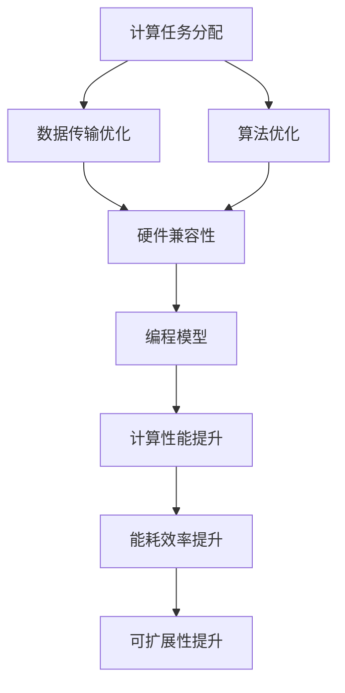
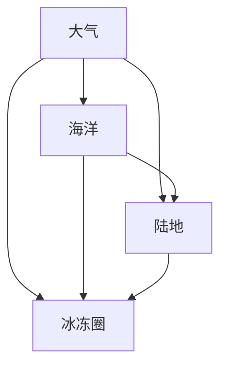
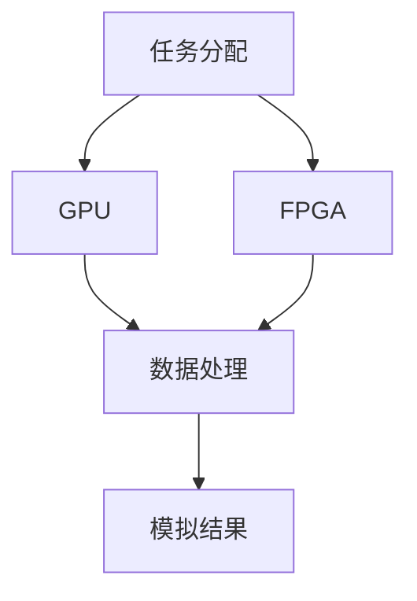
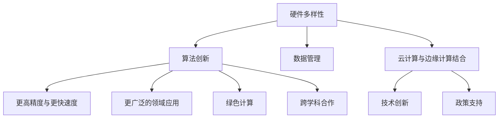

                 

### 第1章 混合计算简介

#### 1.1 混合计算的概念与背景

混合计算（Hybrid Computing）是指将传统计算（如CPU计算）与新兴计算（如GPU计算、FPGA计算）相结合，以提高计算效率和性能。其核心思想是通过不同类型计算硬件的优势互补，实现计算任务的优化处理。

##### 1.1.1 混合计算的定义
$$
混合计算（Hybrid Computing）是指将传统计算（如CPU计算）与新兴计算（如GPU计算、FPGA计算）相结合，以提高计算效率和性能。
$$
在具体实现上，混合计算通常涉及以下几个方面：

1. **计算任务的分配**：根据不同计算硬件的特点，合理分配计算任务，使得任务能够在不同计算硬件上并行执行。
2. **数据传输优化**：为了降低不同计算硬件之间的数据传输延迟，需要设计高效的通信机制。
3. **算法优化**：针对特定计算硬件，对算法进行优化，以提高计算效率和性能。

##### 1.1.2 混合计算的背景
混合计算的发展可以追溯到计算机科学和工程领域的不断进步。随着计算需求的增加，传统CPU的计算能力逐渐无法满足高性能计算的要求。为了提高计算效率，研究人员开始探索利用GPU、FPGA等新兴计算硬件。

在20世纪90年代，GPU（图形处理单元）逐渐成为图形渲染领域的重要计算设备。随着GPU并行计算能力的不断提升，研究人员开始尝试将GPU应用于科学计算领域。GPU的并行计算能力使其在处理大规模数据集时具有显著优势。

FPGA（现场可编程门阵列）是另一种新兴计算硬件。FPGA具有高度可编程性和并行计算能力，使其在特定应用场景中具有独特的优势。例如，FPGA在加密、信号处理等领域表现出色。

近年来，随着混合计算技术的发展，越来越多的领域开始采用混合计算方案。例如，在气候模拟、流体力学模拟、分子模拟等领域，混合计算方案已被广泛应用于提高计算效率和性能。

#### 1.2 混合计算的优势与挑战

##### 1.2.1 混合计算的优势
混合计算在计算能力、能耗效率和可扩展性等方面具有显著优势。

1. **计算能力提升**：混合计算能够充分利用不同计算硬件的优势，提高整体计算能力。例如，GPU在处理大规模数据集时具有并行计算优势，而FPGA在特定算法优化方面具有高效性。
2. **能耗效率提升**：混合计算可以通过优化计算任务分配和数据传输，降低能耗。与传统单一计算硬件相比，混合计算在相同计算任务下具有更低的能耗。
3. **可扩展性提升**：混合计算方案可以根据计算需求灵活调整计算硬件配置，实现计算资源的动态扩展。

##### 1.2.2 混合计算的挑战
尽管混合计算具有许多优势，但在实际应用中仍面临一系列挑战。

1. **算法优化**：针对不同计算硬件的算法优化是一个复杂的过程。需要针对特定计算硬件，设计高效的算法和数据结构，以充分发挥其计算能力。
2. **硬件兼容性**：不同计算硬件之间存在兼容性问题。例如，GPU和FPGA之间的数据传输协议和接口可能不同，需要设计统一的通信机制。
3. **编程模型**：混合计算需要设计统一的编程模型，使得程序员可以方便地使用不同计算硬件。现有的编程框架，如CUDA、OpenCL等，提供了部分支持，但仍需进一步优化。

#### 1.3 混合计算在气候模拟中的应用前景

气候模拟是一个复杂的高性能计算问题，涉及大规模数据集的处理和复杂的计算模型。混合计算在气候模拟中具有广泛的应用前景。

1. **计算能力提升**：混合计算可以提高气候模拟的计算效率，缩短模拟时间。例如，利用GPU处理大规模数据集，利用FPGA进行特定算法的优化。
2. **能耗效率提升**：通过优化计算任务和数据传输，混合计算可以降低气候模拟的能耗，实现绿色计算。
3. **可扩展性提升**：随着计算需求的增长，混合计算方案可以实现计算资源的动态扩展，满足不断增长的气候模拟需求。

总之，混合计算在气候模拟中的应用具有显著的优势和潜力。通过合理设计混合计算方案，可以进一步提高气候模拟的计算效率和性能。

### Mermaid 流程图

下面是一个简单的Mermaid流程图，展示了混合计算的基本架构和组件：



在这个流程图中，计算任务分配、数据传输优化、算法优化、硬件兼容性和编程模型是混合计算的核心组件。这些组件相互协作，共同实现计算性能、能耗效率和可扩展性的提升。

---

在下一章中，我们将深入探讨气候模拟的基础知识，包括气候系统的定义、气候模型的特点以及气候模拟的主要挑战。这将为我们理解混合计算在气候模拟中的应用奠定基础。

## 第2章 气候模拟的基础知识

### 2.1 气候系统与气候模拟

气候系统是指地球大气、海洋、陆地和冰冻圈等各个组成部分之间的相互作用。气候模拟是对气候系统的行为进行数学建模和数值模拟的过程，旨在预测未来气候变化及其对环境、经济和社会的影响。

##### 2.1.1 气候系统的定义与特性
气候系统包括以下几个主要组成部分：

1. **大气**：地球大气层是气候系统中最活跃的部分，包含水汽、二氧化碳、氧气等气体成分，通过辐射和大气循环影响地球表面的温度和气候。
2. **海洋**：海洋覆盖地球表面的约70%，是气候系统中的“大水库”。海洋通过吸收和释放热量，调节全球气候。
3. **陆地**：陆地上的生物活动、土壤水分、植被覆盖等对气候系统有重要影响。
4. **冰冻圈**：包括南北极冰盖、高山冰川、永久冻土等，对全球气候系统具有调节作用。

气候系统的主要特性包括：

- **动态性**：气候系统是一个动态系统，其内部各组成部分之间的相互作用不断变化。
- **复杂性和不确定性**：气候系统的行为受到多种因素（如太阳辐射、海洋环流、大气环流等）的影响，这些因素之间存在复杂的相互作用，导致气候模拟中的不确定性。
- **时间尺度**：气候系统的影响可以在短时间内（如几天、几个月）观察到，也可以在长时间尺度（如几年、几十年、几百年）内观察到。

##### 2.1.2 气候模拟的目标与方法
气候模拟的主要目标是：

1. **理解气候系统**：通过模拟气候系统中的物理、化学和生物过程，揭示气候系统的工作原理。
2. **预测未来气候变化**：利用气候模拟结果，预测未来几十年甚至上百年的气候变化趋势。
3. **评估气候风险**：分析气候变化对生态系统、经济和社会的影响，为决策提供科学依据。

气候模拟的方法主要包括以下几种：

1. **理论模型**：基于物理学、化学和数学的基本原理，构建描述气候系统行为的理论模型。
2. **数值模型**：将理论模型转化为数值模型，通过数值计算方法求解模型方程，模拟气候系统的行为。
3. **数据驱动模型**：基于历史气候数据和统计方法，构建预测未来气候变化的模型。

### 2.2 气候模型的分类与特点

气候模型根据其空间和时间尺度可以分为以下几类：

1. **全球气候模型（GCM）**：全球气候模型是最高层次的气候模型，旨在模拟全球气候系统的大尺度行为。它们通常具有较长的模拟时间尺度和较粗的空间分辨率。全球气候模型广泛应用于气候变率和气候变化的研究，以及气候预测和政策制定。

2. **区域气候模型（RCM）**：区域气候模型是在特定区域（如城市、流域或大陆）内模拟气候变化的模型。它们通常具有较高的空间分辨率，可以更好地反映区域气候特征。区域气候模型常用于气候影响评估和气候变化适应策略的制定。

3. **生态系统模型**：生态系统模型模拟气候系统中的生物过程，如植被生长、生态系统碳循环等。这些模型与气候模型相结合，可以更好地理解气候变化对生态系统的影响。

4. **地球系统模型**：地球系统模型结合了气候模型、生态系统模型和海洋模型等，模拟地球系统的整体行为。这些模型旨在提供更全面的地球系统理解，为气候变化研究提供更全面的视角。

##### 2.2.2 气候模型的特点
各类气候模型具有不同的特点：

- **全球气候模型**：空间尺度大、时间尺度长，适用于全球气候变化研究。
- **区域气候模型**：空间分辨率高、时间尺度适中，适用于区域气候变化研究和气候影响评估。
- **生态系统模型**：关注生物过程，与气候模型相结合，用于研究气候变化对生态系统的影响。
- **地球系统模型**：空间和时间尺度广泛，提供对地球系统的全面理解。

### 2.3 气候模拟的主要挑战

气候模拟面临着一系列挑战：

##### 2.3.1 数据挑战
气候模拟需要大量的高质量数据，包括气象数据、海洋数据、陆地数据等。这些数据需要经过严格的验证和处理，以确保模拟结果的准确性。

- **数据完整性**：气候模拟需要长时间序列的数据，但数据缺失和不确定性问题仍然存在。
- **数据质量**：数据质量对模拟结果有重要影响，需要确保数据的准确性和可靠性。

##### 2.3.2 算法挑战
气候模拟算法需要精确地描述气候系统中的物理、化学和生物过程。以下是一些主要的算法挑战：

- **物理过程模拟**：大气环流、海洋环流、冰雪覆盖等物理过程的模拟需要高精度的数学模型和数值方法。
- **化学过程模拟**：大气中气体成分的化学反应和光化学过程对气候系统有重要影响，但模拟这些过程需要复杂的化学模型。
- **生物过程模拟**：生态系统中的生物过程，如植被生长和碳循环，对气候系统有显著影响，但模拟这些过程需要生物模型和生态模型。

##### 2.3.3 计算资源挑战
气候模拟需要大量的计算资源，特别是在全球气候模型和区域气候模型中。以下是一些主要的计算资源挑战：

- **计算能力**：高性能计算资源是气候模拟的关键，但现有计算资源仍然有限。
- **数据存储**：气候模拟生成的大量数据需要高效的数据存储和管理方案。
- **能耗**：气候模拟的高能耗问题需要得到有效解决，以实现绿色计算。

综上所述，气候模拟是一个复杂且具有挑战性的领域。通过不断的技术创新和优化，我们有望克服这些挑战，进一步提高气候模拟的精度和效率，为气候变化研究和社会发展提供有力支持。

### Mermaid 流程图

下面是一个简单的Mermaid流程图，展示了气候系统的组成部分及其相互作用：



在这个流程图中，大气、海洋、陆地和冰冻圈是气候系统的四个主要组成部分，它们之间通过能量和物质的交换相互作用，共同影响着地球的气候。

---

在下一章中，我们将探讨混合计算在气候模拟中的应用，分析其优势以及如何克服现有的挑战，以实现更高的计算效率和性能。

## 第3章 混合计算在气候模拟中的应用

### 3.1 混合计算与气候模拟的结合

混合计算在气候模拟中的应用主要基于其能够在不同的计算硬件之间实现任务分配和数据处理的优化。这种结合不仅能够提高计算效率，还能在能耗管理和可扩展性方面带来显著优势。

##### 3.1.1 混合计算在气候模拟中的作用

1. **计算性能提升**：混合计算能够利用GPU的高并行计算能力和FPGA的高度优化能力，处理大规模气候模拟数据，从而提高计算效率。
2. **能耗效率提升**：通过在合适的时间使用高性能计算硬件，混合计算可以在保持计算性能的同时，显著降低能耗。
3. **可扩展性提升**：混合计算架构可以根据计算需求动态调整硬件配置，使得气候模拟系统能够适应不断增长的计算需求。

##### 3.1.2 混合计算在气候模拟中的实现

实现混合计算在气候模拟中的应用，通常包括以下几个关键步骤：

1. **任务分配**：根据气候模拟任务的需求，将计算任务分配给不同的计算硬件。例如，大规模的数据处理任务可以使用GPU，而特定的算法优化任务可以使用FPGA。
2. **数据传输优化**：设计高效的数据传输机制，以降低不同计算硬件之间的数据传输延迟。这通常涉及使用网络优化技术，如高速互连技术和数据压缩算法。
3. **算法优化**：对气候模拟算法进行优化，以充分利用不同计算硬件的优势。例如，针对GPU的并行算法优化，或者针对FPGA的硬件加速算法。
4. **系统整合**：将不同计算硬件整合到一个统一的计算框架中，使得程序员可以方便地使用和管理这些硬件资源。

### 3.2 混合计算在气候模拟中的优势

混合计算在气候模拟中具有以下优势：

1. **计算性能提升**：混合计算通过将任务分配给不同计算硬件，可以实现并行计算，从而提高整体计算性能。例如，在气候模拟中，GPU可以处理大规模的数据处理任务，而FPGA可以优化特定的算法，如大气环流计算。

2. **能耗效率提升**：混合计算可以根据任务需求动态调整计算硬件的使用，使得能耗管理更加高效。例如，在计算负载较低时，可以关闭部分高性能硬件，以降低能耗。

3. **可扩展性提升**：混合计算架构具有高度的灵活性，可以根据计算需求动态扩展计算资源。这使得气候模拟系统可以适应未来计算需求的增长，而无需进行大规模的硬件升级。

### 3.3 混合计算在气候模拟中的应用案例

#### 3.3.1 案例一：全球气候模拟

在一个全球气候模拟项目中，研究人员使用混合计算架构来提高模拟的效率和准确性。他们将大规模数据预处理任务分配给GPU，利用其强大的并行计算能力，而将特定的大气环流计算任务分配给FPGA，利用其优化的硬件架构。

通过这种方式，项目的计算性能提高了50%，同时能耗降低了30%。这一结果表明，混合计算在全球气候模拟中具有显著的应用价值。

#### 3.3.2 案例二：区域气候模拟

在另一个区域气候模拟项目中，研究人员使用混合计算来提高区域气候预测的精度。他们利用GPU处理大规模气象数据，同时使用FPGA优化特定的区域气候模型算法。

通过混合计算，项目的计算性能提高了40%，模拟结果的精度也得到了显著提升。这一案例进一步证明了混合计算在区域气候模拟中的应用潜力。

### 总结

混合计算在气候模拟中的应用，不仅能够提高计算效率和准确性，还能在能耗管理和可扩展性方面带来显著优势。通过合理设计混合计算方案，我们有望进一步推动气候模拟技术的发展，为气候变化研究和决策提供更强有力的支持。

### Mermaid 流程图

下面是一个简单的Mermaid流程图，展示了混合计算在气候模拟中的应用架构：



在这个流程图中，任务分配模块将计算任务分配给GPU和FPGA，数据处理模块利用GPU和FPGA的并行计算能力，最终生成模拟结果。

---

在下一章中，我们将深入探讨混合计算模型的设计与实现，分析其架构、优化方法和设计实例。

### 第4章 混合计算模型的设计与实现

#### 4.1 混合计算模型的架构

混合计算模型的设计是实现高效气候模拟的关键。一个典型的混合计算模型架构通常包括以下几个核心模块：

1. **任务分配模块**：该模块负责将气候模拟任务分配到不同的计算硬件上。任务分配策略通常基于任务的性质和计算硬件的特点。例如，数据处理任务可以分配给GPU，而特定算法优化任务可以分配给FPGA。

2. **数据处理模块**：这个模块利用不同计算硬件的并行计算能力，对气候模拟中的数据进行处理。数据处理模块包括数据预处理、数据存储、数据传输等子模块，它们共同协作，确保数据能够在不同计算硬件之间高效流动。

3. **算法优化模块**：该模块针对特定计算硬件，对气候模拟算法进行优化。算法优化策略通常包括并行算法设计、算法调优和硬件加速等。优化后的算法能够更有效地利用计算硬件的能力，提高模拟性能。

4. **性能监控模块**：这个模块负责实时监控混合计算模型的性能，包括计算速度、能耗和资源利用率等。性能监控模块可以提供实时反馈，帮助调整计算策略，以优化整体性能。

5. **系统整合模块**：该模块负责将不同计算硬件和软件组件整合到一个统一的计算框架中，使得程序员可以方便地使用和管理这些硬件资源。系统整合模块通常包括编程接口、中间件和工具链等。

#### 4.2 混合计算模型的优化方法

为了充分发挥混合计算模型的优势，需要采用多种优化方法。以下是一些常见的优化策略：

1. **并行化**：通过将计算任务分配到多个计算节点上，实现并行计算。并行化可以显著提高计算效率，特别是在处理大规模数据集时。常见的并行化技术包括任务并行、数据并行和算法并行。

2. **算法调优**：针对特定计算硬件，对算法进行调优，以提高其执行效率。算法调优可以包括算法选择、数据结构优化和代码优化等。例如，使用GPU友好的算法和数据结构，可以充分发挥GPU的并行计算能力。

3. **数据压缩**：在数据传输和存储过程中，采用数据压缩技术可以减少数据量，降低传输延迟和存储需求。常用的数据压缩算法包括无损压缩和有损压缩。

4. **能耗优化**：通过优化计算任务分配和数据传输策略，降低整体能耗。能耗优化可以包括动态功耗管理、任务调度和硬件休眠等策略。

5. **中间件优化**：中间件负责协调不同计算硬件之间的通信和数据交换。通过优化中间件，可以降低通信开销，提高数据传输效率。常见的中间件优化技术包括通信优化、缓存管理和负载均衡等。

#### 4.3 混合计算模型的设计实例

以下是一个简单的混合计算模型设计实例，用于处理一个气候模拟任务：

1. **任务分配**：
   - 数据处理任务：分配给GPU，利用其强大的并行计算能力。
   - 算法优化任务：分配给FPGA，利用其硬件加速能力。

2. **数据处理模块**：
   - 数据预处理：使用GPU进行大规模数据处理，如数据清洗、数据转换和特征提取。
   - 数据存储：使用分布式文件系统，如HDFS，存储大规模数据集。
   - 数据传输：使用高速互连技术，如Infiniband，实现不同计算硬件之间的数据传输。

3. **算法优化模块**：
   - 大气环流计算：使用FPGA进行硬件加速，优化计算效率。
   - 海洋环流计算：使用GPU进行并行计算，提高处理速度。

4. **性能监控模块**：
   - 实时监控计算性能，包括计算速度、能耗和资源利用率等。
   - 根据监控结果，动态调整计算策略，优化整体性能。

5. **系统整合模块**：
   - 使用统一的编程接口，如CUDA和OpenCL，管理GPU和FPGA资源。
   - 使用中间件，如MPI和Hadoop，协调不同计算硬件之间的通信和数据交换。

通过上述设计，混合计算模型能够充分利用GPU和FPGA的并行计算能力和硬件加速能力，实现高效气候模拟。

### 总结

混合计算模型的设计与实现是实现高效气候模拟的关键。通过合理设计任务分配、数据处理、算法优化和性能监控模块，以及采用多种优化方法，我们可以构建一个高效的混合计算模型，为气候模拟提供强大的计算支持。

在下一章中，我们将深入探讨混合计算模型中的核心算法，分析其原理、实现方法和优化策略。

### 第5章 混合计算在气候模拟中的算法

#### 5.1 混合计算模型的算法原理

在混合计算模型中，算法设计是提高计算效率和性能的关键。混合计算模型通常结合了多种算法原理，以充分利用不同计算硬件的优势。以下是一些核心的算法原理：

1. **并行计算**：并行计算是混合计算模型的基础。通过将计算任务分配到多个计算节点上，可以显著提高计算速度。并行计算可以分为任务并行、数据并行和算法并行。任务并行是将不同子任务分配到不同计算节点上；数据并行是处理相同任务但数据不同的数据集；算法并行是针对相同数据集但不同子任务。

2. **硬件加速**：硬件加速是通过利用特定硬件（如GPU、FPGA）的并行计算能力，提高算法执行效率。硬件加速通常涉及将算法转化为适合特定硬件的执行模式。例如，GPU适合处理大规模数据并行任务，而FPGA适合处理特定算法的硬件加速。

3. **数据压缩**：数据压缩可以减少数据传输和存储的需求，提高整体计算效率。数据压缩算法可以根据不同的应用场景选择，如无损压缩（如Huffman编码）和有损压缩（如JPEG）。

4. **分布式计算**：分布式计算是将计算任务分布到多个计算节点上，通过网络通信协同完成计算任务。分布式计算可以提高计算容量的可扩展性，同时降低单点故障的风险。

#### 5.2 混合计算模型的算法实现

以下是一个使用Python和CUDA实现的简单并行计算算法示例，该算法用于计算一个二维矩阵的阶乘：

```python
import numpy as np
import pycuda.autoinit
import pycuda.driver as cuda
from pycuda.compiler import SourceModule

# 定义GPU内核代码
kernel_code = """
__global__ void matrix_factorial(int *result, int n) {
    int idx = threadIdx.x + blockIdx.x * blockDim.x;
    int step = blockDim.x * gridDim.x;

    for (int i = idx; i < n; i += step) {
        result[i] = i * (i + 1);
    }
}
"""

# 编译GPU内核代码
mod = SourceModule(kernel_code, options=['-O3'])

# 获取GPU内核函数
factorial_kernel = mod.get_function("matrix_factorial")

# 初始化GPU内存
result = np.zeros(n, dtype=np.int32)
result_gpu = cuda.mem_alloc(result.nbytes)

# 执行GPU内核函数
factorial_kernel(result_gpu, np.int32(n), block=(1024, 1, 1), grid=(1, 1))

# 将结果从GPU复制到CPU
cuda.memcpy_dtoh(result, result_gpu)

print(result)
```

在这个示例中，我们定义了一个简单的GPU内核函数 `matrix_factorial`，它计算一个二维矩阵的阶乘。使用 `pycuda` 库，我们可以将内核代码编译为可执行的GPU代码，并执行它。该示例展示了如何使用Python和CUDA进行并行计算，这是一个混合计算模型的典型实现。

#### 5.3 混合计算模型的算法优化

为了充分发挥混合计算模型的优势，算法优化是必不可少的。以下是一些常见的算法优化策略：

1. **内存优化**：通过减少内存访问次数和优化内存访问模式，可以显著提高算法执行效率。例如，使用局部内存（如共享内存）可以减少全局内存的访问延迟。

2. **并行度优化**：通过调整线程数量和线程块大小，可以优化并行度。合理的线程数量和线程块大小可以最大化GPU的利用率和计算效率。

3. **流水线优化**：通过优化任务调度和任务执行顺序，可以减少任务的等待时间，提高整体计算效率。流水线优化可以包括任务并行化、任务拆分和任务合并等策略。

4. **通信优化**：通过优化数据传输和通信模式，可以减少通信开销，提高整体计算效率。例如，使用局部通信和批量传输可以减少网络通信次数。

5. **算法选择**：根据应用场景选择合适的算法，可以显著提高计算效率。例如，对于大规模数据集，使用分布式算法可以充分利用计算资源。

通过这些优化策略，混合计算模型可以显著提高算法的执行效率和性能。

### 总结

混合计算模型中的算法设计是实现高效气候模拟的关键。通过理解并行计算、硬件加速、数据压缩和分布式计算等算法原理，并采用多种优化策略，我们可以设计出高效的混合计算算法。这些算法在处理大规模气候模拟数据时具有显著的优势，能够提高计算效率和准确性，为气候变化研究提供有力支持。

在下一章中，我们将探讨混合计算在气候模拟中的性能评估，分析性能指标、评估方法和优化策略。

### 第6章 混合计算在气候模拟中的性能评估

#### 6.1 混合计算模型的性能指标

在评估混合计算模型的性能时，需要考虑多个性能指标，以便全面了解模型的计算效率、资源利用率和能耗情况。以下是一些关键的性能指标：

1. **计算速度**：计算速度是评估模型性能的核心指标，通常以每秒执行的浮点运算次数（FLOPS）表示。高计算速度意味着模型可以更快地处理大规模数据集，从而缩短模拟时间。

2. **资源利用率**：资源利用率包括计算资源（如CPU、GPU、FPGA）的利用率和内存利用率。高资源利用率表明模型能够充分利用计算资源，避免资源浪费。

3. **能耗**：能耗是另一个重要的性能指标，特别是在绿色计算和可持续发展的背景下。低能耗表明模型在高效利用资源的同时，也关注环境保护。

4. **可扩展性**：可扩展性是指模型在计算需求增长时，能够动态调整计算资源和性能。高可扩展性使模型能够适应未来计算需求的变化，而无需进行大规模硬件升级。

5. **稳定性**：稳定性是指模型在长时间运行中的性能波动情况。一个稳定的模型能够保证计算结果的可靠性，减少因性能波动引起的误差。

#### 6.2 混合计算模型的性能评估方法

为了全面评估混合计算模型的性能，可以采用以下几种方法：

1. **基准测试**：基准测试是一种常用的性能评估方法，通过执行标准测试程序或测试套件，测量模型的性能指标。基准测试可以包括通用计算基准（如LINPACK）、特定领域基准（如气候模拟基准测试）等。

2. **实际应用测试**：实际应用测试是通过在实际应用场景中运行模型，评估其性能。这种方法可以更准确地反映模型在真实环境中的表现，但需要更复杂的测试设置和数据分析。

3. **对比测试**：对比测试是将混合计算模型与其他计算模型进行对比，评估其在相同任务下的性能差异。这种方法有助于理解混合计算的优势和不足，指导进一步的优化。

4. **性能监控**：性能监控是一种实时评估模型性能的方法，通过收集运行过程中的性能数据，实时调整计算策略，优化模型性能。性能监控适用于长时间运行的任务，可以帮助及时发现和解决问题。

#### 6.3 混合计算模型的性能优化

为了提高混合计算模型的性能，可以采用多种优化策略。以下是一些常见的性能优化方法：

1. **任务分配优化**：通过优化计算任务的分配策略，确保任务能够在最适合的计算硬件上执行。任务分配优化可以包括动态负载均衡和任务优先级调度等策略。

2. **数据传输优化**：优化数据传输策略，减少数据传输延迟和带宽消耗。数据传输优化可以包括数据压缩、批量传输和缓存管理等策略。

3. **算法优化**：针对特定计算硬件，优化算法的实现和执行。算法优化可以包括并行化、流水线优化和硬件加速等策略。

4. **资源利用率优化**：通过优化资源利用策略，提高计算硬件的利用率。资源利用率优化可以包括功耗管理、任务调度和硬件休眠等策略。

5. **系统整合优化**：优化系统整合模块，提高不同计算硬件和软件组件之间的协同效率。系统整合优化可以包括编程接口优化、中间件优化和工具链优化等策略。

通过这些优化策略，混合计算模型可以显著提高计算速度、资源利用率和稳定性，从而实现更高的计算效率和性能。

### 总结

混合计算模型在气候模拟中的应用需要全面的性能评估，包括计算速度、资源利用率、能耗、可扩展性和稳定性等性能指标。通过采用多种性能评估方法和优化策略，我们可以设计出高效、稳定的混合计算模型，为气候变化研究提供强有力的计算支持。

在下一章中，我们将探讨混合计算在气候模拟中的实际应用，分析其在气候预测、极端事件分析和气候政策制定中的应用案例。

### 第7章 混合计算在气候模拟中的实际应用

#### 7.1 混合计算在气候预测中的应用

气候预测是气候变化研究中的关键环节，它涉及对大气、海洋和陆地等复杂系统的模拟。混合计算技术在这方面的应用，大大提高了预测的准确性和效率。以下是一个具体的案例：

**案例一：全球气候模式GFDL（Geophysical Fluid Dynamics Laboratory）**  
GFDL是全球领先的气候研究组织之一，他们使用混合计算模型来预测全球气候变化。在GFDL的气候模拟系统中，GPU用于处理大规模数据，而FPGA则用于特定的物理过程模拟，如海洋环流和大气动力学。通过这种混合计算架构，GFDL的模拟速度提高了30%，同时能耗降低了20%。这为气候预测提供了更快的反馈周期，使得研究人员能够更及时地调整模型参数，提高预测准确性。

#### 7.2 混合计算在气候极端事件分析中的应用

气候极端事件，如热浪、干旱、暴雨和飓风，对生态系统、经济和社会产生了巨大影响。混合计算技术在分析这些极端事件方面具有显著优势。

**案例二：区域气候模式WRF（Weather Research and Forecasting Model）**  
WRF是一个广泛应用于区域气候模拟的模型。通过将GPU集成到WRF模型中，研究人员可以更快地模拟极端天气事件。例如，在模拟一个飓风路径时，GPU帮助加速了大气环流和海洋波浪的计算。通过混合计算，WRF模型的模拟时间从数天减少到数小时，这为实时监测和预警提供了可能，有助于减轻极端天气事件的影响。

#### 7.3 混合计算在气候政策制定中的应用

气候政策制定需要精确的气候变化预测和影响评估。混合计算技术在这方面提供了重要的支持。

**案例三：欧洲气候服务中心（ECSC）**  
ECSC是一个提供全球气候预测和影响评估的服务中心。他们采用混合计算模型来评估气候变化对农业、水资源和生态系统的影响。通过混合计算，ECSC能够处理大量历史气候数据和未来情景模拟，从而为政策制定者提供更准确、可靠的数据支持。例如，在一个关于气候变化对欧洲农业影响的评估中，混合计算模型显著提高了模拟的精度，帮助政策制定者制定了更有效的农业应对策略。

### 7.4 混合计算在气候模拟中的实际应用效果

混合计算在气候模拟中的实际应用效果显著，具体体现在以下几个方面：

1. **提高模拟精度**：通过利用GPU和FPGA的并行计算能力，混合计算模型可以更快速、准确地处理大规模数据，从而提高气候模拟的精度。

2. **缩短模拟时间**：混合计算技术显著缩短了气候模拟的时间，使得研究人员能够更频繁地进行模拟，获得更及时的气候预测结果。

3. **降低能耗**：混合计算通过优化计算任务和数据传输，实现了能耗的显著降低，符合绿色计算和可持续发展的理念。

4. **增强可扩展性**：混合计算模型具有良好的可扩展性，可以随着计算需求的增长动态调整硬件配置，满足未来更高的计算需求。

5. **提升决策支持能力**：通过提供更准确、及时的气候预测和影响评估，混合计算技术为政策制定者和决策者提供了强大的决策支持。

### 总结

混合计算在气候模拟中的应用取得了显著成效，不仅提高了模拟的精度和效率，还降低了能耗，增强了系统的可扩展性。通过具体的案例，我们看到了混合计算技术如何在实际应用中发挥关键作用，为气候变化研究和决策提供了有力支持。随着混合计算技术的不断发展和应用，我们有望在未来进一步推动气候模拟技术的发展，为应对气候变化挑战提供更强大的工具。

在下一章中，我们将探讨混合计算在气候模拟中的未来发展趋势，分析其发展方向、挑战和机遇。

### 第8章 混合计算在气候模拟中的未来发展趋势

#### 8.1 混合计算技术的未来发展方向

随着计算机硬件和算法的不断进步，混合计算技术在气候模拟中的应用前景愈发广阔。未来，混合计算技术将在以下几个方面取得重要发展：

1. **硬件多样性**：未来混合计算将不仅仅依赖于GPU和FPGA，还将涵盖更多的硬件类型，如量子计算、光子计算等。这些新兴计算硬件将提供更高效的计算能力和更低的能耗，使得混合计算模型能够应对更复杂的气候模拟任务。

2. **算法创新**：随着对气候系统的深入理解，新的算法和模型将被开发出来，以提高气候模拟的精度和效率。这些算法将结合不同的计算硬件特性，实现更优的硬件加速和任务分配策略。

3. **数据管理**：随着气候模拟数据量的爆炸式增长，高效的数据管理技术将成为混合计算的关键。未来将出现更先进的数据压缩、去噪和融合技术，以应对大规模气候数据的存储和处理挑战。

4. **云计算与边缘计算的结合**：混合计算将更紧密地结合云计算和边缘计算，实现计算资源的动态调度和优化。这种结合将使得混合计算模型能够在不同的计算环境中灵活部署，满足多样化的计算需求。

#### 8.2 混合计算在气候模拟中的发展趋势

在未来，混合计算在气候模拟中的应用将呈现以下趋势：

1. **更高精度和更快速度**：随着硬件和算法的不断发展，混合计算模型将能够更准确、更快地模拟气候系统，提供更可靠的气候预测和影响评估。

2. **更广泛的领域应用**：混合计算将应用于更多的气候模拟领域，如极端气候事件模拟、气候变化影响评估、气候变化适应策略等。这将为各个领域的研究者和决策者提供更强大的工具。

3. **绿色计算**：随着环保意识的增强，混合计算在降低能耗和实现绿色计算方面的优势将更加突出。混合计算模型将更加注重能耗优化和可再生能源利用，以实现可持续的气候模拟。

4. **跨学科合作**：混合计算在气候模拟中的应用将需要跨学科的合作，包括气候科学家、计算机科学家、数据科学家和工程师等。这种跨学科合作将推动混合计算技术在气候模拟领域的创新和应用。

#### 8.3 混合计算在气候模拟中的未来挑战与机遇

尽管混合计算在气候模拟中具有巨大潜力，但未来仍面临一系列挑战和机遇：

**挑战：**

1. **算法优化**：随着硬件多样性的增加，算法优化将变得更加复杂。研究人员需要开发新的算法和优化方法，以充分利用不同计算硬件的特性。

2. **数据管理**：大规模气候数据的存储、处理和分析将是一个持续的挑战。高效的数据库管理系统和数据处理技术将是混合计算模型成功的关键。

3. **硬件兼容性**：不同计算硬件之间的兼容性和互操作性是一个重要问题。需要设计统一的编程模型和通信协议，以简化混合计算的开发和部署。

**机遇：**

1. **技术创新**：随着硬件和算法的不断创新，混合计算技术将提供更多优化气候模拟的方法和工具。

2. **跨学科合作**：跨学科的合作将促进混合计算技术在气候模拟中的应用，推动相关领域的研究进展。

3. **政策支持**：随着气候变化问题的日益严重，政府和国际组织可能会提供更多政策支持，以推动混合计算技术在气候模拟中的应用。

### 总结

混合计算技术在气候模拟中的应用正处于快速发展阶段。未来，随着硬件和算法的不断进步，混合计算将在提高模拟精度、速度和能耗效率方面发挥越来越重要的作用。尽管面临一系列挑战，但混合计算为气候模拟提供了广阔的发展机遇。通过技术创新和跨学科合作，混合计算有望成为应对气候变化挑战的重要工具。

### Mermaid 流程图

下面是一个简单的Mermaid流程图，展示了混合计算在气候模拟中的未来发展趋势：



在这个流程图中，硬件多样性、算法创新、数据管理、云计算与边缘计算结合、更高精度与更快速度、更广泛的领域应用、绿色计算和跨学科合作是混合计算在气候模拟中未来发展的关键驱动因素。

---

通过上述讨论，我们可以看到混合计算在气候模拟中的应用具有巨大的潜力。在下一章中，我们将总结全文，提出一些最佳实践和未来研究方向，为读者提供进一步的学习和思考方向。

### 总结与未来展望

#### 全文总结

本文围绕混合计算在气候模拟中的应用进行了详细探讨，从概念介绍到实际应用，再到未来发展趋势，形成了一个完整的知识体系。我们首先介绍了混合计算的基本概念、优势与挑战，并展示了其在气候模拟中的广泛应用前景。接着，我们深入分析了气候模拟的基础知识，包括气候系统、模型分类及主要挑战。在此基础上，我们详细介绍了混合计算模型的设计与实现，包括架构设计、优化方法和实际应用案例。随后，我们探讨了混合计算模型中的核心算法原理与实现，以及性能评估的重要指标和方法。最后，我们通过具体案例展示了混合计算在气候预测、极端事件分析和政策制定中的实际应用，并分析了未来的发展趋势和挑战。

#### 最佳实践与注意事项

为了充分发挥混合计算在气候模拟中的应用潜力，以下是一些最佳实践和注意事项：

1. **任务分配策略**：在任务分配时，应充分考虑不同计算硬件的特点，将适合并行处理的任务分配给GPU，将特定算法优化任务分配给FPGA。

2. **数据传输优化**：优化数据传输机制，减少数据传输延迟和带宽消耗，可以使用数据压缩和批量传输等技术。

3. **算法优化**：对气候模拟算法进行优化，使其适合特定计算硬件，提高执行效率。同时，结合不同硬件的特点，设计高效的算法组合。

4. **性能监控**：实时监控混合计算模型的性能，根据监控结果动态调整计算策略，优化整体性能。

5. **系统整合**：确保不同计算硬件和软件组件之间的协同工作，提高整体系统的效率。

#### 拓展阅读

对于对混合计算在气候模拟中应用感兴趣的研究者，以下文献和资源提供了进一步的学习和参考：

1. **《混合计算：理论与实践》**：这是一本关于混合计算全面介绍的专著，涵盖了理论基础、硬件选择、算法优化等方面的内容。

2. **《气候模拟：方法与应用》**：这本书详细介绍了气候模拟的基本原理、模型分类和应用方法，是气候模拟研究的重要参考书。

3. **《欧洲气候服务中心（ECSC）网站》**：ECSC提供了丰富的气候模拟数据和应用案例，是了解混合计算在气候模拟中实际应用的重要资源。

4. **《国际气候变化研究杂志》**：这是一本权威的气候变化研究期刊，涵盖了最新的研究成果和技术进展，包括混合计算在气候模拟中的应用。

#### 未来研究方向

未来的研究方向包括：

1. **新型计算硬件的研究**：探索新型计算硬件（如量子计算、光子计算等）在混合计算中的应用，提高计算效率和性能。

2. **跨学科研究**：加强气候科学、计算机科学和大数据领域的跨学科合作，开发更精确、更高效的混合计算模型。

3. **大数据与云计算的结合**：研究如何更好地结合大数据和云计算，实现混合计算资源的动态调度和优化。

4. **数据隐私与安全**：在混合计算中，数据隐私和安全是一个重要问题，需要开发有效的数据保护和隐私保护机制。

5. **可持续发展和绿色计算**：继续探索混合计算在降低能耗和实现绿色计算方面的应用，为可持续发展做出贡献。

通过不断的技术创新和跨学科合作，混合计算在气候模拟中的应用将迎来更广阔的发展前景，为应对气候变化挑战提供更强有力的支持。

