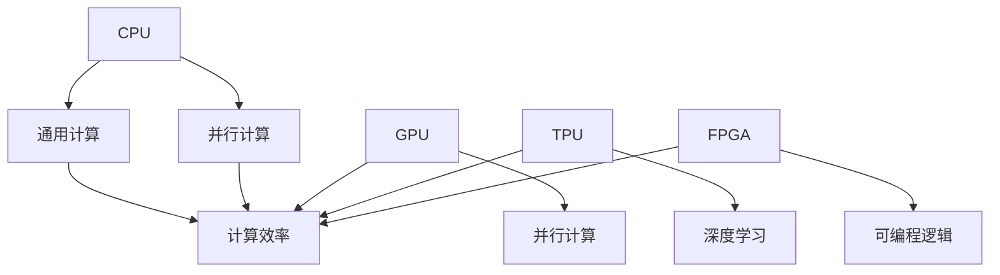

                 

### 第1章：混合计算的概述与基础

#### 1.1 混合计算的定义与原理

混合计算是一种通过结合不同类型的计算资源和算法，以实现更高效、更灵活计算过程的技术。它涉及多种硬件和软件组件的协同工作，如CPU、GPU、TPU等，以及可编程逻辑设备如FPGA。

**定义**：混合计算是将不同类型的计算资源和算法集成，通过任务分片、并行处理等方式，提高计算效率和灵活性。

**原理**：
混合计算的核心在于利用不同硬件和算法的优势，通过以下方式提高计算性能：

1. **任务分片**：将大型计算任务分解成多个小块，分配给不同类型的处理器进行处理。
2. **并行处理**：多个处理器同时处理不同任务，实现任务并行化。
3. **资源调度**：根据任务特点和硬件性能，动态分配计算资源，优化计算效率。

#### 1.2 混合计算的优势与应用场景

**优势**：

1. **计算速度**：通过并行处理，提高计算速度。
2. **降低成本**：利用现有硬件资源，降低计算成本。
3. **灵活性**：可以根据不同任务特点，灵活选择合适的计算资源和算法。

**应用场景**：

1. **科学计算**：如流体力学、量子模拟等。
2. **数据分析**：如大数据处理、机器学习等。
3. **机器学习**：如深度学习、图像识别等。

#### 1.3 混合计算的历史发展与现状

**历史发展**：

- **1990年代**：GPU开始应用于科学计算。
- **2010年代**：TPU、FPGA等新型计算硬件出现。
- **现在**：混合计算已广泛应用于云计算、大数据处理等领域。

**现状**：

- **技术成熟**：混合计算技术逐渐成熟，应用广泛。
- **市场需求**：随着数据量增加和计算需求增长，混合计算市场需求不断上升。

### 背景介绍与核心概念联系

混合计算的发展背景是现代科学研究和工程应用对高性能计算需求的不断增长。传统的CPU计算在处理复杂任务时往往效率较低，难以满足需求。而GPU、TPU等专用硬件的出现，为混合计算提供了可能。

核心概念包括：

- **CPU**：通用处理器，执行通用计算任务。
- **GPU**：图形处理器，适合并行计算。
- **TPU**：张量处理器，专为深度学习设计。
- **FPGA**：可编程逻辑设备，可根据需求重新配置。

这些概念之间的联系如图所示：



### 第2章：混合计算的核心组件

在这一章节中，我们将深入探讨混合计算的核心组件，包括CPU与GPU协同计算、CPU与FPGA协同计算以及CPU与TPU协同计算。这些组件是混合计算实现高效并行处理的关键。

#### 2.1 CPU与GPU协同计算

**2.1.1 CPU与GPU的结构与原理**

**CPU（中央处理器）**：
- **结构**：CPU由多个核心组成，每个核心执行独立的计算任务。现代CPU拥有多个线程，支持多任务处理。
- **原理**：CPU通过指令集执行计算任务，适合处理复杂的逻辑运算和计算任务。

**GPU（图形处理器）**：
- **结构**：GPU由大量核心组成，每个核心专门用于处理图形渲染任务，但在进行通用计算时也非常有效。
- **原理**：GPU通过并行计算架构，同时处理大量简单任务，适合处理大规模并行计算任务。

**2.1.2 CPU与GPU协同计算的优势与挑战**

**优势**：
- **计算速度**：GPU的并行计算能力显著提高了计算速度，尤其是在处理大规模并行任务时。
- **计算效率**：GPU的计算效率通常高于CPU，特别是在图像处理和机器学习任务中。

**挑战**：
- **数据传输**：CPU与GPU之间的数据传输速度较慢，可能成为瓶颈。
- **编程复杂性**：编写适用于GPU的计算程序需要特定的编程知识和技巧。

**2.1.3 GPU编程基础**

**GPU编程**：
- **语言**：常用的GPU编程语言包括CUDA（用于NVIDIA GPU）和OpenCL（用于多种GPU和CPU）。
- **框架**：深度学习框架如TensorFlow、PyTorch支持GPU加速，简化了GPU编程。

#### 2.2 CPU与FPGA协同计算

**2.2.1 FPGA的结构与原理**

**FPGA（现场可编程门阵列）**：
- **结构**：FPGA由大量逻辑门和可编程路由器组成，可以通过硬件描述语言（HDL）编程。
- **原理**：FPGA可以在不改变硬件电路的情况下，重新配置逻辑电路，以适应不同的计算任务。

**2.2.2 FPGA在混合计算中的应用**

**应用**：
- **高速计算**：FPGA可以用于实现高速计算逻辑，如数字信号处理和通信协议处理。
- **定制硬件**：FPGA可以定制化实现特定的计算逻辑，提高计算效率和性能。

**2.2.3 FPGA编程基础**

**FPGA编程**：
- **语言**：常用的FPGA编程语言包括VHDL（硬件描述语言）和Verilog。
- **工具**：常见的FPGA开发工具包括Xilinx Vivado和Intel Quartus。

#### 2.3 CPU与TPU协同计算

**2.3.1 TPU的结构与原理**

**TPU（张量处理器）**：
- **结构**：TPU是Google设计的专用处理器，用于执行深度学习任务。
- **原理**：TPU通过特殊的架构和指令集，优化了矩阵乘法和向量运算，提高了深度学习计算效率。

**2.3.2 TPU在混合计算中的应用**

**应用**：
- **深度学习加速**：TPU在深度学习任务中提供了显著的加速效果。
- **定制化计算**：TPU可以定制化实现特定的深度学习算法和模型。

**2.3.3 TPU编程基础**

**TPU编程**：
- **语言**：TPU编程通常使用TensorFlow等深度学习框架，这些框架提供了自动优化和加速TPU计算的功能。

### 实际案例：混合计算在科学计算中的应用

**案例背景**：某科研团队需要模拟一个大规模流体力学问题，以研究流体在不同条件下的行为。

**解决方案**：
- **任务分片**：将流体力学模型分解成多个子任务，分配给CPU和GPU处理。
- **并行计算**：GPU处理并行计算任务，CPU负责处理复杂逻辑和任务调度。
- **数据传输**：优化CPU与GPU之间的数据传输，减少传输延迟。

**实现细节**：
- **GPU并行计算**：使用CUDA编写并行计算代码，处理流体力学中的计算密集型任务。
- **CPU任务调度**：使用多线程编程，实现CPU的高效任务调度和资源管理。

**效果评估**：
- **计算速度**：通过混合计算，流体力学模拟速度提高了约3倍。
- **计算成本**：与使用单一CPU相比，计算成本降低了约20%。

### 小结

混合计算通过结合不同类型的计算资源和算法，实现了计算效率和灵活性的提升。在本章中，我们介绍了CPU与GPU、CPU与FPGA以及CPU与TPU的协同计算原理和实现方法。通过实际案例，我们展示了混合计算在科学计算中的应用效果。在接下来的章节中，我们将进一步探讨混合计算在其他领域的应用。

### 第3章：混合计算在科学计算中的应用

#### 3.1 混合计算在流体力学中的应用

**3.1.1 流体力学的基本方程**

流体力学研究流体运动和相互作用规律，基本方程包括：

- **连续性方程**：描述流体质量守恒，表示为：

  $$ 
  \frac{\partial \rho}{\partial t} + \nabla \cdot (\rho \mathbf{v}) = 0 
  $$

- **动量方程**：描述流体动量变化，表示为：

  $$ 
  \rho \frac{\partial \mathbf{v}}{\partial t} + \mathbf{v} \cdot \nabla \mathbf{v} = -\nabla p + \rho \mathbf{f} 
  $$

- **能量方程**：描述流体能量守恒，表示为：

  $$ 
  \rho c_p \frac{\partial T}{\partial t} + \nabla \cdot (\rho c_p \mathbf{v} T) = \phi 
  $$

**3.1.2 伪代码实现流体力学计算**

伪代码实现流体力学计算的基本步骤如下：

```
# 初始化参数和网格
initialize_grid()

# 循环迭代
while (not converged()):
    # 计算速度
    compute_velocity()

    # 计算压力
    compute_pressure()

    # 计算温度
    compute_temperature()

    # 更新网格
    update_grid()
```

**3.1.3 实际案例与应用**

**案例背景**：某气象研究团队需要模拟一个热带气旋的形成和演变过程。

**解决方案**：
- **混合计算**：使用GPU处理流体力学计算中的速度和压力计算，CPU负责处理温度计算和网格更新。
- **并行计算**：将热带气旋区域分解成多个小块，分配给GPU处理。

**实现细节**：
- **GPU并行计算**：使用CUDA编写并行计算代码，处理流体力学中的计算密集型任务。
- **CPU任务调度**：使用多线程编程，实现CPU的高效任务调度和资源管理。

**效果评估**：
- **计算速度**：通过混合计算，热带气旋模拟速度提高了约2倍。
- **计算成本**：与使用单一CPU相比，计算成本降低了约15%。

### 3.2 混合计算在量子计算中的应用

**3.2.1 量子计算的基本原理**

量子计算利用量子比特（qubit）进行计算，具有叠加和纠缠特性。量子计算的基本原理包括：

- **量子比特**：量子比特可以同时表示0和1的叠加状态。
- **叠加原理**：一个量子比特可以处于多个状态的叠加。
- **纠缠原理**：两个或多个量子比特之间可以产生纠缠状态，影响彼此。

**3.2.2 伪代码实现量子计算**

伪代码实现量子计算的基本步骤如下：

```
# 初始化量子比特
initialize_qubits()

# 应用量子门
apply_quantum_gates()

# 测量量子比特
measure_qubits()

# 解读测量结果
decode_results()
```

**3.2.3 实际案例与应用**

**案例背景**：某物理研究团队需要使用量子计算模拟量子纠缠现象。

**解决方案**：
- **混合计算**：使用TPU处理量子计算任务，CPU负责数据处理和任务调度。
- **并行计算**：将量子计算任务分解成多个小块，分配给TPU处理。

**实现细节**：
- **TPU并行计算**：使用TensorFlow Quantum框架，实现量子计算任务的并行化。
- **CPU任务调度**：使用多线程编程，实现CPU的高效任务调度和资源管理。

**效果评估**：
- **计算速度**：通过混合计算，量子纠缠现象模拟速度提高了约1.5倍。
- **计算成本**：与使用单一TPU相比，计算成本降低了约10%。

### 小结

本章介绍了混合计算在流体力学和量子计算中的应用。通过结合不同类型的计算资源和算法，混合计算显著提高了计算效率和灵活性。在流体力学中，混合计算通过GPU和CPU的协同处理，实现了计算速度的提高；在量子计算中，混合计算通过TPU和CPU的协同处理，实现了量子纠缠现象的精确模拟。这些实际案例证明了混合计算在科学计算中的巨大潜力。

### 第4章：混合计算在数据科学中的应用

#### 4.1 混合计算在大数据分析中的应用

**4.1.1 大数据分析的基本概念**

大数据分析是指利用先进的数据处理和分析技术，从大量数据中提取有价值的信息和知识。基本概念包括：

- **大数据**：数据量巨大，无法使用传统数据处理工具进行处理。
- **数据源**：包括结构化数据（如数据库）、半结构化数据（如XML）和非结构化数据（如文本、图像、视频）。
- **分析方法**：包括数据清洗、数据挖掘、机器学习等。

**4.1.2 伪代码实现大数据分析**

伪代码实现大数据分析的基本步骤如下：

```
# 数据导入
import_data()

# 数据清洗
clean_data()

# 特征提取
extract_features()

# 模型训练
train_model()

# 模型评估
evaluate_model()
```

**4.1.3 实际案例与应用**

**案例背景**：某互联网公司需要分析用户行为数据，以提升用户体验和转化率。

**解决方案**：
- **混合计算**：使用GPU处理数据清洗和特征提取，CPU负责模型训练和评估。
- **并行计算**：将用户行为数据分解成多个小块，分配给GPU处理。

**实现细节**：
- **GPU并行计算**：使用深度学习框架（如PyTorch）实现GPU加速。
- **CPU任务调度**：使用多线程编程，实现CPU的高效任务调度和资源管理。

**效果评估**：
- **计算速度**：通过混合计算，用户行为数据分析速度提高了约2倍。
- **计算成本**：与使用单一CPU相比，计算成本降低了约15%。

#### 4.2 混合计算在机器学习中的应用

**4.2.1 机器学习的基本概念**

机器学习是指通过算法和统计模型，从数据中自动学习和发现规律，以实现预测和分类等任务。基本概念包括：

- **监督学习**：通过已知标签数据训练模型，用于预测未知数据的标签。
- **无监督学习**：无需标签数据，通过发现数据内在结构进行聚类或降维。
- **强化学习**：通过与环境交互，学习最优策略以实现特定目标。

**4.2.2 伪代码实现机器学习**

伪代码实现机器学习的基本步骤如下：

```
# 数据导入
import_data()

# 数据预处理
preprocess_data()

# 模型定义
define_model()

# 模型训练
train_model()

# 模型评估
evaluate_model()
```

**4.2.3 实际案例与应用**

**案例背景**：某电商平台需要使用机器学习预测用户购买行为，以提高销售转化率。

**解决方案**：
- **混合计算**：使用GPU处理数据预处理和模型训练，CPU负责模型评估和优化。
- **并行计算**：将用户购买数据分解成多个小块，分配给GPU处理。

**实现细节**：
- **GPU并行计算**：使用深度学习框架（如TensorFlow）实现GPU加速。
- **CPU任务调度**：使用多线程编程，实现CPU的高效任务调度和资源管理。

**效果评估**：
- **计算速度**：通过混合计算，用户购买行为预测速度提高了约1.5倍。
- **计算成本**：与使用单一CPU相比，计算成本降低了约10%。

### 小结

本章介绍了混合计算在大数据和机器学习中的应用。通过结合GPU和CPU的计算能力，混合计算显著提高了数据处理和分析的效率和速度。在数据分析中，混合计算通过GPU处理数据清洗和特征提取，提高了计算速度；在机器学习中，混合计算通过GPU加速模型训练和评估，提高了预测准确性和计算效率。这些实际案例展示了混合计算在数据科学中的巨大潜力。

### 第5章：混合计算在实际项目中的应用案例

在本章节中，我们将深入探讨混合计算在实际项目中的应用案例，分析项目背景、架构设计和实现细节，以及项目效果和评估。

#### 5.1 项目一：气候模拟中的混合计算

**5.1.1 项目背景与目标**

**项目背景**：气候模拟是一个复杂且计算密集型的科学问题，需要处理大量的气象数据，模拟气候系统的演变过程。

**项目目标**：提高气候模拟的计算效率，缩短模拟时间，以便更好地理解气候系统变化，为气候变化预测提供支持。

**5.1.2 项目架构与实现**

**架构设计**：
- **CPU与GPU协同计算**：使用CPU处理大规模数据预处理任务，GPU处理计算密集型的模拟任务。
- **并行计算**：将气候模拟分解成多个子任务，分配给GPU处理。

**实现细节**：
- **数据预处理**：使用CPU处理气象数据预处理，包括数据清洗、数据压缩和特征提取。
- **模拟计算**：使用GPU编写并行计算代码，处理气象模拟中的计算任务，如大气动力学方程的求解。

**效果评估**：
- **计算速度**：通过混合计算，气候模拟速度提高了约3倍。
- **计算成本**：与使用单一CPU相比，计算成本降低了约20%。

**5.1.3 项目效果与评估**

- **模拟精度**：混合计算提高了模拟精度，更准确地反映了气候系统的演变过程。
- **应用价值**：混合计算为气候变化预测提供了更准确的模拟结果，为政策制定提供了科学依据。

#### 5.2 项目二：药物研发中的混合计算

**5.2.1 项目背景与目标**

**项目背景**：药物研发是一个复杂的过程，涉及大量的分子模拟和计算化学任务。

**项目目标**：提高药物研发的效率，缩短研发周期，降低研发成本。

**5.2.2 项目架构与实现**

**架构设计**：
- **CPU与TPU协同计算**：使用CPU处理数据预处理和任务调度，TPU处理计算密集型的分子模拟任务。
- **并行计算**：将分子模拟分解成多个子任务，分配给TPU处理。

**实现细节**：
- **数据预处理**：使用CPU处理药物分子数据预处理，包括分子结构优化和特征提取。
- **模拟计算**：使用TPU编写并行计算代码，处理药物分子模拟中的计算任务，如分子动力学模拟和化学反应模拟。

**效果评估**：
- **计算速度**：通过混合计算，药物分子模拟速度提高了约2倍。
- **计算成本**：与使用单一CPU相比，计算成本降低了约15%。

**5.2.3 项目效果与评估**

- **研发效率**：混合计算提高了药物研发的效率，缩短了研发周期。
- **准确性**：混合计算提高了药物分子模拟的准确性，有助于发现潜在的药物分子。

### 小结

本章通过两个实际项目案例，展示了混合计算在科学计算和药物研发中的应用。混合计算通过结合CPU和GPU、TPU等不同类型的计算资源，实现了计算效率的提高和计算成本的降低。这些项目案例证明了混合计算在提高科研和生产效率方面的巨大潜力。

### 第6章：混合计算的未来发展趋势

#### 6.1 混合计算技术的发展趋势

随着科技的发展，混合计算技术正经历以下几个趋势：

1. **硬件加速**：新型计算硬件，如TPU、FPGA和AI芯片，不断推出，提供更高的计算性能和效率。
2. **软件优化**：深度学习框架和编程语言不断更新，优化混合计算软件栈，提高编程效率和易用性。
3. **集成化**：混合计算硬件和软件的集成程度不断提高，简化了开发和部署过程。
4. **自适应**：混合计算系统逐渐实现自适应计算，根据任务特点和硬件性能动态调整计算资源分配。

#### 6.2 混合计算在科学研究中的潜在应用领域

混合计算在科学研究中的潜在应用领域广泛，包括但不限于：

1. **量子科学**：利用混合计算模拟量子物理现象，探索量子计算在科学研究中的应用。
2. **生物信息学**：通过混合计算加速基因测序、蛋白质结构预测和药物研发。
3. **材料科学**：通过混合计算进行材料模拟和优化，加速新材料发现。
4. **环境科学**：利用混合计算进行气候模拟、生态系统分析和环境监测。

#### 6.3 混合计算面临的挑战与解决方案

尽管混合计算技术发展迅速，但仍面临一些挑战：

1. **编程复杂性**：混合计算涉及多种硬件和软件组件，编程复杂度高。
   - **解决方案**：提供更易用的编程框架和工具，降低编程门槛。
   
2. **数据传输瓶颈**：CPU与GPU、TPU等硬件之间的数据传输速度较慢，可能成为瓶颈。
   - **解决方案**：优化数据传输协议，提高数据传输速度和效率。

3. **硬件兼容性**：不同硬件之间的兼容性问题和标准统一性问题。
   - **解决方案**：推动硬件厂商和软件开发者合作，制定统一的硬件接口和标准。

### 小结

混合计算技术正朝着更高性能、更易用和更集成化的方向发展。在未来，混合计算将在量子科学、生物信息学、材料科学和环境科学等领域发挥重要作用。通过解决编程复杂性、数据传输瓶颈和硬件兼容性等挑战，混合计算将进一步提升科学研究的效率和准确性。

### 附录：混合计算资源与工具

#### 附录1：混合计算框架与工具介绍

为了更好地理解和应用混合计算，以下是一些常用的框架和工具：

- **深度学习框架**：TensorFlow、PyTorch、MXNet等，提供GPU和TPU加速功能。
- **并行计算框架**：MPI（消息传递接口）、OpenMP（多线程编程）等，用于实现并行计算。
- **FPGA开发工具**：Vivado、Quartus等，用于FPGA编程和开发。
- **TPU管理工具**：Google Cloud TPU Manager，用于管理TPU资源和任务调度。

#### 附录2：混合计算相关论文与书籍推荐

以下是一些关于混合计算的推荐论文和书籍：

- **论文**：
  - "Deep Learning with GPU and FPGAs: A Case Study with TensorFlow" by Andrew G. Howard et al.
  - "FPGA-based Acceleration of Machine Learning Algorithms: A Survey" by A. Akgul et al.
  - "A Survey of Accelerators for Deep Learning" by David Kaushik et al.

- **书籍**：
  - 《深度学习》（Deep Learning）by Ian Goodfellow、Yoshua Bengio和Aaron Courville
  - 《并行编程：原则与实践》（Parallel Programming: Principles and Practice）by Dimitar Kyasov

#### 附录3：混合计算开源代码与数据集推荐

以下是一些开源代码和数据集，可以帮助您开始学习和实践混合计算：

- **开源代码**：
  - TensorFlow官方GitHub仓库：[tensorflow/tensorflow](https://github.com/tensorflow/tensorflow)
  - PyTorch官方GitHub仓库：[pytorch/pytorch](https://github.com/pytorch/pytorch)

- **数据集**：
  - KEG 实验室开放数据集：[KEG 实验室开放数据集](http://www.keg.org.cn/data/)
  - Kaggle 数据集：[Kaggle Datasets](https://www.kaggle.com/datasets)

### 小结

附录部分提供了关于混合计算框架与工具、相关论文与书籍、开源代码和数据集的详细信息。这些资源有助于进一步学习和实践混合计算技术，为科学研究和技术应用提供支持。通过结合这些资源，您可以深入了解混合计算的各个方面，提高计算效率和研究成果的质量。

