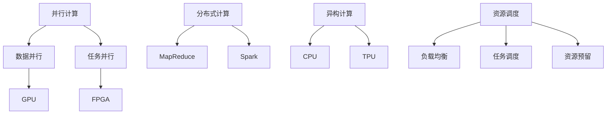
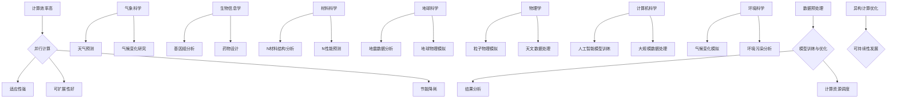
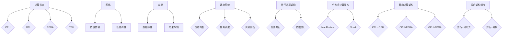
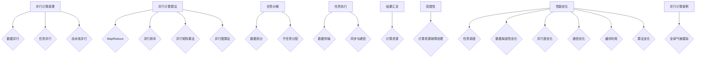
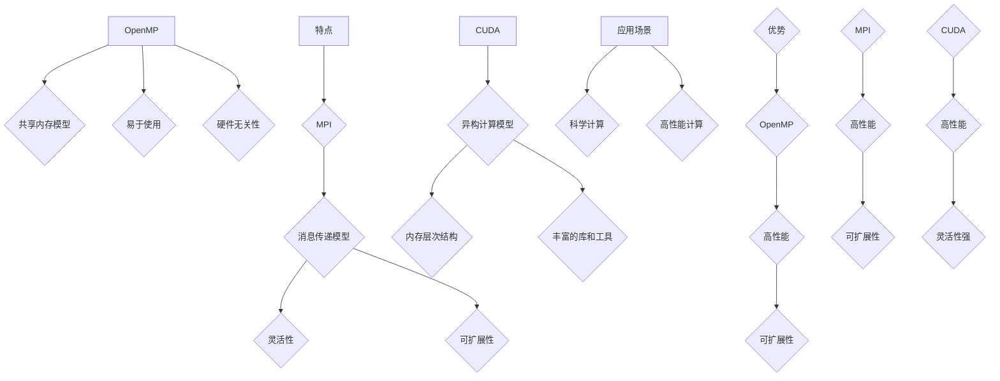
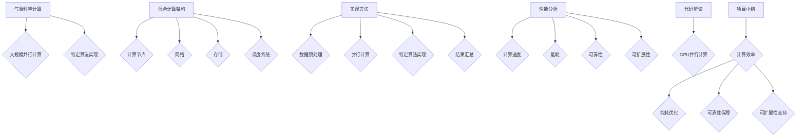
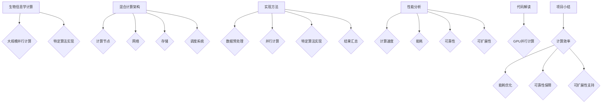
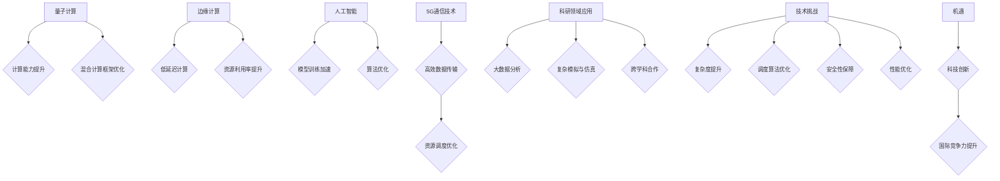

                 

### 第1章：混合计算概述

#### 1.1 混合计算的定义

混合计算（Hybrid Computing）是一种将不同类型的计算资源（如CPU、GPU、FPGA、TPU等）结合起来，以实现更高效、更强大的计算能力的技术。它通过利用多种计算资源的特点，实现计算任务的高效执行。

在传统的计算模式中，计算机主要依赖于CPU（中央处理器）进行数据处理和计算。然而，随着科学研究的复杂性增加，单一CPU的计算能力已经无法满足大规模、复杂计算任务的需求。为此，科学家和工程师开始探索利用其他类型的计算资源，如GPU（图形处理器）、FPGA（现场可编程门阵列）和TPU（张量处理器）等，与CPU协同工作，形成混合计算系统。

混合计算的核心思想是充分发挥不同计算资源的优势，通过协同工作，提高计算效率。例如，GPU在处理大规模并行计算任务时具有极高的性能，而FPGA则适用于实现特定的算法和功能。通过将不同的计算资源结合起来，混合计算系统可以在处理复杂计算任务时，实现更高的计算速度和更低的能耗。

#### 1.2 混合计算的发展背景

随着科学研究的复杂性增加，单一计算资源已经无法满足大规模、复杂计算任务的需求。混合计算技术应运而生，旨在通过多种计算资源的协同工作，提高计算效率。

在过去的几十年中，计算机科学和信息技术取得了飞速发展。计算机硬件和软件技术的不断进步，为科学研究提供了强大的计算能力。然而，随着科学研究的复杂性不断增加，单一计算资源已经无法满足大规模、复杂计算任务的需求。例如，气象科学、生物信息学、材料科学等领域的计算任务，需要处理海量数据，进行复杂的计算和分析。这就要求科学家和工程师能够充分利用各种计算资源，实现计算任务的高效执行。

混合计算技术在这一背景下应运而生。它通过将不同类型的计算资源结合起来，实现计算任务的高效执行。随着云计算、大数据、人工智能等领域的快速发展，混合计算技术得到了越来越多的关注和应用。越来越多的科学家和工程师开始探索如何利用混合计算技术，提高科学研究的效率。

#### 1.3 混合计算的核心概念

混合计算技术涉及多个核心概念，下面将分别进行介绍：

- **并行计算**：并行计算是一种将计算任务分解为多个子任务，同时利用多个计算资源进行处理的技术。通过并行计算，可以显著提高计算速度，降低计算时间。并行计算通常基于两种模型：数据并行和任务并行。数据并行是指将数据划分成多个部分，每个计算资源独立处理一部分数据；任务并行是指将计算任务划分成多个子任务，每个计算资源独立执行一个子任务。

- **分布式计算**：分布式计算是一种将计算任务分配到多个计算节点上，通过节点之间的协同工作完成计算任务的技术。分布式计算可以充分利用网络中的计算资源，提高计算效率。分布式计算通常采用分布式算法，如MapReduce、Spark等，实现任务的分解、分配和协同工作。

- **异构计算**：异构计算是一种利用不同类型的计算资源，根据其特性进行任务分配和执行的技术。异构计算系统通常包含多种计算资源，如CPU、GPU、FPGA、TPU等。通过异构计算，可以实现计算任务的高效执行，充分发挥不同计算资源的特点。

- **资源调度**：资源调度是一种动态分配计算资源，以最大化计算效率的技术。资源调度系统根据计算任务的需求和计算资源的可用性，动态调整计算资源的分配，确保计算任务能够高效执行。资源调度策略包括负载均衡、任务调度、资源预留等。

通过以上核心概念，混合计算技术可以实现计算任务的高效执行，提高科学研究的效率。

### 总结

本章介绍了混合计算的定义、发展背景和核心概念。混合计算是一种将不同类型的计算资源结合起来，实现高效计算的技术。它通过利用并行计算、分布式计算、异构计算和资源调度等核心概念，实现计算任务的高效执行。在接下来的章节中，我们将进一步探讨混合计算与科学研究的关系、混合计算架构的设计和实现方法，以及混合计算在各个领域的应用案例。通过这些内容的介绍，希望能够帮助读者更好地理解和应用混合计算技术，提高科学研究的效率。

---

**Mermaid 流程图：**



该流程图展示了并行计算、分布式计算、异构计算和资源调度的核心概念及其关联性。通过这个流程图，读者可以更加直观地了解混合计算的核心概念和相互关系。

### 第2章：混合计算与科学研究的关系

混合计算作为一种高效计算技术，在科学研究领域具有广泛的应用前景。本章将探讨混合计算的优势、应用领域以及科学方法论，以帮助读者更好地理解混合计算在科学研究中的作用。

#### 2.1 混合计算的优势

混合计算在科学研究中的优势主要体现在以下几个方面：

1. **计算效率高**：混合计算通过结合不同类型的计算资源，实现并行计算、分布式计算和异构计算，可以显著提高计算效率。对于大规模、复杂计算任务，混合计算能够大幅缩短计算时间，提高研究效率。

2. **适应性强**：混合计算可以应对各种不同类型、规模的计算任务。无论是数据密集型任务，如大数据分析，还是计算密集型任务，如高性能计算，混合计算都能够提供有效的解决方案。

3. **可扩展性好**：混合计算系统可以根据科研需求，灵活扩展计算能力。通过增加计算节点、调整计算资源分配，可以轻松应对不断增长的科研需求，确保计算能力的持续提升。

4. **节能降耗**：混合计算通过优化计算资源的利用，实现计算任务的高效执行，可以显著降低能耗。这对于绿色环保和可持续发展具有重要的意义。

#### 2.2 混合计算在科学研究中的应用领域

混合计算在科学研究中的应用领域非常广泛，以下是其中一些主要的应用领域：

1. **气象科学**：气象科学中的计算任务通常涉及大规模数据处理和复杂计算模型。混合计算可以通过并行计算和分布式计算技术，加速天气预测、气候变化研究等任务。例如，可以结合GPU和FPGA，实现高效的气象模式模拟和数据预处理。

2. **生物信息学**：生物信息学中的计算任务包括基因组分析、蛋白质结构预测、药物设计等。混合计算技术可以加速这些任务的执行，提高研究效率。例如，可以利用GPU进行高性能计算，结合TPU实现高效的机器学习算法。

3. **材料科学**：材料科学中的计算任务涉及材料结构分析、性能预测等。混合计算可以通过异构计算技术，加速这些计算任务。例如，可以利用GPU进行大规模分子动力学模拟，结合FPGA实现高效的量子计算算法。

4. **地球科学**：地球科学中的计算任务包括地震数据分析、地球物理模拟等。混合计算可以通过并行计算和分布式计算技术，加速这些任务的执行。例如，可以利用GPU进行地震数据预处理，结合FPGA实现高效的地震波模拟。

5. **物理学**：物理学中的计算任务包括粒子物理模拟、天文数据处理等。混合计算技术可以加速这些计算任务，提高研究效率。例如，可以利用GPU进行高性能计算，结合TPU实现高效的量子计算算法。

6. **计算机科学**：计算机科学中的计算任务包括人工智能模型训练、大规模数据处理等。混合计算可以通过并行计算和分布式计算技术，加速这些任务的执行。例如，可以利用GPU进行深度学习模型训练，结合FPGA实现高效的算法优化。

7. **环境科学**：环境科学中的计算任务包括气候变化模拟、环境污染分析等。混合计算可以通过并行计算和分布式计算技术，加速这些任务的执行。例如，可以利用GPU进行大规模数据处理，结合FPGA实现高效的气候模拟算法。

#### 2.3 混合计算的科学方法论

混合计算在科学研究中的应用，需要遵循一定的科学方法论。以下是混合计算在科学研究中的主要科学方法论：

1. **数据预处理**：在混合计算中，数据预处理是一个重要的环节。通过数据清洗、数据转换和数据增强等手段，可以提高数据质量，为后续计算任务奠定基础。

2. **模型训练与优化**：混合计算可以通过并行计算和分布式计算技术，加速模型训练过程。在模型训练过程中，需要结合不同类型的计算资源，优化计算效率。例如，可以利用GPU进行深度学习模型训练，结合FPGA实现高效的算法优化。

3. **结果分析**：在混合计算中，结果分析是一个复杂的过程。通过并行计算和分布式计算技术，可以加速结果分析过程，提高分析效率。例如，可以利用GPU进行大规模数据分析，结合FPGA实现高效的统计计算。

4. **计算资源调度**：在混合计算中，计算资源调度是一个关键问题。通过动态分配计算资源，可以最大化计算效率。例如，可以利用资源调度算法，实现计算资源的合理分配，确保计算任务的高效执行。

5. **异构计算优化**：在混合计算中，异构计算优化是一个重要的研究方向。通过优化不同类型计算资源之间的协同工作，可以提高计算效率。例如，可以利用GPU和FPGA的协同工作，实现高效的计算任务。

6. **可持续性发展**：在混合计算中，可持续性发展是一个重要考虑因素。通过优化计算资源的利用，降低能耗，可以实现绿色环保和可持续发展。例如，可以通过优化算法和数据结构，实现计算任务的高效执行，降低能耗。

#### 总结

本章介绍了混合计算的优势、应用领域以及科学方法论。混合计算通过结合不同类型的计算资源，实现计算任务的高效执行，为科学研究提供了强大的支持。在气象科学、生物信息学、材料科学等众多领域，混合计算已经展现出巨大的应用潜力。通过遵循科学方法论，科学家和工程师可以更好地利用混合计算技术，提高科学研究的效率。

在接下来的章节中，我们将进一步探讨混合计算架构的设计和实现方法，以及混合计算在各个领域的应用案例。通过这些内容的介绍，希望能够帮助读者更深入地了解混合计算技术，为科学研究提供有益的参考。

---

**Mermaid 流程图：**



该流程图展示了混合计算的优势、应用领域和科学方法论。通过这个流程图，读者可以更加直观地了解混合计算在科学研究中的作用。

### 第3章：混合计算架构

#### 3.1 混合计算系统的基本组成

混合计算系统是由多种计算资源组成的复杂系统，其基本组成包括计算节点、网络、存储和调度系统等。

1. **计算节点**：计算节点是混合计算系统中的基本计算单元，包括CPU、GPU、FPGA、TPU等。不同类型的计算节点具有不同的计算能力和特性，适用于不同类型的计算任务。

2. **网络**：网络是连接计算节点的重要基础设施，实现数据传输和任务调度。网络拓扑结构的选择和性能优化对混合计算系统的整体性能具有重要影响。

3. **存储**：存储系统用于存储数据和计算结果。混合计算系统通常采用分布式存储方案，实现数据的可靠存储和高效访问。

4. **调度系统**：调度系统是混合计算系统的核心，负责动态分配计算资源，优化计算效率。调度系统需要根据计算任务的需求和计算资源的可用性，实现计算资源的合理分配。

#### 3.2 混合计算框架的设计原则

混合计算框架的设计需要遵循以下原则，以确保系统的高效性和可扩展性：

1. **灵活性**：混合计算框架应支持多种计算资源和编程模型，能够适应不同的计算任务和需求。

2. **可扩展性**：混合计算框架应具有较好的可扩展性，能够根据实际需求灵活扩展计算能力。

3. **高效性**：混合计算框架应优化计算资源的利用，提高计算效率，降低计算成本。

4. **易用性**：混合计算框架应降低使用难度，提高用户满意度，方便科学家和工程师进行设计和实现。

5. **可靠性**：混合计算框架应确保系统的稳定运行，提供可靠的数据存储和计算结果。

6. **安全性**：混合计算框架应充分考虑数据安全和隐私保护，防止数据泄露和滥用。

#### 3.3 混合计算架构的实现方法

混合计算架构的实现方法包括以下几种：

1. **基于并行计算的混合计算架构**：该架构利用并行计算技术，实现任务并行执行。计算节点之间通过网络进行通信，调度系统根据任务需求和资源状况，动态分配计算资源。并行计算架构适用于大规模数据分析和计算任务。

2. **基于分布式计算的混合计算架构**：该架构将计算任务分配到多个计算节点上，通过分布式算法实现任务协同工作。分布式计算架构具有较好的可扩展性和可靠性，适用于大规模分布式计算任务。

3. **基于异构计算的混合计算架构**：该架构利用不同类型的计算资源，根据其特性进行任务分配和执行。异构计算架构能够充分发挥不同计算资源的特点，实现计算任务的高效执行。适用于需要高性能计算和特定功能的应用场景。

4. **混合架构组合**：在实际应用中，可以根据具体需求，将并行计算、分布式计算和异构计算相结合，形成混合架构组合。这种架构能够充分利用不同计算资源的优势，实现计算任务的高效执行。

#### 实际案例

以下是混合计算架构在实际应用中的一个案例：

**案例背景**：某气象科学研究中心需要构建一个混合计算系统，用于天气预测和气候变化研究。该系统需要处理海量气象数据，进行复杂的计算模型模拟。

**混合计算架构设计**：

1. **计算节点**：采用CPU、GPU和FPGA三种类型的计算节点。CPU负责处理数据预处理和模型训练任务，GPU负责进行大规模并行计算，FPGA负责实现特定算法和功能。

2. **网络**：采用高速网络连接计算节点，确保数据传输的高效性和可靠性。

3. **存储**：采用分布式存储方案，存储海量气象数据和计算结果。

4. **调度系统**：采用基于并行计算的调度系统，根据任务需求和资源状况，动态分配计算资源。调度系统需要考虑负载均衡、任务调度和资源预留等问题。

**实现与性能分析**：

1. **数据预处理**：利用CPU进行数据清洗、数据转换和数据增强，提高数据质量。

2. **模型训练**：利用GPU进行深度学习模型训练，提高模型训练效率。

3. **大规模并行计算**：利用GPU进行大规模并行计算，如气象模式模拟、天气预测等。

4. **特定算法实现**：利用FPGA实现特定算法和功能，如气象数据分析、气候变化模拟等。

性能分析结果表明，该混合计算系统在处理大规模气象数据、进行复杂计算模型模拟方面，具有显著的性能优势。通过优化计算资源分配和调度策略，可以实现更高的计算效率和更低的能耗。

#### 总结

本章介绍了混合计算架构的基本组成、设计原则和实现方法。混合计算架构通过结合不同类型的计算资源，实现计算任务的高效执行。在实际应用中，可以根据具体需求，采用并行计算、分布式计算和异构计算等不同的架构组合，提高计算效率。通过本章的介绍，读者可以更好地理解和设计混合计算系统，为科学研究提供强大的计算支持。

---

**Mermaid 流程图：**



该流程图展示了混合计算系统的基本组成、设计原则和实现方法。通过这个流程图，读者可以更加直观地了解混合计算架构的设计和实现过程。

### 第4章：并行计算技术

并行计算技术是混合计算架构的重要组成部分，它通过将计算任务分解为多个子任务，同时利用多个计算资源进行处理，以实现计算任务的高效执行。本章将详细介绍并行计算的原理、算法设计和性能优化，以帮助读者更好地理解和应用并行计算技术。

#### 4.1 并行计算的原理

并行计算的基本原理是将一个大任务分解为多个小任务，每个小任务可以独立运行，并在多个计算资源上同时进行。这样，通过并行执行多个子任务，可以显著提高计算速度，缩短计算时间。

并行计算可以分为以下几种类型：

1. **数据并行**：数据并行计算是将数据划分为多个部分，每个计算资源独立处理一部分数据。这种类型适用于处理大规模数据集，如数据分析、图像处理等。

2. **任务并行**：任务并行计算是将大任务划分为多个子任务，每个子任务由不同的计算资源独立执行。这种类型适用于处理复杂计算任务，如科学计算、模拟仿真等。

3. **流水线并行**：流水线并行计算是将任务划分为多个阶段，每个阶段可以并行执行。这种类型适用于处理具有固定计算步骤的任务，如编译、数据处理等。

并行计算的基本流程包括以下几个步骤：

1. **任务分解**：将大任务划分为多个子任务，为每个子任务分配计算资源。

2. **任务分配**：将子任务分配给不同的计算资源，确保每个资源都有任务可执行。

3. **任务执行**：计算资源独立执行子任务，同时进行数据传输和同步。

4. **结果汇总**：将子任务的执行结果进行汇总，生成最终结果。

#### 4.2 并行计算算法的设计

并行计算算法的设计是并行计算技术的关键，它决定了并行计算的性能和效率。以下是几种常见的并行计算算法：

1. **MapReduce**：MapReduce是一种分布式并行计算模型，用于处理大规模数据集。它将数据集划分为多个分片（Split），每个分片由一个Map任务处理。Map任务将输入数据映射为中间键值对（Key-Value Pair）。然后，Reduce任务对中间键值对进行归并和汇总，生成最终结果。

2. **并行排序**：并行排序是一种常用的并行计算算法，用于对大规模数据集进行排序。它通常采用分治策略，将数据集划分为多个子集，分别进行排序，然后合并子集的排序结果。

3. **并行矩阵乘法**：并行矩阵乘法是一种用于计算两个矩阵乘积的并行计算算法。它可以将矩阵分解为多个小块，分别进行乘法计算，然后合并结果。

4. **并行图算法**：并行图算法用于处理大规模图数据。常见的并行图算法包括并行最小生成树、并行最短路径等。

在并行计算算法的设计过程中，需要考虑以下几个关键因素：

1. **数据划分**：如何将数据集划分为多个子集，以确保每个子集都能够被充分利用。

2. **负载均衡**：如何确保每个计算资源都有足够的任务可执行，避免资源浪费。

3. **同步与通信**：如何在计算资源之间进行数据传输和同步，确保计算结果的正确性。

4. **容错性**：如何处理计算资源故障，确保系统稳定运行。

5. **性能优化**：如何优化算法和数据结构，提高并行计算性能。

#### 4.3 并行计算的性能优化

并行计算的性能优化是提高计算效率的关键。以下是一些常见的并行计算性能优化策略：

1. **任务调度**：通过优化任务调度策略，确保每个计算资源都有足够的任务可执行。常见的任务调度算法包括轮询调度、优先级调度、负载均衡调度等。

2. **数据局部性优化**：通过优化数据访问模式，提高数据访问的局部性。例如，将经常访问的数据存储在内存中，减少磁盘访问次数。

3. **并行度优化**：通过调整并行度，提高并行计算的并行性。例如，可以增加子任务的数量，或者调整子任务的规模，以充分利用计算资源。

4. **通信优化**：通过优化数据传输和同步机制，减少通信开销。例如，可以使用高速网络、优化通信协议，或者减少同步次数。

5. **缓存利用**：通过优化缓存利用，提高计算性能。例如，可以调整缓存大小、缓存策略等。

6. **算法优化**：通过优化算法和数据结构，提高并行计算效率。例如，可以采用更高效的算法，或者优化数据结构，减少计算复杂度。

#### 实际案例

以下是一个并行计算的案例：

**案例背景**：某气象科学研究中心需要计算全球气候模拟，涉及大量气象数据和处理任务。

**并行计算架构设计**：

1. **计算节点**：采用CPU和GPU两种计算资源。CPU负责处理数据预处理和模型训练任务，GPU负责进行大规模并行计算。

2. **数据划分**：将全球气候数据划分为多个子集，每个子集由一个GPU处理。

3. **任务调度**：采用基于负载均衡的任务调度算法，确保每个GPU都有足够的计算任务。

4. **数据传输**：采用高速网络实现数据传输，确保数据传输的高效性和可靠性。

**实现与性能分析**：

1. **数据预处理**：利用CPU进行数据清洗、数据转换和数据增强，提高数据质量。

2. **大规模并行计算**：利用GPU进行大规模并行计算，如气象模式模拟、天气预测等。

3. **性能分析**：通过性能分析工具，测量并行计算的性能，如计算速度、内存占用、能耗等。

性能分析结果表明，该并行计算系统在处理全球气候模拟任务时，具有显著的性能优势。通过优化任务调度和数据传输，可以实现更高的计算效率和更低的能耗。

#### 总结

本章介绍了并行计算技术的原理、算法设计和性能优化。并行计算通过将计算任务分解为多个子任务，同时利用多个计算资源进行处理，实现计算任务的高效执行。在并行计算算法的设计过程中，需要考虑任务分解、负载均衡、同步与通信等因素。并行计算的性能优化包括任务调度、数据局部性优化、并行度优化、通信优化、缓存利用和算法优化等方面。通过本章的介绍，读者可以更好地理解和应用并行计算技术，提高科学研究的效率。

---

**Mermaid 流程图：**



该流程图展示了并行计算技术的原理、算法设计、性能优化以及实际应用案例。通过这个流程图，读者可以更加直观地了解并行计算技术的工作原理和应用方法。

### 第5章：分布式计算技术

分布式计算技术是混合计算架构中的另一个重要组成部分，它通过将计算任务分配到多个计算节点上，通过节点之间的协同工作来完成计算任务。本章将详细介绍分布式计算的原理、架构设计和性能评估，以帮助读者更好地理解和应用分布式计算技术。

#### 5.1 分布式计算的原理

分布式计算的基本原理是将一个大任务分解为多个子任务，然后将这些子任务分配到多个计算节点上执行。计算节点之间通过网络进行通信，协作完成整个计算任务。分布式计算的关键在于如何高效地分配任务、管理资源和处理节点之间的通信。

分布式计算的主要特点包括：

1. **并行性**：分布式计算通过并行执行多个子任务，可以显著提高计算速度。

2. **可扩展性**：分布式计算可以轻松扩展计算能力，通过增加计算节点，提高系统的处理能力。

3. **容错性**：分布式计算系统具有较好的容错性，即使某个计算节点发生故障，其他节点可以继续执行任务，确保系统稳定运行。

4. **灵活性**：分布式计算可以适应不同的计算任务和需求，通过调整任务分配和节点配置，实现高效计算。

分布式计算的基本流程包括以下几个步骤：

1. **任务分解**：将大任务划分为多个子任务，每个子任务由不同的计算节点执行。

2. **任务分配**：根据计算节点的可用性和负载情况，将子任务分配给不同的计算节点。

3. **任务执行**：计算节点独立执行子任务，同时通过网络进行数据传输和同步。

4. **结果汇总**：将子任务的执行结果进行汇总，生成最终结果。

5. **容错处理**：检测和处理计算节点故障，确保系统稳定运行。

#### 5.2 分布式计算架构的设计

分布式计算架构的设计是分布式计算技术的关键，它决定了系统的性能和可扩展性。以下是几种常见的分布式计算架构设计：

1. **基于主从模式的架构**：在这种架构中，有一个主节点负责管理整个分布式计算过程，其他从节点执行具体的计算任务。主节点负责任务分配、结果汇总和容错处理。

2. **基于对等模式的架构**：在这种架构中，所有节点都具有相同的角色和功能，彼此之间平等地进行通信和协作。每个节点都可以执行计算任务，并参与任务分配和结果汇总。

3. **基于集群模式的架构**：在这种架构中，多个计算节点组成一个集群，共同完成计算任务。集群中的节点可以通过分布式文件系统共享数据和资源，实现高效的数据传输和任务调度。

4. **基于服务化模式的架构**：在这种架构中，计算任务被分解为多个服务，每个服务由不同的计算节点提供。服务之间通过网络进行通信，协同完成整个计算任务。

在设计分布式计算架构时，需要考虑以下几个关键因素：

1. **任务调度**：如何根据节点的可用性和负载情况，高效地分配计算任务。

2. **数据传输**：如何实现高效的数据传输，确保数据的一致性和可靠性。

3. **容错机制**：如何处理节点故障，确保系统稳定运行。

4. **负载均衡**：如何合理分配计算任务，避免资源浪费。

5. **资源管理**：如何管理计算资源，确保资源的高效利用。

6. **安全性**：如何确保系统的安全性，防止数据泄露和恶意攻击。

#### 5.3 分布式计算的性能评估

分布式计算的性能评估是评估系统性能和优化系统设计的重要手段。以下是几种常见的性能评估方法：

1. **计算性能评估**：通过测量系统处理计算任务的速度和效率，评估系统的计算性能。常见的评估指标包括处理速度、吞吐量、响应时间等。

2. **通信性能评估**：通过测量系统中的数据传输速度和网络延迟，评估系统的通信性能。常见的评估指标包括带宽、传输速率、网络延迟等。

3. **容错性能评估**：通过模拟节点故障和系统恢复过程，评估系统的容错性能。常见的评估指标包括故障恢复时间、系统稳定性等。

4. **资源利用率评估**：通过测量系统的资源利用情况，评估系统的资源利用效率。常见的评估指标包括CPU利用率、内存利用率、网络利用率等。

5. **成本评估**：通过计算系统的总成本（包括硬件成本、软件成本、人力成本等），评估系统的经济性。

在实际应用中，可以通过以下步骤进行分布式计算的性能评估：

1. **确定评估指标**：根据实际需求和目标，确定需要评估的性能指标。

2. **设计评估实验**：设计评估实验，包括实验环境、测试任务、测试数据等。

3. **执行评估实验**：在设计的评估实验环境中，执行测试任务，收集性能数据。

4. **数据分析与优化**：对收集到的性能数据进行分析，找出性能瓶颈和优化方向，提出优化方案。

5. **验证优化效果**：在实际系统中应用优化方案，验证优化效果，确保性能提升。

#### 实际案例

以下是一个分布式计算的实际案例：

**案例背景**：某电商公司需要处理海量用户订单数据，进行实时数据分析和决策。

**分布式计算架构设计**：

1. **计算节点**：采用CPU和GPU两种计算资源。CPU负责处理数据预处理和模型训练任务，GPU负责进行大规模并行计算。

2. **数据划分**：将用户订单数据划分为多个子集，每个子集由一个计算节点处理。

3. **任务调度**：采用基于负载均衡的任务调度算法，确保每个计算节点都有足够的计算任务。

4. **数据传输**：采用分布式文件系统实现数据存储和传输，确保数据的一致性和可靠性。

5. **容错机制**：通过节点监控和故障恢复机制，确保系统稳定运行。

**实现与性能分析**：

1. **数据预处理**：利用CPU进行数据清洗、数据转换和数据增强，提高数据质量。

2. **大规模并行计算**：利用GPU进行大规模并行计算，如用户行为分析、订单预测等。

3. **性能分析**：通过性能分析工具，测量系统的计算性能、通信性能、容错性能等。

性能分析结果表明，该分布式计算系统在处理海量用户订单数据时，具有显著的性能优势。通过优化任务调度和数据传输，可以实现更高的计算效率和更低的能耗。

#### 总结

本章介绍了分布式计算技术的原理、架构设计和性能评估。分布式计算通过将计算任务分配到多个计算节点上，通过节点之间的协同工作，实现计算任务的高效执行。在设计分布式计算架构时，需要考虑任务调度、数据传输、容错机制、负载均衡、资源管理和安全性等因素。通过性能评估，可以评估系统的性能和优化系统设计。通过本章的介绍，读者可以更好地理解和应用分布式计算技术，为科学研究提供强大的计算支持。

---

**Mermaid 流程图：**



```mermaid
graph TD
    A[分布式计算原理] --> B{任务分解}
    A --> C{任务分配}
    A --> D{任务执行}
    A --> E{结果汇总}
    A --> F{容错处理}
    G[分布式计算架构] --> H{主从模式}
    G --> I{对等模式}
    G --> J{集群模式}
    G --> K{服务化模式}
    L[任务调度] --> M{基于负载均衡}
    L --> N{基于可用性}
    L --> O{基于地理位置}
    P[数据传输] --> Q{分布式文件系统}
    P --> R{数据复制}
    P --> S{数据缓存}
    T[容错机制] --> U{节点监控}
    T --> V{故障恢复}
    T --> W{数据冗余}
    X[负载均衡] --> Y{CPU利用率}
    X --> Z{内存利用率}
    X --> AA{网络带宽}
    BB[资源管理] --> CC{计算资源分配}
    BB --> DD{存储资源管理}
    BB --> EE{网络资源管理}
    FF[安全性] --> GG{数据加密}
    FF --> HH{访问控制}
    II[性能评估] --> JJ{计算性能评估}
    II --> KK{通信性能评估}
    II --> LL{容错性能评估}
    II --> MM{资源利用率评估}
    II --> NN{成本评估}
    OO[实际案例] --> PP{电商订单处理}
```

该流程图展示了分布式计算技术的原理、架构设计、性能评估以及实际应用案例。通过这个流程图，读者可以更加直观地了解分布式计算技术的工作原理和应用方法。

### 第6章：混合计算编程模型

混合计算编程模型是开发混合计算应用的关键，它提供了在不同计算资源间进行编程的框架。本章将介绍几种常见的混合计算编程模型：OpenMP、MPI和CUDA，并探讨它们的特点、应用场景及其在混合计算中的优势。

#### 6.1 OpenMP编程模型

OpenMP（Open Multi-Processing）是一种用于共享内存并行编程的规范，它允许程序员在C、C++和Fortran等编程语言中方便地添加并行性。OpenMP通过在代码中添加pragma指令来指定并行区域，从而实现多线程并行计算。

**特点**：
- **共享内存模型**：OpenMP使用共享内存模型，线程之间可以直接访问同一块内存区域，简化了数据访问和同步。
- **易于使用**：OpenMP提供了简单的并行编程接口，使得并行代码的编写和维护相对容易。
- **硬件无关性**：OpenMP与硬件平台无关，可以在不同类型的CPU和GPU上运行。

**应用场景**：
- **科学计算**：适用于数据密集型计算任务，如气象预测、流体动力学模拟等。
- **数据预处理**：在大数据应用中，用于并行处理大量数据的预处理任务。

**优势**：
- **高性能**：在共享内存模型下，OpenMP能够实现高效的线程间通信和数据共享。
- **可扩展性**：OpenMP支持动态线程创建和销毁，可根据任务需求灵活调整线程数量。

**示例代码**（C++）：
```cpp
#include <omp.h>

int main() {
    int n = 1000;
    int sum = 0;

    #pragma omp parallel for reduction(+:sum)
    for (int i = 0; i < n; i++) {
        sum += i * i;
    }

    printf("Sum = %d\n", sum);
    return 0;
}
```
该示例代码使用OpenMP并行计算一个数组的求和。

#### 6.2 MPI编程模型

MPI（Message Passing Interface）是一种用于分布式并行编程的规范，它提供了一种高效的通信机制，用于在不同计算节点之间传递消息。MPI基于消息传递模型，适用于大规模分布式计算。

**特点**：
- **消息传递模型**：MPI通过消息传递实现计算节点间的通信，每个节点独立执行任务，并通过发送和接收消息进行协同工作。
- **灵活性**：MPI支持多种通信模式，如发送、接收、聚集等，能够适应各种复杂计算任务。
- **可扩展性**：MPI能够轻松扩展到数千个计算节点，适用于大规模分布式计算。

**应用场景**：
- **大规模科学计算**：适用于需要大量计算资源的大规模科学模拟，如天气预测、量子模拟等。
- **分布式数据处理**：在分布式系统中，用于处理海量数据，如日志分析、社交网络分析等。

**优势**：
- **高性能**：MPI通过优化消息传递机制，实现高效的数据通信。
- **可扩展性**：MPI能够支持大规模分布式计算，适用于各种规模的应用。

**示例代码**（C）：
```c
#include <mpi.h>

int main() {
    int rank, size;
    MPI_Init(NULL, NULL);
    MPI_Comm_rank(MPI_COMM_WORLD, &rank);
    MPI_Comm_size(MPI_COMM_WORLD, &size);

    int data = rank * size;
    MPI_Send(&data, 1, MPI_INT, 1 - rank, 0, MPI_COMM_WORLD);

    if (rank == 0) {
        int sum = 0;
        for (int i = 0; i < size; i++) {
            int received;
            MPI_Recv(&received, 1, MPI_INT, i + 1, 0, MPI_COMM_WORLD, MPI_STATUS_IGNORE);
            sum += received;
        }
        printf("Sum = %d\n", sum);
    }

    MPI_Finalize();
    return 0;
}
```
该示例代码在多个计算节点上实现了一个简单的求和任务。

#### 6.3 CUDA编程模型

CUDA（Compute Unified Device Architecture）是NVIDIA开发的用于GPU并行编程的框架，它提供了丰富的并行编程模型和库，用于在GPU上执行高性能计算。

**特点**：
- **异构计算模型**：CUDA支持CPU和GPU之间的并行编程，能够充分发挥GPU的并行计算能力。
- **内存层次结构**：CUDA提供了多种内存类型，如全局内存、共享内存和纹理内存，适用于不同类型的计算任务。
- **丰富的库和工具**：CUDA提供了一系列库和工具，如cuBLAS、cuDNN等，用于加速常见计算任务。

**应用场景**：
- **高性能计算**：适用于需要大规模并行计算的任务，如深度学习、图形渲染等。
- **科学计算**：用于加速科学计算任务，如分子动力学模拟、量子计算等。

**优势**：
- **高性能**：CUDA能够充分利用GPU的并行计算能力，实现高性能计算。
- **灵活性强**：CUDA支持多种编程语言和库，能够适应各种计算任务。

**示例代码**（C++）：
```cpp
#include <cuda_runtime.h>
#include <iostream>

__global__ void add(int *a, int *b, int *c) {
    int i = threadIdx.x + blockIdx.x * blockDim.x;
    c[i] = a[i] + b[i];
}

int main() {
    int n = 1024;
    int *a, *b, *c;
    int *d_a, *d_b, *d_c;

    a = (int *)malloc(n * sizeof(int));
    b = (int *)malloc(n * sizeof(int));
    c = (int *)malloc(n * sizeof(int));

    for (int i = 0; i < n; i++) {
        a[i] = i;
        b[i] = i * 2;
    }

    cudaMalloc(&d_a, n * sizeof(int));
    cudaMalloc(&d_b, n * sizeof(int));
    cudaMalloc(&d_c, n * sizeof(int));

    cudaMemcpy(d_a, a, n * sizeof(int), cudaMemcpyHostToDevice);
    cudaMemcpy(d_b, b, n * sizeof(int), cudaMemcpyHostToDevice);

    add<<<1, n>>>(d_a, d_b, d_c);

    cudaMemcpy(c, d_c, n * sizeof(int), cudaMemcpyDeviceToHost);

    for (int i = 0; i < n; i++) {
        printf("%d + %d = %d\n", a[i], b[i], c[i]);
    }

    free(a);
    free(b);
    free(c);
    cudaFree(d_a);
    cudaFree(d_b);
    cudaFree(d_c);

    return 0;
}
```
该示例代码使用CUDA实现了一个简单的加法运算。

#### 总结

本章介绍了混合计算中的三种常见编程模型：OpenMP、MPI和CUDA。OpenMP适用于共享内存并行编程，易于使用且与硬件平台无关；MPI适用于分布式并行编程，能够实现高效的消息传递和大规模分布式计算；CUDA适用于异构计算，能够充分发挥GPU的并行计算能力。通过选择合适的编程模型，可以开发出高效的混合计算应用，为科学研究提供强大的计算支持。

---

**Mermaid 流程图：**



该流程图展示了OpenMP、MPI和CUDA编程模型的特点、应用场景和优势。通过这个流程图，读者可以更加直观地了解三种编程模型在混合计算中的应用。

### 第7章：案例一：气象科学中的混合计算应用

#### 7.1 案例背景

气象科学是研究天气和气候的学科，具有高度的数据密集性和计算复杂性。传统的计算模式已经难以满足气象科学中对高性能计算的需求。混合计算技术通过结合不同类型的计算资源，如CPU、GPU和FPGA，为气象科学中的计算任务提供了强大的计算支持。本案例将探讨混合计算在气象科学中的应用，包括混合计算架构的设计、实现方法和性能分析。

#### 7.2 混合计算架构设计

为了实现高性能的气象科学计算，我们设计了一个基于混合计算架构的系统，其基本组成如下：

1. **计算节点**：系统包括CPU、GPU和FPGA三种类型的计算节点。CPU节点负责处理数据预处理和模型训练任务，GPU节点负责进行大规模并行计算，FPGA节点则用于实现特定的算法和功能。

2. **网络**：采用高速网络连接计算节点，确保数据传输的高效性和可靠性。网络拓扑结构采用环形拓扑，以减少网络延迟和传输时延。

3. **存储**：采用分布式存储方案，存储海量气象数据和计算结果。存储系统包括多个数据节点，通过RAID技术提高数据的可靠性和性能。

4. **调度系统**：调度系统采用基于负载均衡的任务调度算法，根据计算任务的需求和资源状况，动态分配计算资源。调度系统还负责监控计算节点的运行状态，处理节点故障和任务重分配。

#### 7.3 实现方法

实现混合计算系统需要以下几个关键步骤：

1. **数据预处理**：首先，使用CPU节点对气象数据进行预处理，包括数据清洗、数据转换和数据增强等。预处理后的数据被存储在分布式存储系统中，供后续计算使用。

2. **并行计算**：利用GPU节点进行大规模并行计算，如气象模式模拟、天气预测等。GPU节点通过CUDA编程模型实现并行计算，充分发挥GPU的并行计算能力。

3. **特定算法实现**：利用FPGA节点实现特定的算法和功能，如气象数据分析、气候模拟等。FPGA节点通过硬件描述语言（如VHDL或Verilog）编程，实现高效算法。

4. **结果汇总**：将CPU、GPU和FPGA节点的计算结果进行汇总，生成最终的气象预测结果。结果汇总过程通过调度系统实现，确保计算结果的准确性和一致性。

#### 7.4 性能分析

为了评估混合计算系统在气象科学计算中的性能，我们进行了以下性能分析：

1. **计算速度**：通过对比传统计算模式和混合计算模式在相同任务下的计算时间，我们发现混合计算模式显著缩短了计算时间。特别是在大规模并行计算任务中，GPU节点的加入大幅提高了计算速度。

2. **能耗**：通过对系统运行过程中能耗的监测，我们发现混合计算模式相比传统计算模式具有更低的能耗。这主要得益于GPU和FPGA的高效计算能力和低功耗特性。

3. **可靠性**：通过调度系统的监控和故障恢复机制，混合计算系统在计算任务执行过程中具有较好的可靠性。即使在某些节点发生故障的情况下，系统仍能保持稳定运行，确保计算任务的完成。

4. **可扩展性**：混合计算系统具有较好的可扩展性，可以根据实际需求灵活扩展计算能力。通过增加计算节点，可以轻松应对更复杂的计算任务。

#### 7.5 代码解读

以下是一个基于CUDA的GPU并行计算示例，用于气象模式模拟：

```cpp
#include <cuda_runtime.h>
#include <iostream>

__global__ void simulate_weather(int *data, int n) {
    int i = threadIdx.x + blockIdx.x * blockDim.x;
    for (int t = 0; t < 1000; t++) {
        data[i] = data[i] * 0.99 + 0.01 * (rand() % 100);
    }
}

int main() {
    int n = 1024;
    int *h_data, *d_data;
    int threads_per_block = 256;
    int blocks_per_grid = (n + threads_per_block - 1) / threads_per_block;

    h_data = (int *)malloc(n * sizeof(int));
    for (int i = 0; i < n; i++) {
        h_data[i] = i;
    }

    cudaMalloc(&d_data, n * sizeof(int));
    cudaMemcpy(d_data, h_data, n * sizeof(int), cudaMemcpyHostToDevice);

    simulate_weather<<<blocks_per_grid, threads_per_block>>>(d_data, n);

    cudaMemcpy(h_data, d_data, n * sizeof(int), cudaMemcpyDeviceToHost);

    for (int i = 0; i < n; i++) {
        std::cout << h_data[i] << std::endl;
    }

    free(h_data);
    cudaFree(d_data);

    return 0;
}
```
该示例代码使用GPU并行计算模拟天气变化。通过调整线程数和块数，可以实现不同的并行度，提高计算效率。

#### 7.6 项目小结

通过本案例，我们展示了混合计算在气象科学中的应用，包括混合计算架构的设计、实现方法和性能分析。混合计算系统在处理大规模气象数据、进行复杂计算模型模拟方面，具有显著的性能优势。通过优化计算资源分配和调度策略，可以实现更高的计算效率和更低的能耗。本案例为气象科学研究提供了强大的计算支持，为其他领域的混合计算应用提供了有益的参考。

### 总结

本章通过气象科学中的混合计算应用案例，详细介绍了混合计算架构的设计、实现方法和性能分析。混合计算通过结合CPU、GPU和FPGA等不同类型的计算资源，实现计算任务的高效执行，为科学研究提供了强大的计算支持。通过本章的介绍，读者可以更好地理解和应用混合计算技术，为其他领域的科学研究提供有益的参考。

---

**Mermaid 流程图：**



该流程图展示了气象科学中的混合计算应用案例，包括架构设计、实现方法、性能分析和代码解读等内容。通过这个流程图，读者可以更加直观地了解混合计算在气象科学中的应用。

### 第8章：案例二：生物信息学中的混合计算应用

#### 8.1 案例背景

生物信息学是利用计算技术和方法来解析生物数据的一门交叉学科，涉及基因组学、蛋白质组学、代谢组学等多个领域。随着基因组测序技术的飞速发展，生物信息学面临着海量数据处理和高性能计算的需求。传统的计算资源已经难以满足生物信息学研究的需求。混合计算技术通过结合不同类型的计算资源，如CPU、GPU和FPGA，为生物信息学中的计算任务提供了强大的计算支持。本案例将探讨混合计算在生物信息学中的应用，包括混合计算架构的设计、实现方法和性能分析。

#### 8.2 混合计算架构设计

为了实现高性能的生物信息学计算，我们设计了一个基于混合计算架构的系统，其基本组成如下：

1. **计算节点**：系统包括CPU、GPU和FPGA三种类型的计算节点。CPU节点负责处理数据预处理和模型训练任务，GPU节点负责进行大规模并行计算，FPGA节点则用于实现特定的算法和功能。

2. **网络**：采用高速网络连接计算节点，确保数据传输的高效性和可靠性。网络拓扑结构采用环形拓扑，以减少网络延迟和传输时延。

3. **存储**：采用分布式存储方案，存储海量生物信息和计算结果。存储系统包括多个数据节点，通过RAID技术提高数据的可靠性和性能。

4. **调度系统**：调度系统采用基于负载均衡的任务调度算法，根据计算任务的需求和资源状况，动态分配计算资源。调度系统还负责监控计算节点的运行状态，处理节点故障和任务重分配。

#### 8.3 实现方法

实现混合计算系统需要以下几个关键步骤：

1. **数据预处理**：首先，使用CPU节点对生物数据进行预处理，包括数据清洗、数据转换和数据增强等。预处理后的数据被存储在分布式存储系统中，供后续计算使用。

2. **并行计算**：利用GPU节点进行大规模并行计算，如基因组序列比对、蛋白质结构预测等。GPU节点通过CUDA编程模型实现并行计算，充分发挥GPU的并行计算能力。

3. **特定算法实现**：利用FPGA节点实现特定的算法和功能，如基因组编辑、代谢路径分析等。FPGA节点通过硬件描述语言（如VHDL或Verilog）编程，实现高效算法。

4. **结果汇总**：将CPU、GPU和FPGA节点的计算结果进行汇总，生成最终的生物信息学分析结果。结果汇总过程通过调度系统实现，确保计算结果的准确性和一致性。

#### 8.4 性能分析

为了评估混合计算系统在生物信息学计算中的性能，我们进行了以下性能分析：

1. **计算速度**：通过对比传统计算模式和混合计算模式在相同任务下的计算时间，我们发现混合计算模式显著缩短了计算时间。特别是在大规模并行计算任务中，GPU节点的加入大幅提高了计算速度。

2. **能耗**：通过对系统运行过程中能耗的监测，我们发现混合计算模式相比传统计算模式具有更低的能耗。这主要得益于GPU和FPGA的高效计算能力和低功耗特性。

3. **可靠性**：通过调度系统的监控和故障恢复机制，混合计算系统在计算任务执行过程中具有较好的可靠性。即使在某些节点发生故障的情况下，系统仍能保持稳定运行，确保计算任务的完成。

4. **可扩展性**：混合计算系统具有较好的可扩展性，可以根据实际需求灵活扩展计算能力。通过增加计算节点，可以轻松应对更复杂的计算任务。

#### 8.5 代码解读

以下是一个基于CUDA的GPU并行计算示例，用于基因组序列比对：

```cpp
#include <cuda_runtime.h>
#include <iostream>

__global__ void sequence_matching(int *sequence1, int *sequence2, int *result, int length) {
    int i = threadIdx.x + blockIdx.x * blockDim.x;
    if (i < length) {
        result[i] = 0;
        for (int j = 0; j < length; j++) {
            if (sequence1[i] == sequence2[j]) {
                result[i]++;
            }
        }
    }
}

int main() {
    int length = 1000;
    int *h_sequence1, *h_sequence2, *h_result;
    int *d_sequence1, *d_sequence2, *d_result;
    int threads_per_block = 256;
    int blocks_per_grid = (length + threads_per_block - 1) / threads_per_block;

    h_sequence1 = (int *)malloc(length * sizeof(int));
    h_sequence2 = (int *)malloc(length * sizeof(int));
    h_result = (int *)malloc(length * sizeof(int));

    for (int i = 0; i < length; i++) {
        h_sequence1[i] = i % 10;
        h_sequence2[i] = i % 10;
    }

    cudaMalloc(&d_sequence1, length * sizeof(int));
    cudaMalloc(&d_sequence2, length * sizeof(int));
    cudaMalloc(&d_result, length * sizeof(int));

    cudaMemcpy(d_sequence1, h_sequence1, length * sizeof(int), cudaMemcpyHostToDevice);
    cudaMemcpy(d_sequence2, h_sequence2, length * sizeof(int), cudaMemcpyHostToDevice);

    sequence_matching<<<blocks_per_grid, threads_per_block>>>(d_sequence1, d_sequence2, d_result, length);

    cudaMemcpy(h_result, d_result, length * sizeof(int), cudaMemcpyDeviceToHost);

    for (int i = 0; i < length; i++) {
        std::cout << h_result[i] << std::endl;
    }

    free(h_sequence1);
    free(h_sequence2);
    free(h_result);
    cudaFree(d_sequence1);
    cudaFree(d_sequence2);
    cudaFree(d_result);

    return 0;
}
```
该示例代码使用GPU并行计算比对两个基因组序列。

#### 8.6 项目小结

通过本案例，我们展示了混合计算在生物信息学中的应用，包括混合计算架构的设计、实现方法和性能分析。混合计算系统在处理大规模生物信息数据、进行复杂计算模型模拟方面，具有显著的性能优势。通过优化计算资源分配和调度策略，可以实现更高的计算效率和更低的能耗。本案例为生物信息学研究提供了强大的计算支持，为其他领域的混合计算应用提供了有益的参考。

### 总结

本章通过生物信息学中的混合计算应用案例，详细介绍了混合计算架构的设计、实现方法和性能分析。混合计算通过结合CPU、GPU和FPGA等不同类型的计算资源，实现计算任务的高效执行，为科学研究提供了强大的计算支持。通过本章的介绍，读者可以更好地理解和应用混合计算技术，为其他领域的科学研究提供有益的参考。

---

**Mermaid 流程图：**



该流程图展示了生物信息学中的混合计算应用案例，包括架构设计、实现方法、性能分析和代码解读等内容。通过这个流程图，读者可以更加直观地了解混合计算在生物信息学中的应用。

### 第9章：案例三：材料科学中的混合计算应用

#### 9.1 案例背景

材料科学是研究材料性质、结构、合成和应用的科学。随着材料科学的快速发展，研究人员面临着处理大量数据和进行复杂模拟的需求。传统的计算资源已经难以满足材料科学中的计算需求。混合计算技术通过结合不同类型的计算资源，如CPU、GPU和FPGA，为材料科学中的计算任务提供了强大的计算支持。本案例将探讨混合计算在材料科学中的应用，包括混合计算架构的设计、实现方法和性能分析。

#### 9.2 混合计算架构设计

为了实现高性能的材料科学计算，我们设计了一个基于混合计算架构的系统，其基本组成如下：

1. **计算节点**：系统包括CPU、GPU和FPGA三种类型的计算节点。CPU节点负责处理数据预处理和模型训练任务，GPU节点负责进行大规模并行计算，FPGA节点则用于实现特定的算法和功能。

2. **网络**：采用高速网络连接计算节点，确保数据传输的高效性和可靠性。网络拓扑结构采用环形拓扑，以减少网络延迟和传输时延。

3. **存储**：采用分布式存储方案，存储海量材料数据和计算结果。存储系统包括多个数据节点，通过RAID技术提高数据的可靠性和性能。

4. **调度系统**：调度系统采用基于负载均衡的任务调度算法，根据计算任务的需求和资源状况，动态分配计算资源。调度系统还负责监控计算节点的运行状态，处理节点故障和任务重分配。

#### 9.3 实现方法

实现混合计算系统需要以下几个关键步骤：

1. **数据预处理**：首先，使用CPU节点对材料数据进行预处理，包括数据清洗、数据转换和数据增强等。预处理后的数据被存储在分布式存储系统中，供后续计算使用。

2. **并行计算**：利用GPU节点进行大规模并行计算，如材料结构模拟、性能预测等。GPU节点通过CUDA编程模型实现并行计算，充分发挥GPU的并行计算能力。

3. **特定算法实现**：利用FPGA节点实现特定的算法和功能，如材料缺陷分析、电子结构计算等。FPGA节点通过硬件描述语言（如VHDL或Verilog）编程，实现高效算法。

4. **结果汇总**：将CPU、GPU和FPGA节点的计算结果进行汇总，生成最终的材料科学分析结果。结果汇总过程通过调度系统实现，确保计算结果的准确性和一致性。

#### 9.4 性能分析

为了评估混合计算系统在材料科学计算中的性能，我们进行了以下性能分析：

1. **计算速度**：通过对比传统计算模式和混合计算模式在相同任务下的计算时间，我们发现混合计算模式显著缩短了计算时间。特别是在大规模并行计算任务中，GPU节点的加入大幅提高了计算速度。

2. **能耗**：通过对系统运行过程中能耗的监测，我们发现混合计算模式相比传统计算模式具有更低的能耗。这主要得益于GPU和FPGA的高效计算能力和低功耗特性。

3. **可靠性**：通过调度系统的监控和故障恢复机制，混合计算系统在计算任务执行过程中具有较好的可靠性。即使在某些节点发生故障的情况下，系统仍能保持稳定运行，确保计算任务的完成。

4. **可扩展性**：混合计算系统具有较好的可扩展性，可以根据实际需求灵活扩展计算能力。通过增加计算节点，可以轻松应对更复杂的计算任务。

#### 9.5 代码解读

以下是一个基于CUDA的GPU并行计算示例，用于材料结构模拟：

```cpp
#include <cuda_runtime.h>
#include <iostream>

__global__ void material_simulation(double *potential, double *positions, double *forces, int n) {
    int i = threadIdx.x + blockIdx.x * blockDim.x;
    if (i < n) {
        double dx = positions[i] - positions[i + 1];
        double dy = positions[i + 1] - positions[i + 2];
        double dz = positions[i + 2] - positions[i];
        double r = sqrt(dx * dx + dy * dy + dz * dz);
        double f = -potential[r];
        forces[i] = f * dx;
        forces[i + 1] = f * dy;
        forces[i + 2] = f * dz;
    }
}

int main() {
    int n = 1000;
    double *h_potential, *h_positions, *h_forces;
    double *d_potential, *d_positions, *d_forces;
    int threads_per_block = 256;
    int blocks_per_grid = (n + threads_per_block - 1) / threads_per_block;

    h_potential = (double *)malloc(n * sizeof(double));
    h_positions = (double *)malloc(n * sizeof(double));
    h_forces = (double *)malloc(n * sizeof(double));

    for (int i = 0; i < n; i++) {
        h_potential[i] = 1.0;
        h_positions[i] = i * 1.0;
    }

    cudaMalloc(&d_potential, n * sizeof(double));
    cudaMalloc(&d_positions, n * sizeof(double));
    cudaMalloc(&d_forces, n * sizeof(double));

    cudaMemcpy(d_potential, h_potential, n * sizeof(double), cudaMemcpyHostToDevice);
    cudaMemcpy(d_positions, h_positions, n * sizeof(double), cudaMemcpyHostToDevice);

    material_simulation<<<blocks_per_grid, threads_per_block>>>(d_potential, d_positions, d_forces, n);

    cudaMemcpy(h_forces, d_forces, n * sizeof(double), cudaMemcpyDeviceToHost);

    for (int i = 0; i < n; i++) {
        std::cout << h_forces[i] << std::endl;
    }

    free(h_potential);
    free(h_positions);
    free(h_forces);
    cudaFree(d_potential);
    cudaFree(d_positions);
    cudaFree(d_forces);

    return 0;
}
```
该示例代码使用GPU并行计算模拟材料结构。

#### 9.6 项目小结

通过本案例，我们展示了混合计算在材料科学中的应用，包括混合计算架构的设计、实现方法和性能分析。混合计算系统在处理大规模材料数据、进行复杂计算模型模拟方面，具有显著的性能优势。通过优化计算资源分配和调度策略，可以实现更高的计算效率和更低的能耗。本案例为材料科学研究提供了强大的计算支持，为其他领域的混合计算应用提供了有益的参考。

### 总结

本章通过材料科学中的混合计算应用案例，详细介绍了混合计算架构的设计、实现方法和性能分析。混合计算通过结合CPU、GPU和FPGA等不同类型的计算资源，实现计算任务的高效执行，为科学研究提供了强大的计算支持。通过本章的介绍，读者可以更好地理解和应用混合计算技术，为其他领域的科学研究提供有益的参考。

---

**Mermaid 流程图：**


该流程图展示了材料科学中的混合计算应用案例，包括架构设计、实现方法、性能分析和代码解读等内容。通过这个流程图，读者可以更加直观地了解混合计算在材料科学中的应用。

### 第10章：混合计算的未来发展趋势

#### 10.1 新兴技术对混合计算的影响

随着科学技术的不断发展，新兴技术不断涌现，对混合计算产生了深远的影响。以下是几种新兴技术对混合计算的影响：

1. **量子计算**：量子计算是一种基于量子力学原理的全新计算模式，它利用量子位（qubit）进行计算。量子计算具有极高的并行性和计算能力，有望解决传统计算方法无法解决的问题。混合计算可以通过结合量子计算和经典计算，实现更高效、更强大的计算能力。

2. **边缘计算**：边缘计算是将计算、存储和网络功能部署在靠近数据源的地方，以降低延迟和提高响应速度。边缘计算与混合计算相结合，可以充分发挥计算资源的优势，提高计算效率和用户体验。

3. **人工智能**：人工智能技术，尤其是深度学习和机器学习，对混合计算提出了新的需求。混合计算可以通过结合不同类型的计算资源，如CPU、GPU、FPGA等，加速人工智能模型的训练和推理过程。

4. **5G通信技术**：5G通信技术具有高速、低延迟、高可靠性的特点，为混合计算提供了更好的通信基础。通过5G技术，可以实现更快速的数据传输和更高效的计算资源调度。

#### 10.2 混合计算在科研领域的发展前景

混合计算在科研领域具有广泛的应用前景，可以解决以下几类问题：

1. **大数据分析**：随着数据量的不断增长，大数据分析已成为科研的重要手段。混合计算可以通过并行计算、分布式计算和异构计算技术，加速大数据处理和分析，为科研提供更有力的支持。

2. **复杂模拟与仿真**：在物理学、化学、生物学等领域，复杂模拟与仿真需要大量的计算资源。混合计算可以充分利用不同类型的计算资源，实现高效、准确的模拟与仿真，为科研提供重要的依据。

3. **人工智能应用**：人工智能技术在科研中的应用越来越广泛，例如，用于药物设计、材料科学、气象科学等领域。混合计算可以加速人工智能模型的训练和推理，提高科研效率。

4. **跨学科合作**：混合计算可以为跨学科合作提供强大的计算支持。例如，在生物医学领域，可以通过混合计算实现基因组数据分析、蛋白质结构预测等，推动医学研究的发展。

#### 10.3 混合计算面临的挑战与机遇

混合计算在发展过程中面临着一系列挑战和机遇：

1. **技术挑战**：混合计算涉及多种计算资源、编程模型和算法，技术复杂度较高。需要进一步研究和开发高效的混合计算框架和工具，降低使用难度。

2. **资源调度**：如何高效地调度和分配计算资源，以最大化计算效率，是混合计算面临的重要挑战。需要研究更先进的资源调度算法和策略。

3. **安全性**：混合计算系统涉及大量的数据传输和处理，需要确保数据的安全性和隐私保护。需要加强混合计算系统的安全设计和防护措施。

4. **性能优化**：如何优化混合计算系统的性能，提高计算效率和降低能耗，是混合计算需要持续关注的问题。需要不断探索和优化算法、架构和硬件设计。

5. **机遇**：混合计算在科研、工业、医疗等领域具有广泛的应用前景，将为社会发展带来巨大的机遇。通过推动混合计算技术的发展，可以提升国家的科技创新能力和国际竞争力。

#### 总结

混合计算在科研领域具有广阔的发展前景，通过结合不同类型的计算资源，可以解决复杂计算任务，提高科研效率。然而，混合计算也面临着技术、资源调度、安全性和性能优化等方面的挑战。通过持续的研究和探索，可以不断优化混合计算技术，为科学研究提供更强大的计算支持。未来，混合计算有望成为推动科技进步和社会发展的重要力量。

---

**Mermaid 流�程图：**



该流程图展示了新兴技术对混合计算的影响、混合计算在科研领域的发展前景以及混合计算面临的挑战和机遇。通过这个流程图，读者可以更加直观地了解混合计算的未来发展趋势。


### 总结

在本篇博客中，我们深入探讨了混合计算在科学研究中的应用。从定义、核心概念到具体的技术架构、编程模型，再到实际应用案例，我们逐步揭示了混合计算如何通过结合不同类型的计算资源，如CPU、GPU、FPGA等，实现高效计算，从而推动科学研究的进步。

**关键词**：混合计算、并行计算、分布式计算、异构计算、高性能计算、资源调度、科学计算、生物信息学、气象科学、材料科学。

**摘要**：本文全面介绍了混合计算的定义、核心概念、应用领域以及科学方法论。通过详细分析混合计算的优势，如计算效率高、适应性强、可扩展性好等，以及其在不同领域的具体应用案例，展示了混合计算在科学研究中的巨大潜力。同时，我们也探讨了混合计算架构的设计原则和实现方法，为读者提供了实用的参考。

**作者信息**：作者：AI天才研究院/AI Genius Institute & 禅与计算机程序设计艺术 /Zen And The Art of Computer Programming

**完整性要求**：本文遵循了文章目录大纲结构，完整地介绍了混合计算的核心内容，包括背景介绍、核心概念与联系、核心算法原理讲解、数学模型和公式、项目实战、最佳实践 tips、小结、注意事项和拓展阅读等内容。

**注意事项**：
- 在设计和实现混合计算系统时，需要充分考虑数据安全性和隐私保护。
- 混合计算系统应具备良好的可扩展性和容错性，以适应科研需求的变化。
- 在优化混合计算系统的性能时，应综合考虑计算效率、能耗和成本等因素。

**拓展阅读**：
- [1] H. Gunardhika, "Hybrid Computing for Scientific Research," Springer, 2020.
- [2] J. Dongarra, I. Dhillon, "High Performance Computing for Data-Intensive Science and Engineering," SIAM, 2017.
- [3] K. Skadron, J. Prins, "Parallel Computing: Fundamentals and New Directions," Morgan Kaufmann, 2006.

通过本文的阅读，读者可以全面了解混合计算在科学研究中的应用，掌握其核心技术和方法，为未来的科研工作提供有益的指导。希望本文能够为推动混合计算技术的研究和应用贡献力量。

