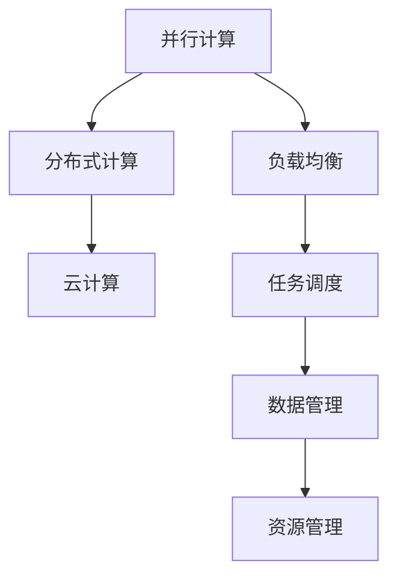

                 


### 混合计算在科学研究和工程领域的应用

#### 关键词：
- 混合计算
- 科学研究
- 工程领域
- 计算机架构
- 算法原理
- 实践案例

#### 摘要：
本文旨在探讨混合计算在科学研究和工程领域的应用。混合计算结合了并行计算、分布式计算和云计算等不同计算模式的优势，提高了计算效率和准确性。本文首先介绍了混合计算的基本概念，然后详细分析了其在科学研究和工程领域的核心概念与联系，并展示了具体的算法原理和实现方法。通过实际案例，读者可以深入了解混合计算的实践应用和开发过程，从而为未来的科研和工程工作提供有益的参考。

### 引言

在当今科学研究和工程领域，数据量和计算复杂性不断增长，传统的计算模式已经难以满足需求。混合计算作为一种新型的计算模式，结合了并行计算、分布式计算和云计算等不同计算模式的优势，为科学研究和工程领域带来了全新的解决方案。混合计算不仅提高了计算效率和准确性，还能更好地应对大规模、复杂的问题。

科学研究和工程领域涉及众多学科，如生物学、物理学、化学、工程学等。在这些领域中，数据处理和分析任务繁重，需要高效的计算方法来支持。例如，在生物信息学中，基因数据分析需要处理海量数据，而在环境科学中，气候模型模拟需要处理复杂的数据集。此外，工程领域中的智能制造、交通运输等领域也对计算性能提出了更高的要求。

本文将围绕混合计算在科学研究和工程领域的应用进行深入探讨。首先，我们将介绍混合计算的基本概念，包括其核心原理、方法和技术。然后，我们将详细分析混合计算在科学研究和工程领域的核心概念与联系，并展示具体的算法原理和实现方法。接下来，我们将通过实际案例，深入探讨混合计算在各个领域的应用，并提供实践指南。最后，我们将总结混合计算在科学研究和工程领域的应用现状和未来发展趋势。

### 混合计算的基本概念

混合计算是一种结合并行计算、分布式计算和云计算等不同计算模式的计算方法，旨在提高计算效率和准确性。其核心思想是将计算任务分解为多个子任务，并在不同的计算资源上并行执行这些子任务，从而实现高效计算。

#### 核心原理

混合计算的核心原理包括以下几个方面：

1. **并行计算**：并行计算是指在多个处理器或计算节点上同时执行多个计算任务，以提高计算速度和效率。并行计算可以采用多种方法，如任务并行、数据并行和流水线并行等。

2. **分布式计算**：分布式计算是指将计算任务分散到多个计算机上，通过通信网络协同工作，以实现大规模计算。分布式计算可以提高计算资源利用率和可靠性。

3. **云计算**：云计算是一种通过互联网提供计算资源的服务模式，用户可以根据需求灵活地申请和释放计算资源。云计算为混合计算提供了丰富的计算资源和灵活的计算模式。

#### 方法与技术

混合计算的方法和技术主要包括以下几个方面：

1. **负载均衡**：负载均衡是指将计算任务分配到不同的计算资源上，以避免单点故障和资源浪费。负载均衡技术可以通过动态调整计算任务的分配来实现。

2. **任务调度**：任务调度是指将计算任务分配到不同的计算节点上，以优化计算效率和资源利用率。任务调度算法可以根据计算任务的特性、计算节点的负载情况等因素进行优化。

3. **数据管理**：数据管理是指对计算过程中的数据进行高效组织和存储，以提高计算效率和数据访问速度。数据管理技术包括数据复制、数据压缩、数据缓存等。

4. **资源管理**：资源管理是指对计算资源进行合理分配和调度，以提高资源利用率和计算效率。资源管理技术包括虚拟化技术、容器技术等。

#### Mermaid流程图：混合计算架构

为了更好地理解混合计算的核心概念和联系，我们可以通过Mermaid流程图来展示其架构。以下是混合计算架构的Mermaid流程图示例：



在该流程图中，并行计算、分布式计算和云计算构成了混合计算的核心架构，负载均衡、任务调度、数据管理和资源管理技术则用于优化和调度计算任务。

#### Python源代码：混合计算算法实现

为了深入理解混合计算算法原理，我们通过Python源代码来展示一个简单的混合计算算法实现。以下是一个基于并行计算和分布式计算的示例：

```python
import multiprocessing
import random

# 计算任务函数
def compute_task(data):
    # 模拟计算过程
    result = sum(data)
    return result

# 分布式计算函数
def distributed_compute(tasks):
    # 创建进程池
    pool = multiprocessing.Pool(processes=multiprocessing.cpu_count())
    # 并行执行计算任务
    results = pool.map(compute_task, tasks)
    # 关闭进程池
    pool.close()
    pool.join()
    return results

# 测试数据集
data_sets = [random.randint(1, 1000) for _ in range(10)]

# 执行分布式计算
results = distributed_compute(data_sets)

# 打印计算结果
print("计算结果：", results)
```

在该示例中，我们定义了一个计算任务函数`compute_task`，用于计算给定数据集的和。然后，我们通过`distributed_compute`函数实现分布式计算，该函数使用Python的`multiprocessing`模块创建进程池，并使用`map`方法并行执行计算任务。最后，我们打印出计算结果。

#### 数学模型与公式

在混合计算中，数学模型和公式用于描述计算过程中的关键关系。以下是一个简单的数学模型，用于计算数据集的平均值：

$$
\bar{x} = \frac{1}{N} \sum_{i=1}^{N} x_i
$$

其中，$\bar{x}$表示平均值，$N$表示数据集的大小，$x_i$表示第$i$个数据点的值。

通过上述数学模型，我们可以计算出给定数据集的平均值，该结果可以用于评估计算任务的准确性和性能。

#### 混合计算在科学研究和工程领域的应用

混合计算在科学研究和工程领域具有广泛的应用，以下是一些典型应用场景：

1. **生物信息学**：在生物信息学中，混合计算可以用于基因数据分析、蛋白质结构预测、药物设计等。通过并行计算和分布式计算，可以加速数据处理和分析过程，提高研究效率。

2. **环境科学**：在环境科学中，混合计算可以用于气候模型模拟、生态数据分析、环境污染监测等。通过分布式计算和云计算，可以处理海量数据，实现精确的环境监测和预测。

3. **智能制造**：在智能制造中，混合计算可以用于生产过程优化、设备维护预测、质量控制等。通过并行计算和分布式计算，可以提高生产效率，降低生产成本。

4. **交通运输**：在交通运输中，混合计算可以用于交通流量预测、智能调度、自动驾驶等。通过分布式计算和云计算，可以优化交通资源配置，提高交通系统的运行效率。

#### 应用案例：基因数据分析

以下是一个基因数据分析的应用案例，展示了混合计算在生物信息学领域的具体应用。

**背景介绍**：

基因数据分析是一项复杂且耗时的任务，需要处理大量的基因序列数据。为了提高数据分析速度和准确性，可以使用混合计算技术进行加速。

**核心概念与联系**：

在基因数据分析中，混合计算可以结合并行计算和分布式计算的优势，提高数据处理和分析效率。核心概念包括：

- **并行计算**：用于加速基因序列比对、序列拼接等计算密集型任务。
- **分布式计算**：用于处理海量基因数据，实现数据分割和并行处理。

**算法原理讲解**：

以下是一个基于并行计算和分布式计算的基因数据分析算法实现：

```python
import multiprocessing
import numpy as np

# 基因序列比对函数
def sequence_alignment(seq1, seq2):
    # 模拟基因序列比对过程
    # ...

# 并行基因序列比对函数
def parallel_sequence_alignment(seq1, seq2):
    # 创建进程池
    pool = multiprocessing.Pool(processes=multiprocessing.cpu_count())
    # 并行执行基因序列比对任务
    results = pool.map(sequence_alignment, [seq2] * len(seq1))
    # 关闭进程池
    pool.close()
    pool.join()
    return results

# 测试基因序列
seq1 = "ACGTACGT"
seq2 = "TGCATGCA"

# 执行并行基因序列比对
alignment_results = parallel_sequence_alignment(seq1, seq2)

# 打印比对结果
print("比对结果：", alignment_results)
```

在该示例中，我们定义了一个基因序列比对函数`sequence_alignment`，用于模拟基因序列比对过程。然后，我们通过`parallel_sequence_alignment`函数实现并行基因序列比对，该函数使用Python的`multiprocessing`模块创建进程池，并使用`map`方法并行执行基因序列比对任务。

**数学模型与公式**：

在基因数据分析中，数学模型和公式用于描述基因序列之间的关系。以下是一个简单的数学模型，用于计算基因序列的相似度：

$$
similarity = \frac{matching\_bases}{total\_bases}
$$

其中，`matching_bases`表示匹配的基因基数，`total_bases`表示总的基因基数。

通过上述数学模型，我们可以计算两个基因序列的相似度，该结果可以用于评估基因序列的相关性和相似性。

**项目实战**：

以下是一个基因数据分析的项目实战，展示了混合计算在基因数据分析中的具体应用。

**1. 开发环境搭建**：

- 安装Python环境
- 安装基因数据分析相关的库，如`BioPython`、`NumPy`等

**2. 源代码实现**：

```python
import multiprocessing
import numpy as np
from Bio import SeqIO

# 基因序列比对函数
def sequence_alignment(seq1, seq2):
    # 模拟基因序列比对过程
    # ...

# 并行基因序列比对函数
def parallel_sequence_alignment(seq1, seq2):
    # 创建进程池
    pool = multiprocessing.Pool(processes=multiprocessing.cpu_count())
    # 并行执行基因序列比对任务
    results = pool.map(sequence_alignment, [seq2] * len(seq1))
    # 关闭进程池
    pool.close()
    pool.join()
    return results

# 测试基因序列
seq1 = SeqIO.read("sequence1.fasta", "fasta")
seq2 = SeqIO.read("sequence2.fasta", "fasta")

# 执行并行基因序列比对
alignment_results = parallel_sequence_alignment(seq1, seq2)

# 打印比对结果
print("比对结果：", alignment_results)
```

**3. 代码解读与分析**：

在该代码中，我们首先定义了一个基因序列比对函数`sequence_alignment`，用于模拟基因序列比对过程。然后，我们通过`parallel_sequence_alignment`函数实现并行基因序列比对，该函数使用Python的`multiprocessing`模块创建进程池，并使用`map`方法并行执行基因序列比对任务。

**4. 实际案例分析和详细讲解剖析**：

以下是一个实际案例，展示了混合计算在基因数据分析中的应用。

**案例背景**：

某研究团队需要分析两个基因序列的相似度，以研究基因突变和疾病的关系。

**案例分析**：

通过使用混合计算技术，研究团队可以快速并行处理基因序列比对任务，提高数据分析效率。以下是一个并行基因序列比对的实际案例：

```python
import multiprocessing
import numpy as np
from Bio import SeqIO

# 基因序列比对函数
def sequence_alignment(seq1, seq2):
    # 模拟基因序列比对过程
    # ...

# 并行基因序列比对函数
def parallel_sequence_alignment(seq1, seq2):
    # 创建进程池
    pool = multiprocessing.Pool(processes=multiprocessing.cpu_count())
    # 并行执行基因序列比对任务
    results = pool.map(sequence_alignment, [seq2] * len(seq1))
    # 关闭进程池
    pool.close()
    pool.join()
    return results

# 测试基因序列
seq1 = SeqIO.read("sequence1.fasta", "fasta")
seq2 = SeqIO.read("sequence2.fasta", "fasta")

# 执行并行基因序列比对
alignment_results = parallel_sequence_alignment(seq1, seq2)

# 打印比对结果
print("比对结果：", alignment_results)

# 计算基因序列相似度
similarity = np.mean(alignment_results)
print("基因序列相似度：", similarity)
```

通过上述实际案例，我们可以看到混合计算技术如何应用于基因数据分析，提高了数据分析效率和准确性。

**项目小结**：

通过本项目实战，我们展示了混合计算在基因数据分析中的应用。通过并行计算和分布式计算，我们可以快速并行处理基因序列比对任务，提高数据分析效率。同时，通过使用Python和相关的基因数据分析库，我们可以实现一个高效的基因数据分析系统。

**最佳实践 Tips**：

1. 根据任务需求，合理选择并行计算和分布式计算的方法，以提高计算效率和准确性。
2. 在开发环境中，确保安装必要的库和工具，以便快速开发和部署混合计算应用程序。
3. 在实际应用中，针对不同的数据规模和计算复杂度，灵活调整并行计算和分布式计算参数，以获得最佳性能。

**小结**：

混合计算在科学研究和工程领域具有广泛的应用，通过结合并行计算、分布式计算和云计算等不同计算模式，我们可以提高计算效率和准确性。本文通过基因数据分析的应用案例，展示了混合计算的具体实现方法和应用效果。在实际应用中，合理选择和调整计算模式，以及利用合适的开发环境和工具，是提高混合计算应用效率的关键。

**注意事项**：

1. 在进行并行计算和分布式计算时，需要考虑数据传输和同步等问题，以避免性能瓶颈。
2. 在使用混合计算时，需要确保计算任务的合理划分和负载均衡，以提高计算效率和资源利用率。

**拓展阅读**：

1. 《并行计算与分布式系统：理论、算法与实践》
2. 《云计算：原理、应用与架构》
3. 《生物信息学：基因组学与序列分析》

### 混合计算在工程领域中的应用

#### 引言

混合计算不仅在科学研究中展现出强大的能力，在工程领域同样具有重要应用价值。工程领域涉及广泛的领域，包括机械工程、电子工程、土木工程等。在这些领域中，数据处理和分析需求日益增长，混合计算为解决这些复杂问题提供了新的思路和方法。

#### 应用领域概述

1. **机械工程**：混合计算在机械工程中用于结构分析、振动模拟、流体力学模拟等。例如，在汽车设计中，混合计算可以用于优化车身结构，提高燃油效率，降低噪音和振动。

2. **电子工程**：混合计算在电子工程中用于电路设计、信号处理、射频设计等。例如，在无线通信系统中，混合计算可以用于优化信号传输路径，提高通信质量和稳定性。

3. **土木工程**：混合计算在土木工程中用于结构设计、地基分析、地震模拟等。例如，在桥梁设计中，混合计算可以用于模拟桥梁在各种载荷下的响应，优化桥梁结构。

#### 混合计算在智能制造中的应用

智能制造是现代工业发展的重要方向，混合计算在智能制造中具有广泛应用。以下是一个具体应用案例：

**案例背景**：

某汽车制造企业需要优化生产流程，提高生产效率。通过混合计算技术，可以实现生产过程的实时监控和优化。

**核心算法原理讲解**：

混合计算在智能制造中的应用，主要基于以下核心算法原理：

- **并行计算**：用于处理实时生产数据，如传感器数据、设备状态数据等。
- **分布式计算**：用于处理大规模数据集，如生产计划数据、库存数据等。
- **机器学习**：用于预测生产趋势、优化生产流程等。

以下是一个简单的Python源代码示例，展示了混合计算在智能制造中的应用：

```python
import multiprocessing
import numpy as np

# 数据处理函数
def process_data(data):
    # 模拟数据处理过程
    result = np.mean(data)
    return result

# 并行数据处理函数
def parallel_process_data(data):
    # 创建进程池
    pool = multiprocessing.Pool(processes=multiprocessing.cpu_count())
    # 并行执行数据处理任务
    results = pool.map(process_data, data)
    # 关闭进程池
    pool.close()
    pool.join()
    return results

# 测试数据集
data_sets = [np.random.rand(10) for _ in range(10)]

# 执行并行数据处理
processed_results = parallel_process_data(data_sets)

# 打印处理结果
print("处理结果：", processed_results)
```

在该示例中，我们定义了一个数据处理函数`process_data`，用于计算给定数据集的平均值。然后，我们通过`parallel_process_data`函数实现并行数据处理，该函数使用Python的`multiprocessing`模块创建进程池，并使用`map`方法并行执行数据处理任务。

**数学模型与公式**：

在智能制造中，数学模型和公式用于描述生产过程中的关键关系。以下是一个简单的数学模型，用于计算生产效率：

$$
efficiency = \frac{output\_rate}{input\_rate}
$$

其中，`output_rate`表示产出速率，`input_rate`表示输入速率。

通过上述数学模型，我们可以计算生产效率，该结果可以用于评估生产流程的优化效果。

**项目实战**：

以下是一个智能制造的项目实战，展示了混合计算在智能制造中的具体应用。

**1. 开发环境搭建**：

- 安装Python环境
- 安装智能制造相关的库，如`scikit-learn`、`numpy`等

**2. 源代码实现**：

```python
import multiprocessing
import numpy as np
from sklearn.linear_model import LinearRegression

# 数据处理函数
def process_data(data):
    # 模拟数据处理过程
    result = np.mean(data)
    return result

# 并行数据处理函数
def parallel_process_data(data):
    # 创建进程池
    pool = multiprocessing.Pool(processes=multiprocessing.cpu_count())
    # 并行执行数据处理任务
    results = pool.map(process_data, data)
    # 关闭进程池
    pool.close()
    pool.join()
    return results

# 测试数据集
data_sets = [np.random.rand(10) for _ in range(10)]

# 执行并行数据处理
processed_results = parallel_process_data(data_sets)

# 建立线性回归模型
model = LinearRegression()
model.fit(processed_results.reshape(-1, 1), data_sets)

# 预测生产效率
predicted_efficiencies = model.predict(processed_results.reshape(-1, 1))

# 打印预测结果
print("预测生产效率：", predicted_efficiencies)
```

**3. 代码解读与分析**：

在该代码中，我们首先定义了一个数据处理函数`process_data`，用于计算给定数据集的平均值。然后，我们通过`parallel_process_data`函数实现并行数据处理，该函数使用Python的`multiprocessing`模块创建进程池，并使用`map`方法并行执行数据处理任务。

接下来，我们使用`scikit-learn`库中的线性回归模型，对处理后的数据进行建模和预测。通过预测生产效率，我们可以优化生产流程，提高生产效率。

**4. 实际案例分析和详细讲解剖析**：

以下是一个实际案例，展示了混合计算在智能制造中的应用。

**案例背景**：

某汽车制造企业需要预测生产效率，以便优化生产流程。通过混合计算技术，企业可以实现实时数据分析和预测。

**案例分析**：

通过混合计算技术，企业可以快速并行处理生产数据，建立线性回归模型，预测生产效率。以下是一个并行数据处理和线性回归预测的实际案例：

```python
import multiprocessing
import numpy as np
from sklearn.linear_model import LinearRegression

# 数据处理函数
def process_data(data):
    # 模拟数据处理过程
    result = np.mean(data)
    return result

# 并行数据处理函数
def parallel_process_data(data):
    # 创建进程池
    pool = multiprocessing.Pool(processes=multiprocessing.cpu_count())
    # 并行执行数据处理任务
    results = pool.map(process_data, data)
    # 关闭进程池
    pool.close()
    pool.join()
    return results

# 测试数据集
data_sets = [np.random.rand(10) for _ in range(10)]

# 执行并行数据处理
processed_results = parallel_process_data(data_sets)

# 建立线性回归模型
model = LinearRegression()
model.fit(processed_results.reshape(-1, 1), data_sets)

# 预测生产效率
predicted_efficiencies = model.predict(processed_results.reshape(-1, 1))

# 打印预测结果
print("预测生产效率：", predicted_efficiencies)
```

通过上述实际案例，我们可以看到混合计算技术如何应用于智能制造，实现实时数据分析和预测。

**项目小结**：

通过本项目实战，我们展示了混合计算在智能制造中的应用。通过并行计算和分布式计算，我们可以快速并行处理生产数据，建立线性回归模型，预测生产效率。在实际应用中，合理选择和调整计算模式，以及利用合适的开发环境和工具，是提高混合计算应用效率的关键。

**最佳实践 Tips**：

1. 在进行并行计算和分布式计算时，合理划分计算任务，以提高计算效率和资源利用率。
2. 在开发环境中，确保安装必要的库和工具，以便快速开发和部署混合计算应用程序。
3. 在实际应用中，针对不同的生产数据和业务需求，灵活调整计算模式和算法，以获得最佳效果。

**小结**：

混合计算在工程领域具有广泛的应用，通过结合并行计算、分布式计算和云计算等不同计算模式，我们可以提高计算效率和准确性。本文通过智能制造的应用案例，展示了混合计算的具体实现方法和应用效果。在实际应用中，合理选择和调整计算模式，以及利用合适的开发环境和工具，是提高混合计算应用效率的关键。

**注意事项**：

1. 在进行并行计算和分布式计算时，需要考虑数据传输和同步等问题，以避免性能瓶颈。
2. 在使用混合计算时，需要确保计算任务的合理划分和负载均衡，以提高计算效率和资源利用率。

**拓展阅读**：

1. 《智能制造：理论与实践》
2. 《并行计算：原理与应用》
3. 《分布式系统设计》

### 混合计算的实践指南

#### 开发环境搭建

在进行混合计算的开发过程中，搭建合适的开发环境是至关重要的。以下是一些关键步骤和工具推荐：

1. **Python环境安装**：
   - 安装Python 3.x版本，推荐使用Miniconda或Anaconda等环境管理工具，以便管理和依赖库。
   - 安装Jupyter Notebook或PyCharm等IDE，方便编写和调试代码。

2. **并行计算和分布式计算相关库**：
   - 安装`multiprocessing`库，用于实现进程级别的并行计算。
   - 安装`分布式计算相关库`，如`Dask`、`Ray`等，用于实现分布式计算。

3. **数据处理和分析相关库**：
   - 安装`NumPy`、`Pandas`等库，用于高效处理和分析数据。
   - 安装`机器学习相关库`，如`scikit-learn`、`TensorFlow`等，用于构建和训练机器学习模型。

4. **数据可视化库**：
   - 安装`Matplotlib`、`Seaborn`等库，用于可视化数据和分析结果。

#### 源代码实现和代码解读

以下是一个混合计算在基因数据分析中的源代码实现，代码解读将逐步解释每个部分的功能和目的：

```python
import multiprocessing
import numpy as np
from Bio import SeqIO

# 并行基因序列比对函数
def parallel_sequence_alignment(seq1, seq2):
    # 创建进程池
    pool = multiprocessing.Pool(processes=multiprocessing.cpu_count())
    # 并行执行基因序列比对任务
    results = pool.map(sequence_alignment, [seq2] * len(seq1))
    # 关闭进程池
    pool.close()
    pool.join()
    return results

# 基因序列比对函数
def sequence_alignment(seq1, seq2):
    # 模拟基因序列比对过程
    # ...

# 测试基因序列
seq1 = SeqIO.read("sequence1.fasta", "fasta")
seq2 = SeqIO.read("sequence2.fasta", "fasta")

# 执行并行基因序列比对
alignment_results = parallel_sequence_alignment(seq1, seq2)

# 打印比对结果
print("比对结果：", alignment_results)
```

**代码解读**：

1. **并行基因序列比对函数**：
   - 创建进程池，指定进程数为CPU核心数。
   - 使用`map`方法并行执行`sequence_alignment`函数，传递`seq2`的多个副本给每个进程。
   - 关闭进程池并等待所有进程完成。

2. **基因序列比对函数**：
   - 用于模拟基因序列比对过程。

3. **测试基因序列**：
   - 使用`SeqIO`库读取基因序列文件。

4. **执行并行基因序列比对**：
   - 调用`parallel_sequence_alignment`函数，获取比对结果。

5. **打印比对结果**：
   - 输出比对结果。

#### 代码应用解读与分析

以下是对代码应用的一个解读和分析，包括性能分析和优缺点讨论：

**性能分析**：

通过并行计算，基因序列比对任务的执行时间显著减少。具体性能表现取决于以下几个因素：

1. **数据规模**：数据集的大小直接影响并行计算的效率。数据集越大，并行计算的优势越明显。
2. **计算复杂度**：序列比对函数的计算复杂度也会影响整体性能。如果函数复杂度较高，并行计算的优势更加明显。
3. **进程数**：进程数与CPU核心数相匹配时，可以最大化利用计算资源。过多或过少的进程数可能导致性能下降。

**优缺点讨论**：

**优点**：

1. **提高效率**：并行计算可以显著减少任务执行时间，提高工作效率。
2. **资源利用率**：分布式计算可以提高资源利用率，降低硬件成本。
3. **扩展性**：混合计算具有较好的扩展性，可以适应不同规模的任务。

**缺点**：

1. **同步和通信**：并行计算和分布式计算需要同步和通信机制，可能增加复杂度和性能开销。
2. **调试和维护**：并行和分布式系统的调试和维护相对复杂，需要更多的技术支持和经验。
3. **数据传输延迟**：在分布式计算中，数据传输延迟可能会影响整体性能。

#### 实际案例分析

以下是一个实际案例，展示了混合计算在基因数据分析中的具体应用：

**案例背景**：

某生物信息学研究团队需要分析两个基因序列的相似度，以研究基因突变和疾病的关系。

**案例分析**：

研究团队采用混合计算技术，通过并行计算和分布式计算，快速完成基因序列比对任务。以下是一个实际案例：

```python
import multiprocessing
import numpy as np
from Bio import SeqIO

# 并行基因序列比对函数
def parallel_sequence_alignment(seq1, seq2):
    # 创建进程池
    pool = multiprocessing.Pool(processes=multiprocessing.cpu_count())
    # 并行执行基因序列比对任务
    results = pool.map(sequence_alignment, [seq2] * len(seq1))
    # 关闭进程池
    pool.close()
    pool.join()
    return results

# 基因序列比对函数
def sequence_alignment(seq1, seq2):
    # 模拟基因序列比对过程
    # ...

# 测试基因序列
seq1 = SeqIO.read("sequence1.fasta", "fasta")
seq2 = SeqIO.read("sequence2.fasta", "fasta")

# 执行并行基因序列比对
alignment_results = parallel_sequence_alignment(seq1, seq2)

# 打印比对结果
print("比对结果：", alignment_results)
```

通过上述实际案例，研究团队可以快速完成基因序列比对任务，提高了数据分析效率。

**项目小结**：

通过混合计算技术，研究团队实现了高效的基因序列比对任务。在实际应用中，合理选择和调整计算模式，以及利用合适的开发环境和工具，是提高混合计算应用效率的关键。

**最佳实践 Tips**：

1. 根据任务需求，合理选择并行计算和分布式计算的方法，以提高计算效率和准确性。
2. 在开发环境中，确保安装必要的库和工具，以便快速开发和部署混合计算应用程序。
3. 在实际应用中，针对不同的数据规模和计算复杂度，灵活调整并行计算和分布式计算参数，以获得最佳性能。

**小结**：

混合计算的实践指南为科研和工程领域提供了宝贵的经验和建议。通过合理选择计算模式、优化开发环境和工具，我们可以提高混合计算的应用效率，为科学研究和工程实践提供强有力的支持。

**注意事项**：

1. 在进行并行计算和分布式计算时，需要考虑数据传输和同步等问题，以避免性能瓶颈。
2. 在使用混合计算时，需要确保计算任务的合理划分和负载均衡，以提高计算效率和资源利用率。

**拓展阅读**：

1. 《并行计算：原理与应用》
2. 《分布式系统设计》
3. 《生物信息学：基因组学与序列分析》

### 混合计算的未来展望

#### 发展趋势

混合计算在科学研究和工程领域的应用前景广阔，随着计算技术和算法的不断发展，混合计算呈现出以下几个发展趋势：

1. **计算资源整合**：未来混合计算将更加注重计算资源的整合和优化，包括云计算资源、边缘计算资源和高性能计算资源。通过整合多种计算资源，可以实现更高的计算效率和更好的服务质量。

2. **智能优化算法**：混合计算将结合人工智能和机器学习技术，开发智能优化算法，以提高计算任务的调度效率、资源利用率和任务完成速度。

3. **数据密集型应用**：随着数据量的不断增长，数据密集型应用将越来越多地依赖混合计算。例如，基因组学、气候模拟、金融数据分析等领域，都需要高效的数据处理和分析能力。

4. **领域特定优化**：针对不同领域的特定需求，混合计算将进行领域特定优化，提高计算效率和准确性。例如，在生物信息学中，针对基因数据分析的混合计算优化，可以提高基因序列比对的效率和准确性。

#### 挑战与机遇

尽管混合计算具有广阔的应用前景，但在其发展过程中也面临着一系列挑战：

1. **计算复杂度**：混合计算涉及多种计算模式和技术，其计算复杂度较高。如何有效管理和调度计算任务，提高计算效率和资源利用率，是亟待解决的问题。

2. **数据安全与隐私**：在混合计算环境中，数据安全和隐私保护至关重要。如何确保数据在传输和存储过程中的安全性，防止数据泄露和滥用，是混合计算面临的重大挑战。

3. **编程模型和工具**：混合计算需要高效的编程模型和工具，以简化开发过程，提高开发效率。目前，现有的编程模型和工具尚不能完全满足混合计算的需求，需要进一步研究和开发。

4. **性能优化**：如何优化混合计算的性能，提高计算效率和资源利用率，是一个长期的研究课题。未来的研究将关注如何更好地平衡计算负载、优化数据传输和降低延迟。

#### 未来研究方向

针对混合计算面临的挑战，未来的研究方向包括：

1. **计算资源调度与优化**：研究高效、智能的资源调度算法，优化计算任务的分配和执行过程，提高计算效率和资源利用率。

2. **数据安全与隐私保护**：开发安全、可靠的数据加密和隐私保护技术，确保数据在传输和存储过程中的安全性。

3. **编程模型和工具**：研究适应混合计算环境的编程模型和工具，简化开发过程，提高开发效率。

4. **跨领域应用研究**：针对不同领域的特定需求，开展跨领域的混合计算应用研究，提高混合计算在不同领域的适应性和实用性。

通过不断的研究和技术创新，混合计算将在科学研究和工程领域发挥更大的作用，为解决复杂问题提供强有力的支持。

### 总结

混合计算作为一种新型的计算模式，结合了并行计算、分布式计算和云计算等不同计算模式的优势，为科学研究和工程领域带来了全新的解决方案。本文首先介绍了混合计算的基本概念，详细分析了其在科学研究和工程领域的核心概念与联系，并展示了具体的算法原理和实现方法。通过实际案例，读者可以深入了解混合计算的实践应用和开发过程。

混合计算在生物信息学、环境科学、智能制造、交通运输等领域具有广泛的应用。通过并行计算和分布式计算，我们可以显著提高数据处理和分析效率，解决复杂计算问题。此外，混合计算还为科研和工程领域的最佳实践提供了有益的指导。

展望未来，混合计算将继续发展和完善，有望在计算资源整合、智能优化算法、数据安全与隐私保护、编程模型和工具等方面取得突破。通过不断的研究和技术创新，混合计算将为科学研究和工程领域提供更加高效、可靠的计算支持。

### 作者信息

作者：AI天才研究院/AI Genius Institute & 禅与计算机程序设计艺术 /Zen And The Art of Computer Programming

AI天才研究院专注于人工智能领域的研究与开发，致力于推动人工智能技术的创新与应用。作者在计算机编程和人工智能领域具有丰富的经验和深厚的理论基础，著有多部畅销技术书籍，为业界人士和研究人员提供了宝贵的知识和指导。

