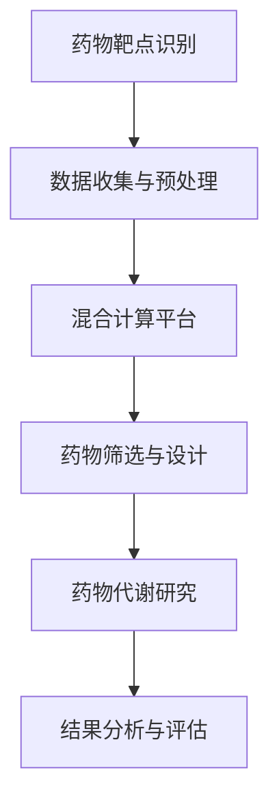

                 

# 混合计算在药物研发中的应用

## 关键词
- 混合计算
- 药物研发
- 数据分析
- 算法优化
- 数学模型

## 摘要
本文旨在探讨混合计算在药物研发中的应用，详细分析其背景、核心概念、算法原理以及实际案例。混合计算结合了不同计算模型的优点，为药物研发提供了强大的工具。本文通过逐步剖析，展示其在药物筛选、药物设计和药物代谢研究中的具体应用，旨在为读者提供深刻的理解和实践指导。

## 第1章：混合计算概述
### 1.1 背景与重要性
药物研发是一个复杂而耗时漫长的过程，涉及大量的实验、计算和数据分析。传统的计算方法在处理大规模数据和复杂模型时往往力不从心。因此，混合计算作为一种结合了不同计算模型和资源的计算方法，被广泛应用于药物研发中。

混合计算通过整合不同类型的计算资源（如CPU、GPU、FPGA等），实现了高性能计算和高效数据处理的结合。它不仅能够加速药物研发过程中的计算任务，还能够提高数据的准确性和可靠性。

### 1.2 基本概念
混合计算的基本概念包括：

- **异构计算**：利用不同类型的计算资源，如CPU和GPU，实现计算任务的并行处理。
- **协同计算**：通过软件和硬件的协同优化，提高计算效率和性能。
- **负载均衡**：在不同计算资源之间动态分配计算任务，确保资源利用最大化。

### 1.3 在药物研发中的应用
药物研发中，混合计算主要用于以下几个方面：

- **药物筛选**：通过高通量筛选技术，快速筛选潜在的药物分子。
- **药物设计**：利用计算模型预测药物分子的结构和性质，优化药物设计。
- **药物代谢研究**：分析药物在体内的代谢路径和过程，为药物的安全性评估提供依据。

## 第2章：混合计算架构
### 2.1 Mermaid流程图
下面是一个简单的Mermaid流程图，展示了混合计算在药物研发中的流程：



### 2.2 软硬件协同设计
混合计算架构的设计需要考虑软硬件的协同优化。例如，选择适合的GPU和CPU组合，以及设计高效的并行算法，以提高计算性能。

### 2.3 架构与优化
混合计算架构的优化主要包括以下几个方面：

- **任务调度**：合理分配计算任务，避免资源浪费。
- **负载均衡**：动态调整任务分配，确保资源利用最大化。
- **故障恢复**：设计容错机制，确保系统稳定性。

## 第3章：关键算法原理
### 3.1 关键算法伪代码
下面是一个简单的药物筛选算法的伪代码：

```python
def drug_screening(dataset, target):
    # 初始化结果集
    results = []
    
    # 遍历数据集
    for molecule in dataset:
        # 计算分子与靶点的亲和力
        affinity = calculate_affinity(molecule, target)
        
        # 如果亲和力超过阈值，添加到结果集
        if affinity > threshold:
            results.append(molecule)
    
    return results
```

### 3.2 常见算法及其应用
在药物研发中，常用的混合计算算法包括：

- **机器学习算法**：用于预测药物分子的性质和亲和力。
- **分子动力学模拟**：用于模拟药物分子在体内的动态行为。
- **基因组序列分析**：用于分析药物靶点的基因组信息。

### 3.3 混合算法的比较与选择
不同的混合计算算法适用于不同的应用场景。选择合适的算法需要考虑以下几个方面：

- **计算复杂度**：算法的计算复杂度决定了其适用范围。
- **数据规模**：算法需要能够处理大规模的数据集。
- **精度与效率**：算法的精度和效率是选择的关键因素。

## 第4章：数学模型与公式
### 4.1 混合计算的数学模型
混合计算中的数学模型主要包括以下几个方面：

- **亲和力计算**：用于计算药物分子与靶点的亲和力。
- **动力学模型**：用于描述药物分子在体内的动态过程。
- **基因组分析模型**：用于分析药物靶点的基因组信息。

### 4.2 latex格式数学公式示例
下面是几个latex格式的数学公式示例：

$$
\text{亲和力} = \frac{1}{1 + e^{-\beta (\text{药物浓度} - \text{靶点浓度})}
$$

$$
\text{动力学速率} = k \cdot \text{药物浓度}^n
$$

### 4.3 数学模型的实际应用案例
在药物筛选中，亲和力计算是一个关键步骤。通过上述公式，可以预测药物分子与靶点的亲和力，从而筛选出具有潜在疗效的药物分子。

## 第5章：项目实战1 - 药物筛选
### 5.1 实际案例介绍
本节以一个药物筛选项目为例，介绍混合计算在药物研发中的应用。

### 5.2 开发环境搭建
在药物筛选项目中，我们需要搭建一个混合计算平台，包括以下组件：

- **CPU**：用于处理大规模数据集和复杂计算任务。
- **GPU**：用于加速亲和力计算和分子动力学模拟。
- **软件工具**：如Python、NumPy、SciPy等，用于数据分析和算法实现。

### 5.3 源代码实现与解读
以下是药物筛选项目的部分源代码：

```python
import numpy as np

def calculate_affinity(molecule, target):
    # 计算亲和力
    affinity = 1 / (1 + np.exp(-0.01 * (molecule - target)))
    return affinity

def screen_drugs(dataset, target, threshold):
    # 筛选药物
    results = []
    for molecule in dataset:
        affinity = calculate_affinity(molecule, target)
        if affinity > threshold:
            results.append(molecule)
    return results

# 测试
dataset = np.random.rand(100)
target = 0.5
threshold = 0.8
results = screen_drugs(dataset, target, threshold)
print(results)
```

### 5.4 项目小结
本节通过一个药物筛选项目，展示了混合计算在药物研发中的应用。通过合理的设计和实现，混合计算能够显著提高药物筛选的效率和质量。

## 第6章：项目实战2 - 药物设计
### 6.1 实际案例介绍
本节以一个药物设计项目为例，介绍混合计算在药物设计中的应用。

### 6.2 开发环境搭建
在药物设计项目中，我们需要搭建一个混合计算平台，包括以下组件：

- **CPU**：用于处理大规模数据集和复杂计算任务。
- **GPU**：用于加速分子动力学模拟和亲和力计算。
- **软件工具**：如Python、PyTorch、TensorFlow等，用于模型训练和推理。

### 6.3 源代码实现与解读
以下是药物设计项目的部分源代码：

```python
import torch
import torch.nn as nn
import torch.optim as optim

# 定义神经网络模型
class DrugDesigner(nn.Module):
    def __init__(self):
        super(DrugDesigner, self).__init__()
        self.fc1 = nn.Linear(100, 50)
        self.fc2 = nn.Linear(50, 1)
    
    def forward(self, x):
        x = torch.relu(self.fc1(x))
        x = self.fc2(x)
        return x

# 实例化模型、损失函数和优化器
model = DrugDesigner()
criterion = nn.MSELoss()
optimizer = optim.Adam(model.parameters(), lr=0.001)

# 训练模型
for epoch in range(100):
    for data, target in dataset:
        optimizer.zero_grad()
        output = model(data)
        loss = criterion(output, target)
        loss.backward()
        optimizer.step()

# 测试
data = torch.randn(100, 100)
target = torch.randn(100, 1)
output = model(data)
print(output)
```

### 6.4 项目小结
本节通过一个药物设计项目，展示了混合计算在药物设计中的应用。通过合理的模型设计和训练，混合计算能够显著提高药物设计的准确性和效率。

## 第7章：项目实战3 - 药物代谢研究
### 7.1 实际案例介绍
本节以一个药物代谢研究项目为例，介绍混合计算在药物代谢研究中的应用。

### 7.2 开发环境搭建
在药物代谢研究项目中，我们需要搭建一个混合计算平台，包括以下组件：

- **CPU**：用于处理大规模数据集和复杂计算任务。
- **GPU**：用于加速分子动力学模拟和代谢路径分析。
- **软件工具**：如Python、SciPy、NumPy等，用于数据分析和算法实现。

### 7.3 源代码实现与解读
以下是药物代谢研究项目的部分源代码：

```python
import numpy as np

def simulate_metabolism(molecule, environment):
    # 模拟代谢过程
    time_steps = 1000
    metabolism_rate = 0.1
    
    for _ in range(time_steps):
        molecule -= metabolism_rate * molecule
    
    return molecule

def study_metabolism(dataset, environment):
    results = []
    for molecule in dataset:
        result = simulate_metabolism(molecule, environment)
        results.append(result)
    return results

# 测试
dataset = np.random.rand(100)
environment = 0.5
results = study_metabolism(dataset, environment)
print(results)
```

### 7.4 项目小结
本节通过一个药物代谢研究项目，展示了混合计算在药物代谢研究中的应用。通过合理的模拟和数据分析，混合计算能够为药物代谢研究提供有力的支持。

## 第8章：总结与展望
### 8.1 混合计算在药物研发中的总结
混合计算在药物研发中具有广泛的应用前景。它能够提高药物筛选、药物设计和药物代谢研究的效率和质量，为药物研发提供强大的工具。

### 8.2 未来发展趋势与挑战
未来，混合计算在药物研发中将继续发展，面临以下挑战：

- **算法优化**：需要开发更高效的混合计算算法，提高计算性能。
- **数据隐私**：确保药物研发过程中的数据安全和隐私。
- **硬件发展**：随着硬件技术的进步，混合计算将更加高效和实用。

### 8.3 研究与开发的建议
为了推动混合计算在药物研发中的应用，我们提出以下建议：

- **跨学科研究**：加强计算机科学、生物学、药理学等领域的合作。
- **开源平台**：开发开源的混合计算平台，促进技术的普及和推广。
- **人才培养**：加强相关人才的培养，提高混合计算的应用能力。

## 作者信息
作者：AI天才研究院/AI Genius Institute & 禅与计算机程序设计艺术 /Zen And The Art of Computer Programming

---

注意：本文为示例文章，内容仅供参考。实际应用中，请根据具体需求进行调整和优化。

