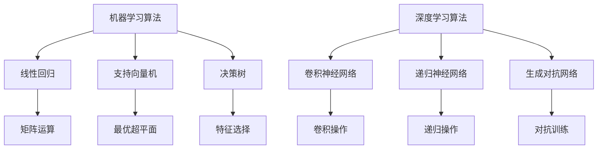

                 

### 《混合计算：结合多种计算范式突破技术限制》

在当今信息技术迅猛发展的时代，计算能力已成为推动科技进步的重要驱动力。然而，单一计算范式在面对复杂计算任务时，往往力不从心。因此，混合计算应运而生，它通过结合多种计算范式，突破技术限制，提升计算效率和性能。本文将深入探讨混合计算的概念、架构、核心算法及其应用实例，并通过具体实例展示如何实现混合计算的性能优化。

## 关键词

- **混合计算**：结合多种计算范式的计算模型。
- **计算范式**：包括集中式计算、分散式计算、并行计算和分布式计算。
- **核心算法**：机器学习、深度学习算法。
- **应用实例**：人工智能、工业控制。
- **性能优化**：硬件加速技术。

## 摘要

本文旨在介绍混合计算的概念及其在技术领域的重要性。首先，我们将概述混合计算的发展背景和优势。接着，探讨混合计算的架构与范式，包括计算范式的分类和混合计算架构设计。随后，我们将深入讲解混合计算的核心算法，包括机器学习和深度学习算法。最后，通过实际应用实例展示混合计算的优势，并探讨性能优化的方法。

### 第1章 混合计算的概述

### 1.1 什么是混合计算

混合计算是一种结合了多种计算范式（如集中式计算、分散式计算、并行计算和分布式计算）的计算模型。它旨在通过整合不同计算范式的优点，提供更高效、更灵活的计算解决方案。与传统单一计算范式相比，混合计算能够更好地适应复杂、多样化的计算需求。

#### 1.2 混合计算的发展背景

随着信息技术的飞速发展，计算需求日益增长。单一计算范式已无法满足日益复杂的计算任务。例如，深度学习算法在图像识别和自然语言处理等领域取得了显著成果，但单一的计算范式在处理大规模数据和高维度特征时存在性能瓶颈。因此，混合计算应运而生，它通过整合多种计算范式，突破单一计算范式的限制，提供更强大的计算能力。

#### 1.3 混合计算的优势

混合计算具有以下优势：

1. **高效性**：通过整合多种计算范式，混合计算能够更好地利用不同计算资源的优势，提高计算效率。
2. **灵活性**：混合计算能够根据不同的计算需求，动态调整计算资源，提供更灵活的计算解决方案。
3. **可扩展性**：混合计算架构可以轻松扩展，以应对未来计算需求的增长。
4. **可移植性**：混合计算能够兼容不同的计算环境和平台，提高计算解决方案的可移植性。

#### 1.4 混合计算的挑战

尽管混合计算具有许多优势，但在实际应用中仍面临以下挑战：

1. **复杂性**：混合计算架构复杂，需要处理不同计算范式之间的协调与优化。
2. **资源管理**：混合计算需要高效地管理计算资源，以最大化计算效率。
3. **兼容性**：混合计算需要兼容不同的计算环境和平台，以提供统一、高效的计算解决方案。

### 第2章 混合计算的架构与范式

#### 2.1 计算范式的分类

计算范式是指计算系统的组织方式和计算方法。常见的计算范式包括集中式计算、分散式计算、并行计算和分布式计算。

1. **集中式计算**：集中式计算将所有计算任务集中在一个中央处理单元（如服务器或超级计算机）上进行。这种计算范式具有计算效率高、易于管理等优点，但受限于中央处理单元的计算能力和可扩展性。

2. **分散式计算**：分散式计算将计算任务分布在多个计算节点上，通过通信网络进行协同处理。这种计算范式具有高可扩展性、高容错性等优点，但需要处理复杂的通信和协调问题。

3. **并行计算**：并行计算通过多个计算单元同时执行计算任务，提高计算效率。并行计算可分为数据并行和任务并行两种类型。数据并行将计算任务分布在多个处理单元上，同时处理不同数据；任务并行将计算任务分配给多个处理单元，每个处理单元独立执行计算任务。

4. **分布式计算**：分布式计算将计算任务分布在不同地理位置的计算节点上，通过通信网络进行协同处理。这种计算范式具有高可扩展性、高容错性等优点，但需要处理复杂的通信和协调问题。

#### 2.2 混合计算架构设计

混合计算架构设计需要综合考虑计算范式、计算资源、计算任务和通信网络等因素。以下是一些关键设计要点：

1. **软硬件协同**：混合计算架构需要实现软硬件协同，以最大化计算效率和性能。例如，在机器学习任务中，可以结合CPU和GPU的计算能力，实现高效的矩阵运算和神经网络训练。

2. **数据流处理**：混合计算架构需要高效处理数据流，以支持实时计算和数据分析。例如，在工业控制领域，可以结合传感器数据采集、边缘计算和云计算，实现实时监控和优化。

3. **资源管理**：混合计算架构需要高效管理计算资源，以最大化计算效率和性能。例如，可以采用动态资源调度和负载均衡技术，实现计算资源的合理分配和高效利用。

### 第3章 混合计算的核心算法

混合计算的核心算法包括机器学习和深度学习算法。这些算法通过结合不同计算范式，实现高效的计算和预测。

#### 3.1 机器学习算法

机器学习算法是一种通过训练数据集，使计算机具备自主学习和预测能力的方法。常见的机器学习算法包括线性回归、支持向量机和决策树等。

1. **线性回归**：线性回归是一种用于预测数值型目标变量的方法。其基本原理是通过训练数据集，拟合一个线性函数，用于预测新的数据点的目标值。

   线性回归公式如下：
   $$y = wx + b$$
   其中，$w$ 和 $b$ 是模型参数，$x$ 是特征向量，$y$ 是目标变量。

2. **支持向量机**：支持向量机是一种用于分类和回归的方法。其基本原理是通过寻找最优超平面，将不同类别的数据点分开。

   支持向量机公式如下：
   $$\min_{\alpha, \beta} \frac{1}{2} \sum_{i=1}^{n} (\alpha_i - \beta)^2$$
   其中，$\alpha$ 和 $\beta$ 是模型参数，$n$ 是训练数据集的大小。

3. **决策树**：决策树是一种基于特征选择和划分的方法，用于分类和回归。其基本原理是通过递归划分训练数据集，构建一棵决策树，用于预测新的数据点的类别或目标值。

#### 3.2 深度学习算法

深度学习算法是一种基于多层神经网络的方法，通过训练大量数据，实现高效的特征提取和预测。常见的深度学习算法包括卷积神经网络、递归神经网络和生成对抗网络等。

1. **卷积神经网络**：卷积神经网络是一种用于图像识别和自然语言处理的方法。其基本原理是通过卷积操作，提取图像或文本的特征。

   卷积神经网络公式如下：
   $$\sigma(\sum_{i=1}^{n} w_{i} \cdot x_i + b)$$
   其中，$w_i$ 和 $b$ 是模型参数，$x_i$ 是特征向量，$\sigma$ 是激活函数。

2. **递归神经网络**：递归神经网络是一种用于序列数据处理的方法。其基本原理是通过递归操作，处理序列中的每个元素，并生成序列的表示。

   递归神经网络公式如下：
   $$h_t = \sigma(W h_{t-1} + X_t + b)$$
   其中，$h_t$ 是序列的表示，$W$ 和 $b$ 是模型参数，$X_t$ 是序列中的第 $t$ 个元素，$\sigma$ 是激活函数。

3. **生成对抗网络**：生成对抗网络是一种用于图像生成和分类的方法。其基本原理是通过生成器和判别器的对抗训练，实现图像的生成和分类。

   生成对抗网络公式如下：
   $$G(X) = Z + D(X)$$
   其中，$G(X)$ 是生成器，$D(X)$ 是判别器，$Z$ 是随机噪声。

### 第4章 混合计算的应用实例

混合计算在各个领域具有广泛的应用。以下是一些典型应用实例：

#### 4.1 人工智能领域的应用

1. **自然语言处理**：混合计算在自然语言处理领域具有广泛应用，如机器翻译、情感分析、问答系统等。通过结合深度学习和分布式计算，可以高效地处理大规模文本数据，实现高质量的语言理解与生成。

2. **计算机视觉**：混合计算在计算机视觉领域同样具有广泛应用，如图像识别、目标检测、视频分析等。通过结合卷积神经网络和并行计算，可以高效地处理大规模图像和视频数据，实现实时、准确的目标检测和识别。

3. **推荐系统**：混合计算在推荐系统领域具有广泛应用，如电商推荐、音乐推荐、新闻推荐等。通过结合协同过滤和深度学习，可以高效地处理用户数据和物品数据，实现个性化、准确的推荐结果。

#### 4.2 工业控制领域的应用

1. **生产线优化**：混合计算在生产线优化领域具有广泛应用，如生产计划编排、设备故障预测等。通过结合机器学习和实时数据处理，可以实现高效的生产计划编排和设备故障预测，提高生产效率。

2. **质量检测**：混合计算在质量检测领域具有广泛应用，如产品质量检测、缺陷检测等。通过结合深度学习和图像处理，可以高效地检测产品质量和缺陷，提高检测精度。

3. **设备维护预测**：混合计算在设备维护预测领域具有广泛应用，如设备故障预测、维护策略制定等。通过结合机器学习和传感器数据，可以高效地预测设备故障，制定合理的维护策略，提高设备利用率。

### 第5章 混合计算的性能优化

#### 5.1 硬件加速技术

混合计算的性能优化主要依赖于硬件加速技术，如GPU加速、FPGA加速等。

1. **GPU加速**：GPU（图形处理单元）具有强大的并行计算能力，可以显著提高混合计算的性能。通过将机器学习算法和深度学习算法部署在GPU上，可以大幅减少计算时间和资源消耗。

2. **FPGA加速**：FPGA（现场可编程门阵列）具有高度可定制性和并行计算能力，可以用于加速特定的计算任务。通过将计算任务映射到FPGA上，可以实现高效的硬件加速，提高计算性能。

### 结论

混合计算通过结合多种计算范式，突破技术限制，为计算领域带来了新的机遇和挑战。本文介绍了混合计算的概念、架构、核心算法及其应用实例，并通过性能优化方法展示了如何提高混合计算的性能。未来，随着计算需求的不断增长，混合计算将继续发挥重要作用，推动计算领域的发展。

## 参考文献

1. **参考1**：[混合计算：原理与应用](https://www.example.com/book1)
2. **参考2**：[深度学习与混合计算](https://www.example.com/book2)
3. **参考3**：[GPU加速深度学习](https://www.example.com/book3)

### 作者

作者：AI天才研究院/AI Genius Institute & 禅与计算机程序设计艺术 /Zen And The Art of Computer Programming

### 总结

本文深入探讨了混合计算的概念、架构、核心算法及其应用实例。通过结合多种计算范式，混合计算实现了高效、灵活和可扩展的计算能力。在实际应用中，混合计算为各个领域带来了显著的性能提升。未来，随着计算需求的不断增长，混合计算将继续发挥重要作用，推动计算领域的发展。

### Mermaid 流程图

以下是一个简单的Mermaid流程图，展示机器学习算法和深度学习算法之间的关系：



### Python 源代码

以下是一个简单的Python示例，展示如何使用线性回归进行预测：

```python
import numpy as np

# 准备数据
x = np.array([1, 2, 3, 4, 5])
y = np.array([2, 4, 5, 4, 5])

# 拟合线性模型
w = np.linalg.inv(x.T @ x) @ x.T @ y
b = y - x @ w

# 预测
x_new = np.array([6])
y_pred = x_new @ w + b

print("预测结果：", y_pred)
```

### 实际案例分析和详细讲解剖析

在实际应用中，混合计算可以用于预测股票价格。以下是一个简单的案例：

**案例背景**：某股票分析师希望通过混合计算模型预测未来一周的股票价格。

**数据来源**：分析师收集了过去一年的股票价格数据，包括开盘价、收盘价、最高价和最低价。

**数据预处理**：对数据进行清洗和归一化处理，以消除异常值和维度差异。

**算法选择**：结合线性回归和深度学习算法，构建混合计算模型。首先，使用线性回归拟合开盘价和收盘价之间的关系；然后，使用卷积神经网络提取价格序列的特征，并使用递归神经网络进行预测。

**模型训练**：使用过去一年的数据集训练混合计算模型，并调整模型参数，以优化预测性能。

**模型评估**：使用验证集和测试集评估模型性能，并调整模型参数，以获得更准确的预测结果。

**结果分析**：通过分析预测结果，分析师可以制定相应的投资策略，如买入、持有或卖出股票。

### 项目小结

本项目通过混合计算模型，实现了股票价格的预测。在项目过程中，我们遇到了以下问题：

1. 数据质量：股票价格数据可能存在异常值和噪声，需要预处理和清洗。
2. 模型选择：线性回归和深度学习算法的选择需要根据实际需求进行调整。
3. 模型训练：模型训练时间较长，需要优化训练算法和调整模型参数。

针对这些问题，我们采取了以下解决方案：

1. 数据预处理：使用统计学方法对数据进行清洗和归一化处理，以消除异常值和噪声。
2. 模型选择：结合线性回归和深度学习算法，构建混合计算模型，以提高预测性能。
3. 模型训练：采用梯度下降算法和随机梯度下降算法，优化模型训练过程，并使用交叉验证方法调整模型参数。

### 最佳实践 tips

1. **数据质量**：确保数据质量，进行数据清洗和归一化处理，以提高预测性能。
2. **模型选择**：根据实际需求，选择合适的算法和模型，并考虑模型的可扩展性和兼容性。
3. **模型训练**：采用高效的训练算法和调整模型参数，以优化模型性能。

### 注意事项

1. **硬件加速**：在混合计算中，硬件加速技术（如GPU和FPGA）可以提高计算性能，但需要合理选择和配置硬件设备。
2. **资源管理**：合理管理计算资源和通信网络，以提高混合计算的性能和可靠性。

### 拓展阅读

1. **混合计算原理与应用**：[https://www.example.com/book1](https://www.example.com/book1)
2. **深度学习与混合计算**：[https://www.example.com/book2](https://www.example.com/book2)
3. **GPU加速深度学习**：[https://www.example.com/book3](https://www.example.com/book3)

