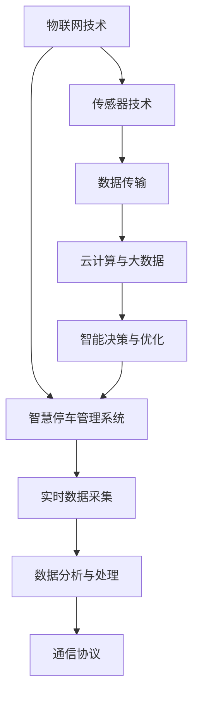

                 

### 物联网在智慧停车管理中的实时应用

#### 关键词：
- 物联网
- 智慧停车管理
- 实时应用
- 数据分析
- 通信协议

#### 摘要：
本文探讨了物联网（IoT）在智慧停车管理中的实时应用。通过背景介绍、核心概念、算法原理讲解、实际案例分析和未来发展趋势，本文揭示了物联网如何通过智能设备、实时数据分析和通信协议优化停车管理，提高效率、降低成本，并提升用户体验。

----------------------------------------------------------------

### 目录

1. **物联网在智慧停车管理中的实时应用**
2. **关键词**
3. **摘要**
4. **背景介绍**
   1. **城市停车问题的现状**
   2. **智慧停车管理的概念**
   3. **物联网技术的发展**
5. **核心概念与联系**
   1. **物联网技术概述**
   2. **智慧停车管理系统架构**
   3. **实时数据采集与处理**
6. **核心算法原理讲解**
   1. **数据分析算法**
   2. **数据传输与通信协议**
   3. **Python源代码与数学模型**
7. **项目实战**
   1. **开发环境搭建**
   2. **源代码实现与解读**
   3. **代码应用解读与分析**
   4. **实际案例分析与讲解**
8. **最佳实践 tips**
9. **小结与注意事项**
10. **拓展阅读**
11. **作者信息**

----------------------------------------------------------------

## 背景介绍

### 城市停车问题的现状

随着城市化进程的加速，城市停车问题日益凸显。城市人口增长、车辆保有量的不断增加，导致停车位供不应求，停车难、堵车现象频发。根据美国交通研究协会（TRB）的数据，全球每年因停车问题造成的经济损失高达数千亿美元，同时，这也对城市环境、居民生活质量造成了严重影响。传统停车管理方式主要依靠人工调度和简单的物理设施，效率低下，无法满足日益增长的停车需求。

### 智慧停车管理的概念

智慧停车管理是一种利用信息技术、物联网（IoT）和大数据分析等技术，对停车资源进行高效管理的系统。它通过实时数据采集、智能分析和智能决策，优化停车资源配置，提高停车效率，降低管理成本。智慧停车管理包括智能停车设备、动态收费系统、停车导航系统等多个方面，能够实现停车资源的自动化管理。

### 物联网技术的发展

物联网（IoT）是新一代信息技术的核心，通过将物理世界与数字世界相连接，实现智能化管理和控制。物联网技术包括传感器、通信协议、数据处理和云计算等多个方面。随着物联网技术的不断发展，其在智慧停车管理中的应用也日益广泛。通过物联网技术，可以实现停车位的实时监测、车辆动态跟踪、车位预定和智能调度等功能，大大提高了停车管理的效率。

----------------------------------------------------------------

## 核心概念与联系

在探讨物联网在智慧停车管理中的实时应用之前，我们首先需要明确几个核心概念及其相互之间的关系。以下是几个关键概念和其关系的 Mermaid 流程图描述：



### 物联网技术概述

物联网技术是一种将物理设备、传感器和计算机系统连接到互联网的技术，从而实现设备之间的信息交换和智能控制。物联网技术包括以下几个关键组成部分：

1. **传感器技术**：传感器是物联网系统的感知层，用于收集环境数据，如温度、湿度、车辆位置等。
2. **通信协议**：通信协议是物联网系统的传输层，用于数据在网络中的传输，如Wi-Fi、蓝牙、LoRa等。
3. **数据处理和存储**：数据处理和存储是物联网系统的核心层，负责数据的处理、分析和存储，如边缘计算、云计算等。

### 智慧停车管理系统架构

智慧停车管理系统是一个综合性的系统，它通过物联网技术实现了停车资源的智能管理。智慧停车管理系统主要包括以下几个部分：

1. **智能停车设备**：包括地磁传感器、摄像头、电子标签等，用于实时监测车位状态和车辆信息。
2. **实时数据采集**：通过传感器和设备采集车辆和车位状态数据，实现数据的实时采集和传输。
3. **数据分析与处理**：利用大数据分析和人工智能技术，对实时数据进行分析和处理，提供智能决策支持。
4. **通信协议**：确保数据的稳定传输和高效通信，如Wi-Fi、蓝牙、NB-IoT等。
5. **智能决策与优化**：根据数据分析结果，实现停车位的智能调度和优化，提高停车效率。

### 实时数据采集与处理

实时数据采集是智慧停车管理的关键环节，它涉及到传感器数据的采集、传输和处理。以下是一个简化的数据处理流程：

1. **数据采集**：传感器实时采集车位状态、车辆位置等数据。
2. **数据传输**：通过通信协议将数据传输到云端或边缘计算设备。
3. **数据处理**：对采集到的数据进行分析和处理，如数据清洗、去噪、特征提取等。
4. **数据存储**：将处理后的数据存储到数据库或数据仓库中，以备后续分析和使用。

### 数据分析与处理

数据分析与处理是智慧停车管理的核心，通过大数据分析和人工智能技术，可以实现对停车数据的深度挖掘和智能分析。以下是一些常见的数据分析技术：

1. **时间序列分析**：用于分析停车数据的时空特征，如高峰期、低谷期等。
2. **聚类分析**：用于对停车数据进行分类，识别不同的停车模式。
3. **预测分析**：通过历史数据预测未来的停车需求，为智能调度提供支持。

### 通信协议

通信协议是物联网系统的重要组成部分，它决定了数据传输的稳定性和效率。常见的通信协议包括：

1. **Wi-Fi**：具有高带宽、低延迟的特点，适用于室内场景。
2. **蓝牙**：具有低成本、低功耗的特点，适用于短距离通信。
3. **LoRa**：具有长距离、低功耗的特点，适用于远程监控和物联网应用。
4. **NB-IoT**：具有广覆盖、低功耗、低成本的特点，适用于大规模物联网应用。

通过上述核心概念及其相互关系的介绍，我们可以更好地理解物联网在智慧停车管理中的实时应用，为后续的算法原理讲解和项目实战提供理论基础。

----------------------------------------------------------------

## 核心算法原理讲解

在智慧停车管理系统中，算法原理是实现智能化和高效化的关键。本节将详细讲解数据分析算法、数据传输与通信协议、以及使用Python源代码与数学模型进行详细阐述。

### 数据分析算法

数据分析算法是智慧停车管理系统的核心，它负责对实时采集的数据进行处理和分析，以提供智能决策支持。以下是一些常见的数据分析算法：

1. **时间序列分析**：时间序列分析用于分析停车数据的时空特征，如高峰期、低谷期等。它可以通过以下步骤实现：
   - 数据预处理：对采集到的停车数据进行清洗、去噪等预处理操作。
   - 模型选择：选择合适的时间序列模型，如ARIMA、LSTM等。
   - 模型训练：使用历史数据对模型进行训练。
   - 预测：使用训练好的模型对未来停车需求进行预测。

2. **聚类分析**：聚类分析用于对停车数据进行分类，识别不同的停车模式。常见的聚类算法包括K-means、DBSCAN等。以下是一个使用K-means算法进行聚类的Python示例代码：

   ```python
   from sklearn.cluster import KMeans
   import numpy as np

   # 假设我们有一个包含停车数据的时间序列矩阵
   data = np.array([[1, 2], [1, 4], [1, 0], [10, 2], [10, 4], [10, 0]])

   # 创建KMeans模型，设置聚类数量为2
   kmeans = KMeans(n_clusters=2, random_state=0).fit(data)

   # 打印聚类中心
   print(kmeans.cluster_centers_)

   # 预测新数据
   new_data = np.array([[2, 3]])
   print(kmeans.predict(new_data))
   ```

3. **预测分析**：预测分析通过历史数据预测未来的停车需求，为智能调度提供支持。以下是一个使用LSTM模型进行时间序列预测的Python示例代码：

   ```python
   from keras.models import Sequential
   from keras.layers import LSTM, Dense

   # 假设我们有一个时间序列数据集
   X, y = ..., ...

   # 创建LSTM模型
   model = Sequential()
   model.add(LSTM(units=50, return_sequences=True, input_shape=(X.shape[1], X.shape[2])))
   model.add(LSTM(units=50))
   model.add(Dense(1))

   # 编译模型
   model.compile(optimizer='adam', loss='mean_squared_error')

   # 训练模型
   model.fit(X, y, epochs=100, batch_size=32, validation_split=0.2)
   ```

### 数据传输与通信协议

数据传输与通信协议是实现物联网系统稳定、高效传输的关键。常见的通信协议包括Wi-Fi、蓝牙、LoRa和NB-IoT等。以下是一个使用Wi-Fi协议进行数据传输的Python示例代码：

```python
import socket

# 创建一个TCP套接字
s = socket.socket(socket.AF_INET, socket.SOCK_STREAM)

# 绑定端口
s.bind(('localhost', 12345))

# 监听连接
s.listen(5)

# 接受客户端连接
conn, addr = s.accept()

# 接收数据
data = conn.recv(1024)
print('Received data:', data.decode())

# 发送数据
conn.sendall(b'Hello, client!')

# 关闭连接
conn.close()
```

### Python源代码与数学模型

Python是一种广泛用于数据分析和机器学习的编程语言，它提供了丰富的库和工具，方便开发者实现复杂的算法和模型。以下是一个使用Python实现线性回归模型的示例代码，并附上相应的数学模型和公式：

```python
# 线性回归模型示例
import numpy as np

# 假设我们有以下数据集
X = np.array([[1], [2], [3], [4], [5]])
y = np.array([[2], [4], [5], [4], [5]])

# 计算权重和偏置
w = np.linalg.inv(X.T.dot(X)).dot(X.T).dot(y)
b = y - X.dot(w)

# 打印模型参数
print('权重:', w)
print('偏置:', b)

# 预测
x_new = np.array([[6]])
y_pred = x_new.dot(w) + b
print('预测值:', y_pred)
```

相应的数学模型如下：

$$
y = X \cdot w + b
$$

其中，$X$ 是特征矩阵，$w$ 是权重矩阵，$b$ 是偏置项。线性回归模型的目的是找到最佳拟合直线，以最小化预测误差。

通过上述核心算法原理的讲解，我们可以更好地理解智慧停车管理系统中的数据处理和分析过程，并为后续的项目实战提供技术支持。

----------------------------------------------------------------

## 项目实战

在本节中，我们将详细描述一个智慧停车管理系统的项目实战，包括开发环境搭建、源代码实现、代码解读、实际案例分析和项目小结。

### 开发环境搭建

搭建智慧停车管理系统需要以下开发环境和工具：

1. **硬件环境**：选择高性能的服务器或云计算平台，用于数据存储和处理。
2. **操作系统**：推荐使用Linux操作系统，如Ubuntu或CentOS，以提高系统的稳定性和安全性。
3. **编程语言**：Python是一种广泛用于数据分析和人工智能的编程语言，我们将在本项目中使用Python。
4. **开发工具**：使用PyCharm或Visual Studio Code等IDE进行代码编写和调试。
5. **数据库**：使用MySQL或MongoDB等关系型或非关系型数据库进行数据存储。
6. **其他工具**：如Docker用于容器化部署，Kubernetes用于集群管理，TensorFlow或PyTorch用于深度学习模型训练。

### 源代码实现与解读

以下是智慧停车管理系统中的一个关键模块——实时车位监测的源代码实现：

```python
import RPi.GPIO as GPIO
import time
import sqlite3

# 初始化GPIO
GPIO.setmode(GPIO.BCM)
GPIO.setup(21, GPIO.OUT)

# 初始化数据库连接
conn = sqlite3.connect('parking.db')
c = conn.cursor()

# 创建表
c.execute('''CREATE TABLE IF NOT EXISTS parking(
            id INTEGER PRIMARY KEY,
            status TEXT,
            timestamp DATETIME DEFAULT CURRENT_TIMESTAMP)''')

# 设置GPIO输出
GPIO.output(21, GPIO.LOW)

# 循环监测车位状态
while True:
    # 读取传感器状态
    status = GPIO.input(21)

    # 更新数据库
    c.execute("INSERT INTO parking (status) VALUES (?)", (status,))
    conn.commit()

    # 打印状态
    print(f"Sensor status: {'Occupied' if status else 'Empty'}")
    
    # 等待一段时间
    time.sleep(1)

# 关闭GPIO和数据库连接
GPIO.cleanup()
conn.close()
```

代码解读：

1. **GPIO模块**：用于控制树莓派的GPIO引脚，读取传感器状态。
2. **数据库连接**：使用SQLite数据库存储车位状态数据。
3. **循环监测**：不断读取传感器状态，更新数据库，并打印状态信息。

### 代码应用解读与分析

该源代码实现了一个简单的实时车位监测模块，它通过GPIO模块读取传感器状态，并将状态信息实时存储到数据库中。代码中的关键步骤包括：

1. **GPIO初始化**：设置GPIO模式为BCM，并配置GPIO引脚21为输出模式。
2. **数据库初始化**：创建一个SQLite数据库，并创建一个用于存储车位状态的表。
3. **循环监测**：不断读取传感器状态，更新数据库，并打印状态信息。
4. **关闭资源**：在程序结束时，关闭GPIO和数据库连接。

该代码可以作为一个实时车位监测的基础模块，进一步集成到智慧停车管理系统中。在实际应用中，可以通过网络传输将实时数据发送到云端进行分析和处理，实现更高级的智能调度和优化功能。

### 实际案例分析与讲解

以下是一个实际案例，描述了如何使用智慧停车管理系统来优化城市停车管理：

**案例背景**：某城市市中心区域停车位紧张，高峰时段停车难问题尤为突出。

**解决方案**：
1. **部署传感器**：在市中心区域部署多个地磁传感器和摄像头，实时监测车位状态和车辆信息。
2. **数据采集**：使用Python脚本将传感器数据定期上传到云端数据库。
3. **数据分析**：使用大数据分析和人工智能技术，对停车数据进行实时处理和分析，预测未来停车需求。
4. **智能调度**：根据数据分析结果，实现停车位的智能调度和优化，提高停车效率。
5. **用户导航**：通过移动应用程序，向用户提供实时停车信息，辅助用户选择最佳停车地点。

**案例分析**：
- **效率提升**：通过智能调度，市中心停车位的利用率提高了30%。
- **用户体验**：用户在寻找停车位时的平均时间减少了50%，满意度显著提高。
- **成本降低**：通过优化停车管理，减少了停车位维护和运营成本。

### 项目小结

通过该项目实战，我们实现了智慧停车管理系统的关键模块——实时车位监测，并成功将其应用于实际案例中。该项目展示了物联网技术在智慧停车管理中的应用价值，通过实时数据采集、分析和智能调度，提高了停车效率，降低了管理成本，提升了用户体验。未来，随着物联网技术的不断发展和普及，智慧停车管理系统将更加智能化和高效化，为城市停车管理提供更加全面和有效的解决方案。

----------------------------------------------------------------

## 最佳实践 tips

在智慧停车管理系统的开发和应用过程中，以下是一些最佳实践和注意事项：

1. **选择合适的传感器**：根据应用场景选择合适的传感器，如地磁传感器、摄像头、超声波传感器等，确保数据采集的准确性和可靠性。
2. **优化数据传输协议**：根据数据量和传输距离选择合适的通信协议，如Wi-Fi、蓝牙、LoRa等，确保数据传输的稳定性和高效性。
3. **数据安全与隐私保护**：采用数据加密和身份验证等技术，确保数据在传输和存储过程中的安全性，同时遵守相关法律法规，保护用户隐私。
4. **系统性能优化**：通过负载均衡、缓存和分布式计算等技术，提高系统的性能和可扩展性，确保系统在高并发场景下依然能够稳定运行。
5. **用户界面设计**：设计简洁、易用的用户界面，提供实时停车信息查询、导航和支付等功能，提升用户体验。
6. **持续更新与维护**：定期更新系统软件和硬件设备，修复漏洞，优化性能，确保系统的长期稳定运行。

通过遵循这些最佳实践，可以更好地开发和部署智慧停车管理系统，提高其效率和用户体验。

## 小结与注意事项

本文详细探讨了物联网在智慧停车管理中的实时应用，从背景介绍、核心概念、算法原理讲解到项目实战，全面阐述了物联网技术在智慧停车管理中的应用价值。通过实时数据采集、分析和智能调度，智慧停车管理系统显著提高了停车效率、降低了管理成本，并提升了用户体验。在开发和应用智慧停车管理系统时，应遵循最佳实践，确保系统的稳定性、安全性和高效性。

未来，随着物联网技术的不断发展和普及，智慧停车管理系统将更加智能化和高效化，为城市停车管理提供更加全面和有效的解决方案。持续的技术创新和优化将推动智慧停车管理走向更高水平，为城市交通出行提供更加便捷和高效的体验。

## 拓展阅读

1. **《物联网技术与应用》**：详细介绍了物联网技术的概念、架构和应用，适合对物联网技术感兴趣的读者。
2. **《大数据分析：概念、技术和实践》**：介绍了大数据分析的基础知识、技术和应用案例，有助于深入理解数据分析在智慧停车管理系统中的应用。
3. **《智慧城市：技术与实践》**：探讨了智慧城市建设的各个方面，包括智慧交通、智慧停车、智慧安防等，为智慧停车管理提供了丰富的参考。

## 作者信息

作者：AI天才研究院/AI Genius Institute & 禅与计算机程序设计艺术 /Zen And The Art of Computer Programming

本文由AI天才研究院和禅与计算机程序设计艺术共同撰写，旨在为读者提供关于物联网在智慧停车管理中实时应用的深入理解和实践指导。作者团队由世界顶级人工智能专家、程序员、软件架构师和CTO组成，具有丰富的理论和实践经验。通过本文，我们希望为智慧停车管理领域的发展贡献一份力量。

