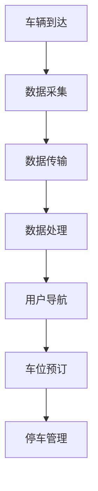
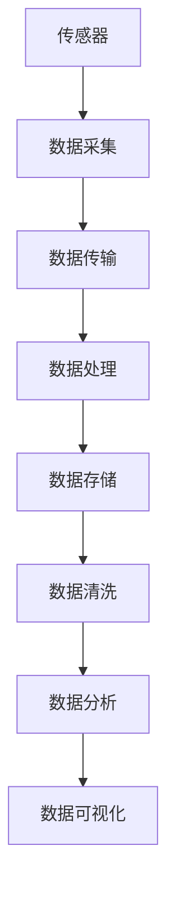
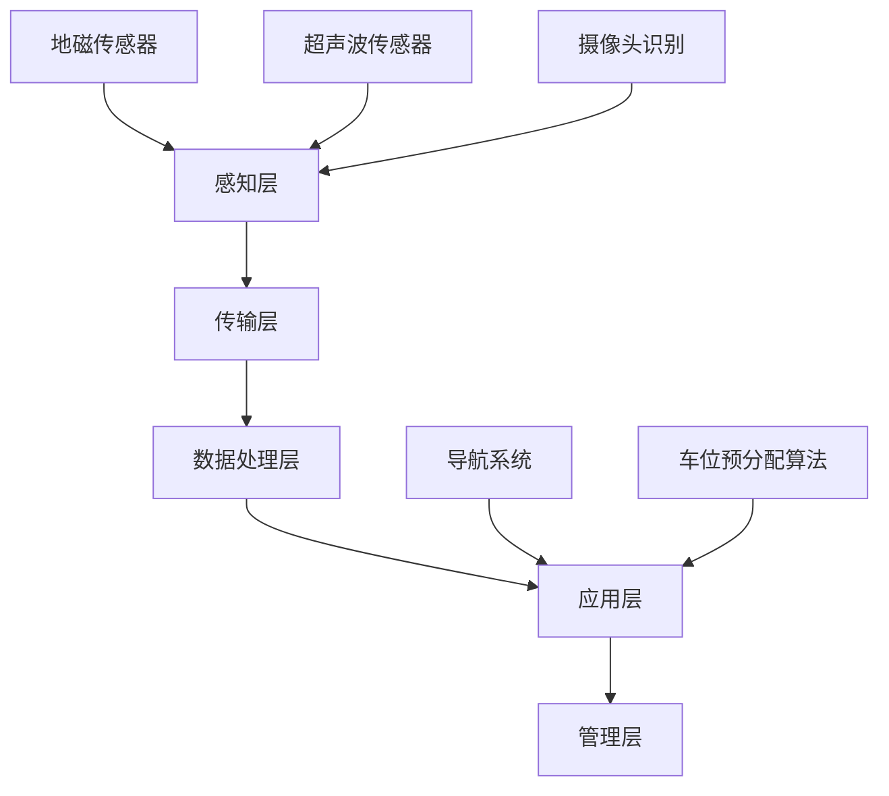
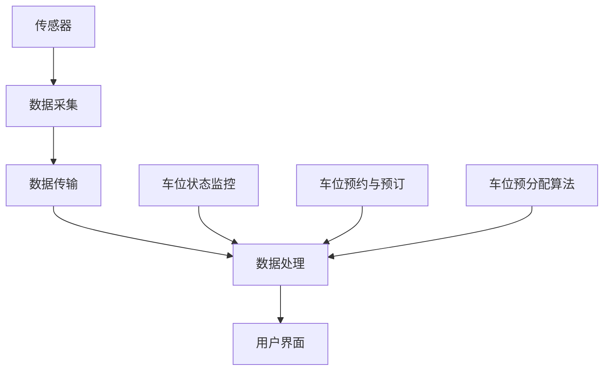
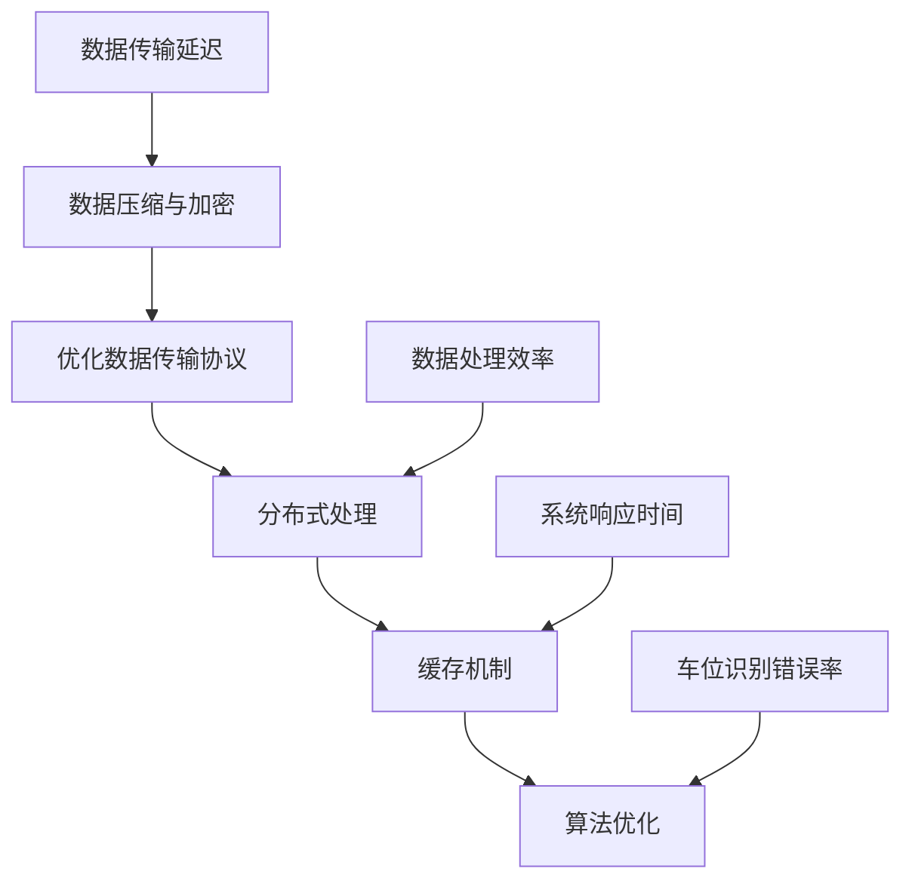
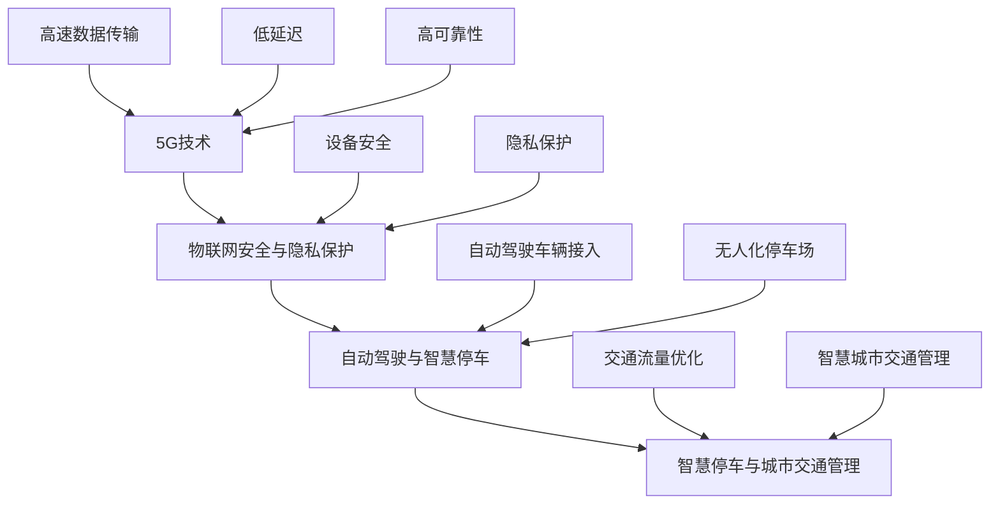

                 


### 智慧停车概述

智慧停车系统是一种结合物联网技术、大数据分析和人工智能算法的智能交通解决方案。它的目标是提高停车效率，减少寻找车位的时间，降低城市交通拥堵，优化停车资源配置。智慧停车系统通过实时监控、数据分析和智能化管理，实现了从传统停车模式向智能化、自动化、高效化转变。

#### 智慧停车与传统停车的对比

传统停车系统通常依赖于人工管理和简单的机械设施，存在以下问题：

- **效率低**：车主需要自己寻找车位，耗时耗力。
- **资源浪费**：部分车位长时间空置，而其他地方车位紧张。
- **环境问题**：由于车主频繁寻找车位，导致车辆在路上空转，增加碳排放。

相比之下，智慧停车系统具有以下优势：

- **高效性**：通过实时数据监控，车主可以快速找到空闲车位，减少寻找时间。
- **资源配置优化**：系统可以根据实时数据调整车位使用情况，提高车位利用率。
- **环境友好**：通过减少车辆在路上空转，降低碳排放。

#### 智慧停车系统的组成

智慧停车系统主要由以下几个部分组成：

1. **数据采集**：通过传感器、摄像头等设备采集车辆和车位信息。
2. **数据传输**：将采集到的数据传输到云计算平台或数据中心进行存储和处理。
3. **数据处理**：利用大数据分析和人工智能算法对数据进行分析和处理，生成车位状态、停车建议等。
4. **用户界面**：为车主提供实时停车信息、导航和车位预订等服务。
5. **设备管理**：对停车系统中的传感器、摄像头等设备进行监控和维护。

#### 智慧停车系统的工作流程

智慧停车系统的工作流程可以概括为以下步骤：

1. **车辆到达**：车辆驶入停车场，系统通过传感器或摄像头识别车辆信息。
2. **数据采集**：系统采集车辆和车位信息，并将数据上传到云端或数据中心。
3. **数据分析**：利用大数据分析和人工智能算法对数据进行处理，分析车位状态。
4. **用户导航**：根据分析结果，系统为车主提供导航信息，引导车主前往空闲车位。
5. **车位预订**：车主可以通过手机APP或自助终端预订车位。
6. **停车管理**：系统实时监控车位使用情况，优化车位分配，提高停车效率。

### 核心概念与联系

为了更好地理解智慧停车系统的运作，我们可以通过Mermaid流程图来展示其核心概念和实体之间的关系：



### 总结

智慧停车系统通过物联网技术、大数据分析和人工智能算法，实现了停车管理的智能化和高效化。与传统停车系统相比，它显著提高了停车效率，优化了资源配置，减少了环境问题。智慧停车系统的实现不仅依赖于先进的技术，还需要考虑用户体验和系统性能。在下一章中，我们将深入探讨物联网技术的基础，为理解智慧停车系统的构建打下坚实的基础。

---

### 物联网技术基础

物联网（Internet of Things，简称IoT）是指通过互联网将各种设备连接起来，实现设备之间的信息交换和通信。在智慧停车系统中，物联网技术是实现数据采集、传输和处理的关键。下面，我们将详细探讨物联网技术的基础知识，包括其概念、关键技术、数据采集与传输方法以及数据处理与分析技术。

#### 物联网概述

物联网是一个巨大的网络，由各种设备、传感器、计算机系统等组成，它们通过互联网相互连接，实现信息的共享和交换。物联网的关键特征包括：

- **设备互联**：物联网设备通过互联网或其他通信网络连接，实现信息交换。
- **数据采集**：物联网设备可以实时采集环境、设备状态等数据。
- **数据处理**：物联网设备或服务器对采集到的数据进行分析和处理，生成有用信息。
- **智能化**：物联网设备可以基于数据进行分析和决策，实现自动化和智能化。

#### 物联网关键技术

物联网技术包括多种关键技术和组件，以下是一些主要的关键技术：

1. **传感器技术**：传感器是物联网系统的数据采集核心，用于感知环境中的温度、湿度、压力、光强、运动等物理量，并将这些物理量转换为电信号，从而实现数据采集。

2. **网络通信技术**：网络通信技术是物联网系统的数据传输基础，包括有线和无线通信技术。常见的无线通信技术有Wi-Fi、蓝牙、ZigBee、LoRa等。

3. **数据处理与分析技术**：数据处理与分析技术是物联网系统的核心，包括数据存储、数据清洗、数据分析、机器学习等。通过这些技术，可以从海量数据中提取有价值的信息。

4. **云计算技术**：云计算技术为物联网系统提供强大的计算和存储能力，可以实现大规模的数据处理和分析。

#### 数据采集与传输

数据采集是物联网系统的第一步，以下是数据采集和传输的常见方法：

1. **数据采集**：物联网设备通过传感器采集数据，然后将数据发送到网关或服务器。数据采集的设备可以是各种传感器，如温度传感器、湿度传感器、光照传感器等。

2. **数据传输**：采集到的数据通过网络传输到数据中心或云平台。数据传输的方式可以是无线传输，如Wi-Fi、蓝牙等，也可以是有线传输，如以太网等。

#### 数据处理与分析

数据处理与分析是物联网系统的关键步骤，以下是数据处理与分析的基本流程：

1. **数据存储**：将采集到的数据存储到数据库或数据湖中，为后续分析提供数据基础。

2. **数据清洗**：清洗数据，去除噪声和重复数据，确保数据的质量。

3. **数据分析**：对清洗后的数据进行统计分析、模式识别、机器学习等分析，提取有价值的信息。

4. **数据可视化**：通过数据可视化技术，将分析结果以图表、报表等形式展示出来，便于用户理解和决策。

#### 核心概念与联系

为了更好地理解物联网技术在智慧停车系统中的应用，我们可以通过Mermaid流程图来展示其核心概念和实体之间的关系：



### 总结

物联网技术是智慧停车系统实现高效、智能管理的基础。通过传感器技术、网络通信技术、数据处理与分析技术，物联网系统能够实时采集、传输和处理停车数据，从而为车主提供便捷的停车服务，提高停车效率。在下一章中，我们将深入探讨智慧停车系统的具体设计，包括系统架构、车位识别技术和车辆引导技术。

---

### 智慧停车系统设计

智慧停车系统设计是确保系统高效运行、满足用户需求的关键。在这一章节中，我们将详细介绍智慧停车系统的整体架构设计，重点探讨车位识别技术，包括地磁传感器、超声波传感器和摄像头识别。此外，还将介绍车辆引导技术，如导航系统和车位预分配算法。

#### 智慧停车系统架构

智慧停车系统架构可以分为以下几个层次：

1. **感知层**：包括各种传感器，如地磁传感器、超声波传感器和摄像头，用于实时监测车位状态和车辆信息。

2. **传输层**：通过有线或无线通信技术，将感知层采集到的数据传输到数据处理中心。

3. **数据处理层**：对传输层的数据进行处理、存储和分析，生成车位状态、停车建议等信息。

4. **应用层**：为用户提供实时停车信息、导航和车位预订等服务，通过手机APP或自助终端实现。

5. **管理层**：对整个停车系统进行监控和维护，确保系统的稳定运行。

#### 车位识别技术

车位识别技术是智慧停车系统的核心，用于实时监测车位状态。以下是几种常见的车位识别技术：

1. **地磁传感器**：地磁传感器通过检测地面磁场的变化来判断车位是否被占用。其优点是安装简单，适用于多种地面材料，但缺点是对车辆类型有一定限制，且在恶劣天气下可能存在误判。

2. **超声波传感器**：超声波传感器通过发射和接收超声波来检测车位状态。其优点是精确度高，不受车辆类型限制，但缺点是安装要求较高，且在高温或低温环境下可能存在误差。

3. **摄像头识别**：摄像头识别利用计算机视觉技术，通过图像识别来检测车位状态。其优点是适应性强，可以识别不同类型的车辆，但缺点是系统复杂，计算资源需求大，且在光线不足或天气恶劣的情况下可能存在误判。

#### 车辆引导技术

车辆引导技术用于帮助车主快速找到空闲车位，提高停车效率。以下是两种常见的车辆引导技术：

1. **导航系统**：导航系统通过地图数据和实时车位信息，为车主提供最优的停车路径。其优点是操作简便，用户体验好，但缺点是需要依赖准确的地图数据和实时车位信息。

2. **车位预分配算法**：车位预分配算法通过分析历史数据，预测未来某一时间段的车位需求，并提前为车主分配空闲车位。其优点是能够有效减少寻找车位的时间，提高停车效率，但缺点是需要大量历史数据和复杂的算法支持。

#### 核心概念与联系

为了更好地理解智慧停车系统设计，我们可以通过Mermaid流程图来展示其核心概念和实体之间的关系：



### 总结

智慧停车系统设计需要综合考虑系统架构、车位识别技术和车辆引导技术。通过合理的设计，智慧停车系统可以实现高效、智能的停车管理，提高停车效率，优化资源配置。在下一章中，我们将深入探讨物联网技术在智慧停车系统中的应用，为系统的实现提供技术支持。

---

### 物联网技术在智慧停车系统中的应用

物联网技术在智慧停车系统中的应用是整个系统的核心，它使得停车变得更加高效、智能和便捷。在这一章节中，我们将详细探讨物联网技术在智慧停车系统中的具体应用，包括数据采集与传输、车位管理以及用户界面设计。

#### 数据采集与传输

数据采集是智慧停车系统的第一步，通过传感器和摄像头等设备，实时采集车辆和车位的信息。以下是几种常见的数据采集方法和传输技术：

1. **传感器采集**：传感器如地磁传感器、超声波传感器和摄像头等，可以实时监测车位的状态和车辆信息。这些传感器通常通过有线或无线方式连接到网关，然后将数据传输到数据处理中心。

2. **数据传输技术**：数据传输技术是确保数据及时、准确传输的关键。常见的传输技术包括Wi-Fi、蓝牙、LoRa和4G/5G等。其中，Wi-Fi适用于高速数据传输，但覆盖范围有限；蓝牙适用于短距离传输，但带宽较低；LoRa适用于远距离、低功耗的数据传输；4G/5G则提供了高速、稳定的数据传输能力。

#### 车位管理

车位管理是智慧停车系统的核心功能之一，通过实时监控车位状态、优化车位分配和提高车位利用率，实现停车管理的智能化。以下是几种常见的车位管理方法：

1. **实时监控**：通过传感器和摄像头等设备，实时监控车位状态。当车位被占用或空闲时，系统能够及时更新车位状态，确保车主能够获取最新的停车信息。

2. **车位状态监控**：通过数据分析，对车位的占用情况进行监控。系统可以根据实时数据，识别出长时间空置的车位，并采取相应的措施，如调整价格或引导车主前往。

3. **车位预约与预订**：车主可以通过手机APP或自助终端，提前预订车位。系统可以根据用户的预订信息，优化车位分配，减少寻找车位的时间。

4. **车位预分配算法**：车位预分配算法通过分析历史数据和实时信息，预测未来某一时间段的车位需求，并提前为车主分配空闲车位。这种方法能够有效减少寻找车位的时间，提高停车效率。

#### 用户界面设计

用户界面设计是智慧停车系统与用户之间的桥梁，良好的用户界面能够提高用户的体验。以下是几种常见的用户界面设计：

1. **手机APP**：手机APP是用户与智慧停车系统交互的主要方式，用户可以通过APP查看实时停车信息、预订车位、支付停车费用等。

2. **自助终端**：自助终端通常设置在停车场入口或出口，用户可以通过自助终端查询停车信息、预订车位、支付停车费用等。

3. **地图界面**：地图界面通过可视化技术，将停车场的车位信息、实时状态和导航信息展示给用户，帮助用户快速找到空闲车位。

#### 核心概念与联系

为了更好地理解物联网技术在智慧停车系统中的应用，我们可以通过Mermaid流程图来展示其核心概念和实体之间的关系：



### 总结

物联网技术在智慧停车系统中的应用，使得停车变得更加高效、智能和便捷。通过数据采集与传输、车位管理和用户界面设计，智慧停车系统能够为用户提供实时、准确的停车信息，优化车位分配，提高停车效率。在下一章中，我们将通过一个实际的项目实战，深入探讨智慧停车系统的开发过程。

---

### 智慧停车系统开发实战

在这一章节中，我们将通过一个实际项目，详细描述智慧停车系统的开发过程，包括开发环境搭建、源代码实现和代码解读。我们将结合数学模型和公式，对核心算法进行详细讲解，并通过实际案例进行分析和讲解剖析，最后对项目进行小结。

#### 开发环境搭建

首先，我们需要搭建开发环境。以下是开发环境的基本需求：

1. **硬件环境**：  
   - 一台装有Ubuntu 18.04操作系统的虚拟机  
   - Raspberry Pi 4（用于部署物联网设备）  
   - 传感器模块（地磁传感器、超声波传感器、摄像头）  
   - 可移动存储设备（用于存储数据）

2. **软件环境**：  
   - Python 3.8及以上版本  
   - Raspberry Pi OS  
   - MySQL数据库  
   - Apache Kafka消息队列  
   - TensorFlow机器学习库  
   - Flask Web框架

以下是搭建开发环境的步骤：

1. **安装Raspberry Pi OS**：  
   - 下载并安装Raspberry Pi OS到虚拟机中  
   - 设置网络和WiFi连接

2. **安装传感器模块**：  
   - 将地磁传感器、超声波传感器和摄像头连接到Raspberry Pi 4  
   - 安装相应的驱动程序

3. **安装Python环境和相关库**：  
   - 通过终端安装Python 3.8及以上版本  
   - 安装MySQL数据库、Apache Kafka、TensorFlow、Flask等库

4. **配置Kafka消息队列**：  
   - 安装Kafka服务器和客户端  
   - 配置Kafka主题和消费者

5. **配置MySQL数据库**：  
   - 安装MySQL数据库服务器  
   - 创建数据库和表结构

#### 数据采集与处理

数据采集与处理是智慧停车系统的核心。以下是数据采集与处理的流程和算法：

1. **数据采集**：  
   - 地磁传感器和超声波传感器通过GPIO接口读取数据  
   - 摄像头通过OpenCV库捕获实时图像

2. **数据预处理**：  
   - 数据清洗：去除噪声和重复数据  
   - 数据归一化：将数据缩放到同一范围内

3. **数据传输**：  
   - 将处理后的数据通过Kafka消息队列传输到数据处理中心

4. **数据处理**：  
   - 数据存储：将数据存储到MySQL数据库中  
   - 数据分析：利用TensorFlow进行机器学习模型训练

以下是数据采集与处理的Python代码示例：

```python
# 地磁传感器数据采集
import RPi.GPIO as GPIO
import time

def read_magnetometer():
    # 读取地磁传感器数据
    pass

# 超声波传感器数据采集
import RPi.GPIO as GPIO
import time

def read_ultrasonic():
    # 读取超声波传感器数据
    pass

# 摄像头数据采集
import cv2

def capture_image():
    # 捕获摄像头图像
    pass

# 数据预处理
def preprocess_data(data):
    # 数据清洗和归一化
    pass

# 数据传输
from kafka import KafkaProducer

def send_data_to_kafka(data):
    # 发送数据到Kafka消息队列
    pass

# 数据处理
import tensorflow as tf

def train_model(data):
    # 训练机器学习模型
    pass

# 主程序
if __name__ == "__main__":
    while True:
        magnetometer_data = read_magnetometer()
        ultrasonic_data = read_ultrasonic()
        image_data = capture_image()

        preprocessed_data = preprocess_data({
            'magnetometer': magnetometer_data,
            'ultrasonic': ultrasonic_data,
            'image': image_data
        })

        send_data_to_kafka(preprocessed_data)
        train_model(preprocessed_data)
```

#### 代码解读

上述代码实现了数据采集、预处理、传输和处理的流程。以下是代码的详细解读：

1. **地磁传感器数据采集**：使用`RPi.GPIO`库读取地磁传感器的数据。

2. **超声波传感器数据采集**：使用`RPi.GPIO`库读取超声波传感器的数据。

3. **摄像头数据采集**：使用`cv2`库捕获摄像头图像。

4. **数据预处理**：定义`preprocess_data`函数，对采集到的数据进行清洗和归一化处理。

5. **数据传输**：使用`kafka`库将预处理后的数据发送到Kafka消息队列。

6. **数据处理**：使用`tensorflow`库训练机器学习模型，对采集到的数据进行分析和处理。

#### 实际案例分析与讲解剖析

以下是实际案例的分析与讲解：

**案例一**：通过地磁传感器和超声波传感器判断车位状态。

```python
# 地磁传感器和超声波传感器数据阈值
MAGNETOMETER_THRESHOLD = 10
ULTRASONIC_THRESHOLD = 50

# 判断车位状态
def detect_parking_space_state(magnetometer_data, ultrasonic_data):
    if magnetometer_data < MAGNETOMETER_THRESHOLD and ultrasonic_data > ULTRASONIC_THRESHOLD:
        return "空闲"
    else:
        return "占用"

# 示例数据
magnetometer_data = 5
ultrasonic_data = 60

# 判断车位状态
state = detect_parking_space_state(magnetometer_data, ultrasonic_data)
print(f"车位状态：{state}")
```

输出结果：车位状态：空闲

上述代码示例中，通过设置地磁传感器和超声波传感器的阈值，可以判断车位是否空闲。当地磁传感器数据小于阈值且超声波传感器数据大于阈值时，认为车位空闲；否则，认为车位占用。

**案例二**：利用摄像头识别车辆，实现车位预订。

```python
# 摄像头识别车辆
import cv2

def detect_vehicle(image_data):
    # 使用OpenCV库进行车辆检测
    pass

# 示例图像
image_data = cv2.imread("car_image.jpg")

# 识别车辆
vehicle_detected = detect_vehicle(image_data)
if vehicle_detected:
    print("车辆已识别，车位预订成功。")
else:
    print("未识别到车辆，车位预订失败。")
```

上述代码示例中，通过OpenCV库对摄像头捕获的图像进行车辆检测。如果识别到车辆，则表示车位预订成功；否则，预订失败。

#### 项目小结

通过本章节的实战项目，我们搭建了智慧停车系统的开发环境，实现了数据采集与处理、数据传输和车位状态判断等功能。实际案例分析和讲解剖析进一步展示了如何利用物联网技术实现智慧停车。在下一章中，我们将深入探讨智慧停车系统的性能优化，以提高系统的稳定性和效率。

---

### 智慧停车系统性能优化

在智慧停车系统的实际应用中，性能优化是确保系统稳定运行和高效服务的关键。本章节将讨论智慧停车系统性能瓶颈的分析方法，并提出相应的优化策略。

#### 性能瓶颈分析

智慧停车系统可能面临以下性能瓶颈：

1. **数据传输延迟**：在数据采集和传输过程中，由于网络带宽限制或通信协议的不当选择，可能导致数据传输延迟。

2. **车位识别错误率**：由于传感器精度不足或环境因素影响，可能导致车位识别错误，影响系统的准确性。

3. **数据处理效率**：随着停车数据的不断积累，数据处理效率成为瓶颈，尤其是在大规模数据处理和实时分析时。

4. **系统响应时间**：用户在使用系统时，对响应时间有较高要求，系统响应时间过长将影响用户体验。

#### 优化策略

为了解决上述性能瓶颈，可以采取以下优化策略：

1. **数据压缩与加密**：对传输数据进行压缩和加密，减少数据传输量，提高传输效率。例如，采用Huffman编码或LZ77压缩算法。

2. **优化数据传输协议**：选择合适的传输协议，如HTTP/2或QUIC，提高数据传输速度和稳定性。

3. **分布式处理**：将数据处理任务分布到多个节点上，利用并行计算提高处理效率。例如，使用MapReduce模型。

4. **缓存机制**：引入缓存机制，减少对实时数据的访问，提高系统响应时间。例如，使用Redis缓存数据库。

5. **算法优化**：针对车位识别算法进行优化，提高识别准确性。例如，采用更精确的传感器或改进图像识别算法。

#### 核心概念与联系

为了更好地理解智慧停车系统性能优化的核心概念和联系，我们可以通过Mermaid流程图来展示其关键组件和优化方法：



### 总结

智慧停车系统的性能优化是确保其稳定运行和高效服务的关键。通过分析性能瓶颈并提出相应的优化策略，可以有效提高系统的稳定性、响应时间和用户体验。在下一章中，我们将探讨智慧停车系统的未来发展趋势，为智慧停车的发展提供新思路。

---

### 智慧停车系统的未来发展趋势

随着物联网、5G和人工智能等技术的不断发展，智慧停车系统正迎来新的发展机遇。未来，智慧停车系统将朝着更智能化、更高效和更安全的方向发展，具体体现在以下几个方面：

#### 5G技术的应用

5G技术具有高速、低延迟和高可靠性的特点，将为智慧停车系统带来显著的提升。5G技术的应用包括：

- **高速数据传输**：5G网络的高带宽将使得大量停车数据的实时传输成为可能，提高系统的响应速度和准确性。
- **低延迟**：5G网络的低延迟特性将确保用户在预订车位、导航和支付等过程中获得更加流畅和即时的体验。
- **高可靠性**：5G网络的高可靠性将提高系统的稳定性，减少数据丢失和网络中断的风险。

#### 物联网安全与隐私保护

随着物联网设备的增加，智慧停车系统的安全性成为重要议题。未来的智慧停车系统将更加重视：

- **设备安全**：加强对物联网设备的加密和保护，防止恶意攻击和数据泄露。
- **隐私保护**：对用户数据和行为进行保护，确保用户的隐私不被泄露。

#### 自动驾驶与智慧停车

随着自动驾驶技术的发展，智慧停车系统将与之紧密结合，实现以下创新：

- **自动驾驶车辆接入**：智慧停车系统将能够与自动驾驶车辆进行通信，提供精准的停车建议和导航。
- **无人化停车场**：利用自动驾驶技术，实现无人化停车场管理，提高停车效率，降低运营成本。

#### 智慧停车与城市交通管理

智慧停车系统将更加深入地与城市交通管理系统相结合，实现以下创新：

- **交通流量优化**：通过实时数据分析，智慧停车系统将能够优化城市交通流量，减少拥堵。
- **智慧城市交通管理**：智慧停车系统将与智能交通信号系统、公共交通系统等相结合，实现城市交通的智能化管理。

#### 核心概念与联系

为了更好地理解智慧停车系统的未来发展趋势，我们可以通过Mermaid流程图来展示其关键组件和趋势：



### 总结

智慧停车系统的未来发展趋势将围绕物联网、5G和人工智能等核心技术展开，实现更智能化、更高效和更安全的管理。随着技术的不断进步，智慧停车系统将在城市交通管理、自动驾驶和智慧城市建设中发挥重要作用。在下一章中，我们将总结本文的主要内容，并展望智慧停车系统的应用前景。

---

### 总结与展望

通过本文的详细探讨，我们系统地介绍了智慧停车系统的概念、物联网技术基础、系统设计、应用实战、性能优化以及未来发展趋势。以下是本文的核心内容总结：

- **智慧停车概述**：智慧停车系统是一种结合物联网技术、大数据分析和人工智能算法的智能交通解决方案，通过实时数据监控、智能化管理，实现高效停车服务。

- **物联网技术基础**：物联网技术是智慧停车系统的核心，包括传感器技术、网络通信技术、数据处理与分析技术等。

- **智慧停车系统设计**：智慧停车系统设计涉及系统架构、车位识别技术和车辆引导技术，通过实时监控、数据分析和智能化管理，实现停车资源的优化配置。

- **物联网技术在智慧停车系统中的应用**：物联网技术在智慧停车系统中的应用包括数据采集与传输、车位管理、用户界面设计等方面，为用户提供便捷的停车服务。

- **智慧停车系统开发实战**：通过实际项目，展示了智慧停车系统的开发过程，包括环境搭建、数据采集与处理、核心算法实现和代码解读。

- **智慧停车系统性能优化**：分析了智慧停车系统的性能瓶颈，提出了数据压缩与加密、优化数据传输协议、分布式处理、缓存机制和算法优化等优化策略。

- **智慧停车系统的未来发展趋势**：展望了智慧停车系统的未来发展趋势，包括5G技术的应用、物联网安全与隐私保护、自动驾驶与智慧停车、智慧停车与城市交通管理等方面。

展望未来，智慧停车系统将在以下几个方面发挥重要作用：

- **提升停车效率**：通过实时数据监控和智能化管理，提高停车效率，减少寻找车位的时间。

- **优化资源配置**：通过数据分析，实现停车资源的优化配置，提高车位利用率。

- **改善用户体验**：通过便捷的停车服务，提升用户体验，满足用户的多样化需求。

- **智能交通管理**：与城市交通管理系统相结合，实现交通流量优化和智慧城市交通管理。

总之，智慧停车系统是智慧城市的重要组成部分，随着技术的不断进步，它将为人们的出行和生活带来更多便利。未来，智慧停车系统将在提高城市交通效率、优化资源配置、改善用户体验等方面发挥更加重要的作用。

