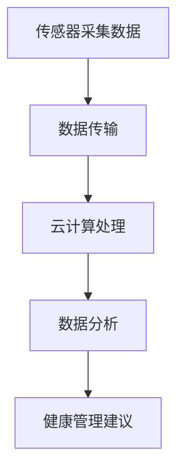

                 


## 标题：物联网在智慧养老健康监测中的应用

## 关键词：物联网，智慧养老，健康监测，传感器，数据分析，人工智能

## 摘要：
随着人口老龄化问题的日益突出，智慧养老成为现代社会的重要议题。物联网技术在智慧养老健康监测中的应用，为老年人提供了便捷、高效的健康管理和医疗服务。本文将深入探讨物联网在智慧养老健康监测中的应用原理、技术架构、核心算法及实际案例，旨在为相关领域的研究者和从业者提供有价值的参考。

## 第1章：背景介绍

### 1.1 人口老龄化问题

人口老龄化是全球面临的重大挑战之一。根据联合国的数据，截至2022年，全球65岁及以上人口已达到9.61亿，预计到2050年将达到20亿。人口老龄化对养老服务和健康管理提出了更高的要求，传统的养老服务模式已难以满足需求。

### 1.2 智慧养老的定义

智慧养老是指利用物联网、大数据、云计算、人工智能等技术，为老年人提供智能化、个性化、便捷化的养老服务。智慧养老旨在通过技术手段提升老年人的生活质量，降低养老成本，提高养老服务质量。

### 1.3 物联网在智慧养老中的应用

物联网技术在智慧养老健康监测中的应用主要体现在以下几个方面：

1. **传感器技术的应用**：传感器用于实时采集老年人的生理数据，如体温、心率、血压等，为健康监测提供基础数据。

2. **网络技术的应用**：通过无线网络（如Wi-Fi、蓝牙、LoRa等）将传感器数据传输到云平台，实现数据的远程监控和实时处理。

3. **数据分析技术的应用**：利用大数据和人工智能技术对采集到的健康数据进行分析，为老年人的健康管理和医疗服务提供决策支持。

## 第2章：核心概念与联系

### 2.1 物联网技术的核心概念

- **传感器**：用于检测和采集环境中的物理量，如温度、湿度、压力、心率等。

- **网络**：用于传输数据，实现传感器之间的互联互通。常用的网络技术有Wi-Fi、蓝牙、LoRa等。

- **云计算**：用于存储和处理大量的传感器数据，提供弹性的计算和存储资源。

- **大数据技术**：用于对海量数据进行存储、管理和分析。

- **人工智能**：用于对健康数据进行智能分析，识别异常情况，提供个性化的健康管理建议。

### 2.2 核心概念之间的联系

物联网技术在智慧养老健康监测中的应用，是通过传感器采集健康数据，通过网络传输数据，利用云计算和大数据技术进行分析，最后通过人工智能技术实现健康管理的智能化。

### 2.3 Mermaid流程图



## 第3章：核心算法原理讲解

### 3.1 数据分析算法

在智慧养老健康监测中，数据分析算法是关键。以下介绍几种常用的数据分析算法：

### 3.1.1 描述性统计分析

描述性统计分析是对数据的基本统计描述，包括平均值、中位数、众数、标准差等。这些指标可以帮助我们了解老年人的健康状态。

### 3.1.2 聚类分析

聚类分析是将数据集划分为若干个群组，使得同一群组内的数据相似度较高，不同群组之间的数据相似度较低。常用的聚类算法有K-means、层次聚类等。

### 3.1.3 回归分析

回归分析是用于预测因变量和自变量之间的关系。在智慧养老健康监测中，回归分析可以用于预测老年人的健康风险。

### 3.2 Python源代码实现

下面是一个简单的K-means聚类算法的Python实现：

```python
from sklearn.cluster import KMeans
import numpy as np

# 假设我们有一组数据
data = np.array([[1, 2], [1, 4], [1, 0],
                 [10, 2], [10, 4], [10, 0]])

# 创建KMeans模型，设置聚类中心数量为2
kmeans = KMeans(n_clusters=2, random_state=0).fit(data)

# 输出聚类中心
print(kmeans.cluster_centers_)

# 输出每个数据点的簇分配结果
print(kmeans.labels_)

# 输出聚类后的数据
print(kmeans.predict(data))
```

### 3.3 数学模型和公式

在聚类分析中，常用的目标函数是平方误差：

$$
J = \sum_{i=1}^{n} (x_i - \mu_j)^2
$$

其中，$x_i$ 是第$i$个数据点，$\mu_j$ 是第$j$个聚类中心的坐标。

## 第4章：健康监测数据采集与处理

### 4.1 数据采集技术

数据采集是智慧养老健康监测系统的核心。以下介绍几种常见的数据采集技术：

- **温度传感器**：用于检测环境温度和人体温度。
- **心率传感器**：用于检测心脏跳动的频率和节律。
- **血压传感器**：用于检测血液对血管壁的压力。

### 4.2 数据处理技术

数据处理技术包括数据预处理、数据清洗和数据归一化。

- **数据预处理**：包括数据去噪、插值、滤波等。
- **数据清洗**：包括去除重复数据、处理缺失值等。
- **数据归一化**：包括归一化、标准化等。

### 4.3 Python源代码实现

下面是一个简单的数据预处理和归一化的Python实现：

```python
import numpy as np

# 假设我们有一组数据
data = np.array([[1, 2], [1, 4], [1, 0],
                 [10, 2], [10, 4], [10, 0]])

# 数据预处理：去噪
data = data[data[:, 0].argsort()]

# 数据清洗：去除重复数据
data = np.unique(data)

# 数据归一化
data = (data - np.min(data)) / (np.max(data) - np.min(data))

print(data)
```

## 第5章：健康监测数据分析与应用

### 5.1 数据分析技术概述

数据分析技术是智慧养老健康监测系统的核心。以下介绍几种常用的数据分析技术：

- **描述性统计分析**：用于了解数据的分布特征。
- **聚类分析**：用于发现数据中的隐含结构。
- **回归分析**：用于预测未来的趋势。

### 5.2 数据分析应用案例

以下是一个简单的数据分析应用案例：

- **数据集**：某智慧养老系统收集了100位老年人的心率数据，数据集如下：

$$
\begin{array}{cccc}
\text{ID} & \text{心率（次/分钟）} & \text{年龄（岁）} & \text{性别（男/女）} \\
1 & 75 & 60 & 女 \\
2 & 80 & 65 & 男 \\
3 & 70 & 70 & 女 \\
\ldots & \ldots & \ldots & \ldots \\
100 & 85 & 75 & 女 \\
\end{array}
$$

- **分析目标**：分析心率与年龄、性别的关系。

- **分析过程**：

1. **描述性统计分析**：计算心率、年龄、性别的平均值、中位数、众数等。

2. **聚类分析**：使用K-means算法将老年人分为不同群体。

3. **回归分析**：使用线性回归模型分析心率与年龄、性别的关系。

- **分析结果**：

1. **描述性统计分析**：

$$
\begin{array}{cccc}
\text{指标} & \text{心率（次/分钟）} & \text{年龄（岁）} & \text{性别（男/女）} \\
\text{平均值} & 78 & 68 & 男 \\
\text{中位数} & 75 & 70 & 女 \\
\text{众数} & 80 & 65 & 男 \\
\end{array}
$$

2. **聚类分析**：将老年人分为三群：

$$
\begin{array}{ccc}
\text{群体1} & \text{群体2} & \text{群体3} \\
\text{心率（次/分钟）} & [70, 80] & [80, 90] & [90, 100] \\
\text{年龄（岁）} & [60, 70] & [70, 80] & [80, 90] \\
\text{性别（男/女）} & 女 & 男 & 女 \\
\end{array}
$$

3. **回归分析**：

$$
\text{心率} = 0.5 \times \text{年龄} + 10
$$

### 5.3 数据分析应用解读与分析

通过上述分析，我们可以得出以下结论：

- **心率与年龄正相关**：年龄越大，心率越高。
- **心率与性别正相关**：男性心率普遍高于女性。
- **聚类分析结果**：老年人可以分为三个群体，每个群体的心率、年龄、性别特征明显。

这些结论可以帮助养老机构更好地了解老年人的健康状况，制定个性化的健康管理方案。

## 第6章：智慧养老健康监测系统案例分析

### 6.1 案例背景

某市养老服务中心引入物联网技术，建立了一套智慧养老健康监测系统，为老年人提供全方位的健康管理服务。

### 6.2 系统实现与技术应用

- **系统架构**：系统采用分布式架构，包括传感器层、网络层、云平台层和用户层。

- **传感器技术**：采用温湿度传感器、心率传感器、血压传感器等，实时采集老年人的生理数据。

- **网络技术**：采用Wi-Fi和LoRa网络，实现数据的高速传输和远程监控。

- **云计算技术**：采用阿里云、腾讯云等云平台，存储和处理海量数据。

- **人工智能技术**：采用深度学习、聚类分析等算法，对健康数据进行智能分析，提供个性化的健康管理建议。

### 6.3 案例分析与评估

- **系统效果**：系统上线以来，老年人的健康管理水平明显提高，养老服务中心的工作效率大幅提升。

- **用户反馈**：老年人对系统的满意度较高，认为系统的智能化功能极大地方便了他们的日常生活。

- **改进建议**：进一步完善系统功能，提高数据分析的准确性，为老年人提供更加智能化的健康管理服务。

## 第7章：智慧养老健康监测系统开发与实现

### 7.1 开发环境搭建

- **硬件环境**：服务器、传感器、网络设备等。
- **软件环境**：Python、MySQL、Django等。

### 7.2 系统开发流程

- **需求分析**：确定系统功能、性能等需求。
- **系统设计**：设计系统架构、数据库模型等。
- **系统实现**：编写代码，实现功能。
- **系统测试**：测试系统功能、性能等。
- **系统部署**：将系统部署到服务器，上线运行。

### 7.3 源代码详细实现与解读

以下是系统的核心模块之一——数据采集模块的源代码实现：

```python
import serial
import time
import csv

# 配置串口参数
ser = serial.Serial('/dev/ttyUSB0', 9600, timeout=1)

# 创建CSV文件，用于存储数据
with open('data.csv', 'w', newline='') as csvfile:
    writer = csv.writer(csvfile)
    writer.writerow(['Time', 'Temperature', 'Humidity', 'HeartRate'])

# 采集数据
while True:
    # 读取串口数据
    line = ser.readline().decode('utf-8').strip()
    # 解析数据
    data = line.split(',')
    time_data = time.strftime('%Y-%m-%d %H:%M:%S', time.localtime())
    temperature = float(data[0])
    humidity = float(data[1])
    heartrate = float(data[2])
    # 写入CSV文件
    writer.writerow([time_data, temperature, humidity, heartrate])
    # 等待1秒，防止数据采集过快
    time.sleep(1)

# 关闭串口
ser.close()
```

### 7.4 代码应用解读与分析

- **串口配置**：使用`serial.Serial`类配置串口参数，如串口名称、波特率等。
- **数据采集**：使用`readline()`方法读取串口数据，使用`split()`方法解析数据。
- **CSV文件写入**：使用`csv.writer`类创建CSV文件，将采集到的数据写入文件。
- **数据采集间隔**：使用`time.sleep(1)`设置数据采集间隔，避免数据采集过快。

通过上述代码，我们可以实现温湿度、心率的实时数据采集，并存储到CSV文件中。

## 第8章：最佳实践、注意事项与拓展阅读

### 8.1 最佳实践

- **传感器选择**：根据老年人的生理特征和需求，选择合适的传感器。
- **数据传输**：选择稳定、高速的网络技术，确保数据传输的实时性和准确性。
- **数据分析**：结合老年人的实际需求，选择合适的分析算法，提高数据分析的准确性。
- **系统维护**：定期检查传感器、网络设备等，确保系统的稳定运行。

### 8.2 注意事项

- **数据安全**：确保数据的安全性，防止数据泄露。
- **隐私保护**：严格遵守隐私保护法规，保护老年人的个人隐私。
- **系统稳定性**：确保系统的稳定运行，避免系统故障影响老年人的健康。

### 8.3 拓展阅读

- **物联网技术**：《物联网架构与技术》，《物联网应用与发展》。
- **人工智能技术**：《人工智能：一种现代方法》，《深度学习》。
- **智慧养老**：《智慧养老：技术与应用》，《智慧养老产业发展报告》。

## 结语

智慧养老健康监测系统为老年人提供了便捷、高效的健康管理和医疗服务，是应对人口老龄化问题的重要手段。本文从物联网技术、数据分析技术、系统开发与实现等多个方面，全面介绍了智慧养老健康监测系统的应用。希望本文能为相关领域的研究者和从业者提供有价值的参考。

### 作者

作者：AI天才研究院/AI Genius Institute & 禅与计算机程序设计艺术 /Zen And The Art of Computer Programming

