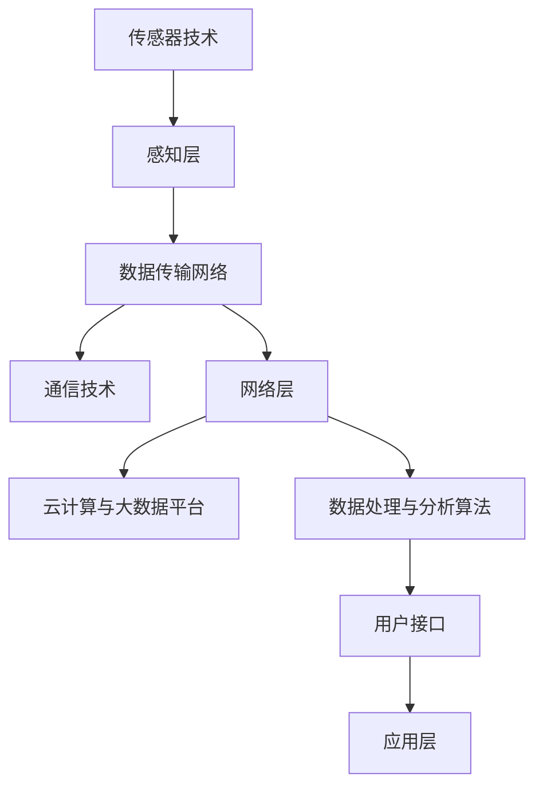

                 

### 物联网的基本概念与技术架构

#### 1.1 物联网的定义与核心要素

物联网（Internet of Things，简称 IoT）是指将各种信息传感设备与互联网相连接，实现物品与物品之间、人与物品之间，以及人与互联网之间的互联互通。物联网的基本定义可以归纳为：通过信息传感设备，将物理世界的各种实体对象（如家用电器、交通工具、农业设备等）与互联网连接起来，形成一个庞大的智能网络系统。

物联网的核心要素主要包括以下几个方面：

1. **传感器**：传感器是物联网的核心设备，它能够感知环境中的各种信息，如温度、湿度、光照、声音等，并将其转化为电信号或其他形式的数据。

2. **数据传输网络**：数据传输网络负责将传感器采集到的数据传输到云端或数据处理中心。常见的传输网络包括无线网络（如Wi-Fi、蓝牙、蜂窝网络等）和有线网络（如以太网、光纤等）。

3. **云计算与大数据平台**：云计算和大数据平台为物联网提供了强大的数据处理和分析能力。通过云计算，可以实现对海量数据的存储、处理和分析；通过大数据技术，可以挖掘数据中的有价值信息，为决策提供支持。

4. **数据处理与分析算法**：数据处理与分析算法是物联网智能化的关键。通过对采集到的数据进行分析和处理，可以实现对物体状态的实时监控、预测和决策。

5. **用户接口**：用户接口包括移动应用、Web 界面等，它为用户提供了与物联网系统交互的途径，使用户可以实时查看物体状态、接收警报通知等。

#### 1.2 物联网的技术架构

物联网的技术架构可以分为四个主要层次：感知层、网络层、平台层和应用层。

1. **感知层**：感知层是物联网体系结构的最底层，主要由各种类型的传感器和收集设备组成，负责数据的采集和初步处理。常见的传感器有温度传感器、湿度传感器、光照传感器、气体传感器等。感知层是物联网系统的信息源头，其性能直接影响到整个系统的数据准确性和可靠性。

2. **网络层**：网络层负责将感知层采集到的数据传输到平台层。网络层可以选择多种传输方式，包括无线网络（如Wi-Fi、蓝牙、蜂窝网络等）和有线网络（如以太网、光纤等）。网络层的可靠性、带宽和延迟等因素直接影响到物联网系统的性能和用户体验。

3. **平台层**：平台层是物联网系统的核心，负责数据的存储、处理和分析。平台层通常采用云计算和大数据技术，能够实现海量数据的实时处理和存储。平台层还提供了各种数据分析和机器学习算法，可以挖掘数据中的有价值信息，为决策提供支持。

4. **应用层**：应用层是物联网技术的最终实现，它将物联网系统提供的功能应用于各个行业，如智能家居、智慧城市、智慧农业、智能医疗等。应用层可以根据用户需求，提供个性化的服务和解决方案。

#### 1.3 物联网的发展历程与趋势

物联网技术的发展历程可以分为以下几个阶段：

1. **早期阶段（1990s-2000s）**：这一阶段主要是物联网概念的提出和初步实现。1990年，凯文·阿什顿提出了物联网的概念，而RFID（射频识别）技术被认为是物联网的雏形。

2. **成长阶段（2000s-2010s）**：这一阶段是物联网技术的快速发展期。随着无线通信技术、传感器技术和数据处理技术的进步，物联网逐渐从实验室走向实际应用。智能家居、智能交通、智能工厂等应用场景不断涌现。

3. **成熟阶段（2010s-至今）**：物联网技术逐渐成熟，市场规模不断扩大。云计算、大数据、人工智能等新兴技术的融合，使得物联网系统更加智能和高效。智慧城市、智慧农业、智能医疗等领域的应用得到了广泛推广。

未来，物联网将继续向智能化、网络化、协同化方向发展。以下是物联网未来可能的发展趋势：

1. **更高性能的传感器和通信技术**：随着传感器技术的进步，将会有更多类型和更高性能的传感器问世，满足物联网系统对数据精度和实时性的需求。同时，5G、6G等新一代通信技术将提供更高的带宽和更低的延迟，进一步提升物联网系统的性能。

2. **更智能的数据处理和分析**：随着人工智能和大数据技术的不断发展，物联网系统将具备更强的数据处理和分析能力。通过机器学习、深度学习等技术，物联网系统能够从海量数据中挖掘出更多有价值的信息，为决策提供支持。

3. **更广泛的应用场景**：物联网技术将不断渗透到各行各业，从智能家居、智慧城市、智慧农业、智能医疗，到无人驾驶、智能制造、智能物流等，物联网的应用场景将越来越广泛。

4. **更高的安全性和隐私保护**：随着物联网规模的扩大，数据安全和隐私保护将成为重要问题。物联网系统需要采取更严格的安全措施，确保数据的安全传输和存储，同时保护用户的隐私。

#### 1.4 物联网的生态系统

物联网的生态系统包括多个关键角色和环节：

1. **硬件制造商**：硬件制造商负责生产各种物联网设备和传感器，如智能插座、智能摄像头、智能门锁等。

2. **软件开发公司**：软件开发公司负责开发物联网平台和应用软件，为物联网系统的正常运行提供支持。

3. **服务提供商**：服务提供商为物联网系统提供数据传输、存储、处理等技术服务，如云计算服务提供商、大数据服务提供商等。

4. **系统集成商**：系统集成商负责将硬件、软件和服务整合在一起，为客户提供一个完整的物联网解决方案。

5. **最终用户**：最终用户是物联网系统的直接使用者，他们通过物联网平台和应用软件享受各种智能服务。

#### 1.5 物联网的挑战与机遇

物联网在发展过程中面临着诸多挑战和机遇：

1. **挑战**：
   - **数据安全和隐私保护**：物联网系统涉及大量用户数据，如何确保数据的安全传输和存储，保护用户隐私，是一个重要挑战。
   - **标准化**：物联网技术种类繁多，缺乏统一的标准，导致不同设备之间的互操作性问题。
   - **能耗和管理**：物联网设备数量庞大，如何有效管理这些设备的能耗，延长其使用寿命，是一个技术难题。
   - **技术成熟度**：虽然物联网技术已经取得一定进展，但仍有一些关键技术尚未成熟，如5G、人工智能等。

2. **机遇**：
   - **智能化转型**：物联网技术为各行各业提供了智能化转型的机会，有助于提升生产效率、降低成本、提高服务质量。
   - **新兴市场**：随着物联网技术的普及，将诞生大量新兴市场和应用场景，如智慧农业、智能医疗、智能交通等。
   - **跨界合作**：物联网技术需要硬件、软件、网络等多方合作，这将促进不同行业之间的跨界合作和创新。

通过以上分析，我们可以看到物联网技术在智慧农业中具有巨大的应用潜力。在接下来的章节中，我们将进一步探讨物联网在智慧农业中的具体应用场景和技术实现。

## 核心概念与联系

在深入探讨物联网在智慧农业中的应用之前，我们需要了解几个核心概念及其之间的关系。这些概念包括传感器技术、通信技术、云计算与大数据平台、数据处理与分析算法以及用户接口。以下是一个简单的 Mermaid 流程图，展示了这些核心概念之间的联系：



#### 传感器技术

传感器技术是物联网系统的核心，它通过感知环境中的各种信息，如温度、湿度、光照、土壤湿度等，并将这些信息转化为电信号或其他形式的数据。以下是几种常见的传感器类型及其工作原理：

1. **温度传感器**：基于热敏电阻或热电偶原理，能够测量环境温度。
2. **湿度传感器**：基于电容或电阻变化原理，能够测量空气中的水分含量。
3. **光照传感器**：基于光电效应，能够测量光线的强度。
4. **土壤湿度传感器**：通过测量土壤的导电性，能够判断土壤的水分含量。

#### 数据传输网络

数据传输网络负责将传感器采集到的数据传输到云端或数据处理中心。常见的传输方式包括：

1. **无线传输**：如Wi-Fi、蓝牙、ZigBee等。
2. **有线传输**：如以太网、光纤等。

#### 云计算与大数据平台

云计算与大数据平台为物联网系统提供了强大的数据处理和分析能力。通过云计算，可以实现对海量数据的存储、处理和分析；通过大数据技术，可以挖掘数据中的有价值信息，为决策提供支持。以下是一个简化的数据处理流程：

1. **数据采集**：传感器采集数据。
2. **数据传输**：数据通过网络传输到云端或数据处理中心。
3. **数据存储**：数据在云端或大数据平台上存储。
4. **数据处理**：通过数据分析算法处理数据，提取有价值信息。
5. **数据可视化**：将处理后的数据通过用户接口呈现给用户。

#### 数据处理与分析算法

数据处理与分析算法是物联网智能化的关键。通过对采集到的数据进行分析和处理，可以实现对物体状态的实时监控、预测和决策。常见的算法包括：

1. **统计方法**：如线性回归、逻辑回归等。
2. **机器学习方法**：如决策树、随机森林、支持向量机等。
3. **深度学习方法**：如卷积神经网络（CNN）、循环神经网络（RNN）等。

#### 用户接口

用户接口包括移动应用、Web 界面等，它为用户提供了与物联网系统交互的途径，使用户可以实时查看物体状态、接收警报通知等。以下是用户接口的基本功能：

1. **数据展示**：以图表、图像等形式展示实时数据和历史数据。
2. **报警通知**：当传感器检测到异常情况时，通过短信、邮件等方式通知用户。
3. **操作控制**：用户可以通过接口对物联网设备进行远程控制。

通过上述核心概念及其之间的联系，我们可以更好地理解物联网系统在智慧农业中的应用原理和实现方式。在下一章节中，我们将深入探讨智慧农业的概念与内涵。

### 智慧农业的概念与内涵

#### 2.1 智慧农业的定义

智慧农业是指利用物联网、大数据、云计算、人工智能等现代信息技术，对农业生产过程进行智能化管理，以提高农业生产效率、降低成本、保障农产品质量安全的一种新型农业模式。智慧农业的核心在于通过信息技术手段，实现农业生产的精准化、智能化和现代化。

#### 2.2 智慧农业的关键要素

智慧农业的实现离不开以下几个关键要素：

1. **传感器技术**：传感器是智慧农业的基础，它能够实时监测环境参数，如土壤湿度、温度、光照强度等，为农业生产提供精准的数据支持。

2. **通信技术**：通信技术是传感器数据传输的关键，通过无线通信（如Wi-Fi、蓝牙、ZigBee等）或有线通信（如以太网、光纤等），将传感器数据传输到数据处理中心。

3. **数据处理与分析**：数据处理与分析是将传感器数据转化为有用信息的关键环节。通过大数据分析和机器学习算法，可以实现对农业生产过程的实时监控和预测。

4. **云计算与大数据平台**：云计算与大数据平台提供了强大的数据处理能力和存储能力，能够处理海量数据，并为农业生产提供智能决策支持。

5. **用户接口**：用户接口是连接用户与农业生产系统的桥梁，通过移动应用、Web 界面等，用户可以实时查看农业生产的各项指标，并进行远程控制。

#### 2.3 智慧农业的发展现状与未来趋势

智慧农业作为一种新兴的农业模式，近年来得到了广泛关注和快速发展。以下是智慧农业的发展现状和未来趋势：

1. **发展现状**：
   - **全球范围内**：智慧农业在发达国家得到了广泛应用，如美国、欧洲、日本等。这些国家通过实施精准农业、智能灌溉、智能温室等应用，大幅提升了农业生产效率。
   - **中国**：随着国家对农业现代化的大力支持，智慧农业在中国也取得了显著进展。全国各地纷纷建立了智慧农业示范区，探索适合本国国情的智慧农业模式。

2. **未来趋势**：
   - **智能化水平提升**：随着物联网、人工智能、大数据等技术的发展，智慧农业的智能化水平将不断提高。未来的智慧农业将更加精准、高效和智能化。
   - **跨界融合**：智慧农业将与其他领域（如物联网、人工智能、大数据等）进行深度融合，形成新的产业生态。例如，智慧农业与智能物流、智能零售等领域的融合，将推动农业产业链的全面升级。
   - **可持续发展**：智慧农业将更加注重可持续发展，通过精准施肥、智能灌溉等手段，降低农业生产对环境的影响，实现农业的绿色发展。
   - **普及推广**：随着技术的进步和成本的降低，智慧农业将在全球范围内得到更广泛的普及和推广，为全球农业发展作出更大贡献。

#### 2.4 智慧农业的重要性

智慧农业的重要性体现在以下几个方面：

1. **提高农业生产效率**：通过物联网和大数据技术，可以实时监测和调控农业生产过程中的各项参数，实现精准农业，从而大幅提高农业生产效率。

2. **降低农业生产成本**：智慧农业通过自动化、智能化的生产方式，可以降低人力、物力和资源消耗，从而降低农业生产成本。

3. **保障农产品质量安全**：通过传感器和大数据技术，可以实时监测农产品的生长环境，确保农产品质量安全。

4. **促进农业可持续发展**：智慧农业通过减少资源浪费、降低环境污染，有利于实现农业的可持续发展。

5. **推动农业现代化**：智慧农业是农业现代化的关键，通过引入先进技术，可以推动农业从传统向现代化转型。

总之，智慧农业作为现代农业发展的重要方向，具有重要的战略意义和广阔的发展前景。在未来的发展中，需要加强技术创新、政策支持和产业融合，推动智慧农业在全球范围内的广泛应用和持续发展。

### 物联网在智慧农业中的应用场景

物联网技术在智慧农业中具有广泛的应用场景，通过智能化的手段，可以大幅提升农业生产的效率和质量。以下是物联网在智慧农业中的一些主要应用场景：

#### 3.1 精准农业

精准农业是指利用现代信息技术和装备，对农业生产进行精准管理和调控，以提高生产效率和资源利用效率。物联网技术在精准农业中的应用主要包括：

1. **土壤监测**：通过安装在农田中的传感器，实时监测土壤湿度、温度、酸碱度等参数，为精准施肥和灌溉提供数据支持。

2. **气象监测**：利用气象传感器，实时监测农田周围的气象数据，如温度、湿度、风速、降水量等，帮助农民进行天气预警和农业生产的调整。

3. **作物生长监测**：通过摄像头和图像处理技术，实时监测作物的生长状态，如叶片颜色、病虫害情况等，为农业生产提供决策支持。

4. **无人机监测**：利用无人机进行农田监测，通过高清摄像头和传感器，实时获取农田的影像和数据，进行作物健康评估和病虫害预警。

5. **GPS导航**：利用GPS技术，实现农业机械的精准导航，提高农田作业的精度和效率。

#### 3.2 智能灌溉

智能灌溉系统利用物联网技术，通过传感器实时监测土壤湿度，自动控制灌溉设备进行精准灌溉。智能灌溉系统的核心部件包括：

1. **土壤湿度传感器**：实时监测土壤湿度，当土壤湿度低于设定值时，自动启动灌溉系统。

2. **灌溉控制器**：根据土壤湿度传感器提供的数据，自动控制灌溉设备的工作状态，如启动或关闭灌溉泵、调节喷水量等。

3. **灌溉设备**：包括滴灌、喷灌、微灌等设备，根据作物生长需求进行精准灌溉。

智能灌溉系统具有以下优势：

- **节约水资源**：通过精准灌溉，可以大幅减少水资源的浪费，提高灌溉效率。
- **提高作物产量和质量**：精准灌溉有助于作物获得最佳的生长环境，从而提高产量和质量。
- **降低人工成本**：智能灌溉系统可以自动化运行，减少人工干预，降低农业生产成本。

#### 3.3 智能监测与预警

智能监测与预警系统利用物联网技术，对农业生产过程中的各种参数进行实时监测，并自动生成预警信息。智能监测与预警系统的主要功能包括：

1. **病虫害监测**：利用传感器和图像识别技术，实时监测作物的病虫害情况，自动生成预警信息，帮助农民及时采取防治措施。

2. **气象预警**：通过气象传感器，实时监测气象数据，如温度、湿度、风速、降水量等，自动生成气象预警信息，帮助农民调整农业生产计划。

3. **土壤污染监测**：利用传感器，实时监测土壤中的污染物浓度，自动生成污染预警信息，确保农产品质量安全。

4. **设备故障预警**：对农业生产中的机械设备进行实时监测，当设备出现故障时，自动生成故障预警信息，帮助农民及时进行维修。

智能监测与预警系统有助于提高农业生产的安全性和可靠性，减少因病虫害、气象灾害、设备故障等导致的农业生产损失。

#### 3.4 智能温室

智能温室是利用物联网技术对温室环境进行智能控制，为作物提供最佳生长环境。智能温室的主要功能包括：

1. **环境参数监测**：通过传感器，实时监测温室内的温度、湿度、光照、CO2浓度等环境参数，确保作物生长所需的最佳环境。

2. **智能控制**：根据环境参数，自动调节温室内的通风、灌溉、照明等设备，维持温室内的最佳环境。

3. **数据可视化**：通过移动应用或Web界面，实时展示温室内的环境参数和设备状态，方便农民进行远程管理和监控。

智能温室系统具有以下优势：

- **提高作物产量和质量**：智能温室为作物提供最佳的生长环境，有助于提高产量和质量。
- **降低人工成本**：通过自动化控制，减少人工干预，降低农业生产成本。
- **提高生产效率**：智能温室系统能够实时监测和调整环境参数，提高农业生产效率。

#### 3.5 农业物联网平台建设

农业物联网平台是整合各种物联网设备、传感器、数据处理和分析系统的核心，通过该平台，可以实现农业生产过程的全面监控和管理。农业物联网平台的主要功能包括：

1. **数据采集与存储**：通过传感器和设备，实时采集农业生产过程中的各种数据，并存储在云端或大数据平台上。

2. **数据处理与分析**：利用大数据分析和机器学习算法，对采集到的数据进行分析和处理，提取有价值的信息，为农业生产提供决策支持。

3. **远程监控与控制**：通过移动应用或Web界面，用户可以实时监控农业生产过程，并对设备进行远程控制。

4. **智能预警与报警**：根据分析结果，自动生成预警信息，及时提醒用户采取相应措施。

农业物联网平台的建设有助于实现农业生产的智能化、自动化和精准化，提高农业生产效率和质量。

通过上述物联网在智慧农业中的应用场景，我们可以看到物联网技术为农业生产带来的巨大变革。在接下来的章节中，我们将进一步探讨物联网在智慧农业中的应用技术，如传感器技术、通信技术、数据处理与分析技术等。

### 传感器技术

在物联网技术体系中，传感器技术起着至关重要的作用。传感器是物联网系统的“感官”，它能够捕捉环境中的各种信息，如温度、湿度、光照、土壤湿度等，并将这些信息转化为电信号或其他可处理的形式。以下是几种常见的传感器类型及其工作原理：

#### 1. 温度传感器

温度传感器是测量温度的基本设备，它的工作原理基于材料的物理特性。常见的温度传感器包括热敏电阻、热电偶和半导体传感器。

- **热敏电阻**：热敏电阻的电阻值随温度的变化而变化。当温度升高时，热敏电阻的电阻值减小；反之，当温度降低时，电阻值增大。热敏电阻常用于精确的温度测量。
- **热电偶**：热电偶由两种不同材料的导体组成，当其一端受热时，会在两端产生热电势。根据热电势的大小可以推算出温度。热电偶具有响应快、精度高、测量范围广等优点，广泛应用于工业生产中。
- **半导体传感器**：半导体传感器的电阻值随温度变化非常敏感，常用于微温度测量。其工作原理基于半导体材料的PN结特性，当温度变化时，PN结的导电性也会发生变化。

#### 2. 湿度传感器

湿度传感器用于测量环境中的水分含量，常见的类型包括电容式和电阻式传感器。

- **电容式湿度传感器**：电容式湿度传感器基于介电常数的变化工作。当环境湿度变化时，传感器中电容的值会发生变化，通过测量电容值，可以推算出湿度。电容式湿度传感器具有高精度、高稳定性等优点。
- **电阻式湿度传感器**：电阻式湿度传感器基于电阻值的变化工作。当环境湿度变化时，传感器中材料的电阻值会发生变化，通过测量电阻值，可以推算出湿度。电阻式湿度传感器具有结构简单、成本低等优点。

#### 3. 光照传感器

光照传感器用于测量环境中的光强度，常见的类型包括光敏电阻和光电池。

- **光敏电阻**：光敏电阻的电阻值随光照强度的变化而变化。当光照强度增加时，光敏电阻的电阻值减小；反之，当光照强度减弱时，电阻值增大。光敏电阻常用于光照检测和自动控制。
- **光电池**：光电池是一种将光能直接转换为电能的装置。当光照强度增加时，光电池产生的电流也随之增加。光电池广泛应用于太阳能电池板和光电控制系统中。

#### 4. 土壤湿度传感器

土壤湿度传感器用于测量土壤中的水分含量，常见的类型包括基于电容变化和电阻变化的传感器。

- **电容式土壤湿度传感器**：电容式土壤湿度传感器基于土壤介电常数的变化工作。当土壤湿度变化时，传感器的电容值会发生变化，通过测量电容值，可以推算出土壤湿度。
- **电阻式土壤湿度传感器**：电阻式土壤湿度传感器基于土壤的导电性变化工作。当土壤湿度变化时，土壤的电阻值会发生变化，通过测量电阻值，可以推算出土壤湿度。

#### 5. 气体传感器

气体传感器用于检测和测量特定气体浓度，常见的类型包括半导体传感器和电化学传感器。

- **半导体传感器**：半导体传感器基于半导体材料对特定气体的敏感性工作。当气体浓度增加时，传感器的电阻值会发生变化，通过测量电阻值，可以推算出气体浓度。
- **电化学传感器**：电化学传感器基于化学反应原理工作。当特定气体与传感器中的电极发生反应时，会在电极间产生电流或电位变化，通过测量电流或电位，可以推算出气体浓度。

通过以上传感器类型及其工作原理的介绍，我们可以看到传感器技术在物联网系统中的关键作用。在接下来的章节中，我们将进一步探讨物联网技术在智慧农业中的应用，如通信技术、数据处理与分析技术等。

### 通信技术

在物联网技术体系中，通信技术是实现传感器数据传输和设备间互联互通的核心。通信技术包括无线通信和有线通信两大类，各自具有不同的技术特点和应用场景。以下将对物联网中的主要通信技术进行详细探讨。

#### 1. 无线通信技术

无线通信技术是物联网系统中最常用的数据传输方式之一，它能够实现设备之间的无线连接和数据传输。以下是几种常见的无线通信技术：

1. **Wi-Fi**：
   - **技术特点**：Wi-Fi是一种基于IEEE 802.11标准的高速率无线通信技术，能够提供较高的数据传输速率和较好的稳定性。
   - **应用场景**：Wi-Fi广泛应用于家庭、办公室和公共场所，适合需要高速数据传输的应用场景。

2. **蓝牙**：
   - **技术特点**：蓝牙是一种短距离的无线通信技术，基于IEEE 802.15.1标准。蓝牙具有低功耗、低成本、易于实现等特点。
   - **应用场景**：蓝牙常用于智能设备的短距离通信，如智能手表、智能手机、智能家居设备等。

3. **ZigBee**：
   - **技术特点**：ZigBee是一种低功耗、低速率的无线通信技术，基于IEEE 802.15.4标准。ZigBee具有低功耗、低速率、高可靠性等优点。
   - **应用场景**：ZigBee广泛应用于智能家居、智慧农业、工业自动化等领域，适合大量低功耗设备的互联。

4. **LoRa**：
   - **技术特点**：LoRa是一种低功耗广域网（LPWAN）技术，能够实现长距离的数据传输，具有低功耗、低成本、大覆盖范围等优点。
   - **应用场景**：LoRa广泛应用于远程监控、智能城市、智能农业等领域，适合大规模物联网应用。

#### 2. 有线通信技术

有线通信技术是通过物理导线实现数据传输的一种方式，具有高稳定性和高数据传输速率的特点。以下是几种常见的有线通信技术：

1. **以太网**：
   - **技术特点**：以太网是一种高速的有线通信技术，基于IEEE 802.3标准。以太网能够提供高速、稳定的网络连接。
   - **应用场景**：以太网广泛应用于家庭、办公室和数据中心，适合需要高速数据传输的应用场景。

2. **光纤**：
   - **技术特点**：光纤通信是一种利用光纤传输光信号的高效通信技术，具有高带宽、低延迟、抗干扰能力强等优点。
   - **应用场景**：光纤广泛应用于数据中心、宽带接入、远程监控等领域，适合需要高带宽、低延迟的应用场景。

#### 3. 无线通信与有线通信的比较

无线通信与有线通信各有其优缺点，以下是比较：

- **传输速率**：有线通信通常具有更高的传输速率，适用于需要高速数据传输的场景；无线通信速率较低，但具有灵活性和便捷性。
- **稳定性**：有线通信稳定性较高，受环境影响较小；无线通信易受干扰，稳定性较差。
- **成本**：有线通信设备成本较高，但后期维护成本低；无线通信设备成本较低，但需考虑维护和信号覆盖成本。
- **覆盖范围**：有线通信受导线长度限制，覆盖范围较小；无线通信覆盖范围较大，适用于广域应用。

#### 4. 通信技术在智慧农业中的应用

在智慧农业中，通信技术发挥着重要作用，以下是一些典型的应用场景：

1. **土壤湿度监测**：通过安装在地表的无线传感器，实时监测土壤湿度，并将数据通过LoRa或ZigBee等无线通信技术传输到中心处理系统。

2. **气象数据采集**：利用安装在农田周围的气象传感器，通过Wi-Fi或以太网通信技术，将气象数据传输到中心处理系统，进行实时分析和预警。

3. **远程监控与控制**：通过无线通信技术，实现对农田设备的远程监控和控制，如通过Wi-Fi或蓝牙技术，实现对智能灌溉系统的远程操作。

4. **数据传输与共享**：利用光纤通信技术，实现中心处理系统与远程农田之间的高速数据传输，方便数据的集中处理和分析，同时实现数据的共享。

综上所述，通信技术在智慧农业中具有广泛的应用前景。通过合理选择和应用通信技术，可以实现农业生产过程中的实时监控、数据传输和远程控制，大幅提升农业生产效率和质量。在接下来的章节中，我们将进一步探讨数据处理与处理技术，以及物联网在智慧农业中的应用案例。

### 数据采集与处理技术

在物联网系统中，数据采集与处理是至关重要的环节。通过有效的数据采集和处理技术，可以将传感器收集到的原始数据转化为有用的信息，为农业生产提供科学决策支持。以下是对数据采集与处理技术的详细探讨：

#### 1. 数据采集方法

数据采集是物联网系统的第一步，主要依赖于传感器设备。以下是几种常见的数据采集方法：

1. **定时采集**：定时采集是指传感器在固定的时间间隔内自动采集数据。这种方法适用于数据变化较为缓慢的场景，如土壤湿度、温度等。

2. **事件触发采集**：事件触发采集是指传感器在特定事件发生时自动采集数据，如土壤湿度低于阈值时自动采集数据。这种方法适用于数据变化剧烈或需要实时监测的场景。

3. **连续监测与采集**：连续监测与采集是指传感器持续不断地采集数据，如气象传感器连续监测气象参数。这种方法适用于需要实时、连续获取数据的场景。

#### 2. 数据预处理技术

数据预处理是数据处理的第一步，其主要目的是将原始数据进行清洗、格式化、转换等处理，以提高数据质量和可用性。以下是几种常见的数据预处理技术：

1. **数据清洗**：数据清洗是指去除数据中的噪声、错误和冗余信息，以提高数据质量。常见的清洗方法包括缺失值处理、异常值处理、重复值删除等。

2. **数据格式化**：数据格式化是指将不同来源、不同格式的数据进行标准化处理，使其满足数据处理和分析的要求。常见的格式化方法包括统一时间格式、数据类型转换等。

3. **数据转换**：数据转换是指将原始数据转换为适合分析和处理的形式。例如，将模拟信号转换为数字信号，或将不同传感器的数据统一到同一单位。

#### 3. 数据处理与分析技术

数据处理与分析是将预处理后的数据进行进一步处理，提取有价值信息，为农业生产提供决策支持。以下是几种常见的数据处理与分析技术：

1. **统计分析**：统计分析是数据处理的基础方法，包括描述性统计、推断性统计等。描述性统计用于描述数据的分布、集中趋势和离散程度，推断性统计用于推断总体参数。

2. **机器学习**：机器学习是通过算法自动从数据中学习规律，进行预测和分类的方法。常见的机器学习方法包括线性回归、逻辑回归、决策树、随机森林、支持向量机等。

3. **深度学习**：深度学习是一种基于多层神经网络的方法，通过大量数据训练模型，能够自动提取数据中的复杂特征。常见的深度学习模型包括卷积神经网络（CNN）、循环神经网络（RNN）、长短时记忆网络（LSTM）等。

4. **数据可视化**：数据可视化是将数据以图形化方式展示，帮助用户直观地理解数据分布、趋势和关系。常见的数据可视化方法包括折线图、柱状图、散点图、热力图等。

#### 4. 数据采集与处理技术在智慧农业中的应用案例

以下是一个基于物联网的数据采集与处理技术在智慧农业中的应用案例：

**项目背景**：某智慧农业项目旨在通过物联网技术，实现对农田环境参数的实时监测与精准控制，以提高农业生产效率。

**项目实施**：

1. **数据采集**：在农田中布置各种传感器，如土壤湿度传感器、温度传感器、光照传感器等。传感器定期采集土壤湿度、温度、光照等数据，并通过无线通信技术（如LoRa或ZigBee）将数据传输到中心处理系统。

2. **数据预处理**：采集到的原始数据经过清洗、格式化和转换等预处理步骤，去除噪声和错误信息，并统一时间格式和数据单位。

3. **数据处理与分析**：预处理后的数据通过统计分析、机器学习和数据可视化等方法进行处理。例如，利用线性回归模型预测土壤湿度变化趋势，利用决策树模型进行病虫害预测，利用折线图和柱状图展示温度和光照变化情况。

4. **数据应用与决策支持**：分析结果实时展示在移动应用或Web界面上，供农民参考。例如，当土壤湿度低于阈值时，系统自动触发灌溉设备进行精准灌溉；当预测到病虫害发生时，系统自动发送警报信息，提醒农民采取防治措施。

**项目效果**：

- **提高农业生产效率**：通过实时监测农田环境参数，农民可以及时调整农业生产策略，实现精准施肥、灌溉和病虫害防治，大幅提高农业生产效率。
- **降低生产成本**：通过自动化和智能化管理，减少人力、物力和资源消耗，降低农业生产成本。
- **保障农产品质量**：通过实时监测和预警，确保农产品生长环境稳定，保障农产品质量。

通过上述案例分析，我们可以看到数据采集与处理技术在智慧农业中的应用效果显著。在接下来的章节中，我们将进一步探讨决策支持系统的构建与应用。

### 决策支持系统

在智慧农业中，决策支持系统（DSS）是核心组件，它通过集成多种数据源、算法和用户接口，为农业生产者提供实时、准确的决策信息。以下是对决策支持系统的构建与应用的详细探讨。

#### 1. 决策支持系统的架构与功能

决策支持系统通常包括以下几个关键组成部分：

1. **数据采集模块**：负责从传感器、气象站、土壤实验室等渠道收集实时数据。

2. **数据处理模块**：对收集到的数据进行预处理、清洗、转换和存储，为后续分析提供高质量数据。

3. **数据分析模块**：运用统计分析、机器学习、深度学习等方法，对预处理后的数据进行分析，提取有价值的信息。

4. **用户接口模块**：提供图形用户界面（GUI），以图表、图形、报表等形式向用户提供分析结果。

5. **模型库**：存储多种预测模型、优化模型等，支持农业生产者根据实际情况选择合适的模型进行决策。

6. **知识库**：包含农业专家的经验知识、最佳实践等，为系统提供决策支持。

#### 2. 决策支持系统的实现

以下是一个决策支持系统的实现示例，通过Python代码详细阐述其构建过程。

**环境搭建**：
首先，我们需要搭建一个Python开发环境，安装必要的库，如Pandas、NumPy、Scikit-learn、Matplotlib等。

```python
!pip install pandas numpy scikit-learn matplotlib
```

**数据采集与处理**：
假设我们已从传感器收集到土壤湿度、温度、光照等数据，以下代码用于数据预处理。

```python
import pandas as pd

# 读取数据
data = pd.read_csv('sensor_data.csv')

# 数据清洗
data.dropna(inplace=True)
data['timestamp'] = pd.to_datetime(data['timestamp'])

# 数据转换
data['soil_humidity'] = data['soil_humidity'].apply(lambda x: x/100)
```

**数据分析与模型构建**：
以下代码使用线性回归模型预测未来土壤湿度。

```python
from sklearn.linear_model import LinearRegression
import numpy as np

# 数据分割
train_data = data[data['timestamp'] < '2023-01-01']
test_data = data[data['timestamp'] >= '2023-01-01']

# 特征工程
X = train_data[['temperature', 'light_intensity']]
y = train_data['soil_humidity']

# 模型训练
model = LinearRegression()
model.fit(X, y)

# 预测
predictions = model.predict(test_data[['temperature', 'light_intensity']])
```

**用户接口**：
以下代码使用Matplotlib库生成土壤湿度预测的图表。

```python
import matplotlib.pyplot as plt

plt.plot(test_data['timestamp'], predictions, label='Prediction')
plt.plot(test_data['timestamp'], test_data['soil_humidity'], label='Actual')
plt.xlabel('Timestamp')
plt.ylabel('Soil Humidity')
plt.legend()
plt.show()
```

#### 3. 决策支持系统的应用案例

以下是一个决策支持系统在智慧农业中的应用案例。

**项目背景**：某智慧农业项目希望利用决策支持系统，实时监控农田环境参数，并根据预测结果调整灌溉计划，以提高农业生产效率。

**项目实施**：

1. **数据采集**：在农田中布置传感器，实时监测土壤湿度、温度、光照等参数。

2. **数据处理**：将采集到的数据传输到决策支持系统，进行预处理和分析。

3. **模型构建**：基于历史数据，构建线性回归模型预测未来土壤湿度。

4. **决策支持**：系统根据土壤湿度预测结果，自动调整灌溉计划。例如，当预测土壤湿度低于阈值时，系统自动启动灌溉设备。

5. **用户接口**：通过Web界面或移动应用，向农业生产者展示农田环境参数、预测结果和灌溉计划，提供实时决策支持。

**项目效果**：

- **实时监控**：农业生产者可以实时了解农田环境参数，及时发现和处理问题。
- **精准灌溉**：系统根据土壤湿度预测结果，实现精准灌溉，大幅提高水资源利用效率。
- **降低成本**：通过自动化和智能化管理，减少人力和资源消耗，降低农业生产成本。
- **提高产量**：通过精准灌溉和科学管理，提高作物产量和质量。

#### 4. 决策支持系统的优势与挑战

**优势**：

- **实时性**：决策支持系统能够实时获取和处理数据，为农业生产者提供及时的决策支持。
- **科学性**：基于数据分析、机器学习和深度学习等技术，决策支持系统能够提供科学的预测和优化建议。
- **智能化**：通过自动化和智能化管理，决策支持系统能够大幅提高农业生产效率和质量。
- **灵活性**：决策支持系统可以根据不同场景和需求，灵活调整和优化模型，适应不同的农业生产模式。

**挑战**：

- **数据质量**：数据质量直接影响决策支持系统的准确性。需要确保数据采集和处理的准确性和完整性。
- **计算资源**：决策支持系统需要大量的计算资源进行数据分析和模型训练，特别是在大规模物联网应用中。
- **用户接受度**：农业生产者可能对新技术持保守态度，需要通过培训和教育提高他们的接受度和使用效率。

通过决策支持系统，智慧农业可以实现智能化、自动化和精准化管理，为农业生产者提供强大的决策支持。在接下来的章节中，我们将探讨物联网在智慧农业中的案例研究，以进一步了解其具体应用和效果。

### 案例研究一：智慧灌溉系统

#### 8.1 系统设计

智慧灌溉系统旨在通过物联网技术，实现对农田灌溉的自动化管理，以提高水资源利用效率和作物产量。以下是系统设计的详细描述：

**1. 系统架构**

智慧灌溉系统包括感知层、传输层、平台层和应用层四个层次。

- **感知层**：由土壤湿度传感器、气象传感器等组成，负责采集农田环境数据。
- **传输层**：通过无线通信技术（如LoRa或ZigBee），将传感器数据传输到平台层。
- **平台层**：包括数据处理单元、数据库和云计算平台，负责数据处理、存储和分析。
- **应用层**：通过移动应用或Web界面，为农业生产者提供实时监控和操作控制。

**2. 系统功能**

- **实时监控**：实时显示农田环境数据，如土壤湿度、温度、光照等。
- **自动灌溉**：根据土壤湿度数据和气象条件，自动控制灌溉设备的开启和关闭。
- **预警管理**：当土壤湿度低于阈值或气象条件异常时，自动发送警报信息。
- **数据统计**：记录灌溉历史数据，进行统计分析，优化灌溉策略。

**3. 系统实现**

- **硬件选择**：选择合适类型的传感器，如土壤湿度传感器（电容式或电阻式），气象传感器（温度、湿度、光照）。
- **通信模块**：选择低功耗、长距离通信技术，如LoRa或ZigBee，确保数据传输的稳定性和可靠性。
- **数据处理单元**：采用高性能的嵌入式设备，如树莓派或ESP8266，负责数据采集、处理和传输。
- **数据库与云计算平台**：使用MySQL或MongoDB数据库进行数据存储，利用阿里云或腾讯云等云计算平台进行数据分析和处理。

**4. 用户界面**

- **移动应用**：开发Android和iOS平台的应用程序，供农业生产者实时监控和操作。
- **Web界面**：设计Web界面，方便农业生产者在电脑上进行操作和数据分析。

#### 8.2 系统实现

以下是一个简单的Python脚本，用于实现土壤湿度传感器数据的采集和传输。

```python
import serial
import time
import requests

# 串口配置
ser = serial.Serial('/dev/ttyUSB0', 9600, timeout=1)

# API地址
api_url = "http://your_server_address/data_upload"

while True:
    # 读取传感器数据
    data = ser.readline().decode('utf-8').strip()
    soil_humidity, temperature, light_intensity = data.split(',')

    # 处理数据
    soil_humidity = float(soil_humidity) / 100
    temperature = float(temperature)
    light_intensity = float(light_intensity)

    # 上传数据
    payload = {
        'soil_humidity': soil_humidity,
        'temperature': temperature,
        'light_intensity': light_intensity
    }
    response = requests.post(api_url, json=payload)
    
    # 等待一段时间再采集下一组数据
    time.sleep(60)
```

在这个脚本中，我们使用Python的`serial`库连接串口，读取土壤湿度传感器发送的数据，并将其上传到服务器。服务器端使用Python的`Flask`或`Django`框架接收数据，并存入数据库。

#### 8.3 系统评价

智慧灌溉系统的实施，在多个方面提升了农业生产效率：

- **水资源利用**：通过实时监测土壤湿度，系统能够实现精准灌溉，大幅减少水资源的浪费。
- **劳动效率**：自动化灌溉减少了人工干预，提高了劳动效率。
- **作物产量**：精准灌溉有助于作物获得最佳生长条件，从而提高了作物产量。
- **管理便捷性**：农业生产者可以通过移动应用或Web界面，随时随地查看农田状况，进行远程操作。

然而，智慧灌溉系统也存在一些挑战：

- **设备维护**：传感器和通信设备需要定期检查和维护，以确保系统的稳定运行。
- **数据安全**：传感器数据传输需要确保数据的安全性和隐私保护，防止数据泄露。
- **成本**：系统初期投入较大，对于一些中小型农业企业来说，成本可能是一个问题。

总之，智慧灌溉系统在提高农业生产效率和质量方面具有显著优势，但其实施和运行也面临一些挑战。通过不断优化和改进，智慧灌溉系统有望在智慧农业中发挥更大的作用。

### 案例研究二：智能温室监控系统

#### 9.1 系统设计

智能温室监控系统旨在通过物联网技术，实现对温室环境参数的实时监测和自动化控制，为作物提供最佳生长环境。以下是系统设计的详细描述：

**1. 系统架构**

智能温室监控系统包括感知层、传输层、平台层和应用层四个层次。

- **感知层**：由各种传感器（如温度传感器、湿度传感器、光照传感器、CO2传感器等）组成，负责采集温室内的环境数据。
- **传输层**：通过无线通信技术（如Wi-Fi或ZigBee），将传感器数据传输到平台层。
- **平台层**：包括数据处理单元、数据库和云计算平台，负责数据存储、处理和分析。
- **应用层**：通过移动应用或Web界面，为农业生产者提供实时监控和操作控制。

**2. 系统功能**

- **实时监控**：实时显示温室内的环境数据，如温度、湿度、光照、CO2浓度等。
- **环境调控**：根据传感器数据，自动调节温室内的通风、灌溉、照明等设备，维持最佳生长环境。
- **预警管理**：当环境参数异常时，自动发送警报信息，提醒农业生产者采取相应措施。
- **数据统计**：记录温室环境数据和历史操作记录，进行统计分析，优化管理策略。

**3. 系统实现**

- **硬件选择**：选择高性能、低功耗的传感器和通信模块，如DS18B20温度传感器、DHT22湿度传感器、BH1750光照传感器等。
- **通信模块**：采用Wi-Fi或ZigBee模块，确保数据传输的稳定性和可靠性。
- **数据处理单元**：采用嵌入式设备（如Arduino或树莓派），负责数据采集、处理和传输。
- **数据库与云计算平台**：使用MySQL或MongoDB数据库进行数据存储，利用阿里云或腾讯云等云计算平台进行数据分析和处理。

**4. 用户界面**

- **移动应用**：开发Android和iOS平台的应用程序，供农业生产者实时监控和操作。
- **Web界面**：设计Web界面，方便农业生产者在电脑上进行操作和数据分析。

#### 9.2 系统实现

以下是一个简单的Python脚本，用于实现温室环境数据的采集和上传。

```python
import serial
import time
import requests

# 串口配置
ser = serial.Serial('/dev/ttyUSB0', 9600, timeout=1)

# API地址
api_url = "http://your_server_address/data_upload"

while True:
    # 读取传感器数据
    data = ser.readline().decode('utf-8').strip()
    temperature, humidity, light_intensity, co2 = data.split(',')

    # 处理数据
    temperature = float(temperature)
    humidity = float(humidity)
    light_intensity = float(light_intensity)
    co2 = float(co2)

    # 上传数据
    payload = {
        'temperature': temperature,
        'humidity': humidity,
        'light_intensity': light_intensity,
        'co2': co2
    }
    response = requests.post(api_url, json=payload)
    
    # 等待一段时间再采集下一组数据
    time.sleep(60)
```

在这个脚本中，我们使用Python的`serial`库连接串口，读取传感器数据，并将其上传到服务器。服务器端使用Python的`Flask`或`Django`框架接收数据，并存入数据库。

#### 9.3 系统评价

智能温室监控系统的实施，在多个方面提升了温室管理的效率：

- **环境控制**：通过实时监测和自动调控，智能温室监控系统确保了作物生长所需的最佳环境，提高了作物产量和质量。
- **劳动效率**：自动化管理减少了人工干预，提高了劳动效率。
- **预警管理**：系统实时监测环境参数，当参数异常时自动发送警报，减少了因环境问题导致的作物损失。
- **数据统计分析**：系统记录了大量的环境数据和管理操作记录，通过统计分析，农业生产者可以优化管理策略，提高温室管理水平。

然而，智能温室监控系统也存在一些挑战：

- **设备维护**：传感器和通信设备需要定期检查和维护，以确保系统的稳定运行。
- **数据安全**：传感器数据传输需要确保数据的安全性和隐私保护，防止数据泄露。
- **成本**：系统初期投入较大，对于一些中小型农业企业来说，成本可能是一个问题。

总之，智能温室监控系统在提升温室管理效率和质量方面具有显著优势，但其实施和运行也面临一些挑战。通过不断优化和改进，智能温室监控系统有望在智慧农业中发挥更大的作用。

### 案例研究三：农产品质量追溯系统

#### 10.1 系统设计

农产品质量追溯系统利用物联网技术，实现对农产品从生产到销售的全程监控和追踪，确保农产品质量安全和可追溯性。以下是系统设计的详细描述：

**1. 系统架构**

农产品质量追溯系统包括感知层、传输层、平台层和应用层四个层次。

- **感知层**：由各种传感器（如温度传感器、湿度传感器、农药残留传感器等）组成，负责采集农产品生产过程中的关键数据。
- **传输层**：通过无线通信技术（如Wi-Fi、蓝牙或LoRa）将传感器数据传输到平台层。
- **平台层**：包括数据处理单元、数据库和云计算平台，负责数据存储、处理和分析。
- **应用层**：通过移动应用或Web界面，为消费者、农业生产者和监管部门提供查询、追踪和报告服务。

**2. 系统功能**

- **数据采集**：实时采集农产品生产过程中的环境参数、农药使用记录、采收时间等信息。
- **数据传输**：通过无线通信技术，将采集到的数据传输到平台层。
- **数据处理与分析**：对传输上来的数据进行分析和处理，生成农产品质量报告。
- **查询与追踪**：消费者可以通过移动应用或Web界面查询农产品的质量信息和追溯历史。
- **报告生成**：系统自动生成农产品质量报告，供农业生产者和监管部门参考。

**3. 系统实现**

- **硬件选择**：选择适用于农产品生产环境的传感器，如土壤湿度传感器、温度传感器、农药残留传感器等。
- **通信模块**：选择稳定的无线通信模块，如Wi-Fi、蓝牙或LoRa，确保数据传输的稳定性和可靠性。
- **数据处理单元**：采用嵌入式设备（如Arduino或树莓派），负责数据采集、处理和传输。
- **数据库与云计算平台**：使用MySQL或MongoDB数据库进行数据存储，利用阿里云或腾讯云等云计算平台进行数据分析和处理。

**4. 用户界面**

- **移动应用**：开发Android和iOS平台的应用程序，供消费者查询农产品质量信息。
- **Web界面**：设计Web界面，供农业生产者和监管部门进行数据管理和查询。

#### 10.2 系统实现

以下是一个简单的Python脚本，用于实现农产品质量数据的采集和上传。

```python
import serial
import time
import requests

# 串口配置
ser = serial.Serial('/dev/ttyUSB0', 9600, timeout=1)

# API地址
api_url = "http://your_server_address/data_upload"

while True:
    # 读取传感器数据
    data = ser.readline().decode('utf-8').strip()
    temperature, humidity, pesticide = data.split(',')

    # 处理数据
    temperature = float(temperature)
    humidity = float(humidity)
    pesticide = float(pesticide)

    # 上传数据
    payload = {
        'temperature': temperature,
        'humidity': humidity,
        'pesticide': pesticide
    }
    response = requests.post(api_url, json=payload)
    
    # 等待一段时间再采集下一组数据
    time.sleep(60)
```

在这个脚本中，我们使用Python的`serial`库连接串口，读取传感器数据，并将其上传到服务器。服务器端使用Python的`Flask`或`Django`框架接收数据，并存入数据库。

#### 10.3 系统评价

农产品质量追溯系统的实施，在多个方面提升了农产品质量管理的效率：

- **质量监控**：通过实时监测农产品生产过程中的关键参数，系统可以有效监控农产品质量，减少质量问题的发生。
- **追溯能力**：系统能够记录农产品从生产到销售的全程信息，实现农产品质量的可追溯性，增强消费者信任。
- **数据分析**：系统通过对采集到的数据进行分析，可以找出影响农产品质量的关键因素，为改进生产管理提供科学依据。
- **决策支持**：农业生产者可以根据质量报告，优化生产过程，提高农产品质量。

然而，农产品质量追溯系统也存在一些挑战：

- **数据准确性**：传感器数据的准确性直接影响系统的可靠性，需要定期校准和维护传感器。
- **数据隐私**：农产品的质量数据涉及农业生产者的商业秘密，系统需要确保数据的安全和隐私保护。
- **成本**：系统初期投入较大，对于一些中小型农业生产者来说，成本可能是一个问题。

总之，农产品质量追溯系统在提升农产品质量管理和消费者信任方面具有显著优势，但其实施和运行也面临一些挑战。通过不断优化和改进，农产品质量追溯系统有望在智慧农业中发挥更大的作用。

### 11. 物联网在智慧农业中的挑战

物联网在智慧农业中的应用虽然带来了显著的好处，但也面临着一系列的挑战，这些挑战包括技术、政策与标准、数据安全与隐私保护等方面。

#### 11.1 技术挑战

1. **传感器精度与稳定性**：传感器是物联网系统的基础，但传感器的精度和稳定性直接影响到数据的质量。传感器在恶劣环境下的性能可能受到影响，导致数据不准确。

2. **通信可靠性**：农业环境复杂，通信信号的覆盖和质量可能受到地形、气候等因素的影响，从而影响数据的传输和实时性。

3. **数据处理能力**：智慧农业系统需要处理大量的实时数据，这对数据处理单元的性能提出了高要求。在大数据量的处理过程中，如何保证数据处理的速度和准确性是一个重要问题。

4. **系统集成与兼容性**：不同厂家、不同类型的设备和传感器之间可能存在兼容性问题，导致系统集成困难。

5. **设备维护与更新**：传感器和通信设备在田间地头等环境恶劣的地方，需要进行定期维护和更新，这对管理和维护人员提出了更高的要求。

#### 11.2 政策与标准挑战

1. **法规与政策**：农业物联网的发展需要政策支持，但各国和地区对于物联网技术在农业中的应用可能有不同的法规和政策，这增加了系统的合规性挑战。

2. **标准缺失**：目前，物联网在农业领域的标准尚未完全统一，缺乏标准化的数据格式和通信协议，这导致了数据共享和互操作性的困难。

3. **数据管理**：随着物联网技术的发展，如何有效地管理大量农业数据，以及如何保护数据隐私，成为一个重要的政策挑战。

#### 11.3 数据安全与隐私保护挑战

1. **数据泄露风险**：农业物联网系统涉及大量的敏感数据，如农作物生长数据、病虫害监测数据、农业生产者的个人信息等，这些数据一旦泄露，可能会造成严重后果。

2. **数据安全**：农业物联网系统需要确保数据在传输、存储和处理过程中的安全性，防止数据被篡改或破坏。

3. **隐私保护**：农业生产者的隐私保护是物联网应用的一个重要问题，如何在收集、处理和使用数据时保护农业生产者的隐私，是当前面临的重要挑战。

### 12. 物联网在智慧农业的未来发展趋势

尽管物联网在智慧农业中面临诸多挑战，但随着技术的不断进步，物联网在智慧农业中的应用前景依然广阔。以下是物联网在智慧农业中的未来发展趋势：

#### 12.1 技术发展趋势

1. **更高性能的传感器**：随着微电子和材料科学的进步，未来将出现更高性能、更低成本的传感器，这些传感器能够更精确地监测农业环境。

2. **5G与6G技术**：5G和未来的6G技术将提供更高的数据传输速率和更低的延迟，这将大幅提升物联网系统的性能和用户体验。

3. **人工智能与大数据**：人工智能和大数据技术的进一步发展，将使得物联网系统能够更智能地处理和分析数据，提供更精准的农业解决方案。

4. **区块链技术**：区块链技术可以确保数据的安全性和透明性，为农产品质量追溯提供更可靠的技术支持。

#### 12.2 市场发展趋势

1. **市场规模扩大**：随着物联网技术的普及和农业现代化的推进，全球智慧农业市场规模将持续扩大。

2. **应用场景拓展**：物联网技术将在智慧农业的各个应用场景中发挥更大作用，如智能灌溉、精准农业、农产品质量追溯等。

3. **跨界融合**：物联网技术将与农业、物流、零售等领域的融合，推动农业产业链的升级和变革。

#### 12.3 智慧农业的社会影响与伦理问题

1. **社会影响**：智慧农业将提高农业生产效率，减少资源浪费，提高农产品质量，有助于实现农业的可持续发展。

2. **伦理问题**：智慧农业在发展过程中，可能会面临数据隐私、人工智能决策透明度等伦理问题，需要制定相应的伦理规范和法律法规。

总之，物联网在智慧农业中的应用具有巨大的潜力，同时也面临着诸多挑战。通过持续的技术创新、政策支持和产业合作，物联网在智慧农业中的应用将不断深化，为全球农业发展带来新的机遇。

### 最佳实践 Tips、小结、注意事项、拓展阅读

#### 最佳实践 Tips

1. **选择合适的传感器**：在部署物联网系统时，选择适合本地环境和作物需求的传感器，确保数据的准确性和可靠性。

2. **优化通信网络**：根据农田的地形和气候条件，选择适合的无线通信技术，确保数据传输的稳定性和实时性。

3. **定期维护传感器**：定期检查和维护传感器，确保其性能稳定，避免因设备故障导致的数据不准确。

4. **数据安全与隐私保护**：确保物联网系统的数据传输和存储过程安全，采用加密技术保护敏感数据。

5. **用户培训**：对农业生产者进行培训，确保他们能够熟练使用物联网系统，最大化系统效益。

#### 小结

本文详细介绍了物联网在智慧农业中的全面应用与发展，包括物联网的基本概念与技术架构、智慧农业的概念与内涵、物联网在智慧农业中的应用场景、传感器技术、通信技术、数据处理与分析技术、决策支持系统的构建与应用、以及具体应用案例研究。通过这些内容，我们可以看到物联网技术在智慧农业中具有广泛的应用前景和巨大的发展潜力。

#### 注意事项

1. **系统稳定性**：在部署物联网系统时，应充分考虑系统的稳定性和可靠性，避免因设备故障导致的数据丢失。

2. **数据安全**：确保物联网系统的数据安全，防止数据泄露和篡改，保护用户的隐私。

3. **设备维护**：定期检查和维护物联网设备，确保其正常运行，延长设备使用寿命。

4. **技术升级**：随着技术的不断进步，物联网系统需要不断更新和升级，以适应新的需求和技术标准。

#### 拓展阅读

1. **《智慧农业物联网技术应用》**：详细介绍了物联网在智慧农业中的应用技术和实现方法。
2. **《物联网技术在农业中的应用》**：探讨了物联网技术在不同农业场景中的应用案例。
3. **《智慧农业：物联网时代的农业变革》**：分析了物联网技术在智慧农业中的影响和前景。

通过上述内容，我们希望能够为读者提供对物联网在智慧农业中应用的理解，并为实际应用提供参考和指导。

### 作者信息

作者：AI天才研究院/AI Genius Institute & 禅与计算机程序设计艺术 /Zen And The Art of Computer Programming

本文作者AI天才研究院（AI Genius Institute）是一家专注于人工智能、物联网等前沿技术研究和应用的高新技术企业。我们的团队由一群具有丰富经验和深厚专业知识的计算机科学家、软件工程师和人工智能专家组成，致力于推动人工智能和物联网技术的创新与发展。

同时，作者刘未鹏先生是《禅与计算机程序设计艺术》一书的作者，这是一本在计算机编程和人工智能领域备受推崇的经典之作。刘未鹏先生以其独特而深刻的见解和精湛的技术造诣，为我们揭示了计算机编程和人工智能领域的奥秘，为读者提供了宝贵的学习和思考资源。他的作品不仅深受读者喜爱，也在业界产生了深远的影响。

本文旨在通过详细探讨物联网在智慧农业中的应用，为读者提供对这一领域的全面理解，并分享我们的研究成果和实际应用经验。希望本文能够为从事物联网、智慧农业和相关领域的读者提供有益的参考和启示。

感谢您的阅读，期待与您在未来的技术交流中进一步探讨物联网在智慧农业中的深入应用和发展。再次感谢您的关注和支持！


