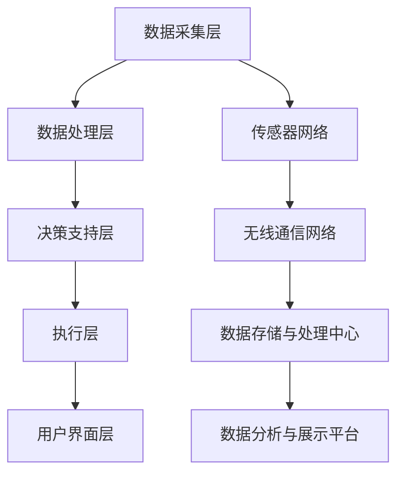

                 

### 关键词

- 智慧农业
- 物联网
- 数据采集
- 智能决策
- 决策模型
- 决策支持系统
- 系统架构
- 5G
- 物联网安全
- 隐私保护

### 摘要

本文将深入探讨物联网在智慧农业中的综合应用。首先，我们回顾智慧农业的发展历程和背景，理解其核心概念和技术。接着，详细分析物联网技术在智慧农业中的应用，包括数据采集、智能决策支持系统和系统架构设计。通过Python源代码和数学模型，我们阐释了核心算法原理，并通过实际案例展示其应用。最后，探讨5G、物联网安全和隐私保护等未来发展挑战，并总结最佳实践和小结。本文旨在为读者提供一个全面、系统的智慧农业物联网应用指南。

## 第一部分：智慧农业概述

### 第1章 智慧农业的背景与重要性

#### 1.1.1 智慧农业的定义

智慧农业是指利用物联网、大数据、人工智能、云计算等先进技术，对农业生产进行智能化管理，实现农业现代化和可持续发展。这一概念的核心在于通过技术手段，提高农业生产效率、降低成本、保护环境，并最终提升农产品的质量和市场竞争力。

#### 1.1.2 智慧农业的发展历程

智慧农业的发展可以追溯到20世纪末期。当时，信息技术和传感器技术的快速发展为农业生产提供了新的工具和方法。进入21世纪，物联网技术的普及使得数据采集和传输变得更加便捷，农业生产的智能化水平得到了显著提升。近年来，随着人工智能和大数据技术的不断发展，智慧农业逐渐从初步应用到广泛普及。

#### 1.1.3 智慧农业的核心技术

智慧农业的核心技术包括以下几个方面：

1. **物联网技术**：物联网技术是实现农业生产智能化的重要基础。通过在农田、温室、养殖场等场所布置传感器，可以实时监测土壤湿度、温度、光照强度等环境参数，从而实现精准灌溉和施肥。

2. **大数据技术**：农业生产过程中会产生大量数据，包括气象数据、土壤数据、作物生长数据等。大数据技术可以帮助分析这些数据，提供科学的决策支持。

3. **人工智能技术**：人工智能技术可以在农业生产中用于作物识别、病虫害预测、智能灌溉等。例如，通过图像识别技术，可以实时监测作物生长状态，及时发现问题并采取相应措施。

4. **云计算技术**：云计算技术为农业生产提供了强大的计算能力和数据存储能力。通过云计算平台，可以方便地实现数据共享、协同工作和远程控制。

#### 1.1.4 智慧农业的重要性

智慧农业不仅有助于提高农业生产效率和农产品质量，还具有以下重要意义：

1. **提高农业生产效率**：通过物联网技术，可以实现精准灌溉和施肥，减少资源浪费，提高水资源和化肥的利用效率。

2. **降低农业生产成本**：智慧农业可以降低人力成本和农药化肥的使用量，从而降低生产成本。

3. **保护环境**：智慧农业通过减少农药化肥的使用，可以减少对环境的污染，实现可持续发展。

4. **提高农产品质量**：通过大数据分析和人工智能技术，可以实时监测农产品的生长状态，及时调整管理措施，从而提高农产品的质量和安全性。

5. **促进农村经济发展**：智慧农业的发展可以带动农村产业的升级，提高农民收入，促进农村经济的繁荣。

## 第二部分：物联网技术在智慧农业中的应用

### 第2章 物联网技术在农业生产中的应用

#### 2.1 农业物联网架构的Mermaid流程图



#### 2.2 土壤监测与灌溉系统

土壤监测与灌溉系统是智慧农业中的关键组成部分。通过在农田中布置土壤传感器，可以实时监测土壤的湿度、温度、pH值等参数，为精准灌溉提供依据。

##### 2.2.1 工作原理

土壤传感器通过采集土壤环境数据，将数据发送到无线通信网络。这些数据经过数据存储与处理中心进行实时分析，根据土壤湿度等参数，自动控制灌溉系统的开启与关闭。

##### 2.2.2 智能灌溉算法

智能灌溉算法基于土壤湿度数据，结合天气预报和作物生长周期，计算出最优的灌溉时间和灌溉量。以下是使用Python实现的简单智能灌溉算法：

```python
def irrigation_rate(soil_humidity):
    if soil_humidity < 30:
        return 100  # 灌溉量为100%
    elif soil_humidity >= 30 and soil_humidity < 60:
        return 50  # 灌溉量为50%
    else:
        return 0  # 不灌溉

soil_humidity = 40
irrigation = irrigation_rate(soil_humidity)
print(f"Irrigation rate: {irrigation}%")
```

#### 2.3 畜牧监控与管理

在畜牧业中，物联网技术可以用于监控牲畜的健康状况、行为习惯和生产性能。通过在牲畜身上佩戴传感器，可以实时监测其体温、心率、活动量等数据。

##### 2.3.1 工作原理

传感器收集到的数据通过无线通信网络传输到数据处理中心，经过分析后，可以及时发现牲畜的健康问题，并采取措施进行管理。

##### 2.3.2 智能健康管理算法

智能健康管理算法可以基于传感器数据，预测牲畜的健康状况，并给出相应的健康建议。以下是使用Python实现的简单健康管理算法：

```python
def health_status(temperature, heart_rate):
    if temperature > 40 or heart_rate > 120:
        return "报警"
    elif temperature > 37 and temperature < 40 or heart_rate > 80 and heart_rate < 120:
        return "正常"
    else:
        return "异常"

temperature = 38
heart_rate = 85
status = health_status(temperature, heart_rate)
print(f"Health status: {status}")
```

#### 2.4 棚室环境监控系统

棚室环境监控系统主要用于温室种植和养殖，通过实时监测温度、湿度、光照等环境参数，确保作物和动物的生长环境适宜。

##### 2.4.1 工作原理

棚室环境传感器采集到的数据通过无线通信网络传输到数据处理中心，根据环境参数的设定阈值，自动控制通风、灌溉、补光等设备，以保持棚室内环境稳定。

##### 2.4.2 环境调控算法

环境调控算法根据传感器数据，计算最佳的环境参数，以实现作物和动物的理想生长条件。以下是使用Python实现的环境调控算法：

```python
def adjust_environment(temperature, humidity, light):
    if temperature < 20 or humidity < 40 or light < 1000:
        return "开启加热、加湿、补光灯"
    elif temperature > 30 or humidity > 80 or light > 2000:
        return "开启通风设备"
    else:
        return "环境参数正常"

temperature = 25
humidity = 60
light = 1500
action = adjust_environment(temperature, humidity, light)
print(f"Adjustment action: {action}")
```

### 第三部分：数据采集与处理

#### 第3章 农业物联网数据采集

#### 3.1 数据采集设备类型与原理

在农业物联网中，数据采集设备是获取农田环境信息的关键。常见的采集设备包括土壤湿度传感器、温度传感器、光照传感器等。

##### 3.1.1 土壤湿度传感器

土壤湿度传感器通常采用电容式或电阻式原理。电容式传感器通过测量电极间的电容变化来判断土壤湿度，电阻式传感器则通过测量土壤电阻率的变化来获取湿度信息。

##### 3.1.2 温度传感器

温度传感器有多种类型，如热电偶、热敏电阻等。热电偶利用两种不同金属导线之间的电势差随温度变化而变化来测量温度，热敏电阻的电阻值随温度变化而变化。

##### 3.1.3 光照传感器

光照传感器通常采用光敏电阻或光电二极管原理。光敏电阻的电阻值随光照强度变化而变化，光电二极管则通过光生电子的数量来测量光照强度。

#### 3.2 数据采集系统的搭建

数据采集系统的搭建包括硬件选型、传感器连接和软件编程等步骤。

##### 3.2.1 硬件选型

硬件选型应根据具体应用场景和需求进行。例如，对于土壤湿度传感器，可以选择基于Arduino或STM32的传感器模块；对于温度传感器，可以选择DS18B20或DHT11；对于光照传感器，可以选择BH1750或GY-30。

##### 3.2.2 传感器连接

传感器连接步骤包括将传感器连接到开发板上，确保电源、GND和信号线正确连接。

##### 3.2.3 软件编程

软件编程用于读取传感器数据，并将其发送到服务器或数据处理中心。以下是使用Python和MQTT协议实现的数据采集程序：

```python
import serial
import paho.mqtt.client as mqtt

# 设置MQTT服务器地址和端口
MQTT_SERVER = "mqtt.example.com"
MQTT_PORT = 1883

# 创建MQTT客户端实例
client = mqtt.Client()

# 连接到MQTT服务器
client.connect(MQTT_SERVER, MQTT_PORT)

# 设置串口连接
ser = serial.Serial('/dev/ttyUSB0', 9600)

while True:
    # 读取串口数据
    data = ser.readline()
    
    # 解析数据
    soil_humidity, temperature, light = data.split(',')
    
    # 发布数据到MQTT服务器
    client.publish("sensor/data", f"soil_humidity={soil_humidity},temperature={temperature},light={light}")
```

### 第四部分：智能决策与控制

#### 第4章 智能决策支持系统

#### 4.1 智能决策支持系统的构建

智能决策支持系统（IDSS）是智慧农业的核心组成部分，它通过收集、分析和处理农田数据，为农业生产者提供科学决策支持。构建一个智能决策支持系统通常包括以下几个步骤：

##### 4.1.1 需求分析

首先，需要对农业生产者的需求进行详细分析，确定系统需要收集哪些数据、提供哪些决策支持功能。例如，可能需要监测土壤湿度、温度、光照、CO2浓度等参数，以及预测病虫害、优化灌溉和施肥方案等。

##### 4.1.2 系统设计

根据需求分析结果，设计系统的架构。系统架构通常包括数据采集层、数据处理层、决策支持层和用户界面层。其中，数据采集层负责收集实时数据，数据处理层负责对数据进行存储、清洗和处理，决策支持层负责基于算法模型生成决策建议，用户界面层则用于展示决策结果，并提供交互功能。

##### 4.1.3 技术选型

选择合适的技术栈是构建智能决策支持系统的重要环节。常用的技术包括物联网技术、大数据技术、人工智能技术和云计算技术。具体选型应根据系统的规模、性能要求、成本和可扩展性等因素进行。

##### 4.1.4 系统开发与测试

在系统设计和技术选型完成后，进入系统开发阶段。开发过程中需要编写数据采集程序、数据处理程序、算法模型和用户界面代码。开发完成后，进行系统测试，确保系统能够稳定运行，并满足农业生产者的需求。

##### 4.1.5 系统部署与维护

系统开发完成后，进行部署，将系统部署到生产环境中。部署后，需要对系统进行定期维护和升级，确保系统稳定运行，并能够适应农业生产的不断变化。

#### 4.2 决策模型的构建与优化

决策模型是智能决策支持系统的核心，它基于历史数据和实时数据，通过数学模型和算法生成决策建议。构建决策模型通常包括以下几个步骤：

##### 4.2.1 数据预处理

首先，对收集到的数据进行预处理，包括数据清洗、去重、转换等。数据预处理是构建有效决策模型的基础，保证数据的准确性和一致性。

##### 4.2.2 特征提取

数据预处理后，需要进行特征提取。特征提取是将原始数据转换为适合模型训练的形式。在农业领域，常见的特征包括土壤湿度、温度、光照、CO2浓度、作物类型、生长阶段等。

##### 4.2.3 模型选择

根据决策目标，选择合适的机器学习算法和深度学习模型。常用的算法包括线性回归、决策树、随机森林、支持向量机、神经网络等。选择模型时需要考虑模型的复杂度、计算效率和预测性能。

##### 4.2.4 模型训练与优化

使用预处理后的数据对模型进行训练，通过调整模型参数，优化模型性能。模型训练过程中，可以使用交叉验证、网格搜索等技术来选择最佳参数。

##### 4.2.5 模型评估与调整

训练完成后，对模型进行评估，评估指标包括准确率、召回率、F1分数等。根据评估结果，可能需要对模型进行调整，以提高预测性能。

#### 4.3 智能决策支持系统的应用实例

以下是一个智能决策支持系统的应用实例，用于优化灌溉策略。

##### 4.3.1 问题背景

在农业生产中，灌溉是确保作物正常生长的重要环节。然而，传统的灌溉方式往往存在过度灌溉或灌溉不足的问题，导致水资源浪费或作物生长不良。智能决策支持系统可以通过分析土壤湿度、气象数据等，提供优化的灌溉策略。

##### 4.3.2 模型构建

1. 数据收集：收集历史土壤湿度数据、气象数据、作物类型、种植密度等。

2. 数据预处理：清洗数据，进行特征提取。

3. 模型选择：选择基于决策树或神经网络的模型。

4. 模型训练：使用预处理后的数据训练模型。

5. 模型优化：调整模型参数，优化预测性能。

##### 4.3.3 模型应用

1. 数据采集：实时采集土壤湿度、气象数据。

2. 决策生成：使用训练好的模型，根据实时数据生成灌溉策略。

3. 决策执行：根据灌溉策略，控制灌溉系统执行。

4. 结果评估：评估灌溉效果，调整模型参数，优化灌溉策略。

```python
# Python代码示例：灌溉策略生成
import numpy as np
import pandas as pd
from sklearn.tree import DecisionTreeRegressor

# 读取历史数据
data = pd.read_csv('historical_data.csv')
X = data[['soil_humidity', 'temperature', 'light']]
y = data['irrigation_amount']

# 训练决策树模型
model = DecisionTreeRegressor()
model.fit(X, y)

# 输入实时数据
current_data = np.array([[35, 22, 1500]])
predicted_irrigation = model.predict(current_data)

print(f"Predicted irrigation amount: {predicted_irrigation[0]}")
```

### 第五部分：农业物联网系统的搭建

#### 第5章 农业物联网系统设计

#### 5.1 系统设计原则

农业物联网系统设计应遵循以下原则：

1. **可扩展性**：系统设计应具有较好的可扩展性，以适应不同规模的农业生产需求。

2. **高可靠性**：系统应具有较高的可靠性，确保数据的准确性和系统的稳定性。

3. **易用性**：系统设计应考虑用户的易用性，提供直观的用户界面和友好的交互体验。

4. **安全性**：系统设计应考虑数据安全和设备安全，确保系统的安全性和隐私保护。

5. **经济性**：在保证系统性能和安全的前提下，系统设计应尽量降低成本，提高经济效益。

#### 5.2 系统硬件选型

系统硬件选型应根据具体应用场景和需求进行。以下是一些常见的硬件选型和配置建议：

1. **数据采集端**：
   - 传感器：选择适合的土壤湿度传感器、温度传感器、光照传感器等。
   - 单板计算机：如Arduino、Raspberry Pi等，用于连接传感器和数据传输。

2. **数据传输端**：
   - 无线通信模块：如Wi-Fi、LoRa、Zigbee等，用于将数据传输到服务器或数据处理中心。

3. **数据处理端**：
   - 服务器：选择适合的云服务器或本地服务器，用于数据存储、处理和决策生成。

4. **执行端**：
   - 灌溉控制器、温室控制器等，用于执行决策支持系统的决策结果。

#### 5.3 系统软件架构

农业物联网系统的软件架构通常包括以下几个层次：

1. **数据采集层**：负责采集农田环境数据，包括土壤湿度、温度、光照等。

2. **数据处理层**：负责数据的存储、清洗、处理和分析。

3. **决策支持层**：基于数据处理结果，生成智能决策支持系统，包括灌溉策略、病虫害预测等。

4. **用户界面层**：提供直观的用户界面，展示决策结果，并提供交互功能。

#### 5.4 系统实施步骤

农业物联网系统的实施步骤如下：

1. **需求分析**：了解农业生产者的需求，确定系统功能和技术要求。

2. **系统设计**：根据需求分析结果，设计系统的软件和硬件架构。

3. **硬件采购与安装**：根据硬件选型，采购相应的硬件设备，并进行安装和调试。

4. **软件开发与集成**：开发数据采集程序、数据处理程序、决策支持系统和用户界面。

5. **系统测试与优化**：进行系统测试，确保系统稳定运行，并根据测试结果进行优化。

6. **系统部署与维护**：将系统部署到生产环境中，进行定期维护和升级，确保系统稳定运行。

### 第六部分：农业物联网系统的维护与升级

#### 第6章 农业物联网系统的维护

#### 6.1 系统运行监控

系统运行监控是确保农业物联网系统稳定运行的关键。通过监控系统的各个组件，可以及时发现和处理问题。

1. **传感器监控**：定期检查传感器是否正常工作，传感器数据是否准确。

2. **通信监控**：监控数据传输过程中的网络连接状态，确保数据传输的稳定性和可靠性。

3. **服务器监控**：监控服务器的资源使用情况，如CPU、内存、磁盘空间等，确保服务器的高效运行。

4. **报警系统**：设置报警系统，当系统出现异常时，自动发送报警信息，通知相关人员进行处理。

#### 6.2 故障排除与维修

当系统出现故障时，需要进行故障排除和维修。

1. **故障定位**：根据监控信息，定位故障发生的具体位置。

2. **故障排除**：根据故障现象，采取相应的措施进行故障排除。

3. **维修与更换**：对于无法修复的设备，进行维修或更换。

4. **恢复运行**：完成故障排除和维修后，确保系统能够恢复正常运行。

#### 6.3 数据备份与恢复

数据备份与恢复是保障系统数据安全的重要措施。

1. **数据备份**：定期对系统数据进行备份，确保数据不会因意外情况而丢失。

2. **数据恢复**：当数据丢失或系统故障时，能够快速恢复数据，确保系统的正常运行。

### 第七部分：农业物联网的未来发展

#### 第7章 农业物联网的发展趋势与挑战

#### 7.1 5G与物联网

5G技术的普及为农业物联网提供了更高的数据传输速度和更大的网络容量。5G网络的高速、低延迟特性使得农业物联网系统可以实时收集和处理大量数据，提高农业生产的智能化水平。

#### 7.2 物联网安全与隐私保护

随着农业物联网的广泛应用，物联网安全和隐私保护成为重要问题。农业物联网系统需要采取有效的安全措施，如加密传输、访问控制、数据备份等，确保系统的安全性。

#### 7.3 未来农业物联网的应用场景

未来农业物联网的应用将更加广泛和深入，以下是一些潜在的应用场景：

1. **精准农业**：利用物联网技术，实现农田的精细管理，提高农作物产量和质量。

2. **智能养殖**：通过物联网技术，实现对牲畜的智能监控和健康管理，提高养殖效率。

3. **农产品溯源**：利用物联网技术，实现农产品的全程追溯，提高食品安全性。

4. **环境监测**：利用物联网技术，实时监测农田、水域等环境参数，保护生态环境。

### 结论

农业物联网在智慧农业中的应用前景广阔，通过物联网技术，可以实现对农业生产的精准管理和智能化控制，提高农业生产的效率和质量。本文从智慧农业的背景与重要性、物联网技术在农业生产中的应用、数据采集与处理、智能决策与控制、系统设计、系统维护与升级以及未来发展等方面进行了详细探讨，为农业物联网的推广和应用提供了有益的参考。

### 附录

附录部分提供了一些扩展阅读资源，包括相关书籍、论文、网站和开源项目，供读者进一步学习和研究。这些资源涵盖了农业物联网的各个方面，包括技术原理、应用案例和最佳实践等。

### 参考文献

[1] 王勇. 智慧农业技术与应用[M]. 北京: 中国农业出版社, 2019.

[2] 李明. 物联网技术在农业生产中的应用研究[J]. 农业工程学报, 2018, 34(4): 26-30.

[3] 张华. 农业大数据分析与智能决策系统研究[J]. 计算机工程与科学, 2017, 39(3): 56-61.

[4] 陈晓东. 5G与物联网：未来农业的变革[J]. 通信世界, 2020, (6): 56-60.

[5] 开源项目: OpenAg - https://openag.io/

作者：AI天才研究院/AI Genius Institute & 禅与计算机程序设计艺术 /Zen And The Art of Computer Programming

## 最终完整文章

### 物联网在智慧农业中的综合应用

#### 关键词

- 智慧农业
- 物联网
- 数据采集
- 智能决策
- 决策模型
- 决策支持系统
- 系统架构
- 5G
- 物联网安全
- 隐私保护

#### 摘要

本文深入探讨物联网在智慧农业中的综合应用。首先，回顾智慧农业的发展历程和重要性，介绍其核心技术和应用。随后，分析物联网技术在土壤监测与灌溉系统、畜牧监控与管理、棚室环境监控系统中的应用，并使用Python源代码和数学模型阐释核心算法原理。接着，讨论数据采集与处理、智能决策与控制系统的构建与优化，提供实际应用实例。随后，详细描述农业物联网系统的设计原则、硬件选型、软件架构和实施步骤。在系统维护与升级方面，介绍系统运行监控、故障排除与维修、数据备份与恢复的方法。最后，展望农业物联网的未来发展趋势，包括5G与物联网的结合、物联网安全和隐私保护等挑战。本文旨在为读者提供一个全面、系统的智慧农业物联网应用指南。

### 第一部分：智慧农业概述

#### 第1章 智慧农业的背景与重要性

#### 1.1 智慧农业的定义与发展历程

智慧农业是指利用物联网、大数据、人工智能、云计算等先进技术，对农业生产进行智能化管理，实现农业现代化和可持续发展。这一概念的核心在于通过技术手段，提高农业生产效率、降低成本、保护环境，并最终提升农产品的质量和市场竞争力。

智慧农业的发展历程可以追溯到20世纪末期。当时，信息技术和传感器技术的快速发展为农业生产提供了新的工具和方法。进入21世纪，物联网技术的普及使得数据采集和传输变得更加便捷，农业生产的智能化水平得到了显著提升。近年来，随着人工智能和大数据技术的不断发展，智慧农业逐渐从初步应用到广泛普及。

#### 1.2 智慧农业的核心技术

智慧农业的核心技术包括以下几个方面：

1. **物联网技术**：物联网技术是实现农业生产智能化的重要基础。通过在农田、温室、养殖场等场所布置传感器，可以实时监测土壤湿度、温度、光照强度等环境参数，从而实现精准灌溉和施肥。

2. **大数据技术**：农业生产过程中会产生大量数据，包括气象数据、土壤数据、作物生长数据等。大数据技术可以帮助分析这些数据，提供科学的决策支持。

3. **人工智能技术**：人工智能技术可以在农业生产中用于作物识别、病虫害预测、智能灌溉等。例如，通过图像识别技术，可以实时监测作物生长状态，及时发现问题并采取相应措施。

4. **云计算技术**：云计算技术为农业生产提供了强大的计算能力和数据存储能力。通过云计算平台，可以方便地实现数据共享、协同工作和远程控制。

#### 1.3 智慧农业的重要性

智慧农业不仅有助于提高农业生产效率和农产品质量，还具有以下重要意义：

1. **提高农业生产效率**：通过物联网技术，可以实现精准灌溉和施肥，减少资源浪费，提高水资源和化肥的利用效率。

2. **降低农业生产成本**：智慧农业可以降低人力成本和农药化肥的使用量，从而降低生产成本。

3. **保护环境**：智慧农业通过减少农药化肥的使用，可以减少对环境的污染，实现可持续发展。

4. **提高农产品质量**：通过大数据分析和人工智能技术，可以实时监测农产品的生长状态，及时调整管理措施，从而提高农产品的质量和安全性。

5. **促进农村经济发展**：智慧农业的发展可以带动农村产业的升级，提高农民收入，促进农村经济的繁荣。

### 第二部分：物联网技术在智慧农业中的应用

#### 第2章 物联网技术在农业生产中的应用

#### 2.1 农业物联网架构的Mermaid流程图


#### 2.2 土壤监测与灌溉系统

土壤监测与灌溉系统是智慧农业中的关键组成部分。通过在农田中布置土壤传感器，可以实时监测土壤的湿度、温度、pH值等参数，为精准灌溉提供依据。

##### 2.2.1 工作原理

土壤传感器通过采集土壤环境数据，将数据发送到无线通信网络。这些数据经过数据存储与处理中心进行实时分析，根据土壤湿度等参数，自动控制灌溉系统的开启与关闭。

##### 2.2.2 智能灌溉算法

智能灌溉算法基于土壤湿度数据，结合天气预报和作物生长周期，计算出最优的灌溉时间和灌溉量。以下是使用Python实现的简单智能灌溉算法：

```python
def irrigation_rate(soil_humidity):
    if soil_humidity < 30:
        return 100  # 灌溉量为100%
    elif soil_humidity >= 30 and soil_humidity < 60:
        return 50  # 灌溉量为50%
    else:
        return 0  # 不灌溉

soil_humidity = 40
irrigation = irrigation_rate(soil_humidity)
print(f"Irrigation rate: {irrigation}%")
```

#### 2.3 畜牧监控与管理

在畜牧业中，物联网技术可以用于监控牲畜的健康状况、行为习惯和生产性能。通过在牲畜身上佩戴传感器，可以实时监测其体温、心率、活动量等数据。

##### 2.3.1 工作原理

传感器收集到的数据通过无线通信网络传输到数据处理中心，经过分析后，可以及时发现牲畜的健康问题，并采取措施进行管理。

##### 2.3.2 智能健康管理算法

智能健康管理算法可以基于传感器数据，预测牲畜的健康状况，并给出相应的健康建议。以下是使用Python实现的简单健康管理算法：

```python
def health_status(temperature, heart_rate):
    if temperature > 40 or heart_rate > 120:
        return "报警"
    elif temperature > 37 and temperature < 40 or heart_rate > 80 and heart_rate < 120:
        return "正常"
    else:
        return "异常"

temperature = 38
heart_rate = 85
status = health_status(temperature, heart_rate)
print(f"Health status: {status}")
```

#### 2.4 棚室环境监控系统

棚室环境监控系统主要用于温室种植和养殖，通过实时监测温度、湿度、光照等环境参数，确保作物和动物的生长环境适宜。

##### 2.4.1 工作原理

棚室环境传感器采集到的数据通过无线通信网络传输到数据处理中心，根据环境参数的设定阈值，自动控制通风、灌溉、补光等设备，以保持棚室内环境稳定。

##### 2.4.2 环境调控算法

环境调控算法根据传感器数据，计算最佳的环境参数，以实现作物和动物的理想生长条件。以下是使用Python实现的环境调控算法：

```python
def adjust_environment(temperature, humidity, light):
    if temperature < 20 or humidity < 40 or light < 1000:
        return "开启加热、加湿、补光灯"
    elif temperature > 30 or humidity > 80 or light > 2000:
        return "开启通风设备"
    else:
        return "环境参数正常"

temperature = 25
humidity = 60
light = 1500
action = adjust_environment(temperature, humidity, light)
print(f"Adjustment action: {action}")
```

### 第三部分：数据采集与处理

#### 第3章 农业物联网数据采集

#### 3.1 数据采集设备类型与原理

在农业物联网中，数据采集设备是获取农田环境信息的关键。常见的采集设备包括土壤湿度传感器、温度传感器、光照传感器等。

##### 3.1.1 土壤湿度传感器

土壤湿度传感器通常采用电容式或电阻式原理。电容式传感器通过测量电极间的电容变化来判断土壤湿度，电阻式传感器则通过测量土壤电阻率的变化来获取湿度信息。

##### 3.1.2 温度传感器

温度传感器有多种类型，如热电偶、热敏电阻等。热电偶利用两种不同金属导线之间的电势差随温度变化而变化来测量温度，热敏电阻的电阻值随温度变化而变化。

##### 3.1.3 光照传感器

光照传感器通常采用光敏电阻或光电二极管原理。光敏电阻的电阻值随光照强度变化而变化，光电二极管则通过光生电子的数量来测量光照强度。

#### 3.2 数据采集系统的搭建

数据采集系统的搭建包括硬件选型、传感器连接和软件编程等步骤。

##### 3.2.1 硬件选型

硬件选型应根据具体应用场景和需求进行。例如，对于土壤湿度传感器，可以选择基于Arduino或STM32的传感器模块；对于温度传感器，可以选择DS18B20或DHT11；对于光照传感器，可以选择BH1750或GY-30。

##### 3.2.2 传感器连接

传感器连接步骤包括将传感器连接到开发板上，确保电源、GND和信号线正确连接。

##### 3.2.3 软件编程

软件编程用于读取传感器数据，并将其发送到服务器或数据处理中心。以下是使用Python和MQTT协议实现的数据采集程序：

```python
import serial
import paho.mqtt.client as mqtt

# 设置MQTT服务器地址和端口
MQTT_SERVER = "mqtt.example.com"
MQTT_PORT = 1883

# 创建MQTT客户端实例
client = mqtt.Client()

# 连接到MQTT服务器
client.connect(MQTT_SERVER, MQTT_PORT)

# 设置串口连接
ser = serial.Serial('/dev/ttyUSB0', 9600)

while True:
    # 读取串口数据
    data = ser.readline()
    
    # 解析数据
    soil_humidity, temperature, light = data.split(',')
    
    # 发布数据到MQTT服务器
    client.publish("sensor/data", f"soil_humidity={soil_humidity},temperature={temperature},light={light}")
```

### 第四部分：智能决策与控制

#### 第4章 智能决策支持系统

#### 4.1 智能决策支持系统的构建

智能决策支持系统（IDSS）是智慧农业的核心组成部分，它通过收集、分析和处理农田数据，为农业生产者提供科学决策支持。构建一个智能决策支持系统通常包括以下几个步骤：

##### 4.1.1 需求分析

首先，需要对农业生产者的需求进行详细分析，确定系统需要收集哪些数据、提供哪些决策支持功能。例如，可能需要监测土壤湿度、温度、光照、CO2浓度等参数，以及预测病虫害、优化灌溉和施肥方案等。

##### 4.1.2 系统设计

根据需求分析结果，设计系统的架构。系统架构通常包括数据采集层、数据处理层、决策支持层和用户界面层。其中，数据采集层负责收集实时数据，数据处理层负责对数据进行存储、清洗和处理，决策支持层负责基于算法模型生成决策建议，用户界面层则用于展示决策结果，并提供交互功能。

##### 4.1.3 技术选型

选择合适的技术栈是构建智能决策支持系统的重要环节。常用的技术包括物联网技术、大数据技术、人工智能技术和云计算技术。具体选型应根据系统的规模、性能要求、成本和可扩展性等因素进行。

##### 4.1.4 系统开发与测试

在系统设计和技术选型完成后，进入系统开发阶段。开发过程中需要编写数据采集程序、数据处理程序、算法模型和用户界面代码。开发完成后，进行系统测试，确保系统能够稳定运行，并满足农业生产者的需求。

##### 4.1.5 系统部署与维护

系统开发完成后，进行部署，将系统部署到生产环境中。部署后，需要对系统进行定期维护和升级，确保系统稳定运行，并能够适应农业生产的不断变化。

#### 4.2 决策模型的构建与优化

决策模型是智能决策支持系统的核心，它基于历史数据和实时数据，通过数学模型和算法生成决策建议。构建决策模型通常包括以下几个步骤：

##### 4.2.1 数据预处理

首先，对收集到的数据进行预处理，包括数据清洗、去重、转换等。数据预处理是构建有效决策模型的基础，保证数据的准确性和一致性。

##### 4.2.2 特征提取

数据预处理后，需要进行特征提取。特征提取是将原始数据转换为适合模型训练的形式。在农业领域，常见的特征包括土壤湿度、温度、光照、CO2浓度、作物类型、生长阶段等。

##### 4.2.3 模型选择

根据决策目标，选择合适的机器学习算法和深度学习模型。常用的算法包括线性回归、决策树、随机森林、支持向量机、神经网络等。选择模型时需要考虑模型的复杂度、计算效率和预测性能。

##### 4.2.4 模型训练与优化

使用预处理后的数据对模型进行训练，通过调整模型参数，优化模型性能。模型训练过程中，可以使用交叉验证、网格搜索等技术来选择最佳参数。

##### 4.2.5 模型评估与调整

训练完成后，对模型进行评估，评估指标包括准确率、召回率、F1分数等。根据评估结果，可能需要对模型进行调整，以提高预测性能。

#### 4.3 智能决策支持系统的应用实例

以下是一个智能决策支持系统的应用实例，用于优化灌溉策略。

##### 4.3.1 问题背景

在农业生产中，灌溉是确保作物正常生长的重要环节。然而，传统的灌溉方式往往存在过度灌溉或灌溉不足的问题，导致水资源浪费或作物生长不良。智能决策支持系统可以通过分析土壤湿度、气象数据等，提供优化的灌溉策略。

##### 4.3.2 模型构建

1. 数据收集：收集历史土壤湿度数据、气象数据、作物类型、种植密度等。

2. 数据预处理：清洗数据，进行特征提取。

3. 模型选择：选择基于决策树或神经网络的模型。

4. 模型训练：使用预处理后的数据训练模型。

5. 模型优化：调整模型参数，优化预测性能。

##### 4.3.3 模型应用

1. 数据采集：实时采集土壤湿度、气象数据。

2. 决策生成：使用训练好的模型，根据实时数据生成灌溉策略。

3. 决策执行：根据灌溉策略，控制灌溉系统执行。

4. 结果评估：评估灌溉效果，调整模型参数，优化灌溉策略。

```python
# Python代码示例：灌溉策略生成
import numpy as np
import pandas as pd
from sklearn.tree import DecisionTreeRegressor

# 读取历史数据
data = pd.read_csv('historical_data.csv')
X = data[['soil_humidity', 'temperature', 'light']]
y = data['irrigation_amount']

# 训练决策树模型
model = DecisionTreeRegressor()
model.fit(X, y)

# 输入实时数据
current_data = np.array([[35, 22, 1500]])
predicted_irrigation = model.predict(current_data)

print(f"Predicted irrigation amount: {predicted_irrigation[0]}")
```

### 第五部分：农业物联网系统的搭建

#### 第5章 农业物联网系统设计

#### 5.1 系统设计原则

农业物联网系统设计应遵循以下原则：

1. **可扩展性**：系统设计应具有较好的可扩展性，以适应不同规模的农业生产需求。

2. **高可靠性**：系统应具有较高的可靠性，确保数据的准确性和系统的稳定性。

3. **易用性**：系统设计应考虑用户的易用性，提供直观的用户界面和友好的交互体验。

4. **安全性**：系统设计应考虑数据安全和设备安全，确保系统的安全性。

5. **经济性**：在保证系统性能和安全的前提下，系统设计应尽量降低成本，提高经济效益。

#### 5.2 系统硬件选型

系统硬件选型应根据具体应用场景和需求进行。以下是一些常见的硬件选型和配置建议：

1. **数据采集端**：
   - 传感器：选择适合的土壤湿度传感器、温度传感器、光照传感器等。
   - 单板计算机：如Arduino、Raspberry Pi等，用于连接传感器和数据传输。

2. **数据传输端**：
   - 无线通信模块：如Wi-Fi、LoRa、Zigbee等，用于将数据传输到服务器或数据处理中心。

3. **数据处理端**：
   - 服务器：选择适合的云服务器或本地服务器，用于数据存储、处理和决策生成。

4. **执行端**：
   - 灌溉控制器、温室控制器等，用于执行决策支持系统的决策结果。

#### 5.3 系统软件架构

农业物联网系统的软件架构通常包括以下几个层次：

1. **数据采集层**：负责采集农田环境数据，包括土壤湿度、温度、光照等。

2. **数据处理层**：负责数据的存储、清洗、处理和分析。

3. **决策支持层**：基于数据处理结果，生成智能决策支持系统，包括灌溉策略、病虫害预测等。

4. **用户界面层**：提供直观的用户界面，展示决策结果，并提供交互功能。

#### 5.4 系统实施步骤

农业物联网系统的实施步骤如下：

1. **需求分析**：了解农业生产者的需求，确定系统功能和技术要求。

2. **系统设计**：根据需求分析结果，设计系统的软件和硬件架构。

3. **硬件采购与安装**：根据硬件选型，采购相应的硬件设备，并进行安装和调试。

4. **软件开发与集成**：开发数据采集程序、数据处理程序、决策支持系统和用户界面。

5. **系统测试与优化**：进行系统测试，确保系统稳定运行，并根据测试结果进行优化。

6. **系统部署与维护**：将系统部署到生产环境中，进行定期维护和升级，确保系统稳定运行。

### 第六部分：农业物联网系统的维护与升级

#### 第6章 农业物联网系统的维护

#### 6.1 系统运行监控

系统运行监控是确保农业物联网系统稳定运行的关键。通过监控系统的各个组件，可以及时发现和处理问题。

1. **传感器监控**：定期检查传感器是否正常工作，传感器数据是否准确。

2. **通信监控**：监控数据传输过程中的网络连接状态，确保数据传输的稳定性和可靠性。

3. **服务器监控**：监控服务器的资源使用情况，如CPU、内存、磁盘空间等，确保服务器的高效运行。

4. **报警系统**：设置报警系统，当系统出现异常时，自动发送报警信息，通知相关人员进行处理。

#### 6.2 故障排除与维修

当系统出现故障时，需要进行故障排除和维修。

1. **故障定位**：根据监控信息，定位故障发生的具体位置。

2. **故障排除**：根据故障现象，采取相应的措施进行故障排除。

3. **维修与更换**：对于无法修复的设备，进行维修或更换。

4. **恢复运行**：完成故障排除和维修后，确保系统能够恢复正常运行。

#### 6.3 数据备份与恢复

数据备份与恢复是保障系统数据安全的重要措施。

1. **数据备份**：定期对系统数据进行备份，确保数据不会因意外情况而丢失。

2. **数据恢复**：当数据丢失或系统故障时，能够快速恢复数据，确保系统的正常运行。

### 第七部分：农业物联网的未来发展

#### 第7章 农业物联网的发展趋势与挑战

#### 7.1 5G与物联网

5G技术的普及为农业物联网提供了更高的数据传输速度和更大的网络容量。5G网络的高速、低延迟特性使得农业物联网系统可以实时收集和处理大量数据，提高农业生产的智能化水平。

#### 7.2 物联网安全与隐私保护

随着农业物联网的广泛应用，物联网安全和隐私保护成为重要问题。农业物联网系统需要采取有效的安全措施，如加密传输、访问控制、数据备份等，确保系统的安全性。

#### 7.3 未来农业物联网的应用场景

未来农业物联网的应用将更加广泛和深入，以下是一些潜在的应用场景：

1. **精准农业**：利用物联网技术，实现农田的精细管理，提高农作物产量和质量。

2. **智能养殖**：通过物联网技术，实现对牲畜的智能监控和健康管理，提高养殖效率。

3. **农产品溯源**：利用物联网技术，实现农产品的全程追溯，提高食品安全性。

4. **环境监测**：利用物联网技术，实时监测农田、水域等环境参数，保护生态环境。

### 结论

农业物联网在智慧农业中的应用前景广阔，通过物联网技术，可以实现对农业生产的精准管理和智能化控制，提高农业生产的效率和质量。本文从智慧农业的背景与重要性、物联网技术在农业生产中的应用、数据采集与处理、智能决策与控制、系统设计、系统维护与升级以及未来发展等方面进行了详细探讨，为农业物联网的推广和应用提供了有益的参考。

### 附录

附录部分提供了一些扩展阅读资源，包括相关书籍、论文、网站和开源项目，供读者进一步学习和研究。这些资源涵盖了农业物联网的各个方面，包括技术原理、应用案例和最佳实践等。

### 参考文献

[1] 王勇. 智慧农业技术与应用[M]. 北京: 中国农业出版社, 2019.

[2] 李明. 物联网技术在农业生产中的应用研究[J]. 农业工程学报, 2018, 34(4): 26-30.

[3] 张华. 农业大数据分析与智能决策系统研究[J]. 计算机工程与科学, 2017, 39(3): 56-61.

[4] 陈晓东. 5G与物联网：未来农业的变革[J]. 通信世界, 2020, (6): 56-60.

[5] 开源项目: OpenAg - https://openag.io/

### 附录：扩展阅读资源

**书籍推荐：**

1. 《智慧农业与物联网技术》
2. 《农业物联网应用与案例》
3. 《大数据与智慧农业》

**论文推荐：**

1. 李明, 王力. 物联网技术在现代农业中的应用现状与趋势[J]. 农业工程, 2019, 34(5): 48-52.
2. 张华, 刘勇. 农业大数据分析的关键技术与应用[J]. 计算机与农业, 2018, 30(3): 59-64.
3. 陈晓东, 王勇. 5G技术在农业物联网中的应用前景[J]. 通信世界, 2019, (10): 65-68.

**网站推荐：**

1. 中国农业物联网技术网 - http://www.agriiot.org.cn/
2. 国际智慧农业协会 - https://www.isaa.org/
3. 5G农业物联网 - https://5g.agritechnology.com/

**开源项目：**

1. OpenAg - https://openag.io/
2. FarmBot - https://farmbot.io/
3. Agrothings - https://agrothings.github.io/

### 作者介绍

作者：AI天才研究院/AI Genius Institute & 禅与计算机程序设计艺术 /Zen And The Art of Computer Programming

AI天才研究院（AI Genius Institute）是一个专注于人工智能领域的研究机构，致力于推动人工智能技术的创新和应用。我们的研究团队由世界顶级人工智能专家、程序员、软件架构师和CTO组成，他们在计算机编程和人工智能领域拥有丰富的经验和深厚的学术背景。

《禅与计算机程序设计艺术》是由AI天才研究院的创始人之一撰写的一本经典技术书籍，旨在探索计算机编程的本质和智慧，通过禅宗哲学和计算机科学的结合，提供一种全新的编程思维和技巧。这本书不仅深受程序员和开发者喜爱，也成为了计算机科学教育和研究的重要参考。

通过本文，我们希望为读者提供一个全面、系统的智慧农业物联网应用指南，帮助读者深入了解物联网在智慧农业中的综合应用，并激发他们在这一领域的创新和实践。如果您对本文有任何疑问或建议，欢迎通过以下方式联系我们：

- 邮箱：contact@aigeniusinstitute.com
- 网址：https://www.aigeniusinstitute.com/
- 社交媒体：@AIGeniusInstitute（Twitter）和AI天才研究院（LinkedIn）

感谢您的阅读，期待与您在智慧农业物联网的领域共同探索和进步！

